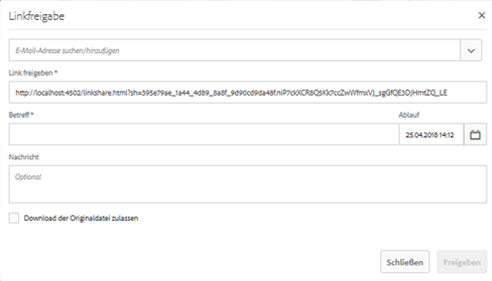

# Asset über einen Link freigeben {#asset-link-sharing}

>[!CAUTION]
>
>AEM 6.4 hat das Ende der erweiterten Unterstützung erreicht und diese Dokumentation wird nicht mehr aktualisiert. Weitere Informationen finden Sie in unserer [technische Unterstützung](https://helpx.adobe.com/de/support/programs/eol-matrix.html). Unterstützte Versionen suchen [here](https://experienceleague.adobe.com/docs/?lang=de).

[!DNL Adobe Experience Manager Assets]Mit können Sie Assets, Ordner und Sammlungen als URL für Mitglieder Ihres Unternehmens und externe Einheiten (z. B. Partner und Anbieter) freigeben. Die Freigabe von Assets über einen Link ist eine praktische Methode, um Ressourcen für externe Parteien verfügbar zu machen, ohne dass sich diese zunächst bei [!DNL Assets] anmelden müssen.

>[!PREREQUISITES]
>
>* Sie benötigen die Berechtigung ACL bearbeiten für den Ordner oder das Asset, das Sie als Link freigeben möchten.
>* Um E-Mails an Benutzerinnen und Benutzer zu senden, konfigurieren Sie die SMTP-Serverdetails unter [Day CQ Mail Service](#configmailservice).

## Freigeben von Assets {#share-assets}

Die URL für Assets, die Sie freigeben möchten, generieren Sie im Dialogfeld Linkfreigabe. Benutzer mit Administratorrechten oder mit Leserechten für den Speicherort `/var/dam/share` können dann die Links sehen, die für sie freigegeben sind.

1. Wählen Sie in der [!DNL Assets]-Benutzeroberfläche das Asset aus, das als Link freigegeben werden soll.
1. Klicken Sie auf der Symbolleiste auf **[!UICONTROL Link freigeben]** . Der Link, der nach dem Klicken auf **[!UICONTROL Freigeben]** generiert wird, wird im Feld [!UICONTROL Link freigeben] im Voraus angezeigt. Der Link wird erst erstellt, wenn Sie auf **[!UICONTROL Einsenden]**.

   

   *Abbildung: Das Dialogfeld zum Freigeben von Assets als Link.*

1. Geben Sie im Dialogfeld **[!UICONTROL Linkfreigabe]** in das Feld „E-Mail-Adresse“ die E-Mail-ID der Benutzerinnen und Benutzer ein, für die Sie den Link freigeben möchten. Sie können eine(n) oder mehrere Benutzerinnen und Benutzer hinzufügen.

   

   *Abbildung: Links zu Assets direkt über die [!UICONTROL Linkfreigabe] angezeigt.*

   >[!NOTE]
   >
   >Wenn Sie die E-Mail-ID von Benutzerinnen und Benutzern eingeben, die nicht zu Ihrem Unternehmen gehören, wird die E-Mail-ID den Worten [!UICONTROL Externer Benutzer] vorangestellt.

1. Im **[!UICONTROL Betreff]** Geben Sie einen Betreff für das Asset ein, das Sie freigeben möchten.
1. Im **[!UICONTROL Nachricht]** eine optionale Meldung eingeben.

1. Geben Sie im Feld **[!UICONTROL Ablauf]** ein Ablaufdatum und eine Ablaufuhrzeit für den Link an. Die Standard-Ablaufzeit für den Link beträgt einen Tag.

   

1. Damit Benutzer das Original-Asset zusammen mit den Ausgabeformaten herunterladen können, wählen Sie **[!UICONTROL Download der Originaldatei zulassen]**. Standardmäßig können Benutzer nur die Ausgabeformate des Assets herunterladen, das Sie als Link freigeben.

1. Klicken Sie auf **[!UICONTROL Freigeben]**. Eine Meldung bestätigt, dass der Link per E-Mail für die jeweiligen Benutzerinnen und Benutzer freigegeben wurde.

1. Um das freigegebene Asset anzeigen, klicken Sie auf den Link in der E-Mail, die den Benutzerinnen und Benutzern gesendet wurde. Um eine Vorschau des Assets zu generieren, klicken Sie auf das freigegebene Asset. Um die Vorschau zu schließen, klicken Sie auf **[!UICONTROL Zurück]**. Wenn Sie einen Ordner freigegeben haben, klicken Sie auf **[!UICONTROL Übergeordneter Ordner]**, um zum übergeordneten Ordner zurückzukehren.

   

   >[!NOTE]
   >
   >[!DNL Experience Manager] unterstützt nur das Generieren einer Asset-Vorschau von unterstützten Dateitypen. Wenn andere MIME-Typen freigegeben werden, können Sie die Assets nur herunterladen, aber keine Vorschau anzeigen.

1. Zum Herunterladen des freigegebenen Assets klicken Sie auf der Symbolleiste auf **[!UICONTROL Auswählen]**, anschließend auf das Asset und dann auf **[!UICONTROL Herunterladen]** auf der Symbolleiste.

   

1. Um die Assets anzuzeigen, die Sie als Links freigegeben haben, gehen Sie zu [!DNL Assets] und klicken Sie auf das [!DNL Experience Manager]-Logo. Wählen Sie **[!UICONTROL Navigation]**. Wählen Sie im Navigationsbereich die Option **[!UICONTROL Freigegebene Links]**, um eine Liste der freigegebenen Assets anzuzeigen.

1. Um die Freigabe eines Assets aufzuheben, wählen Sie es aus und tippen Sie auf der Symbolleiste auf **[!UICONTROL Freigabe aufheben]**. Es folgt eine Bestätigungsmeldung. Der Eintrag für das Asset wird aus der Liste entfernt.

## Konfigurieren von Day CQ Mail Service {#configure-day-cq-mail-service}

1. Navigieren Sie auf der [!DNL Experience Manager]-Startseite zu **[!UICONTROL Tools]** > **[!UICONTROL Aktivitäten]** > **[!UICONTROL Web-Konsole]**.
1. Wählen Sie in der Liste der Dienste **[!UICONTROL Day CQ Mail Service]** aus.
1. Klicken Sie neben dem Service auf **[!UICONTROL Bearbeiten]** und konfigurieren Sie die folgenden Parameter für den **[!UICONTROL Day CQ Mail Service]** mit den angegebenen Details zu ihren Namen:

   * Hostname des SMTP-Servers: Hostname des E-Mail-Servers
   * SMTP-Server-Anschluss: E-Mail-Server-Anschluss
   * SMTP-Benutzer: Benutzername des E-Mail-Servers
   * SMTP-Kennwort: email server password

   

1. Klicken Sie auf **[!UICONTROL Speichern]**.

## Konfigurieren der maximal zulässigen Datengröße  {#configure-maximum-data-size}

Wenn Sie Assets herunterladen, die mithilfe der Linkfreigabe-Funktion freigegeben wurden, komprimiert [!DNL Experience Manager] die Asset-Hierarchie aus dem Repository und gibt anschließend das Asset in einer ZIP-Datei zurück. Da jedoch die Datenmenge, die in einer ZIP-Datei komprimiert werden kann, nicht begrenzt wird, kann es bei großen komprimierten Datenmengen zu Speicherfehlern in JVM kommen. Um das System vor einem damit zusammenhängenden potenziellen DoS-Angriff zu schützen, konfigurieren Sie die Maximalgröße mithilfe des Parameters **[!UICONTROL Maximale Größe von Inhalten (unkomprimiert)]** für das **[!UICONTROL Day CQ DAM Adhoc Asset Share Proxy Servlet]** in Configuration Manager. Wenn die unkomprimierte Größe des Assets den konfigurierten Wert überschreitet, werden Asset-Download-Anfragen abgelehnt. Der Standardwert lautet 100 MB.

1. Klicken Sie auf das [!DNL Experience Manager]-Logo und navigieren Sie anschließend zu **[!UICONTROL Tools]** > **[!UICONTROL Vorgänge]** > **[!UICONTROL Web-Konsole]**.
1. Suchen Sie in der Web-Konsole die Konfiguration **[!UICONTROL Day CQ DAM Adhoc Asset Share Proxy Servlet]**.
1. Öffnen Sie die Konfiguration **[!UICONTROL Day CQ DAM Adhoc Asset Share Proxy Servlet]** im Bearbeitungsmodus und ändern Sie den Wert des Parameters **[!UICONTROL Maximale Größe von Inhalten (unkomprimiert)]**.

   

1. Speichern Sie die Änderungen.

## Best Practices und Fehlerbehebung {#best-practices-and-troubleshooting}

* Asset-Ordner oder Sammlungen, die ein Leerzeichen in ihrem Namen enthalten, werden möglicherweise nicht freigegeben.
* Wenn Benutzerinnen und Benutzer die freigegebenen Assets nicht herunterladen können, fragen Sie bei Ihrem [!DNL Experience Manager]-Admin nach den [Download-Beschränkungen](#configure-maximum-data-size).
* Wenn Sie keine E-Mail mit Links zu freigegebenen Assets senden oder die anderen Benutzerinnen und Benutzer Ihre E-Mail nicht empfangen können, fragen Sie Ihren [!DNL Experience Manager]-Admin, ob der [E-Mail-Dienst](#configure-day-cq-mail-service) konfiguriert wurde.
* Wenn Sie Assets nicht mit der Funktion zum Freigeben von Links freigeben können, stellen Sie sicher, dass Sie über die entsprechenden Berechtigungen verfügen. Siehe [Freigeben von Assets](#share-assets).
* Wenn ein freigegebenes Asset an einen anderen Speicherort verschoben wird, funktioniert der Link zum Asset nicht mehr. Erstellen Sie den Link erneut und geben Sie ihn für die Benutzer frei.

* Wenn Sie Links aus Ihrer [!DNL Experience Manager]-Autoreninstanz für externe Einheiten freigeben möchten, stellen Sie sicher, dass Sie nur die folgenden URLs für die Linkfreigabe bereitstellen und nur `GET`-Anforderungen erlauben. Blockieren Sie aus Sicherheitsgründen andere URLs.

   * `http://[aem_server]:[port]/linkshare.html`
   * `http://[aem_server]:[port]/linksharepreview.html`
   * `http://[aem_server]:[port]/linkexpired.html`
   Rufen Sie in der [!DNL Experience Manager]-Benutzeroberfläche **[!UICONTROL Tools]** > **[!UICONTROL Aktivitäten]** > **[!UICONTROL Web-Konsole]** auf. Öffnen Sie die Konfiguration **[!UICONTROL Day CQ Link Externalizer]** und ändern Sie die folgenden Eigenschaften im Feld **[!UICONTROL Domains]** in die hier genannten Werte für `local`, `author` und `publish`. Geben Sie für die Eigenschaften `local` und `author` die URL für die lokale und die Autoreninstanz an. Wenn Sie eine einzelne [!DNL Experience Manager]-Autoreninstanz verwenden, geben Sie für die Eigenschaften `local` und `author` denselben Wert an. Geben Sie für Veröffentlichungsinstanzen die URL der [!DNL Experience Manager]-Veröffentlichungsinstanz an.
