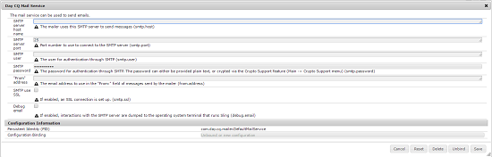

# Asset-Linkfreigabe {#asset-link-sharing}

Mit Adobe Experience Manager (AEM) Assets können Sie Assets, Ordner und Sammlungen als URL für Mitglieder Ihres Unternehmens und externe Einheiten (z. B. Partner und Anbieter) freigeben. Die Freigabe von Assets über einen Link ist eine praktische Methode, um Ressourcen für externe Parteien verfügbar zu machen, ohne dass sich diese zunächst bei AEM Assets anmelden müssen.

>[!NOTE]
>
>Sie benötigen die Berechtigung &quot;ACL bearbeiten&quot;für die Ordner und Assets, die Sie als Link freigeben möchten.

## Freigeben von Assets {#share-assets}

Sie generieren die URL für Assets, die Sie für Benutzer freigeben möchten, im Dialogfeld „Linkfreigabe“. Users with administrator privileges or with read permissions at `/var/dam/share` location are able to view the links shared with them.

>[!NOTE]
>
>Before you share a link with users, ensure that [!UICONTROL Day CQ Mail Service] is configured. Wenn Sie [Day CQ Mail Service](link-sharing.md#configure-day-cq-mail-service) vor dem Freigeben eines Links nicht konfigurieren, tritt ein Fehler auf.

1. Wählen Sie in der Assets-Benutzeroberfläche das Asset aus, das als Link freigegeben werden soll.
1. From the toolbar, click/tap the **[!UICONTROL Share Link]** .

   An asset link is auto-created in the **[!UICONTROL Share Link]** field. Sie können diesen Link kopieren und für andere Benutzer freigeben. Die Standard-Ablaufzeit für den Link beträgt einen Tag.

   

   Alternativ dazu können Sie auch die Schritte 3 bis 7 dieses Verfahrens ausführen, um E-Mail-Empfänger hinzuzufügen, die Ablaufzeit für den Link zu konfigurieren und ihn aus dem Dialogfeld zu senden.

   >[!NOTE]
   >
   >Um Links von Ihrem AEM-Autor für externe Entitäten freizugeben, stellen Sie für GET-Anforderungen nur die folgenden URLs bereit, die für die Linkfreigabe verwendet werden. Blockieren Sie andere URLs, um sicherzustellen, dass Ihre AEM-Bereitstellung sicher ist.
   >
   >* &lt;AEM-Server>/linkshare.html
   * &lt;AEM-Server>/linksharepreview.html
   * &lt;AEM-Server>/linkexpired.html

   >[!NOTE]
   Wenn ein freigegebenes Asset an einen anderen Speicherort verschoben wird, funktioniert der Link zum Asset nicht mehr. Erstellen Sie den Link erneut und geben Sie ihn für die Benutzer frei.

1. Öffnen Sie in der Web Console die **[!UICONTROL Day CQ Link Externalizer]**-Konfiguration und ändern Sie die folgenden Eigenschaften im Feld **[!UICONTROL Domänen]** mit den jeweils angegebenen Werten:

   * local
   * Autor
   * veröffentlichen
   For the `local` and `author` properties, provide the URL for the local and author instance respectively. Both `local` and `author` properties have the same value if you run a single AEM author instance. For `publish`, provide the URL for the publish instance.

1. Geben Sie im Dialogfeld **[!UICONTROL Linkfreigabe]** in das Feld „E-Mail-Adresse“ die E-Mail-ID des Benutzers ein, für den Sie den Link freigeben möchten. Sie können den Link auch für mehrere Benutzer freigeben.

   Wenn der Benutzer zu Ihrem Unternehmen gehört, wählen Sie die E-Mail-ID des Benutzers in den vorgeschlagenen E-Mail-IDs aus, die in der Liste unter dem Eingabebereich angezeigt werden. Geben Sie bei einem externen Benutzer die vollständige E-Mail-ID ein und wählen Sie diese dann aus der Liste aus.

   Damit E-Mails an Benutzer gesendet werden können, konfigurieren Sie die SMTP-Serverdetails in [Day CQ Mail Service](link-sharing.md#configure-day-cq-mail-service).

   

   Freigeben von Links zu Assets direkt über das Dialogfeld „Linkfreigabe“

   >[!NOTE]
   Wenn Sie die E-Mail-ID eines Benutzers eingeben, der nicht zu Ihrem Unternehmen gehört, wird den Worten „Externer Benutzer“ die E-Mail-ID des Benutzers vorangestellt.

1. Geben Sie in das Feld **[!UICONTROL Betreff]** einen Betreff für das freizugebende Asset ein.
1. Geben Sie im Feld **[!UICONTROL Meldung]** eine optionale Meldung ein.
1. Geben Sie im Feld **[!UICONTROL Ablauf]** mit der Datumsauswahl ein Ablaufdatum und eine Ablaufuhrzeit für den Link an. Standardmäßig ist das Ablaufdatum auf eine Woche nach dem Datum der Linkfreigabe gesetzt.

   

1. Damit Benutzer das Originalbild zusammen mit den Ausgabeformaten herunterladen können, wählen Sie die Option **[!UICONTROL Download der Originaldatei zulassen]** aus.

   >[!NOTE]
   Standardmäßig können Benutzer nur die Ausgabeformate des Assets herunterladen, das Sie als Link freigegeben haben.

1. Klicken Sie auf **[!UICONTROL Freigeben]**. Eine Meldung bestätigt, dass der Link per E-Mail für die jeweiligen Benutzer freigegeben wurde.
1. Um das freigegebene Asset anzeigen, klicken/tippen Sie auf den Link in der E-Mail, die dem Benutzer gesendet wird. Das freigegebene Asset wird auf der Seite [!UICONTROL Adobe Marketing Cloud] angezeigt.

   

   Klicken oder tippen Sie auf das Layoutsymbol in der Symbolleiste, um die Listenansicht umzuschalten.

1. Um eine Vorschau des Assets zu generieren, tippen/klicken Sie auf das freigegebene Asset. Click/tap **[!UICONTROL Back]** on the toolbar to close the preview and return to the [!UICONTROL Marketing Cloud] page. Wenn Sie einen Ordner freigegeben haben, tippen/klicken Sie auf **[!UICONTROL Übergeordneter Ordner]**, um zum übergeordneten Ordner zurückzukehren.

   

   >[!NOTE]
   AEM unterstützt das Generieren der Vorschau von Assets dieser MIME-Typen: JPG, PNG, GIF, BMP, INDD, PDF und PPT. Für Assets anderer MIME-Typen können Sie nur die Assets herunterladen.

1. To download the shared asset, click/tap the **[!UICONTROL Select]** icon from the toolbar, click/tap the asset, and then click/tap **[!UICONTROL Download]** from the toolbar.

   

1. Um die Assets anzuzeigen, die Sie als Links freigegeben haben, wechseln Sie zur Assets-Benutzeroberfläche und klicken oder tippen Sie auf das **[!UICONTROL GlobalNav]**-Symbol. Choose **[!UICONTROL Navigation]** from the list to display the Navigation pane.
1. Wählen Sie im Navigationsbereich **[!UICONTROL Freigegebene Links]**, um eine Liste der freigegebenen Assets anzuzeigen.
1. To unshare an asset, select it and tap/click **[!UICONTROL Unshare]** from the toolbar. Eine Meldung bestätigt, dass Sie die Asset-Freigabe aufgehoben haben. Außerdem wird der Eintrag für das Asset aus der Liste entfernt.

## Konfigurieren von Day CQ Mail Service {#configure-day-cq-mail-service}

1. Tippen/Klicken Sie auf das AEM-Logo und navigieren Sie dann zu **[!UICONTROL Werkzeuge > Vorgänge > Web Console]**.
1. Wählen Sie in der Liste der Dienste **[!UICONTROL Day CQ Mail Service]** aus.
1. Klicken Sie neben dem Dienst auf das Symbol **[!UICONTROL Bearbeiten]** und konfigurieren Sie die folgenden Parameter für **[!UICONTROL Day CQ Mail Service]** mit den entsprechenden jeweiligen Daten:

   * SMTP-Server-Hostname: email server host name
   * SMTP-Server-Anschluss: email server port
   * SMTP-Benutzer: email server user name
   * SMTP-Kennwort: email server password
   

1. Klicken oder tippen Sie auf **[!UICONTROL Speichern]**.

## Konfigurieren der maximal zulässigen Datengröße {#configure-maximum-data-size}

Wenn Sie Assets herunterladen, die mithilfe der Linkfreigabe-Funktion freigegeben wurden, komprimiert AEM die gesamte Asset-Hierarchie aus dem Repository und gibt anschließend das Asset in einer ZIP-Datei zurück. Da jedoch die Datenmenge, die in einer ZIP-Datei komprimiert werden kann, nicht begrenzt wird, führt das bei großen komprimierten Datenmengen zu Speicherfehlern in JVM. To secure the system from a potential denial of service attack due to this situation, configure the maximum size using the **[!UICONTROL Max Content Size (uncompressed)]** parameter for **[!UICONTROL Day CQ DAM Adhoc Asset Share Proxy Servlet]** in Configuration Manager. Wenn die unkomprimierte Größe des Assets den konfigurierten Wert überschreitet, werden Asset-Download-Anforderungen abgelehnt. Der Standardwert lautet 100 MB.

1. Tippen/Klicken Sie auf das AEM-Logo und gehen Sie dann zu **[!UICONTROL Werkzeuge > Vorgänge > Web Console]**.
1. From the web console, locate the **[!UICONTROL Day CQ DAM Adhoc Asset Share Proxy Servlet]** configuration.
1. Öffnen Sie die **[!UICONTROL Day CQ DAM Adhoc Asset Share Proxy Servlet]**-Konfiguration im Bearbeitungsmodus und ändern Sie den Wert des Parameters **[!UICONTROL Max. Inhaltsgröße (nicht komprimiert)]**.

   

1. Speichern Sie die Änderungen.

## Best Practices und Fehlerbehebung {#best-practices-and-troubleshooting}

* Asset-Ordner oder Sammlungen, die ein Leerzeichen im Namen enthalten, werden möglicherweise nicht freigegeben.
* Wenn Benutzer die freigegebenen Assets nicht herunterladen können, fragen Sie bei Ihrem AEM-Administrator nach den [Download-Beschränkungen](#configure-maximum-data-size).
* Wenn Sie keine E-Mail mit Links zu freigegebenen Assets senden können oder die anderen Benutzer Ihre E-Mail nicht empfangen können, fragen Sie Ihren AEM-Administrator, ob der [E-Mail-Dienst](#configure-day-cq-mail-service) konfiguriert wurde.
* Wenn Sie Assets nicht mit der Funktion zum Freigeben von Links freigeben können, stellen Sie sicher, dass Sie über die entsprechenden Berechtigungen verfügen. Siehe [Freigeben von Assets](#share-assets).
