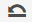
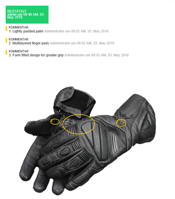
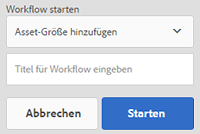
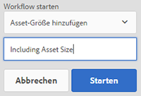

# Digitale Assets verwalten {#managing-assets-with-the-touch-optimized-ui}

Erfahren Sie mehr über verschiedene Asset-Management- und -Bearbeitungsaufgaben, die Sie mithilfe der Touch-optimierten Benutzeroberfläche von AEM Assets durchführen können.

In diesem Artikel wird beschrieben, wie Sie Assets mithilfe der touchoptimierten Benutzeroberfläche von Adobe Experience Manager (AEM) verwalten und bearbeiten. For an elementary knowledge about the user interface, see [Basic handling of Touch UI](/help/sites-authoring/basic-handling.md). Informationen zum Verwalten von Inhaltsfragmenten finden Sie unter [Verwalten von Inhaltsfragmenten](content-fragments-managing.md) -Assets.

## Erstellen von Ordnern {#create-folders}

When organizing a collection of assets, for example, all `Nature` images, you can create folders to keep them together. Mit Ordnern können Sie Assets kategorisieren und organisieren. Bei AEM Assets müssen Sie Assets nicht in Ordner organisieren, um besser zu arbeiten.

>[!NOTE]
>
>* Sharing an Assets folder of the type `sling:OrderedFolder` is not supported when sharing to Marketing Cloud. Wenn Sie einen Ordner freigeben möchten, wählen Sie beim Erstellen eines Ordners nicht „Geordnet“ aus.
>* Experience Manager lässt die Verwendung von `subassets` Wort als Ordnername nicht zu. Es ist ein Schlüsselwort, das für Knoten reserviert ist, die Teilassets für zusammengesetzte Assets enthalten.

1. Navigieren Sie zu dem Ort in Ihrem Ordner „Digitale Assets“, an dem Sie einen neuen Ordner erstellen möchten.
1. Klicken Sie im Menü auf **[!UICONTROL Erstellen]**. Select **[!UICONTROL New Folder]**.
1. In the **[!UICONTROL Title]** field, provide a folder name. DAM verwendet standardmäßig den Titel, den Sie als Ordnernamen angegeben haben. Wenn der Ordner erstellt wurde, können Sie die Standardeinstellung außer Kraft setzen und einen anderen Ordnernamen angeben.
1. Klicken Sie auf **[!UICONTROL Erstellen]**. Ihr Ordner wird im Ordner „Digitale Assets“ angezeigt.

Die folgenden Zeichen (in der Liste durch Leerzeichen getrennt) werden nicht unterstützt:

* asset file name must not contain  `* / : [ \ \ ] | # % { } ? &`
* asset folder name must not contain  `* / : [ \ \ ] | # % { } ? \" . ^ ; + & \t`

## Upload assets {#uploading-assets}

Sie können verschiedene Arten von Assets (z. B. Bilder, PDF-Dateien, Raw-Dateien usw.) von Ihrem lokalen Ordner oder Netzlaufwerk in AEM Assets hochladen.

>[!NOTE]
>
>Im Dynamic Media Scene 7-Modus können Sie nur Assets mit einer Dateigröße von maximal 2 GB hochladen.

Sie können Assets in Ordnern mit oder ohne zugewiesenem Verarbeitungsprofil hochladen.

Für Ordner mit zugewiesenem Verarbeitungsprofil wird der Profilname in der Miniaturansicht der Kartenansicht angezeigt. In der Listenansicht wird der Profilname in der Spalte **[!UICONTROL Verarbeitungsprofil]** angezeigt. Siehe [Verarbeitungsprofile](processing-profiles.md).

Vergewissern Sie sich vor dem Hochladen eines Assets, dass es in einem [unterstützten Format vorliegt](assets-formats.md).

**So laden Sie Assets** hoch:

1. Navigieren Sie in der Weboberfläche &quot;Assets&quot;zu dem Speicherort, an dem Sie digitale Assets hinzufügen möchten.
1. Führen Sie einen der folgenden Schritte aus, um die Assets hochzuladen:

   * On the toolbar, tap the **[!UICONTROL Create]** icon. Tippen Sie dann im Menü auf **[!UICONTROL Dateien]**. Sie können die Datei im angezeigten Dialogfeld bei Bedarf umbenennen.
   * Ziehen Sie die Assets in einem Browser, der HTML5 unterstützt, direkt auf die Oberfläche. Das Dialogfeld zum Umbenennen der Datei wird nicht angezeigt.
   

   Wenn Sie die Assets im Dialogfeld für die Dateiauswahl bei gedrückter Strg-/Befehlstaste markieren, können Sie mehrere Dateien auswählen. Auf einem iPad können Sie jeweils nur eine Datei auswählen.

   Sie können das Hochladen von großen Assets (größer als 500 MB) anhalten und später von der gleichen Seite aus fortsetzen. Tippen Sie auf das Symbol **[!UICONTROL Pause]** neben dem bei Uploadbeginn eingeblendeten Fortschrittsbalken.

   

   Die Größe, ab der ein Asset als großes Asset gilt, lässt sich konfigurieren. Sie können das System beispielsweise so konfigurieren, dass Assets über 1000 MB (anstatt 500 MB) als große Assets angesehen werden. In diesem Fall wird die Schaltfläche **[!UICONTROL Pause]** im Fortschrittsbalken angezeigt, wenn Assets hochgeladen werden, die größer als 1000 MB sind.

   The **[!UICONTROL Pause]]**button does not show if a file greater than 1000 MB is uploaded with a file less than 1000 MB. Wenn Sie jedoch den Upload der Datei abbrechen, die kleiner ist als 1000 MB, wird die Schaltfläche**[!UICONTROL Pause ]**angezeigt.

   To modify the size limit, configure the `chunkUploadMinFileSize` property of the `fileupload`node in the CRX repository.

   Wenn Sie auf das Symbol **[!UICONTROL Pause]** klicken, wird es zum Symbol **[!UICONTROL Wiedergabe]**. Um das Hochladen fortzusetzen, klicken Sie auf das Symbol **[!UICONTROL Wiedergabe.]**

   

   To cancel an ongoing upload, click the `X` button beside the progress bar. Wenn Sie den Upload abbrechen, löscht AEM Assets den teilweise hochgeladenen Teil des Assets.

   Den Upload fortsetzen zu können, ist besonders hilfreich bei geringer Bandbreite und Netzwerkfehlern, bei denen der Upload großer Assets lange dauern kann. Sie können den Uploadvorgang anhalten und später fortsetzen, wenn die Bedingungen besser sind. Beim Fortsetzen beginnt der Upload an dem Punkt, an dem Sie pausiert haben.

   Während des Uploads speichert AEM die Teile des hochgeladenen Assets als Datenblöcke im CRX-Repository. Wenn der Upload abgeschlossen ist, konsolidiert AEM diese Blöcke in einem einzelnen Datenblock im Repository.

   To configure the cleanup task for the unfinished chunk upload jobs, go to `https://[aem_server]:[port]/system/console/configMgr/org.apache.sling.servlets.post.impl.helper.ChunkCleanUpTask`.

   Wenn Sie ein Asset unter einem Namen hochladen, der bereits für ein Asset verwendet wird, das sich am Zielort befindet, wird eine Warnmeldung angezeigt.

   Sie können festlegen, ob ein vorhandenes Asset ersetzt, eine neue Version erstellt oder beide Assets beibehalten werden sollen, indem Sie das neue hochgeladene Asset umbenennen. Wenn Sie ein vorhandenes Asset ersetzen, werden die Metadaten für das Asset sowie alle früheren Änderungen und Änderungen (z. B. Anmerkungen, Ernten usw.) gelöscht. Wenn Sie beide Assets beibehalten möchten, wird das neue Asset umbenannt.

   

   >[!NOTE]
   >
   >When you select **[!UICONTROL Replace]** in the **[!UICONTROL Name Conflict]** dialog box, the asset ID is regenerated for the new asset. Diese ID unterscheidet sich von der ID des vorherigen Assets.
   >
   >If **[!UICONTROL Asset Insights]** is enabled to track impressions/clicks with Adobe Analytics, this regenerated asset ID invalidates the data-captured for the asset on Adobe Analytics.

   If the asset you upload exists in AEM Assets, the **[!UICONTROL Duplicates Detected]** dialog box warns that you are attempting to upload a duplicate asset. Das Dialogfeld wird nur angezeigt, wenn der SHA-1-Prüfsummenwert der Binärdatei des bestehenden Assets dem des Assets entspricht, das Sie gerade hochladen. In diesem Fall sind die Namen der Assets unerheblich. Das bedeutet, dass das Dialogfeld auch für Assets mit unterschiedlichen Namen angezeigt werden kann, wenn die SHA 1-Werte für ihre Binärdateien identisch sind.

   >[!NOTE]
   >
   >The **[!UICONTROL Duplicates Detected]** dialog appears only when the **[!UICONTROL Duplicate Detection]** feature is enabled. To enable the **[!UICONTROL Duplicate Detection]** feature, see [Enabling Duplicate Detection](duplicate-detection.md).

   

   Tap **[!UICONTROL Keep]** to retain the duplicate asset in AEM Assets. Tap  **[!UICONTROL Delete]** to delete the duplicate asset you uploaded.

   AEM Assets verhindert, dass Sie Assets hochladen, deren Dateinamen unzulässige Zeichen enthalten. Wenn Sie versuchen, ein Asset hochzuladen, das die unzulässigen Zeichen enthält, zeigt AEM Assets eine Warnmeldung zum Vorhandensein verbotener Zeichen im Dateinamen an und stoppt den Upload, bis Sie diese Zeichen entfernen oder mit einem zulässigen Namen hochladen.

   To suit specific file naming conventions for your organization, the **[!UICONTROL Upload Assets]** dialog box lets you specify long names for the files that you upload.

   

   Allerdings werden die folgenden Zeichen (in der Liste durch Leerzeichen getrennt) nicht unterstützt:
   * asset file name must not contain  `* / : [ \ \ ] | # % { } ? &`
   * asset folder name must not contain  `* / : [ \ \ ] | # % { } ? \" . ^ ; + & \t`
   In addition, the Assets interface displays the most recent asset that you upload or the folder you create first in all the views (**[!UICONTROL Card view]**, **[!UICONTROL List view]**, and **[!UICONTROL Column view]**).

   Beim gleichzeitigen Hochladen großer Assets oder mehrerer Assets können Sie anhand visueller Indikatoren den Fortschritt häufig bewerten. The **[!UICONTROL Upload Progress]** dialog box displays the count of successfully uploaded files and the files that failed to upload.

   

   Wenn Sie den Upload abbrechen, bevor die Dateien hochgeladen sind, unterbricht AEM Assets den Upload der aktuellen Datei und aktualisiert den Inhalt. Dateien, die bereits hochgeladen wurden, werden jedoch nicht gelöscht.

### Serielle Uploads {#serial-uploads}

Das Hochladen zahlreicher Assets in großen Mengen erfordert erhebliche Systemressourcen, was die Leistung Ihrer AEM-Bereitstellung beeinträchtigen kann. Mögliche Engpässe sind Ihre Internetverbindung, Lese- und Schreibvorgänge auf der Festplatte, Einschränkungen des Webbrowsers bei der Anzahl der POST-Anfragen beim gleichzeitigen Hochladen von Assets. Der Vorgang zum Hochladen von Massen kann fehlschlagen oder vorzeitig beendet werden. Dabei kann es vorkommen, dass in AEM Assets bei der Erfassung großer Dateienmengen einige Dateien verloren gehen oder der Erfassungsvorgang insgesamt nicht ausgeführt werden kann.

Um diese Situation zu vermeiden, gibt es die Möglichkeit, Ladevorgänge im Stapelmodus seriell durchzuführen. Dabei werden in AEM Assets die Assets nicht gleichzeitig, sondern einzeln nacheinander erfasst.

Der serielle Upload von Assets ist standardmäßig aktiviert. To disable the feature and allow concurrent uploading, overlay the `fileupload` node in CRXDe and set the value of the `parallelUploads` property to `true`.

### Upload assets using FTP {#uploading-assets-using-ftp}

Dynamische Medien ermöglichen das Batch-Hochladen von Assets über den FTP-Server. Wenn Sie große Assets (über 1 GB) oder ganze Ordner und Unterordner hochladen möchten, sollten Sie FTP verwenden. Sie können das Hochladen per FTP auch einrichten, um Uploads regelmäßig und nach Plan durchzuführen.

>[!NOTE]
>
>Im Dynamic Media Scene 7-Modus können Sie nur Assets mit einer Dateigröße von maximal 2 GB hochladen.

>[!NOTE]
>
>Um Assets per FTP in Dynamic Media - Scene7-Modus zu laden, installieren Sie Feature Pack (FP) 18912 unter AEM-Autor. Wenden Sie sich an den Adobe-Support, um auf FP-18912 zugreifen zu können, und schließen Sie das Setup Ihres FTP-Kontos ab. Weitere Informationen finden Sie unter [Installieren von Feature Pack 18912 für Massenmigration von Assets](/help/assets/bulk-ingest-migrate.md).
Die in AEM angegebenen Upload-Einstellungen werden ignoriert, wenn Sie FTP zum Hochladen von Assets verwenden. Stattdessen werden Dateiverarbeitungsregeln, wie in Dynamic Media Classic definiert, verwendet.    

**So laden Sie Assets per FTP hoch**

1. Verwenden Sie den FTP-Client Ihrer Wahl und melden Sie sich beim FTP-Server mit dem FTP-Benutzernamen und -Kennwort aus der Bereitstellungs-E-Mail an. Laden Sie die Dateien und/oder Ordner über den FTP-Client auf den FTP-Server hoch.
1. [Melden Sie sich bei Dynamic Media Classic an](https://www.adobe.com/marketing-cloud/experience-manager/scene7-login.html), indem Sie die Anmeldeinformationen verwenden, die Sie in der Bereitstellungs-E-Mail erhalten haben. Tippen oder klicken Sie in der Leiste „Globale Navigation“ auf **[!UICONTROL Hochladen]**.

1. On the **[!UICONTROL Upload]** page, near the upper-left corner, tap the **[!UICONTROL Via FTP]** tab.
1. Wählen Sie im linken Bereich der Seite einen FTP-Ordner aus, aus dem Sie Dateien hochladen. Auf der rechten Seite der Seite wählen Sie einen Zielordner aus.
1. Near the lower-right corner of the page, tap **[!UICONTROL Job Options]** and then set the options you want based on the assets in the folder you selected.

   Siehe [Upload-Auftragsoptionen](#upload-job-options).

   >[!NOTE]
   >
   >Wenn Sie Assets über FTP hochladen, haben die in Scene7 (Dynamic Media Classic) festgelegten Upload-Auftragsoptionen Vorrang vor den in AEM festgelegten Asset-Verarbeitungsparametern.

1. In the lower-right corner of the **[!UICONTROL Upload Job Options]** dialog box, tap **[!UICONTROL Save]**.
1. In the lower-right corner of the **[!UICONTROL Upload]** page, tap **[!UICONTROL Submit Upload]**.

   Um den Upload-Fortschritt anzuzeigen, tippen Sie in der Leiste „Globale Navigation“ auf **[!UICONTROL Aufträge]**. The **[!UICONTROL Jobs]** page displays the progress of the upload. Sie können mit der Arbeit in AEM fortfahren und jederzeit wieder in Dynamic Media Classic zur Seite „Aufträge“ zurückkehren, um einen gerade verarbeiteten Auftrag zu überprüfen.

   Um die laufende Verarbeitung eines Upload-Auftrags abzubrechen, tippen oder klicken Sie neben der Information „Dauer“ auf die Schaltfläche **[!UICONTROL Abbrechen]****[!UICONTROL .]**

#### Upload-Auftragsoptionen {#upload-job-options}

| Upload-Optionen | Unteroption | Beschreibung |
|---|---|---|
| Auftragsname |  | Der Name, der standardmäßig in diesem Feld erstellt wird, enthält den vom Benutzer eingegebenen Teil des Namens und einen Zeitstempel samt Datum. Für diesen Upload-Auftrag können Sie den Standardnamen oder einen von Ihnen selbst erstellten Namen verwenden.  Der Auftrag und andere Upload- und Veröffentlichungsaufträge werden auf der Seite „Aufträge“ aufgezeichnet, wo Sie den Status der Aufträge prüfen können. |
| Nach dem Hochladen veröffentlichen |  | Veröffentlicht Assets automatisch nach dem Hochladen. |
| In belieb. Ordner Assets mit ident. Namen unabh. von Erweit. überschreiben |  | Wählen Sie diese Option aus, wenn hochgeladene Dateien vorhandene Dateien mit denselben Namen ersetzen sollen. Der Name dieser Option kann möglicherweise anders lauten, je nach den Einstellungen in **[!UICONTROL Anwendungseinstellungen]** > **[!UICONTROL Allgemeine Einstellungen]** > **[!UICONTROL Zur Anwendung hochladen]** > **[!UICONTROL Bilder überschreiben]**. |
| Dekomprimieren von ZIP- oder TAR-Dateien beim Hochladen |  |  |
| Auftragsoptionen |  | Tap/ click **[!UICONTROL Job Options]** to open the [!UICONTROL Upload Job Options] dialog box and choose options that affect the entire upload job. Diese Optionen sind für alle Dateitypen gleich. Sie können über die Seite „Allgemeine Programmeinstellungen“ Standardoptionen für das Hochladen von Dateien auswählen. Um diese Seite zu öffnen, wählen Sie **[!UICONTROL Einstellung]** > **[!UICONTROL Anwendungseinstellungen]**. Tap the **[!UICONTROL Default Upload Options]** button to open the [!UICONTROL Upload Job Options] dialog box. |
|  | Wann | Wählen Sie „Einmalig“ oder „Wiederkehrend“ aus. Zum Einrichten eines wiederkehrenden Auftrags wählen Sie eine Wiederholungsoption („Täglich“, „Wöchentlich“, „Monatlich“ oder „Benutzerdefiniert“), um anzugeben, wie oft der FTP-Upload-Auftrag wiederholt werden soll. Dann geben Sie nach Bedarf die Planungsoptionen an. |
|  | Unterordner einschließen | Laden Sie alle Unterordner im hochzuladenden Ordner hoch. Der Name des hochgeladenen Ordners und die Namen der darin enthaltenen Unterordner werden automatisch in AEM Assets erfasst. |
|  | Optionen für das Zuschneiden | Um die Seiten eines Bildes manuell zu beschneiden, wählen Sie im Menü „Beschneiden“ die Option „Manuell“ aus. Dann geben Sie die Anzahl von Pixeln ein, die an einer oder jeder Seite des Bildes abgeschnitten werden sollen. Um wie viel das Bild beschnitten wird, hängt von der ppi-Einstellung (Pixel per Inch; Pixel pro Zoll) in der Bilddatei ab. Beispiel: Wenn das Bild 150 ppi aufweist und Sie 75 in die Textfelder für oben, rechts, unten und links eingeben, wird ein halber Zoll von jeder Seite abgeschnitten.  Zum automatischen Beschneiden der Leerraumpixel eines Bildes öffnen Sie das Menü „Beschneiden“, wählen Sie „Manuell“ und geben Sie zum Beschneiden der Seiten die Pixelwerte in die Felder „Oben“, „Rechts“, „Unten“ und „Links“ ein. Sie können im Menü „Beschneiden“ auch „Zuschneiden“ und anschließend folgende Optionen auswählen:  **Beschneiden basierend auf** <ul><li>**Farbe** : Wählen Sie die Option Farbe. Wählen Sie anschließend im Menü „Ecke“ die Bildecke mit der Farbe aus, die am besten der Leerraumfarbe entspricht, die Sie entfernen möchten.</li><li>**** Transparenz – Wählen Sie die Option „Transparenz“.  **Toleranz** - Ziehen Sie den Schieberegler, um eine Toleranz von 0 bis 1 festzulegen. Beim Beschneiden basierend auf Farbe geben Sie 0 an, damit Pixel nur abgeschnitten werden, wenn sie exakt der Farbe entsprechen, die Sie in der Bildecke ausgewählt haben. Werte, die näher an 1 liegen, lassen eine größere Farbdifferenz zu. Für das Zuschneiden auf der Grundlage der Transparenz geben Sie den Wert 0 an, damit Pixel nur dann abgeschnitten werden, wenn sie transparent sind. Werte, die näher an 1 liegen, lassen eine größere Transparenz zu.</li></ul> Beachten Sie, dass diese Optionen für das Beschneiden zerstörungsfrei sind. |
|  | Farbprofiloptionen | Wählen Sie beim Erstellen optimierter Dateien eine Farbkonversion aus, die für die Bereitstellung verwendet wird:<ul><li>Beibehaltung der Standardfarbe: Behält die Farben des Quellbildes bei, wenn die Bilder Farbrauminformationen enthalten. Es findet keine Farbkonversion statt. Heutzutage ist in fast allen Bildern das entsprechende Farbprofil eingebettet. Wenn jedoch ein CMYK-Quellbild kein eingebettetes Farbprofil enthält, werden die Farben in den Farbraum sRGB (standardmäßiges Rot Grün Blau) konvertiert. sRGB ist der empfohlene Farbraum zum Anzeigen von Bildern auf Webseiten.</li><li>Ursprünglichen Farbraum beibehalten: Behält die ursprünglichen Farben bei, ohne dass an der betreffenden Stelle eine Farbkonversion stattfindet. Bei Bildern ohne eingebettetes Farbprofil wird jede Farbkonversion mit den in den Veröffentlichungseinstellungen konfigurierten Standardfarbprofilen durchgeführt. Die Farbprofile stimmen möglicherweise nicht mit der Farbe in den Dateien überein, die mit dieser Option erstellt wurden. Deshalb empfiehlt es sich, die Option „Beibehaltung der Standardfarbe“ zu verwenden.</li><li>Benutzerdefinierte Einstellung von > in:  Öffnet Menüs, damit Sie einen „Konvertieren von“- und einen „Konvertieren in“-Farbraum auswählen können. Diese erweiterte Option überschreibt alle Farbinformationen, die in die Quelldatei eingebettet sind. Wählen Sie diese Option aus, wenn alle Bilder, die Sie senden, falsche oder fehlende Farbprofildaten enthalten.</li></ul> |
|  | Bildbearbeitungsoptionen | Sie können die Beschneidungsmasken in Bildern beibehalten und ein Farbprofil auswählen.  Siehe [Festlegen von Bildbearbeitungsoptionen beim Hochladen](#setting-image-editing-options-at-upload). |
|  | PostScript-Optionen | Sie können PostScript®-Dateien rastern, Dateien beschneiden, transparente Hintergründe beibehalten sowie eine Auflösung und einen Farbraum auswählen.  Siehe [Festlegen von PostScript- und Illustrator-Uploadoptionen](#setting-postscript-and-illustrator-upload-options). |
|  | Photoshop-Optionen | Sie können Vorlagen aus Adobe® Photoshop®-Dateien erstellen, Ebenen beibehalten, Ebenennamen angeben, Text extrahieren und angeben, wie Bilder in Vorlagen verankert sind.  Beachten Sie, dass in AEM Vorlagen nicht unterstützt werden.  Siehe [Festlegen von Photoshop-Uploadoptionen](#setting-photoshop-upload-options). |
|  | PDF-Optionen | Sie können die Dateien rastern, Suchbegriffe und -links extrahieren, automatisch einen E-Katalog erstellen, die Auflösung einstellen und einen Farbraum auswählen.  Beachten Sie, dass in AEM E-Kataloge nicht unterstützt werden.   Siehe [Festlegen von PDF-Uploadoptionen](#setting-pdf-upload-options). |
|  | Illustrator-Optionen | Sie können Adobe Illustrator®-Dateien rastern, transparente Hintergründe beibehalten sowie eine Auflösung und einen Farbraum auswählen.  Siehe [Festlegen von PostScript- und Illustrator-Uploadoptionen](#setting-postscript-and-illustrator-upload-options). |
|  | eVideo-Optionen | Sie können eine Videodatei durch Auswahl einer Videovorgabe transkodieren.  Siehe [Festlegen von eVideo-Uploadoptionen](#setting-evideo-upload-options). |
|  | Stapelsatzvorgaben | Um ein Bild- oder Rotationsset aus den hochgeladenen Dateien zu erstellen, klicken Sie auf die Spalte „Aktiv“ der Vorgabe, die Sie verwenden möchten. Sie können mehrere Vorgaben auswählen. Die Vorgaben erstellen Sie auf der Seite „Anwendungseinstellungen/Stapelsatzvorgaben“ von Dynamic Media Classic.  Weitere Informationen zur Erstellung von Stapelsatzvorgaben finden Sie unter [Konfigurieren von Stapelsatzvorgaben zum automatischen Erstellen von Bild- und Rotationssets](config-dms7.md#creating-batch-set-presets-to-auto-generate-image-sets-and-spin-sets).  Siehe [Festlegen von Stapelsatzvorgaben beim Hochladen](#setting-batch-set-presets-at-upload). |

#### Set image editing options at upload {#setting-image-editing-options-at-upload}

When uploading image files, including AI, EPS, and PSD files, you can take the following editing actions in the **[!UICONTROL Upload Job Options]** dialog box:

* Leerraum am Rand von Bildern beschneiden (siehe Beschreibung in der oben stehenden Tabelle) 
* Ränder von Bildern manuell beschneiden (siehe Beschreibung in der oben stehenden Tabelle)
* Ein Farbprofil auswählen (siehe Optionsbeschreibung in der oben stehenden Tabelle)
* Eine Maske aus einem Beschneidungspfad erstellen
* Bilder scharfzeichnen mit Optionen für „Unscharf maskieren“
* Hintergrund aussparen

| Wahl | Unteroption | Beschreibung |
|---|---|---|
| Maske aus Beschneidungspfad erstellen |  | Erstellt basierend auf den Beschneidungspfad-Informationen eine Maske für das Bild. Diese Option ist auf Bilder anwendbar, die mit Bildbearbeitungsanwendungen erstellt wurden, in denen ein Beschneidungspfad erstellt wurde. |
| Unschärfemaske |  | Ermöglicht Ihnen die Feineinstellung eines Schärfefiltereffekts im finalen Downsampling-Bild. So können Sie die Intensität und den Radius des Effekts (in Pixel) sowie einen Schwellenwert für ignorierten Kontrast angeben.  Bei diesem Effekt werden dieselben Optionen wie im Filter „Unschärfemaske“ von Photoshop verwendet. Im Gegensatz zu dem, was der Name besagt, ist die Unschärfemaske ein Scharfzeichnungsfilter. Wählen Sie unter „Unschärfemaske“ die gewünschten Optionen aus. Im Folgenden finden Sie Beschreibungen der Einstellungsoptionen: |
|  | Stärke | Steuert den auf die Kantenpixel angewendeten Kontrastwert.  Betrachten Sie diese Unteroption als Intensität des Effekts. Der Hauptunterschied zwischen den Werten von „Unschärfemaske“ in Dynamic Media und den Werten in Adobe Photoshop ist, dass Adobe Photoshop einen Wertebereich verwendet, der von 1 % bis 500 % reicht. In Dynamic Media hingegen reichen die Werte von 0,0 bis 5,0. Der Wert 5,0 entspricht ungefähr 500 % in Photoshop, der Wert 0,9 ungefähr 90 % usw. |
|  | Radius | Steuert den Radius des Effekts. Der Wertebereich reicht von 0 bis 250.  Der Effekt wird auf alle Pixel in einem Bild angewendet und verbreitet sich in alle Richtungen. Der Radius wird in Pixel gemessen. Um beispielsweise einen ähnlichen Scharfzeichnungseffekt für ein Bild mit 2000 x 2000 Pixel und ein Bild mit 500 x 500 Pixel zu erhalten, können Sie einen Radius von zwei Pixel für das Bild mit 2000 x 2000 Pixel und einen Radius von einem Pixel für das Bild mit 500 x 500 Pixel festlegen. Ein größerer Wert wird für ein Bild mit mehr Pixel verwendet. |
|  | Schwelle | Beschreibt den Kontrastbereich, der beim Anwenden der Unschärfemaske ignoriert wird. Das ist wichtig, damit kein Bildrauschen entsteht, wenn dieser Filter verwendet wird. Der Wertebereich reicht von 0 bis 255. Diese Werte stehen für die Anzahl der Helligkeitsschritte in einem Graustufenbild. 0 = Schwarz, 128 = 50 % Grau und 255 = Weiß.  Ein Schwellenwert von 12 ignoriert beispielsweise leichte Variationen der Hauttonhelligkeit, um Rauschen zu vermeiden, fügt aber trotzdem Kantenkontrast zu kontrastreichen Bereichen hinzu, wie z. B. wo Wimpern auf die Haut treffen.  Wenn Sie z. B. ein Foto des Gesichts einer Person haben, wirkt sich die &quot;Unscharf maskieren&quot;auf die kontrastreichen Teile des Bildes aus, z. B. wo Wimpern und Haut aufeinander treffen, um einen offensichtlichen Kontrastbereich zu schaffen, und auf die glatte Haut selbst. Selbst die glatteste Haut weist geringfügige Änderungen der Helligkeitswerte auf. Wenn Sie keinen Schwellenwert verwenden, akzentuiert der Filter diese geringfügigen Änderungen in den Hautpixel. Dadurch entsteht ein verrauschter und unerwünschter Effekt, während der Kontrast an den Wimpern verstärkt und die Schärfe intensiviert wird.  Zur Vermeidung dieses Problems wird ein Schwellenwert verwendet, der den Filter anweist, die Pixel zu ignorieren, die den Kontrast nicht wesentlich ändern, beispielsweise bei glatter Haut.  Beachten Sie in der weiter oben gezeigten Reißverschlussgrafik die Textur neben dem Reißverschluss. Hier ist Bildrauschen erkennbar, weil die Schwellenwerte zu niedrig waren, als dass sie das Bildrauschen unterdrücken könnten. |
|  | Monochrom | Wählen Sie diese Option aus, um die Unschärfemaske auf die Bildhelligkeit anzuwenden (Intensität).  Deaktivieren Sie diese Unteroption, um die Unschärfemaske auf jede Farbkomponente einzeln anzuwenden. |
| Hintergrund aussparen |  | Entfernt beim Hochladen automatisch den Hintergrund eines Bildes. Mit dieser Technik ist es möglich, die Aufmerksamkeit auf ein bestimmtes Objekt zu lenken und es von einem belebten Hintergrund abzuheben. Wählen Sie diese Option aus, um die Funktion „Hintergrund aussparen“ und die folgenden Optionen zu aktivieren: |
|  | Ecke | Erforderlich.  Die Ecke des Bildes, mit der die auszusparende Hintergrundfarbe definiert wird.  Sie können aus **Oben links**, **Unten links**, **Oben rechts** und **Unten rechts** wählen. |
|  | Füllmethode | Erforderlich.  Zur Steuerung der Pixeltransparenz ausgehend von der Ecke, die Sie gewählt haben.  Sie können aus folgenden Füllmethoden wählen: <ul><li>**Großflächig füllen** – Macht alle Pixel transparent, die mit der von Ihnen angegebenen Ecke übereinstimmen und mit ihr verbunden sind.</li><li>**Pixel abgleichen** – Macht alle entsprechenden Pixel transparent, unabhängig von ihrer Position auf dem Bild.</li></ul> |
|  | Toleranz | Optional.  Steuert die zulässige Abweichung der Pixelfarbe ausgehend von der Ecke, die Sie festgelegt haben.  Verwenden Sie den Wert 0,0, um die Pixelfarben genau anzugleichen, oder verwenden Sie den Wert 1,0, um die größtmögliche Abweichung zuzulassen. |

#### Set PostScript and Illustrator upload options {#setting-postscript-and-illustrator-upload-options}

Wenn Sie PostScript (EPS)- oder Illustrator (AI)-Bilddateien hochladen, können Sie diese auf verschiedene Arten formatieren. Sie können die Dateien rastern, den transparenten Hintergrund beibehalten sowie eine Auflösung und einen Farbraum auswählen. Optionen zum Formatieren von PostScript- und Illustrator-Dateien stehen im Dialogfeld „Upload-Auftragsoptionen“ unter PostScript- und Illustrator-Optionen zur Verfügung.

| Wahl | Unteroption | Beschreibung |
|---|---|---|
| Verarbeitung |  | Wählen Sie **[!UICONTROL Rastern]**, um Vektorgrafiken in der Datei in das Bitmap-Format zu konvertieren. |
| Transparenten Hintergrund in gerendertem Bild beibehalten |  | Zur Beibehaltung der Hintergrundtransparenz der Datei. |
| Auflösung |  | Zur Einstellung der Auflösung. Mit dieser Einstellung wird bestimmt, wie viele Pixel pro Zoll in der Datei angezeigt werden. |
| Farbraum |  | Klicken Sie auf das Menü „Farbraum“ und wählen Sie unter den folgenden Farbraumoptionen: |
|  | Automatisch erkennen | Der Farbraum der Datei wird beibehalten. |
|  | Immer RGB | Zur Konvertierung in den RGB-Farbraum. |
|  | Immer CMYK | Zur Konvertierung in den CMYK-Farbraum. |
|  | Immer Graustufen | Zur Konvertierung in den Graustufenfarbraum. |

#### Festlegen von Upload-Optionen für Fotoshop {#setting-photoshop-upload-options}

PSD (Photoshop)-Dateien werden meist zum Erstellen von Bildvorlagen verwendet. Wenn Sie eine PSD-Datei hochladen, können Sie daraus automatisch eine Bildvorlage erstellen (aktivieren Sie auf dem Uploadbildschirm die Option „Vorlage erstellen“). 

Dynamic Media erstellt mehrere Bilder aus einer PSD-Datei mit Ebenen, wenn Sie die Datei zum Erstellen einer Vorlage verwenden. Für jede Ebene wird ein Bild erstellt.

Use the **[!UICONTROL Crop Options]** and **[!UICONTROL Color Profile Options]**, described above, with Photoshop upload options.

>[!NOTE]
>
>Vorlagen werden nicht in AEM unterstützt.

| Wahl | Unteroption | Beschreibung |
|---|---|---|
| Ebenen beibehalten |  | Teilt die Ebenen in der PSD-Datei ggf. in einzelne Assets auf. Die Asset-Ebenen bleiben der PSD-Datei zugeordnet. Sie können sie anzeigen, indem Sie die PSD-Datei in der Detailansicht öffnen und das Ebenenfenster auswählen. |
| Vorlage erstellen |  | Erstellt eine Vorlage aus den Ebenen der PSD-Datei. |
| Text extrahieren |  | Extrahiert den Text, damit Benutzer im Viewer den Text durchsuchen können. |
| Ebenen auf Hintergrundgröße ausdehnen |  | Erweitert die Größe aufgeteilter Bildebenen auf die Größe der Hintergrundebene. |
| Ebenenbenennung |  | Ebenen in der PSD-Datei werden als separate Bilder hochgeladen. |
|  | Ebenenname | Benennt die Bilder nach ihren Ebenennamen in der PSD-Datei. Wenn eine Ebene in der Original-PSD-Datei beispielsweise „Preisschild“ heißt, wird auch das zugehörige Bild „Preisschild“ genannt. Wenn es sich bei den Ebenennamen in der PSD-Datei jedoch um standardmäßige Photoshop-Ebenennamen handelt (Hintergrund, Ebene 1, Ebene 2 usw.), werden die Bilder nicht nach den Standardebenennamen, sondern nach den zugehörigen Ebenennummern in der PSD-Datei benannt. |
|  | Photoshop- und Ebenennummer | Benennt die Bilder nach ihren Ebenennummern in der PSD-Datei und ignoriert die ursprünglichen Ebenennamen. Bilder werden mit dem Photoshop-Dateinamen und einer angefügten Ebenennummer benannt. Zum Beispiel erhält die zweite Ebene der Datei Frühjahrsannonce.psd den Namen Frühjahrsannonce_2, auch wenn sie in Photoshop einen nicht standardmäßigen Namen hatte. |
|  | Photoshop- und Ebenenname | Benennt die Bilder nach der PSD-Datei, gefolgt vom Ebenennamen oder der -nummer. Die Ebenennummer wird verwendet, wenn es sich bei den Ebenennamen in der PSD-Datei um standardmäßige Photoshop-Ebenennamen handelt. Zum Beispiel erhält eine Ebene mit dem Namen „Preisschild“ in einer PSD-Datei mit dem Namen „Frühjahrsannonce“ den Namen „Frühjahrsannonce_Preisschild“. Eine Ebene mit dem standardmäßigen Namen „Ebene 2“ erhält den Namen „Frühjahrsannonce_2“. |
| Anker |  | Geben Sie an, wie Bilder in Vorlagen, die aus der Zusammenstellung der Ebenen aus der PSD-Datei erstellt werden, verankert werden. Der Anker ist standardmäßig zentriert. Ein zentrierter Anker eignet sich am besten zum Auffüllen desselben Raums mit Ersatzbildern, unabhängig vom Seitenverhältnis der Ersatzbilder. Bilder mit einem anderen Seitenverhältnis, die dieses Bild ersetzen, nehmen effektiv denselben Raum ein, wenn auf die Vorlage verwiesen und die Parameterersetzung durchgeführt wird. Wählen Sie eine andere Einstellung, wenn es für Ihre Anwendung erforderlich ist, dass die Ersatzbilder den zugeordneten Raum in der Vorlage ausfüllen. |

#### Optionen zum Hochladen von PDF festlegen {#setting-pdf-upload-options}

Wenn Sie eine PDF-Datei hochladen, können Sie diese auf verschiedene Arten formatieren. Sie können ihre Seiten zuschneiden, Suchbegriffe extrahieren, eine ppi (Pixel pro Zoll)-Auflösung eingeben und einen Farbraum auswählen. PDF-Dateien enthalten oft einen Beschnittrand, Schnittmarken, Registrierungsmarken und andere Druckermarken. Sie können diese Marken von den Seitenrändern aus zuschneiden, wenn Sie eine PDF-Datei hochladen.

>[!NOTE]
>
>E-Kataloge werden nicht in AEM unterstützt.

Wählen Sie unter folgenden Optionen:

| Wahl | Unteroption | Beschreibung |
|---|---|---|
| Verarbeitung | Rastern | (Standard) Zum Extrahieren der Seiten aus der PDF-Datei und zum Konvertieren von Vektorgrafiken in Bitmap-Bilder. Wählen Sie diese Option, um einen E-Katalog zu erstellen. |
| Extrahieren | Suchbegriffe | Zum Extrahieren von Wörtern aus der PDF-Datei, damit die Datei in einem E-Katalog-Viewer mit einem Schlüsselwort durchsucht werden kann. |
|  | Links | Zum Extrahieren von Links aus den PDF-Dateien und zum Konvertieren der PDF-Dateien in Imagemaps, die in einem E-Katalog-Viewer verwendet werden. |
| E-Katalog aus mehrseitiger PDF automatisch erstellen |  | Zum automatischen Erstellen eines E-Katalogs aus der PDF-Datei. Der E-Katalog wird nach der von Ihnen hochgeladenen PDF-Datei benannt. (Diese Option ist nur dann verfügbar, wenn Sie die PDF-Datei beim Hochladen rastern.) |
| Auflösung |  | Zum Festlegen der Auflösung: Mit dieser Einstellung wird bestimmt, wie viele Pixel pro Zoll in der PDF-Datei angezeigt werden. Standard: 150. |
| Farbraum |  | Wählen Sie das Farbraummenü und einen Farbraum für die PDF-Datei aus. Die meisten PDF-Dateien enthalten sowohl RGB- als auch CMYK-Farbbilder. Der RGB-Farbraum eignet sich besonders gut, um Dateien online anzuzeigen. |
|  | Automatisch erkennen | Der Farbraum der PDF-Datei wird beibehalten. |
|  | Immer RGB | Zur Konvertierung in den RGB-Farbraum. |
|  | Immer CMYK | Zur Konvertierung in den CMYK-Farbraum. |
|  | Immer Graustufen | Zur Konvertierung in den Graustufenfarbraum. |

#### Festlegen von eVideo-Upload-Optionen {#setting-evideo-upload-options}

Sie können eine Videodatei neu kodieren, indem Sie aus einer Vielzahl von Videovorgaben auswählen.

| Wahl | Unteroption | Beschreibung |
|---|---|---|
| Adaptives Video |  | Eine einzelne Kodierungsvorgabe, die mit jedem Seitenverhältnis verwendet werden kann, um Videos zur Wiedergabe auf Mobilgeräten, Tablets und Desktops zu erstellen. Hochgeladene Quellvideos, die mit dieser Vorgabe kodiert wurden, weisen eine feste Höhe auf. Die Breite wird jedoch automatisch skaliert, um das Seitenverhältnis des Videos beizubehalten.  Die beste Vorgehensweise ist die Verwendung der adaptiven Videokodierung. |
| Einzelne Kodierungsvorgaben | Kodierungsvorgaben sortieren | Wählen Sie &quot;Name&quot;oder &quot;Größe&quot;, um die unter &quot;Desktop&quot;, &quot;Mobil&quot;und &quot;Tablet&quot;aufgelisteten Kodierungsvorgaben nach Name oder Auflösung zu sortieren. |
|  | Desktop | Erstellen Sie eine MP4-Datei zur Bereitstellung eines Streaming- oder progressiven Videoerlebnisses auf Desktop-Computern.Wählen Sie ein oder mehrere Seitenverhältnisse mit der gewünschten Auflösung und Zieldatenrate aus. |
|  | Mobilgerät | Erstellen Sie eine MP4-Datei zur Bereitstellung auf iPhone- oder Android-Mobilgeräten.Wählen Sie ein oder mehrere Seitenverhältnisse mit der gewünschten Auflösung und Zieldatenrate aus. |
|  | Tablet | Erstellen Sie eine MP4-Datei zur Wiedergabe auf iPad- oder Android-Tablet-Geräten.Wählen Sie ein oder mehrere Seitenverhältnisse mit der gewünschten Auflösung und Zieldatenrate aus. |

#### Set Batch Set Presets at upload {#setting-batch-set-presets-at-upload}

If you want to automatically create an Image Set or Spin Set from uploaded images, click the **[!UICONTROL Active** column for the preset you want to use. Sie können mehrere Vorgaben auswählen. 

Weitere Informationen zur Erstellung von Stapelsatzvorgaben finden Sie unter [Konfigurieren von Stapelsatzvorgaben zum automatischen Erstellen von Bild- und Rotationssets](config-dms7.md#creating-batch-set-presets-to-auto-generate-image-sets-and-spin-sets).

### Gestreamte Uploads {#streamed-uploads}

Wenn Sie viele Assets hochladen, steigt die Zahl der I/O-Aufrufe, die an den AEM-Server gesendet werden, drastisch an, wodurch die Upload-Effizienz verringert wird und sogar eine Zeitüberschreitung auftreten kann. AEM Assets unterstützt gestreamte Uploads von Assets. Gestreamte Uploads sorgen für eine Datenträger-I/O-Reduzierung beim Hochladen, da die Speicherung von Assets in einem temporären Ordner auf dem Server vermieden wird, bevor Assets in das Repository kopiert werden. Stattdessen werden die Daten direkt an das Repository übertragen. Auf diese Weise wird die Zeit für das Hochladen von Assets und die Möglichkeit von Zeitüberschreitungen verringert. Das gestreamte Hochladen ist in AEM Assets standardmäßig aktiviert.

Die Funktion „Streaming-Upload“ ist für den Betrieb von AEM auf JEE-Servern mit Servlet-API. Version unter 3.1 deaktiviert.

### ZIP-Archiv mit Assets extrahieren {#extract-zip-archive-containing-assets}

Sie können ZIP-Archive wie jedes andere unterstützte Asset hochladen. Für ZIP-Dateien gelten dieselben Regeln für Dateinamen. Mit AEM können Sie ein ZIP-Archiv in einen DAM-Speicherort extrahieren.

Wählen Sie jeweils ein ZIP-Archiv aus, klicken Sie auf **[!UICONTROL Archiv extrahieren]** und wählen Sie einen Zielordner aus. Wählen Sie eine Option für den Umgang mit eventuellen Konflikten. Wenn die Assets in der ZIP-Datei bereits im Zielordner vorhanden sind, können Sie eine der folgenden Optionen auswählen: Extrahieren überspringen, vorhandene Dateien ersetzen, beide Assets durch Umbenennen behalten oder neue Version erstellen.

Nach Abschluss des Extrahierungsvorgangs erhalten Sie von AEM eine Benachrichtigung im Benachrichtigungsbereich. Während AEM das ZIP-Archiv extrahiert, können Sie ohne Unterbrechung des Extrahierungsvorgangs zu Ihrer Arbeit zurückkehren.

Die Funktion hat einige Einschränkungen:

* Wenn sich ein gleichnamiger Ordner am Ziel befindet, werden die Assets aus der ZIP-Datei in diesen extrahiert.

* Wenn Sie die Extrahierung abbrechen, werden die bereits extrahierten Assets nicht gelöscht.

* Sie können nicht gleichzeitig zwei ZIP-Dateien auswählen und extrahieren. Sie können jeweils nur ein ZIP-Archiv extrahieren.

## Anzeigen einer Asset-Vorschau {#previewing-assets}

Siehe auch [Vorschau von Assets mit Dynamic Media](previewing-assets.md).

**So zeigen Sie die Asset-Vorschau an**:

1. Navigieren Sie in der Benutzeroberfläche &quot;Assets&quot;zum Speicherort des Assets, das Sie in der Vorschau anzeigen möchten.
1. Tippen Sie auf das gewünschte Asset, um es zu öffnen.

1. Im Vorschaumodus ist eine Zoom-Funktion für [unterstützte Bildtypen](assets-formats.md#supported-raster-image-formats) verfügbar (mit interaktiver Bearbeitung).

   To zoom into an asset, tap **[!UICONTROL +]** (or tap the magnifying glass on the asset). To zoom out, tap **[!UICONTROL -]**. Beim Heranzoomen können Sie beliebige Bildbereiche durch Schwenken genauer untersuchen. Mit dem Pfeil **[!UICONTROL Zoom zurücksetzen]** gelangen Sie zurück zur Originalansicht.

   

   Tippen Sie auf die Schaltfläche **[!UICONTROL Zurücksetzen]**, um die Originalgröße der Ansicht wiederherzustellen.

   

## Eigenschaften bearbeiten {#editing-properties}

1. Navigieren Sie zum Speicherort des Assets, dessen Metadaten Sie bearbeiten möchten.

1. Select the asset, and tap **[!UICONTROL Properties]** from the toolbar to view asset properties. Wählen Sie alternativ die Schnellaktion **[!UICONTROL Eigenschaften]** auf der Asset-Karte aus.

   

1. In the **[!UICONTROL Properties]** page, edit the metadata properties under various tabs. Zum Beispiel bearbeiten Sie auf der Registerkarte **[!UICONTROL Allgemein]** den Titel, die Beschreibung usw.

   The layout of the **[!UICONTROL Properties]** page and the metadata properties available depend on the underlying metadata schema. To learn how to modify the layout of the **[!UICONTROL Properties]** page, see [Metadata Schemas](metadata-schemas.md).

1. Um ein bestimmtes Datum/eine bestimmte Uhrzeit für die Aktivierung des Assets zu planen, verwenden Sie die Datumsauswahl neben dem Feld **[!UICONTROL Zeit]**.

   

1. To deactivate the asset after a particular duration, choose the deactivation date and time from the date picker beside the **[!UICONTROL Off Time]** field.

   Das Deaktivierungsdatum sollte später als das Aktivierungsdatum für ein Asset sein. Nach der [!UICONTROL Abschaltzeit]sind ein Asset und seine Darstellungen weder über die Assets-Weboberfläche noch über die HTTP-API verfügbar.

   

1. Wählen Sie im Feld **[!UICONTROL Tags]** ein oder mehrere Tags aus. To add a custom tag, type the name of the tag in the box and press **[!UICONTROL Enter]**. Das neue Tag wird in AEM gespeichert.

   YouTube erfordert Tags, um zu veröffentlichen und einen Link zu YouTube (wenn ein geeigneter Link gefunden werden kann).
To create tags, you require write permission for `/content/cq:tags/default` in the CRX repository.

1. To provide a rating to the asset, tap the **[!UICONTROL Advanced]** tab and then tap the star at the appropriate position to assign the desired rating.

   

   Die Bewertungsnote, die Sie dem Asset zuweisen, wird unter **[!UICONTROL Ihre Bewertungen]** angezeigt. Die durchschnittliche Bewertungsnote, die das Asset von Benutzern erhält, wird unter **[!UICONTROL Bewertung]** angezeigt. Darüber hinaus wird die Aufschlüsselung der Bewertungen, die zur durchschnittlichen Bewertungsnote beitragen, unter **[!UICONTROL Bewertungsübersicht]** angezeigt. Sie können Assets basierend auf der durchschnittlichen Bewertungsnote durchsuchen.

1. To view usage usage statistics for the asset, tap the **[!UICONTROL Insights]** tab.

   Nutzungsstatistiken umfassen folgende Metriken:

   * Anzahl der Aufrufe oder Downloads des Assets.
   * Kanäle/Geräte, über die das Asset genutzt wurde.
   * Kreativlösungen, in denen das Asset kürzlich verwendet wurde.
   Weitere Informationen finden Sie unter [Asset Insights](touch-ui-asset-insights.md).

1. Tap **[!UICONTROL Save &amp; Close]**.
1. Navigieren Sie zur Assets-Benutzeroberfläche. Die bearbeiteten Metadateneigenschaften, einschließlich Titel, Beschreibung, Bewertungen usw., werden in der Kartenansicht und in der Listenansicht unter den entsprechenden Spalten angezeigt.

## Kopieren von Assets {#copying-assets}

Beim Kopieren eines Assets oder eines Ordners wird das gesamte Asset bzw. der Ordner mitsamt seiner Inhaltsstruktur kopiert. Ein kopiertes Asset oder ein kopierter Ordner wird am Zielspeicherort dupliziert. Das Asset am Quellspeicherort bleibt unverändert.

Einige wenige, für eine bestimmte Kopie eines Assets eindeutige Attribute werden nicht übertragen. Beispiele:

* Asset-ID, Erstellungsdatum und -zeit sowie Versionen und Versionsverlauf. Some of these properties are indicated by the properties `jcr:uuid`, `jcr:created`, and `cq:name`.

* Der Erstellungszeitpunkt und referenzierte Pfade sind für jedes Asset und jede seiner Wiedergaben eindeutig.

Die übrigen Eigenschaften und Metadateninformationen werden beibehalten. Eine Teilkopie wird beim Kopieren eines Assets nicht erstellt.

1. From the Assets UI, select one or more assets, and then tap the **[!UICONTROL Copy]** icon from the toolbar. Alternatively, choose the **[!UICONTROL Copy]** quick action from the asset card.

   

   >[!NOTE]
   >
   >If you use the **[!UICONTROL Copy]** quick action, you can only copy one asset at a time.

1. Navigieren Sie zum Speicherort, in den Sie die Assets kopieren möchten.

   >[!NOTE]
   >
   >Wenn Sie ein Asset in denselben Speicherort kopieren, generiert AEM automatisch eine Variation des Namens. Beispiel: Wenn Sie ein Asset mit dem Namen „Quadrat“ kopieren, generiert AEM automatisch den Namen „Quadrat1“ für die Kopie.

1. Tap the **[!UICONTROL Paste]** asset icon from the toolbar:

   

   Die Assets werden in diesen Speicherort kopiert.

   >[!NOTE]
   >
   >The **[!UICONTROL Paste]** icon is available in the toolbar until the paste operation is completed.

### Verschieben oder Umbenennen von Assets {#moving-or-renaming-assets}

1. Navigieren Sie zum Speicherort des Assets, das Sie verschieben möchten.

1. Select the asset, and tap the **[!UICONTROL Move]** icon from the toolbar.

   

1. In the **[!UICONTROL Move Assets]** wizard, do one of the following:

   * Geben Sie nach dem Verschieben den Namen für das Asset an. Then tap **[!UICONTROL Next]** to proceed.
   * Tap **[!UICONTROL Cancel]** to stop the process.
   >[!NOTE]
   >
   >Sie können denselben Namen für das Asset angeben, wenn sich am neuen Speicherort kein Asset mit diesem Namen befindet. Sie sollten jedoch einen anderen Namen verwenden, wenn Sie das Asset an einen Speichertort verschieben, an dem bereits ein Asset mit demselben Namen vorhanden ist. Wenn Sie denselben Namen verwenden, generiert das System automatisch eine Variante dieses Namens. Wenn Sie beispielsweise ein Asset mit dem Namen „Quadrat“ kopieren, generiert das System den Namen „Quadrat1“ für die Kopie.

   >[!NOTE]
   >
   >Die folgenden Zeichen (in der Liste durch Leerzeichen getrennt) werden nicht unterstützt:
   >* asset file name must not contain  `* / : [ \ \ ] | # % { } ? &`
   >* asset folder name must not contain  `* / : [ \ \ ] | # % { } ? \" . ^ ; + & \t`

1. On the **[!UICONTROL Select Destination]** page, do one of the following:

   * Navigate to the new location for the assets, and then tap **[!UICONTROL Next]** to proceed.
   * Tap **[!UICONTROL Back]** to return to the **[!UICONTROL Rename]** page.

1. If the assets being moved have any referencing pages, assets, or collections, the **[!UICONTROL Adjust References]** tab appears beside the **[!UICONTROL Select Destination]** tab.

   Do one of the following on the **[!UICONTROL Adjust References]** page:

   * Specify the references to be adjusted based on the new details, and then tap **[!UICONTROL Move]** to proceed.
   * From the **[!UICONTROL Adjust]** column, select or deselect references to the assets.
   * Tap **[!UICONTROL Back]** to return to the **[!UICONTROL Select Destination]** page.
   * Tap **[!UICONTROL Cancel]** to stop the move operation.
   Wenn Sie Verweise nicht aktualisieren, verweisen sie weiterhin auf den vorherigen Pfad des Assets. Wenn Sie die Verweise aktualisieren, werden sie an den neuen Asset-Pfad angepasst.

## Darstellungen verwalten {#managing-renditions}

1. Sie können Wiedergabeformate für ein Asset hinzufügen oder entfernen, mit Ausnahme des Originals. Navigieren Sie zum Speicherort des Assets, für das Sie Ausgabeformate hinzufügen oder entfernen möchten.

1. Tippen Sie auf das Asset, um seine Asset-Seite zu öffnen.

   

1. Tippen Sie auf das Symbol **[!UICONTROL Globale Navigation]** und wählen Sie in der Liste **[!UICONTROL Darstellungen]** aus.

   

1. Im Bereich **[!UICONTROL Wiedergabeformate]** wird die Liste der für das Asset generierten Wiedergabeformate angezeigt.

   

   >[!NOTE]
   >
   >Standardmäßig zeigt AEM Assets im Vorschaumodus nicht das ursprüngliche Wiedergabeformat des Assets an. Wenn Sie ein Administrator sind, können Sie Überlagerungen verwenden, um AEM Assets so zu konfigurieren, dass ursprüngliche Wiedergabeformate im Vorschaumodus angezeigt werden.

1. Wählen Sie ein Ausgabeformat aus, um es anzuzeigen oder zu löschen.

   **Löschen eines Ausgabeformats**

   Select a rendition from the **[!UICONTROL Renditions]** panel, and then tap the **[!UICONTROL Delete Rendition]** icon from the [toolbar](/help/sites-authoring/basic-handling.md).

   

   **Ein neues Ausgabeformat hochladen**

   Navigate to the asset details page for the asset, and tap the **[!UICONTROL Add Rendition]** icon in the toolbar to upload a new rendition for the asset.

   

   >[!NOTE]
   >
   >Wenn Sie eine Ausgabedarstellung aus dem Bedienfeld **[!UICONTROL Ausgabedarstellungen]** auswählen, ändert sich der Kontext in der Symbolleiste und zeigt nur die Aktionen an, die für die Ausgabedarstellung relevant sind. Options, such as the **[!UICONTROL Upload Rendition]** icon is not displayed. Um diese Optionen in der Symbolleiste anzuzeigen, navigieren Sie zur Detailseite für das Asset.

   Sie können die Dimensionen für das anzuzeigende Ausgabeformat auf der Detailseite des entsprechenden Bild- oder Video-Assets konfigurieren. AEM Assets zeigt anhand der von Ihnen angegebenen Abmessungen das Ausgabeformat mit den genauen oder möglichst genauen Abmessungen an.

   To configure rendition dimensions of an image at the asset detail level, overlay the **[!UICONTROL renditionpicker]** node `libs/dam/gui/content/assets/assetpage/jcr:content/body/content/content/items/assetdetail/items/col1/items/assetview/renditionpicker` and configure the value of the width property. Konfigurieren Sie die Eigenschaft **[!UICONTROL Größe (lang) in KB]** anstelle der Breite, um die Ausgabedarstellung auf der Seite mit den Asset-Details basierend auf der Bildgröße anzupassen. Bei größenbasierter Anpassung gibt die Eigenschaft **[!UICONTROL preferOriginal]** der Originalgröße den Vorzug, wenn das angepasste Wiedergabeformat größer ist als das Original.

   Auf ähnliche Weise können Sie das Seitenbild &quot; **[!UICONTROL Anmerkung]** &quot;durch Überlagerung anpassen `libs/dam/gui/content/assets/annotate/jcr:content/body/content/content/items/content/renditionpicker`.

   

   To configure rendition dimensions for a video asset, navigate to the **[!UICONTROL videopicker]** node in the CRX repository at the location `/libs/dam/gui/content/assets/assetpage/jcr:content/body/content/content/items/assetdetail/items/col1/items/assetview/videopicker`, overlay the node, and then edit the appropriate property.

   >[!NOTE]
   >
   >Videoanmerkungen werden nur für Browser mit HTML5-kompatiblen Videoformaten unterstützt. Darüber hinaus werden je nach Browser unterschiedliche Videoformate unterstützt.

Weitere Informationen zu Teilassets finden Sie unter [Verwalten von Teilassets](managing-linked-subassets.md).

## Löschen von Assets {#deleting-assets}

Um die eingehenden Verweise von anderen Seiten aufzulösen oder zu entfernen, aktualisieren Sie die entsprechenden Verweise, bevor Sie ein Asset löschen.

Deaktivieren Sie außerdem die Schaltfläche „Löschen erzwingen“ mithilfe einer Überlagerung, um zu verhindern, dass Benutzer referenzierte Assets löschen und fehlerhafte Links hinterlassen.

Zum Löschen eines Assets benötigen Sie die Berechtigung zum Löschen eines Dammes/Assets. Wenn Sie nur eine Änderungsberechtigung haben, haben Sie nur die Möglichkeit, die Asset-Metadaten zu bearbeiten und Notizen zum Asset hinzuzufügen. Sie können jedoch das Asset oder dessen Metadaten nicht löschen.

**So löschen Sie Assets**:

1. Navigieren Sie zum Speicherort der Assets, die Sie löschen möchten.

1. Select the asset, and tap the **[!UICONTROL Delete]** icon from the toolbar.

   

1. Tippen Sie im Bestätigungsdialogfeld auf:

   * **[!UICONTROL Abbrechen]**, um die Aktion abzubrechen.
   * **[!UICONTROL Löschen]** Sie, um die Aktion auf folgender Grundlage zu bestätigen:

      * Wenn das Asset keine Referenzen aufweist, wird es gelöscht.
      * If the asset has references, an error-message informs you that **[!UICONTROL One or more assets are referenced]**. You can select **[!UICONTROL Force Delete]** or **[!UICONTROL Cancel]**.
   >[!NOTE]
   >
   >Um die eingehenden Verweise von anderen Seiten aufzulösen oder zu entfernen, aktualisieren Sie die entsprechenden Verweise, bevor Sie ein Asset löschen.
   >
   >Also, disable the **[!UICONTROL Force Delete]** button using an overlay, to disallow users from deleting referenced assets and leaving broken links.

## Herunterladen von Assets {#downloading-assets}

Siehe [Herunterladen von Assets aus AEM](download-assets-from-aem.md)

## Publish assets {#publishing-assets}

Wenn Sie ein Asset veröffentlichen, das momentan verarbeitet wird, wird nur der ursprüngliche Inhalt veröffentlicht. Die Wiedergabeformate fehlen. Warten Sie entweder, bis die Verarbeitung abgeschlossen ist, und veröffentlichen oder veröffentlichen Sie das Asset nach Abschluss der Verarbeitung erneut.

Wenn der Ordner, den Sie veröffentlichen möchten, einen leeren Ordner enthält, wird der leere Ordner nicht veröffentlicht.

Weitere Informationen speziell zu dynamischen Medien finden Sie unter [Veröffentlichen von Assets mit dynamischen Medien](publishing-dynamicmedia-assets.md).

**So veröffentlichen Sie Assets**:

1. Navigieren Sie zum Speicherort der Assets/Ordner, die Sie veröffentlichen möchten

1. Either select the **[!UICONTROL Publish]** quick action from the asset card, or select the asset and tap the **[!UICONTROL Quick Publish]** icon from the toolbar.
1. Wenn das Asset andere Assets referenziert, werden die Verweise im Assistenten aufgelistet. Es werden nur Verweise angezeigt, die seit der letzten Veröffentlichung oder Veröffentlichung unveröffentlicht oder geändert wurden. Wählen Sie die Referenzen aus, die Sie veröffentlichen möchten.

   

1. Tap **[!UICONTROL Publish]** to confirm the activation for the assets.

## Rückgängigmachen der Veröffentlichung von Assets {#unpublishing-assets}

Wenn Sie die Veröffentlichung eines komplexen Assets rückgängig machen möchten, achten Sie darauf, nur die Veröffentlichung des Assets rückgängig zu machen. Machen Sie nicht die Veröffentlichung der Referenzen rückgängig, da diese möglicherweise auch von anderen veröffentlichten Assets referenziert werden.

**So machen Sie die Veröffentlichung von Assets rückgängig**:

1. Navigieren Sie zum Speicherort des Assets oder Asset-Ordners, den Sie aus der Veröffentlichungsumgebung entfernen möchten (Veröffentlichung rückgängig machen).

1. Select the asset or folder to unpublish, and tap the **[!UICONTROL Manage Publication]** icon from the toolbar.

   

1. Select the **[!UICONTROL Unpublish]** action from the list.

   

1. Um die Veröffentlichung des Assets später rückgängig zu machen, wählen Sie **[!UICONTROL Veröffentlichung später rückgängig machen]** und anschließend ein Datum aus, an dem die Veröffentlichung des Assets rückgängig gemacht werden soll.
1. Legen Sie ein Datum fest, an dem die Assets aus der Veröffentlichungsumgebung entfernt werden sollen.
1. Wenn das Asset andere Assets referenziert, wählen Sie die Verweise aus, deren Veröffentlichung Sie rückgängig machen möchten. Tap **[!UICONTROL Unpublish]**.
1. Führen Sie im Bestätigungsdialogfeld einen der folgenden Schritte aus:

   * Tap **[!UICONTROL Cancel]** to stop the action
   * Tap **[!UICONTROL Unpublish]** to confirm that the assets are unpublished (no longer available on the publish environment) at the specified date.

## Create a Closed User Group {#closed-user-group}

Ein CUG (Closed User Group) wird verwendet, um den Zugriff auf bestimmte Asset-Ordner zu beschränken, die über AEM veröffentlicht wurden. Wenn Sie eine CUG für einen Ordner erstellen, wird der Zugriff auf diesen Ordner (einschließlich Ordner-Assets und Unterordnern) auf zugewiesene Mitglieder und Gruppen beschränkt. Um auf einen Ordner zuzugreifen, müssen Benutzer mit ihren Sicherheitsanmeldedaten angemeldet sein.

CUG bietet eine zusätzliche Möglichkeit, den Zugriff auf Ihre Assets zu beschränken. Sie können auch eine Anmeldeseite für den Ordner konfigurieren.

**So erstellen Sie eine geschlossene Benutzergruppe**:

1. Select a folder from the Assets UI, and tap the **[!UICONTROL Properties]** icon from the toolbar to display the properties page.
1. Fügen Sie auf der Registerkarte **[!UICONTROL Berechtigungen]** unter **[!UICONTROL Geschlossene Benutzergruppe]** Mitglieder oder Gruppen hinzu.

   

1. Um einen Anmeldebildschirm anzuzeigen, wenn Benutzer auf den Ordner zugreifen, wählen Sie die Option **[!UICONTROL Aktivieren]** aus. Wählen Sie anschließend den Pfad zur Anmeldeseite in AEM aus und speichern Sie die Änderungen.

   

   Wenn Sie den Pfad zur Anmeldeseite nicht angeben, zeigt AEM die standardmäßige Anmeldeseite in der Veröffentlichungsinstanz an.

1. Veröffentlichen Sie den Ordner und versuchen Sie, über die Veröffentlichungsinstanz darauf zuzugreifen. Es wird ein Anmeldebildschirm angezeigt.
1. Wenn Sie Mitglied der CUG sind, geben Sie Ihre Anmeldedaten ein. Nachdem Sie von AEM authentifiziert wurden, wird der Ordner angezeigt.

## Suchen nach Assets {#searching-assets}

Die grundlegende Suche wird im Abschnitt über das [Suchen und Filtern](/help/sites-authoring/search.md#search-and-filter) detailliert beschrieben. Use the **[!UICONTROL Search]** panel to search for assets, tags, and metadata. Mithilfe des Platzhaltersternchens können Sie nach Teilen einer Zeichenfolge suchen. In addition, you can customize the **[!UICONTROL Search]** panel using [Search facets](search-facets.md).

Bei kürzlich hochgeladenen Assets stehen die Metadaten (einschließlich Titel, Tags usw.) nicht sofort in der Liste der Vorschläge zur Verfügung, die beim Eingeben in das Feld &quot;Omniture Search&quot;angezeigt werden.

Das liegt daran, dass AEM Assets erst nach dem Ablauf eines Timeout-Zeitraums (standardmäßig 1 Stunde) im Hintergrund einen Index der Metadaten für alle neu hochgeladenen/aktualisierten Assets erstellt und sie der Liste der Vorschläge hinzufügt.

## Schnellaktionen verwenden {#quick-actions}

Schnellaktion-Symbole sind jeweils nur für ein Asset verfügbar. Führen Sie je nach Gerät folgende Aktionen durch, um die Symbole der Schnellaktionen anzuzeigen:

* Touch-Geräte: Tippen und halten. Beispielsweise können Sie auf einem iPad auf ein Asset tippen und halten, damit die Schnellaktionen angezeigt werden.
* Non-Touch-Geräte: Mit Mauszeiger darüberfahren. Beispielsweise wird auf einem Desktop-Gerät die Schnellaktion angezeigt, wenn Sie den Mauszeiger über die Asset-Miniaturansicht bewegen.

### Navigieren zu Assets und Auswählen {#navigating-and-selecting-assets}

You can view, navigate through, and select assets with any of the available views (card, column, list) using the **[!UICONTROL Select]** icon. **[!UICONTROL Die Auswahl]** wird in der Kartenansicht als Schnellaktion angezeigt.

In list view, **[!UICONTROL Select]** appears when you hover the mouse icon over the thumbnail before the names of the assets/folder in the list.

Similar to list view, **[!UICONTROL Select]** appears when you hover the mouse icon over the thumbnail before the names of the assets or folder in column view.

For more information, see [Viewing and Selecting your Resources](/help/sites-authoring/basic-handling.md#viewing-and-selecting-resources).

## Bilder bearbeiten {#editing-images}

Mit den Bearbeitungswerkzeugen in der Oberfläche von AEM Assets können Sie kleine Bearbeitungsaktionen in Bild-Assets durchführen. Sie können Bilder beschneiden, drehen, spiegeln und auf andere Arten bearbeiten. Sie können auch Imagemaps zu den Assets hinzufügen.

Die Bildbearbeitung wird für Dateien mit den folgenden Formaten unterstützt:

* BMP
* GIF
* PNG
* JPEG

For some components, **[!UICONTROL Full Screen]** mode has additional options available.

To edit a TXT file, set **[!UICONTROL Day CQ Link Externalizer]** from within Configuration Manager.

Sie können auch Imagemaps mit dem Bild-Editor hinzufügen. Einzelheiten dazu finden Sie in [Hinzufügen von Imagemaps](image-maps.md).

**So bearbeiten Sie Bilder**:

1. Führen Sie einen der folgenden Schritte aus, um ein Element im Bearbeitungsmodus zu öffnen:

   * Select the asset and then click the **[!UICONTROL Edit]** icon in the toolbar.
   * Tippen Sie auf **[!UICONTROL Bearbeiten]** , die in der Kartenansicht für ein Asset angezeigt wird.
   * In the asset page, tap the **[!UICONTROL Edit]** icon in the toolbar.
   

1. Um das Bild zu beschneiden, tippen Sie auf **[!UICONTROL Beschneiden]**.

   

1. Wählen Sie die gewünschte Option aus der Liste aus. Der Zuschneidebereich wird auf dem Bild je nach gewählter Option angezeigt. Mit der Option **[!UICONTROL Freihand]** können Sie das Bild ohne Einschränkungen des Seitenverhältnisses zuschneiden.

   

1. Wählen Sie den Bereich aus, der beschnitten werden soll, und passen Sie die Größe oder Position des Bereichs auf dem Bild an.
1. Verwenden Sie die Option &quot; **[!UICONTROL Fertig stellen]** &quot;in der oberen rechten Ecke, um das Bild zu beschneiden. Durch Tippen auf **[!UICONTROL Fertig stellen]** wird auch die Wiederherstellung der Darstellungen ausgelöst.

   

1. Use the **[!UICONTROL Undo]** and **[!UICONTROL Redo]** icons on the top right to revert to the un-cropped image or retain the cropped image, respectively.

   

1. Tap the appropriate **[!UICONTROL Rotate]** icon to rotate the image clockwise or anti-clockwise.

   

1. Tap the appropriate **[!UICONTROL Flip]** icon to flip the image horizontally or vertically.

   

1. Tap the **[!UICONTROL Finish]** icon to save the changes.

   

## Verwenden der Zeitschiene {#timeline}

The **[!UICONTROL Timeline]** lets you view various events for a selected item, such as active workflows for an asset, comments, annotations, activity logs, and versions.

In der [Konsole für Sammlungen](managing-collections-touch-ui.md#navigating-the-collections-console) bietet die Liste **[!UICONTROL Alle anzeigen]** Optionen, um nur Kommentare und Workflows anzuzeigen. Darüber hinaus wird die Timeline nur für Sammlungen auf der höchsten Ebene angezeigt, die in der Konsole aufgelistet sind. Sie wird nicht angezeigt, wenn Sie in einer der Sammlungen navigieren.

**[!UICONTROL Zeitschiene]** enthält verschiedene [Optionen, die speziell für Inhaltsfragmente](content-fragments-managing.md#timeline-for-content-fragments)gelten; Diese Funktion erfordert [AEM 6.4 Service Pack 2 (6.4.2.0)](/help/release-notes/sp-release-notes.md) oder höher.

**So verwenden Sie die Zeitschiene**:

1. Öffnen Sie die Asset-Seite für ein Asset oder wählen Sie es in der Assets-Benutzeroberfläche aus.
1. Tippen Sie auf das Symbol **[!UICONTROL Globale Navigation]** und wählen Sie in der Liste die Option **Zeitschiene]** .

   

1. Verwenden Sie in der angezeigten Liste die Liste **[!UICONTROL Alle anzeigen]**, um die Ergebnisse anhand der Kommentare, Versionen, Workflows und Aktivitäten zu filtern.

   

## Anmerkungen hinzufügen {#annotating}

Anmerkungen sind Kommentare oder erläuternde Hinweise, die Bildern oder Videos hinzugefügt werden. Anmerkungen bieten Marketern die Möglichkeit, zusammenzuarbeiten und Feedback zu Assets bereitzustellen.

Videoanmerkungen werden nur für Browser mit HTML5-kompatiblen Videoformaten unterstützt. Die von AEM Assets unterstützten Videoformate hängen vom Browser ab.

For Content Fragments, [annotations are created in the editor](content-fragments-variations.md#annotating-a-content-fragment); this functionality requires [AEM 6.4 Service Pack 2 (6.4.2.0)](/help/release-notes/sp-release-notes.md) or later.

Sie können mehrere Anmerkungen hinzufügen, bevor Sie diese speichern.

Sie können Video-Assets Anmerkungen hinzufügen. Während Videos mit Anmerkungen versehen werden, wird der Player angehalten, damit Sie einem Frame eine Anmerkung hinzufügen können. For details, see [managing video assets](managing-video-assets.md).

Sie können auch Anmerkungen zu einer Sammlung hinzufügen. Wenn eine Sammlung jedoch untergeordnete Sammlungen enthält, können Sie der übergeordneten Sammlung nur Anmerkungen oder Kommentare hinzufügen. The **[!UICONTROL Annotate]** option is not available for child collections.

**Hinzufügen von Anmerkungen**:

1. Navigieren Sie zum Speicherort des Assets, dem Sie Anmerkungen hinzufügen möchten.
1. Tap the **[!UICONTROL Annotate]** icon from one of the following:

   * [Schnellaktionen](managing-assets-touch-ui.md#quick-actions)
   * In der Symbolleiste, nachdem Sie das Asset ausgewählt haben     oder zur Asset-Seite navigiert sind
   

1. Fügen Sie im Feld **[!UICONTROL Kommentar]** am unteren Rand der Timeline einen Kommentar hinzu. Alternatively, mark up an area on the image and add an annotation in the **[!UICONTROL Add Annotation]** dialog box.

   

1. Um einen Benutzer über eine Anmerkung zu benachrichtigen, geben Sie die E-Mail-Adresse des Benutzers an und fügen Sie den Kommentar hinzu. Um Aaron McDonald beispielsweise über eine Anmerkung zu benachrichtigen, geben Sie @aa ein. Vorschläge für alle übereinstimmenden Benutzer werden in einer Liste angezeigt. Wählen Sie Aarons E-Mail-Adresse aus der Liste, um ihn mit dem Kommentar zu versehen. Sie können auch weitere Benutzer innerhalb, vor oder nach der Anmerkung taggen.

   >[!NOTE]
   >
   >For a non-administrator user, suggestions appear only if the user has Read permissions at `/home` in CRXDE.

   

1. After adding the annotation, tap **[!UICONTROL Add]** to save it. Eine Benachrichtigung über die Anmerkung wird an Aaron gesendet.

   

1. Tippen Sie auf **[!UICONTROL Schließen]** , um den **[!UICONTROL Anmerkungsmodus]** zu beenden.
1. To view the notification, log in to AEM Assets with Aaron MacDonald&#39;s credentials and tap the **[!UICONTROL Notifications]** icon to view the notification.

1. To choose a different color so you can differentiate between users, tap the **[!UICONTROL Profile]** icon and tap **[!UICONTROL My Preferences]**.

   

1. Specify the desired color in the **[!UICONTROL Annotation Color]** box, then tap **[!UICONTROL Accept]**.

   

### Gespeicherte Anmerkungen anzeigen {#viewing-saved-annotations}

1. Um die gespeicherten Anmerkungen zu einem Asset anzuzeigen, navigieren Sie zum Speicherort des Assets und öffnen Sie die Asset-Seite für dieses Asset.

1. Tippen Sie auf das Symbol **[!UICONTROL Globale Navigation]** und dann in der Liste auf **[!UICONTROL Zeitschiene]** .

   

1. Wählen Sie in der Timeline in der Liste **[!UICONTROL Alle anzeigen]** die Option **[!UICONTROL Kommentare]**, um die Ergebnisse auf der Grundlage von Anmerkungen zu filtern.

   

1. Tap a comment in the **[!UICONTROL Timeline]** panel to view the corresponding annotation on the image.

   

1. Tap **[!UICONTROL Delete]** to remove a particular comment.

### Drucken von Anmerkungen {#printing-annotations}

Wenn ein Asset Anmerkungen enthält oder einem Review-Arbeitsablauf unterzogen wurde, können Sie das Asset zusammen mit Anmerkungen drucken und den Review-Status als PDF-Datei für die Offline-Überprüfung prüfen.

Sie können auch nur die Anmerkungen oder nur den Prüfungsstatus drucken.

Längere Anmerkungen werden in der PDF-Datei möglicherweise nicht richtig gerendert. Für optimales Rendering wird empfohlen, Anmerkungen auf 50 Wörter zu begrenzen.

To print the annotations and review status, tap the **[!UICONTROL Print]** icon and follow the instructions in the wizard. The **[!UICONTROL Print]** icon appears in the toolbar only when the asset has at least one annotation or review status assigned to it.

1. Öffnen Sie von der Assets-Benutzeroberfläche aus die Vorschauseite für ein Asset.
1. Führen Sie einen der folgenden Schritte aus:

   * Um alle Anmerkungen und den Überprüfungsstatus zu drucken, fahren Sie mit Schritt 4 fort.
   * To print specific annotations and review status, open the [Timeline](managing-assets-touch-ui.md#timeline) and then proceed to step 3.

1. To print specific annotations, select the annotations from the **[!UICONTROL Timeline]**.

   

   To print the review status only, select it from the **[!UICONTROL Timeline]**.

   

1. On the toolbar, tap the **[!UICONTROL Print]** icon.

   

1. From the **[!UICONTROL Print]** dialog box, choose the position you want the annotations or review status to display on the PDF. For example, if you want the annotations or status to print at the top-right of the page that contains the printed image, use the **[!UICONTROL Top-Left]** (default) setting.

   

   Sie können je nach Position, an der die Anmerkungen oder der Status in der gedruckten PDF-Datei angezeigt werden sollen, andere Einstellungen auswählen. If you want the annotations or status to appear in a page that is separate from the printed asset, choose **[!UICONTROL Next Page]**.

1. Tippen Sie auf **[!UICONTROL Drucken]**. Je nach der in Schritt 2 gewählten Option zeigt die erstellte PDF-Datei die Anmerkungen oder den Status an der angegebenen Position an. Wenn Sie z. B. mit der Einstellung **[!UICONTROL Oben links]** sowohl Anmerkungen als auch Prüfungsstatus drucken möchten, entspricht die generierte Ausgabe der hier dargestellten PDF-Datei.

   

1. Laden Sie die PDF-Datei herunter oder drucken Sie sie mithilfe der Optionen in der rechten oberen Ecke.

   

   >[!NOTE]
   >
   >Wenn das Asset Unter-Assets enthält, können Sie alle Unter-Assets zusammen mit ihren jeweiligen seitenweisen Anmerkungen drucken.

   To modify the appearance of the rendered PDF file, for example the font color, size, and style, background color of the comments and statuses, open the **[!UICONTROL Annotation PDF configuration]** from **[!UICONTROL Configuration Manager]**, and modify the desired options. Um beispielsweise die Anzeigefarbe des Status „Bestätigt“ zu ändern, modifizieren Sie im entsprechenden Feld den Farbcode. Informationen zum Ändern der Schriftfarbe von Anmerkungen finden Sie unter [Anmerken](managing-assets-touch-ui.md#annotating).

   

   Kehren Sie zu der gerenderten PDF-Datei zurück und aktualisieren Sie sie. Der aktualisierte PDF-Datei spiegelt die von Ihnen vorgenommenen Änderungen wider.

**So drucken Sie Anmerkungen in Fremdsprachen**:Wenn ein Asset Anmerkungen in Fremdsprachen (insbesondere in Nicht-lateinischen Sprachen) enthält, müssen Sie zunächst den CQ-DAM-Handler-Gibson Font Manager-Dienst auf dem AEM-Server konfigurieren, um diese Anmerkungen drucken zu können. Beim Konfigurieren des CQ-DAM-Handler-Gibson Font Manager Service geben Sie den Pfad an, über den auf die gewünschten Sprachen zugegriffen werden kann.

1. Open the **[!UICONTROL CQ-DAM-Handler-Gibson Font Manager Service]** configuration page from the URL [https://&lt;server>:&lt;port>/system/console/configMgr/com.day.cq.dam.handler.gibson.fontmanager.impl.FontManagerServiceImpl](http://localhost:4502/system/console/configMgr/com.day.cq.dam.handler.gibson.fontmanager.impl.FontManagerServiceImpl).
1. To configure **[!UICONTROL CQ-DAM-Handler-Gibson Font Manager Service]**, do one of the following:

   * In the **[!UICONTROL System Fonts]** directory option, specify the complete path to the fonts directory on your system. For example, if you&#39;re a Mac user, you can specify the path as `/Library/Fonts` in the **[!UICONTROL System Fonts]** directory option. AEM ruft die Schriftarten aus diesem Verzeichnis ab.
   * Erstellen Sie im Ordner **crx-quickstart** ein Verzeichnis mit dem Namen **[!UICONTROL fonts]**. **[!UICONTROL CQ-DAM-Handler-Gibson Font Manager Service]** ruft die Schriftarten automatisch am Speicherort ab `crx-quickstart/fonts`. You can override this default path from within the **[!UICONTROL Adobe Server Fonts]** directory option.
   * Erstellen Sie einen neuen Ordner für Schriftarten in Ihrem System und speichern Sie in diesem Ordner die gewünschten Schriftarten. Then, specify the complete path to that folder in the **[!UICONTROL Customer Fonts]** directory option.

1. Access the **[!UICONTROL Annotation PDF]** configuration from the URL [https://&lt;server>:&lt;port>/system/console/configMgr/com.day.cq.dam.core.impl.annotation.pdf.AnnotationPdfConfig](http://localhost:4502/system/console/configMgr/com.day.cq.dam.core.impl.annotation.pdf.AnnotationPdfConfig).
1. Configure the **[!UICONTROL Annotation PDF]** with the correct set of font-family as follows:

   * Schließen Sie die Zeichenfolge `<font_family_name_of_custom_font, sans-serif>` in der Schriftfamilie ein. For example, if you want to print annotations in CJK (Chinese, Japanese and Korean), include the string `Arial Unicode MS, Noto Sans, Noto Sans CJK JP, sans-serif` in the font-family option. Wenn Sie Anmerkungen in Hindi drucken möchten, laden Sie die entsprechende Schrift herunter und konfigurieren Sie die Schriftfamilie als Arial Unicode MS, Noto Sans, Noto Sans CJK JP, Noto Sans Devanagari, sans-serif.

1. Starten Sie die AEM-Instanz neu.

Das folgende Beispiel zeigt, wie Sie AEM für das Drucken von Anmerkungen in CJK (Chinesisch, Japanisch und Koreanisch) konfigurieren:

1. Laden Sie die Google Noto CJK-Schriftarten über die folgenden Links herunter und speichern Sie sie im Schriftartenverzeichnis, das in Font Manager Service konfiguriert ist.

   * All In One Super CJK font: [https://www.google.com/get/noto/help/cjk/](https://www.google.com/get/noto/help/cjk/)
   * Noto Sans (for European languages): [https://www.google.com/get/noto/](https://www.google.com/get/noto/)
   * Noto fonts for a language of your choice: [https://www.google.com/get/noto/](https://www.google.com/get/noto/)

1. Configure the annotation PDF file by setting the font-family parameter to `Arial Unicode MS, Noto Sans, Noto Sans CJK JP, sans-serif`. Diese Konfiguration ist standardmäßig verfügbar und funktioniert bei allen europäischen und CJK-Sprachen.
1. Wenn sich die Sprache Ihrer Wahl von den Sprachen unterscheidet, die in Schritt 2 erwähnt werden, fügen Sie der Standardschriftart einen entsprechenden (kommagetrennten) Eintrag hinzu.

## Erstellen der Asset-Version {#asset-versioning}

Bei der Versionierung wird eine Momentaufnahme von digitalen Assets zu einem bestimmten Zeitpunkt aufgezeichnet. Sie hilft Ihnen bei der späteren Wiederherstellung eines vorherigen Asset-Zustands. Wenn Sie etwa eine Änderung an einem Asset rückgängig machen wollen, stellen Sie die unbearbeitete Version des Assets wieder her.

In folgenden Szenarien werden Versionen erstellt:

* Sie ändern ein Bild in einer anderen Anwendung und laden es in AEM Assets hoch. Es wird eine Version des Bildes erstellt, damit das Original nicht überschrieben wird.
* Sie können die Metadaten eines Assets bearbeiten.
* Mit der AEM-Desktop-App können Sie ein vorhandenes Asset auschecken und Ihre Änderungen speichern. Eine neue Version wird jedes Mal erstellt, wenn das Asset gespeichert wird.

Sie können mithilfe eines Workflows die automatische Versionierung einstellen. Wenn Sie eine Version für ein Asset erstellen, werden die Metadaten und Darstellungen zusammen mit der Version gespeichert. Ausgabeformate sind gerenderte Alternativen für dieselben Bilder, z. B. ein PNG-Ausgabeformat einer hochgeladenen JPEG-Datei.

Die Versionierungsfunktion bietet folgende Möglichkeiten:

* Erstellen einer Version eines Assets
* Anzeigen der aktuellen Version eines Assets
* Zurücksetzen des Assets auf eine frühere Version

**So erstellen Sie die Asset-Versionierung**:

1. Navigieren Sie zum Speicherort des Assets, für das Sie eine Version erstellen möchten, und tippen Sie darauf, um die Asset-Seite zu öffnen.

1. Tap the **[!UICONTROL Global Navigation]** icon, and the choose **[!UICONTROL Timeline]** from the menu.

   

1. Tap the **[!UICONTROL Actions]** (arrow) icon at the bottom to view the available actions you can perform on the asset.

   

1. Tap **[!UICONTROL Save as Version]** to create a version for the asset.

   

1. Add a label and comment, and then tap **[!UICONTROL Create]** to create a version. Alternatively, tap **[!UICONTROL Cancel]** to exit the operation.

   

1. Um die neue Version anzuzeigen, öffnen Sie auf der Seite mit den Asset-Details oder in der Benutzeroberfläche „Assets“ die Liste **[!UICONTROL Alle anzeigen]** und wählen Sie **[!UICONTROL Versionen]** aus.

   

1. Wählen Sie eine bestimmte Version für das Asset aus, um sie in der Vorschau anzuzeigen, oder aktivieren Sie sie, damit sie in der Assets-Benutzeroberfläche angezeigt wird.

   

   >[!NOTE]
   >
   >You can also select the asset from the [List view](/help/sites-authoring/basic-handling.md#viewing-and-selecting-resources) or the [Column view](/help/sites-authoring/basic-handling.md#viewing-and-selecting-resources).

1. Fügen Sie eine Beschriftung und Kommentare für die Version hinzu, um in der Assets-Benutzeroberfläche auf diese bestimmte Version zurückzusetzen.

   

1. To generate a preview for the version, tap **[!UICONTROL Preview Version]**.
1. To display this version in the Assets UI, select **[!UICONTROL Revert to this Version]**.
1. Um zwischen zwei Versionen zu vergleichen, navigieren Sie zur Asset-Seite und tippen Sie auf die Version, die Sie mit der aktuellen Version vergleichen möchten.

   

1. Wählen Sie in der Timeline die Version aus, die Sie vergleichen wollen, und ziehen Sie den Schieberegler nach links, um diese Version über die aktuelle Version zu setzen.

   

### Start a workflow on an asset {#starting-a-workflow-on-an-asset}

1. Navigieren Sie zum Speicherort des Assets, für das Sie einen Workflow starten möchten, und tippen Sie auf das Asset, um die Asset-Seite zu öffnen.
1. Tap the **[!UICONTROL Global Navigation]** icon, and the choose **[!UICONTROL Timeline]** from the menu to display the timeline.

   

1. Tap the **[!UICONTROL Actions]** (arrow) icon at the bottom to open the list of actions available for the asset.

   

1. Tap **[!UICONTROL Start Workflow]** from the list.

   

1. In the **[!UICONTROL Start Workflow]** dialog box, select a workflow model from the list.

   

1. (Optional) Geben Sie einen Titel für den Workflow an, der für den Verweis auf die Workflow-Instanz verwendet werden kann.

   

1. Tippen Sie auf **[!UICONTROL Start]** und dann zur Bestätigung auf **[!UICONTROL Fortfahren]** im Dialogfeld. Jeder Schritt des Workflows wird in der Timeline als Ereignis angezeigt.

   

## Sammlungen {#collections}

Bei einer Sammlung handelt es sich um eine sortierte Gruppe von Assets. Anhand von Sammlungen können Assets von mehreren Benutzern gemeinsam verwendet werden.

* Eine Sammlung kann Assets aus verschiedenen Speicherorten enthalten, da sie nur Verweise zu diesen Assets aufweisen. Jede Sammlung hält die referenzielle Integrität von Assets aufrecht.
* Sie können Sammlungen für mehrere Benutzer mit unterschiedlichen Berechtigungsstufen wie Bearbeiten, Anzeigen usw. freigeben.

Ein Benutzer kann über Zugriff auf mehrere Sammlungen verfügen. Sammlungen sind von den folgenden Typen, und zwar auf Grundlage, wie sie Assets sortieren:

* A collection with a **static reference list** of assets, folders, and other collections.

* A collection that uses a **search criteria** and dynamically populates assets based on the criteria. This is called a **Smart Collection**.

See [Manage Collections](managing-collections-touch-ui.md) for details on collection management.

>[!NOTE]
>
>Sie benötigen die entsprechenden Zugriffsrechte für Ihr Konto, um Assets zu erstellen oder zu bearbeiten.
