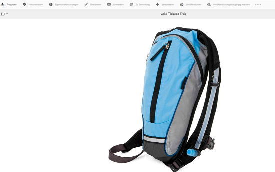
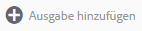

# Verwalten digitaler Assets {#managing-assets-with-the-touch-optimized-ui}

Erfahren Sie mehr über verschiedene Asset-Management- und -Bearbeitungsaufgaben, die Sie mithilfe der Touch-optimierten Benutzeroberfläche von [!DNL Experience Manager] Assets.

In diesem Artikel wird beschrieben, wie Sie Assets mit der Touch-optimierten Benutzeroberfläche von Adobe Experience Manager Assets verwalten und bearbeiten. Grundlegende Informationen zur Benutzeroberfläche finden Sie unter [Grundlegende Handhabung der Touch-optimierten Benutzeroberfläche](/help/sites-authoring/basic-handling.md). Informationen zum Verwalten von Inhaltsfragmenten finden Sie unter [Verwalten von Inhaltsfragmenten](content-fragments-managing.md) Assets.

## Erstellen von Ordnern {#create-folders}

Wenn Sie eine Sammlung von Assets organisieren, etwa alle `Nature`-Aufnahmen, können Sie Ordner erstellen, um diese zu gruppieren. Mit Ordnern können Sie Assets kategorisieren und organisieren. [!DNL Experience Manager]Bei  Assets müssen Sie Assets nicht in Ordner organisieren, um besser zu arbeiten.

>[!NOTE]
>
>* Freigeben eines Assets-Ordners vom Typ `sling:OrderedFolder` wird bei der Freigabe für Marketing Cloud nicht unterstützt. Wenn Sie einen Ordner freigeben möchten, wählen Sie beim Erstellen eines Ordners nicht „Geordnet“ aus.
>* In Experience Manager ist die Verwendung von `subassets` als Ordnername nicht zulässig. Dies ist ein Keyword, das für Knoten reserviert ist, die Teil-Assets für ebenenübergreifende Assets enthalten..

1. Navigieren Sie zu dem Ort in Ihrem Ordner „Digitale Assets“, an dem Sie einen neuen Ordner erstellen möchten.
1. Klicken Sie im Menü auf **[!UICONTROL Erstellen]**. Wählen Sie **[!UICONTROL Neuer Ordner]** aus.
1. Geben Sie in das Feld **[!UICONTROL Titel]** einen Ordnernamen an. DAM verwendet standardmäßig den Titel, den Sie als Ordnernamen angegeben haben. Wenn der Ordner erstellt wurde, können Sie die Standardeinstellung außer Kraft setzen und einen anderen Ordnernamen angeben.
1. Klicken Sie auf **[!UICONTROL Erstellen]**. Ihr Ordner wird im Ordner „Digitale Assets“ angezeigt.

Die folgenden Zeichen (in der Liste durch Leerzeichen getrennt) werden nicht unterstützt:

* Der Asset-Dateiname darf nicht enthalten: `* / : [ \ \ ] | # % { } ? &`
* Der Asset-Ordnername darf nicht enthalten: `* / : [ \ \ ] | # % { } ? \" . ^ ; + & \t`

## Hochladen von Assets {#uploading-assets}

Sie können verschiedene Asset-Typen (z. B. Bilder, PDF-Dateien, RAW-Dateien usw.) von Ihrem lokalen Ordner oder Netzlaufwerk in [!DNL Experience Manager] Assets.

>[!NOTE]
>
>Im Dynamic Media Scene 7-Modus können Sie nur Assets mit einer Dateigröße von maximal 2 GB hochladen.

Sie können Assets in Ordnern mit oder ohne zugewiesenem Verarbeitungsprofil hochladen.

Für Ordner mit zugewiesenem Verarbeitungsprofil wird der Profilname in der Miniatur der Kartenansicht angezeigt. In der Listenansicht wird der Profilname in der Spalte **[!UICONTROL Verarbeitungsprofil]** angezeigt. Siehe [Verarbeitungsprofile](processing-profiles.md).

Stellen Sie vor dem Hochladen eines Assets sicher, dass es sich in einem [unterstütztes Format](assets-formats.md).

**So laden Sie Assets hoch**:

1. Navigieren Sie in der Assets-Web-Oberfläche zu dem Speicherort, an dem Sie digitale Assets hinzufügen möchten.
1. Führen Sie einen der folgenden Schritte aus, um die Assets hochzuladen:

   * Tippen Sie in der Symbolleiste auf das Symbol **[!UICONTROL Erstellen]**. Tippen Sie dann im Menü auf **[!UICONTROL Dateien]**. Sie können die Datei im angezeigten Dialogfeld bei Bedarf umbenennen.
   * Ziehen Sie die Assets in einem Browser, der HTML 5 unterstützt, direkt auf die Benutzeroberfläche. Das Dialogfeld zum Umbenennen der Datei wird nicht angezeigt.

   

   Wenn Sie die Assets im Dialogfeld für die Dateiauswahl bei gedrückter Strg-/Befehlstaste markieren, können Sie mehrere Dateien auswählen. In iPad können Sie jeweils nur eine Datei auswählen.

   Sie können das Hochladen von großen Assets (größer als 500 MB) anhalten und später von der gleichen Seite aus fortsetzen. Tippen Sie auf das Symbol **[!UICONTROL Pause]** neben dem bei Uploadbeginn eingeblendeten Fortschrittsbalken.

   

   Die Größe, ab der ein Asset als großes Asset gilt, lässt sich konfigurieren. Sie können das System beispielsweise so konfigurieren, dass Assets über 1000 MB (anstatt 500 MB) als große Assets angesehen werden. In diesem Fall wird die Schaltfläche **[!UICONTROL Pause]** im Fortschrittsbalken angezeigt, wenn Assets hochgeladen werden, die größer als 1000 MB sind.

   Die **[!UICONTROL Anhalten]** -Schaltfläche zeigt nicht an, ob eine Datei mit einer Größe von mehr als 1000 MB mit einer Datei von weniger als 1000 MB hochgeladen wurde. Wenn Sie jedoch den Upload der Datei abbrechen, die kleiner ist als 1000 MB, wird die Schaltfläche **[!UICONTROL Pause]** angezeigt.

   Um die Größenbeschränkung zu ändern, konfigurieren Sie die `chunkUploadMinFileSize` -Eigenschaft der `fileupload`-Knoten im CRX-Repository.

   Wenn Sie auf das Symbol **[!UICONTROL Pause]** klicken, wird es zum Symbol **[!UICONTROL Wiedergabe]**. Um das Hochladen fortzusetzen, klicken Sie auf das Symbol **[!UICONTROL Wiedergabe.]**

   

   Um einen laufenden Upload abzubrechen, klicken Sie auf das `X` neben der Fortschrittsleiste. Wenn Sie den Upload abbrechen, [!DNL Experience Manager] Assets löscht den teilweise hochgeladenen Teil des Assets.

   Den Upload fortsetzen zu können, ist besonders hilfreich bei geringer Bandbreite und Netzwerkfehlern, bei denen der Upload großer Assets lange dauern kann. Sie können den Uploadvorgang anhalten und später fortsetzen, wenn die Bedingungen besser sind. Beim Fortsetzen beginnt der Upload an dem Punkt, an dem Sie pausiert haben.

   Während des Upload-Vorgangs [!DNL Experience Manager] speichert die Teile des hochgeladenen Assets als Datenblöcke im CRX-Repository. Wenn der Upload abgeschlossen ist, [!DNL Experience Manager] konsolidiert diese Blöcke in einem Datenblock im Repository.

   Um die Bereinigungsaufgabe für die nicht abgeschlossenen Chunk-Upload-Aufträge zu konfigurieren, navigieren Sie zu `https://[aem_server]:[port]/system/console/configMgr/org.apache.sling.servlets.post.impl.helper.ChunkCleanUpTask`.

   Wenn Sie ein Asset unter einem Namen hochladen, der bereits für ein Asset verwendet wird, das sich am Zielort befindet, wird eine Warnmeldung angezeigt.

   Sie können festlegen, ob ein vorhandenes Asset ersetzt, eine neue Version erstellt oder beide Assets beibehalten werden sollen, indem Sie das neue hochgeladene Asset umbenennen. Wenn Sie ein vorhandenes Asset ersetzen, werden die Metadaten für das Asset sowie alle vorherigen Änderungen und Verläufe (z. B. Anmerkungen, Zuschnitte usw.) gelöscht. Wenn Sie beide Assets beibehalten, wird das neue Asset umbenannt.

   

   >[!NOTE]
   >
   >Wenn Sie **[!UICONTROL Ersetzen]** im **[!UICONTROL Namenskonflikt]** -Dialogfeld wird die Asset-ID für das neue Asset neu generiert. Diese ID unterscheidet sich von der ID des vorherigen Assets.
   >
   >Wenn **[!UICONTROL Asset Insights]** aktiviert ist, um Impressionen/Klicks mit Adobe Analytics zu verfolgen. Diese neu generierte Asset-ID macht die für das Asset in Adobe Analytics erfassten Daten ungültig.

   Wenn das hochgeladene Asset in vorhanden ist [!DNL Experience Manager] Assets, die **[!UICONTROL Duplikate erkannt]** -Dialogfeld gibt eine Warnung aus, dass Sie versuchen, ein doppeltes Asset hochzuladen. Das Dialogfeld wird nur angezeigt, wenn der SHA-1-Prüfsummenwert der Binärdatei des bestehenden Assets dem des Assets entspricht, das Sie gerade hochladen. In diesem Fall sind die Namen der Assets unerheblich. Das bedeutet, dass das Dialogfeld auch für Assets mit unterschiedlichen Namen angezeigt werden kann, wenn die SHA 1-Werte für ihre Binärdateien identisch sind.

   >[!NOTE]
   >
   >Die **[!UICONTROL Duplikate erkannt]** wird nur angezeigt, wenn **[!UICONTROL Duplikatserkennung]** aktiviert ist. So aktivieren Sie die **[!UICONTROL Duplikatserkennung]** -Funktion, siehe [Aktivieren der Duplikatserkennung](duplicate-detection.md).

   

   Tippen **[!UICONTROL Keep]** , um das doppelte Asset in [!DNL Experience Manager] Assets. Tippen  **[!UICONTROL Löschen]** , um das doppelte Asset zu löschen, das Sie hochgeladen haben.

   [!DNL Experience Manager] Assets verhindert, dass Sie Assets hochladen, deren Dateinamen unzulässige Zeichen enthalten. Wenn Sie versuchen, ein Asset hochzuladen, das die unzulässigen Zeichen enthält, [!DNL Experience Manager] Assets zeigt eine Warnmeldung bezüglich des Vorhandenseins verbotener Zeichen im Dateinamen an und stoppt den Upload, bis Sie diese Zeichen entfernen oder mit einem zulässigen Namen hochladen.

   Um bestimmten Dateibenennungskonventionen für Ihre Organisation zu entsprechen, muss die **[!UICONTROL Hochladen von Assets]** können Sie lange Namen für die hochgeladenen Dateien angeben.

   

   Allerdings werden die folgenden Zeichen (in der Liste durch Leerzeichen getrennt) nicht unterstützt:
   * Der Asset-Dateiname darf nicht enthalten: `* / : [ \ \ ] | # % { } ? &`
   * Der Asset-Ordnername darf nicht enthalten: `* / : [ \ \ ] | # % { } ? \" . ^ ; + & \t`

   Darüber hinaus zeigt die Assets-Benutzeroberfläche das zuletzt hochgeladene Asset oder den Ordner, den Sie zuerst in allen Ansichten erstellt haben (**[!UICONTROL Kartenansicht]**, **[!UICONTROL Listenansicht]** und **[!UICONTROL Spaltenansicht]**).

   Oft können Sie beim gleichzeitigen Hochladen großer Assets oder mehrerer Assets anhand visueller Indikatoren den Fortschritt bewerten. Die **[!UICONTROL Upload-Fortschritt]** zeigt die Anzahl der erfolgreich hochgeladenen Dateien und die Dateien an, die nicht hochgeladen werden konnten.

   

   Wenn Sie den Upload abbrechen, bevor die Dateien hochgeladen werden, [!DNL Experience Manager] Assets stoppt das Hochladen der aktuellen Datei und aktualisiert den Inhalt. Dateien, die bereits hochgeladen wurden, werden jedoch nicht gelöscht.

### Serielle Uploads {#serial-uploads}

Das Hochladen zahlreicher Assets in großen Mengen erfordert erhebliche Systemressourcen, die sich negativ auf die Leistung Ihrer [!DNL Experience Manager] Implementierung. Mögliche Engpässe sind Ihre Internetverbindung, Lese- und Schreibvorgänge auf der Festplatte, Webbrowserbeschränkungen bei der Anzahl der POST-Anfragen beim gleichzeitigen Asset-Upload. Der Massen-Upload kann fehlschlagen oder vorzeitig beenden. Mit anderen Worten: [!DNL Experience Manager] Assets können einige Dateien bei der Aufnahme einer Reihe von Dateien vermissen oder Dateien überhaupt nicht aufnehmen.

Um diese Situation zu überwinden, [!DNL Experience Manager] Assets erfasst ein Asset nach dem anderen (serielles Hochladen) während eines Massen-Upload-Vorgangs, anstatt alle Assets gleichzeitig aufzunehmen.

Der serielle Upload von Assets ist standardmäßig aktiviert. Um die Funktion zu deaktivieren und das gleichzeitige Hochladen zuzulassen, überlagern Sie die `fileupload` Knoten in CRXDe und legen Sie den Wert der `parallelUploads` Eigenschaft auf `true`.

### Hochladen von Assets über FTP {#uploading-assets-using-ftp}

Dynamic Media ermöglicht das Batch-Hochladen von Assets über den FTP-Server. Wenn Sie große Assets (über 1 GB) oder ganze Ordner und Unterordner hochladen möchten, sollten Sie FTP verwenden. Sie können das Hochladen per FTP auch einrichten, um Uploads regelmäßig und nach Plan durchzuführen.

>[!NOTE]
>
>Im Dynamic Media Scene 7-Modus können Sie nur Assets mit einer Dateigröße von maximal 2 GB hochladen.

>[!NOTE]
>
>So laden Sie Assets über FTP in Dynamic Media hoch - Scene7-Modus installieren Sie Feature Pack (FP) 18912 on [!DNL Experience Manager] author. Wenden Sie sich an den Support von Adobe, um Zugriff auf FP-18912 zu erhalten und die Einrichtung Ihres FTP-Kontos abzuschließen. Weitere Informationen finden Sie unter [Installieren von Feature Pack 18912 für Massenmigration von Assets](/help/assets/bulk-ingest-migrate.md).
>
>Wenn Sie FTP zum Hochladen von Assets verwenden, werden die in [!DNL Experience Manager] werden ignoriert. Stattdessen werden Dateiverarbeitungsregeln, wie in Dynamic Media Classic definiert, verwendet.    

**So laden Sie Assets per FTP hoch**

1. Verwenden Sie den FTP-Client Ihrer Wahl und melden Sie sich beim FTP-Server mit dem FTP-Benutzernamen und -Kennwort aus der Bereitstellungs-E-Mail an. Laden Sie die Dateien und/oder Ordner über den FTP-Client auf den FTP-Server hoch.
1. Öffnen Sie die [Dynamic Media Classic-Desktop-Applikation](https://experienceleague.adobe.com/docs/dynamic-media-classic/using/getting-started/signing-out.html?lang=de#getting-started)und melden Sie sich dann mit den Anmeldedaten, die Sie von der Bereitstellungs-E-Mail erhalten haben, bei Ihrem Konto an.
1. Tippen oder klicken Sie in der Leiste „Globale Navigation“ auf **[!UICONTROL Hochladen]**.
1. Im **[!UICONTROL Hochladen]** Seite oben links tippen Sie auf die **[!UICONTROL Über FTP]** Registerkarte.
1. Wählen Sie im linken Bereich der Seite einen FTP-Ordner aus, aus dem Sie Dateien hochladen. Auf der rechten Seite der Seite wählen Sie einen Zielordner aus.
1. Tippen Sie unten rechts auf der Seite auf **[!UICONTROL Auftragsoptionen]** und legen Sie dann die gewünschten Optionen basierend auf den Assets im ausgewählten Ordner fest.

   Siehe [Upload-Auftragsoptionen](#upload-job-options).

   >[!NOTE]
   >
   >Wenn Sie Assets über FTP hochladen, haben die in Dynamic Media Classic festgelegten Upload-Auftragsoptionen Vorrang vor den in AEM festgelegten Asset-Verarbeitungsparametern.

1. In der rechten unteren Ecke der **[!UICONTROL Upload-Auftragsoptionen]** Dialogfeld, tippen Sie auf **[!UICONTROL Speichern]**.
1. In der rechten unteren Ecke der **[!UICONTROL Hochladen]** Seite, tippen Sie auf **[!UICONTROL Upload starten]**.

   Um den Upload-Fortschritt anzuzeigen, tippen Sie in der Leiste „Globale Navigation“ auf **[!UICONTROL Aufträge]**. Die **[!UICONTROL Aufträge]** zeigt den Fortschritt des Uploads an. Sie können die Arbeit in [!DNL Experience Manager] Sie können jederzeit zur Seite &quot;Aufträge&quot;in Dynamic Media Classic zurückkehren, um einen laufenden Auftrag zu überprüfen.

   Um die laufende Verarbeitung eines Upload-Auftrags abzubrechen, tippen oder klicken Sie neben der Information „Dauer“ auf die Schaltfläche **[!UICONTROL Abbrechen]****[!UICONTROL .]**

#### Upload-Auftragsoptionen {#upload-job-options}

| Upload-Optionen | Unteroption | Beschreibung |
|---|---|---|
| Auftragsname |  | Der Name, der standardmäßig in diesem Feld erstellt wird, enthält den vom Benutzer eingegebenen Teil des Namens und einen Zeitstempel samt Datum. Für diesen Upload-Auftrag können Sie den Standardnamen oder einen von Ihnen selbst erstellten Namen verwenden.  Der Auftrag und andere Upload- und Veröffentlichungsaufträge werden auf der Seite „Aufträge“ aufgezeichnet, wo Sie den Status der Aufträge prüfen können. |
| Nach dem Hochladen veröffentlichen |  | Veröffentlicht Assets automatisch nach dem Hochladen. |
| In belieb. Ordner Assets mit ident. Namen unabh. von Erweit. überschreiben |  | Wählen Sie diese Option aus, wenn hochgeladene Dateien vorhandene Dateien mit denselben Namen ersetzen sollen. Der Name dieser Option kann möglicherweise anders lauten, je nach den Einstellungen in **[!UICONTROL Anwendungseinstellungen]** > **[!UICONTROL Allgemeine Einstellungen]** > **[!UICONTROL Zur Anwendung hochladen]** > **[!UICONTROL Bilder überschreiben]**. |
| ZIP- oder TAR-Dateien beim Hochladen dekomprimieren |  |  |
| Auftragsoptionen |  | Tippen/klicken Sie auf **[!UICONTROL Auftragsoptionen]** , um [!UICONTROL Upload-Auftragsoptionen] und wählen Sie Optionen aus, die sich auf den gesamten Upload-Auftrag auswirken. Diese Optionen sind für alle Dateitypen gleich. Sie können über die Seite „Allgemeine Programmeinstellungen“ Standardoptionen für das Hochladen von Dateien auswählen. Um diese Seite zu öffnen, wählen Sie **[!UICONTROL Einstellung]** > **[!UICONTROL Anwendungseinstellungen]**. Tippen Sie auf **[!UICONTROL Standardmäßige Upload-Optionen]** Schaltfläche zum Öffnen [!UICONTROL Upload-Auftragsoptionen] Dialogfeld. |
|  | Wenn | Wählen Sie „Einmalig“ oder „Wiederkehrend“ aus. Zum Einrichten eines wiederkehrenden Auftrags wählen Sie eine Wiederholungsoption („Täglich“, „Wöchentlich“, „Monatlich“ oder „Benutzerdefiniert“), um anzugeben, wie oft der FTP-Upload-Auftrag wiederholt werden soll. Dann geben Sie nach Bedarf die Planungsoptionen an. |
|  | Unterordner einschließen | Laden Sie alle Unterordner im hochzuladenden Ordner hoch. Die Namen des Ordners und der von Ihnen hochgeladenen Unterordner werden automatisch in [!DNL Experience Manager] Assets. |
|  | Optionen für das Zuschneiden | Um die Seiten eines Bildes manuell zu beschneiden, wählen Sie im Menü „Beschneiden“ die Option „Manuell“ aus. Dann geben Sie die Anzahl von Pixeln ein, die an einer oder jeder Seite des Bildes abgeschnitten werden sollen. Um wie viel das Bild beschnitten wird, hängt von der ppi-Einstellung (Pixel per Inch; Pixel pro Zoll) in der Bilddatei ab. Beispiel: Wenn das Bild 150 ppi aufweist und Sie 75 in die Textfelder für oben, rechts, unten und links eingeben, wird ein halber Zoll von jeder Seite abgeschnitten.  Zum automatischen Beschneiden der Leerraumpixel eines Bildes öffnen Sie das Menü „Beschneiden“, wählen Sie „Manuell“ und geben Sie zum Beschneiden der Seiten die Pixelwerte in die Felder „Oben“, „Rechts“, „Unten“ und „Links“ ein. Sie können im Menü „Beschneiden“ auch „Zuschneiden“ und anschließend folgende Optionen auswählen:  **Beschneiden basierend auf** <ul><li>**Farbe** - Wählen Sie die Option Farbe aus. Wählen Sie anschließend im Menü „Ecke“ die Bildecke mit der Farbe aus, die am besten der Leerraumfarbe entspricht, die Sie entfernen möchten.</li><li>**** Transparenz – Wählen Sie die Option „Transparenz“.  **Toleranz** - Ziehen Sie den Regler, um eine Toleranz von 0 bis 1 festzulegen. Für das Zuschneiden auf der Grundlage der Farbe geben Sie 0 an, damit Pixel nur dann abgeschnitten werden, wenn sie genau der Farbe entsprechen, die Sie in der Bildecke ausgewählt haben. Werte, die näher an 1 liegen, lassen eine größere Farbdifferenz zu. Für das Zuschneiden auf der Grundlage der Transparenz geben Sie den Wert 0 an, damit Pixel nur dann abgeschnitten werden, wenn sie transparent sind. Werte, die näher an 1 liegen, lassen eine größere Transparenz zu.</li></ul> Beachten Sie, dass diese Optionen für das Beschneiden zerstörungsfrei sind. |
|  | Farbprofiloptionen | Wählen Sie beim Erstellen optimierter Dateien eine Farbkonversion aus, die für die Bereitstellung verwendet wird:<ul><li>Beibehaltung der Standardfarbe: Behält die Farben des Quellbildes bei, wenn die Bilder Farbrauminformationen enthalten. Es findet keine Farbkonversion statt. Heutzutage ist in fast allen Bildern das entsprechende Farbprofil eingebettet. Wenn jedoch ein CMYK-Quellbild kein eingebettetes Farbprofil enthält, werden die Farben in den Farbraum sRGB (standardmäßiges Rot Grün Blau) konvertiert. sRGB ist der empfohlene Farbraum zum Anzeigen von Bildern auf Webseiten.</li><li>Ursprünglichen Farbraum beibehalten: Behält die ursprünglichen Farben bei, ohne dass an der betreffenden Stelle eine Farbkonversion stattfindet. Bei Bildern ohne eingebettetes Farbprofil wird jede Farbkonversion mit den in den Veröffentlichungseinstellungen konfigurierten Standardfarbprofilen durchgeführt. Die Farbprofile stimmen möglicherweise nicht mit der Farbe in den Dateien überein, die mit dieser Option erstellt wurden. Deshalb empfiehlt es sich, die Option „Beibehaltung der Standardfarbe“ zu verwenden.</li><li>Benutzerdefinierte Einstellung von > in:  Öffnet Menüs, damit Sie einen „Konvertieren von“- und einen „Konvertieren in“-Farbraum auswählen können. Diese erweiterte Option überschreibt alle Farbinformationen, die in die Quelldatei eingebettet sind. Wählen Sie diese Option aus, wenn alle Bilder, die Sie senden, falsche oder fehlende Farbprofildaten enthalten.</li></ul> |
|  | Bildbearbeitungsoptionen | Sie können die Beschneidungsmasken in Bildern beibehalten und ein Farbprofil auswählen.  Siehe [Festlegen von Bildbearbeitungsoptionen beim Hochladen](#setting-image-editing-options-at-upload). |
|  | PostScript-Optionen | Sie können PostScript®-Dateien rastern, Dateien beschneiden, transparente Hintergründe beibehalten sowie eine Auflösung und einen Farbraum auswählen.  Siehe [Festlegen von PostScript- und Illustrator-Uploadoptionen](#setting-postscript-and-illustrator-upload-options). |
|  | Photoshop-Optionen | Sie können Vorlagen aus Adobe® Photoshop®-Dateien erstellen, Ebenen beibehalten, Ebenennamen angeben, Text extrahieren und angeben, wie Bilder in Vorlagen verankert werden.  Beachten Sie, dass in AEM Vorlagen nicht unterstützt werden.  Siehe [Festlegen von Photoshop-Uploadoptionen](#setting-photoshop-upload-options). |
|  | PDF-Optionen | Sie können die Dateien rastern, Suchbegriffe und -links extrahieren, automatisch einen E-Katalog erstellen, die Auflösung einstellen und einen Farbraum auswählen.  Beachten Sie, dass in AEM E-Kataloge nicht unterstützt werden.   Siehe [Festlegen von PDF-Uploadoptionen ](#setting-pdf-upload-options) **Hinweis**: Die maximale Seitenanzahl für eine PDF, die für die Extraktion berücksichtigt werden soll, beträgt 5.000 Seiten für neue Uploads. Dieser Grenzwert wird am 31. Dezember 2022 auf 100 Seiten (für alle PDF) geändert. Siehe auch [Einschränkungen bei Dynamic Media](/help/assets/limitations.md). |
|  | Illustrator-Optionen | Sie können Adobe Illustrator®-Dateien rastern, transparente Hintergründe beibehalten sowie eine Auflösung und einen Farbraum auswählen.  Siehe [Festlegen von PostScript- und Illustrator-Uploadoptionen](#setting-postscript-and-illustrator-upload-options). |
|  | eVideo-Optionen | Sie können eine Videodatei durch Auswahl einer Videovorgabe transkodieren.  Siehe [Festlegen von eVideo-Uploadoptionen](#setting-evideo-upload-options). |
|  | Stapelsatz-Vorgaben | Um ein Bild- oder Rotationsset aus den hochgeladenen Dateien zu erstellen, klicken Sie auf die Spalte „Aktiv“ der Vorgabe, die Sie verwenden möchten. Sie können mehrere Vorgaben auswählen. Die Vorgaben erstellen Sie auf der Seite „Anwendungseinstellungen/Stapelsatzvorgaben“ von Dynamic Media Classic.  Weitere Informationen zur Erstellung von Stapelsatzvorgaben finden Sie unter [Konfigurieren von Stapelsatzvorgaben zum automatischen Erstellen von Bild- und Rotationssets](config-dms7.md#creating-batch-set-presets-to-auto-generate-image-sets-and-spin-sets).  Siehe [Festlegen von Stapelsatzvorgaben beim Hochladen](#setting-batch-set-presets-at-upload). |

#### Festlegen von Bildbearbeitungsoptionen beim Hochladen {#setting-image-editing-options-at-upload}

Beim Hochladen von Bilddateien, einschließlich AI-, EPS- und PSD-Dateien, können Sie die folgenden Bearbeitungsaktionen im **[!UICONTROL Upload-Auftragsoptionen]** Dialogfeld:

* Beschneiden von Leerzeichen am Rand von Bildern (siehe Beschreibung in der obigen Tabelle).
* Ränder von Bildern manuell beschneiden (siehe Beschreibung in der oben stehenden Tabelle)
* Ein Farbprofil auswählen (siehe Optionsbeschreibung in der oben stehenden Tabelle)
* Eine Maske aus einem Beschneidungspfad erstellen
* Bilder scharfzeichnen mit Optionen für „Unscharf maskieren“
* Hintergrund aussparen

| Option | Unteroption | Beschreibung |
|---|---|---|
| Maske aus Beschneidungspfad erstellen |  | Erstellt basierend auf den Beschneidungspfad-Informationen eine Maske für das Bild. Diese Option ist auf Bilder anwendbar, die mit Bildbearbeitungsanwendungen erstellt wurden, in denen ein Beschneidungspfad erstellt wurde. |
| Unschärfemaske |  | Ermöglicht Ihnen die Feineinstellung eines Schärfefiltereffekts im finalen Downsampling-Bild. So können Sie die Intensität und den Radius des Effekts (in Pixel) sowie einen Schwellenwert für ignorierten Kontrast angeben.  Bei diesem Effekt werden dieselben Optionen wie im Filter „Unschärfemaske“ von Photoshop verwendet. Im Gegensatz zu dem, was der Name besagt, ist „Unscharf maskieren“ ein Scharfzeichnungsfilter. Wählen Sie unter „Unschärfemaske“ die gewünschten Optionen aus. Im Folgenden finden Sie Beschreibungen der Einstellungsoptionen: |
|  | Stärke | Steuert den auf die Kanten-Pixel angewendeten Kontrastwert.  Betrachten Sie diese Unteroption als Intensität des Effekts. Der Hauptunterschied zwischen den Werten von „Unscharf maskieren“ in Dynamic Media und den Werten in Adobe Photoshop ist, dass Adobe Photoshop einen Wertebereich verwendet, der von 1 % bis 500 % reicht. In Dynamic Media hingegen reichen die Werte von 0,0 bis 5,0. Der Wert 5,0 entspricht ungefähr 500 % in Photoshop, der Wert 0,9 ungefähr 90 % usw. |
|  | Radius | Steuert den Radius des Effekts. Der Wertebereich reicht von 0 bis 250.  Der Effekt wird auf alle Pixel in einem Bild angewendet und verbreitet sich in alle Richtungen. Der Radius wird in Pixel gemessen. Um beispielsweise einen ähnlichen Scharfzeichnungseffekt für ein Bild mit 2000 x 2000 Pixel und ein Bild mit 500 x 500 Pixel zu erhalten, können Sie einen Radius von zwei Pixel für das Bild mit 2000 x 2000 Pixel und einen Radius von einem Pixel für das Bild mit 500 x 500 Pixel festlegen. Ein größerer Wert wird für ein Bild mit mehr Pixel verwendet. |
|  | Schwelle | Beschreibt den Kontrastbereich, der beim Anwenden der Unschärfemaske ignoriert wird. Das ist wichtig, damit kein Bildrauschen entsteht, wenn dieser Filter verwendet wird. Der Wertebereich reicht von 0 bis 255. Diese Werte stehen für die Anzahl der Helligkeitsschritte in einem Graustufenbild. 0 = Schwarz, 128 = 50 % Grau und 255 = Weiß.  Bei einem Schwellenwert von 12 werden beispielsweise leichte Variationen der Hauttonhelligkeit ignoriert, um Rauschen zu vermeiden. Gleichzeitig wird kontrastreichen Bereichen, z. B. wo Wimpern auf die Haut treffen, Kantenkontrast hinzugefügt.  Wenn Sie z. B. ein Foto von jemandem haben, wirkt sich die Unschärfemaske auf die kontrastreichen Teile des Bildes aus, z. B. wo Wimpern und Haut zusammenkommen, um einen offensichtlichen Kontrastbereich zu schaffen, und auf die glatte Haut selbst. Selbst die glatteste Haut weist geringfügige Änderungen der Helligkeitswerte auf. Wenn Sie keinen Schwellenwert verwenden, akzentuiert der Filter diese geringfügigen Änderungen in den Hautpixel. Dadurch entsteht ein verrauschter und unerwünschter Effekt, während der Kontrast an den Wimpern verstärkt und die Schärfe intensiviert wird.  Zur Vermeidung dieses Problems wird ein Schwellenwert verwendet, der den Filter anweist, die Pixel zu ignorieren, die den Kontrast nicht wesentlich ändern, beispielsweise bei glatter Haut.  Beachten Sie in der weiter oben gezeigten Reißverschlussgrafik die Textur neben dem Reißverschluss. Hier ist Bildrauschen erkennbar, weil die Schwellenwerte zu niedrig waren, um das Bildrauschen zu unterdrücken. |
|  | Monochrom | Wählen Sie diese Option aus, um die Unschärfemaske auf die Bildhelligkeit (Intensität) anzuwenden.  Deaktivieren Sie diese Unteroption, um die Unschärfemaske auf jede Farbkomponente einzeln anzuwenden. |
| Hintergrund aussparen |  | Entfernt beim Hochladen automatisch den Hintergrund eines Bildes. Mit dieser Technik ist es möglich, die Aufmerksamkeit auf ein bestimmtes Objekt zu lenken und es von einem belebten Hintergrund abzuheben. Wählen Sie diese Option aus, um die Funktion „Hintergrund aussparen“ und die folgenden Optionen zu aktivieren: |
|  | Ecke | Erforderlich.  Die Ecke des Bildes, mit der die auszusparende Hintergrundfarbe definiert wird.  Sie können aus **Oben links**, **Unten links**, **Oben rechts** und **Unten rechts** wählen. |
|  | Füllmethode | Erforderlich.  Zur Steuerung der Pixeltransparenz ausgehend von der Ecke, die Sie gewählt haben.  Sie können aus folgenden Füllmethoden wählen: <ul><li>**Großflächig füllen** – Macht alle Pixel transparent, die mit der von Ihnen angegebenen Ecke übereinstimmen und mit ihr verbunden sind.</li><li>**Pixel abgleichen** – Macht alle entsprechenden Pixel transparent, unabhängig von ihrer Position auf dem Bild.</li></ul> |
|  | Toleranz | Optional.  Steuert die zulässige Abweichung der Pixelfarbe ausgehend von der Ecke, die Sie festgelegt haben.  Verwenden Sie den Wert 0,0, um die Pixelfarben genau anzugleichen, oder verwenden Sie den Wert 1,0, um die größtmögliche Abweichung zuzulassen. |

#### Festlegen von PostScript- und Illustrator-Uploadoptionen {#setting-postscript-and-illustrator-upload-options}

Wenn Sie PostScript (EPS)- oder Illustrator (AI)-Bilddateien hochladen, können Sie diese auf verschiedene Arten formatieren. Sie können die Dateien rastern, den transparenten Hintergrund beibehalten sowie eine Auflösung und einen Farbraum auswählen. Optionen zum Formatieren von PostScript- und Illustrator-Dateien stehen im Dialogfeld „Upload-Auftragsoptionen“ unter PostScript- und Illustrator-Optionen zur Verfügung.

| Option | Unteroption | Beschreibung |
|---|---|---|
| Verarbeitung |  | Wählen Sie **[!UICONTROL Rastern]**, um Vektorgrafiken in der Datei in das Bitmap-Format zu konvertieren. |
| Transparenten Hintergrund in gerendertem Bild beibehalten |  | Zur Beibehaltung der Hintergrundtransparenz der Datei. |
| Auflösung |  | Zur Einstellung der Auflösung. Mit dieser Einstellung wird bestimmt, wie viele Pixel pro Zoll in der Datei angezeigt werden. |
| Farbraum |  | Klicken Sie auf das Menü „Farbraum“ und wählen Sie unter den folgenden Farbraumoptionen: |
|  | Automatisch erkennen | Der Farbraum der Datei wird beibehalten. |
|  | Immer RGB | Zur Konvertierung in den RGB-Farbraum. |
|  | Immer CMYK | Zur Konvertierung in den CMYK-Farbraum. |
|  | Immer Graustufen | Zur Konvertierung in den Graustufenfarbraum. |

#### Festlegen von Photoshop-Uploadoptionen {#setting-photoshop-upload-options}

PSD (Photoshop)-Dateien werden meist zum Erstellen von Bildvorlagen verwendet. Wenn Sie eine PSD-Datei hochladen, können Sie daraus automatisch eine Bildvorlage erstellen (aktivieren Sie auf dem Uploadbildschirm die Option „Vorlage erstellen“). 

Dynamic Media erstellt mehrere Bilder aus einer PSD-Datei mit Ebenen, wenn Sie die Datei zum Erstellen einer Vorlage verwenden. Für jede Ebene wird ein Bild erstellt.

Verwenden Sie die **[!UICONTROL Optionen zum Zuschneiden]** und **[!UICONTROL Farbprofiloptionen]**, wie oben beschrieben, mit Photoshop-Uploadoptionen.

>[!NOTE]
>
>Vorlagen werden nicht in AEM unterstützt.

| Option | Unteroption | Beschreibung |
|---|---|---|
| Ebenen beibehalten |  | Teilt die Ebenen in der PSD-Datei ggf. in einzelne Assets auf. Die Asset-Ebenen bleiben der PSD-Datei zugeordnet. Sie können sie anzeigen, indem Sie die PSD-Datei in der Detailansicht öffnen und das Ebenenfenster auswählen. |
| Vorlage erstellen |  | Erstellt eine Vorlage aus den Ebenen der PSD-Datei. |
| Text extrahieren |  | Extrahiert den Text, damit Benutzer den Text in einem Viewer suchen können. |
| Ebenen auf Hintergrundgröße ausdehnen |  | Erweitert die Größe aufgeteilter Bildebenen auf die Größe der Hintergrundebene. |
| Ebenenbenennung |  | Ebenen in der PSD-Datei werden als separate Bilder hochgeladen. |
|  | Ebenenname | Benennt die Bilder nach ihren Ebenennamen in der PSD-Datei. Wenn eine Ebene in der Original-PSD-Datei beispielsweise „Preisschild“ heißt, wird auch das zugehörige Bild „Preisschild“ genannt. Wenn es sich bei den Ebenennamen in der PSD-Datei jedoch um standardmäßige Photoshop-Ebenennamen handelt (Hintergrund, Ebene 1, Ebene 2 usw.), werden die Bilder nicht nach den Standardebenennamen, sondern nach den zugehörigen Ebenennummern in der PSD-Datei benannt. |
|  | Photoshop- und Ebenennummer | Benennt die Bilder nach ihren Ebenennummern in der PSD-Datei und ignoriert die ursprünglichen Ebenennamen. Bilder werden mit dem Photoshop-Dateinamen und einer angefügten Ebenennummer benannt. Zum Beispiel erhält die zweite Ebene der Datei Frühjahrsannonce.psd den Namen Frühjahrsannonce_2, auch wenn sie in Photoshop einen nicht standardmäßigen Namen hatte. |
|  | Photoshop- und Ebenenname | Benennt die Bilder nach der PSD-Datei, gefolgt vom Ebenennamen oder der -nummer. Die Ebenennummer wird verwendet, wenn es sich bei den Ebenennamen in der PSD-Datei um standardmäßige Photoshop-Ebenennamen handelt. Zum Beispiel erhält eine Ebene mit dem Namen „Preisschild“ in einer PSD-Datei mit dem Namen „Frühjahrsannonce“ den Namen „Frühjahrsannonce_Preisschild“. Eine Ebene mit dem standardmäßigen Namen „Ebene 2“ erhält den Namen „Frühjahrsannonce_2“. |
| Anker |  | Geben Sie an, wie Bilder in Vorlagen, die aus der Zusammenstellung der Ebenen aus der PSD-Datei erstellt werden, verankert werden. Der Anker ist standardmäßig zentriert. Ein zentrierter Anker eignet sich am besten zum Auffüllen desselben Raums mit Ersatzbildern, unabhängig vom Seitenverhältnis der Ersatzbilder. Bilder mit einem anderen Seitenverhältnis, die dieses Bild ersetzen, nehmen effektiv denselben Raum ein, wenn auf die Vorlage verwiesen und die Parameterersetzung durchgeführt wird. Wählen Sie eine andere Einstellung, wenn es für Ihre Anwendung erforderlich ist, dass die Ersatzbilder den zugeordneten Raum in der Vorlage ausfüllen. |

#### Festlegen von PDF-Uploadoptionen {#setting-pdf-upload-options}

Wenn Sie eine PDF-Datei hochladen, können Sie diese auf verschiedene Arten formatieren. Sie können ihre Seiten zuschneiden, Suchbegriffe extrahieren, eine ppi (Pixel pro Zoll)-Auflösung eingeben und einen Farbraum auswählen. PDF-Dateien enthalten oft einen Beschnittrand, Schnittmarken, Registrierungsmarken und andere Druckermarken. Sie können diese Marken von den Seitenrändern aus zuschneiden, wenn Sie eine PDF-Datei hochladen.

Die maximale Seitenanzahl für eine PDF, die für die Extraktion berücksichtigt werden soll, beträgt 5.000 Seiten für neue Uploads. Dieser Grenzwert wird am 31. Dezember 2022 auf 100 Seiten (für alle PDF) geändert. Siehe auch [Einschränkungen bei Dynamic Media](/help/assets/limitations.md).

>[!NOTE]
>
>E-Kataloge werden nicht in AEM unterstützt.

Wählen Sie unter folgenden Optionen:

| Option | Unteroption | Beschreibung |
|---|---|---|
| Verarbeitung | Rastern | (Standard) Zum Extrahieren der Seiten aus der PDF-Datei und zum Konvertieren von Vektorgrafiken in Bitmap-Bilder. Wählen Sie diese Option, um einen E-Katalog zu erstellen. |
| Extrahieren | Suchbegriffe | Zum Extrahieren von Wörtern aus der PDF-Datei, damit die Datei in einem E-Katalog-Viewer mit einem Schlüsselwort durchsucht werden kann. |
|  | Links | Zum Extrahieren von Links aus den PDF-Dateien und zum Konvertieren der PDF-Dateien in Imagemaps, die in einem E-Katalog-Viewer verwendet werden. |
| E-Katalog aus mehrseitiger PDF automatisch erstellen |  | Zum automatischen Erstellen eines E-Katalogs aus der PDF-Datei. Der E-Katalog wird nach der von Ihnen hochgeladenen PDF-Datei benannt. (Diese Option ist nur dann verfügbar, wenn Sie die PDF-Datei beim Hochladen rastern.) |
| Auflösung |  | Zum Festlegen der Auflösung: Mit dieser Einstellung wird bestimmt, wie viele Pixel pro Zoll in der PDF-Datei angezeigt werden. Der Standardwert ist 150. |
| Farbraum |  | Wählen Sie das Farbraummenü und einen Farbraum für die PDF-Datei aus. Die meisten PDF-Dateien enthalten sowohl RGB- als auch CMYK-Farbbilder. Der RGB-Farbraum eignet sich besonders gut, um Dateien online anzuzeigen. |
|  | Automatisch erkennen | Der Farbraum der PDF-Datei wird beibehalten. |
|  | Immer RGB | Zur Konvertierung in den RGB-Farbraum. |
|  | Immer CMYK | Zur Konvertierung in den CMYK-Farbraum. |
|  | Immer Graustufen | Zur Konvertierung in den Graustufenfarbraum. |

#### Festlegen von eVideo-Uploadoptionen {#setting-evideo-upload-options}

Sie können eine Videodatei neu kodieren, indem Sie aus einer Vielzahl von Videovorgaben auswählen.

| Option | Unteroption | Beschreibung |
|---|---|---|
| Adaptives Video |  | Eine einzelne Kodierungsvorgabe, die mit jedem Seitenverhältnis verwendet werden kann, um Videos für die Bereitstellung auf Mobilgeräten, Tablets und Desktops zu erstellen. Hochgeladene Quellvideos, die mit dieser Vorgabe kodiert wurden, weisen eine feste Höhe auf. Die Breite wird jedoch automatisch skaliert, um das Seitenverhältnis des Videos beizubehalten.  Es empfiehlt sich, die adaptive Videokodierung zu verwenden. |
| Einzelne Kodierungsvorgaben | Kodierungsvorgaben sortieren | Wählen Sie Name oder Größe aus, um die unter &quot;Desktop, Mobile und Tablet&quot;aufgelisteten Kodierungsvorgaben nach Name oder Auflösung zu sortieren. |
|  | Desktop | Erstellen Sie eine MP4-Datei für die Bereitstellung eines Streaming- oder progressiven Videoerlebnisses auf Desktop-Computern. Wählen Sie ein oder mehrere Seitenverhältnisse mit der gewünschten Auflösungsgröße und Zieldatenrate aus. |
|  | Mobilgerät | Erstellen Sie eine MP4-Datei für die Bereitstellung auf iPhone- oder Android-Mobilgeräten. Wählen Sie ein oder mehrere Seitenverhältnisse mit der gewünschten Auflösungsgröße und Zieldatenrate aus. |
|  | Tablet | Erstellen Sie eine MP4-Datei für die Bereitstellung auf iPad- oder Android-Tablet-Geräten. Wählen Sie ein oder mehrere Seitenverhältnisse mit der gewünschten Auflösungsgröße und Zieldatenrate aus. |

#### Festlegen von Stapelsatzvorgaben beim Hochladen {#setting-batch-set-presets-at-upload}

Wenn Sie aus hochgeladenen Bildern automatisch ein Bildset oder Rotationsset erstellen möchten, klicken Sie auf die Schaltfläche **[!UICONTROL Aktiv]** -Spalte für die Vorgabe, die Sie verwenden möchten. Sie können mehrere Vorgaben auswählen. 

Weitere Informationen zur Erstellung von Stapelsatzvorgaben finden Sie unter [Konfigurieren von Stapelsatzvorgaben zum automatischen Erstellen von Bild- und Rotationssets](config-dms7.md#creating-batch-set-presets-to-auto-generate-image-sets-and-spin-sets).

### Gestreamte Uploads {#streamed-uploads}

Wenn Sie zahlreiche Assets hochladen, ruft I/O die [!DNL Experience Manager] Der -Server erhöht sich drastisch, was die Upload-Effizienz verringert und sogar zu einer Zeitüberschreitung führen kann. [!DNL Experience Manager] Assets unterstützt gestreamte Uploads von Assets. Gestreamte Uploads sorgen für eine Datenträger-I/O-Reduzierung beim Hochladen, da die Speicherung von Assets in einem temporären Ordner auf dem Server vermieden wird, bevor Assets in das Repository kopiert werden. Stattdessen werden die Daten direkt an das Repository übertragen. Auf diese Weise wird die Zeit für das Hochladen von Assets und die Möglichkeit von Zeitüberschreitungen verringert. Der gestreamte Upload ist standardmäßig in aktiviert. [!DNL Experience Manager] Assets.

Der Streaming-Upload ist deaktiviert für [!DNL Experience Manager] auf dem JEE-Server mit Servlet-API-Version unter 3.1 ausgeführt werden.

### ZIP-Archiv mit Assets extrahieren {#extract-zip-archive-containing-assets}

Sie können ZIP-Archive wie jedes andere unterstützte Asset hochladen. Für ZIP-Dateien gelten dieselben Regeln für Dateinamen. [!DNL Experience Manager]Mit können Sie ein ZIP-Archiv in einen DAM-Speicherort extrahieren. 

Wählen Sie jeweils ein ZIP-Archiv aus, klicken Sie auf **[!UICONTROL Archiv extrahieren]** und wählen Sie einen Zielordner aus. Wählen Sie eine Option für den Umgang mit eventuellen Konflikten. Wenn die Assets in der ZIP-Datei bereits im Zielordner vorhanden sind, können Sie eine der folgenden Optionen auswählen: Extrahieren überspringen, vorhandene Dateien ersetzen, beide Assets durch Umbenennen behalten oder neue Version erstellen.

Nach Abschluss der Extraktion [!DNL Experience Manager] benachrichtigt Sie im Benachrichtigungsbereich. while [!DNL Experience Manager] extrahiert die ZIP, können Sie zu Ihrer Arbeit zurückkehren, ohne die Extraktion zu unterbrechen.

Die Funktion hat einige Einschränkungen:

* Wenn sich ein gleichnamiger Ordner am Ziel befindet, werden die Assets aus der ZIP-Datei in diesen extrahiert.

* Wenn Sie die Extrahierung abbrechen, werden die bereits extrahierten Assets nicht gelöscht.

* Sie können nicht gleichzeitig zwei ZIP-Dateien auswählen und extrahieren. Sie können jeweils nur ein ZIP-Archiv extrahieren.

## Vorschau von Medienelementen {#previewing-assets}

**So zeigen Sie die Asset-Vorschau an**:

1. Navigieren Sie in der Assets-Benutzeroberfläche zum Speicherort des Assets, das Sie in der Vorschau anzeigen möchten.
1. Tippen Sie auf das gewünschte Asset, um es zu öffnen.

1. Im Vorschaumodus ist eine Zoom-Funktion für [unterstützte Bildtypen](assets-formats.md#supported-raster-image-formats) verfügbar (mit interaktiver Bearbeitung).

   Tippen Sie zum Vergrößern eines Assets auf **[!UICONTROL +]** (oder tippen Sie auf die Lupe des Assets). Um auszuzoomen, tippen Sie auf **[!UICONTROL -]**. Beim Heranzoomen können Sie beliebige Bildbereiche durch Schwenken genauer untersuchen. Mit dem Pfeil **[!UICONTROL Zoom zurücksetzen]** gelangen Sie zurück zur Originalansicht.

   

   Tippen Sie auf die Schaltfläche **[!UICONTROL Zurücksetzen]**, um die Originalgröße der Ansicht wiederherzustellen.

   

>[!MORELIKETHIS]
>
>* [Vorschau von Dynamic Media Assets](/help/assets/previewing-assets.md).
>* [Anzeigen von Unter-Assets](managing-linked-subassets.md#viewing-subassets).

## Bearbeiten von Eigenschaften {#editing-properties}

1. Navigieren Sie zum Speicherort des Assets, dessen Metadaten Sie bearbeiten möchten.

1. Wählen Sie das Asset aus und tippen Sie auf **[!UICONTROL Eigenschaften]** über die Symbolleiste, um Asset-Eigenschaften anzuzeigen. Wählen Sie alternativ die Schnellaktion **[!UICONTROL Eigenschaften]** auf der Asset-Karte aus.

   

1. Bearbeiten Sie auf der Registerkarte **[!UICONTROL Eigenschaften]** die Metadateneigenschaften auf den verschiedenen Registerkarten. Zum Beispiel bearbeiten Sie auf der Registerkarte **[!UICONTROL Allgemein]** den Titel, die Beschreibung usw.

   Das Layout der Seite **[!UICONTROL Eigenschaften]** und die verfügbaren Metadaten sind vom zugrunde liegenden Metadatenschema abhängig. Informationen dazu, wie Sie das Layout der Seite **[!UICONTROL Eigenschaften]** ändern können, finden Sie unter [Metadatenschemata](metadata-schemas.md).

1. Um ein bestimmtes Datum/eine Zeit für die Aktivierung der Assets einzustellen, verwenden Sie die Datumsauswahl neben dem Feld **[!UICONTROL Einschaltzeit]**.

   

1. Um das Asset nach einer bestimmten Dauer zu deaktivieren, wählen Sie Datum und Uhrzeit der Deaktivierung aus der Datumsauswahl neben der **[!UICONTROL Ausschaltzeit]** -Feld.

   Das Deaktivierungsdatum sollte nach dem Aktivierungsdatum für ein Asset liegen. Nach der [!UICONTROL Ausschaltzeit] sind ein Asset und seine Ausgabedarstellungen weder über die Assets-Web-Oberfläche noch über die HTTP-API verfügbar.

   

1. Wählen Sie im Feld **[!UICONTROL Tags]** ein oder mehrere Tags aus. Um ein benutzerdefiniertes Tag hinzuzufügen, geben Sie den Namen des Tags in das Feld ein und drücken Sie die Eingabetaste **[!UICONTROL Eingabe]**. Das neue Tag wird in AEM gespeichert.

   YouTube erfordert die Veröffentlichung von Tags und einen Link zu YouTube (wenn ein entsprechender Link gefunden werden kann).
Zum Erstellen von Tags benötigen Sie eine Schreibberechtigung für `/content/cq:tags/default` im CRX-Repository.

1. Um eine Bewertung für das Asset bereitzustellen, tippen Sie auf die **[!UICONTROL Erweitert]** und tippen Sie dann auf den Stern an der entsprechenden Position, um die gewünschte Bewertung zuzuweisen.

   

   Die Bewertungsnote, die Sie dem Asset zuweisen, wird unter **[!UICONTROL Ihre Bewertungen]** angezeigt. Die durchschnittliche Bewertungsnote, die das Asset von Benutzern erhält, wird unter **[!UICONTROL Bewertung]** angezeigt. Darüber hinaus wird die Aufschlüsselung der Bewertungen, die zur durchschnittlichen Bewertungsnote beitragen, unter **[!UICONTROL Bewertungsübersicht]** angezeigt. Sie können Assets basierend auf der durchschnittlichen Bewertungsnote durchsuchen.

1. Um Nutzungsstatistiken für das Asset anzuzeigen, tippen Sie auf das **[!UICONTROL Insights]** Registerkarte.

   Nutzungsstatistiken umfassen folgende Metriken:

   * Anzahl der Aufrufe oder Downloads des Assets.
   * Kanäle/Geräte, über die das Asset genutzt wurde.
   * Kreativlösungen, in denen das Asset kürzlich verwendet wurde.

   Weitere Informationen finden Sie unter [Assets Insights](touch-ui-asset-insights.md).

1. Tippen Sie auf **[!UICONTROL Speichern und schließen]**.
1. Navigieren Sie zur Assets-Benutzeroberfläche. Die bearbeiteten Metadateneigenschaften wie Titel, Beschreibung, Bewertungen usw. werden auf der Asset-Karte in der Kartenansicht und in den relevanten Spalten der Listenansicht angezeigt.

## Kopieren von Assets {#copying-assets}

Beim Kopieren eines Assets oder eines Ordners wird das gesamte Asset bzw. der Ordner mitsamt seiner Inhaltsstruktur kopiert. Ein kopiertes Asset oder ein kopierter Ordner wird am Zielspeicherort dupliziert. Das Asset am Quellspeicherort bleibt unverändert.

Einige wenige, für eine bestimmte Kopie eines Assets eindeutige Attribute werden nicht übertragen. Beispiele:

* Asset-ID, Erstellungsdatum und -zeitpunkt sowie Versionen und Versionsverlauf. Einige dieser Eigenschaften sind an den Eigenschaften `jcr:uuid`, `jcr:created` und `cq:name` zu erkennen.

* Der Erstellungszeitpunkt und referenzierte Pfade sind für jedes Asset und jede seiner Ausgabedarstellungen eindeutig.

Die übrigen Eigenschaften und Metadateninformationen werden beibehalten. Eine Teilkopie wird beim Kopieren eines Assets nicht erstellt.

1. Wählen Sie in der Assets-Benutzeroberfläche ein oder mehrere Assets aus und tippen Sie dann auf **[!UICONTROL Kopieren]** in der Symbolleiste. Alternativ können Sie die **[!UICONTROL Kopieren]** Schnellzugriff über die Asset-Karte.

   

   >[!NOTE]
   >
   >Wenn Sie die Schnellaktion **[!UICONTROL Kopieren]** verwenden, können Sie immer nur ein Asset gleichzeitig kopieren.

1. Navigieren Sie zum Speicherort, an den Sie die Assets kopieren möchten.

   >[!NOTE]
   >
   >Wenn Sie ein Asset an denselben Speicherort kopieren, generiert [!DNL Experience Manager] automatisch eine Variante des Namens. Wenn Sie beispielsweise ein Asset mit dem Titel &quot;Quadrat&quot;kopieren, [!DNL Experience Manager] generiert für die Kopie automatisch den Titel &quot;Quadrat1&quot;.

1. Tippen Sie auf **[!UICONTROL Einfügen]** Asset-Symbol in der Symbolleiste:

   

   Die Assets werden in diesen Speicherort kopiert.

   >[!NOTE]
   >
   >Das Symbol **[!UICONTROL Einfügen]** ist in der Symbolleiste verfügbar, bis das Einfügen abgeschlossen ist.

## Verschieben und Umbenennen von Assets {#moving-or-renaming-assets}

Wenn Sie Assets (oder Ordner) an einen anderen Speicherort verschieben, werden die Assets (oder Ordner) im Gegensatz zum Kopieren des Assets nicht dupliziert. Die Assets (oder die Ordner) werden am Zielspeicherort platziert und vom Quellspeicherort entfernt. Sie können das Asset auch umbenennen, wenn Sie es an den neuen Speicherort verschieben. Wenn Sie ein veröffentlichtes Asset an einen anderen Speicherort verschieben, haben Sie die Möglichkeit, das Asset erneut zu veröffentlichen. Standardmäßig wird die Veröffentlichung eines veröffentlichten Assets durch den Verschiebevorgang automatisch aufgehoben. Das verschobene Asset wird erneut veröffentlicht, wenn der Autor die [!UICONTROL Neu veröffentlichen] beim Verschieben des Assets.

So verschieben Sie Assets oder Ordner:

1. Navigieren Sie zum Speicherort des Assets, das Sie verschieben möchten.

So verschieben Sie Assets oder Ordner:

1. Navigieren Sie zum Speicherort des Assets, das Sie verschieben möchten.

1. Wählen Sie das Asset aus und klicken Sie auf **[!UICONTROL Verschieben]** in der Symbolleiste.
   

1. Im [!UICONTROL Verschieben von Assets] führen Sie einen der folgenden Schritte aus:

   * Geben Sie nach dem Verschieben den Namen für das Asset an. Klicken Sie anschließend auf **[!UICONTROL Nächste]** um fortzufahren.

   * Klicken **[!UICONTROL Abbrechen]** , um den Prozess zu beenden.
   >[!NOTE]
   >
   >* Sie können denselben Namen für das Asset angeben, wenn sich am neuen Speicherort kein Asset mit diesem Namen befindet. Sie sollten jedoch einen anderen Namen verwenden, wenn Sie das Asset an einen Speichertort verschieben, an dem bereits ein Asset mit demselben Namen vorhanden ist. Wenn Sie denselben Namen verwenden, generiert das System automatisch eine Variante dieses Namens. Wenn Sie beispielsweise ein Asset mit dem Namen „Quadrat“ kopieren, generiert das System den Namen „Quadrat1“ für die Kopie.
   >* Beim Umbenennen sind keine Leerzeichen in Dateinamen zulässig.

1. Führen Sie im Dialogfeld **[!UICONTROL Ziel auswählen]** eine der folgenden Aktionen aus:

   * Navigieren Sie zum neuen Speicherort für die Assets und klicken Sie auf **[!UICONTROL Nächste]** um fortzufahren.

   * Klicken **[!UICONTROL Zurück]** , um zur **[!UICONTROL Umbenennen]** angezeigt.

1. Wenn die verschobenen Assets verweisende Seiten, Assets oder Sammlungen umfassen, wird die Registerkarte **[!UICONTROL Verweise anpassen]** neben der Registerkarte **[!UICONTROL Ziel auswählen]** angezeigt.

   Führen Sie im Bildschirm **[!UICONTROL Verweise anpassen]** einen der folgenden Schritte aus:

   * Geben Sie die Verweise an, die auf der Grundlage der neuen Details angepasst werden sollen, und klicken Sie dann auf **[!UICONTROL Verschieben]** um fortzufahren.

   * Aktivieren/deaktivieren Sie in der Spalte **[!UICONTROL Anpassen]** Verweise auf die Assets.
   * Klicken **[!UICONTROL Zurück]** , um zur **[!UICONTROL Ziel auswählen]** angezeigt.

   * Klicken **[!UICONTROL Abbrechen]** , um den Verschiebevorgang zu beenden.

   Wenn Sie die Verweise nicht aktualisieren, verweisen sie weiterhin auf den alten Asset-Pfad. Wenn Sie die Verweise aktualisieren, werden sie an den neuen Asset-Pfad angepasst.

### Verschieben von Assets mithilfe des Drag-Vorgangs {#move-using-drag}

Sie können Assets (oder Ordner) in einen gleichgeordneten Ordner verschieben, indem Sie sie an den Zielspeicherort ziehen, anstatt [!UICONTROL Verschieben] -Option in der Benutzeroberfläche. Dieser Vorgang ist jedoch nur in der Listenansicht möglich.

Verschieben von Assets durch Ziehen wird nicht geöffnet [!UICONTROL Asset verschieben] -Assistenten, erhalten Sie daher nicht die Option, die Assets beim Verschieben umzubenennen. Darüber hinaus werden die bereits veröffentlichten Assets erneut veröffentlicht, wenn Sie sie durch Ziehen verschieben, ohne die Zustimmung des Benutzers zur erneuten Veröffentlichung einzuholen.

## Verwalten von Ausgabedarstellungen {#managing-renditions}

1. Sie können Ausgabedarstellungen für ein Asset hinzufügen oder entfernen, mit Ausnahme des Originals. Navigieren Sie zum Speicherort des Assets, für das Sie Ausgabedarstellungen hinzufügen oder entfernen möchten.

1. Tippen Sie auf das Asset, um seine Asset-Seite zu öffnen.

   

1. Tippen Sie auf **[!UICONTROL Globale Navigation]** und wählen Sie **[!UICONTROL Ausgabeformate]** aus der Liste.

   

1. Im Bereich **[!UICONTROL Ausgabedarstellungen]** wird die Liste der für das Asset generierten Ausgabedarstellungen angezeigt.

   

   >[!NOTE]
   >
   >Standardmäßig [!DNL Experience Manager] Assets zeigt die ursprüngliche Ausgabe des Assets nicht im Vorschaumodus an. Wenn Sie Administrator sind, können Sie Überlagerungen zum Konfigurieren von [!DNL Experience Manager] Assets zum Anzeigen von Original-Ausgabeformaten im Vorschaumodus.

1. Wählen Sie eine Ausgabedarstellung aus, um sie anzuzeigen oder zu löschen.

   **Löschen einer Ausgabedarstellung**

   Wählen Sie eine Ausgabedarstellung aus der **[!UICONTROL Ausgabeformate]** und tippen Sie dann auf **[!UICONTROL Ausgabeformat löschen]** aus dem [toolbar](/help/sites-authoring/basic-handling.md). Ausgabedarstellungen können nach Abschluss der Asset-Verarbeitung nicht mehr stapelweise gelöscht werden. Bei einzelnen Assets können Sie Ausgabedarstellungen manuell aus der Benutzeroberfläche entfernen. Bei mehreren Assets können Sie den Experience Manager anpassen, um entweder bestimmte Ausgabeformate zu löschen oder die Assets zu löschen und die gelöschten Assets erneut hochzuladen.

   

   **Eine neue Ausgabedarstellung hochladen**

   Navigieren Sie zur Asset-Detailseite für das Asset und tippen Sie auf die **[!UICONTROL Ausgabedarstellung hinzufügen]** in der Symbolleiste, um eine neue Ausgabedarstellung für das Asset hochzuladen.

   

   >[!NOTE]
   >
   >Wenn Sie eine Ausgabedarstellung im Bedienfeld **[!UICONTROL Ausgabedarstellungen]** auswählen, wird der Kontext der Symbolleiste geändert, sodass nur die für die Ausgabedarstellung relevanten Aktionen angezeigt werden. Optionen, z. B. die **[!UICONTROL Ausgabedarstellung hochladen]** nicht angezeigt. Um diese Optionen in der Symbolleiste anzuzeigen, navigieren Sie zur Detailseite für das Asset.

   Sie können die Dimensionen für die anzuzeigende Ausgabedarstellung auf der Detailseite des entsprechenden Bild- oder Video-Assets konfigurieren. Basierend auf den von Ihnen festgelegten Dimensionen, [!DNL Experience Manager] Assets zeigt die Ausgabedarstellung mit den genauen oder nächstgelegenen Dimensionen an.

   Überlagern Sie die **[!UICONTROL renditionpicker]** Knoten `libs/dam/gui/content/assets/assetpage/jcr:content/body/content/content/items/assetdetail/items/col1/items/assetview/renditionpicker` und konfigurieren Sie den Wert der width-Eigenschaft. Konfigurieren Sie die Eigenschaft **[!UICONTROL size (Long) in KB]** anstelle von „width“, um die Ausgabedarstellung auf der Asset-Detailseite auf Grundlage der Bildgröße anzupassen. Bei größenbasierter Anpassung gibt die Eigenschaft **[!UICONTROL preferOriginal]** der Originalgröße den Vorzug, wenn das angepasste Wiedergabeformat größer ist als das Original.

   Auf ähnliche Weise können Sie die **[!UICONTROL Anmerkung]** Seitenbild durch Überlagerung `libs/dam/gui/content/assets/annotate/jcr:content/body/content/content/items/content/renditionpicker`.

   

   Navigieren Sie zum Konfigurieren der Ausgabedarstellungsdimensionen für ein Video-Asset zum **[!UICONTROL videopicker]** Knoten im CRX-Repository am Speicherort `/libs/dam/gui/content/assets/assetpage/jcr:content/body/content/content/items/assetdetail/items/col1/items/assetview/videopicker`, überlagern Sie den Knoten und bearbeiten Sie dann die entsprechende Eigenschaft.

   >[!NOTE]
   >
   >Videoanmerkungen werden nur bei Browsern mit HTML5-kompatiblen Videoformaten unterstützt. Darüber hinaus werden je nach Browser unterschiedliche Videoformate unterstützt.

Weitere Informationen zu Unter-Assets finden Sie unter [Verwalten von Unter-Assets](managing-linked-subassets.md).

## Löschen von Assets {#deleting-assets}

Um die eingehenden Verweise von anderen Seiten aufzulösen oder zu entfernen, aktualisieren Sie die entsprechenden Verweise, bevor Sie ein Asset löschen.

Deaktivieren Sie außerdem die Schaltfläche „Löschen erzwingen“ mithilfe einer Überlagerung, um zu verhindern, dass Benutzer referenzierte Assets löschen und fehlerhafte Links hinterlassen.

Sie benötigen eine Löschberechtigung für DAM/Asset, um ein Asset löschen zu können. Wenn Sie nur eine Änderungsberechtigung haben, haben Sie nur die Möglichkeit, die Asset-Metadaten zu bearbeiten und Notizen zum Asset hinzuzufügen. Sie können jedoch das Asset oder dessen Metadaten nicht löschen.

**So löschen Sie Assets**:

1. Navigieren Sie zum Speicherort der Assets, die Sie löschen möchten.

1. Wählen Sie das Asset aus und tippen Sie auf **[!UICONTROL Löschen]** in der Symbolleiste.

   

1. Tippen Sie im Bestätigungsdialogfeld auf:

   * **[!UICONTROL Abbrechen]**, um die Aktion abzubrechen.
   * **[!UICONTROL Löschen]** zur Bestätigung der Aktion anhand der folgenden Punkte:

      * Wenn das Asset keine Referenzen aufweist, wird es gelöscht.
      * Wenn das Asset Referenzen aufweist, wird eine Fehlermeldung angezeigt mit dem Hinweis **[!UICONTROL Es wird auf ein oder mehrere Asset(s) verwiesen.]** Sie können **[!UICONTROL Löschen erzwingen]** oder **[!UICONTROL Abbrechen]** auswählen.

   >[!NOTE]
   >
   >Um die eingehenden Verweise von anderen Seiten aufzulösen oder zu entfernen, aktualisieren Sie die entsprechenden Verweise, bevor Sie ein Asset löschen.
   >
   >Deaktivieren Sie außerdem die **[!UICONTROL Löschen erzwingen]** -Schaltfläche mit einer Überlagerung verwenden, um Benutzer daran zu hindern, referenzierte Assets zu löschen und fehlerhafte Links zu hinterlassen.

## Herunterladen von Medienelementen {#downloading-assets}

Siehe [Herunterladen von Assets aus AEM](download-assets-from-aem.md)

## Veröffentlichen und Rückgängigmachen der Veröffentlichung von Assets {#publish-assets}

Nach dem Hochladen, Verarbeiten oder Bearbeiten Ihrer Assets in [!DNL Experience Manager] Autor: Sie veröffentlichen das Asset auf dem Veröffentlichungsserver. Durch das Veröffentlichen wird das Asset öffentlich verfügbar. Beim Rückgängigmachen der Veröffentlichung wurde das Asset vom Veröffentlichungs-Server, jedoch nicht vom Authoring-Server entfernt.

Spezifische Informationen für [!DNL Dynamic Media], siehe [Veröffentlichung [!DNL Dynamic Media] Assets](publishing-dynamicmedia-assets.md).

1. Gehen Sie zum Speicherort des Assets oder Asset-Ordners, das/den Sie veröffentlichen möchten oder das/den Sie aus der Veröffentlichungsumgebung entfernen möchten (Veröffentlichung rückgängig machen).

1. Wählen Sie das Asset oder den Ordner aus, dessen Veröffentlichung Sie rückgängig machen möchten, und klicken Sie auf **[!UICONTROL Veröffentlichung verwalten]**  in der Symbolleiste. Um eine schnelle Veröffentlichung durchzuführen, wählen Sie alternativ in der Symbolleiste die Option **[!UICONTROL Quick Publish]** aus. Wenn der Ordner, den Sie veröffentlichen möchten, einen leeren Ordner enthält, wird der leere Ordner nicht veröffentlicht.

1. Wählen Sie je nach Bedarf ddie Option **[!UICONTROL Veröffentlichen]** oder **[!UICONTROL Veröffentlichung rückgängig machen]** aus.

   
   *Abbildung: Veröffentlichen und Rückgängigmachen der Veröffentlichung sowie die Planungsoption.*

1. Wählen Sie **[!UICONTROL Jetzt]** aus, um das Asset sofort zu bearbeiten, oder wählen Sie **[!UICONTROL Später]** aus, um die Aktion zu planen. Wählen Sie ein Datum und eine Uhrzeit aus, wenn Sie die Option **[!UICONTROL Später]** wählen. Klicken Sie auf **[!UICONTROL Weiter]**.

1. Wenn ein Asset beim Veröffentlichen auf andere Assets verweist, werden seine Referenzen im Assistenten aufgelistet. Es werden nur die Verweise angezeigt, die seit der letzten Veröffentlichung entweder rückgängig gemacht oder geändert wurden. Wählen Sie die Referenzen aus, die Sie veröffentlichen möchten.

1. Wenn beim Rückgängigmachen der Veröffentlichung ein Asset auf andere Assets verweist, wählen Sie die Referenzen, deren Veröffentlichung Sie aufheben möchten. Klicken Sie auf **[!UICONTROL Veröffentlichung aufheben]**. Klicken Sie im Bestätigungsdialog auf **[!UICONTROL Abbrechen]**, um die Aktion abzubrechen, oder klicken Sie auf **[!UICONTROL Veröffentlichung rückgängig machen]**, um zu bestätigen, dass die Veröffentlichung der Assets zum angegebenen Datum aufgehoben werden soll.

Machen Sie sich mit den folgenden Einschränkungen und Tipps im Zusammenhang mit dem Veröffentlichen oder Rückgängigmachen der Veröffentlichung von Assets oder Ordnern vertraut:

* Die Option [!UICONTROL Veröffentlichung verwalten] ist nur für Benutzerkonten mit Berechtigungen zur Replikation verfügbar.
* Wenn Sie die Veröffentlichung eines komplexen Assets rückgängig machen, machen Sie die Veröffentlichung nur des Assets rückgängig. Machen Sie nicht die Veröffentlichung der Referenzen rückgängig, da diese möglicherweise auch von anderen veröffentlichten Assets referenziert werden.
* Leere Ordner werden nicht veröffentlicht.
* Wenn Sie ein Asset veröffentlichen, das momentan verarbeitet wird, wird nur der ursprüngliche Inhalt veröffentlicht. Die Ausgabedarstellungen fehlen. Warten Sie entweder, bis die Verarbeitung abgeschlossen ist, und veröffentlichen Sie das Asset erst dann, oder veröffentlichen Sie es erneut, wenn die Verarbeitung abgeschlossen ist.

## Geschlossene Benutzergruppe erstellen {#closed-user-group}

Eine CUG (Closed User Group, geschlossene Benutzergruppe) wird verwendet, um den Zugriff auf bestimmte aus AEM veröffentlichte Asset-Ordner zu beschränken. Wenn Sie eine CUG für einen Ordner erstellen, wird der Zugriff auf diesen Ordner (einschließlich Ordner-Assets und Unterordnern) auf zugewiesene Mitglieder und Gruppen beschränkt. Um auf einen Ordner zuzugreifen, müssen Benutzer mit ihren Sicherheitsanmeldedaten angemeldet sein.

CUG bietet eine zusätzliche Möglichkeit, den Zugriff auf Ihre Assets zu beschränken. Sie können auch eine Anmeldeseite für den Ordner konfigurieren.

**So erstellen Sie eine geschlossene Benutzergruppe**:

1. Wählen Sie in der Assets-Benutzeroberfläche einen Ordner aus und tippen Sie auf die **[!UICONTROL Eigenschaften]** in der Symbolleiste, um die Eigenschaftenseite anzuzeigen.
1. Fügen Sie auf der Registerkarte **[!UICONTROL Berechtigungen]** unter **[!UICONTROL Geschlossene Benutzergruppe]** Mitglieder oder Gruppen hinzu.

   

1. Um einen Anmeldebildschirm anzuzeigen, wenn Benutzer auf den Ordner zugreifen, wählen Sie die Option **[!UICONTROL Aktivieren]** aus. Wählen Sie anschließend den Pfad zur Anmeldeseite in AEM aus und speichern Sie die Änderungen.

   

   Wenn Sie den Pfad zur Anmeldeseite nicht angeben, zeigt [!DNL Experience Manager] die standardmäßige Anmeldeseite in der Veröffentlichungsinstanz an.

1. Veröffentlichen Sie den Ordner und versuchen Sie, über die Veröffentlichungsinstanz darauf zuzugreifen. Es wird ein Anmeldebildschirm angezeigt.
1. Wenn Sie Mitglied der CUG sind, geben Sie Ihre Anmeldedaten ein. Nachdem Sie von [!DNL Experience Manager] authentifiziert wurden, wird der Ordner angezeigt.

## Suchen von Assets {#searching-assets}

Die grundlegende Suche wird im Abschnitt über das [Suchen und Filtern](/help/sites-authoring/search.md#search-and-filter) detailliert beschrieben. Verwenden Sie die **[!UICONTROL Suche]** -Bedienfeld, um nach Assets, Tags und Metadaten zu suchen. Mithilfe des Platzhaltersternchens können Sie nach Teilen einer Zeichenfolge suchen. Darüber hinaus können Sie die **[!UICONTROL Suche]** Bedienfeld verwenden [Suchfacetten](search-facets.md).

Bei kürzlich hochgeladenen Assets sind ihre Metadaten (einschließlich Titel, Tags usw.) nicht sofort in der Liste der Vorschläge verfügbar, die angezeigt werden, wenn Sie in das Omnisearch-Feld eingeben.

Dies liegt daran, dass [!DNL Experience Manager] Assets wartet bis zum Ablauf eines Timeout-Zeitraums (standardmäßig 1 Stunde), bevor ein Hintergrundauftrag ausgeführt wird, um die Metadaten für alle neu hochgeladenen/aktualisierten Assets zu indizieren und sie zur Liste der Vorschläge hinzuzufügen.

## Verwenden von Schnellaktionen {#quick-actions}

Schnellaktion-Symbole sind jeweils nur für ein Asset verfügbar. Führen Sie je nach Gerät folgende Aktionen durch, um die Symbole der Schnellaktionen anzuzeigen:

* Touch-Geräte: Tippen und halten. Mit einem Touch-Gerät, wie z. B. einem iPad, können Sie länger auf ein Asset tippen, damit die Schnellaktionen angezeigt werden.
* Nicht-Touch-Geräte: Mit Mauszeiger darüberfahren. Auf einem Desktop-Gerät wird beispielsweise eine Schnellzugriffsleiste angezeigt, wenn Sie mit dem Mauszeiger über die Miniatur des Assets fahren.

### Navigieren zu Assets und Auswählen von Assets {#navigating-and-selecting-assets}

Sie können Assets in einer der verfügbaren Ansichten (Karte, Spalte, Liste) anzeigen, durch sie navigieren und sie auswählen, indem Sie die **[!UICONTROL Auswählen]** Symbol. **[!UICONTROL Auswählen]** wird in der Kartenansicht als Schnellaktion angezeigt.

In der Listenansicht **[!UICONTROL Auswählen]** angezeigt, wenn Sie den Mauszeiger über die Miniaturansicht vor den Namen der Assets/Ordner in der Liste bewegen.

Ähnlich der Listenansicht, **[!UICONTROL Auswählen]** angezeigt, wenn Sie den Mauszeiger über die Miniaturansicht vor den Namen der Assets oder Ordner in der Spaltenansicht bewegen.

Weitere Informationen finden Sie unter [Anzeigen und Auswählen von Ressourcen](/help/sites-authoring/basic-handling.md#viewing-and-selecting-resources).

## Bearbeiten von Bildern {#editing-images}

Die Bearbeitungswerkzeuge im [!DNL Experience Manager] Mit der Assets-Benutzeroberfläche können Sie kleine Bearbeitungsvorgänge an Bild-Assets durchführen. Sie können Bilder beschneiden, drehen, spiegeln und auf andere Arten bearbeiten. Sie können auch Imagemaps zu den Assets hinzufügen.

Die Bildbearbeitung wird für Dateien mit den folgenden Formaten unterstützt:

* BMP
* GIF
* PNG
* JPEG

Bei einigen Komponenten: **[!UICONTROL Vollbild]** -Modus bietet zusätzliche Optionen.

Um eine TXT-Datei zu bearbeiten, legen Sie **[!UICONTROL Day CQ Link Externalizer]** von Configuration Manager aus.

Sie können auch Imagemaps mit dem Bild-Editor hinzufügen. Einzelheiten dazu finden Sie in [Hinzufügen von Imagemaps](image-maps.md).

**So bearbeiten Sie Bilder**:

1. Führen Sie einen der folgenden Schritte aus, um ein Element im Bearbeitungsmodus zu öffnen:

   * Wählen Sie das Asset aus und klicken Sie dann auf das **[!UICONTROL Bearbeiten]** in der Symbolleiste.
   * Tippen **[!UICONTROL Bearbeiten]** -Option, die in der Kartenansicht für ein Asset angezeigt wird.
   * Tippen Sie auf der Asset-Seite auf die **[!UICONTROL Bearbeiten]** in der Symbolleiste.

   

1. Um das Bild zu beschneiden, tippen Sie auf **[!UICONTROL Zuschneiden]**.

   

1. Wählen Sie die gewünschte Option aus der Liste aus. Der Zuschneidebereich wird auf dem Bild je nach gewählter Option angezeigt. Mit der Option **[!UICONTROL Freihand]** können Sie das Bild ohne Einschränkungen des Seitenverhältnisses zuschneiden.

   

1. Wählen Sie den Bereich aus, der beschnitten werden soll, und ändern Sie die Größe oder Position auf dem Bild.
1. Verwenden Sie die **[!UICONTROL Beenden]** -Option in der oberen rechten Ecke, um das Bild zu beschneiden. Tapping **[!UICONTROL Beenden]** wird auch die Neuerstellung von Ausgabedarstellungen Trigger.

   

1. Verwenden Sie die **[!UICONTROL Rückgängig]** und **[!UICONTROL Wiederholen]** Symbole oben rechts, um zum nicht zugeschnittenen Bild zurückzukehren oder das zugeschnittene Bild beizubehalten.

   

1. Tippen Sie auf die entsprechende **[!UICONTROL Drehen]** -Symbol, um das Bild im oder entgegen dem Uhrzeigersinn zu drehen.

   

1. Tippen Sie auf die entsprechende **[!UICONTROL Spiegeln]** -Symbol, um das Bild horizontal oder vertikal zu spiegeln.

   

1. Tippen Sie auf **[!UICONTROL Beenden]** zum Speichern der Änderungen.

   

## Timeline verwenden {#timeline}

Die **[!UICONTROL Timeline]** können Sie verschiedene Ereignisse für ein ausgewähltes Element anzeigen, z. B. aktive Workflows für ein Asset, Kommentare, Anmerkungen, Aktivitätsprotokolle und Versionen.

In der [Konsole für Sammlungen](managing-collections-touch-ui.md#navigating-the-collections-console) bietet die Liste **[!UICONTROL Alle anzeigen]** Optionen, um nur Kommentare und Workflows anzuzeigen. Darüber hinaus wird die Zeitleiste nur für Sammlungen auf der höchsten Ebene angezeigt, die in der Konsole aufgelistet sind. Sie wird nicht angezeigt, wenn Sie in einer der Sammlungen navigieren.

**[!UICONTROL Timeline]** enthält mehrere [Für Inhaltsfragmente spezifische Optionen](content-fragments-managing.md#timeline-for-content-fragments); Diese Funktion erfordert [[!DNL Experience Manager] 6.4 Service Pack 2 (6.4.2.0)](/help/release-notes/sp-release-notes.md) oder höher.

**So verwenden Sie Timeline**:

1. Öffnen Sie die Asset-Seite für ein Asset oder wählen Sie es in der Assets-Benutzeroberfläche aus.
1. Tippen Sie auf **[!UICONTROL Globale Navigation]** und wählen Sie **[Timeline]** aus der Liste.

   

1. Verwenden Sie in der angezeigten Liste die Liste **[!UICONTROL Alle anzeigen]**, um die Ergebnisse anhand der Kommentare, Versionen, Workflows und Aktivitäten zu filtern.

   

## Anmerkungen hinzufügen {#annotating}

Anmerkungen sind Kommentare oder erläuternde Hinweise, die Bildern oder Videos hinzugefügt werden. Anmerkungen bieten Marketern die Möglichkeit, zusammenzuarbeiten und Feedback zu Assets bereitzustellen.

Videoanmerkungen werden nur bei Browsern mit HTML5-kompatiblen Videoformaten unterstützt. Videoformate, die [!DNL Experience Manager] Die Unterstützung von Assets hängt vom Browser ab.

Für Inhaltsfragmente: [Anmerkungen werden im Editor erstellt](content-fragments-variations.md#annotating-a-content-fragment); Diese Funktion erfordert [[!DNL Experience Manager] 6.4 Service Pack 2 (6.4.2.0)](/help/release-notes/sp-release-notes.md) oder höher.

Sie können mehrere Anmerkungen hinzufügen, bevor Sie diese speichern.

Sie können Anmerkungen zu Video-Assets hinzufügen. Während Videos mit Anmerkungen versehen werden, wird der Player angehalten, damit Sie einem Frame eine Anmerkung hinzufügen können. Details finden Sie unter [Verwalten von Video-Assets](managing-video-assets.md).

Sie können auch Anmerkungen zu einer Sammlung hinzufügen. Wenn eine Sammlung jedoch untergeordnete Sammlungen enthält, können Sie der übergeordneten Sammlung nur Anmerkungen oder Kommentare hinzufügen. Die **[!UICONTROL Anmerken]** ist nicht für untergeordnete Sammlungen verfügbar.

**Hinzufügen von Anmerkungen**:

1. Navigieren Sie zum Speicherort des Assets, dem Sie Anmerkungen hinzufügen möchten.
1. Tippen Sie auf **[!UICONTROL Anmerken]** -Symbol aus einem der folgenden Elemente:

   * [Schnellaktionen](managing-assets-touch-ui.md#quick-actions)
   * In der Symbolleiste, nachdem Sie das Asset ausgewählt haben  oder zur Asset-Seite navigiert sind

   

1. Fügen Sie im Feld **[!UICONTROL Kommentar]** am unteren Rand der Zeitleiste einen Kommentar hinzu. Alternativ können Sie einen Bildbereich markieren und eine Anmerkung in der **[!UICONTROL Anmerkung hinzufügen]** Dialogfeld.

   

1. Um einen Benutzer über eine Anmerkung zu benachrichtigen, geben Sie die E-Mail-Adresse des Benutzers an und fügen Sie den Kommentar hinzu. Um beispielsweise Aaron McDonald über eine Anmerkung zu benachrichtigen, geben Sie &quot;@aa&quot;ein. Vorschläge für alle übereinstimmenden Benutzer werden in einer Liste angezeigt. Wählen Sie die E-Mail-Adresse von Aaron aus der Liste aus, um ihn mit dem Kommentar zu versehen. Sie können auch weitere Benutzer innerhalb, vor oder nach der Anmerkung taggen.

   >[!NOTE]
   >
   >Für einen Benutzer ohne Administratorberechtigung sind Vorschläge nur dann sichtbar, wenn er über eine Leseberechtigung in `/home` in CRXDE verfügt.

   

1. Tippen Sie nach dem Hinzufügen der Anmerkung auf **[!UICONTROL Hinzufügen]** , um es zu speichern. Eine Benachrichtigung über die Anmerkung wird an Aaron gesendet.

   

1. Tippen **[!UICONTROL Schließen]** zum Beenden **[!UICONTROL Anmerkung]** -Modus.
1. Um die Benachrichtigung anzuzeigen, melden Sie sich bei [!DNL Experience Manager] Assets mit den Anmeldedaten von Aaron MacDonald und tippen Sie auf die **[!UICONTROL Benachrichtigungen]** -Symbol, um die Benachrichtigung anzuzeigen.

1. Um eine andere Farbe auszuwählen, sodass Sie zwischen Benutzern unterscheiden können, tippen Sie auf die **[!UICONTROL Profil]** Symbol und tippen Sie auf **[!UICONTROL Benutzereinstellungen]**.

   

1. Geben Sie die gewünschte Farbe im **[!UICONTROL Anmerkungsfarbe]** und tippen Sie dann auf **[!UICONTROL Accept]**.

   

### Anzeigen gespeicherter Anmerkungen {#viewing-saved-annotations}

Sie können immer nur eine Anmerkung auf einmal anzeigen.

>[!NOTE]
>
>Wenn Sie mehrere Anmerkungen auswählen, wird die neueste Anmerkung in der Benutzeroberfläche angezeigt.
>
>Die Mehrfachauswahl wird nur zum Drucken von Assets mit Anmerkungen als PDF unterstützt.

1. Um die gespeicherten Anmerkungen zu einem Asset anzuzeigen, navigieren Sie zum Speicherort des Assets und öffnen Sie die Asset-Seite für dieses Asset.

1. Tippen Sie auf **[!UICONTROL Globale Navigation]** und tippen Sie auf **[!UICONTROL Timeline]** aus der Liste.

   

1. Wählen Sie in der Liste **[!UICONTROL Alle anzeigen]** in der Zeitleiste **[!UICONTROL Kommentare]** aus, um die Ergebnisse anhand von Anmerkungen zu filtern.

   

1. Tippen Sie auf einen Kommentar im **[!UICONTROL Timeline]** -Bedienfeld, um die entsprechende Anmerkung auf dem Bild anzuzeigen.

   

1. Tippen **[!UICONTROL Löschen]** , um einen bestimmten Kommentar zu entfernen.

### Drucken von Anmerkungen {#printing-annotations}

Wenn ein Asset Anmerkungen aufweist oder einem Prüfungs-Workflow unterzogen wurde, können Sie das Asset einschließlich der Anmerkungen und des Prüfungsstatus für die Offline-Prüfung als PDF-Datei drucken.

Sie können auch nur die Anmerkungen oder nur den Prüfungsstatus drucken.

>[!NOTE]
>
>Beim Drucken des Assets mit Anmerkungen als PDF können Sie mehrere Anmerkungen auswählen.

Längere Anmerkungen werden in der PDF-Datei möglicherweise nicht richtig gerendert. Für optimales Rendering wird empfohlen, Anmerkungen auf 50 Wörter zu begrenzen.

Um die Anmerkungen und den Prüfungsstatus zu drucken, tippen Sie auf die **[!UICONTROL Drucken]** und folgen Sie den Anweisungen im Assistenten. Das Symbol **[!UICONTROL Drucken]** erscheint nur dann in der Symbolleiste, wenn dem Asset mindestens eine Anmerkung oder ein Prüfungsstatus zugewiesen ist.

1. Öffnen Sie von der Assets-Benutzeroberfläche aus die Vorschauseite für ein Asset.
1. Führen Sie einen der folgenden Schritte aus:

   * Um alle Anmerkungen und den Prüfungsstatus zu drucken, gehen Sie zu Schritt 4.
   * Um bestimmte Anmerkungen und Prüfungsstatus zu drucken, öffnen Sie die [Timeline](managing-assets-touch-ui.md#timeline) und dann mit Schritt 3 fortfahren.

1. Um bestimmte Anmerkungen zu drucken, wählen Sie die Anmerkungen aus der **[!UICONTROL Timeline]**.

   

   Um nur den Prüfungsstatus zu drucken, wählen Sie ihn im **[!UICONTROL Timeline]**.

   

1. Tippen Sie in der Symbolleiste auf **[!UICONTROL Drucken]** Symbol.

   

1. Aus dem **[!UICONTROL Drucken]** wählen Sie die Position aus, an der die Anmerkungen oder der Prüfungsstatus auf der PDF angezeigt werden sollen. Wenn Sie beispielsweise die Anmerkungen oder den Status oben rechts auf der Seite drucken möchten, die das gedruckte Bild enthält, verwenden Sie die **[!UICONTROL Oben links]** (Standard).

   

   Sie können abhängig von der Position, an der die Anmerkungen oder den Status in der gedruckten PDF angezeigt werden sollen, weitere Einstellungen auswählen. Wenn Anmerkungen oder Status auf einer Seite angezeigt werden sollen, die vom gedruckten Asset getrennt ist, wählen Sie **[!UICONTROL Nächste Seite]**.

1. Tippen **[!UICONTROL Drucken]**. Je nach der in Schritt 2 ausgewählten Option zeigt die generierte PDF die Anmerkungen oder den Status an der angegebenen Position an. Beispiel: Wenn Sie beide Anmerkungen und den Prüfungsstatus mithilfe der Einstellung **[!UICONTROL Oben links]** drucken, ähnelt die erstellte Ausgabe der hier dargestellten PDF-Datei.

   

1. Laden Sie die PDF-Datei herunter oder drucken Sie sie mithilfe der Optionen in der rechten oberen Ecke.

   

   >[!NOTE]
   >
   >Wenn das Asset Unter-Assets enthält, können Sie alle Unter-Assets zusammen mit ihren jeweiligen seitenweisen Anmerkungen drucken.

   Um das Erscheinungsbild der gerenderten PDF-Datei zu ändern, z. B. Schriftfarbe, -größe und -stil, Hintergrundfarbe der Kommentare und Status, öffnen Sie die **[!UICONTROL PDF-Konfiguration von Anmerkungen]** von **[!UICONTROL Configuration Manager]** und ändern Sie die gewünschten Optionen. Um beispielsweise die Anzeigefarbe des Status „Bestätigt“ zu ändern, modifizieren Sie im entsprechenden Feld den Farb-Code. Informationen zum Ändern der Schriftfarbe von Anmerkungen finden Sie unter [Anmerken](managing-assets-touch-ui.md#annotating).

   

   Kehren Sie zu der gerenderten PDF-Datei zurück und aktualisieren Sie sie. Der aktualisierte PDF-Datei spiegelt die von Ihnen vorgenommenen Änderungen wider.

**So drucken Sie Anmerkungen in Fremdsprachen**: Wenn ein Asset Anmerkungen in Fremdsprachen enthält (insbesondere Sprachen, die nicht lateinisch sind), müssen Sie zunächst den CQ-DAM-Handler-Gibson Font Manager Service auf der Seite [!DNL Experience Manager] -Server, um diese Anmerkungen drucken zu können. Beim Konfigurieren des CQ-DAM-Handler-Gibson Font Manager Service geben Sie den Pfad an, über den auf die gewünschten Sprachen zugegriffen werden kann.

1. Öffnen Sie die **[!UICONTROL CQ-DAM-Handler-Gibson Font Manager Service]** Konfigurationsseite aus der URL [https://&lt;server>:&lt;port>/system/console/configMgr/com.day.cq.dam.handler.gibson.fontmanager.impl.FontManagerServiceImpl](http://localhost:4502/system/console/configMgr/com.day.cq.dam.handler.gibson.fontmanager.impl.FontManagerServiceImpl).
1. So konfigurieren Sie **[!UICONTROL CQ-DAM-Handler-Gibson Font Manager Service]** führen Sie einen der folgenden Schritte aus:

   * Im **[!UICONTROL Systemschriftarten]** Ordneroption, geben Sie den vollständigen Pfad zum Schriftartenverzeichnis auf Ihrem System an. Wenn Sie z. B. ein Mac-Benutzer sind, können Sie den Pfad als `/Library/Fonts` im **[!UICONTROL Systemschriftarten]** Ordneroption. [!DNL Experience Manager] ruft die Schriftarten aus diesem Verzeichnis ab.
   * Erstellen Sie im Ordner **crx-quickstart** ein Verzeichnis mit dem Namen **[!UICONTROL fonts]**. **[!UICONTROL CQ-DAM-Handler-Gibson Font Manager Service]** ruft die Schriftarten automatisch am Speicherort ab `crx-quickstart/fonts`. Sie können diesen Standardpfad aus dem **[!UICONTROL Adobe Server Fonts]** Ordneroption.
   * Erstellen Sie einen neuen Ordner für Schriftarten in Ihrem System und speichern Sie in diesem Ordner die gewünschten Schriftarten. Geben Sie dann den vollständigen Pfad zu diesem Ordner im **[!UICONTROL Kundenschriftarten]** Ordneroption.

1. Zugriff auf **[!UICONTROL Anmerkungs-PDF]** Konfiguration über die URL [https://&lt;server>:&lt;port>/system/console/configMgr/com.day.cq.dam.core.impl.annotation.pdf.AnnotationPdfConfig](http://localhost:4502/system/console/configMgr/com.day.cq.dam.core.impl.annotation.pdf.AnnotationPdfConfig).
1. Konfigurieren Sie die **[!UICONTROL Anmerkungs-PDF]** mit der richtigen Schriftartfamilie wie folgt:

   * Schließen Sie die Zeichenfolge `<font_family_name_of_custom_font, sans-serif>` in der Schriftartoption ein. Wenn Sie z. B. Anmerkungen in CJK (Chinesisch, Japanisch und Koreanisch) drucken möchten, schließen Sie die Zeichenfolge `Arial Unicode MS, Noto Sans, Noto Sans CJK JP, sans-serif` in die Schriftartoption ein. Wenn Sie Anmerkungen in Hindi drucken möchten, laden Sie die entsprechende Schriftart herunter. Anschließend konfigurieren Sie die Schriftart als Arial Unicode MS, Noto Sans, Noto Sans CJK JP, Noto Sans Devanagari, Sans-Serif.

1. Starten Sie den [!DNL Experience Manager] -Instanz.

Im Folgenden finden Sie ein Beispiel für die Konfiguration [!DNL Experience Manager] zum Drucken von Anmerkungen in CJK (Chinesisch, Japanisch und Koreanisch):

1. Laden Sie die Google Noto CJK-Schriftarten über die folgenden Links herunter und speichern Sie sie im Schriftartenverzeichnis, das in Font Manager Service konfiguriert ist.

   * Schriftart All In One Super CJK: [https://www.google.com/get/noto/help/cjk/](https://www.google.com/get/noto/help/cjk/)
   * Noto Sans (für europäische Sprachen): [https://www.google.com/get/noto/](https://www.google.com/get/noto/)
   * Noto-Schriftarten für eine Sprache Ihrer Wahl: [https://www.google.com/get/noto/](https://www.google.com/get/noto/)

1. Konfigurieren Sie die PDF-Datei, die Anmerkungen enthält, indem Sie den Schriftartparameter auf `Arial Unicode MS, Noto Sans, Noto Sans CJK JP, sans-serif` setzen. Diese Konfiguration ist standardmäßig verfügbar und funktioniert bei allen europäischen und CJK-Sprachen.
1. Wenn sich die Sprache Ihrer Wahl von den Sprachen unterscheidet, die in Schritt 2 erwähnt werden, fügen Sie der Standardschriftart einen entsprechenden (kommagetrennten) Eintrag hinzu.

## Erstellen der Asset-Versionierung {#asset-versioning}

Bei der Versionierung wird eine Momentaufnahme von digitalen Assets zu einem bestimmten Zeitpunkt aufgezeichnet. Sie hilft Ihnen bei der späteren Wiederherstellung eines vorherigen Asset-Zustands. Wenn Sie etwa eine Änderung an einem Asset rückgängig machen wollen, stellen Sie die unbearbeitete Version des Assets wieder her.

In folgenden Szenarien werden Versionen erstellt:

* Sie ändern ein Bild in einer anderen Anwendung und laden es in [!DNL Experience Manager] Assets. Es wird eine Version des Bildes erstellt, damit das Original nicht überschrieben wird.
* Sie können die Metadaten eines Assets bearbeiten.
* Sie verwenden das [!DNL Experience Manager]-Desktop-Programm, um ein vorhandenes Asset auszuchecken und Ihre Änderungen zu speichern. Bei jedem Speichern des Assets wird eine neue Version erstellt.

Sie können mithilfe eines Workflows die automatische Versionierung aktivieren. Wenn Sie eine Version für ein Asset erstellen, werden die Metadaten und Ausgabedarstellungen gemeinsam mit der Version gespeichert. Ausgabedarstellungen sind gerenderte Alternativen für dieselben Bilder, z. B. eine PNG-Ausgabedarstellung einer hochgeladenen JPEG-Datei.

Die Versionierungsfunktion bietet folgende Möglichkeiten:

* Erstellen einer Version eines Assets
* Anzeigen der aktuellen Version eines Assets
* Zurücksetzen des Assets auf eine frühere Version

**So erstellen Sie die Asset-Versionierung**:

1. Navigieren Sie zum Speicherort des Assets, für das Sie eine Version erstellen möchten, und klicken Sie darauf, um die Asset-Seite zu öffnen.

1. Klicken Sie auf **[!UICONTROL Globale Navigation]** und wählen Sie **[!UICONTROL Timeline]** aus dem Menü.

   

1. Klicken **[!UICONTROL Aktionen]** unten, um die verfügbaren Aktionen anzuzeigen, die Sie für das Asset ausführen können.

1. Klicken Sie auf **[!UICONTROL Als Version speichern]**, um eine Version für das Asset zu erstellen.

   

1. Fügen Sie eine Beschriftung und Kommentare hinzu und klicken Sie auf **[!UICONTROL Erstellen]**, um eine Version zu erstellen. Tippen Sie alternativ auf **[!UICONTROL Abbrechen]** , um den Vorgang zu beenden.

   

1. Um die neue Version anzuzeigen, öffnen Sie die **[!UICONTROL Alle anzeigen]** Liste in der Timeline auf der Seite mit den Asset-Details oder der [!DNL Assets] und wählen Sie **[!UICONTROL Versionen]**.

   

1. Wählen Sie eine bestimmte Version für das Asset aus, um sie in der Vorschau anzuzeigen, oder aktivieren Sie sie, damit sie in der Assets-Benutzeroberfläche angezeigt wird.

   

   >[!NOTE]
   >
   >Sie können das Asset auch aus dem [Listenansicht](/help/sites-authoring/basic-handling.md#viewing-and-selecting-resources) oder [Spaltenansicht](/help/sites-authoring/basic-handling.md#viewing-and-selecting-resources).

1. Fügen Sie eine Beschriftung und Kommentare für die Version hinzu, um in der Assets-Benutzeroberfläche auf diese bestimmte Version zurückzusetzen.

   

1. Um eine Vorschau für die Version zu generieren, klicken Sie auf **[!UICONTROL Vorschau der Version]**.
1. Um diese Version in der Assets-Benutzeroberfläche anzuzeigen, wählen Sie **[!UICONTROL Auf diese Version zurücksetzen]**.
1. Um zwischen zwei Versionen zu vergleichen, gehen Sie zur Asset-Seite des Assets und klicken Sie auf die Version, die Sie mit der aktuellen Version vergleichen möchten.

   

1. Wählen Sie in der Zeitleiste die Version aus, die Sie vergleichen wollen, und ziehen Sie den Schieberegler nach links, um diese Version über die aktuelle Version zu setzen.

   

### Starten eines Workflows für ein Asset {#starting-a-workflow-on-an-asset}

Siehe [Anwenden eines Workflows auf eine [!DNL Experience Manager] Asset](/help/assets/assets-workflow.md#apply-a-workflow-to-an-aem-asset).

## Über Sammlungen {#collections}

Bei einer Sammlung handelt es sich um eine sortierte Gruppe von Assets. Anhand von Sammlungen können Assets von mehreren Benutzern gemeinsam verwendet werden.

* Eine Sammlung kann Assets aus verschiedenen Speicherorten enthalten, da sie nur Verweise zu diesen Assets aufweisen. Jede Sammlung hält die referenzielle Integrität von Assets aufrecht.
* Sie können Sammlungen für mehrere Benutzer mit unterschiedlichen Berechtigungsstufen wie Bearbeiten, Anzeigen usw. freigeben.

Ein Benutzer kann über Zugriff auf mehrere Sammlungen verfügen. Sammlungen sind von den folgenden Typen, und zwar auf Grundlage, wie sie Assets sortieren:

* Eine Sammlung mit **statische Referenzliste** von Assets, Ordnern und anderen Sammlungen.

* Eine Sammlung, die eine **Suchkriterien** und füllt Assets basierend auf den Kriterien dynamisch. Dies wird als **Smart-Sammlung**.

Siehe [Verwalten von Sammlungen](managing-collections-touch-ui.md) für Details zur Sammlungsverwaltung.

>[!NOTE]
>
>Sie benötigen die entsprechenden Zugriffsrechte für Ihr Konto, um Assets zu erstellen oder zu bearbeiten.
