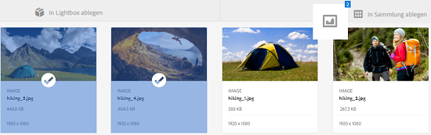
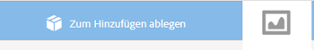
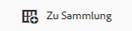
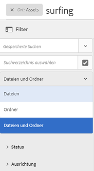
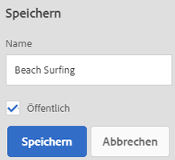
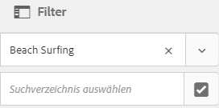
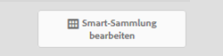
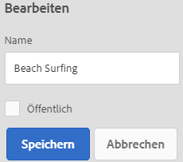
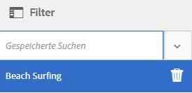
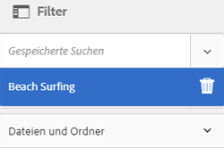

# Verwalten von Sammlungen {#managing-collections}

Eine Sammlung ist ein Satz von Assets innerhalb von Adobe Experience Manager Assets. Anhand von Sammlungen können Assets von mehreren Benutzern gemeinsam verwendet werden. Der Satz kann eine statische Sammlung oder eine dynamische Sammlung sein, die auf Suchergebnissen basiert.

Im Gegensatz zu Ordnern kann eine Sammlung Assets von verschiedenen Speicherorten enthalten. Sie können Sammlungen für mehrere Benutzer mit unterschiedlichen Berechtigungsstufen, wie Anzeigen, Bearbeiten usw., freigeben.

Sie können mehrere Sammlungen für einen Benutzer freigeben. Jede Sammlung enthält Referenzen zu Assets. Die referenzielle Integrität von Assets wird sammlungsübergreifend aufrechterhalten.

Sammlungen sind von den folgenden Typen, und zwar auf Grundlage, wie sie Assets sortieren:

* Eine Sammlung mit einer statischen Referenzliste von Assets, Ordnern und anderen Sammlungen.
* Eine Smart-Sammlung, die Assets auf Grundlage eines Suchkriteriums dynamisch verwendet.

## Aufrufen der Konsole „Sammlungen“ {#navigating-the-collections-console}

Um **[!UICONTROL Sammlungen]** zu öffnen, tippen oder klicken Sie auf das Experience Manager-Logo. Gehen Sie auf der Navigationsseite zu **[!UICONTROL Assets]** > **[!UICONTROL Sammlungen]**.

## Erstellen von Sammlungen {#creating-a-collection}

Sie können eine Sammlung mit [statischen Referenzen](#creating-a-collection-with-static-references) oder basierend auf einem [Suchkriterien-spezifischen Filter](#creating-a-smart-collection) erstellen. Sie können eine Sammlung auch über eine Lightbox erstellen.

### Erstellen von Sammlungen mit statischen Referenzen {#creating-a-collection-with-static-references}

Sie können eine Sammlung mit statischen Referenzen erstellen, wie eine Sammlung mit Referenzen zu Assets, Ordnern, Sammlungen, Rotationssets und Bildsets.

1. Navigieren Sie zur Konsole **[!UICONTROL Sammlungen]**.
1. Tippen oder klicken Sie in der Symbolleiste auf **[!UICONTROL Erstellen]**.
1. Geben Sie auf der Seite **[!UICONTROL Sammlung erstellen]** einen Titel und eine optionale Beschreibung für die Sammlung ein.
1. Fügen Sie Mitglieder zur Sammlung hinzu und weisen Sie entsprechende Berechtigungen zu. Wählen Sie alternativ **[!UICONTROL Öffentliche Sammlung]**, um allen Benutzern Zugriff auf die Sammlung zu ermöglichen.

   >[!NOTE]
   >
   >Um es Mitgliedern zu ermöglichen, Sammlungen mit anderen Benutzern zu teilen, gewähren Sie der Gruppe `dam-users` Leseberechtigungen für den Pfad `home/users`. Erteilen Sie den Benutzern eine Berechtigung für den Pfad `/content/dam/collections`, damit Benutzer Sammlungen in Popup-Listen anzeigen können. Alternativ dazu können Sie Benutzer auch in die Gruppe `dam-users` aufnehmen.

1. (Optional) Fügen Sie eine Miniatur für die Sammlung hinzu.
1. Tippen oder klicken Sie auf **[!UICONTROL Erstellen]** und anschließend auf **[!UICONTROL OK]**, um das Dialogfeld zu schließen. In der Konsole „Sammlungen“ wird eine Sammlung mit dem angegebenen Titel und ihren Eigenschaften geöffnet.

   >[!NOTE]
   >
   >Mit Experience Manager Assets können Sie Prüfungsaufgaben für eine Sammlung auf ähnliche Weise wie Prüfungsaufgaben für einen Assets-Ordner erstellen.

   Um Assets zur Sammlung hinzuzufügen, navigieren Sie zur Assets-Benutzeroberfläche. Weitere Informationen finden Sie unter [Hinzufügen von Assets zu einer Sammlung](/help/assets/managing-collections-touch-ui.md#adding-assets-to-a-collection).

### Erstellen von Sammlungen mithilfe der Dropzone {#create-collections-using-dropzone}

Sie können Assets aus der Assets-Benutzeroberfläche ziehen und in einer Sammlung ablegen. Sie können auch eine Kopie einer Sammlung erstellen und Assets dort hinziehen.

1. Wählen Sie in der Assets-Benutzeroberfläche die Assets aus, die Sie zu einer Sammlung hinzufügen möchten.
1. Ziehen Sie die Assets in den Bereich **[!UICONTROL In Sammlung ablegen.]**

   

   Lassen Sie die Maustaste los, wenn die Dropzone aktiv wird und sich die Bezeichnung in **[!UICONTROL Zum Hinzufügen ablegen]**.

   

   Tippen oder klicken Sie alternativ in der Symbolleiste auf das Symbol **[!UICONTROL Zu Sammlung]**.

   

1. Tippen oder klicken Sie in der Symbolleiste auf der Seite **[!UICONTROL Zu Sammlung hinzufügen]** auf das Symbol **[!UICONTROL Sammlung erstellen.]**

   Wenn Sie die Assets zu einer vorhandenen Sammlung hinzufügen möchten, wählen Sie sie auf der Seite aus und tippen/klicken Sie auf **[!UICONTROL Hinzufügen]**. Standardmäßig wird die zuletzt aktualisierte Sammlung ausgewählt.

1. Geben Sie im Dialogfeld **[!UICONTROL Neue Sammlung erstellen]** einen Namen für die Sammlung an. Wenn die Sammlung allen Benutzern zugänglich sein soll, wählen Sie **[!UICONTROL Öffentliche Sammlung]** aus.
1. Tippen oder klicken Sie auf **[!UICONTROL Weiter]**, um die Sammlung zu erstellen.

### Erstellen von Smart-Sammlungen {#creating-a-smart-collection}

Eine Smart-Sammlung verwendet Suchkriterien, um Assets dynamisch zu füllen. Sie können eine Smart-Sammlung erstellen, indem Sie Dateien und Ordner oder nur Dateien nutzen.

Gehen Sie wie folgt vor, um eine Smart-Sammlung zu erstellen:

1. Navigieren Sie zur Assets-Benutzeroberfläche und tippen/klicken Sie auf das Suchsymbol.

1. Geben Sie den Suchbegriff in das OmniSearch-Feld ein und drücken Sie die Eingabetaste. Öffnen Sie den Bereich Filter und wenden Sie einen Suchfilter an.

1. Wählen Sie aus der Liste **[!UICONTROL Dateien und Ordner]** die Option **[!UICONTROL Dateien]** aus.

   

1. Tippen oder klicken Sie auf **[!UICONTROL Smart-Sammlung speichern]**.
1. Geben Sie einen Namen für die Sammlung an. Aktivieren Sie **[!UICONTROL Öffentlich]**, um die DAM-Benutzergruppe mit der Rolle „Betrachter“ zur Smart-Sammlung hinzuzufügen.

   

   >[!NOTE]
   >
   >Wenn Sie **[!UICONTROL Öffentlich]**, wird die Smart-Sammlung für alle Benutzer mit der Eigentümerrolle verfügbar, nachdem Sie sie erstellt haben. Wenn Sie die Option **[!UICONTROL Öffentlich]** deaktivieren, ist die DAM-Benutzergruppe nicht mehr mit der Smart-Sammlung verknüpft.

1. Tippen oder klicken Sie auf **[!UICONTROL Speichern]**, um die Smart-Sammlung zu erstellen, und schließen Sie dann das Meldungsfenster, um den Vorgang abzuschließen.

   Die neue Smart-Sammlung wird auch zur Liste **[!UICONTROL Gespeicherte Suchen]** hinzugefügt.

   

   Die Bezeichnung der Schaltfläche **[!UICONTROL Smart-Sammlung erstellen]** wird in **[!UICONTROL Smart-Sammlung bearbeiten]** geändert. Um die Einstellungen der Smart-Sammlung zu bearbeiten, wählen Sie **[!UICONTROL Dateien]** aus der Liste **[!UICONTROL Dateien und Ordner]** aus. Tippen oder klicken Sie dann auf die Schaltfläche **[!UICONTROL Smart-Sammlung bearbeiten]**.

   

## Hinzufügen von Assets zu einer Sammlung {#adding-assets-to-a-collection}

Sie können einer Sammlung mit einer Liste referenzierter Assets oder Ordner Assets hinzufügen. Smart-Sammlungen füllen Assets anhand einer Suchabfrage. Daher sind statische Referenzen zu Assets und Ordnern für sie nicht anwendbar.

1. Wählen Sie in der Assets-Benutzeroberfläche das Asset aus und tippen/klicken Sie auf die **[!UICONTROL Zu Sammlung]** in der Symbolleiste.

   

   Alternativ können Sie das Asset in die **[!UICONTROL In Sammlung ablegen]** -Bereich auf der Benutzeroberfläche. Fügen Sie die Assets hinzu, wenn sich die Bezeichnung der Region in **[!UICONTROL Zum Hinzufügen ablegen]**.

1. Wählen Sie auf der Seite **[!UICONTROL Zu Sammlung hinzufügen]** die Sammlung aus, der Sie das Asset hinzufügen möchten.

1. Tippen oder klicken Sie auf **[!UICONTROL Hinzufügen]** und schließen Sie die Bestätigungsnachricht. Das Asset wird zur Sammlung hinzugefügt.

## Bearbeiten von Smart-Sammlungen {#editing-a-smart-collection}

Smart-Sammlungen werden durch Speichern von Suchvorgängen erstellt. Das heißt, Sie können den Inhalt ändern, indem Sie die Suchparameter der [gespeicherten Suche](#editing-saved-searches) ändern.

1. Tippen oder klicken Sie in der Symbolleiste der Assets-Benutzeroberfläche auf das Suchsymbol.

   

1. Betätigen Sie bei in das OmniSearch-Feld gesetztem Cursor die Eingabetaste.

1. Tippen oder klicken Sie auf das GlobalNav-Symbol, um den Filterbereich anzuzeigen.

1. Wählen Sie in der Liste **[!UICONTROL Gespeicherte Suchen]** die Smart-Sammlung aus, die Sie ändern möchten. Im Suchbereich werden die für die gespeicherte Suche konfigurierten Filter angezeigt.

   

1. Wählen Sie aus der Liste **[!UICONTROL Dateien und Ordner]** die Option **[!UICONTROL Dateien]** aus.

1. Ändern Sie den bzw. die Filter nach Bedarf. Tippen oder klicken Sie auf **[!UICONTROL Smart-Sammlung bearbeiten]**.

   Sie können auch den Namen der Smart-Sammlung ändern.

   

1. Tippen oder klicken Sie auf **[!UICONTROL Speichern]**. Das Dialogfeld **[!UICONTROL Smart-Sammlung bearbeiten]** wird angezeigt.

1. Tippen oder klicken Sie auf **[!UICONTROL Überschreiben]**, um die ursprüngliche Smart-Sammlung durch die bearbeitete Sammlung zu ersetzen. Wählen Sie alternativ **[!UICONTROL Speichern unter]** aus, um die bearbeitete Sammlung separat zu speichern.

1. Tippen oder klicken Sie im Bestätigungsdialogfeld auf **[!UICONTROL Speichern]**, um den Vorgang abzuschließen.

## Anzeigen und Bearbeiten von Sammlungsmetadaten {#viewing-and-editing-collection-metadata}

Sammlungsmetadaten umfassen die Daten zur Sammlung, einschließlich aller hinzugefügten Tags.

1. Wählen Sie in der Konsole „Sammlungen“ eine Sammlung aus und tippen oder klicken Sie in der Symbolleiste auf das Symbol **[!UICONTROL Eigenschaften]**.
1. Zeigen Sie auf der Seite **[!UICONTROL Sammlungs-Metadaten]** die Metadaten der Sammlung auf den Registerkarten **[!UICONTROL Allgemein]** und **[!UICONTROL Erweitert]** an.
1. Ändern Sie die Metadaten nach Bedarf und tippen oder klicken Sie danach in der Symbolleiste auf **[!UICONTROL Speichern und schließen]**, um die Änderungen zu speichern.

### Metadaten mehrerer Sammlungen stapelweise bearbeiten {#editing-collection-metadata-in-bulk}

Sie können die Metadaten von mehreren Sammlungen gleichzeitig bearbeiten. Mit dieser Funktion können Sie schnell allgemeine Metadaten in mehreren Sammlungen replizieren.

1. Wählen Sie in der Konsole „Sammlungen“ zwei oder mehr Sammlungen aus, für die Sie Metadaten bearbeiten möchten.
1. Tippen/klicken Sie in der Symbolleiste auf **[!UICONTROL Eigenschaften]**.
1. Bearbeiten Sie auf der Seite **[!UICONTROL Sammlungs-Metadaten]** die Metadaten auf den Registerkarten **[!UICONTROL Allgemein]** und **[!UICONTROL Erweitert]** nach Bedarf.
1. Heben Sie die Auswahl der anderen Sammlungen in der Sammlungsliste auf, um die Metadateneigenschaften für eine bestimmte Sammlung anzuzeigen. Die Metadateneditorfelder werden mit den Metadaten für die bestimmte Sammlung gefüllt.

   >[!NOTE]
   >
   >* Auf der Sammlungseigenschaftenseite können Sie Sammlungen aus der Liste der Sammlungen entfernen, indem Sie die Auswahl aufheben. In der Sammlungsliste sind alle Sammlungen standardmäßig ausgewählt. Die Metadaten für Sammlungen, die Sie entfernen, werden nicht aktualisiert.
   >* Aktivieren Sie über der Sammlungsliste das Kontrollkästchen neben **[!UICONTROL Titel]**, um zwischen der Auswahl von Sammlungen und dem Deaktivieren der Liste umzuschalten.

1. Tippen oder klicken Sie in der Symbolleiste auf **[!UICONTROL Speichern und schließen]** und schließen Sie danach das Bestätigungsdialogfeld, um den Vorgang abzuschließen.
1. Um die neuen Metadaten an die vorhandenen Metadaten anzuhängen, wählen Sie **[!UICONTROL Anlagenmodus]**. Wenn Sie diese Option nicht auswählen, ersetzen die neuen Metadaten die vorhandenen Metadaten in den entsprechenden Feldern. Tippen oder klicken Sie auf **[!UICONTROL Absenden]**.

   >[!NOTE]
   >
   >Die Metadaten, die Sie für die ausgewählten Sammlungen hinzufügen, überschreiben die vorherigen Metadaten für diese Sammlungen. Verwenden Sie die [!UICONTROL Anlagenmodus] , um den vorhandenen Metadaten in Feldern, die mehrere Werte enthalten können, neue Werte hinzuzufügen. Einzelwertfelder werden immer überschrieben. Alle Tags, die Sie im Feld [!UICONTROL Tags] hinzufügen, werden der vorhandenen Liste der Tags in den Metadaten anhängt.

Verwenden Sie zum Anpassen der Seite mit den [!UICONTROL Eigenschaften] von Metadaten, einschließlich Hinzufügen, Ändern und Löschen von Metadateneigenschaften, den Schemaeditor.

>[!TIP]
>
>Die Massenbearbeitung funktioniert für Assets, die in einer Sammlung verfügbar sind. Bei Assets, die in verschiedenen Ordnern verfügbar sind oder gemeinsamen Kriterien entsprechen, können die Metadaten nach der Suche nach diesen Assets stapelweise aktualisiert werden.

## Suchen nach Sammlungen {#searching-collections}

Sie können mit der Konsole „Sammlungen“ nach Sammlungen suchen. Wenn Sie mit Keywords im Omnisearch-Suchfeld suchen, [!DNL Experience Manager] Assets sucht nach Sammlungsnamen, Metadaten und den Tags, die den Sammlungen hinzugefügt wurden.

Wenn Sie auf der obersten Ebene nach Sammlungen suchen, werden nur die einzelnen Sammlungen in den Suchergebnissen zurückgegeben. Assets oder Ordner in den Sammlungen werden ausgeschlossen. In allen anderen Fällen (z. B. innerhalb einer individuellen Sammlung oder in einer Ordnerhierarchie) werden alle relevanten Assets, Ordner und Sammlungen zurückgegeben.

## In Sammlungen suchen {#searching-within-collections}

Tippen oder klicken Sie in der Konsole „Sammlungen“ auf eine Sammlung, um sie zu öffnen.

Innerhalb einer Sammlung ist die Suche auf Assets (und deren Tags und Metadaten) innerhalb der angezeigten Sammlung beschränkt. Wenn Sie in einem Ordner suchen, werden alle passenden Assets und untergeordneten Ordner innerhalb des aktuellen Ordners zurückgegeben. Wenn Sie in einer Sammlung suchen, werden nur übereinstimmende Assets, Ordner und andere Sammlungen zurückgegeben, die direkt zur Sammlung gehören.

## Bearbeiten von Sammlungseinstellungen {#editing-collection-settings}

Sie können Sammlungseinstellungen, wie z. B. Titel und Beschreibung, bearbeiten oder Mitglieder zu einer Sammlung hinzufügen.

1. Wählen Sie eine Sammlung aus und tippen oder klicken Sie in der Symbolleiste auf das Symbol **[!UICONTROL Einstellungen]**. Verwenden Sie alternativ die Schnellaktion **[!UICONTROL Einstellungen]** in der Miniatur der Sammlung.
1. Ändern Sie die Sammlungseinstellungen in der **[!UICONTROL Sammlungseinstellungen]** Seite. Ändern Sie beispielsweise den Sammlungstitel, die Beschreibungen, Mitglieder und Berechtigungen wie unter [Hinzufügen von Sammlungen](#creating-a-collection).

1. Um die Änderungen zu speichern, tippen/klicken Sie auf **[!UICONTROL Speichern]**.

## Löschen von Sammlungen {#deleting-a-collection}

1. Wählen Sie in der Konsole „Sammlungen“ mindestens eine Sammlung aus und tippen oder klicken Sie in der Symbolleiste auf das Symbol zum Löschen.

1. Tippen oder klicken Sie im Dialogfeld auf **[!UICONTROL Löschen]**, um den Löschvorgang zu bestätigen.

   >[!NOTE]
   >
   >Sie können Smart-Sammlungen auch löschen, indem Sie [Löschen gespeicherter Suchen](#deleting-saved-searches).

## Herunterladen von Sammlungen {#downloading-a-collection}

Wenn Sie eine Sammlung herunterladen, wird die gesamte Asset-Hierarchie innerhalb der Sammlung ebenfalls heruntergeladen, einschließlich Ordnern und untergeordneten Sammlungen.

1. Wählen Sie in der Konsole „Sammlungen“ eine oder mehrere Sammlungen für den Download aus.
1. Tippen oder klicken Sie in der Symbolleiste auf das Symbol zum Herunterladen.
1. Tippen oder klicken Sie im Dialogfeld **[!UICONTROL Herunterladen]** auf **[!UICONTROL Herunterladen]**. Wählen Sie **[!UICONTROL Ausgabedarstellungen]** aus, wenn Sie die Ausgabedarstellungen des Assets in der Sammlung herunterladen möchten. Wählen Sie die Option **[!UICONTROL E-Mail]** aus, um eine E-Mail-Benachrichtigung an den Eigentümer der Sammlung zu senden.

   Bei Auswahl einer Sammlung für den Download wird die gesamte Ordnerstruktur unter dieser Sammlung heruntergeladen. Um jede Sammlung (einschließlich Assets in untergeordneten Sammlungen, die unter der übergeordneten Sammlung verschachtelt sind), die Sie herunterladen, in einem eigenen Ordner zu speichern, wählen Sie **[!UICONTROL Separaten Ordner für jedes Asset erstellen]** aus.

## Erstellen verschachtelter Sammlungen {#creating-nested-collections}

Sie können eine Sammlung zu einer anderen Sammlung hinzufügen und so eine verschachtelte Sammlung erstellen.

1. Wählen Sie in der Konsole „Sammlungen“ die gewünschte Sammlung oder Gruppe von Sammlungen aus und tippen oder klicken Sie in der Symbolleiste auf das Symbol **[!UICONTROL Zu Sammlung]**.

   

1. Wählen Sie auf der Seite **[!UICONTROL Zu Sammlung hinzufügen]** die Sammlung aus, der die Sammlung hinzugefügt werden soll.

   >[!NOTE]
   >
   >Die zuletzt aktualisierte Sammlung wird standardmäßig auf der Seite **[!UICONTROL Zu Sammlung hinzufügen]** ausgewählt.

1. Tippen oder klicken Sie auf **[!UICONTROL Hinzufügen]**. Eine Meldung bestätigt, dass die Sammlung zur Zielsammlung auf der Seite **[!UICONTROL Ziel auswählen]** hinzugefügt wird. Schließen Sie die Meldung, um den Vorgang abzuschließen.

>[!NOTE]
>
>Smart-Sammlungen können nicht verschachtelt werden. Das heißt, Smart-Sammlungen können keine anderen Sammlungen enthalten.

## Gespeicherte Suchvorgänge {#saved-searches}

In der Assets-Benutzeroberfläche können Sie Assets basierend auf bestimmten Regeln, Suchkriterien oder benutzerdefinierten Suchfacetten durchsuchen oder filtern. Wenn Sie diese Einstellungen als **[!UICONTROL Gespeicherte Suchen]** speichern, können Sie später in der Liste **[!UICONTROL Gespeicherte Suchen]** im Filterbereich darauf zugreifen. Beim Erstellen einer gespeicherten Suche wird auch eine Smart-Sammlung erstellt.

### Gespeicherte Suchen erstellen {#creating-saved-searches}

Gespeicherte Suchen werden erstellt, wenn Sie eine Smart-Sammlung erstellen. Smart-Sammlungen werden automatisch der Liste **[!UICONTROL Gespeicherte Suchen]** hinzugefügt. Die Abfrage &quot;Gespeicherte Suchen&quot;für die Sammlung wird im `dam:query` -Eigenschaft in crxde am relativen Speicherort `/content/dam/collections/`. Die Suchen, die Sie speichern können, und die gespeicherten Suchen, die in der Liste angezeigt werden, sind unbegrenzt.

>[!NOTE]
>
>Sie können Smart-Sammlungen auf gleiche Weise wie statische Sammlungen freigeben.

### Gespeicherte Suchen bearbeiten {#editing-saved-searches}

Gespeicherte Suchen werden genauso wie Smart-Sammlungen bearbeitet. Einzelheiten dazu finden Sie in [Bearbeiten von Smart-Sammlungen](/help/assets/managing-collections-touch-ui.md#editing-a-smart-collection).

### Gespeicherte Suchen löschen {#deleting-saved-searches}

1. Tippen oder klicken Sie in der Symbolleiste der Assets-Benutzeroberfläche auf das Suchsymbol.

   

1. Betätigen Sie bei in das OmniSearch-Feld gesetztem Cursor die Eingabetaste.

1. Klicken oder tippen Sie auf das GlobalNav-Symbol, um das Bedienfeld „Filter“ anzuzeigen.

1. Aus dem **[!UICONTROL Gespeicherte Suchen]** auf das Löschsymbol neben der Smart-Sammlung, die Sie löschen möchten.

   

1. Tippen oder klicken Sie im Dialogfeld auf **[!UICONTROL Löschen]**, um die gespeicherte Suche zu löschen.

## Ausführen eines Workflows für eine Sammlung {#running-a-workflow-on-a-collection}

Sie können einen Workflow für die Assets in einer Sammlung ausführen. Wenn die Sammlung verschachtelte Sammlungen enthält, wird der Workflow auch für die Assets in den verschachtelten Sammlungen ausgeführt. Wenn jedoch die Sammlung und die verschachtelte Sammlung doppelte Assets enthalten, wird der Workflow nur einmal für solche Assets ausgeführt.

1. Wählen Sie in der Konsole „Sammlungen“ eine Sammlung aus, für die Sie einen Workflow ausführen möchten.
1. Tippen oder klicken Sie auf das GlobalNav-Symbol und wählen Sie **[!UICONTROL Timeline]** aus der Liste aus.
1. Tippen/klicken Sie in der Timeline auf das Caret-Symbol am unteren Rand und dann auf **[!UICONTROL Workflow starten]**.

   

1. Wählen Sie im Abschnitt **[!UICONTROL Workflow starten]** ein Workflow-Modell aus der Liste aus. Wählen Sie beispielsweise das **[!UICONTROL DAM Update Asset]**-Modell aus.
1. Geben Sie einen Titel für den Workflow ein und tippen oder klicken Sie auf **[!UICONTROL Start]**.
1. Tippen oder klicken Sie im Dialogfeld auf **[!UICONTROL Fortfahren]**. Der Workflow wird für alle Assets in der Sammlung ausgeführt.

>[!MORELIKETHIS]
>
>* [Konfigurieren von Experience Manager Assets-E-Mail-Benachrichtigungen](/help/sites-administering/notification.md#assetsconfig)
>* [Erstellen einer Prüfungsaufgabe für Sammlungen](bulk-approval.md)

