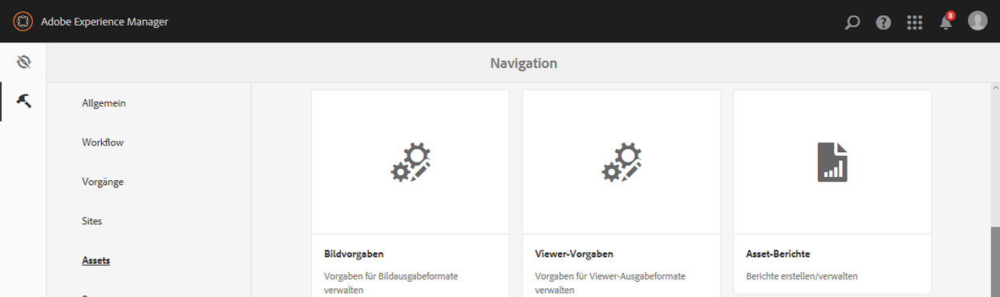
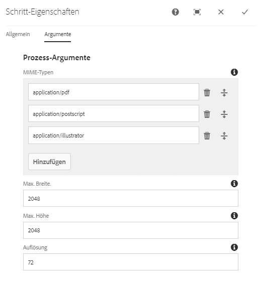
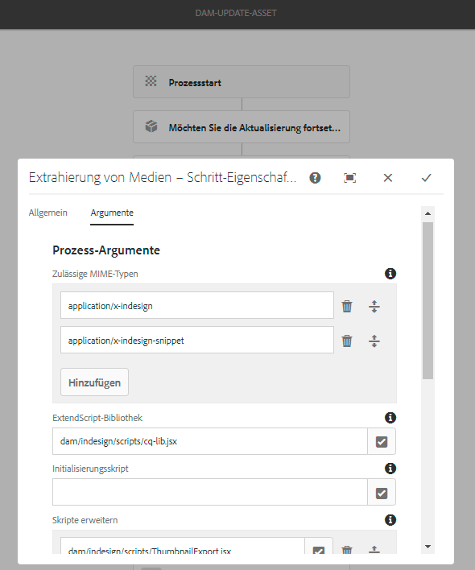
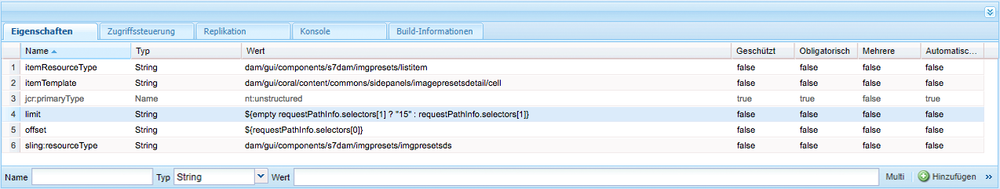
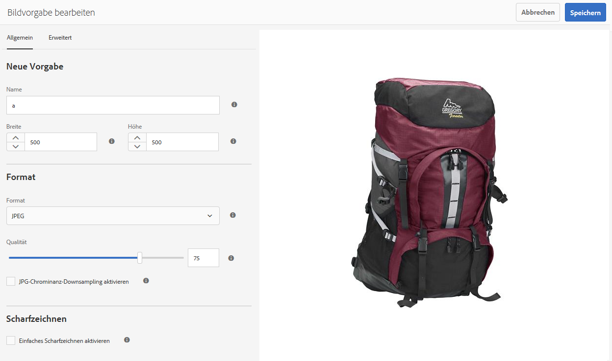
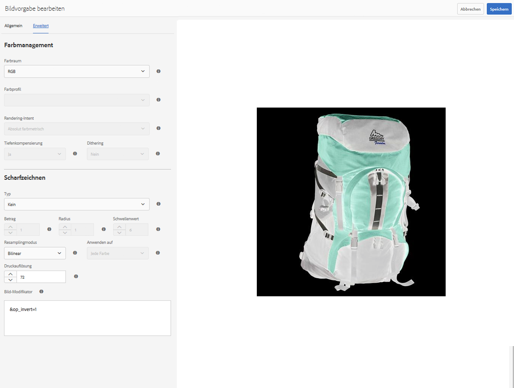
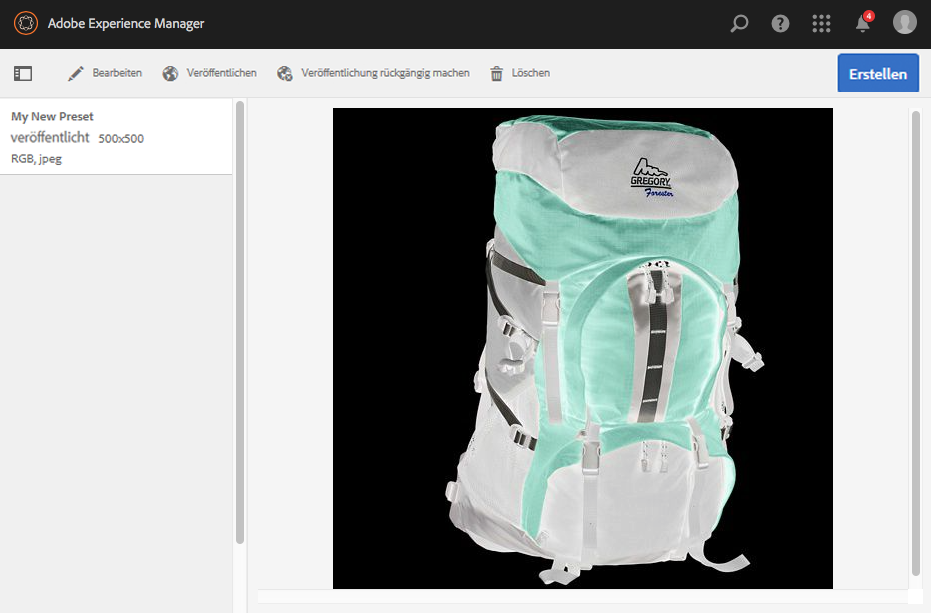
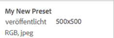

# Verwalten von Bildvorgaben für Dynamic Media {#managing-image-presets}

>[!CAUTION]
>
>AEM 6.4 hat das Ende der erweiterten Unterstützung erreicht und diese Dokumentation wird nicht mehr aktualisiert. Weitere Informationen finden Sie in unserer [technische Unterstützung](https://helpx.adobe.com/de/support/programs/eol-matrix.html). Unterstützte Versionen suchen [here](https://experienceleague.adobe.com/docs/?lang=de).

Anhand von Bildvorgaben kann AEM Assets Bilder mit unterschiedlichen Größen, Formaten oder Bildeigenschaften dynamisch bereitstellen. Jede Bildvorgabe stellt eine vordefinierte Sammlung von Größenangaben und Formatierungsbefehlen für die Anzeige von Bildern dar. Wenn Sie eine Bildvorgabe erstellen, wählen Sie eine Größe für die Bildbereitstellung aus. Sie wählen auch Formatierungsbefehle, damit das Erscheinungsbild des Bildes optimiert wird, wenn das Bild zur Anzeige bereitgestellt wird.

Administratoren können Vorgaben für den Asset-Export erstellen. Benutzer können beim Exportieren von Bildern eine Vorgabe auswählen, die Bilder entsprechend den vom Administrator festgelegten Spezifikationen umformatiert.

Sie können auch responsive Bildvorgaben erstellen. Wenn Sie eine responsive Bildvorgabe auf Ihre Assets anwenden, ändern sich diese je nach Gerät oder Bildschirmgröße, auf dem sie angezeigt werden. Sie können Bildvorgaben konfigurieren, um im Farbraum zusätzlich zu RGB oder Graustufen auch CMYK zu verwenden.

In diesem Abschnitt wird beschrieben, wie Sie Bildvorgaben erstellen, ändern und allgemein verwalten. Sie können jederzeit bei der Vorschau eines Bildes eine Bildvorgabe darauf anwenden. Siehe [Anwenden von Bildvorgaben](image-presets.md).

>[!NOTE]
>
>Die intelligente Bildbearbeitung arbeitet mit bestehenden Bildvorgaben und reduziert im letzten Moment abhängig vom Browser oder der Geschwindigkeit der Netzverbindung die Größe der Bilddatei intelligent noch weiter. Weitere Informationen finden Sie unter [Intelligente Bildbearbeitung](imaging-faq.md).

## Verstehen von Bildvorgaben für Dynamic Media {#understanding-image-presets}

Wie ein Softwaremakro ist eine Bildvorgabe eine vordefinierte Sammlung von Größenangaben und Formatierungsbefehlen, die unter einem Namen gespeichert wird. Um zu verstehen, wie Bildvorgaben funktionieren, nehmen wir an, dass auf Ihrer Website jedes Produktbild in unterschiedlichen Größen, Formaten und Komprimierungsraten für die Bereitstellung auf Desktop- und Mobilgeräten angezeigt werden muss.

Sie können zwei Bildvorgaben erstellen: eine mit 500 x 500 Pixel für die Desktop-Version und 150 x 150 Pixel für die mobile Version. Sie erstellen zwei Bildvorgaben, eine mit dem Namen *Vergrößern* , um Bilder mit einer Auflösung von 500 x 500 Pixel und einem Namen anzuzeigen. *Miniatur* , um Bilder mit einer Auflösung von 150 x 150 Pixel anzuzeigen. Um Bilder in der Größe &quot;Vergrößern&quot;und &quot;Miniatur&quot;bereitzustellen, sucht AEM nach der Definition der Bildvorgabe &quot;Vergrößern&quot;und der Bildvorgabe &quot;Miniatur&quot;. Anschließend generiert AEM dynamisch ein Bild in der Größe und Formatierungsspezifikation jeder Bildvorgabe.

Bilder, deren Größe bei der dynamischen Bereitstellung reduziert wird, können Schärfe und Details verlieren. Aus diesem Grund enthält jede Bildvorgabe Formatierungssteuerelemente zum Optimieren eines Bildes, wenn es in einer bestimmten Größe bereitgestellt wird. Dadurch wird sichergestellt, dass die Bilder scharf und deutlich auf der Website oder im Programm angezeigt werden.

Administratoren können Bildvorgaben erstellen. Um eine Bildvorgabe zu erstellen, können Sie von Grund auf neu beginnen oder eine vorhandene Vorgabe unter einem neuen Namen speichern.

## Verwalten von Bildvorgaben für Dynamic Media {#managing-image-presets-1}

Sie können Ihre Bildvorgaben in AEM verwalten, indem Sie auf das AEM Logo tippen, um auf die globale Navigationskonsole zuzugreifen. Tippen Sie dann auf das Werkzeugsymbol und navigieren Sie zu **[!UICONTROL Assets > Bildvorgaben]**.



>[!NOTE]
>
>Alle erstellten Bildvorgaben sind auch als dynamische Ausgabedarstellungen verfügbar, wenn Sie eine Vorschau von Assets anzeigen oder Assets bereitstellen.
>
>In *Dynamic Media - Scene7-Modus*, tun Sie *not* müssen Bildvorgaben veröffentlichen, da Bildvorgaben automatisch veröffentlicht werden.
>
>In *Dynamic Media - Hybridmodus*, müssen Sie Bildvorgaben manuell veröffentlichen.
>
>Siehe [Veröffentlichen von Bildvorgaben](#publishing-image-presets).

>[!NOTE]
>
>Das System zeigt mehrere Ausgabedarstellungen, wenn Sie **[!UICONTROL Ausgabedarstellungen]** in der Detailansicht eines Assets auswählen. **** Sie können die Anzahl der angezeigten Bildvorgaben erhöhen oder verringern. Siehe [Erhöhung der Anzahl der angezeigten Bildvorgaben](#increasing-or-decreasing-the-number-of-image-presets-that-display).

### Dateiformate Adobe Illustrator (AI), Postscript (EPS) und PDF  {#adobe-illustrator-ai-postscript-eps-and-pdf-file-formats}

Wenn Sie AI-, EPS- und PDF-Dateien unterstützen möchten, um aus diesen Dateiformaten dynamische Ausgabedarstellungen zu generieren, sollten Sie die folgenden Informationen lesen, bevor Sie Bildvorgaben erstellen.

Das Dateiformat von Adobe Illustrator ist eine Variante von PDF. Die Hauptunterschiede im Zusammenhang mit AEM Assets sind:

* Adobe Illustrator-Dokumente bestehen aus einer einzelnen Seite mit mehreren Ebenen. Jede Ebene wird als PNG-Teil-Asset unter dem Illustrator-Haupt-Asset extrahiert.
* PDF-Dokumente bestehen aus einer oder mehreren Seiten. Jede Seite wird als einseitiges PDF-Teil-Asset unter dem mehrseitigen PDF-Hauptdokument extrahiert.

Die Teil-Assets werden von der Komponente `Create Sub Asset process` im übergeordneten `DAM Update Asset`-Workflow erstellt. Um diese Prozesskomponente innerhalb des Workflows anzuzeigen, tippen Sie auf **[!UICONTROL Tools > Workflow > Modelle > DAM-Update-Asset > Bearbeiten]**.

Siehe auch [Seiten einer mehrseitigen Datei anzeigen](/help/assets/managing-linked-subassets.md#view-pages-of-a-multi-page-file).

Sie können die Teil-Assets oder die Seiten anzeigen, wenn Sie das Asset öffnen, auf das Menü „Inhalt“ tippen und **[!UICONTROL Teil-Assets]** oder **[!UICONTROL Seiten]** auswählen. Teil-Assets sind echte Assets. Daher werden PDF-Seiten durch den Workflow `Create Sub Asset` (Teil-Asset erstellen) extrahiert. Die Seiten werden dann unter dem Haupt-Asset als `page1.pdf`, `page2.pdf` usw. gespeichert. Nachdem sie gespeichert wurden, wird die **[!UICONTROL DAM-Update-Asset]** -Workflow verarbeitet sie.

Um Dynamic Media zu verwenden und dynamische Ausgabedarstellungen für AI-, EPS- oder PDF-Dateien als Vorschau anzuzeigen oder zu generieren, sind folgende Verarbeitungsschritte erforderlich:

1. Im **[!UICONTROL DAM-Update-Asset]** Workflow, der **[!UICONTROL Rastern von PDF/AI-Bildvorschau-Wiedergabe]** Prozesskomponente rastert die erste Seite des ursprünglichen Assets mit der konfigurierten Auflösung in einer `cqdam.preview.png` Ausgabedarstellung.

1. Die `cqdam.preview.png` -Ausgabeformat wird dann von der **[!UICONTROL Dynamic Media Process Image Assets]** Prozesskomponente innerhalb des Workflows.

>[!NOTE]
>
>Im Workflow **[!UICONTROL DAM Update Asset]** generiert der Schritt **[!UICONTROL EPS-Miniaturen]** Miniaturen für EPS-Dateien.

### Metadateneigenschaften von PDF-/AI-/EPS-Assets {#pdf-ai-eps-asset-metadata-properties}

| **Metadateneigenschaft** | **Beschreibung** |
|---|---|
| dam:Physicalwidthininches | Dokumentbreite in Zoll. |
| dam:Physicalheightininches | Dokumenthöhe in Zoll. |

Zugriff **[!UICONTROL Rastern von PDF/AI-Bildvorschau-Wiedergabe]** Prozesskomponentenoptionen über die **[!UICONTROL DAM-Update-Asset]** Arbeitsablauf.

Tippen Sie links oben auf Adobe Experience Manager und navigieren Sie zu **[!UICONTROL Tools > Workflow > Modelle]**. Im **[!UICONTROL Workflow-Modelle]** Seite, wählen Sie **[!UICONTROL DAM-Update-Asset]** und tippen Sie dann in der Symbolleiste auf **[!UICONTROL Bearbeiten]**. Im **[!UICONTROL Workflow &quot;DAM-Update-Asset&quot;]** Seite, doppeltippen Sie auf die **[!UICONTROL Rastern von PDF/AI-Bildvorschau-Wiedergabe]** Prozesskomponente zum Öffnen **[!UICONTROL Schritt-Eigenschaften]** Dialogfeld.

### PDF-/AI-Bildvorschau-Ausgabeoptionen rastern {#rasterize-pdf-ai-image-preview-rendition-options}



**Argumente zum Rastern von PDF- oder AI-Workflows**

<table> 
 <tbody> 
  <tr> 
   <td><strong>Prozessargument</strong></td>
   <td><strong>Standardeinstellung</strong></td>
   <td><strong>Beschreibung</strong></td>
  </tr> 
  <tr> 
   <td>MIME-Typen</td>
   <td><p>application/pdf</p> <p>application/postscript</p> <p>application/illustrator<br/> </p> </td>
   <td>Liste der Dokument-MIME-Typen, die als PDF- oder Illustrator-Dokumente gelten.<br/> </td>
  </tr> 
  <tr> 
   <td>Max. Breite</td>
   <td>2048</td>
   <td>Maximale Breite der generierten Vorschaudarstellung in Pixel.<br/> </td>
  </tr> 
  <tr> 
   <td>Max. Höhe</td>
   <td>2048</td>
   <td>Maximale Höhe der generierten Vorschaudarstellung in Pixel.<br/> </td>
  </tr> 
  <tr> 
   <td>Auflösung</td>
   <td>72</td>
   <td>Auflösung zum Rastern der ersten Seite in ppi (Pixel pro Zoll).</td>
  </tr>
 </tbody>
</table>

Bei Verwendung der standardmäßigen Prozessargumente wird die erste Seite eines PDF/AI-Dokuments mit 72 ppi gerastert und das generierte Vorschaubild hat eine Größe von 2048 x 2048 Pixel. Für eine typische Implementierung können Sie die Auflösung auf einen Mindestwert von 150 ppi oder mehr erhöhen. Für ein US Letter-Dokument ist z. B. für 300 ppi eine maximale Breite und Höhe von 2550 x 3300 Pixel erforderlich.

**[!UICONTROL Die max. Breite und die max. Höhe beschränken die Auflösung, in der die Rasterung erfolgt.]****** Wenn beispielsweise die Maximalwerte unverändert bleiben und die Auflösung auf 300 ppi eingestellt ist, wird ein US-Briefdokument mit 186 ppi gerastert. Das heißt, das Dokument ist 1581 x 2046 Pixel.

Die **[!UICONTROL Rastern von PDF/AI-Bildvorschau-Wiedergabe]** Für die Prozesskomponente ist ein Maximalwert definiert, um sicherzustellen, dass keine zu großen Bilder im Speicher erstellt werden. Solch große Bilder können den Speicher überlaufen, der für die JVM (Java Virtual Machine) bereitgestellt wird. Achten Sie darauf, der JVM ausreichend Arbeitsspeicher zur Verwaltung der konfigurierten Anzahl paralleler Workflows zur Verfügung zu stellen, da jeder Workflow potenziell ein Bild in der konfigurierten Maximalgröße erstellen kann.

### InDesign-Dateiformat (INDD) {#indesign-indd-file-format}

Wenn Sie die Aufnahme von INDD-Dateien unterstützen möchten, um aus diesem Dateiformat dynamische Ausgabedarstellungen zu generieren, sollten Sie die folgenden Informationen lesen, bevor Sie Bildvorgaben erstellen.

Für InDesign-Dateien werden nur dann Teil-Assets extrahiert, wenn der Adobe InDesign Server in AEM integriert ist. Referenzierte Assets werden basierend auf ihren Metadaten verknüpft. Für die Verknüpfung ist keine InDesign Server erforderlich. Die referenzierten Assets müssen jedoch in AEM vorhanden sein, bevor die InDesign-Dateien verarbeitet werden, damit die Links zwischen den InDesign-Dateien und den referenzierten Assets erstellt werden können.

Siehe [Integrieren von AEM Assets mit InDesign Server](indesign.md).

Die Prozesskomponente &quot;Medienextrahierung&quot;im **[!UICONTROL DAM-Update-Asset]** Workflow führt mehrere vorkonfigurierte **[!UICONTROL Skripte erweitern]** , um InDesign-Dateien zu verarbeiten.



Die **[!UICONTROL Skript erweitern]** Pfade in den Argumenten von **[!UICONTROL Extrahierung von Medien]** Prozesskomponente im **[!UICONTROL DAM-Update-Asset]** Arbeitsablauf.

Die folgenden Skripte werden von der Dynamic Media-Integration verwendet:

<table> 
 <tbody> 
  <tr> 
   <td><strong>ExtendScript-Name</strong></td>
   <td><strong>Standard</strong></td>
   <td><strong>Beschreibung</strong></td>
  </tr> 
  <tr> 
   <td>ThumbnailExport.jsx</td>
   <td>Ja</td>
   <td>Erstellt eine 300 ppi große <code>thumbnail.jpg</code>-Darstellung, die von der Prozesskomponente <code>Dynamic Media Process Image Assets</code> optimiert und in eine PTIFF-Darstellung umgewandelt wird.<br/> </td>
  </tr> 
  <tr> 
   <td>JPEGPagesExport.jsx</td> 
   <td>Ja</td> 
   <td>Generiert für jede Seite ein 300 ppi großes JPEG-Teil-Asset. Das JPEG-Teil-Asset ist ein echtes Asset, das unter dem InDesign-Asset gespeichert wird. Es wird auch vom Workflow <code>DAM Update Asset</code> optimiert und in eine PTIFF-Darstellung umgewandelt.<br/> </td>
  </tr> 
  <tr> 
   <td>PDFPagesExport.jsx</td>
   <td>Nein</td>
   <td>Generiert für jede Seite ein PDF-Teil-Asset. Das PDF-Teil-Asset wird wie zuvor beschrieben verarbeitet. Da das PDF-Asset nur eine Seite enthält, werden keine Teil-Assets generiert.<br/> </td>
  </tr> 
 </tbody> 
</table>

## Konfigurieren der Größe der Miniaturansicht {#configuring-image-thumbnail-size}

Sie können die Größe von Miniaturen über die Einstellungen im Workflow **[!UICONTROL DAM-Update-Asset]** konfigurieren. Im Workflow sind zwei Schritte enthalten, in denen Sie die Größe der Miniaturen von Bild-Assets konfigurieren können. Obgleich eins (**[!UICONTROL Dynamic Media Process Image Assets]**) für dynamische Bild-Assets und das andere (**[!UICONTROL Prozessminiaturansichten]**) für die Erstellung statischer Miniaturansichten oder wenn alle anderen Prozesse keine Miniaturansichten generieren, *both* sollten dieselben Einstellungen aufweisen.

Im Schritt **[!UICONTROL Bild-Assets-Prozess für Dynamic Media]** werden vom Bild-Server Miniaturansichten generiert. Diese Konfiguration ist unabhängig von der Konfiguration, die auf den Schritt **[!UICONTROL Prozessminiaturansichten]** angewendet wird. Das Generieren von Miniaturen mit dem Schritt **[!UICONTROL Miniaturen verarbeiten]** ist das langsamste und speicherintensivste Verfahren zum Erstellen von Miniaturen.

Die Größe der Miniaturansichten wird im folgenden Format definiert: **width:height:center** beispielsweise *80:80:false*. Die Breite und Höhe bestimmen die Größe der Miniaturansicht in Pixel. Wenn der Mittelwert entweder &quot;false&quot;oder &quot;true&quot;lautet, zeigt dies an, dass das Miniaturbild genau die in der Konfiguration angegebene Größe aufweist. Wenn das in der Größe angepasste Bild kleiner ist, wird es im Miniaturbildfenster zentriert.

>[!NOTE]
>
>* Die Größe der Miniaturansichten für EPS-Dateien wird im Schritt **[!UICONTROL EPS-Miniaturen]** auf der Registerkarte **[!UICONTROL Argumente]****[!UICONTROL unter „Miniaturansichten“ konfiguriert]**.
>
>* Die Größe der Miniaturansichten für Videos wird im Schritt **[!UICONTROL FFmpeg-Miniaturen]** auf der Registerkarte **[!UICONTROL Prozess]** unter **[!UICONTROL Argumente]** konfiguriert.
>


**So konfigurieren Sie die Größe von Miniaturansichten**:

1. Tippen Sie auf **[!UICONTROL Tools > Workflow > Modelle > DAM-Update-Asset > Bearbeiten]**.
1. Tippen Sie auf **[!UICONTROL Dynamic Media Process Image Assets]** Schritt, und tippen Sie dann auf **[!UICONTROL Miniaturen]** Registerkarte. Ändern Sie bei Bedarf die Größe der Miniaturansichten und tippen Sie auf **[!UICONTROL OK]**.

   

1. Tippen Sie auf den Schritt **[!UICONTROL Miniaturansichten verarbeiten]** und dann auf die Registerkarte **[!UICONTROL Miniaturansichten]**. Ändern Sie bei Bedarf die Größe der Miniaturansicht und tippen Sie auf **[!UICONTROL OK]**.

   >[!NOTE]
   >
   >Die Werte im Argument „Miniaturansichten“ im Schritt **[!UICONTROL Miniaturansichten verarbeiten]** müssen mit dem Argument „Miniaturansichten“ im Schritt **[!UICONTROL Bild-Assets-Verarbeitung für Dynamic Media]** übereinstimmen.

1. Tippen **[!UICONTROL Speichern]** , um die Änderungen am Workflow zu speichern.

### Erhöhen oder Verringern der Anzahl der angezeigten Dynamic Media-Bildvorgaben {#increasing-or-decreasing-the-number-of-image-presets-that-display}

Erstellte Bildvorgaben sind auch als dynamische Ausgabedarstellungen verfügbar, wenn Sie eine Vorschau von Assets anzeigen. AEM zeigt verschiedene dynamische Ausgabedarstellungen an, wenn Sie ein Asset unter **[!UICONTROL Detailansicht > Ausgabedarstellung]** anzeigen. Sie können die Anzahl der angezeigten Ausgabedarstellungen erhöhen oder verringern.

**So erhöhen oder verringern Sie die Anzahl der angezeigten Dynamic Media-Bildvorgaben**:

1. Navigieren Sie zu **[!UICONTROL CRXDE Lite]** ([http://localhost:4502/crx/de](http://localhost:4502/crx/de)).
1. Navigieren Sie zum Knoten für die Bildvorgabenliste unter `/libs/dam/gui/coral/content/commons/sidepanels/imagepresetsdetail/imgagepresetslist`.

   

1. Im **[!UICONTROL limit]** -Eigenschaft, ändern Sie die **[!UICONTROL value]**, der standardmäßig auf 15 gesetzt ist, auf die gewünschte Zahl.
1. Navigieren Sie zur Datenquelle der Bildvorgabe unter `/libs/dam/gui/coral/content/commons/sidepanels/imagepresetsdetail/imgagepresetslist/datasource`

   

1. Ändern Sie in der Eigenschaft „limit“ den Wert auf die gewünschte Zahl, z. B. `{empty requestPathInfo.selectors[1] ? "20" : requestPathInfo.selectors[1]}`.
1. Tippen Sie auf **[!UICONTROL Alle speichern]**.

### Erstellen von Dynamic Media-Bildvorgaben {#creating-image-presets}

Indem Sie eine Bildvorgabe erstellen, können Sie die entsprechenden Einstellungen bei der Vorschau oder beim Veröffentlichen auf alle Bilder anwenden.

>[!NOTE]
>
>Wenn Sie Internet Explorer 9 verwenden, wird das Erstellen einer Vorgabe nicht sofort nach dem Speichern in der Vorgabenliste angezeigt. Um dieses Problem zu umgehen, deaktivieren Sie den Cache für IE9.

Wenn Sie AI-, PDF-, und EPS-Dateien unterstützen möchten, um aus diesen Dateiformaten dynamische Ausgabedarstellungen zu generieren, sollten Sie die folgenden Informationen lesen, bevor Sie Bildvorgaben erstellen.\
Siehe [Dateiformate Adobe Illustrator (AI), Postscript (EPS) und PDF](#adobe-illustrator-ai-postscript-eps-and-pdf-file-formats).

Wenn Sie die Aufnahme von INDD-Dateien unterstützen möchten, um aus diesem Dateiformat dynamische Ausgabedarstellungen zu generieren, sollten Sie die folgenden Informationen lesen, bevor Sie Bildvorgaben erstellen.  Siehe [InDesign-Dateiformat (INDD)](#indesign-indd-file-format).

>[!NOTE]
>
>Um Dynamic Media-Bildvorgaben zu erstellen, müssen Sie über Administratorberechtigungen als AEM- oder Admin Console-Administrator verfügen.

**So erstellen Sie eine Dynamic Media-Bildvorgabe**:

1. Tippen Sie in AEM auf das AEM-Logo, um auf die globale Navigationskonsole zuzugreifen.
1. Tippen Sie auf das Symbol **[!UICONTROL Tools]** und navigieren Sie dann zu **[!UICONTROL Assets > Bildvorgaben]**.
1. Tippen Sie auf **[!UICONTROL Erstellen]**.

   

   >[!NOTE]
   >
   >Damit diese Bildvoreinstellung responsiv wird, löschen Sie die Werte in den Feldern **[!UICONTROL Breite]** und **[!UICONTROL Höhe]** und lassen Sie sie leer.

1. Im **[!UICONTROL Bildvorgabe bearbeiten]** -Seite, geben Sie Werte in die **[!UICONTROL Allgemein]** und **[!UICONTROL Erweitert]** gegebenenfalls Registerkarten, einschließlich eines Namens. Die Optionen werden unter [Bildvoreinstellungsoptionen](#image-preset-options) beschrieben. Vorgaben werden im linken Bereich angezeigt und können nur zusammen mit anderen Assets verwendet werden.

   

1. Klicken Sie auf **[!UICONTROL Speichern]**.

### Erstellen von responsiven Bildvorgaben {#creating-a-responsive-image-preset}

Um eine responsive Bildvorgabe zu erstellen, führen Sie die im Abschnitt [Erstellen von Bildvorgaben](#creating-image-presets) beschriebenen Schritte durch. Löschen Sie die Werte für Höhe und Breite im Fenster **[!UICONTROL Bildvorgabe bearbeiten]** und lassen Sie sie leer.

Wenn Sie sie leer lassen, bedeutet AEM, dass diese Bildvorgabe responsiv ist. Sie können die anderen Werte nach Bedarf anpassen.


>[!NOTE]
>
>Um die Schaltflächen **[!UICONTROL URL]** und **[!UICONTROL RESS]** beim Anwenden einer Bildvorgabe auf ein Asset anzuzeigen, muss das Asset veröffentlicht werden.
>
>Im Modus Dynamic Media - Scene7 werden Bildvorgaben und Bild-Assets automatisch veröffentlicht.
>
>Im Hybridmodus von Dynamic Media müssen Sie Bildvorgaben und Bild-Assets manuell veröffentlichen.

### Optionen für Bildvorgaben {#image-preset-options}

Die in diesem Abschnitt beschriebenen Optionen sind beim Erstellen oder Bearbeiten von Bildvorgaben verfügbar. Darüber hinaus empfiehlt Adobe die folgenden drei *Best Practice* Optionen zum Starten:

* **[!UICONTROL Format]** (**[!UICONTROL Allgemein]** tab) - Auswählen **[!UICONTROL JPEG]** oder ein anderes Format, das Ihren Anforderungen entspricht. Alle Webbrowser unterstützen das JPEG-Bildformat. Es bietet ein gutes Gleichgewicht zwischen kleinen Dateigrößen und Bildqualität. Bilder im JPEG-Format verwenden jedoch ein verlustbehaftetes Komprimierungsschema, das unerwünschte Bildartefakte hervorrufen kann, wenn die Komprimierungseinstellung zu niedrig ist. Aus diesem Grund empfiehlt Adobe, die Komprimierungsqualität auf 75 einzustellen. Diese Einstellung bietet einen angemessenen Ausgleich zwischen Bildqualität und kleiner Dateigröße.
* **[!UICONTROL Einfaches Scharfzeichnen aktivieren]** - Nicht auswählen **[!UICONTROL Einfaches Scharfzeichnen aktivieren]** (Dieser Scharfzeichnungsfilter bietet weniger Kontrolle als die Einstellungen für die Unschärfemaske).
* **[!UICONTROL Scharfzeichnen: Resamplingmodus]** - Auswählen **[!UICONTROL Scharf2]**.

#### Optionen auf der Registerkarte „Standard“ {#basic-tab-options}

<table> 
 <tbody> 
  <tr> 
   <td><strong>Feld</strong></td>
   <td><strong>Beschreibung</strong></td>
  </tr> 
  <tr> 
   <td><strong>Name</strong></td>
   <td>Geben Sie einen aussagekräftigen Namen ohne Leerzeichen ein. Nehmen Sie die Bildgröße in den Namen auf, damit Benutzer diese Bildvorgabe einfacher identifizieren können.</td>
  </tr>
  <tr> 
   <td><strong>Breite und Höhe</strong></td>
   <td>Geben Sie die Größe in Pixel ein, in der das Bild übermittelt wird. Breite und Höhe müssen größer als 0 Pixel sein. Wenn einer der beiden Werte 0 ist, wird keine Vorgabe erstellt. Wenn beide Werte leer sind, wird eine responsive Bildvorgabe erstellt.</td>
  </tr> 
  <tr> 
   <td><strong>Format</strong></td>
   <td><p>Wählen Sie ein Format im Menü aus.</p> <p>Bei <strong>JPEG</strong> erhalten Sie die folgenden zusätzlichen Optionen:</p>
    <ul> 
     <li><strong>Qualität</strong>: Steuert die JPEG-Komprimierungsstufe. Diese Einstellung wirkt sich sowohl auf die Dateigröße als auch auf die Bildqualität aus. Die JPEG-Qualitätsskala reicht von 1 bis 100. Die Skala ist sichtbar, wenn Sie den Schieberegler bewegen.</li> 
     <li><strong>JPG-Chrominanz-Downsampling aktivieren</strong>: Da das menschliche Auge weniger empfindlich gegenüber hochfrequenten Farbinformationen als gegenüber hochfrequenter Luminanz ist, teilen JPEG-Bilder die Bildinformationen in Luminanz und Farbkomponenten. Wenn ein JPEG-Bild komprimiert wird, bleibt die Luminanzkomponente in der vollen Auflösung erhalten, während bei den Farbkomponenten ein Downsampling anhand einer Durchschnittsbildung von Pixelgruppen erfolgt. Beim Downsampling wird das Datenvolumen um die Hälfte oder ein Drittel reduziert, ohne dass dies entscheidende Auswirkungen auf die wahrgenommene Qualität hat. Downsampling kann nicht auf Graustufen-Bilder angewendet werden. Diese Technik reduziert den Komprimierungsgrad, was bei Bildern mit hohem Kontrast hilfreich ist (z. B. bei Bildern mit überlagertem Text).</li>
    </ul>
    <div>
      Bei Auswahl von <strong>GIF</strong> oder <strong>GIF mit Alpha</strong> werden die folgenden zusätzlichen Optionen für <strong>GIF-Farbquantisierung</strong> verfügbar:
    </div>
    <ul> 
     <li><strong>Typ</strong>: Wählen Sie <strong>Adaptiv</strong> (Standard), <strong>Web</strong> oder <strong>Macintosh</strong>. Wenn Sie <strong>GIF mit Alpha</strong> auswählen, ist die Option „Macintosh“ nicht verfügbar.</li>
     <li><strong>Dithering</strong>: Wählen Sie <strong>Diffus</strong> oder <strong>Aus</strong>.</li>
     <li><strong>Anzahl Farben</strong>: Geben Sie eine Zahl zwischen 2 und 256 ein.</li>
     <li><strong>Farbliste</strong>: Geben Sie eine durch Komma getrennte Liste ein. Geben Sie beispielsweise für Weiß, Grau und Schwarz „000000,888888,ffffff“ ein.</li>
    </ul> 
    <div>
      Bei Auswahl von
     <strong>PDF</strong>,
     <strong>TIFF</strong> oder
     <strong>TIFF mit Alpha</strong> erhalten Sie die folgende zusätzliche Option:
    </div>
    <ul>
     <li><strong>Komprimierung</strong>: Wählen Sie einen Komprimierungsalgorithmus. Die Algorithmusoptionen für PDF lauten <strong>Kein</strong>, <strong>ZIP</strong> und <strong>JPEG</strong>. Für TIFF lauten sie <strong>Kein</strong>, <strong>LZW</strong>, <strong>JPEG</strong> und <strong>ZIP</strong>. Für TIFF mit Alpha lauten sie <strong>Kein</strong>, <strong>LZW</strong> und <strong>ZIP</strong>.</li>
    </ul> <p>Die Auswahl <strong>PNG</strong>, <strong>PNG mit Alpha</strong> oder <strong>EPS</strong> ergibt keine zusätzlichen Optionen.</p> </td>
  </tr>
  <tr>
   <td><strong>Scharfzeichnen</strong></td>
   <td>Wählen Sie die Option <strong>Einfaches Scharfzeichnen aktivieren</strong>, um einen einfachen Scharfzeichnungsfilter auf das Bild anzuwenden, nachdem die Skalierung abgeschlossen wurde. Mit der Scharfzeichnung können Sie unter Umständen Weichzeichnung kaschieren, die durch die Anzeige eines Bildes in einer anderen Größe entsteht. </td>
  </tr>
 </tbody>
</table>

#### Optionen auf der Registerkarte „Erweitert“ {#advanced-tab-options}

<table>
 <tbody>
  <tr>
   <td><strong>Feld</strong></td>
   <td><strong>Beschreibung</strong></td>
  </tr>
  <tr>
   <td><strong>Farbraum</strong></td>
   <td>Wählen Sie <strong>RGB, CMYK</strong> oder <strong>Graustufen</strong> als Farbraum aus.</td>
  </tr>
  <tr>
   <td><strong>Farbprofil</strong></td>
   <td>Wählen Sie das Profil des Ausgabefarbraums aus, in den das Asset konvertiert werden soll, sofern dieser sich von dem des Arbeitsprofils unterscheidet.</td>
  </tr>
  <tr>
   <td><strong>Rendering-Intent</strong></td>
   <td>Sie können den standardmäßigen Rendering-Intent überschreiben. Die Rendering-Absicht bestimmt, was mit Farben passiert, die im Zielfarbprofil nicht reproduziert werden können (außerhalb der Farbskala). Der Render-Intent wird ignoriert, wenn er nicht mit dem ICC-Profil kompatibel ist.
    <ul> 
     <li>Auswählen <strong>Wahrnehmungsorientiert</strong> , um die Gesamtbreite von einem Farbraum in einen anderen Farbraum zu komprimieren, wenn eine oder mehrere Farben im Originalbild außerhalb der Farbskala des Zielfarbraums liegen.</li>
     <li>Wählen Sie <strong>Relativ farbmetrisch</strong> aus, wenn eine Farbe des aktuellen Farbraums im Zielfarbraum außerhalb der Farbskala liegt und auf die nächstmögliche Farbe der Farbskala des Zielfarbraums abgebildet werden soll, ohne dass andere Farben betroffen sind. </li>
     <li>Wählen Sie <strong>Sättigung</strong> aus, um die Sättigung des Originalbilds beim Konvertieren in den Zielfarbraum zu übernehmen. </li>
     <li>Wählen Sie <strong>Absolut farbmetrisch</strong> aus, um Farben exakt und ohne Weißpunkt- oder Schwarzpunktanpassung abzubilden, wodurch die Helligkeit verändert würde.</li>
    </ul> </td>
  </tr>
  <tr>
   <td><strong>Tiefenkompensierung</strong></td>
   <td>Wählen Sie diese Option aus, wenn das Ausgabeprofil diese Funktion unterstützt. Blackpoint-Kompensation wird ignoriert, wenn sie nicht mit dem angegebenen ICC-Profil kompatibel ist.</td>
  </tr>
  <tr>
   <td><strong>Dithering</strong></td>
   <td>Wählen Sie diese Option aus, um Farbstreifen-Artefakte möglichst zu vermeiden oder zu reduzieren. </td>
  </tr>
  <tr>
   <td><strong>Scharfzeichnungstyp</strong></td>
   <td><p>Wählen Sie <strong>Kein</strong>, <strong>Scharfzeichnen</strong> oder <strong>Unschärfemaske</strong> aus. </p>
    <ul>
     <li>Auswählen <strong>Keines</strong> , um die Scharfzeichnung zu deaktivieren.</li>
     <li>Aktivieren Sie <strong>Scharfzeichnen</strong>, um einen einfachen Scharfzeichnungsfilter auf das Bild anzuwenden, nachdem die Skalierung abgeschlossen ist. Mit der Scharfzeichnung können Sie unter Umständen Weichzeichnung kaschieren, die durch die Anzeige eines Bildes in einer anderen Größe entsteht. </li>
     <li>Wählen Sie <strong>Unschärfemaske</strong>, um einen Scharfzeichnungsfiltereffekt für das endgültige Bild nach dem Downsampling zu optimieren. Sie können die Intensität und den Radius des Effekts (in Pixel gemessen) sowie einen Kontrastschwellenwert, der ignoriert wird, steuern. Bei diesem Effekt werden dieselben Optionen wie im Filter „Unschärfemaske“ von Photoshop verwendet.</li>
    </ul> <p>In <strong>Unschärfemaske</strong> sind die folgenden Optionen verfügbar:</p>
    <ul> 
     <li><strong>Betrag</strong>: Steuert den auf die Kantenpixel angewendeten Kontrastwert. Der Standardwert für die reelle Zahl ist 1,0. Bei hochauflösenden Bildern können Sie ihn auf bis zu 5,0 erhöhen. Der Wert dient hierbei als ein Maß für die Filterintensität.</li>
     <li><strong>Radius</strong>: Bestimmt die Anzahl der Pixel um die Kantenpixel, die sich auf die Scharfzeichnung auswirken. Geben Sie bei hochauflösenden Bildern eine reale Zahl zwischen 1 und 2 ein. Mit einem niedrigeren Wert werden nur die Kantenpixel scharfgezeichnet, während mit einem höheren Wert mehr Pixel scharfgezeichnet werden. Der richtige Wert hängt von der Bildgröße ab.</li>
     <li><strong>Schwellenwert</strong>: Bestimmt den Kontrastbereich, der bei der Anwendung des Filters „Unschärfemaske“ ignoriert werden soll. In anderen Worten: Die Option bestimmt, wie stark sich die scharfgezeichneten Pixel vom Umgebungsbereich unterscheiden müssen, damit sie als Kantenpixel eingestuft und scharfgezeichnet werden. Um Rauschen zu vermeiden, experimentieren Sie mit Ganzzahlwerten zwischen 2 und 20. </li>
     <li><strong>Anwenden auf</strong>: Bestimmt, ob die Unscharfzeichnung für jede Farbe oder Helligkeit gilt.</li>
    </ul>
    <div>
      Das Scharfzeichnen wird unter  
     <a href="https://experienceleague.adobe.com/docs/experience-manager-64/assets/sharpening_images.pdf">Best Practices für Bildqualität und Scharfzeichnen in Adobe Dynamic Media Classic</a>.
    </div> </td>
  </tr>
  <tr>
   <td><strong>Resampling-Modus</strong></td>
   <td>Wählen Sie eine Option für den <strong>Resampling-Modus</strong>. Mit diesen Optionen wird das Bild beim Downsampling scharfgezeichnet:
    <ul>
     <li><strong>Bilinear</strong>: Die schnellste Resampling-Methode. Einige Aliasing-Artefakte sind sichtbar.</li>
     <li><strong>Bikubisch</strong>: Erhöht die CPU-Auslastung, bietet jedoch schärfere Bilder mit weniger deutlichen Aliasing-Artefakten.</li>
     <li><strong>Scharf2</strong>: Kann im Vergleich zu „Bikubisch“ etwas schärfere Ergebnisse erzeugen, ist jedoch CPU-intensiver.</li>
     <li><strong>Bi-Sharp</strong>: Wählt den Standard-Resampler in Photoshop zum Reduzieren der Bildgröße aus, was in Adobe Photoshop als <strong>bikubisch schärfer</strong> bezeichnet wird.</li>
     <li><strong>Jede Farbe</strong> und <strong>Helligkeit</strong> - jede Methode kann auf Farbe oder Helligkeit basieren. Standardmäßig <strong>Jede Farbe</strong> ausgewählt ist.</li>
    </ul> </td>
  </tr>
  <tr>
   <td><strong>Druckauflösung</strong></td>
   <td>Wählen Sie eine Auflösung für den Druck dieses Bildes. Der Standardwert beträgt 72 Pixel.</td>
  </tr>
  <tr>
   <td><strong>Bildmodifikator</strong></td>
   <td><p>Neben den allgemeinen Bildeinstellungen in der Benutzeroberfläche unterstützt Dynamic Media zahlreiche erweiterte Bearbeitungsoptionen für Bilder, die Sie im Feld <strong>Bild-Modifikatoren</strong> festlegen können. Diese Parameter werden in der <a href="https://experienceleague.adobe.com/docs/dynamic-media-developer-resources/image-serving-api/image-serving-api/http-protocol-reference/command-reference/c-command-reference.html?lang=de">Befehlsreferenz für das Image Server-Protokoll</a> definiert.</p> <p>Wichtig: Die folgenden in der API aufgelisteten Funktionen werden nicht unterstützt:</p>
    <ul>
     <li>Grundlegende Befehle zur Vorlagenerstellung und Textdarstellung: <code>text= textAngle= textAttr= textFlowPath= textFlowXPath= textPath=</code> und <code>textPs=</code></li>
     <li>Lokalisierungsbefehle: <code>locale=</code> und <code>req=xlate</code></li>
     <li><code>req=set</code> ist nicht für die allgemeine Anwendung verfügbar.</li>
     <li><code>req=mbrset</code></li>
     <li><code>req=saveToFile</code></li>
     <li><code>req=targets</code></li>
     <li><code>template=</code></li>
     <li>Dynamic Media-Neben-Services: SVG, Rendering von Bildern und Web-to-Print</li>
    </ul> </td>
  </tr>
 </tbody>
</table>

## Definieren von Bildvorgabenoptionen mit Bildmodifikatoren {#defining-image-preset-options-with-image-modifiers}

Neben den verfügbaren Optionen finden Sie im **[!UICONTROL Allgemein]** und **[!UICONTROL Erweitert]** -Registerkarten können Sie Bildmodifikatoren definieren, um Ihnen mehr Optionen beim Definieren von Bildvorgaben zu bieten. Das Rendern von Bildern basiert auf der Dynamic Media Image Rendering API. Die API wird im Abschnitt [HTTP-Protokollreferenz](https://experienceleague.adobe.com/docs/dynamic-media-developer-resources/image-serving-api/image-serving-api/http-protocol-reference/c-http-protocol-reference.html).

Im Folgenden finden Sie einige einfache Beispiele für die Nutzung von Bild-Modifikatoren.

>[!NOTE]
>
>Einige Bildmodifikatoren [können nicht in AEM verwendet werden](#advanced-tab-options).

* [op_invert](https://experienceleague.adobe.com/docs/dynamic-media-developer-resources/image-serving-api/image-serving-api/http-protocol-reference/command-reference/r-op-invert.html?lang=de): Invertiert jede Farbkomponente für einen negativen Bildeffekt.

   ```xml
   &op_invert=1
   ```

   

* [op_blur](https://experienceleague.adobe.com/docs/dynamic-media-developer-resources/image-serving-api/image-serving-api/http-protocol-reference/command-reference/r-op-blur.html?lang=de): Wendet einen Weichzeichenfilter auf das Bild an.

   ```xml
   &op_blur=25
   ```

   

* Kombinierte Befehle - op_blur und op-invert

   ```xml
   &op_invert=1&op_blur=25
   ```

   

* [Op_brightness](https://experienceleague.adobe.com/docs/dynamic-media-developer-resources/image-serving-api/image-serving-api/http-protocol-reference/command-reference/r-op-brightness.html?lang=de): Verringert oder erhöht die Helligkeit.

   ```xml
   &op_brightness=75
   ```

   

* [opac](https://experienceleague.adobe.com/docs/dynamic-media-developer-resources/image-serving-api/image-serving-api/http-protocol-reference/command-reference/r-opac.html?lang=de): Passt die Bilddeckkraft an. Ermöglicht das Reduzieren der Vordergrunddeckkraft.

   ```xml
   opac=50
   ```

   

## Bearbeiten von Bildvorgaben {#modifying-image-presets}

**So bearbeiten Sie Bildvorgaben**:

1. Tippen Sie in AEM auf das AEM-Logo, um auf die globale Navigationskonsole zuzugreifen.
1. Tippen Sie auf das Symbol **[!UICONTROL Tools]** und navigieren Sie dann zu **[!UICONTROL Assets > Bildvorgaben]**.

   

1. Wählen Sie eine Vorgabe aus und tippen Sie dann auf **[!UICONTROL Bearbeiten]**.
1. Im **[!UICONTROL Bearbeiten von Bildvorgaben]** Seite, nehmen Sie die gewünschten Änderungen vor und tippen Sie dann auf **[!UICONTROL Speichern]**.

## Veröffentlichen von Dynamic Media-Bildvorgaben {#publishing-image-presets}

Wenn Sie den Hybridmodus von Dynamic Media ausführen, müssen Sie Bildvorgaben manuell veröffentlichen.

Wenn Sie den Modus Dynamic Media - Scene7 ausführen, werden Bildvorgaben automatisch veröffentlicht. Sie müssen diese Schritte nicht ausführen.

**So veröffentlichen Sie Bildvorgaben in Dynamic Media - Hybridmodus**:

1. Tippen Sie in AEM auf das AEM-Logo, um auf die globale Navigationskonsole zuzugreifen.
1. Tippen Sie auf das Symbol **[!UICONTROL Tools]** und navigieren Sie dann zu **[!UICONTROL Assets > Bildvorgaben]**.
1. Wählen Sie die Bildvorgabe oder mehrere Bildvorgaben aus der Liste der Bildvorgaben aus und tippen Sie dann auf **[!UICONTROL Veröffentlichen]**.
1. Nachdem die Bildvorgabe veröffentlicht wurde, ändert sich der Status von &quot;unveröffentlicht&quot;in &quot;veröffentlicht&quot;.

   

## Löschen von Dynamic Media-Bildvorgaben {#deleting-image-presets}

1. Tippen Sie in AEM auf das AEM-Logo, um auf die globale Navigationskonsole zuzugreifen.
1. Tippen Sie auf das Symbol **[!UICONTROL Tools]** und navigieren Sie dann zu **[!UICONTROL Assets > Bildvorgaben]**.
1. Wählen Sie eine Vorgabe aus und tippen Sie dann auf **[!UICONTROL Löschen]**. Dynamic Media bestätigt Ihre Löschabsicht. Tippen Sie auf **[!UICONTROL Löschen]**.
