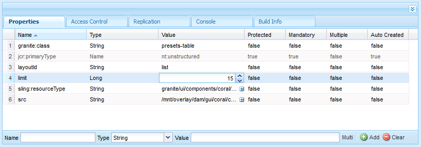
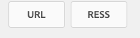

# Managing Dynamic Media image presets {#managing-image-presets}

Anhand von Bildvorgaben kann AEM Assets Bilder mit unterschiedlichen Größen, Formaten oder Bildeigenschaften dynamisch bereitstellen. Jede Bildvorgabe stellt eine vordefinierte Sammlung aus Größen- und Formatierungsbefehlen für die Anzeige von Bildern dar. Beim Erstellen einer Bildvorgabe wählen Sie eine Größe für die Bildbereitstellung aus. Außerdem wählen Sie Formatierungsbefehle, damit die Darstellung des Bildes bei der Bereitstellung zur Anzeige optimiert wird.

Administratoren können Vorgaben für den Export von Assets erstellen. Benutzer können eine Vorgabe auswählen, wenn sie Bilder exportieren, sodass die Bilder entsprechend den Spezifikationen des Administrators umformatiert werden.

Sie können auch responsive Bildvorgaben erstellen. Wenn Sie eine responsive Bildvorgabe auf Assets anwenden, werden diese je nach Gerät oder Bildschirmgröße bei der Anzeige geändert. Sie können Bildvorgaben konfigurieren, um im Farbraum zusätzlich zu RGB oder Graustufen auch CMYK zu verwenden.

In diesem Abschnitt wird beschrieben, wie Bildvorgaben erstellt, geändert und allgemein verwaltet werden. Sie können jederzeit bei der Vorschau eines Bildes eine Bildvorgabe darauf anwenden. Siehe [Anwenden von Bildvorgaben](image-presets.md).

>[!NOTE]
>
>Die intelligente Bildbearbeitung arbeitet mit bestehenden Bildvorgaben und reduziert im letzten Moment abhängig vom Browser oder der Geschwindigkeit der Netzverbindung die Größe der Bilddatei intelligent noch weiter. Weitere Informationen finden Sie unter [Intelligente Bildbearbeitung](imaging-faq.md).

## Understanding Dynamic Media image presets {#understanding-image-presets}

Wie bei einem Softwaremakro ist eine Bildvorgabe eine vordefinierte Sammlung von Größen- und Formatierungsbefehlen, die unter einem Namen gespeichert werden. Stellen Sie sich folgendes Szenario vor, um ein besseres Verständnis von Bildvorgaben zu erlangen: Für Ihre Website muss jedes Produktbild in unterschiedlichen Größen, Formaten und Kompressionsraten auf Desktop- und Mobilgeräten angezeigt werden.

You could create two Image Presets: one with 500 x 500 pixels for desktop version and 150 x 150 pixels for the mobile version. You create two Image Presets, one called *Enlarge* to display images at 500x500 pixels and one called *Thumbnail* to display images at 150 x 150 pixels. To deliver images at the Enlarge and Thumbnail size, AEM looks up the definition of the Enlarge Image Preset and Thumbnail Image Preset. AEM generiert anschließend dynamisch ein Bild anhand der Größen- und Formatierungsspezifikationen der jeweiligen Bildvorgabe.

Bilder, die bei der dynamischen Bereitstellung verkleinert werden, können an Schärfe und Detailgenauigkeit verlieren. Aus diesem Grund umfasst jede Bildvorgabe Formatierungssteuerelemente für die Optimierung eines Bildes, wenn es mit einer bestimmten Größe bereitgestellt wird. Dadurch wird sichergestellt, dass die Bilder scharf und deutlich auf der Website oder in der Anwendung angezeigt werden.

Administratoren können Bildvorgaben erstellen. Sie können völlig neue Bildvorgaben erstellen oder eine vorhandene Vorgabe bearbeiten und unter einem neuen Namen speichern.

## Managing Dynamic Media image presets {#managing-image-presets-1}

You manage your image presets in AEM by tapping the AEM logo to access the global navigation console and then tapping the Tools icon and navigating to **[!UICONTROL Assets > Image Presets]**.


>[!NOTE]
>
>Alle erstellten Bildvorgaben sind auch als dynamische Ausgabeformate verfügbar, wenn Sie eine Vorschau von Assets anzeigen oder Assets bereitstellen.
>
>Im *Modus „Dynamic Media – Scene7“* müssen Sie Bildvorgaben *nicht* veröffentlichen, da die Veröffentlichung von Bildvorgaben automatisch erfolgt.
>
>Im *Modus „Dynamic Media – Hybrid“* müssen Sie Bildvorgaben manuell veröffentlichen.
>
>Siehe [Veröffentlichen von Bildvorgaben.](#publishing-image-presets)

>[!NOTE]
>
>Das System zeigt mehrere Ausgabeformate, wenn Sie **[!UICONTROL Ausgabeformate]** in der Detailansicht eines Assets auswählen. **** Sie können die Anzahl der angezeigten Bildvorgaben erhöhen oder verringern. Siehe [Erhöhung der Anzahl der angezeigten Bildvorgaben](#increasing-or-decreasing-the-number-of-image-presets-that-display).

### Dateiformate Adobe Illustrator (AI), Postscript (EPS) und PDF   {#adobe-illustrator-ai-postscript-eps-and-pdf-file-formats}

Wenn Sie AI-, EPS- und PDF-Dateien unterstützen möchten, um aus diesen Dateiformaten dynamische Wiedergaben zu generieren, sollten Sie die folgenden Informationen lesen, bevor Sie Bildvorgaben erstellen.

Das Dateiformat von Adobe Illustrator ist eine Variante von PDF. Dies sind die wichtigsten Unterschiede im Hinblick auf AEM Assets:

* Adobe Illustrator-Dokumente bestehen aus einer einzelnen Seite mit mehreren Ebenen. Jede Ebene wird als PNG-Unter-Asset unter dem Illustrator-Haupt-Asset extrahiert.
* PDF-Dokumente bestehen aus einer oder mehreren Seiten. Jede Seite wird als einseitiges PDF-Unter-Asset unter dem mehrseitigen PDF-Hauptdokument extrahiert.

Die Unter-Assets werden von der Komponente `Create Sub Asset process` im übergeordneten `DAM Update Asset`-Workflow erstellt. Um diese Prozesskomponente innerhalb des Workflows anzuzeigen, tippen Sie auf **[!UICONTROL Tools > Workflow > Modelle > DAM-Update-Asset > Bearbeiten]**.

Siehe auch [Seiten einer mehrseitigen Datei anzeigen](/help/assets/managing-linked-subassets.md#view-pages-of-a-multi-page-file).

Sie können die Unter-Assets oder die Seiten anzeigen, wenn Sie das Asset öffnen, auf das Menü „Inhalt“ tippen und **[!UICONTROL Unter-Assets]** oder **[!UICONTROL Seiten]** auswählen. Unter-Assets sind echte Assets. Daher werden PDF-Seiten durch den Workflow `Create Sub Asset` (Unter-Asset erstellen) extrahiert. Die Seiten werden dann unter dem Haupt-Asset als `page1.pdf`, `page2.pdf` usw. gespeichert. Nachdem sie gespeichert wurden, werden sie durch den Workflow **[!UICONTROL DAM-Update-Asset]** verarbeitet.

Um Dynamic Media zu verwenden und dynamische Ausgabeformate für AI-, EPS- oder PDF-Dateien als Vorschau anzuzeigen oder zu generieren, sind folgende Verarbeitungsschritte erforderlich:

1. In the **[!UICONTROL DAM Update Asset]** workflow, the **[!UICONTROL Rasterize PDF/AI Image Preview Rendition]** process component rasterizes the first page of the original asset–using the configured resolution–into a `cqdam.preview.png` rendition.

1. Das Ausgabeformat `cqdam.preview.png` wird dann im Workflow durch die Prozesskomponente **[!UICONTROL Dynamic Media Process Image-Assets]** zu einer PTIFF-Datei optimiert.

>[!NOTE]
>
>In the **[!UICONTROL DAM Update Asset]** workflow, the **[!UICONTROL EPS thumbnails]** step generates thumbnails for EPS files.

### Metadateneigenschaften von PDF-/AI-/EPS-Assets   {#pdf-ai-eps-asset-metadata-properties}

| **Metadateneigenschaft** | **Beschreibung** |
|---|---|
| dam:Physicalwidthininches | Dokumentbreite in Zoll. |
| dam:Physicalheightininches | Dokumenthöhe in Zoll. |

Der Zugriff auf die Optionen der Prozesskomponente **[!UICONTROL PDF-/AI-Bildvorschau-Wiedergabe rastern]** erfolgt über den Workflow **[!UICONTROL DAM-Update-Asset]**.

Tippen Sie links oben auf Adobe Experience Manager und navigieren Sie zu **[!UICONTROL Tools > Workflow > Modelle]**. On the **[!UICONTROL Workflow Models]** page, select **[!UICONTROL DAM Update Asset]**, then on the toolbar tap **[!UICONTROL Edit]**. On the **[!UICONTROL DAM Update Asset workflow]** page, double-tap the **[!UICONTROL Rasterize PDF/AI Image Preview Rendition]** process component to open its **[!UICONTROL Step Properties]** dialog box.

### Rasterize PDF/AI image preview rendition options {#rasterize-pdf-ai-image-preview-rendition-options}


**Argumente zum Rastern von PDF- oder AI-Workflows**

<table> 
 <tbody> 
  <tr> 
   <td><strong>Prozessargument</strong></td> 
   <td><strong>Standardeinstellung</strong></td> 
   <td><strong>Beschreibung</strong></td> 
  </tr> 
  <tr> 
   <td>MIME-Typen</td> 
   <td><p>application/pdf</p> <p>application/postscript</p> <p>application/illustrator<br /> </p> </td> 
   <td>Liste der Dokument-MIME-Typen, die als PDF- oder Illustrator-Dokumente gelten.<br /> </td> 
  </tr> 
  <tr> 
   <td>Max. Breite</td> 
   <td>2048</td> 
   <td>Maximale Breite der generierten Vorschaudarstellung in Pixel.<br /> </td> 
  </tr> 
  <tr> 
   <td>Max. Höhe</td> 
   <td>2048</td> 
   <td>Maximale Höhe der generierten Vorschaudarstellung in Pixel.<br /> </td> 
  </tr> 
  <tr> 
   <td>Auflösung</td> 
   <td>72</td> 
   <td>Auflösung zum Rastern der ersten Seite in ppi (Pixel pro Zoll).</td> 
  </tr> 
 </tbody> 
</table>

Bei Verwendung der standardmäßigen Prozessargumente wird die erste Seite eines PDF/AI-Dokuments mit 72 ppi gerastert und das generierte Vorschaubild hat eine Größe von 2048 x 2048 Pixel. Für eine typische Bereitstellung können Sie die Auflösung auf einen Mindestwert von 150 ppi oder mehr erhöhen. Für ein US Letter-Dokument ist z. B. für 300 ppi eine maximale Breite und Höhe von 2550 x 3300 Pixel erforderlich.

**[!UICONTROL Die max. Breite und die max. Höhe beschränken die Auflösung, in der die Rasterung erfolgt.]****** Wenn z. B. die Maximalwerte unverändert bleiben und die Auflösung auf 300 ppi festgelegt wird, wird ein US Letter-Dokument mit 186 ppi gerastert. Das Dokument ist demnach 1581 x 2046 Pixel groß.

Für die Prozesskomponente **[!UICONTROL PDF-/AI-Bildvorschau-Wiedergabe rastern]** ist ein Maximalwert definiert, um sicherzustellen, dass im Arbeitsspeicher keine zu großen Bilder erstellt werden. Zu große Bilder können zu einem Überlauf des für die JVM (Java Virtual Machine) bereitgestellten Speichers führen. Achten Sie darauf, der JVM ausreichend Arbeitsspeicher zur Verwaltung der konfigurierten Anzahl paralleler Workflows zur Verfügung zu stellen, da jeder Workflow potenziell ein Bild in der konfigurierten Maximalgröße erstellen kann.

### InDesign-Dateiformat (INDD)   {#indesign-indd-file-format}

Wenn Sie INDD-Dateien unterstützen möchten, um aus diesem Dateiformat dynamische Wiedergaben zu generieren, sollten Sie die folgenden Informationen lesen, bevor Sie Bildvorgaben erstellen.
 

Für InDesign-Dateien werden nur dann Unter-Assets extrahiert, wenn der Adobe InDesign Server in AEM integriert ist. Referenzierte Assets werden auf der Grundlage ihrer Metadaten verknüpft. Für die Verknüpfung ist InDesign Server nicht erforderlich. Die referenzierten Assets müssen jedoch in AEM vorhanden sein, bevor die InDesign-Dateien verarbeitet werden, damit die Verknüpfungen zwischen den InDesign-Dateien und den referenzierten Assets erstellt werden können.

Siehe [Integrieren von AEM Assets in InDesign Server](indesign.md).

Die Prozesskomponente zum Extrahieren von Medien im Workflow **[!UICONTROL DAM-Update-Asset]****** führt mehrere vorkonfigurierte ExtendScript-Skripte aus, um InDesign-Dateien zu verarbeiten.


The **[!UICONTROL Extend Script]** paths in the arguments of **[!UICONTROL Media Extraction]** process component in the **[!UICONTROL DAM Update Asset]** workflow.

Die folgenden Skripte werden von der Dynamic Media-Integration verwendet:

<table> 
 <tbody> 
  <tr> 
   <td><strong>ExtendScript-Name</strong></td> 
   <td><strong>Default</strong></td> 
   <td><strong>Beschreibung</strong></td> 
  </tr> 
  <tr> 
   <td>ThumbnailExport.jsx</td> 
   <td>Ja</td> 
   <td>Erstellt eine 300 ppi große <code>thumbnail.jpg</code>-Darstellung, die von der Prozesskomponente <code>Dynamic Media Process Image Assets</code> optimiert und in eine PTIFF-Darstellung umgewandelt wird.<br /> </td> 
  </tr> 
  <tr> 
   <td>JPEGPagesExport.jsx</td> 
   <td>Ja</td> 
   <td>Generiert für jede Seite ein 300 ppi großes JPEG-Unter-Asset. Das JPEG-Unter-Asset ist ein echtes Asset, das unter dem InDesign-Asset gespeichert wird. Es wird auch vom Workflow <code>DAM Update Asset</code> optimiert und in eine PTIFF-Darstellung umgewandelt.<br /> </td> 
  </tr> 
  <tr> 
   <td>PDFPagesExport.jsx</td> 
   <td>Nein</td> 
   <td>Generiert für jede Seite ein PDF-Unter-Asset. Das PDF-Unter-Asset wird wie zuvor beschrieben verarbeitet. Da das PDF-Asset nur eine Seite enthält, werden keine Unter-Assets generiert.<br /> </td> 
  </tr> 
 </tbody> 
</table>

## Konfigurieren der Größe der Miniaturansicht {#configuring-image-thumbnail-size}

Sie können die Größe von Miniaturansichten über die Einstellungen im Workflow **[!UICONTROL DAM-Update-Asset]** konfigurieren. Im Workflow sind zwei Schritte enthalten, in denen Sie die Größe der Miniaturansichten von Bild-Assets konfigurieren können. Obwohl der eine (**[!UICONTROL Dynamic Media Process Image-Assets]**) für das Generieren dynamischer Bild-Assets und der andere (**[!UICONTROL Miniaturansichten verarbeiten]**) für das Generieren statischer Miniaturansichten verwendet wird bzw. dann, wenn alle anderen Prozesse zum Generieren von Miniaturansichten fehlschlagen, sollten *beide* dieselben Einstellungen haben.

Im Schritt **[!UICONTROL Bild-Assets-Prozess für dynamische Medien]** werden vom Bildserver Miniaturansichten generiert. Diese Konfiguration ist unabhängig von der Konfiguration, die auf den Schritt **[!UICONTROL Prozessminiaturansichten]** angewendet wird. Das Generieren von Miniaturansichten mit dem Schritt **[!UICONTROL Miniaturansichten verarbeiten]** ist das langsamste und speicherintensivste Verfahren zum Erstellen von Miniaturansichten.

Die Größe der Miniaturansichten wird im folgenden Format definiert: **width:height:center**, z. B. *80:80:false*. Die Breite und die Höhe legen die Größe der Miniaturansicht in Pixel fest. Für den Center-Wert ist entweder false oder true festgelegt. Wenn true festgelegt ist, hat das Miniaturbild exakt die in der Konfiguration festgelegte Größe. Wenn das in der Größe angepasste Bild kleiner ist, wird es im Miniaturbildfenster zentriert.

>[!NOTE]
>
>* Die Größe der Miniaturansichten für EPS-Dateien wird im Schritt **[!UICONTROL EPS-Miniaturen]** auf der Registerkarte **[!UICONTROL Argumente]****[!UICONTROL unter „Miniaturansichten“ konfiguriert]**.
   >
   >
* Die Größe der Miniaturansichten für Videos wird im Schritt **[!UICONTROL FFmpeg-Miniaturen]** auf der Registerkarte **[!UICONTROL Prozess]** unter **[!UICONTROL Argumente]** konfiguriert.
>


**Konfigurieren der Größe von Miniaturansichten**:

1. Tippen Sie auf **[!UICONTROL Tools > Workflow > Modelle > DAM-Update-Asset > Bearbeiten]**.
1. Tap the **[!UICONTROL Dynamic Media Process Image Assets]** step, then tap the **[!UICONTROL Thumbnails]** tab. Ändern Sie bei Bedarf die Größe der Miniaturansichten und tippen Sie auf **[!UICONTROL OK]**.

   

1. Tippen Sie auf den Schritt **[!UICONTROL Miniaturansichten verarbeiten]** und dann auf die Registerkarte **[!UICONTROL Miniaturansichten]**. Change the thumbnail size, as needed, and tap **[!UICONTROL OK]**.

   >[!NOTE]
   >
   >Die Werte im Argument „Miniaturansichten“ im Schritt **[!UICONTROL Prozessminiaturansichten]** müssen mit dem Argument „Miniaturansichten“ im Schritt **[!UICONTROL Bild-Assets-Prozess für dynamische Medien]** übereinstimmen.

1. Tippen Sie auf **[!UICONTROL Speichern]**, um die Änderungen am Workflow zu speichern.

### Increasing or decreasing the number of Dynamic Media image presets that display {#increasing-or-decreasing-the-number-of-image-presets-that-display}

Erstellte Bildvorgaben sind auch als dynamische Ausgabeformate verfügbar, wenn Sie eine Vorschau von Assets anzeigen. AEM zeigt verschiedene dynamische Ausgabeformate an, wenn Sie ein Asset unter **[!UICONTROL Detailansicht > Ausgabeformate]** anzeigen. Sie können die Anzahl der angezeigten Ausgabeformate erhöhen oder verringern.

**So erhöhen oder verringern Sie die Anzahl der angezeigten** Bildvorgaben für Dynamic Media:

1. Navigate to **[!UICONTROL CRXDE Lite]** ([http://localhost:4502/crx/de](http://localhost:4502/crx/de)).
1. Navigieren Sie zum Knoten für die Bildvorgabenliste unter `/libs/dam/gui/coral/content/commons/sidepanels/imagepresetsdetail/imgagepresetslist`.

   

1. In the **[!UICONTROL limit]** property, change the **[!UICONTROL value]**, which is set to 15 by default, to the desired number.
1. Navigieren Sie zur Datenquelle der Bildvorgabe unter `/libs/dam/gui/coral/content/commons/sidepanels/imagepresetsdetail/imgagepresetslist/datasource`

   

1. Ändern Sie in der Eigenschaft „limit“ den Wert auf die gewünschte Zahl, z. B. `{empty requestPathInfo.selectors[1] ? "20" : requestPathInfo.selectors[1]}`.
1. Tippen Sie auf **[!UICONTROL Alle speichern]**.

### Creating Dynamic Media image presets {#creating-image-presets}

Wenn Sie eine Bildvorgabe für Dynamic Media erstellen, können Sie diese Einstellungen bei der Vorschau oder Veröffentlichung auf alle Bilder anwenden.

>[!NOTE]
>
>Wenn Sie Internet Explorer 9 verwenden, wird das Erstellen einer Vorgabe nicht unmittelbar nach dem Speichern in der Liste angezeigt. Um dieses Problem zu umgehen, deaktivieren Sie den Cache für IE9.

Wenn Sie AI-, PDF-, und EPS-Dateien unterstützen möchten, um aus diesen Dateiformaten dynamische Wiedergaben zu generieren, sollten Sie die folgenden Informationen lesen, bevor Sie Bildvorgaben erstellen.\
Siehe [Dateiformate Adobe Illustrator (AI), Postscript (EPS) und PDF](#adobe-illustrator-ai-postscript-eps-and-pdf-file-formats).

Wenn Sie INDD-Dateien unterstützen möchten, um aus diesem Dateiformat dynamische Wiedergaben zu generieren, sollten Sie die folgenden Informationen lesen, bevor Sie Bildvorgaben erstellen.
 Siehe [InDesign-Dateiformat (INDD)](#indesign-indd-file-format).

>[!NOTE]
>
>Zum Erstellen von Bildvorgaben für Dynamic Media benötigen Sie Administratorrechte als AEM-Administrator oder Admin Console-Administrator.

**So erstellen Sie eine Bildvorgabe** für Dynamic Media:

1. Tippen Sie in AEM auf das AEM-Logo, um auf die globale Navigationskonsole zuzugreifen.
1. Tippen Sie auf das Symbol **[!UICONTROL Werkzeuge]** und navigieren Sie dann zu **[!UICONTROL Assets > Bildvorgaben]**.
1. Tippen Sie auf **[!UICONTROL Erstellen]**.

   

   >[!NOTE]
   >
   >Damit diese Bildvoreinstellung responsiv wird, löschen Sie die Werte in den Feldern **[!UICONTROL Breite]** und **[!UICONTROL Höhe]** und lassen Sie sie leer.

1. On the **[!UICONTROL Edit Image Preset]** page, enter values into the **[!UICONTROL Basic]** and **[!UICONTROL Advanced]** tabs as appropriate, including a name. Die Optionen werden unter [Bildvoreinstellungsoptionen](#image-preset-options) beschrieben. Vorgaben werden im linken Bereich angezeigt und können nur zusammen mit anderen Assets verwendet werden.

   

1. Klicken Sie auf **[!UICONTROL Speichern]**.

### Creating a responsive image preset {#creating-a-responsive-image-preset}

Um eine responsive Bildvorgabe zu erstellen, führen Sie die im Abschnitt [Erstellen von Bildvorgaben](#creating-image-presets) beschriebenen Schritte durch. Löschen Sie die Werte für Höhe und Breite im Fenster **[!UICONTROL Bildvorgabe bearbeiten]** und lassen Sie sie leer.

Dadurch wird diese Vorgabe in AEM als responsiv erkannt. Sie können die anderen Werte nach Bedarf anpassen.



>[!NOTE]
>
>Um die Schaltflächen **[!UICONTROL URL]** und **[!UICONTROL RESS]** beim Anwenden einer Bildvorgabe auf ein Asset anzuzeigen, muss das Asset veröffentlicht werden.
>
>Im Modus „Dynamic Media – Scene7“ werden Bildvorgaben und Bildelemente automatisch veröffentlicht.
>
>Im Modus „Dynamic Media – Hybrid“ müssen Sie Bildvorgaben und Bildelemente manuell veröffentlichen.

### Optionen für Bildvorgaben {#image-preset-options}

Die in diesem Abschnitt beschriebenen Optionen sind beim Erstellen oder Bearbeiten von Bildvorgaben verfügbar. Darüber hinaus empfiehlt Adobe die folgenden drei *Best Practice* -Optionen zum Beginn:

* **[!UICONTROL Format]** (Registerkarte **[!UICONTROL Einfach]** ) - Wählen Sie **[!UICONTROL JPEG]** oder ein anderes Format, das Ihren Anforderungen entspricht. Alle Webbrowser unterstützen das JPEG-Bildformat. Es Angebot ein gutes Gleichgewicht zwischen kleinen Dateigrößen und Bildqualität. Bilder im JPEG-Format verwenden jedoch ein verlustbehaftetes Komprimierungsschema, das unerwünschte Bildartefakte hervorrufen kann, wenn die Komprimierungseinstellung zu niedrig ist. Aus diesem Grund empfiehlt Adobe, die Komprimierungsqualität auf 75 einzustellen. Diese Einstellung bietet einen angemessenen Ausgleich zwischen Bildqualität und kleiner Dateigröße.
* **[!UICONTROL Einfaches Scharfzeichnen]** aktivieren: Wählen Sie **[!UICONTROL Einfaches Scharfzeichnen]** aktivieren nicht aus (diese Scharfzeichnungsfilter-Angebot haben weniger Kontrolle als die Unschärfemaske-Einstellungen).
* **[!UICONTROL Scharfzeichnen: Resampling Mode]** - Wählen Sie **[!UICONTROL Bi-Cubic]**.

#### Optionen auf der Registerkarte „Basis“{#basic-tab-options}

<table> 
 <tbody> 
  <tr> 
   <td><strong>Feld</strong></td> 
   <td><strong>Beschreibung</strong></td> 
  </tr> 
  <tr> 
   <td><strong>Name</strong></td> 
   <td>Geben Sie einen aussagekräftigen Namen ohne Leerzeichen ein. Nehmen Sie die Bildgröße in den Namen auf, damit Benutzer diese Bildvorgabe einfacher identifizieren können.</td> 
  </tr> 
  <tr> 
   <td><strong>Breite und Höhe</strong></td> 
   <td>Geben Sie die Größe in Pixel ein, in der das Bild übermittelt wird. Breite und Höhe müssen größer als 0 Pixel sein. Wenn einer der beiden Werte 0 ist, wird keine Vorgabe erstellt. Wenn beide Werte leer sind, wird eine responsive Bildvorgabe erstellt.</td> 
  </tr> 
  <tr> 
   <td><strong>Format</strong></td> 
   <td><p>Wählen Sie ein Format im Menü aus.</p> <p>Bei <strong>JPEG</strong> erhalten Sie die folgenden zusätzlichen Optionen:</p> 
    <ul> 
     <li><strong>Qualität</strong>: Steuert die JPEG-Komprimierungsstufe. Diese Einstellung wirkt sich sowohl auf die Dateigröße als auch auf die Bildqualität aus. Die JPEG-Qualitätsskala reicht von 1 bis 100. Die Skala ist sichtbar, wenn Sie den Schieberegler bewegen.</li> 
     <li><strong>JPG-Chrominanz-Downsampling aktivieren</strong>: Da das menschliche Auge weniger empfindlich gegenüber hochfrequenten Farbinformationen als gegenüber hochfrequenter Luminanz ist, teilen JPEG-Bilder die Bildinformationen in Luminanz und Farbkomponenten. Wenn ein JPEG-Bild komprimiert wird, bleibt die Luminanzkomponente in der vollen Auflösung erhalten, während bei den Farbkomponenten ein Downsampling anhand einer Durchschnittsbildung von Pixelgruppen erfolgt. Beim Downsampling wird das Datenvolumen um die Hälfte oder ein Drittel reduziert, ohne dass dies entscheidende Auswirkungen auf die wahrgenommene Qualität hat. Downsampling kann nicht auf Graustufen-Bilder angewendet werden. Diese Technik reduziert den Komprimierungsgrad, was bei Bildern mit hohem Kontrast hilfreich ist (z. B. bei Bildern mit überlagertem Text).</li> 
    </ul> 
    <div>
      Bei Auswahl von <strong>GIF</strong> oder <strong>GIF mit Alpha</strong> werden die folgenden zusätzlichen Optionen für <strong>GIF-Farbquantisierung</strong> verfügbar: 
    </div> 
    <ul> 
     <li><strong>Typ</strong>: Wählen Sie <strong>Adaptiv</strong> (Standard), <strong>Web</strong> oder <strong>Macintosh</strong>. Wenn Sie <strong>GIF mit Alpha</strong> auswählen, ist die Option „Macintosh“ nicht verfügbar.</li> 
     <li><strong>Dithering</strong>: Wählen Sie <strong>Diffus</strong> oder <strong>Aus</strong>.</li> 
     <li><strong>Anzahl Farben</strong>: Geben Sie eine Zahl zwischen 2 und 256 ein.</li> 
     <li><strong>Farbliste</strong>: Geben Sie eine durch Komma getrennte Liste ein. Geben Sie beispielsweise für Weiß, Grau und Schwarz „000000,888888,ffffff“ ein.</li> 
    </ul> 
    <div>
      Bei Auswahl von <strong>PDF</strong>, <strong>TIFF</strong> oder <strong>TIFF mit Alpha</strong> erhalten Sie die folgende zusätzliche Option: 
    </div> 
    <ul> 
     <li><strong>Komprimierung</strong>: Wählen Sie einen Komprimierungsalgorithmus. Die Algorithmusoptionen für PDF lauten <strong>Kein</strong>, <strong>ZIP</strong> und <strong>JPEG</strong>. Für TIFF lauten sie <strong>Kein</strong>, <strong>LZW</strong>, <strong>JPEG</strong> und <strong>ZIP</strong>. Für TIFF mit Alpha lauten sie <strong>Kein</strong>, <strong>LZW</strong> und <strong>ZIP</strong>.</li> 
    </ul> <p>Die Auswahl <strong>PNG</strong>, <strong>PNG mit Alpha</strong> oder <strong>EPS</strong> ergibt keine zusätzlichen Optionen.</p> </td> 
  </tr> 
  <tr> 
   <td><strong>Scharfzeichnen</strong></td> 
   <td>Wählen Sie die Option <strong>Einfaches Scharfzeichnen aktivieren</strong>, um einen einfachen Scharfzeichnungsfilter auf das Bild anzuwenden, nachdem die Skalierung abgeschlossen wurde. Mit der Scharfzeichnung können Sie unter Umständen Weichzeichnung kaschieren, die durch die Anzeige eines Bildes in einer anderen Größe entsteht. </td> 
  </tr> 
 </tbody> 
</table>

#### Optionen auf der Registerkarte „Erweitert“{#advanced-tab-options}

<table> 
 <tbody> 
  <tr> 
   <td><strong>Feld</strong></td> 
   <td><strong>Beschreibung</strong></td> 
  </tr> 
  <tr> 
   <td><strong>Farbraum</strong></td> 
   <td>Wählen Sie <strong>RGB, CMYK</strong> oder <strong>Graustufen</strong> als Farbraum aus.</td> 
  </tr> 
  <tr> 
   <td><strong>Farbprofil</strong></td> 
   <td>Wählen Sie das Profil des Ausgabefarbraums aus, in den das Asset konvertiert werden soll, sofern dieser sich von dem des Arbeitsprofils unterscheidet.</td> 
  </tr> 
  <tr> 
   <td><strong>Rendering-Intent</strong></td> 
   <td>Sie können den Standardwert für Rendering-Intent überschreiben. Rendering-Intent legt fest, was mit Farben passiert, die im Farbprofil des Ziels nicht wiedergegeben werden können (außerhalb der Farbskala). Rendering-Intent wird ignoriert, wenn das ICC-Profil nicht kompatibel ist. 
    <ul> 
     <li>Wählen Sie <strong>Wahrnehmungsoptimiert</strong> aus, damit die gesamte Farbskala von einem Farbraum in einen anderen Farbraum komprimiert wird, wenn eine oder mehrere Farben im Originalbild außerhalb der Farbskala des Zielfarbraums liegen.</li> 
     <li>Wählen Sie <strong>Relativ farbmetrisch</strong> aus, wenn eine Farbe des aktuellen Farbraums im Zielfarbraum außerhalb der Farbskala liegt und auf die nächstmögliche Farbe der Farbskala des Zielfarbraums abgebildet werden soll, ohne dass andere Farben betroffen sind. </li> 
     <li>Wählen Sie <strong>Sättigung</strong> aus, um die Sättigung des Originalbilds beim Konvertieren in den Zielfarbraum zu übernehmen. </li> 
     <li>Wählen Sie <strong>Absolut farbmetrisch</strong> aus, um Farben exakt und ohne Weißpunkt- oder Schwarzpunktanpassung abzubilden, wodurch die Helligkeit verändert würde.</li> 
    </ul> </td> 
  </tr> 
  <tr> 
   <td><strong>Tiefenkompensierung</strong></td> 
   <td>Wählen Sie diese Option aus, wenn das Ausgabeprofil diese Funktion unterstützt. Die Tiefenkompensierung wird ignoriert, wenn sie nicht mit dem angegebenen ICC-Profil kompatibel ist.</td> 
  </tr> 
  <tr> 
   <td><strong>Dithering</strong></td> 
   <td>Wählen Sie diese Option aus, um Farbstreifen-Artefakte möglichst zu vermeiden oder zu reduzieren. </td> 
  </tr> 
  <tr> 
   <td><strong>Scharfzeichnungstyp </strong></td> 
   <td><p>Wählen Sie <strong>Kein</strong>, <strong>Scharfzeichnen</strong> oder <strong>Unschärfemaske</strong> aus. </p> 
    <ul> 
     <li>Wählen Sie <strong>Kein</strong>, um die Scharfzeichnung zu deaktivieren.</li> 
     <li>Aktivieren Sie <strong>Scharfzeichnen</strong>, um einen einfachen Scharfzeichnungsfilter auf das Bild anzuwenden, nachdem die Skalierung abgeschlossen ist. Mit der Scharfzeichnung können Sie unter Umständen Weichzeichnung kaschieren, die durch die Anzeige eines Bildes in einer anderen Größe entsteht. </li> 
     <li>Wählen Sie <strong>Unschärfemaske</strong>, um einen Scharfzeichnungsfiltereffekt für das endgültige Bild nach dem Downsampling zu optimieren. Sie können die Intensität und den Radius des Effekts (in Pixel gemessen) sowie einen Kontrastschwellenwert, der ignoriert wird, steuern. Bei diesem Effekt werden dieselben Optionen wie im Filter „Unschärfemaske“ von Photoshop verwendet.</li> 
    </ul> <p>In <strong>Unschärfemaske</strong> sind die folgenden Optionen verfügbar:</p> 
    <ul> 
     <li><strong>Betrag</strong>: Steuert den auf die Kantenpixel angewendeten Kontrastwert. Der Standardwert für die reelle Zahl ist 1,0. Bei hochauflösenden Bildern können Sie ihn auf bis zu 5,0 erhöhen. Der Wert dient hierbei als ein Maß für die Filterintensität.</li> 
     <li><strong>Radius</strong>: Bestimmt die Anzahl der Pixel um die Kantenpixel, die sich auf die Scharfzeichnung auswirken. Geben Sie für Bilder mit hoher Auflösung eine reelle Zahl zwischen 1 und 2 ein. Mit einem niedrigeren Wert werden nur die Kantenpixel scharfgezeichnet, während mit einem höheren Wert mehr Pixel scharfgezeichnet werden. Der korrekte Wert hängt von der Bildgröße ab.</li> 
     <li><strong>Schwellenwert</strong>: Bestimmt den Kontrastbereich, der bei der Anwendung des Filters „Unschärfemaske“ ignoriert werden soll. In anderen Worten: Die Option bestimmt, wie stark sich die scharfgezeichneten Pixel vom Umgebungsbereich unterscheiden müssen, damit sie als Kantenpixel eingestuft und scharfgezeichnet werden. Um Rauschen zu vermeiden, experimentieren Sie mit Ganzzahlwerten zwischen 2 und 20. </li> 
     <li><strong>Anwenden auf</strong>: Bestimmt, ob die Unscharfzeichnung für jede Farbe oder Helligkeit gilt.</li> 
    </ul> 
    <div>
      Das Scharfzeichnen wird unter <a href="https://docs.adobe.com/content/help/en/experience-manager-64/assets/dynamic/assets/s7_sharpening_images.pdf">Scharfzeichnen von Bildern</a> beschrieben. 
    </div> </td> 
  </tr> 
  <tr> 
   <td><strong>Resampling-Modus</strong></td> 
   <td>Wählen Sie eine Option für den <strong>Resamplingmodus</strong>. Diese Optionen sorgen dafür, dass das Bild beim Downsampling scharf bleibt: 
    <ul> 
     <li><strong>Bilinear</strong>: Die schnellste Resampling-Methode. Einige Aliasing-Artefakte sind sichtbar.</li> 
     <li><strong>Bikubisch</strong>: Erhöht die CPU-Auslastung, bietet jedoch schärfere Bilder mit weniger deutlichen Aliasing-Artefakten.</li> 
     <li><strong>Scharf2</strong>: Kann im Vergleich zu „Bikubisch“ etwas schärfere Ergebnisse erzeugen, ist jedoch CPU-intensiver.</li> 
     <li><strong>Bi-Sharp</strong>: Wählt den Standard-Resampler in Photoshop zum Reduzieren der Bildgröße aus, was in Adobe Photoshop als <strong>bikubisch schärfer</strong> bezeichnet wird.</li> 
     <li><strong>Jede Farbe</strong> und <strong>Helligkeit</strong>: Jede Methode kann auf Farbe oder Helligkeit basieren. Standardmäßig ist <strong>Jede Farbe</strong> ausgewählt.</li> 
    </ul> </td> 
  </tr> 
  <tr> 
   <td><strong>Druckauflösung</strong></td> 
   <td>Wählen Sie eine Auflösung für den Druck dieses Bildes. Der Standardwert beträgt 72 Pixel.</td> 
  </tr> 
  <tr> 
   <td><strong>Bildmodifikator</strong></td> 
   <td><p>Neben den allgemeinen Bildeinstellungen in der Benutzeroberfläche unterstützt Dynamic Media zahlreiche erweiterte Bearbeitungsoptionen für Bilder, die Sie im Feld <strong>Bildmodifikatoren</strong> festlegen können. Diese Parameter werden in der <a href="https://docs.adobe.com/content/help/en/dynamic-media-developer-resources/image-serving-api/image-serving-api/http-protocol-reference/command-reference/c-command-reference.html">Befehlsreferenz für das Image Server-Protokoll</a> definiert.</p> <p>Wichtig: Die folgenden in der API aufgelisteten Funktionen werden nicht unterstützt:</p> 
    <ul> 
     <li>Grundlegende Befehle zur Vorlagenerstellung und Textdarstellung: <code>text= textAngle= textAttr= textFlowPath= textFlowXPath= textPath=</code> und <code>textPs=</code></li> 
     <li>Lokalisierungsbefehle: <code>locale=</code> und <code>req=xlate</code></li> 
     <li><code>req=set</code> ist nicht für die allgemeine Anwendung verfügbar.</li> 
     <li><code>req=mbrset</code></li> 
     <li><code>req=saveToFile</code></li> 
     <li><code>req=targets</code></li> 
     <li><code>template=</code></li> 
     <li>Dynamic Media-Neben-Services: SVG, Rendering von Bildern und Web-to-Print</li> 
    </ul> </td> 
  </tr> 
 </tbody> 
</table>

## Defining Image Preset options with image modifiers {#defining-image-preset-options-with-image-modifiers}

Besides the options available in the **[!UICONTROL Basic]** and **[!UICONTROL Advanced]** tabs, you can define image modifiers to give you more options when you define image presets. Das Rendern von Bildern basiert auf der Image Rendering-API von Dynamic Media. Die API wird in der [HTTP-Protokollreferenz](https://docs.adobe.com/content/help/en/dynamic-media-developer-resources/image-serving-api/image-serving-api/http-protocol-reference/c-http-protocol-reference.html)detailliert definiert.

Im Folgenden finden Sie einige einfache Beispiele für die Nutzung von Bild-Modifikatoren.

>[!NOTE]
>
>Einige Bildmodifikatoren [können nicht in AEM verwendet werden](#advanced-tab-options).

* [op_invert](https://docs.adobe.com/content/help/en/dynamic-media-developer-resources/image-serving-api/image-serving-api/http-protocol-reference/command-reference/r-op-invert.html): Invertiert jede Farbkomponente für einen negativen Bildeffekt.

   ```xml
   &op_invert=1
   ```

   

* [op_blur](https://docs.adobe.com/content/help/en/dynamic-media-developer-resources/image-serving-api/image-serving-api/http-protocol-reference/command-reference/r-op-blur.html): Wendet einen Weichzeichenfilter auf das Bild an.

   ```xml
   &op_blur=25
   ```

   

* Kombinierte Befehle - op_blur und op-invert

   ```xml
   &op_invert=1&op_blur=25
   ```

   

* [Op_brightness:](https://docs.adobe.com/content/help/en/dynamic-media-developer-resources/image-serving-api/image-serving-api/http-protocol-reference/command-reference/r-op-brightness.html): Verringert oder erhöht die Helligkeit.

   ```xml
   &op_brightness=75
   ```

   

* [opac](https://docs.adobe.com/content/help/en/dynamic-media-developer-resources/image-serving-api/image-serving-api/http-protocol-reference/command-reference/r-opac.html) – Passt die Bilddeckkraft an. Ermöglicht es Ihnen, die Vordergrunddeckkraft zu verringern.

   ```xml
   opac=50
   ```

   

## Bearbeiten von Bildvorgaben {#modifying-image-presets}

**So bearbeiten Sie Bildvorgaben**:

1. Tippen Sie in AEM auf das AEM-Logo, um auf die globale Navigationskonsole zuzugreifen.
1. Tippen Sie auf das Symbol **[!UICONTROL Werkzeuge]** und navigieren Sie dann zu **[!UICONTROL Assets > Bildvorgaben]**.

   

1. Wählen Sie eine Vorgabe aus und tippen Sie dann auf **[!UICONTROL Bearbeiten]**.
1. Nehmen Sie auf der Seite &quot;Bildvorgaben **[!UICONTROL bearbeiten]** &quot;die gewünschten Änderungen vor und tippen Sie dann auf **[!UICONTROL Speichern]**.

## Publishing Dynamic Media image presets {#publishing-image-presets}

Wenn Sie den Modus „Dynamic Media –Hybrid“ ausführen, müssen Sie Bildvorgaben manuell veröffentlichen.

Wenn Sie den Modus „Dynamic Media – Scene7“ ausführen, werden Bildvorgaben automatisch veröffentlicht und Sie müssen diese Schritte nicht ausführen.

**So veröffentlichen Sie Bildvorgaben im Dynamic Media-Hybridmodus**:

1. Tippen Sie in AEM auf das AEM-Logo, um auf die globale Navigationskonsole zuzugreifen.
1. Tippen Sie auf das Symbol **[!UICONTROL Werkzeuge]** und navigieren Sie dann zu **[!UICONTROL Assets > Bildvorgaben]**.
1. Select the image preset or multiple image presets from the list of image presets, then tap **[!UICONTROL Publish]**.
1. Nachdem die Bildvorgabe veröffentlicht wurde, ändert sich der Status von „Nicht veröffentlicht“ in „Veröffentlicht“.

   

## Deleting Dynamic Media image presets {#deleting-image-presets}

**So löschen Sie Bildvorgaben** für Dynamic Media:

1. Tippen Sie in AEM auf das AEM-Logo, um auf die globale Navigationskonsole zuzugreifen.
1. Tippen Sie auf das Symbol **[!UICONTROL Werkzeuge]** und navigieren Sie dann zu **[!UICONTROL Assets > Bildvorgaben]**.
1. Wählen Sie eine Vorgabe aus und tippen Sie dann auf **[!UICONTROL Löschen]**. Dynamic Media bestätigt Ihre Löschabsicht. Tippen Sie auf **[!UICONTROL Löschen]**. 

