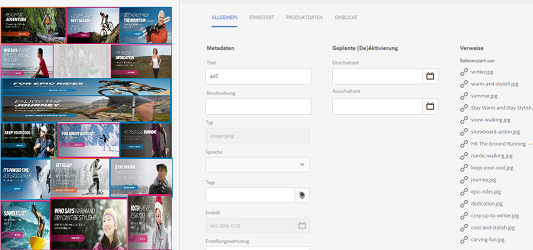
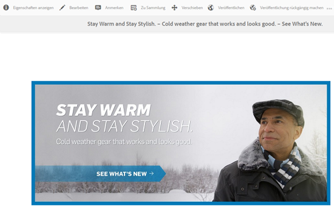
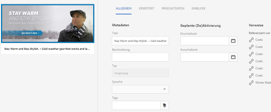
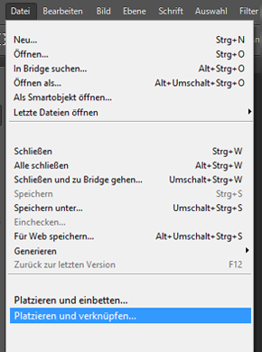
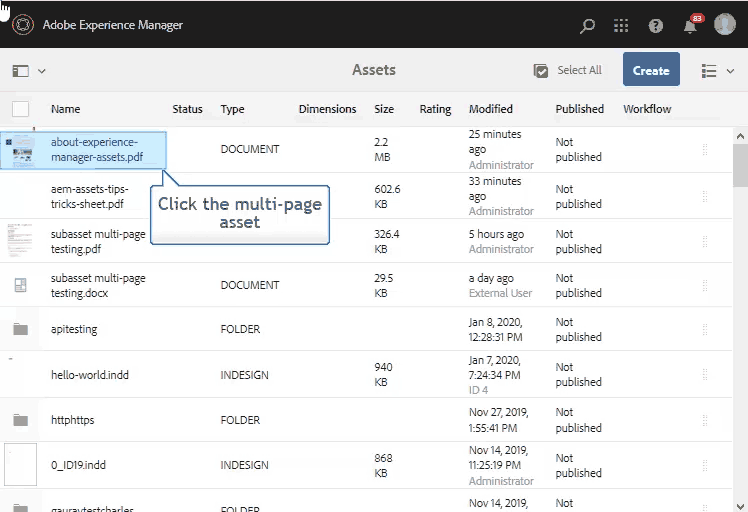

# Verwalten von ebenenübergreifenden Assets mit Unter-Assets {#managing-compound-assets}

Adobe Experience Manager Assets kann erkennen, ob eine hochgeladene Datei Verweise auf Assets enthält, die bereits im Repository vorhanden sind. Diese Funktion ist nur für unterstützte Dateiformate verfügbar. Wenn das hochgeladene Asset Referenzen zu [!DNL Experience Manager]-Assets enthält, wird eine bidirektionale Verknüpfung zwischen dem hochgeladenen Asset und den referenzierten Assets erstellt.

Zusätzlich zur Eliminierung von Redundanz und Referenz [!DNL Experience Manager] Assets in Adobe Creative Cloud-Anwendungen verbessern die Zusammenarbeit und erhöhen die Effizienz und Produktivität der Benutzer.

[!DNL Experience Manager] Assets unterstützt **bidirektionale Verweise**. Referenzierte Assets finden Sie auf der Asset-Detailseite der hochgeladenen Datei. Darüber hinaus können Sie die referenzierenden Dateien für [!DNL Experience Manager] Assets auf der Asset-Detailseite des referenzierten Assets.

Referenzen werden auf der Grundlage von Pfad, Dokument-ID und Instanz-ID der referenzierten Assets aufgelöst.

## Adobe Illustrator: Hinzufügen von Assets als Referenzen {#refai}

Sie können vorhandene [!DNL Experience Manager] Assets aus einer Adobe Illustrator-Datei.

1. Verwenden [[!DNL Experience Manager] Desktop-Programm](https://helpx.adobe.com/de/experience-manager/desktop-app/aem-desktop-app.html), Bereitstellung [!DNL Experience Manager] Assets-Repository als Laufwerk auf Ihrem lokalen Computer. Navigieren Sie im bereitgestellten Laufwerk zum Speicherort des Assets, das Sie referenzieren möchten.
1. Ziehen Sie das Asset vom bereitgestellten Laufwerk auf die Illustrator-Datei.
1. Speichern Sie die Illustrator-Datei auf dem bereitgestellten Laufwerk oder [hochladen](managing-assets-touch-ui.md#uploading-assets) der [!DNL Experience Manager] Repository.
1. Nachdem der Workflow abgeschlossen ist, navigieren Sie zur Detailseite für das Asset. Die Verweise auf vorhandene [!DNL Experience Manager] Assets werden unter **[!UICONTROL Abhängigkeiten]** im **[!UICONTROL Verweise]** Spalte.

   

1. Es ist auch möglich, dass andere Dateien als die aktuelle Datei auf die referenzierten Assets verweisen, die unter **[!UICONTROL Abhängigkeiten]** angezeigt werden. Um eine Liste der referenzierenden Dateien für ein Asset anzuzeigen, klicken Sie unter **[!UICONTROL Abhängigkeiten]** auf das Asset.

   

1. Klicken Sie in der Symbolleiste auf das Symbol **[!UICONTROL Eigenschaften anzeigen]**. Auf der Seite „Eigenschaften“ wird die Liste der Dateien, die das aktuelle Asset referenzieren, auf der Registerkarte **[!UICONTROL Allgemein]** unter der Spalte **[!UICONTROL Verweise]** angezeigt.

   

## Adobe InDesign: Hinzufügen von Assets als Referenzen {#add-aem-assets-as-references-in-adobe-indesign}

Verweis [!DNL Experience Manager] Assets aus einer InDesign-Datei ziehen Sie entweder [!DNL Experience Manager] Assets in die InDesign-Datei übertragen oder die InDesign-Datei als ZIP-Datei exportieren.

Referenzierte Assets sind bereits in [!DNL Experience Manager] Assets. Sie können Unter-Assets extrahieren, indem Sie [InDesign-Server konfigurieren](indesign.md). Eingebettete Assets in einer InDesign-Datei werden als Teil-Assets extrahiert.

>[!NOTE]
>
>Wenn der InDesign-Server als Proxyserver dient, wird die Vorschau der InDesign-Dateien innerhalb der XMP-Metadaten eingebettet. In diesem Fall ist die Extraktion von Miniaturen nicht explizit erforderlich. Wenn der InDesign-Server nicht als Proxyserver fungiert, müssen Miniaturen für InDesign-Dateien explizit extrahiert werden.

Beim Hochladen einer INDD-Datei werden die Verweise abgerufen, indem Assets mit den Eigenschaften `xmpMM:InstanceID` und `xmpMM:DocumentID` im Repository abgefragt werden.

### Erstellen von Referenzen durch Ziehen von Assets {#create-references-by-dragging-aem-assets}

Dieses Verfahren ähnelt dem [Hinzufügen von Assets als Referenzen in Adobe Illustrator](#refai).

### Erstellen von Referenzen zu Assets durch Exportieren einer ZIP-Datei {#create-references-to-aem-assets-by-exporting-a-zip-file}

1. Führen Sie die Schritte unter [Erstellen von Workflow-Modellen](/help/sites-developing/workflows-models.md) , um einen neuen Workflow zu erstellen.
1. Verwenden Sie die [Paketfunktion von Adobe InDesign](https://helpx.adobe.com/indesign/how-to/save-share-projects.html) um das Dokument zu exportieren. Adobe InDesign kann ein Dokument und die verknüpften Assets als Paket exportieren. In diesem Fall enthält der exportierte Ordner eine `Links` -Ordner, der Teil-Assets in der InDesign-Datei enthält. Der `Links`-Ordner befindet sich im selben Ordner wie die INDD-Datei.
1. Erstellen Sie eine ZIP-Datei und laden Sie sie in das [!DNL Experience Manager]-Repository hoch.
1. Starten Sie den Unarchiver-Workflow.
1. Wenn der Workflow abgeschlossen ist, werden die Referenzen im Link-Ordner automatisch als Teil-Assets referenziert. Um eine Liste der referenzierten Assets anzuzeigen, navigieren Sie zur Asset-Detailseite des InDesign-Assets und schließen Sie die [Leiste](/help/sites-authoring/basic-handling.md#rail-selector).

## Adobe Photoshop: Hinzufügen von Assets als Referenzen {#refps}

1. Mit einem WebDav-Client bereitstellen [!DNL Experience Manager] Assets als Laufwerk.
1. So erstellen Sie Verweise auf [!DNL Experience Manager] Assets in einer Photoshop-Datei verwenden Sie die Funktion Verknüpftes Platzieren in Photoshop , um zu den entsprechenden Assets im bereitgestellten Laufwerk zu navigieren.

   

1. Speichern Sie die Datei in Photoshop auf dem bereitgestellten Laufwerk oder [hochladen](managing-assets-touch-ui.md#uploading-assets) der [!DNL Experience Manager] Repository.
1. Nach Abschluss des Workflows werden die Verweise auf vorhandene [!DNL Experience Manager]-Assets auf der Asset-Detailseite aufgeführt.

   Rufen Sie die referenzierten Assets auf, indem Sie die [Leiste](/help/sites-authoring/basic-handling.md#rail-selector) auf der Asset-Detailseite schließen.

1. Die referenzierten Assets enthalten auch die Liste der Assets, von denen sie referenziert werden. Um eine Liste der referenzierten Assets anzuzeigen, navigieren Sie zur Asset-Detailseite und schließen Sie die [Leiste](/help/sites-authoring/basic-handling.md#rail-selector).

>[!NOTE]
>
>Die Assets innerhalb der ebenenübergreifenden Assets können ebenfalls basierend auf ihrer Dokument-ID und ihrer Instanz-ID referenziert werden. Diese Funktion ist nur in Adobe Illustrator und Adobe Photoshop verfügbar. Bei anderen Versionen erfolgt die Referenzierung basierend auf dem relativen Pfad von verknüpften Assets im ebenenübergreifenden Haupt-Asset, wie das auch bei früheren Versionen von AEM der Fall ist.

## Erstellen von Unter-Assets {#generate-subassets}

Für die unterstützten Assets mit mehrseitigen Formaten - PDF-Dateien, AI-Dateien, Microsoft PowerPoint- und Apple Keynote-Dateien und Adobe InDesign-Dateien - [!DNL Experience Manager] kann Teil-Assets generieren, die jeder einzelnen Seite des ursprünglichen Assets entsprechen. Diese Unter-Assets sind mit dem *übergeordneten* Asset verknüpft und ermöglichen die mehrseitige Anzeige. Für alle anderen Zwecke werden die Unter-Assets wie normale Assets in AEM behandelt.

Die Erstellung von Unter-Assets ist standardmäßig deaktiviert. Gehen Sie wie folgt vor, um die Erstellung von Unter-Assets zu aktivieren:

1. Melden Sie sich bei Experience Manager als Administrator an. Gehen Sie zu **[!UICONTROL Tools > Workflow > Modelle]**.
1. Wählen Sie den Workflow **[!UICONTROL DAM-Update-Asset]** aus und klicken Sie auf **[!UICONTROL Bearbeiten]**.
1. Klicken Sie auf **[!UICONTROL Seitliches Bedienfeld ein/aus]** und suchen Sie nach dem Schritt **[!UICONTROL Untergeordnetes Asset erstellen]**. Fügen Sie den Schritt zum Workflow hinzu. Klicken Sie auf **[!UICONTROL Synchronisieren]**.

Führen Sie einen der folgenden Schritte aus, um die Assets zu generieren:

* Neue Assets: Die [!UICONTROL DAM-Update von Assets] Der Workflow wird für jedes neue Asset ausgeführt, das in AEM hochgeladen wird. Für neue mehrseitige Assets werden automatisch Unter-Assets generiert.
* Vorhandene mehrseitige Assets: Führen Sie den Workflow [!UICONTROL DAM-Update-Asset] im Anschluss an einen der folgenden Schritte aus:

   * Wählen Sie ein Asset aus und klicken Sie auf [!UICONTROL Zeitleiste], um den linken Bereich zu öffnen. Sie können auch den Tastaturbefehl `alt + 3` verwenden. Klicken Sie auf [!UICONTROL Workflow starten], wählen Sie [!UICONTROL DAM-Update-Asset] aus, klicken Sie auf [!UICONTROL Starten] und anschließend auf [!UICONTROL Fortfahren].
   * Wählen Sie ein Asset aus und klicken Sie auf der Symbolleiste auf [!UICONTROL Erstellen > Workflow]. Wählen Sie im Popup-Dialogfeld den Workflow [!UICONTROL DAM-Update-Asset] aus, klicken Sie auf [!UICONTROL Starten] und dann auf [!UICONTROL Fortfahren].

Führen Sie speziell für Microsoft Word-Dokumente den Workflow **[!UICONTROL DAM-Analyse von Word-Dokumenten]** aus. Er generiert eine `cq:Page`-Komponente aus dem Inhalt des Microsoft Word-Dokuments. Die `cq:Page`-Komponente verweist auf die aus dem Dokument extrahierten Bilder. Diese Bilder werden auch dann extrahiert, wenn die Erstellung von Unter-Assets deaktiviert ist.

## Anzeigen von Unter-Assets {#viewing-subassets}

Die Unter-Assets werden nur angezeigt, wenn sie generiert wurden und für das ausgewählte mehrseitige Asset verfügbar sind. Um die generierten Unter-Assets anzuzeigen, öffnen Sie das mehrseitige Asset. Klicken Sie oben links auf der Seite auf  und klicken Sie auf **[!UICONTROL Unter-Assets]** aus der Liste. Wählen Sie **[!UICONTROL Unter-Assets]** aus der Liste aus. Sie können auch den Tastaturbefehl `alt + 5` verwenden.

## Anzeigen von Seiten einer mehrseitigen Datei  {#view-pages-of-a-multi-page-file}

Sie können eine mehrseitige Datei, z. B. PDF, INDD, PPT, PPTX und AI-Datei anzeigen, indem Sie die Funktion &quot;Seitenanzeige&quot;von [!DNL Experience Manager] Assets. Öffnen Sie ein mehrseitiges Asset und klicken Sie links oben auf der Seite auf **[!UICONTROL Seiten anzeigen]**. Der daraufhin geöffnete Seiten-Viewer zeigt die Seiten des Assets und Steuerelemente zum Durchsuchen und Zoomen der einzelnen Seiten an.

In InDesign können Sie Seiten mithilfe des InDesign-Servers extrahieren. Wenn die Vorschau von Seiten bei der Erstellung einer InDesign-Datei gespeichert wird, ist der InDesign-Server nicht für die Seitenextraktion erforderlich.

Die folgenden Optionen sind auf der Symbolleiste, in der linken Leiste und in den Steuerelementen des Seiten-Viewers verfügbar:

* **[!UICONTROL Desktop-Aktionen]**, um ein bestimmtes Unter-Asset mit dem [!DNL Experience Manager]-Desktop-Programm zu öffnen oder anzuzeigen. Erfahren Sie, wie Sie [Desktop-Aktionen konfigurieren](https://experienceleague.adobe.com/docs/experience-manager-desktop-app/using/using.html?lang=de#desktopactions-v2), wenn Sie das [!DNL Experience Manager]-Desktop-Programm verwenden.

* Die Option **[!UICONTROL Eigenschaften]** öffnet die Seite [!UICONTROL Eigenschaften] des Unter-Assets.

* Mit der Option **[!UICONTROL Anmerken]** können Sie das spezifische Unter-Asset kommentieren. Die Anmerkungen, die Sie für separate Unter-Assets verwenden, werden erfasst und zusammen angezeigt, wenn das übergeordnete Asset zur Anzeige geöffnet wird.

* Die Option **[!UICONTROL Seitenübersicht]** zeigt alle Unter-Assets gleichzeitig an.

* **[!UICONTROL Timeline]** Option in der linken Leiste nach dem Klicken auf  zeigt den Aktivitäts-Stream für die Datei an.

## Best Practices und Einschränkungen {#best-practice-limitation-tips}

* Die Erstellung von Unter-Assets kann bei jeder Experience Manager-Bereitstellung sehr ressourcenintensiv sein. Wenn Sie Unter-Assets generieren, während komplexe Assets hochgeladen werden, fügen Sie den Schritt im Workflow „DAM-Update-Asset“ hinzu. Wenn Sie Unter-Assets On-Demand generieren, erstellen Sie einen separaten Workflow, um Unter-Assets zu generieren. Mit einem speziellen Workflow können Sie die anderen Schritte im Workflow „DAM-Update-Asset“ überspringen und Rechenressourcen sparen.

>[!MORELIKETHIS]
>
>* [Verwenden des Adobe Experience Manager-Desktop-Programms](https://experienceleague.adobe.com/docs/experience-manager-desktop-app/using/using.html?lang=de)

