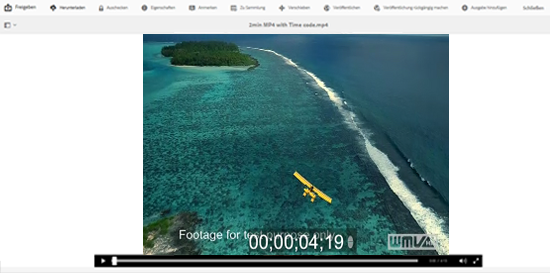
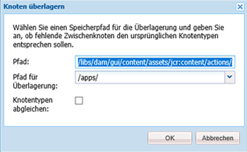
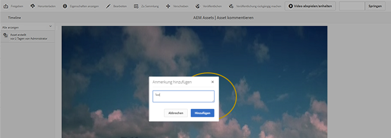
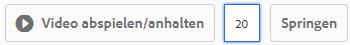
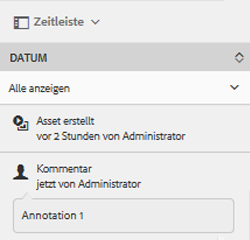

# Verwalten von Video-Assets    {#managing-video-assets}

Lernen Sie, wie Sie die Video-Assets in Adobe Experience Manager (AEM) Assets verwalten und bearbeiten. Wenn Sie eine Lizenz für die Nutzung von Dynamic Media besitzen, sehen Sie sich die [Dynamic Media-Videodokumentation](video.md) an.

## Hochladen und Anzeigen der Vorschau von Video-Assets {#uploading-and-previewing-video-assets}

AEM Assets generiert eine Vorschau für Video-Assets mit der Erweiterung MP4. Wenn das Format des Assets nicht MP4 ist, installieren Sie das FFmpeg-Paket, um eine Vorschau zu generieren. FFmpeg erstellt Videoausgabeformate vom Typ OGG und MP4. Sie können eine Vorschau dieser Wiedergaben in der Benutzeroberfläche von AEM Assets anzeigen.

1. Navigieren Sie im Ordner &quot;Digitale Assets&quot;oder in den Unterordnern zu dem Speicherort, an dem Sie digitale Assets hinzufügen möchten.
1. Um Assets hochzuladen, klicken oder tippen Sie in der Symbolleiste auf **[!UICONTROL Erstellen]** und wählen Sie dann **[!UICONTROL Dateien]** aus. Alternativ können Sie sie direkt in den Assets-Bereich ziehen. Weitere Informationen zum Hochladen finden Sie unter [Hochladen von Assets](managing-assets-touch-ui.md#uploading-assets).
1. Rufen Sie die Vorschau eines Videos in der Kartenansicht auf, indem Sie auf die Schaltfläche **[!UICONTROL Wiedergabe]** im Video-Asset tippen.

   

   Sie können Videos nur in der Ansicht **[!UICONTROL Karte]** anhalten oder wiedergeben. Die Schaltfläche Wiedergabe/Pause ist in der Ansicht **[!UICONTROL Liste]** nicht verfügbar.

1. Tippen Sie auf das Symbol **[!UICONTROL Bearbeiten]** auf der Karte, um eine Vorschau des Videos in der Ansicht **[!UICONTROL Details]** anzuzeigen.

   Das Video wird im systemeigenen Video-Player des Browsers wiedergegeben. Sie können das Video wiedergeben und anhalten, die Lautstärke regeln und in den Vollbildmodus wechseln.

   

## Konfiguration zum Hochladen von Assets, die größer als 2 GB sind {#configuration-to-upload-video-assets-that-are-larger-than-gb}

Standardmäßig gestattet der AEM Assets das Hochladen von Assets, die aufgrund einer Dateigrößenbeschränkung größer als 2 GB sind. Sie können diese Beschränkung aber umgehen, indem Sie CRXDE Lite aufrufen und im Verzeichnis `/apps` einen Knoten erstellen. Der Knoten muss denselben Knotennamen, dieselbe Verzeichnisstruktur und vergleichbare Knoteneigenschaften im Hinblick auf die Reihenfolge aufweisen.

Ändern Sie zusätzlich zur AEM Assets-Konfiguration die folgenden Konfigurationen, um große Assets hochzuladen:

* Erhöhen Sie die Ablaufzeit des Tokens. Siehe [!UICONTROL Adobe Granite CSRF Servlet] in der Web-Konsole unter `https://[aem_server]:[port]/system/console/configMgr`. Weitere Informationen finden Sie unter [CSRF-Schutz](/help/sites-developing/csrf-protection.md).
* Erhöhen Sie `receiveTimeout` in der Dispatcher-Konfiguration. Weitere Informationen finden Sie unter [Experience Manager Dispatcher-Konfiguration](https://experienceleague.adobe.com/docs/experience-manager-dispatcher/using/configuring/dispatcher-configuration.html#renders-options).

>[!NOTE]
>
>Die AEM Classic-Benutzeroberfläche hat keine Dateigrößenbeschränkung von zwei Gigabyte. Außerdem werden End-to-End-Workflows für große Videos nicht vollständig unterstützt.

Um eine höhere Dateigrößenbeschränkung zu konfigurieren, führen Sie die folgenden Schritte im Verzeichnis `/apps` aus.

1. Tippen Sie in AEM auf **[!UICONTROL Tools > Allgemein > CRXDE Lite]**.
1. Navigieren Sie auf der Seite **[!UICONTROL CRXDE Lite]** im Verzeichnisfenster auf der linken Seite zu `/libs/dam/gui/content/assets/jcr:content/actions/secondary/create/items/fileupload`. Um das Verzeichnisfenster anzuzeigen, tippen Sie auf das Symbol `>>` .
1. Tippen Sie in der Symbolleiste auf **[!UICONTROL Überlagerungsknoten]**. Wählen Sie alternativ **[!UICONTROL Überlagerungsknoten]** aus dem Kontextmenü aus.
1. Tippen Sie im Dialogfeld **[!UICONTROL Überlagerungsknoten]** auf **[!UICONTROL OK]**.

   

1. Aktualisieren Sie die Browser-Ansicht. Der Überlagerungsknoten `/apps/dam/gui/content/assets/jcr:content/actions/secondary/create/items/fileupload` ist ausgewählt.
1. Geben Sie auf der Registerkarte **[!UICONTROL Eigenschaften]** den gewünschten Wert in Byte ein, um die maximale Größe festzulegen. Geben Sie beispielsweise den Wert `32212254720` ein, um die Größenbeschränkung auf 30 GB zu erhöhen.

1. Tippen Sie in der Symbolleiste auf **[!UICONTROL Alle speichern]**.
1. Tippen Sie in AEM auf **[!UICONTROL Tools > Vorgänge > Web-Konsole]**.
1. Suchen Sie auf der Seite **[!UICONTROL Adobe Experience Manager Web Console Bundles]** unter der Spalte **[!UICONTROL Name]** der Tabelle nach **[!UICONTROL Adobe Granite Workflow External Process Job Handler]** und tippen Sie darauf.
1. Stellen Sie auf der Seite **[!UICONTROL Adobe Granite Workflow External Process Job Handler]** die Sekunden für die Felder **[!UICONTROL Default Timeout]** und **[!UICONTROL Max Timeout]** auf `18000` (fünf Stunden) ein.
1. Tippen Sie auf **[!UICONTROL Speichern]**.
1. Tippen Sie in AEM auf **[!UICONTROL Tools > Workflow > Modelle]**.
1. Wählen Sie auf der Seite **[!UICONTROL Workflow-Modelle]** die Option **[!UICONTROL Dynamic Media-Videokodierung]** und tippen Sie dann auf **[!UICONTROL Bearbeiten]**.
1. Doppeltippen Sie auf der Seite **[!UICONTROL Workflow]** auf die Komponente **[!UICONTROL Dynamic Media Video Service Process]** .
1. Erweitern Sie im Dialogfeld **[!UICONTROL Schritteigenschaften]** auf der Registerkarte **[!UICONTROL Allgemein]** die Option **[!UICONTROL Erweiterte Einstellungen]**.
1. Geben Sie im Feld **[!UICONTROL Timeout]** den Wert `18000` an und tippen Sie dann auf **[!UICONTROL OK]**, um zur Workflow-Seite **[!UICONTROL Dynamic Media-Videokodierung]** zurückzukehren.
1. Tippen Sie oben auf der Seite unter dem Seitentitel **[!UICONTROL Dynamic Media-Videokodierung]** auf **[!UICONTROL Speichern]**.

## Veröffentlichen von Video-Assets {#publishing-video-assets}

Nach dem Veröffentlichen Ihrer Video-Assets können diese über eine URL auf einer Web-Seite eingebunden oder eingebettet werden. Siehe [Veröffentlichen von Assets](publishing-dynamicmedia-assets.md).

## Hinzufügen von Anmerkungen zu Video-Assets {#annotating-video-assets}

1. Tippen Sie in der Konsole &quot;Assets&quot;auf das Symbol **[!UICONTROL Bearbeiten]** auf der Asset-Karte, um die Seite mit den Asset-Details anzuzeigen.
1. Tippen Sie auf das Symbol **[!UICONTROL Vorschau]** , um das Video abzuspielen.
1. Um das Video zu kommentieren, tippen Sie auf die Schaltfläche **[!UICONTROL Anmerken]**. Eine Anmerkung wird an diesem speziellen Zeitpunkt (Frame) im Video hinzugefügt.

   Beim Hinzufügen von Anmerkungen können Sie auf der Arbeitsfläche zeichnen und einen Kommentar zur Zeichnung aufnehmen. Kommentare werden automatisch in Adobe Experience Manager-Assets gespeichert.

   

   Um den Anmerkungsassistenten zu beenden, tippen Sie auf **[!UICONTROL Close]**.

1. Um zu einem bestimmten Punkt im Video zu springen, geben Sie die Zeit in Sekunden in das Textfeld ein und klicken Sie auf **[!UICONTROL Jump]**. Um beispielsweise die ersten Sekunden des Videos zu überspringen, geben Sie `20`20 in das Textfeld ein.

   

1. Klicken Sie auf eine Anmerkung, um sie in der Timeline anzuzeigen. Tippen Sie auf **[!UICONTROL Löschen]** , um die Anmerkung aus der Timeline zu entfernen.

   
