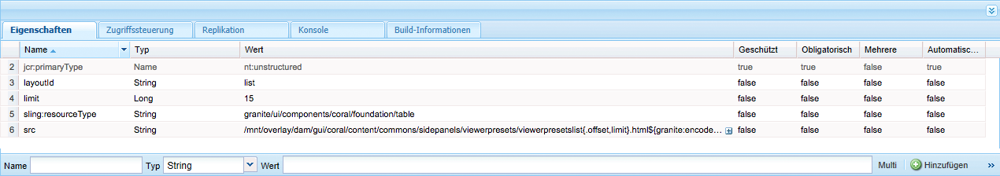

# Verwalten von Dynamic Media-Viewer-Vorgaben {#managing-viewer-presets}

Eine Dynamic Media-Viewer-Vorgabe ist eine Sammlung von Einstellungen, die bestimmen, wie Benutzer Rich-Media-Assets auf ihren Computerbildschirmen und Mobilgeräten anzeigen. Administratoren können Viewer-Vorgaben erstellen. Einstellungen sind für eine Vielzahl an Viewer-Konfigurationsoptionen verfügbar. Sie können beispielsweise die Viewer-Anzeigegröße oder das Zoomverhalten ändern.

Anweisungen zum Erstellen und Anpassen Ihrer eigenen HTML5-Viewer-Vorgaben finden Sie in der Adobe Dynamic Media *HTML5 Viewer SDK API Documentation*. Das SDK ist auf dem im SDK eingebetteten IS-Veröffentlichungsserver verfügbar. Jede Bibliotheksversion verfügt über eine eigene SDK-Dokumentation.

Pfad: `<scene7_domain>/s7sdk/<library_version>/docs/jsdocs/index.html`.\
Beispiel: 3.10 SDK: [https://s7d1.scene7.com/s7sdk/3.10/docs/jsdoc/index.html](https://s7d1.scene7.com/s7sdk/3.10/docs/jsdoc/index.html)

Weitere Informationen finden Sie im [Adobe Dynamic Media Viewers Reference Guide](https://experienceleague.adobe.com/docs/dynamic-media-developer-resources/library/home.html?lang=de).

In diesem Abschnitt wird beschrieben, wie Viewer-Vorgaben erstellt, bearbeitet und verwaltet werden. Sie können jederzeit bei der Vorschau eines Assets eine Viewer-Vorgabe darauf anwenden. Siehe [Anwenden von Viewer-Vorgaben](viewer-presets.md).

>[!NOTE]
>
>Denken Sie daran, dass die Bearbeitung von *vordefinierten, standardmäßig vorhandenen Viewer-Vorgaben* als Szenario nicht unterstützt wird. Wenn Sie versuchen, eine standardmäßig vorhandene Viewer-Vorgabe zu bearbeiten, werden Sie aufgefordert, die Viewer-Vorgabe unter einem neuen Namen zu speichern.

## Möglichkeit des Zugriffs auf die Tastatur im Viewer {#keyboard-accessibility-for-viewers}

Alle standardmäßigen Viewer unterstützen den Zugriff auf die Tastatur.

Weitere Informationen finden Sie unter [Tastaturzugriff und Navigation](https://experienceleague.adobe.com/docs/dynamic-media-developer-resources/library/c-keyboard-accessibility.html?lang=de).

## Verwalten von Dynamic Media-Viewer-Vorgaben {#managing-presets}

Sie können Viewer-Vorgaben in AEM hinzufügen, bearbeiten, löschen, veröffentlichen, Veröffentlichung rückgängig machen und eine Vorschau davon anzeigen, indem Sie auf **[!UICONTROL Tools > Assets > Viewer-Vorgaben]** tippen.

>[!NOTE]
>
>Standardmäßig zeigt das System 15 Viewer-Vorgaben, wenn Sie in einer Detailansicht eines Assets „Viewer“ auswählen. Sie können diese Grenze erhöhen. Siehe [Erhöhen der Anzahl angezeigter Viewer-Vorgaben](#increasing-the-number-of-viewer-presets-that-display).

## Viewer-Unterstützung für Web-Seiten mit responsivem Design {#viewer-support-for-responsive-designed-web-pages}

Unterschiedliche Web-Seiten haben unterschiedliche Anforderungen. Mitunter möchten Sie vielleicht, dass eine Web-Seite über einen Link verfügt, der den HTML5-Viewer in einem separaten Browser-Fenster öffnet. In anderen Fällen kann es aber auch erforderlich sein, den HTML5-Viewer direkt auf der Host-Seite einzubetten. In letzterem Fall kann die Web-Seite ein statisches Layout aufweisen. Oder es kann *responsive* sein und auf verschiedenen Geräten oder für verschiedene Browser-Fenstergrößen unterschiedlich angezeigt werden. Um all diese Anforderungen zu berücksichtigen, unterstützen sämtliche vordefinierten, standardmäßig vorhandenen HTML5-Viewer, die mit Dynamic Media bereitgestellt werden, sowohl statische als auch responsive Web-Seiten.

Weitere Informationen zum Einbetten responsiver Viewer auf Web-Seiten finden Sie unter [Bibliothek responsiver Bilder](https://experienceleague.adobe.com/docs/dynamic-media-developer-resources/image-serving-api/image-serving-api/responsive-static-image-library/c-about-responsive-static-image-library.html?lang=de) in der *Image Serving-API-Hilfe*.

>[!NOTE]
>
>Sie müssen zunächst alle standardmäßig vorhandenen Viewer veröffentlichen, um sie verwenden zu können.\
>Siehe [Veröffentlichen von Viewer-Vorgaben](#publishing-viewer-presets).

## Systemkompatibilität von Viewer-Vorgaben  {#viewer-preset-system-compatibility}

Alle standardmäßig vorhandenen Viewer-Vorgaben, die mit Dynamic Media bereitgestellt werden, sind mit den folgenden Systemen vollständig kompatibel:

* Desktops
* Apple iPhones
* Apple iPads
* Android-Smartphones
* Android-Tablets
* Video: Zusätzliche Unterstützung für die MP4-Wiedergabe für [Blackberry](https://developer.blackberry.com/devzone/develop/supported_media/bb_media_support_at_a_glance.html#kba1328730952678) und [Windows Phone 8](https://msdn.microsoft.com/library/windows/apps/ff462087%28v=vs.105%29.aspx).

### Rich-Media-Typen für Viewer-Vorgaben {#rich-media-types-for-viewer-presets}

Administratoren können bei der Erstellung von Viewer-Vorgaben die folgenden Rich-Media-Typen hinzufügen und anpassen.

| Rich-Media-Typen | Beschreibung |
|:---|:---|
| **Karussellset** | Hotspots, Imagemaps oder beide werden zu einer Serie von mindestens zwei Bildern hinzugefügt. Kunden können einen Bildschwenk nach links oder rechts durchführen und dann auf einen Hotspot auf einem Bild klicken, um zusätzliche Details aufzurufen oder direkt über eine Kategorie-, Start- oder Landingpage einer Website zu kaufen. |
| **Flyout-Zoom** | Zeigt ein zweites Bild des vergrößerten Bereichs neben dem Originalbild an. Dafür gibt es keine Steuerelemente. Benutzer verschieben die Auswahl auf den gewünschten Bereich. |
|  | Bei der Bestimmung der vollständigen Bandbreitenauslastung für diesen Viewer müssen Sie berücksichtigen, dass sowohl das Hauptbild als auch das Flyout-Bild im Viewer verarbeitet werden. Die Größe des Hauptbildes (Anzeigenbreite und -höhe) und der Zoomfaktor bestimmen die Größe des Flyout-Bildes. Sie müssen ein Gleichgewicht zwischen diesen beiden Werten schaffen, um zu verhindern, dass die Flyout-Datei zu groß wird: Wenn das Hauptbild sehr groß ist, reduzieren Sie den Zoomfaktor-Wert. (Die Flyout-Breite und Flyout-Höhe bestimmen die Größe des Flyout-Fensters, aber nicht die Größe des Flyout-Bildes, das im Viewer verarbeitet wird.) |
|  | Beispiel: Wenn das Hauptbild eine Größe von 350 x 350 Pixel und einen Zoomfaktor von 3 aufweist, hat das resultierende Flyout-Bild eine Größe von 1050 x 1050 Pixel. Wenn das Hauptbild eine Größe von 300 x 300 Pixel und einen Zoomfaktor von 4 aufweist, hat das Flyout-Bild eine Größe von 1200 x 1200 Pixel. Abhängig von der JPEG-Qualitätseinstellung (empfohlene Einstellungen liegen zwischen 80 und 90) können Sie die Dateigröße erheblich reduzieren. Als Zoomfaktor wird ein Wert zwischen 2,5 und 4 empfohlen, je nach Größe des Hauptbildes. |
| **Inline-Zoom** | Zeigt ein Bild des hereingezoomten Bereichs im ursprünglichen Viewer an. Es stehen keinerlei Steuerelemente zur Verfügung. Benutzer verschieben vielmehr die Auswahl über den Bereich, der angezeigt werden soll. |
| **Bildset** | Im Bildset-Viewer können Benutzer unterschiedliche Ansichten oder Farbvariationen eines Elements sehen, indem sie auf eine Miniaturansicht klicken. Dieser Viewer bietet auch Zoomtools, mit denen Bilder genauer untersucht werden können. |
| **Interaktives Bild** | Hotspots werden zu Teilmengen eines Bildes hinzugefügt, auf die ein Kunde anschließend klicken kann, um zusätzliche Informationen zu erhalten oder den Kauf direkt über die Kategorie einer Website, über die Startseite oder Landingpages vorzunehmen. |
| **Interaktives Video** | Miniaturansichten werden Zeitleistensegmenten in einem Video hinzugefügt, auf die ein Kunde anschließend klicken kann, um zusätzliche Informationen zu erhalten oder den Kauf direkt über die Kategorie einer Website, über die Startseite oder Landingpages vorzunehmen. |
| **Gemischte Medien** | Zeigt unterschiedliche Medientypen in einem Viewer an. Dort können Sie Rotationssets, Bildsets, Bilder und Videos aufnehmen. |
| **Panoramabild** | Die Viewer für Panoramabilder und PanoramicVR geben Kugelpanoramen wieder, um Benutzern ein 360°-Betrachtererlebnis eines Zimmers, einer Immobilie, eines Orts oder einer Landschaft zu bieten. |
|  | Damit ein hochgeladenes Bild als Kugelpanorama gilt, muss mindestens eine der beiden folgenden Eigenschaften zutreffen: <ul><li>Ein Seitenverhältnis von 2:1.</li><li>Mit den Keywords equirectangular oder spherical und panorama oder spherical und panoramic als Tags versehen. Weitere Informationen finden Sie unter [Verwenden von Tags](../sites-authoring/tags.md).</li></ul> |
|  | Die Kriterien für das Seitenverhältnis sowie die Keywords gelten für Panorama-Assets für die Asset-Detailseite und die WCM-Komponente „Panoramamedien“. |
|  | Wichtig: Dieser Viewer ist nur im Scene7-Modus von Dynamic Media verfügbar. |
| **Rotationsset** | Stellt mehrere Ansichten eines Bildes bereit, sodass Benutzer den Gegenstand drehen können, um ihn von allen Seiten zu betrachten. |
| **Video** | Wiedergeben von Videos unter Verwendung des progressiven oder adaptiven Bitraten-Streamings. Beim Streaming mit adaptiver Bitrate wird eine automatische Geräte- und Brandbreitenerkennung durchgeführt, um Videos mit der richtigen Qualität und im richtigen Format bereitzustellen. |
| **Vertikaler Zoom** | Mit dem Viewer für vertikalen Zoom können Sie das Betrachtererlebnis für Produktbilder optimieren, um Ihren Benutzern die bestmögliche Darstellung eines Produktes zu bieten. Die vertikale Positionierung von Farbfeldern: <ul><li>Stellt sicher, dass die Farbfelder über der Kante liegen. Bei horizontalen Farbfeldern waren die Farbfelder je nach Bildschirmgröße des Benutzers auf dem Desktop ’ erst sichtbar, wenn der Benutzer einen Bildlauf auf der Seite nach unten ausgeführt hat. Wenn die Farbfelder vertikal im Viewer platziert werden, sind sie unabhängig von der Bildschirmgröße des Benutzers sichtbar.</li><li>Maximiert die Größe des Hauptbildes. Bei horizontalen Farbfeldern ist es erforderlich, Platz auf der Seite zu lassen, um sicherzustellen, dass sie sichtbar sind. Diese Positionierung verringerte die mögliche Größe des Hauptbildes. Bei einer vertikalen Farbfeld-Platzierung ist es jedoch nicht notwendig, diesen Platz freizulassen. Somit können Sie die Größe des Hauptbildes maximieren.</li></ul> |
| **Zoom** | Damit können Benutzer den Bereich durch Klicken ein- und auszoomen. Benutzer können auf Steuerelemente klicken, um ein- und auszuzoomen und das Bild auf seine Standardgröße zurückzusetzen. |

## Liste der standardmäßig vorhandenen Viewer-Vorgaben {#list-of-out-of-the-box-viewer-presets}

In der folgenden Tabelle sind alle vordefinierten, standardmäßig vorhandenen Viewer-Vorgaben aufgeführt, die in Dynamic Media enthalten sind.

Siehe auch [Live-Demos](https://landing.adobe.com/en/na/dynamic-media/ctir-2755/live-demos.html).

Informationen zu unterstützten Webbrowsern und Betriebssystemversionen für Viewer finden Sie in den Viewer-Versionshinweisen.

Siehe *Viewer-Versionshinweise* im Inhaltsverzeichnis des [Viewer-Referenzhandbuchs](https://experienceleague.adobe.com/docs/dynamic-media-developer-resources/library/home.html).

>[!NOTE]
>
>Alle standardmäßig vorhandenen Viewer-Vorgaben in Dynamic Media sind bereits aktiviert. Sie müssen sie allerdings noch veröffentlichen.\
>Siehe [Veröffentlichen von Viewer-Vorgaben](#publishing-viewer-presets).
>
>Alle neuen Viewer-Vorgaben, die Sie erstellen und hinzufügen, müssen sowohl *aktiviert als auch* veröffentlicht werden.\
>Siehe [Aktivieren oder Deaktivieren von Viewer-Vorgaben](#activating-or-deactivating-viewer-presets) und [Veröffentlichen von Viewer-Vorgaben](#publishing-viewer-presets).

| Viewer-Vorgabentitel | Typ | CSS-Dateiname |
|:---|:---|:---|
| Carousel_Dotted_dark | Carousel_Set | html5_carouselviewer_dotted_dark.css |
| Carousel_Dotted_light | Karussell_Set | html5_carouselviewer_dotted_light.css |
| Carousel_Numeric_dark | Karussell_Set | html5_carouselviewer_numeric_dark.css |
| Carousel_Numeric_light | Karussell_Set | html5_carouselviewer_numeric_light.css |
| Flyout | Flyout_Zoom | html5_flyoutviewer.css |
| ImageSet_dark | Bildset | html5_zoomviewer_dark.css |
| ImageSet_light | Bildset | html5_zoomviewer_light.css |
| InlineMixedMedia_dark | Mixed_Media | html5_inlinemixedmediaviewer_dark.css |
| InlineMixedMedia_light | Gemischte Medien | html5_inlinemixedmediaviewer_light.css  |
| InlineZoom | Flyout_Zoom | html5_inlinezoomviewer.css |
| MixedMedia_dark | Gemischte Medien | html5_mixedmediaviewer_dark.css |
| MixedMedia_light | Gemischte Medien | html5_mixedmediaviewer_light.css |
| PanoramicImage | Panoramic_Image | html5_panoramicimage.css |
| PanoramicImageVR | panoramic_image | html5_panoramicimage.css |
| Shoppable_Banner | Interactive_Image | html5_interactiveimage.css |
| Shoppable_Video_dark | Interactive_Video | html5_interactivevideoviewer_dark.css |
| Shoppable_Video_light | Interactive_Video | html5_interactivevideovewer_light.css |
| SpinSet_dark | Spin_Set | html5_spinviewer_dark.css |
| SpinSet_light | Rotationsset | html5_spinviewer_light.css |
| Video (einschließlich Unterstützung für Untertitel) | Video | html5_videoviewer.css |
| Video_social (einschließlich Unterstützung für Untertitel und soziale Medien) | Video | html5_videoviewersocial.css |
| Zoom_dark | Zoom | html5_basiczoomviewer_dark.css |
| Zoom_light | Zoom | html5_basiczoomviewer_light.css |
| ZoomVertical_dark | Vertical_Zoom | html5_zoomverticalviewer_dark.css |
| ZoomVertical_light | Vertikaler_Zoom | html5_zoomverticalviewer_light.css |

### Matrix unterstützter Mobile Viewer-Gesten {#supported-mobile-viewers-gestures-matrix}

In der folgenden Tabelle werden die Mobile Viewer-Gesten aufgeführt, die auf iOS-, Android 2.x- und Android 3.x-Geräten unterstützt werden.

| Geste | Flyout-Zoom | Zoom | Drehung |
|---|---|---|---|
| **Ziehen** | Schwenkt | Schwenkt | Schwenkt |
| **Tippen** | Blendet Flyout-Fenster ein | Blendet die Benutzeroberfläche ein oder aus | Blendet die Benutzeroberfläche ein oder aus |
| **Doppeltippen** | Trifft nicht zu | Zoomt ein oder setzt zurück | Zoomt ein oder setzt zurück |
| **Aufziehen** | Trifft nicht zu | Zoomt ein (nur iOS und Android 3x) | Zoomt ein (nur iOS und Android 3x) |
| **Zuziehen** | Trifft nicht zu | Zoomt aus (nur iOS und Android 3x) | Zoomt aus (nur iOS und Android 3x) |
| **Streichen** | Scrollt Farbfeldleiste | Scrollt Bilder | Dreht |
| **Schnippen** | Scrollt Farbfeldleiste | Scrollt Bilder | Dreht |

## Erhöhen der Anzahl angezeigter Dynamic Media-Viewer-Vorgaben {#increasing-the-number-of-viewer-presets-that-display}

AEM zeigt verschiedene Viewer-Vorgaben an, wenn Sie ein Asset unter **[!UICONTROL Detailansicht > Viewer]** anzeigen. Sie können die Anzahl der angezeigten Viewer erhöhen oder verringern.

**So erhöhen Sie die Anzahl der angezeigten** Dynamic Media-Viewer-Vorgaben:

1. Navigieren Sie zu **[!UICONTROL CRXDE Lite]** ([http://localhost:4502/crx/de](http://localhost:4502/crx/de)).
1. Navigieren Sie zum Knoten mit der Viewer-Vorgabenliste unter `/libs/dam/gui/coral/content/commons/sidepanels/viewerpresets/viewerpresetslist`

   

1. Ändern Sie für die Eigenschaft **[!UICONTROL limit]** den **[!UICONTROL Wert]**, für den standardmäßig 15 festgelegt ist, in einen höheren Wert.
1. Navigieren Sie zur Datenquelle der Viewer-Vorgabe unter `/libs/dam/gui/coral/content/commons/sidepanels/viewerpresets/viewerpresetslist/datasource`

   

1. Ändern Sie in der Eigenschaft **[!UICONTROL limit]** die Zahl auf die gewünschte Zahl, z. B. `{empty requestPathInfo.selectors[1] ? "20" : requestPathInfo.selectors[1]}`
1. Tippen Sie auf **[!UICONTROL Alle speichern]**.

## Erstellen einer neuen Dynamic Media-Viewer-Vorgabe {#creating-a-new-viewer-preset}

Durch Erstellen von Viewer-Vorgaben können Sie verschiedene Einstellungen anwenden, um Assets anzuzeigen und mit diesen zu interagieren. Sie müssen jedoch keine neuen Viewer-Vorgaben erstellen. Wenn Sie dies bevorzugen, können Sie auch die bereits standardmäßig in AEM Assets verfügbaren Viewer-Vorgaben verwenden.

Wenn Sie eine neue Viewer-Vorgabe erstellen möchten, wird nach deren Speicherung der Viewer-Status auf der Seite „Viewer-Vorgaben“ automatisch aktiviert (auf **Ein** gesetzt). **** Dieser Status bedeutet, dass er in der Komponente **[!UICONTROL Dynamic Media]** und in der Komponente **[!UICONTROL Interaktive Medien]** sowie bei jeder Vorschau eines Bildes oder Videos sichtbar ist.

Bestimmte Viewer-Vorgaben weisen exklusive Einstellungen auf, die die Nutzung und das Gesamtverhalten des Viewers beeinflussen können. Je nach der von Ihnen erstellten Viewer-Vorgabe sollten Sie diese besonderen Hinweise berücksichtigen.

Siehe [Besondere Hinweise zum Erstellen von Vorgaben für interaktive Viewer](#special-considerations-for-creating-an-interactive-viewer-preset).

Siehe [Besondere Hinweise zum Erstellen von Viewer-Vorgaben für Karussellbanner](#special-considerations-for-creating-a-carousel-banner-viewer-preset).

**So erstellen Sie eine neue Dynamic Media-Viewer-Vorgabe**:

1. Tippen Sie in der linken oberen Ecke von AEM auf das AEM-Logo und tippen Sie dann in der linken Leiste auf **[!UICONTROL Tools > Assets > Viewer-Vorgaben]**.

   

1. Tippen Sie auf der Seite **[!UICONTROL Viewer-Vorgaben]** in der Symbolleiste auf **[!UICONTROL Erstellen]**.
1. Geben Sie im Dialogfeld **[!UICONTROL Neue Viewer-Vorgabe]** in das Feld **[!UICONTROL Vorgabename]** den Namen der neuen Vorgabe ein. Achten Sie darauf, einen geeigneten Namen festzulegen, da dieser nach dem Tippen auf **[!UICONTROL Erstellen]** nicht mehr geändert werden kann.

   Wenn Sie die Vorgabe später in diesen Schritten speichern, wird der Name auf der Seite &quot;Viewer-Vorgaben&quot;unter der Spaltenüberschrift **[!UICONTROL Vorgabentitel]** angezeigt.

1. Wählen Sie im Dropdown-Menü **[!UICONTROL Rich-Media-Typ]** den Typ der zu erstellenden Viewer-Vorgabe aus und tippen Sie dann oben rechts auf der Seite auf **[!UICONTROL Erstellen]**.

   Siehe [Rich-Media-Typen für Viewer-Vorgaben](#rich-media-types-for-viewer-presets).

1. Tippen Sie auf der Seite **Viewer-Vorgabe bearbeiten** auf die Registerkarte **[!UICONTROL Erscheinungsbild]** .
1. Führen Sie einen der folgenden Schritte aus:

   * Wählen Sie aus dem Pulldown-Menü **[!UICONTROL Ausgewählter Typ]** eine Komponente aus, deren visuelles Design angepasst werden soll. Alternativ können Sie auf ein beliebiges visuelles Element im Viewer tippen, um es zur Konfiguration auszuwählen.

      Der Visual Editor zeigt Ihnen, wie sich eine bestimmte Eigenschaft auf einen Stil auswirkt. Legen Sie eine beliebige Eigenschaft fest bzw. passen Sie diese an, um sofort anhand des Beispiels auf der linken Seite des Editors zu sehen, wie sich dies auf den Viewer auswirkt.

      Die CSS-Stileigenschaften für jeden Viewer-Vorgabetyp werden im Hilfethema Anpassen des *&lt;Viewer-Name>*-Viewers im [Viewer-Referenzhandbuch](https://experienceleague.adobe.com/docs/dynamic-media-developer-resources/library/home.html) beschrieben.

      Wenn Sie z. B. eine Viewer-Vorgabe vom Typ `Mixed_Media` erstellen, finden Sie im Thema zum [Anpassen von Viewern für gemischte Medien](https://experienceleague.adobe.com/docs/dynamic-media-developer-resources/library/viewers-aem-assets-dmc/mixed-media/customing-mixed-media/c-html5-mixedmedia-viewer-customizingviewer.html?lang=de) eine Aufstellung und Beschreibung jeder Eigenschaft.

   * Wenn Stileinstellungen in einer separaten CSS-Datei definiert sind, können Sie die CSS-Datei in AEM Assets hochladen. Tippen Sie auf **[!UICONTROL CSS importieren]** unter dem Pulldown-Menü **[!UICONTROL Ausgewählter Typ]** (ggf. müssen Sie hierzu einen Bildlauf im Visual Editor durchführen), um nach der hochgeladenen CSS-Datei zu suchen und diese mit der Viewer-Vorgabe zu verknüpfen.

      Beim Importieren einer CSS-Datei überprüft der Visual Editor, ob CSS die korrekten Viewer-Markierungen verwendet. Wenn Sie etwa einen Zoom-Viewer erstellen, müssen alle CSS-Regeln, die Sie importieren, mit dem zugehörigen Viewer-Klassennamen `.s7mixedmediaviewer` (definiert in einem übergeordneten Viewer-Element) festgelegt werden.

      Sie können beliebige, selbst definierte CSS-Dateien importieren, solange diese die CSS-Markierungen für den jeweiligen Viewer ordnungsgemäß definieren. (CSS-Markierungen werden im Hilfethema „Anpassen des *&lt;Viewer-Name>*-Viewers“ im [Viewers-Referenzhandbuch](https://experienceleague.adobe.com/docs/dynamic-media-developer-resources/library/home.html) erläutert. Wenn Sie beispielsweise mehr über CSS-Markierungen für den Zoom-Viewer erfahren möchten, lesen Sie den Abschnitt [Anpassen des Zoom-Viewers](https://experienceleague.adobe.com/docs/dynamic-media-developer-resources/library/viewers-aem-assets-dmc/zoom/customizing-zoom/c-html5-20-zoom-viewer-customizingviewer.html?lang=de).) Es ist jedoch möglich, dass der Visual Editor nicht alle CSS-Werte versteht. In diesem Fall versucht der Visual Editor, die Fehler zu überschreiben, damit CSS nach wie vor verwendet werden kann.
   >[!NOTE]
   >
   >Wenn Sie CSS lieber direkt im Rohformat bearbeiten möchten, tippen Sie im Pulldown-Menü „Ausgewählter Typ“ auf **[!UICONTROL CSS ein-/ausblenden]** (Sie müssen ggf. im Visual Editor nach oben blättern, um diese Option anzuzeigen).****
   >
   >Wenn Sie eine Eigenschaft direkt in CSS ändern, können Sie wie im Visual Editor sofort sehen, wie sich dies auf das Viewer-Beispiel auswirkt. Außerdem wird zur gleichen Zeit genau diese Eigenschaft automatisch im Visual Editor aktualisiert. Daher können Sie entweder den CSS-Editor, den Visual Editor oder beide abwechselnd verwenden.

   >[!NOTE]
   >
   >Für Schaltflächengrafiken wählen Sie das 2x-Bild aus und laden Sie Grafiken mit hoher Auflösung hoch. Beim Arbeiten mit interaktiven Bildern und Bannern mit Einkaufsfunktion können Sie auch aus verschiedenen standardmäßig vorhandenen Hotspot-Schaltflächen wählen.

1. (Optional) Tippen Sie oben auf der Seite **[!UICONTROL Viewer-Vorgabe bearbeiten]** auf **[!UICONTROL Desktop]**, **[!UICONTROL Tablet]** oder **[!UICONTROL Telefon]** , um visuelle Stile für verschiedene Geräte- und Bildschirmtypen eindeutig zu definieren.
1. Tippen Sie auf der Seite **[!UICONTROL Viewer-Vorgabe bearbeiten]** auf die Registerkarte **Verhalten** . Sie können auch auf ein beliebiges visuelles Element im Viewer tippen oder klicken, um es zum Konfigurieren auszuwählen.
1. Wählen Sie im Pulldown-Menü **[!UICONTROL Ausgewählter Typ]** eine Komponente aus, deren Verhalten Sie ändern möchten.

   Viele Komponenten im Visual Editor sind mit einer detaillierten Beschreibung verknüpft. Diese Beschreibungen werden in blauen Feldern angezeigt, wenn Sie eine Komponente zum Anzeigen der mit ihr verknüpften Parameter einblenden.

   Einige Viewer-Typen verfügen über Komponenten, mit denen Sie Befehle zum Image Serving in einem **IS-Befehl**-Textfeld angeben können. Eine Liste der verfügbaren Befehle finden Sie in der [Image Serving API-Referenz](https://experienceleague.adobe.com/docs/dynamic-media-developer-resources/image-serving-api/image-serving-api/c-is-home.html?lang=de).

   >[!NOTE]
   >
   >**Bei Nutzung eines Touch-Geräts, etwa eines Smartphones oder Tablets:**
   >
   >Nachdem Sie einen Wert in das Textfeld eingegeben haben, tippen Sie auf eine andere Stelle in der Benutzeroberfläche, um die Änderung weiterzuleiten und die virtuelle Tastatur zu schließen. Wenn Sie auf die **[!UICONTROL Eingabetaste]** tippen, wird keine Aktion ausgeführt.

1. Tippen Sie oben rechts auf **[!UICONTROL Speichern]**.
1. Veröffentlichen Sie die neue Viewer-Vorgabe. Sie müssen die Vorgabe veröffentlichen, um sie auf Ihrer Website verwenden zu können.

   Siehe [Veröffentlichen von Viewer-Vorgaben](#publishing-viewer-presets).

## Besondere Hinweise zum Erstellen von Viewer-Vorgaben für interaktive Videos {#special-considerations-for-creating-an-interactive-viewer-preset}

**Wissenswertes über Anzeigemodi für Bildminiaturansichten im Anzeigefeld**

Wenn Sie eine Viewer-Vorgabe für interaktive Videos erstellen oder bearbeiten, können Sie festlegen, welche Einstellung **[!UICONTROL Anzeigemodus]** verwendet werden soll, wenn Sie `InteractiveSwatches` aus dem Pulldown-Menü **[!UICONTROL Ausgewählte Komponente]** unter der Registerkarte **[!UICONTROL Verhalten]** auswählen. Der von Ihnen gewählte Anzeigemodus beeinflusst, wie und wann Miniaturansichten während der Videowiedergabe angezeigt werden.  Sie können entweder einen `segment`Anzeigemodus (Standard) oder einen `continuous`Anzeigemodus wählen.

| Anzeigemodus | Beschreibung |
|---|---|
| [!UICONTROL Segment] |  Segmentiert den standardmäßigen Anzeigemodus für die vordefinierten Viewer-Vorgaben für interaktive Videos Shoppable_Video_light und Shoppable_Video_dark sowie alle Viewer-Vorgaben für interaktive Videos, die Sie selbst erstellen. |
|  | Wenn einem Videosegment weniger Miniaturansichten als sichtbare Spots im Anzeigefeld zugewiesen sind, werden in diesem Modus Miniaturansichten von den nächsten oder vorhergehenden Untersegmenten nicht herangezogen, um leere Spots im Feld aufzufüllen. So bleibt die Anzeige von einem bestimmten Videosegment zugewiesenen Mustern erhalten. |
| [!UICONTROL Kontinuierlich] | Wenn im Anzeigemodus [!UICONTROL Fortlaufend] die Anzahl der Miniaturansichten in einem Segment kleiner ist als die Anzahl, die im Bedienfeld sichtbar ist, schließt der Viewer automatisch die Anzeige von Miniaturansichten aus dem nächsten Segment oder dem vorherigen Segment ein, falls die letzte Miniaturansicht angezeigt wird. |

**Wissenswertes über den automatischen Bildlauf im Viewer für interaktive Videos** 

Das automatische Bildlaufverhalten von Miniaturansichten der Viewer-Funktionen für interaktive Videos erfolgt unabhängig vom gewählten Anzeigemodus.

Wenn Sie eine interaktive Video-Viewer-Vorgabe erstellen oder bearbeiten, greifen Sie auf **[!UICONTROL Auto Scroll]** auf der Registerkarte **[!UICONTROL Verhalten]** zu. Tippen Sie auf der Registerkarte „Verhalten“ im Dropdown-Menü **[!UICONTROL Ausgewählte Komponenten]** auf **[!UICONTROL InteractiveSwatches]**. Das Kontrollkästchen **[!UICONTROL Automatischer Bildlauf]** wird unter dem Textfeld IS-Befehl aufgeführt.

Wenn Sie in der Viewer-Vorgabe bei der Videowiedergabe durch den Benutzer die Option **[!UICONTROL Automatischer Bildlauf]** deaktivieren (das Kontrollkästchen abwählen), wird im Feld während der gesamten Videodauer nur das erste Miniaturbild angezeigt. Allerdings kann der Benutzer ggf. mithilfe der Pfeilsymbole nach oben und nach unten einen manuellen Bildlauf durch die Miniaturansichten durchführen.

Wenn Sie während der Videowiedergabe die Option **[!UICONTROL Automatischer Bildlauf]** in der Viewer-Vorgabe aktivieren (auswählen), werden die Miniaturbilder, die einem Videosegment zugewiesen sind, zu Beginn eines Segments in die Ansicht verschoben. Es gibt jedoch Fälle, in denen bestimmte Miniaturansichten innerhalb eines Segments doppelt so lange angezeigt werden wie andere Miniaturansichten vor oder nach dem Segment. Dieses Verhalten tritt auf, weil die Anzahl der Miniaturansichten in einem Segment größer ist als die Zahl, die im Bedienfeld sichtbar ist, und diese nicht gleichmäßig teilbar ist.

Gehen wir zu Illustrationszwecken von einem 30 Sekunden langen Videosegment aus. Insgesamt gibt es neun Miniaturansichten, die im Laufe dieser 30 Sekunden angezeigt werden. Die Größe Ihres Browsers wird dergestalt geändert, dass vier verfügbare Miniaturpositionen im Anzeigefeld vorliegen. Das 30-sekündige Videozeitsegment ist in drei Untersegmente unterteilt. In der folgenden Tabelle wird aufgeschlüsselt, welche Miniaturansichten für ein bestimmtes Zeituntersegment angezeigt werden:

| **Video-Untersegment** | **Zeit des Untersegments in Sekunden** | **Im Feld sichtbare Miniaturen** |
|---|---|---|
| 1 | 0–10 | 1, 2, 3, 4 |
| 2 | 10-20 | 4, 5, 6, 7 |
| 3 | 20-30 | 6, 7, 8, 9 |

Das Videountersegment 3 wird nicht über die Miniaturansichten hinweg erweitert, die ihm zugewiesen sind. Beachten Sie, dass die Miniaturansichten 4, 6 und 7 im Anzeigefeld doppelt so lang sichtbar sind wie die anderen.

Die durch den Viewer zum Bestimmen der Anzahl der im seitlichen Bedienfeld angezeigten Miniaturansichten verwendete Logik basiert wie folgt auf der Anzahl der verfügbaren Positionen:

* Anzahl der Untersegmente = Aufrundung auf das nächste Untersegment (Anzahl der Miniaturansichten: Anzahl der sichtbaren Spots im Miniaturansichtsfeld, auf Grundlage der Browser-Fenstergröße)

   Unter Verwendung des Beispiels in der obigen Tabelle ergibt 9 Miniaturansichten: 4 Slots = 2,25, was die Viewer-Logik auf 3 Untersegmente aufrundet.

* Anzahl der Miniaturen = Aufrundung auf die nächste Miniaturansicht (Anzahl der Miniaturansichten: Anzahl der Videountersegmente)

   Unter Verwendung des Beispiels in der obigen Tabelle ergibt 9 Miniaturansichten: 3 Videountersegmente = 3 Miniaturansichten.

* Dauer des Untersegments = gesamte Videodauer: Anzahl der Videountersegmente

   Unter Verwendung des Beispiels in der obigen Tabelle ergibt 30 Sekunden: 3 Segmente = 10 Sekunden anhaltende Anzeige jedes Segments.

### Besondere Hinweise zum Erstellen einer Viewer-Vorgabe für Karussellbanner {#special-considerations-for-creating-a-carousel-banner-viewer-preset}

Beim Erstellen von Viewer-Vorgaben für Karussellbanner kann der Stil von Hotspots wie folgt geändert werden:

|  | **Beschreibung** | **Aktionen** |
|---|---|---|
| **Hotspot-Symbol** | Ändern des für Hotspots verwendeten Symbols | Um das Bild des Hotspot-Symbols zu ändern, tippen Sie auf der Registerkarte **[!UICONTROL Erscheinungsbild]** in **[!UICONTROL Ausgewählte Komponente]** auf **[!UICONTROL ImageMapEffect]**. Wählen Sie unter **[!UICONTROL Symbol]** die Option **[!UICONTROL Hintergrund]** und navigieren Sie im Feld **[!UICONTROL Bild]** zum gewünschten Hintergrundbild. |

## Aktivieren oder Deaktivieren von Dynamic Media-Viewer-Vorgaben {#activating-or-deactivating-viewer-presets}

Welche Viewer-Vorgaben in der Benutzeroberfläche verfügbar sind, hängt davon ab, welche Vorgaben im Autorenmodus aktiviert wurden. Standardmäßig ist eine Viewer-Vorgabe *On*, nachdem Sie sie erstellt haben. Wenn Sie die Vorgabe deaktivieren möchten, wird sie nicht im Autorenmodus angezeigt. Wenn die Vorgabe veröffentlicht wird. Sie wird immer veröffentlicht, unabhängig davon, ob sie aktiviert oder deaktiviert wurde. Sie können Viewer-Vorgaben deaktivieren, wenn die Liste zu schwierig wird oder wenn keine Viewer-Vorgabe zur Verfügung gestellt werden soll.

**So aktivieren oder deaktivieren Sie Dynamic Media-Viewer-Vorgaben**:

1. Tippen Sie in der linken oberen Ecke von AEM auf das AEM-Logo und tippen Sie dann in der linken Leiste auf **[!UICONTROL Tools > Assets > Viewer-Vorgaben]**.
1. Tippen Sie auf der Seite **[!UICONTROL Viewer-Vorgabe]** unter der Spaltenüberschrift **[!UICONTROL Status]** auf den Umschalter zum Aktivieren oder Deaktivieren einer Viewer-Vorgabe.

   Bei aktivierten Viewer-Vorgaben wird die Umschaltfläche rechts in einem blauen Feld angezeigt; bei deaktivierten Viewer-Vorgaben wird die Umschaltfläche links in einem hellgrauen Feld angezeigt.

## Veröffentlichen von Dynamic Media-Viewer-Vorgaben {#publishing-viewer-presets}

Wird der Status einer Viewer-Vorgabe aktiviert (oder *Ein*), bedeutet dies, dass sie in der Dynamic Media-Komponente, der interaktiven Medienkomponente und immer dann sichtbar ist, wenn Sie ein Asset anzeigen.

Um jedoch ein Asset mit einer Viewer-Vorgabe bereitzustellen, muss die Viewer-Vorgabe auch veröffentlicht werden. Alle Viewer-Vorgaben müssen aktiviert *und* veröffentlicht werden, um die URL oder den Einbettungs-Code für ein Asset zu beziehen. Sie müssen alle im Lieferumfang von Dynamic Media enthaltenen sofort einsetzbaren Viewer-Voreinstellungen aktivieren und veröffentlichen. Benutzerdefinierte Viewer-Voreinstellungen, die Sie erstellen und hinzufügen, werden automatisch aktiviert, müssen aber auch veröffentlicht werden.

Siehe [Aktivieren oder Deaktivieren von Viewer-Vorgaben](#activating-or-deactivating-viewer-presets).

Siehe auch [Anzeigen von Assets in einer Vorschau](previewing-assets.md).

**So veröffentlichen Sie Dynamic Media-Viewer-Vorgaben**:

1. Tippen Sie in der linken oberen Ecke von AEM auf das AEM-Logo und tippen Sie dann in der linken Leiste auf **[!UICONTROL Tools > Assets > Viewer-Vorgaben]**.
1. Wählen Sie eine oder mehrere Viewer-Vorgaben zum Veröffentlichen aus.
1. Tippen Sie auf der Symbolleiste auf das Symbol **[!UICONTROL Veröffentlichen]**.

## Sortieren von Dynamic Media-Viewer-Vorgaben {#sorting-viewer-presets}

**So sortieren Sie Dynamic Media-Viewer-Vorgaben**:

1. Tippen Sie in der linken oberen Ecke von AEM auf das AEM-Logo und tippen Sie dann in der linken Leiste auf **Tools** (Hammersymbol) **[!UICONTROL > Assets > Viewer-Vorgaben]**.
1. Klicken Sie auf **[!UICONTROL Vorgabentitel]**, **[!UICONTROL Typ]**, **[!UICONTROL Veröffentlicht]** oder **[!UICONTROL Status]**, um nach dieser Spaltenüberschrift zu sortieren. Klicken Sie beispielsweise auf **[!UICONTROL Typ]**, um die Viewer-Vorgabentypen in alphabetischer oder in umgekehrt alphabetischer Reihenfolge zu sortieren.

## Bearbeiten von Dynamic Media-Viewer-Vorgaben {#editing-viewer-presets}

Denken Sie daran, dass die Bearbeitung von *vordefinierten, standardmäßig vorhandenen Viewer-Vorgaben* als Szenario nicht unterstützt wird. Wenn Sie eine standardmäßig vorhandene Viewer-Vorgabe bearbeiten, werden Sie aufgefordert, die Viewer-Vorgabe unter einem neuen Namen zu speichern.

**So bearbeiten Sie Dynamic Media-Viewer-Vorgaben**:

1. Tippen Sie in der linken oberen Ecke von AEM auf das AEM-Logo und tippen Sie dann in der linken Leiste auf **[!UICONTROL Tools > Assets > Viewer-Vorgaben]**.
1. Wählen Sie eine Vorgabe aus, indem Sie das Kontrollkästchen links neben dem Viewer-Vorgabentitel aktivieren.
1. Tippen Sie in der Symbolleiste auf **[!UICONTROL Bearbeiten]**.
1. Nehmen Sie auf der Seite **[!UICONTROL Viewer-Vorgabe bearbeiten]** die gewünschten Änderungen an der Viewer-Vorgabe vor. 
1. Führen Sie einen der folgenden Schritte aus:

   * Tippen Sie auf **[!UICONTROL Speichern]**, um Ihre Änderungen zu speichern und zur Seite „Viewer-Vorgabe“ zurückzukehren.****
   * Tippen Sie auf **[!UICONTROL Abbrechen]**, um alle von Ihnen vorgenommenen Änderungen rückgängig zu machen und zur Seite „Viewer-Vorgaben“ zurückzukehren.****

## Löschen benutzerdefinierter Dynamic Media-Viewer-Vorgaben {#deleting-custom-viewer-presets}

Sie können Viewer-Vorgaben löschen, die Sie erstellt und Dynamic Media hinzugefügt haben.

**So löschen Sie benutzerdefinierte Dynamic Media-Viewer-Vorgaben**:

1. Tippen Sie in der linken oberen Ecke von AEM auf das AEM-Logo und tippen Sie dann in der linken Leiste auf **[!UICONTROL Tools > Assets > Viewer-Vorgaben]**.
1. Markieren Sie auf der Seite **[!UICONTROL Viewer-Vorgaben]** einen **[!UICONTROL Vorgabentitel]** und tippen Sie dann auf das Symbol **[!UICONTROL Papierkorb]**.
1. Tippen Sie auf **[!UICONTROL Löschen]**.

## Anwenden von Dynamic Media-Viewer-Vorgaben auf ein Asset {#applying-a-viewer-preset-to-an-asset}

Wenn Sie das Asset und den ausgewählten Viewer bereits veröffentlicht haben, werden nach Auswahl einer Viewer-Vorgabe die Schaltflächen **[!UICONTROL URL]** und **[!UICONTROL Einbetten]** angezeigt.

**So wenden Sie eine Dynamic Media-Viewer-Vorgabe auf ein Asset** an:

1. Öffnen Sie das Asset, tippen Sie in der Nähe des oberen linken Bereichs der Seite auf das Dropdown-Menü und wählen Sie **[!UICONTROL Viewer]** aus.

   >[!NOTE]
   >
   >Wenn Sie das Asset und den ausgewählten Viewer bereits veröffentlicht haben, werden nach Auswahl einer Viewer-Vorgabe die Schaltflächen **[!UICONTROL URL]** und **[!UICONTROL Einbetten]** angezeigt.

1. Wählen Sie im linken Bereich eine Viewer-Vorgabe aus, um sie auf das Asset anzuwenden.

   Sie können die [URL kopieren, um sie für andere Benutzer freizugeben](linking-urls-to-yourwebapplication.md).

## Bereitstellen von Assets mit Dynamic Media-Viewer-Vorgaben {#delivering-assets-with-viewer-presets}

Informationen zum Abrufen der URLs für Viewer-Vorgaben finden Sie unter [Verknüpfen von URLs mit Ihrer Web-Anwendung](linking-urls-to-yourwebapplication.md). Informationen hierzu finden Sie unter [Einbetten des Video-Viewers auf einer Web-Seite](embed-code.md).

Wenn Sie AEM als WCM verwenden, können Sie Assets mithilfe der Viewer-Vorgaben direkt auf der Seite hinzufügen. Siehe [Hinzufügen von Dynamic Media-Assets zu Seiten](adding-dynamic-media-assets-to-pages.md).
