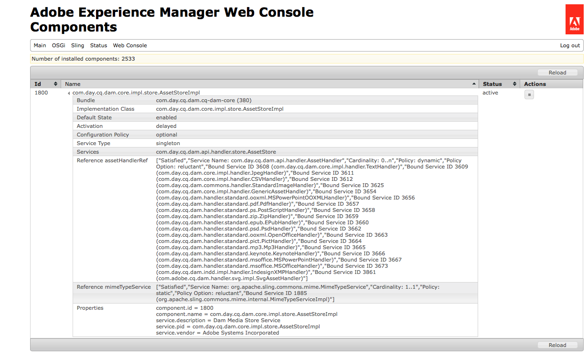

# Verarbeiten von Assets mit Media Handlern und Workflows {#processing-assets-using-media-handlers-and-workflows}

Adobe Experience Manager Assets bietet eine Reihe von Standard-Workflows und Media-Handlern zur Verarbeitung von Assets. Ein Workflow definiert eine typische Asset-Management- und -Verarbeitungs-Aufgabe und delegiert dann die spezifischen Aufgaben an die Media-Handler, z. B. die Erstellung von Miniaturbildern oder die Metadaten-Extraktion.

Ein Workflow kann definiert werden, der automatisch ausgeführt wird, wenn ein Asset eines bestimmten Typs oder Formats auf den Server hochgeladen wird. Die Verarbeitungsschritte werden als eine Reihe von Experience ManagerAssets-Medienhandlern definiert. Adobe Experience Manager bietet einige [integrierte Handler,](#default-media-handlers) und mehr können entweder [benutzerspezifisch entwickelt](#creating-a-new-media-handler) oder definiert werden, indem der Prozess an ein [Befehlszeilenwerkzeug](#command-line-based-media-handler) delegiert wird.

Media-Handler sind Dienste innerhalb von Experience Manager-Assets, die bestimmte Aktionen für Assets ausführen. Wenn beispielsweise eine MP3-Audiodatei in Experience Manager hochgeladen wird, wird in einem Workflow ein MP3-Handler Trigger, der die Metadaten extrahiert und eine Miniaturansicht generiert. Media-Handler werden mit Workflows verwendet. Die meisten gängigen MIME-Typen werden in Experience Manager unterstützt. Sie können bestimmte Aufgaben an Assets ausführen, indem Sie einen der folgenden Schritte ausführen:

* Erweitern oder Erstellen von Workflows.
* Erweitern oder Erstellen von Medienhandlern.
* Deaktivieren oder Aktivieren von Medienhandlern.

>[!NOTE]
>
>Unter [Unterstützte Asset-Formate](assets-formats.md) finden Sie eine Beschreibung aller Formate, die von Experience Manager Assets und für jedes Format unterstützten Funktionen unterstützt werden.

## Standard-Media-Handler {#default-media-handlers}

Die folgenden Medienhandler stehen in Experience Manager Assets zur Verfügung und behandeln die am häufigsten verwendeten MIME-Typen:

| Handler-Name | Dienstname (in der Systemkonsole) | Unterstützte MIME-Typen |
|---|---|---|
| [!UICONTROL TextHandler] | com.day.cq.dam.core.impl.handler.TextHandler | text/plain |
| [!UICONTROL PdfHandler] | com.day.cq.dam.handler.standard.pdf.PdfHandler | <ul><li>application/pdf</li><li>application/illustrator</li></ul> |
| [!UICONTROL JpegHandler] | com.day.cq.dam.core.impl.handler.JpegHandler | image/jpeg |
| [!UICONTROL Mp3Handler] | com.day.cq.dam.handler.standard.mp3.Mp3Handler | audio/mpeg<br><b>Wichtig</b> : Wenn Sie eine MP3-Datei hochladen, wird sie mit einer Bibliothek [ eines Drittanbieters ](http://www.zxdr.it/programmi/SistEvolBDD/LibJava/doc/de/vdheide/mp3/MP3File.html)verarbeitet. Die Bibliothek berechnet eine nicht genaue ungefähre ungefähre Länge, wenn die MP3 eine variable Bitrate (VBR) aufweist. |
| [!UICONTROL ZipHandler] | com.day.cq.dam.handler.standard.zip.ZipHandler | <ul><li>application/java-archive </li><li> application/zip</li></ul> |
| [!UICONTROL PictHandler] | com.day.cq.dam.handler.standard.pict.PictHandler | image/pict |
| [!UICONTROL StandardImageHandler] | com.day.cq.dam.core.impl.handler.StandardImageHandler | <ul><li>image/gif </li><li> image/png </li> <li>application/photoshop </li> <li>image/jpeg </li><li> image/tiff </li> <li>image/x-ms-bmp </li><li> image/bmp</li></ul> |
| [!UICONTROL MSOfficeHandler] | com.day.cq.dam.handler.standard.msoffice.MSOfficeHandler | application/msword |
| [!UICONTROL MSPowerPointHandler] | com.day.cq.dam.handler.standard.msoffice.MSPowerPointHandler | application/vnd.ms-powerpoint |
| [!UICONTROL OpenOfficeHandler] | com.day.cq.dam.handler.standard.ooxml.OpenOfficeHandler | <ul><li>application/vnd.openxmlformats-officedocument.wordprocessingml.document</li><li> application/vnd.openxmlformats-officedocument.spreadsheetml.sheet</li><li> application/vnd.openxmlformats-officedocument.presentationml.presentation</li></ul> |
| [!UICONTROL EPubHandler] | com.day.cq.dam.handler.standard.epub.EPubHandler | application/epub+zip |
| [!UICONTROL GenericAssetHandler] | com.day.cq.dam.core.impl.handler.GenericAssetHandler | Ausweichmöglichkeit, falls kein anderer Handler gefunden wurde, der Daten aus einem Asset extrahiert |

Alle Handler führen folgende Aufgaben aus:

* Extraktion aller verfügbaren Metadaten aus einem Asset.
* Erstellung eines Miniaturbilds aus einem Asset.

Es ist möglich, die aktiven Medien-Handler anzuzeigen:

1. Navigieren Sie im Browser zu `http://localhost:4502/system/console/components`.
1. Klicken Sie auf den Link `com.day.cq.dam.core.impl.store.AssetStoreImpl`.
1. Eine Liste mit allen aktiven Medien-Handlern wird angezeigt. Beispiel:



## Verwenden Sie in Workflows Media Handler, um Aufgaben für Assets {#using-media-handlers-in-workflows-to-perform-tasks-on-assets} durchzuführen

Media-Handler sind Dienste, die mit Workflows verwendet werden.

Experience Manager verfügt über einige Workflows zur Verarbeitung von Assets. Um sie Ansicht, öffnen Sie die Workflow-Konsole und klicken Sie auf die Registerkarte **[!UICONTROL Modelle]**: Bei den Workflow-Titeln, die mit Experience Manager Assets Beginn werden, handelt es sich um die Asset-spezifischen Titel.

Bereits bestehende Workflows können erweitert und neue Workflows können erstellt werden, um Assets nach spezifischen Anforderungen zu bearbeiten.

Das folgende Beispiel zeigt, wie der Arbeitsablauf **[!UICONTROL AEM Assets-Synchronisierung]** verbessert werden kann, sodass Teilassets für alle Assets außer PDF-Dokumenten generiert werden.

### Deaktivieren/Aktivieren eines Medien-Handlers {#disabling-enabling-a-media-handler}

Die Medien-Handler können über die Apache Felix Web Management-Konsole deaktiviert bzw. aktiviert werden. Wenn der Medien-Handler deaktiviert ist, werden seine Aufgaben zur Bearbeitung von Assets nicht durchgeführt.

So aktivieren/deaktivieren Sie einen Medien-Handler:

1. Navigieren Sie im Browser zu `https://<host>:<port>/system/console/components`.
1. Klicken Sie neben dem Namen des Medien-Handlers auf **[!UICONTROL Deaktivieren]**. Beispiel: `com.day.cq.dam.handler.standard.mp3.Mp3Handler`.
1. Aktualisieren Sie die Seite: Neben dem Medien-Handler wird ein Symbol angezeigt, das angibt, dass er deaktiviert ist.
1. Um den Medien-Handler zu aktivieren, klicken Sie neben dem Namen des Medien-Handlers auf **[!UICONTROL Aktivieren]**.

### Erstellen eines Media Handlers {#creating-a-new-media-handler}

Um einen neuen Medientyp zu unterstützen oder bestimmte Aufgaben an einem Asset auszuführen, müssen Sie einen Medienhandler erstellen. In diesem Abschnitt wird beschrieben, wie Sie vorgehen.

#### Wichtige Klassen und Schnittstellen     {#important-classes-and-interfaces}

Am besten ist es, zu Beginn einer Implementierung den Inhalt einer bereitgestellten abstrakten Implementierung zu übernehmen, wodurch die meisten Dinge im Voraus erledigt werden und ein angemessenes Standardverhalten erreicht wird: die `com.day.cq.dam.core.AbstractAssetHandler`-Klasse.

Diese Klasse enthält bereits einen abstrakten Dienst-Deskriptor. Wenn Sie also den Inhalt dieser Klasse übernehmen und das maven-sling-Plug-in verwenden, müssen Sie die Übernahmemarkierung auf `true` setzen.

Implementieren Sie die folgenden Methoden:

* `extractMetadata()`: extrahiert alle verfügbaren Metadaten.
* `getThumbnailImage()`: erstellt ein Miniaturbild aus einem Asset.
* `getMimeTypes()`: gibt die Asset-MIME-Typen zurück.

Hier eine Beispielvorlage:

`package my.own.stuff; /** * @scr.component inherit="true" * @scr.service */ public class MyMediaHandler extends com.day.cq.dam.core.AbstractAssetHandler { // implement the relevant parts } `

Schnittstelle und Klassen:

* `com.day.cq.dam.api.handler.AssetHandler`-Schnittstelle: Diese Schnittstelle beschreibt den Dienst, der Unterstützung für bestimmte MIME-Typen hinzufügt. Zum Hinzufügen eines MIME-Typs muss diese Schnittstelle implementiert werden. Die Schnittstelle enthält Methoden zum Importieren und Exportieren der jeweiligen Dokumente, zum Erstellen von Miniaturbildern und zum Extrahieren von Metadaten.
* `com.day.cq.dam.core.AbstractAssetHandler`-Klasse: Diese Klasse dient als Grundlage für alle anderen Asset-Handler-Implementierungen und bietet häufig verwendete Funktionen.
* `com.day.cq.dam.core.AbstractSubAssetHandler`-Klasse:
   * Diese Klasse dient als Grundlage für alle anderen Asset-Handler-Implementierungen und bietet häufig verwendete Funktionen sowie übliche Funktionen für die Extrahierung von Teil-Assets.
   * Die beste Methode zum Beginn einer Implementierung besteht darin, eine bereitgestellte abstrakte Implementierung zu übernehmen, die die meisten Dinge übernimmt und ein vernünftiges Standardverhalten bietet: die Klasse com.day.cq.dam.core.AbstractAssetHandler.
   * Diese Klasse enthält bereits einen abstrakten Dienst-Deskriptor. Wenn Sie also den Inhalt dieser Klasse übernehmen und das maven-sling-Plug-in verwenden, müssen Sie das Übernahme-Flag auf true setzen.

Die folgenden Methoden müssen implementiert werden:

* `extractMetadata()`: Diese Methode extrahiert alle verfügbaren Metadaten.
* `getThumbnailImage()`: Diese Methode erstellt ein Miniaturbild aus dem übergebenen Asset.
* `getMimeTypes()`: Diese Methode gibt die Asset-MIME-Typen zurück.

Hier eine Beispielvorlage:

package my.own.stuff; /&amp;ast;&amp;ast; &amp;ast; @scr.component inherit=&quot;true&quot; &amp;ast; @scr.service &amp;ast;/ public class MyMediaHandler extends com.day.cq.dam.core.AbstractAssetHandler { // die relevanten Teile implementieren }

Schnittstelle und Klassen:

* `com.day.cq.dam.api.handler.AssetHandler`-Schnittstelle: Diese Schnittstelle beschreibt den Dienst, der Unterstützung für bestimmte MIME-Typen hinzufügt. Zum Hinzufügen eines MIME-Typs muss diese Schnittstelle implementiert werden. Die Schnittstelle enthält Methoden zum Importieren und Exportieren der jeweiligen Dokumente, zum Erstellen von Miniaturbildern und zum Extrahieren von Metadaten.
* `com.day.cq.dam.core.AbstractAssetHandler`-Klasse: Diese Klasse dient als Grundlage für alle anderen Asset-Handler-Implementierungen und bietet häufig verwendete Funktionen.
* `com.day.cq.dam.core.AbstractSubAssetHandler`-Klasse: Diese Klasse dient als Grundlage für alle anderen Asset-Handler-Implementierungen und bietet häufig verwendete Funktionen sowie übliche Funktionen für die Extrahierung von Teil-Assets.

#### Beispiel: Erstellung eines spezifischen Text-Handlers {#example-create-a-specific-text-handler}

In diesem Abschnitt erstellen Sie einen bestimmten Text-Handler, der Miniaturansichten mit einem Wasserzeichen generiert.

Gehen Sie wie folgt vor:

Unter [Entwicklungstools](../sites-developing/dev-tools.md) finden Sie Informationen zum Installieren und Einrichten von Eclipse mit einem Maven-Plugin und zum Einrichten der Abhängigkeiten, die für das Maven-Projekt benötigt werden.

Nachdem Sie das folgende Verfahren ausgeführt haben, werden beim Hochladen einer Textdatei in Experience Manager die Metadaten der Datei extrahiert und zwei Miniaturansichten mit einem Wasserzeichen generiert.

1. Erstellen Sie in Eclipse das Maven-Projekt `myBundle`:

   1. Klicken Sie in der Menüleiste auf **[!UICONTROL Datei > Neu > Andere]**.
   1. Erweitern Sie im Dialogfeld den Ordner Maven, wählen Sie Maven Project und klicken Sie dann auf **[!UICONTROL Next]**.
   1. Markieren Sie das Kontrollkästchen **[!UICONTROL Einfaches Projekt erstellen]** und das Feld **[!UICONTROL Standardspeicherorte für Arbeitsbereich verwenden]** und klicken Sie dann auf **[!UICONTROL Weiter]**.
   1. Definieren Sie das Maven-Projekt mit den folgenden Werten:

      * Gruppen-ID: com.day.cq5.myhandler
      * Artefakt-ID: myBundle
      * Name: Mein Experience Manager-Bundle
      * Beschreibung: Das ist mein Experience Manager-Bundle
   1. Klicken Sie auf **[!UICONTROL Beenden]**.


1. Setzen Sie den Java™ Compiler auf Version 1.5:

   1. Klicken Sie mit der rechten Maustaste auf das Projekt `myBundle` und wählen Sie Eigenschaften.
   1. Wählen Sie Java™ Compiler und legen Sie die folgenden Eigenschaften auf 1.5 fest:

      * Compiler-Kompatibilitätsstufe
      * Kompatibilität von generierten .class-Dateien
      * Quellkompatibilität
   1. Klicken Sie auf **[!UICONTROL OK]**. Klicken Sie im Dialogfenster auf „Ja“.


1. Ersetzen Sie den Code in der pom.xml-Datei durch folgenden Code:

   ```xml
   <project xmlns="https://maven.apache.org/POM/4.0.0" xmlns:xsi="https://www.w3.org/2001/XMLSchema-instance"
    xsi:schemaLocation="https://maven.apache.org/POM/4.0.0 https://maven.apache.org/maven-v4_0_0.xsd">
    <modelVersion>4.0.0</modelVersion> 
    <!-- ====================================================================== --> 
    <!-- P A R E N T P R O J E C T D E S C R I P T I O N --> 
    <!-- ====================================================================== -->
    <parent>
     <groupId>com.day.cq.dam</groupId>
     <artifactId>dam</artifactId>
     <version>5.2.14</version>
     <relativePath>../parent</relativePath>
    </parent> 
    <!-- ====================================================================== --> 
    <!-- P R O J E C T D E S C R I P T I O N --> 
    <!-- ====================================================================== -->
    <groupId>com.day.cq5.myhandler</groupId>
    <artifactId>myBundle</artifactId>
    <name>My CQ5 bundle</name>
    <version>0.0.1-SNAPSHOT</version>
    <description>This is my CQ5 bundle</description>
    <packaging>bundle</packaging> 
    <!-- ====================================================================== --> 
    <!-- B U I L D D E F I N I T I O N --> 
    <!-- ====================================================================== -->
    <build>
     <plugins>
      <plugin>
       <groupId>org.apache.felix</groupId>
       <artifactId>maven-scr-plugin</artifactId>
      </plugin>
      <plugin>
       <groupId>org.apache.sling</groupId>
       <artifactId>maven-sling-plugin</artifactId>
       <configuration>
        <slingUrlSuffix>/libs/dam/install/</slingUrlSuffix>
       </configuration>
      </plugin>
      <plugin>
       <groupId>org.apache.felix</groupId>
       <artifactId>maven-bundle-plugin</artifactId>
       <extensions>true</extensions>
       <configuration>
        <instructions>
         <Bundle-Category>cq5</Bundle-Category>
         <Export-Package> com.day.cq5.myhandler </Export-Package>
        </instructions>
       </configuration>
      </plugin>
     </plugins>
    </build> 
    <!-- ====================================================================== --> 
    <!-- D E P E N D E N C I E S --> 
    <!-- ====================================================================== -->
    <dependencies>
     <dependency>
      <groupId>com.day.cq.dam</groupId>
      <artifactId>cq-dam-api</artifactId>
      <version>5.2.10</version>
      <scope>provided</scope>
     </dependency>
     <dependency>
      <groupId>com.day.cq.dam</groupId>
      <artifactId>cq-dam-core</artifactId>
      <version>5.2.10</version>
      <scope>provided</scope>
     </dependency>
     <dependency>
      <groupId>com.day.cq</groupId>
      <artifactId>cq-commons</artifactId>
     </dependency>
     <dependency>
      <groupId>javax.jcr</groupId>
      <artifactId>jcr</artifactId>
     </dependency>
     <dependency>
      <groupId>org.apache.felix</groupId>
      <artifactId>org.osgi.compendium</artifactId>
     </dependency>
     <dependency>
      <groupId>org.slf4j</groupId>
      <artifactId>slf4j-api</artifactId>
     </dependency>
     <dependency>
      <groupId>commons-lang</groupId>
      <artifactId>commons-lang</artifactId>
     </dependency>
     <dependency>
      <groupId>commons-collections</groupId>
      <artifactId>commons-collections</artifactId>
     </dependency>
     <dependency>
      <groupId>commons-io</groupId>
      <artifactId>commons-io</artifactId>
     </dependency>
     <dependency>
      <groupId>com.day.commons</groupId>
      <artifactId>day-commons-gfx</artifactId>
     </dependency>
     <dependency>
      <groupId>com.day.commons</groupId>
      <artifactId>day-commons-text</artifactId>
     </dependency>
     <dependency>
      <groupId>com.day.cq.workflow</groupId>
      <artifactId>cq-workflow-api</artifactId>
     </dependency>
     <dependency>
      <groupId>com.day.cq.wcm</groupId>
      <artifactId>cq-wcm-foundation</artifactId>
      <version>5.2.22</version>
     </dependency>
    </dependencies>
   ```

1. Erstellen Sie das Paket `com.day.cq5.myhandler`, das die Java™-Klassen unter `myBundle/src/main/java` enthält:

   1. Klicken Sie unter myBundle mit der rechten Maustaste auf `src/main/java`, wählen Sie New und dann Package.
   1. Benennen Sie es `com.day.cq5.myhandler` und klicken Sie auf Fertig stellen.

1. Erstellen Sie die Java™-Klasse `MyHandler`:

   1. Klicken Sie in Eclipse unter `myBundle/src/main/java` mit der rechten Maustaste auf das `com.day.cq5.myhandler`-Paket, wählen Sie Neu und dann Klasse.
   1. Benennen Sie im Dialogfeld die Java™-Klasse MyHandler und klicken Sie auf Finish. Eclipse erstellt und öffnet die Datei MyHandler.java.
   1. Ersetzen Sie in `MyHandler.java` den vorhandenen Code durch den folgenden und speichern Sie dann die Änderungen:

   ```java
   package com.day.cq5.myhandler; 
   import java.awt.Color; 
   import java.awt.Rectangle; 
   import java.awt.image.BufferedImage; 
   import java.io.IOException; 
   import java.io.InputStream; 
   import java.io.InputStreamReader; 
   import javax.jcr.Node; 
   import javax.jcr.RepositoryException; 
   import javax.jcr.Session; 
   import org.apache.commons.io.IOUtils; 
   import org.slf4j.Logger; 
   import org.slf4j.LoggerFactory; 
   import com.day.cq.dam.api.metadata.ExtractedMetadata; 
   import com.day.cq.dam.core.AbstractAssetHandler; 
   import com.day.image.Font; 
   import com.day.image.Layer; 
   import com.day.cq.wcm.foundation.ImageHelper; 
   
   /** 
    * The <code>MyHandler</code> can extract text files 
    * @scr.component inherit="true" immediate="true" metatype="false" 
    * @scr.service 
    * 
    **/ 
   
   public class MyHandler extends AbstractAssetHandler { 
    /** * Logger instance for this class. */ 
    private static final Logger log = LoggerFactory.getLogger(MyHandler.class); 
    /** * Music icon margin */ 
    private static final int MARGIN = 10; 
    /** * @see com.day.cq.dam.api.handler.AssetHandler#getMimeTypes() */ 
    public String[] getMimeTypes() {
     return new String[] {"text/plain"}; 
    }
   
    public ExtractedMetadata extractMetadata(Node asset) { 
     ExtractedMetadata extractedMetadata = new ExtractedMetadata(); 
     InputStream data = getInputStream(asset); 
     try { 
      // read text data 
      InputStreamReader reader = new InputStreamReader(data); 
      char[] buffer = new char[4096]; 
      String text = ""; 
      while (reader.read(buffer) != -1) { 
       text += new String(buffer); 
      } 
      reader.close(); 
      long wordCount = this.wordCount(text); 
      extractedMetadata.setProperty("text", text); 
      extractedMetadata.setMetaDataProperty("Word Count",wordCount); 
      setMimetype(extractedMetadata, asset); 
     } catch (Throwable t) { 
      log.error("handling error: " + t.toString(), t); 
     } finally { 
      IOUtils.closeQuietly(data); 
     } 
     return extractedMetadata; } 
    // ----------------------< helpers >---------------------------------------- 
    protected BufferedImage getThumbnailImage(Node node) { 
     ExtractedMetadata metadata = extractMetadata(node); 
     final String text = (String) metadata.getProperty("text"); 
     // create text layer 
     final Layer layer = new Layer(500, 600, Color.WHITE); 
     layer.setPaint(Color.black); 
     Font font = new Font("Arial", 12); 
     String displayText = this.getDisplayText(text, 600, 12); 
     if(displayText!=null && displayText.length() > 0) {
      // commons-gfx Font class would throw IllegalArgumentException on empty or null text 
      layer.drawText(10, 10, 500, 600, displayText, font, Font.ALIGN_LEFT, 0, 0); 
     } 
     // create watermark and merge with text layer 
     Layer watermarkLayer; 
     try { 
      final Session session = node.getSession(); 
      watermarkLayer = ImageHelper.createLayer(session, "/content/dam/geometrixx/icons/certificate.png"); 
      watermarkLayer.setX(MARGIN); 
      watermarkLayer.setY(MARGIN); 
      layer.merge(watermarkLayer); 
     } catch (RepositoryException e) { 
      // TODO Auto-generated catch block 
      e.printStackTrace(); 
     } catch (IOException e) { 
      // TODO Auto-generated catch block 
      e.printStackTrace(); } 
     layer.crop(new Rectangle(510, 600)); 
     return layer.getImage(); } 
    // ---------------< private >----------------------------------------------- 
    /** 
     * This method cuts lines if the text file is too long..
     * * @param text
     * * text to check
     * * @param height
     * * text box height (px)
     * * @param fontheight
     * * font height (px) 
     * * @return the text which will fit into the box 
     */ 
    private String getDisplayText(String text, int height, int fontheight) { 
     String trimmedText = text.trim(); 
     int numOfLines = height / fontheight; 
     String lines[] = trimmedText.split("\n"); 
     if (lines.length <= numOfLines) { 
      return trimmedText; 
     } else { 
      String cuttetText = ""; 
      for (int i = 0; i < numOfLines; i++) { 
       cuttetText += lines[i] + "\n"; 
      } 
      return cuttetText; 
     } 
    } 
    /**
     * * This method counts the number of words in a string 
     * * @param text the String whose words would like to be counted
     * * @return the number of words in the string
     * */ 
    private long wordCount(String text) { 
     // We need to keep track of the last character, if we have two whitespace in a row we don't want to double count.
     // The starting of the document is always a whitespace.
     boolean prevWhiteSpace = true; 
     boolean currentWhiteSpace = true; 
     char c; long numwords = 0; 
     int j = text.length(); 
     int i = 0; 
     while (i < j) { 
      c = text.charAt(i++); 
      if (c == 0) { break; } 
      currentWhiteSpace = Character.isWhitespace(c); 
      if (currentWhiteSpace && !prevWhiteSpace) { numwords++; } 
      prevWhiteSpace = currentWhiteSpace; 
     } 
     // If we do not end with a whitespace then we need to add one extra word.
     if (!currentWhiteSpace) { numwords++; } 
     return numwords; 
    } 
   }
   ```

1. Kompilieren Sie die Java™-Klasse und erstellen Sie das Bundle:

   1. Klicken Sie mit der rechten Maustaste auf das myBundle-Projekt, wählen Sie **[!UICONTROL Ausführen als]** und dann **[!UICONTROL Maven Install]**.
   1. Das Bundle `myBundle-0.0.1-SNAPSHOT.jar` (das die kompilierte Klasse enthält) wird unter `myBundle/target` erstellt.

1. Erstellen Sie in CRX Explorer einen Knoten unter `/apps/myApp`. Name = `install`, Typ = `nt:folder`.
1. Kopieren Sie das Bundle `myBundle-0.0.1-SNAPSHOT.jar` und speichern Sie es unter `/apps/myApp/install` (z. B. mit WebDAV). Der neue Texthandler ist jetzt in Experience Manager aktiv.
1. Öffnen Sie im Browser die Apache Felix Web Management Console. Wählen Sie die Registerkarte „Komponenten“ aus und deaktivieren Sie den Standard-Text-Handler `com.day.cq.dam.core.impl.handler.TextHandler`.

## Befehlszeilenbasierter Medien-Handler {#command-line-based-media-handler}

Mit Experience Manager können Sie jedes Befehlszeilenwerkzeug innerhalb eines Workflows ausführen, um Assets (z. B. ImageMagick) zu konvertieren und die neue Darstellung dem Asset hinzuzufügen. Installieren Sie das Befehlszeilenwerkzeug auf dem Datenträger, auf dem sich der Experience Manager-Server befindet, und fügen Sie dem Workflow einen Prozessschritt hinzu und konfigurieren Sie ihn. Der aufgerufene Prozess mit der Bezeichnung `CommandLineProcess`, Filter nach bestimmten MIME-Typen und erstellt mehrere Miniaturansichten basierend auf der neuen Darstellung.

Die folgenden Konvertierungen können automatisch in Experience Manager Assets ausgeführt und gespeichert werden:

* EPS- und AI-Umwandlung mithilfe von [ImageMagick](https://www.imagemagick.org/script/index.php) und [Ghostscript](https://www.ghostscript.com/)
* FLV-Videotranskodierung mithilfe von [FFmpeg](https://ffmpeg.org/)
* MP3-Kodierung mithilfe von [LAME](http://lame.sourceforge.net/)
* Verarbeitung von Audiodaten mithilfe von [SOX](http://sox.sourceforge.net/)

>[!NOTE]
>
>Auf Nicht-Windows-Systemen gibt das FFMpeg-Tool einen Fehler aus, wenn Ausgabeformate für ein Video-Asset erstellt werden, dessen Dateiname ein einfaches Anführungszeichen (&#39;) enthält. Wenn der Name Ihrer Videodatei ein einfaches Anführungszeichen enthält, entfernen Sie es, bevor Sie es in Experience Manager hochladen.

Der Prozess `CommandLineProcess` führt folgende Vorgänge in der angegebenen Reihenfolge aus:

* Filtert die Datei nach bestimmten MIME-Typen, falls angegeben.
* Erstellt einen temporären Ordner auf der Festplatte, auf der sich der Experience Manager-Server befindet.
* Streamt die Originaldatei in das temporäre Verzeichnis.
* Führt den Befehl aus, der über die Argumente des Schritts definiert ist. Der Befehl wird im temporären Ordner mit den Berechtigungen des Experience Managers ausgeführt.
* Streamt das Ergebnis zurück in den Ausgabeordner des Experience Manager-Servers.
* Löscht das temporäre Verzeichnis.
* Erstellt Miniaturbilder auf der Grundlage dieser Ausgabeformate, falls angegeben. Die Anzahl und die Abmessungen von Miniaturbildern werden durch die Argumente des Schritts definiert.

### Beispiel mit ImageMagick {#an-example-using-imagemagick}

Das folgende Beispiel zeigt, wie Sie den Schritt für den Befehlszeilenprozess einrichten. Jedes Mal, wenn ein Asset mit dem MIME-Typ gif oder tiff zu `/content/dam` auf dem Experience Manager-Server hinzugefügt wird, wird ein gedrehtes Bild des Originals zusammen mit drei weiteren Miniaturbildern (140 x 100, 48 x 48 und 10 x 250) erstellt.

Verwenden Sie dazu ImageMagick. Installieren Sie ImageMagick auf der Festplatte, auf der der Experience Manager-Server gehostet wird:

1. Installieren von ImageMagick. Weitere Informationen finden Sie in der [ImageMagick-Dokumentation](https://www.imagemagick.org/script/download.php).
1. Richten Sie das Tool so ein, dass Sie `convert` in der Befehlszeile ausführen können.
1. Um festzustellen, ob das Tool ordnungsgemäß installiert wurde, führen Sie den Befehl `convert -h` über die Befehlszeile aus.

   Es wird ein Hilfebildschirm mit allen möglichen Optionen des Konvertierungstools angezeigt.

   >[!NOTE]
   >
   >In einigen Versionen von Windows® (z. B. Windows® SE) kann der Befehl &quot;Konvertieren&quot;nicht ausgeführt werden, da er mit dem nativen Konvertierungsprogramm, das Teil der Windows®-Installation ist, in Konflikt steht. In diesem Fall verwenden Sie den vollständigen Pfad für das ImageMagick-Dienstprogramm, das verwendet wird, um Bilddateien in Miniaturbilder zu konvertieren. Beispiel: `"C:\Program Files\ImageMagick-6.8.9-Q16\convert.exe" -define jpeg:size=319x319 ${filename} -thumbnail 319x319 cq5dam.thumbnail.319.319.png`.

1. Um zu sehen, ob das Tool ordnungsgemäß ausgeführt wird, fügen Sie dem Arbeitsverzeichnis ein JPG-Bild hinzu und führen Sie den Befehl `convert <image-name>.jpg -flip <image-name>-flipped.jpg` in der Befehlszeile aus.

   Ein gespiegeltes Bild wird dem Verzeichnis hinzugefügt.

Fügen Sie dann den Befehlszeilenprozessschritt dem Workflow **[!UICONTROL DAM-Update-Asset]** hinzu:

1. Rufen Sie die Konsole **[!UICONTROL Workflow]** auf.
1. Bearbeiten Sie auf der Registerkarte **[!UICONTROL Modelle]** das Modell **[!UICONTROL DAM-Update-Asset]**.
1. Ändern Sie die Einstellungen des Schritts **[!UICONTROL Web-aktivierte Ausgabe]** wie folgt:

   `mime:image/gif,mime:image/tiff,tn:140:100,tn:48:48,tn:10:250,cmd:convert ${directory}/${filename} -flip ${directory}/${basename}.flipped.jpg`

1. Speichern Sie den Workflow.

Fügen Sie zum Testen des geänderten Workflows ein Asset zu `/content/dam` hinzu.

1. Rufen Sie im Dateisystem ein TIFF-Bild Ihrer Wahl ab. Benennen Sie es in `myImage.tiff` um und kopieren Sie es in `/content/dam`, z. B. mithilfe von WebDAV.
1. Rufen Sie die Konsole **[!UICONTROL CQ5 DAM]** auf, z. B. `http://localhost:4502/libs/wcm/core/content/damadmin.html`.
1. Öffnen Sie das Asset `myImage.tiff` und prüfen Sie, ob das gespiegelte Bilder und die drei Miniaturbilder erstellt wurden.

#### Konfigurieren des BefehlsLineProcess-Prozessschritts {#configuring-the-commandlineprocess-process-step}

In diesem Abschnitt wird beschrieben, wie die **[!UICONTROL Prozess-Argumente]** des `CommandLineProcess` festgelegt werden. Trennen Sie die Werte von [!UICONTROL Prozessargumente] durch ein Komma und geben Sie keinen Beginn mit einem Leerzeichen ein.

| Argument-Format | Beschreibung |
|---|---|
| mime:&lt;MIME-Typ> | Optionales Argument. Der Prozess wird angewendet, wenn das Asset denselben MIME-Typ wie das Argument hat. <br>Es können mehrere MIME-Typen definiert werden. |
| tn:&lt;Breite>:&lt;Höhe> | Optionales Argument. Der Prozess erstellt ein Miniaturbild mit den Abmessungen, die im Argument definiert sind. <br>Es können mehrere Miniaturbilder definiert werden. |
| cmd: &lt;Befehl> | Definiert den auszuführenden Befehl. Die Syntax hängt vom Befehlszeilen-Tool ab. Nur ein Befehl kann definiert werden. <br>Die folgenden Variablen können zum Erstellen des Befehls verwendet werden:<br>`${filename}`: Name der Eingabedatei, z. B. original.jpg  <br> `${file}`: vollständiger Pfadname der Eingabedatei, z. B. /tmp/cqdam0816.tmp/original.jpg  <br> `${directory}`: Verzeichnis der Eingabedatei, z. B. /tmp/cqdam0816.tmp  <br>`${basename}`: Name der Eingabedatei ohne Erweiterung, z. B. Original  <br>`${extension}`: Erweiterung der Eingabedatei, z. B. jpg |

Wenn ImageMagick beispielsweise auf dem Datenträger installiert ist, auf dem der Experience Manager-Server gehostet wird, und Sie einen Prozessschritt mit **CommandLineProcess** als Implementierung und die folgenden Werte als **Prozessargumente** erstellen:

`mime:image/gif,mime:image/tiff,tn:140:100,tn:48:48,tn:10:250,cmd:convert ${directory}/${filename} -flip ${directory}/${basename}.flipped.jpg`

Wenn der Workflow ausgeführt wird, gilt der Schritt nur für Assets, die über `image/gif` oder `mime:image/tiff` als Mime-Typen verfügen. Es wird ein gedrehtes Bild des Originals erstellt, in .jpg konvertiert und drei Miniaturansichten mit den folgenden Abmessungen erstellt: 140 x 100, 48 x 48 und 10 x 250.

Verwenden Sie die folgenden [!UICONTROL Prozess-Argumente], um die drei Standard-Miniaturbilder mithilfe von ImageMagick zu erstellen:

`mime:image/tiff,mime:image/png,mime:image/bmp,mime:image/gif,mime:image/jpeg,cmd:convert ${filename} -define jpeg:size=319x319 -thumbnail "319x319>" -background transparent -gravity center -extent 319x319 -write png:cq5dam.thumbnail.319.319.png -thumbnail "140x100>" -background transparent -gravity center -extent 140x100 -write cq5dam.thumbnail.140.100.png -thumbnail "48x48>" -background transparent -gravity center -extent 48x48 cq5dam.thumbnail.48.48.png`

Verwenden Sie die folgenden [!UICONTROL Prozess-Argumente], um die Web-fähige Ausgabe mithilfe von ImageMagick zu erstellen:

`mime:image/tiff,mime:image/png,mime:image/bmp,mime:image/gif,mime:image/jpeg,cmd:convert ${filename} -define jpeg:size=1280x1280 -thumbnail "1280x1280>" cq5dam.web.1280.1280.jpeg`

>[!NOTE]
>
>Der Schritt `CommandLineProcess` gilt nur für Assets (Knoten des Typs `dam:Asset`) oder untergeordnete Elemente eines Assets.
