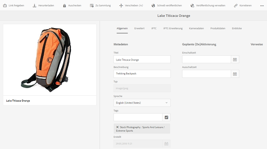

# Anleitung zum Bearbeiten oder Hinzufügen von Metadaten {#how-to-edit-or-add-metadata}

Metadaten sind zusätzliche Informationen zum Asset, die durchsucht werden können. Beim Hochladen eines Bildes werden sie automatisch extrahiert. Sie können die vorhandenen Metadaten bearbeiten oder vorhandenen Feldern neue Metadateneigenschaften hinzufügen (etwa wenn ein Metadatenfeld leer ist).

Da Unternehmen gesteuertes und zuverlässiges Metadatenvokabular benötigen, [!DNL Experience Manager] Assets ermöglicht kein Ad-hoc-Hinzufügen neuer Metadateneigenschaften. Autoren können keine neuen Metadatenfelder für Assets hinzufügen, Entwickler hingegen schon. Informationen finden Sie unter [Erstellen neuer Metadateneigenschaften für Assets](meta-edit.md#editing-metadata-schema).

## Bearbeiten von Metadaten für ein Asset {#editing-metadata-for-an-asset}

So bearbeiten Sie Metadaten:

1. Führen Sie einen der folgenden Schritte aus:

   * Wählen Sie in der Benutzeroberfläche von AEM Assets das Asset aus und klicken oder tippen Sie in der Symbolleiste auf das Symbol **[!UICONTROL Eigenschaften anzeigen]**.
   * Wählen Sie die Schnellaktion **[!UICONTROL Eigenschaften anzeigen]** aus der Miniatur des Assets aus.
   * Klicken/tippen Sie auf der Asset-Seite auf die **[!UICONTROL Eigenschaften anzeigen]** icon  aus der Symbolleiste.

   Auf der Asset-Seite werden alle Metadaten des Assets angezeigt. Diese Metadaten wurden beim Hochladen (Aufnahme) in automatisch extrahiert [!DNL Experience Manager] Assets.

   

1. Nehmen Sie auf den verschiedenen Registerkarten bei Bedarf Änderungen an den Metadaten vor. Klicken oder tippen Sie anschließend in der Symbolleiste auf **[!UICONTROL Speichern]**, um die Änderungen zu speichern. Klicken oder tippen Sie auf **[!UICONTROL Schließen]**, um zur Benutzeroberfläche von AEM Assets zurückzukehren.

   >[!NOTE]
   >
   >Ein leeres Textfeld gibt an, dass kein Metadatenset vorhanden ist. Sie können einen Wert in das Feld eingeben und speichern, um diese Metadateneigenschaft hinzuzufügen.

Alle Änderungen an den Metadaten eines Assets werden als Teil der XMP-Daten in die ursprüngliche Binärdatei zurückgeschrieben. Dies geschieht über den Writeback-Workflow der AEM-Metadaten. Änderungen an den vorhandenen Eigenschaften (z. B. `dc:title`) werden überschrieben und neu erstellte Eigenschaften (einschließlich anwenderdefinierten Eigenschaften wie `cq:tags`) werden zusammen mit dem Schema hinzugefügt.

XMP-Writeback wird für die in [Technische Anforderungen](/help/sites-deploying/technical-requirements.md) beschriebenen Plattformen und Dateiformate unterstützt und aktiviert.

## Bearbeiten von Metadatenschemata {#editing-metadata-schema}

Weitere Informationen zur Bearbeitung von Metadatenschemata finden Sie unter [Bearbeiten von Metadaten-Schemaformularen](metadata-schemas.md#editing-metadata-schema-forms).

## Registrieren eines benutzerdefinierten Namespace in [!DNL Experience Manager] {#registering-a-custom-namespace-within-aem}

Sie können eigene Namespaces in AEM hinzufügen. Es gibt vordefinierte Namespaces wie cq, jcr und sling. Sie können aber auch einen Namespace für Ihre Repository-Metadaten und die XML-Verarbeitung hinzufügen.

1. Navigieren Sie zur Verwaltungsseite für den Knotentyp . `https://[AEM_server]:[port]/crx/explorer/nodetypes/index.jsp`.
1. Klicken oder tippen Sie am oberen Rand der Seite auf **[!UICONTROL Namespaces]**. Die Seite zur Namespace-Verwaltung wird in einem Fenster angezeigt.

1. Um einen Namespace hinzuzufügen, klicken oder tippen Sie am unteren Rand auf **[!UICONTROL Neu]**.
1. Geben Sie einen benutzerdefinierten Namespace gemäß der XML-Namespace-Konvention ein (ID in Form einer URI und verknüpftes Präfix für die ID). Klicken oder tippen Sie auf **[!UICONTROL Speichern]**.

## Tipps und Einschränkungen {#best-practices-limitations}

* Die Metadatenaktualisierungen über die Touch-optimierte Benutzeroberfläche ändern die Metadateneigenschaften im `dc` Namespace. Jegliche über die HTTP-API vorgenommenen Aktualisierungen ändern die Metadateneigenschaften in der `jcr` Namespace. Siehe [Aktualisieren von Metadaten mithilfe der HTTP-API](/help/assets/mac-api-assets.md#update-asset-metadata).

>[!MORELIKETHIS]
>
>* [Informationen zu Metadaten und deren Bedarf in Assets](metadata.md)

