# Metadatenprofile {#metadata-profiles}

Mit einem Metadatenprofil können Sie Standardmetadaten auf Assets in einem Ordner anwenden. Erstellen Sie ein Metadatenprofil und wenden Sie es auf einen Ordner an. Jedes Asset, das Sie anschließend in den Ordner hochladen, übernimmt die Standardmetadaten, die Sie im Metadatenprofil konfiguriert haben.

## Hinzufügen eines Metadatenprofils {#adding-a-metadata-profile}

1. Tippen oder klicken Sie auf das [!DNL Experience Manager]-Logo und navigieren Sie zu **[!UICONTROL Tools > Assets > Metadatenprofile]** und tippen Sie dann auf **[!UICONTROL Erstellen]**.
1. Geben Sie einen Titel für das Metadatenprofil ein, etwa Beispielmetadaten, und klicken Sie auf **[!UICONTROL Senden]**. Das **[!UICONTROL Bearbeitungsformular]** für das Metadatenprofil wird angezeigt.

   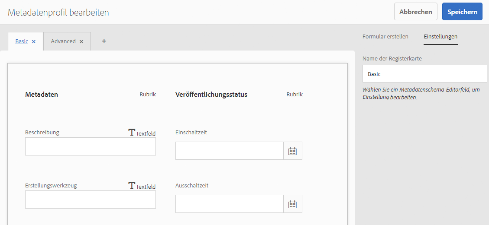

1. Klicken Sie auf eine Komponente und konfigurieren Sie deren Eigenschaften auf der Registerkarte **[!UICONTROL Einstellungen]**. Klicken Sie beispielsweise auf die Komponente **[!UICONTROL Beschreibung]** und bearbeiten Sie die zugehörigen Eigenschaften.

   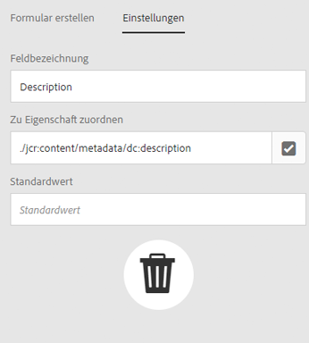

   Bearbeiten Sie die folgenden Eigenschaften für die Komponente **[!UICONTROL Beschreibung]**:

   * **[!UICONTROL Feldbezeichnung]**: Der Anzeigename der Metadateneigenschaft. Dieser dient lediglich als Referenz für den Benutzer.
   * **[!UICONTROL Zu Eigenschaft zuordnen]**: Der Wert dieser Eigenschaft liefert den relativen Pfad/Namen zum Asset-Knoten, unter dem er im Repository gespeichert ist. Der Wert sollte immer mit beginnen,  `./` da er anzeigt, dass sich der Pfad unter dem Knoten des Assets befindet.

   

   Der Wert, den Sie für **[!UICONTROL Zu Eigenschaft zuordnen]** angeben, wird als Eigenschaft unter dem Metadatenknoten des Assets gespeichert. Beispiel: Wenn Sie `/jcr:content/metadata/dc:desc` als Name von  **[!UICONTROL Zu Eigenschaft zuordnen]**, speichert  [!DNL Experience Manager] Assets den Wert  `dc:desc` im Metadatenknoten des Assets.

   * **[!UICONTROL Standardwert]**: Mit dieser Eigenschaft können Sie einen Standardwert für die Metadatenkomponente hinzufügen. Wenn Sie beispielsweise „Meine Beschreibung“ angeben, wird dieser Wert der Eigenschaft `dc:desc` im Metadatenknoten des Assets zugewiesen.

   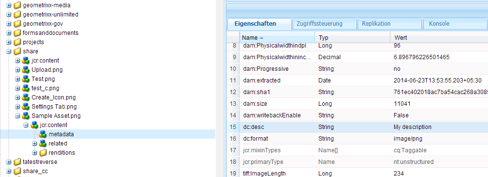

   >[!NOTE]
   >
   >Hinzufügen eines Standardwert zu einer neuen Metadateneigenschaft (die noch nicht im vorhanden ist). `/jcr:content/metadata` vorhanden ist) einen Standardwert hinzufügen, werden die Eigenschaft und deren Wert nicht standardmäßig auf der Eigenschaftsseite des Assets angezeigt. **** Um die neue Eigenschaft auf der Seite [!UICONTROL Eigenschaften] des Assets anzuzeigen, ändern Sie das entsprechende Schemaformular.

1. (Optional) Fügen Sie der Registerkarte **[!UICONTROL Formular bearbeiten]** auf der Registerkarte **[!UICONTROL Formular erstellen]** weitere Komponenten hinzu und konfigurieren Sie deren Eigenschaften auf der Registerkarte **[!UICONTROL Einstellungen]** . Die folgenden Eigenschaften sind auf der Registerkarte **[!UICONTROL Formular erstellen]** verfügbar:

| Komponente | Eigenschaften |
|---|---|
| [!UICONTROL Bereichs-Kopfzeile] | Feldbezeichnung,   Beschreibung |
| [!UICONTROL Einzeilentext] | Feldbezeichnung,   Zu Eigenschaft zuordnen,   Standardwert |
| [!UICONTROL Mehrwerttext] | Feldbezeichnung,   Zu Eigenschaft zuordnen,   Standardwert |
| [!UICONTROL Zahl] | Feldbezeichnung,   Zu Eigenschaft zuordnen,   Standardwert |
| [!UICONTROL Datum] | Feldbezeichnung,   Zu Eigenschaft zuordnen,   Standardwert |
| [!UICONTROL Standard-Tags] | Feldbezeichnung,   Zu Eigenschaft zuordnen,   Standardwert,   Beschreibung |

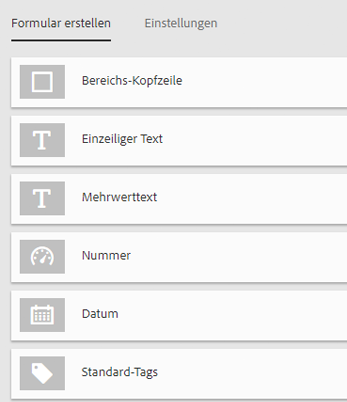

1. Klicken Sie auf **[!UICONTROL Fertig]**. Das Metadatenprofil wird zur Liste der Profile auf der Seite **[!UICONTROL Metadatenprofile]** hinzugefügt.

   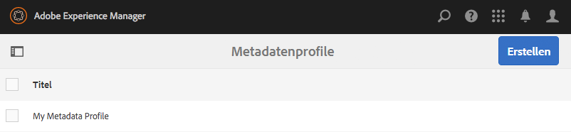

## Kopieren eines Metadatenprofils {#copying-a-metadata-profile}

1. Wählen Sie auf der Seite **[!UICONTROL Metadatenprofile]** ein Profil aus, um eine Kopie davon zu erstellen.

   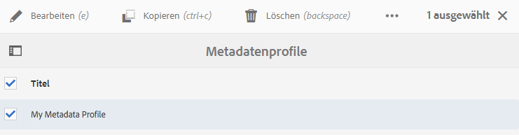

1. Klicken Sie in der Symbolleiste auf **[!UICONTROL Kopieren]**.
1. Geben Sie im Dialogfeld **[!UICONTROL Metadatenprofil kopieren]** einen Titel für die neue Kopie des Profils ein.
1. Klicken Sie auf **[!UICONTROL Kopieren]**. Eine Kopie des Profils wird in der Profilliste auf der Seite **[!UICONTROL Metadatenprofile]** angezeigt.

   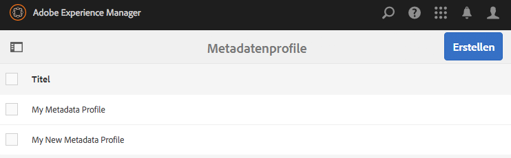

## Löschen eines Metadatenprofils {#deleting-a-metadata-profile}

1. Wählen Sie auf der Seite **[!UICONTROL Metadatenprofile]** das zu löschende Profil aus.

   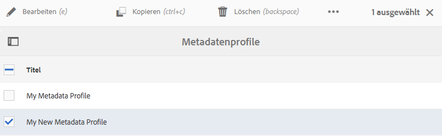

1. Klicken Sie in der Symbolleiste auf **[!UICONTROL Metadatenprofile löschen]**.
1. Klicken Sie im Dialogfeld auf **[!UICONTROL Löschen]** , um den Löschvorgang zu bestätigen. Das Metadatenprofil wird aus der Liste gelöscht.

## Anwenden eines Metadatenprofils auf Ordner {#applying-a-metadata-profile-to-folders}

Wenn Sie ein Metadatenprofil zu einem Ordner zuweisen, erben automatisch alle Unterordner das Profil vom übergeordneten Ordner. Demzufolge können Sie einem Ordner nur ein Metadatenprofil zuweisen. Daher sollten Sie die Ordnerstruktur sorgfältig planen, in der Sie Assets hochladen, speichern, verwenden und archivieren.

Wenn Sie einem Ordner ein anderes Metadatenprofil zugewiesen haben, überschreibt das neue das vorherige Profil. Die zuvor vorhandenen Ordner-Assets verbleiben unverändert. Das neue Profil wird auf die Assets angewendet, die dem Ordner später hinzugefügt werden.

Ordner, denen ein Profil zugewiesen wurde, werden in der Benutzeroberfläche durch den Namen des Profils angegeben, der im Kartennamen angezeigt wird.

Sie können Metadatenprofile auf bestimmte Ordner oder global auf alle Assets anwenden.

### Anwenden von Metadatenprofilen auf bestimmte Ordner {#applying-metadata-profiles-to-specific-folders}

Sie können ein Metadatenprofil über das Menü **[!UICONTROL Tools]** oder, falls Sie sich im Ordner befinden, über **[!UICONTROL Eigenschaften]** auf einen Ordner anwenden. In diesem Abschnitt wird beschrieben, wie Sie Metadatenprofile auf beide Arten auf Ordner anwenden.

Ordner, denen bereits ein Profil zugewiesen ist, werden durch die Anzeige des Profilnamens direkt unter dem Ordnernamen gekennzeichnet.

#### Anwenden von Metadatenprofilen auf Ordner über die Benutzeroberfläche „Profile“  {#applying-metadata-profiles-to-folders-from-profiles-user-interface}

1. Tippen Sie auf das [!DNL Experience Manager]-Logo und navigieren Sie zu **[!UICONTROL Tools > Assets > Metadatenprofile]**.
1. Wählen Sie ein Metadatenprofil aus, das Sie auf einen oder mehrere Ordner anwenden möchten.

   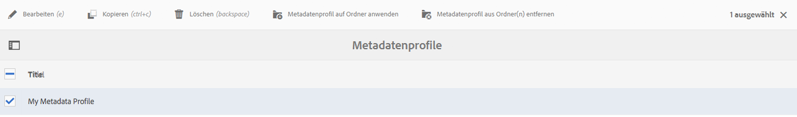

1. Tippen Sie auf **[!UICONTROL Metadatenprofil auf Ordner anwenden]** und wählen Sie mindestens einen Ordner aus, den Sie verwenden möchten, um neu hochgeladene Assets zu empfangen. Tippen Sie anschließend auf **[!UICONTROL Fertig]**. Ordner, denen bereits ein Profil zugewiesen ist, werden durch die Anzeige des Profilnamens direkt unter dem Ordnernamen gekennzeichnet.

#### Anwenden von Metadatenprofilen auf Ordner aus „Eigenschaften“  {#applying-metadata-profiles-to-folders-from-properties}

1. Tippen Sie auf der linken Leiste auf **[!UICONTROL Assets]** und navigieren Sie dann zu dem Ordner, auf den Sie ein Metadatenprofil anwenden möchten.
1. Tippen Sie im Ordner auf das Kontrollkästchen, um es zu aktivieren, und tippen Sie anschließend auf **[!UICONTROL Eigenschaften]**.

1. Wählen Sie die Registerkarte **[!UICONTROL Metadatenprofile]** aus. Wählen Sie anschließend das Profil aus dem Dropdownmenü aus und klicken Sie auf **[!UICONTROL Speichern]**.

   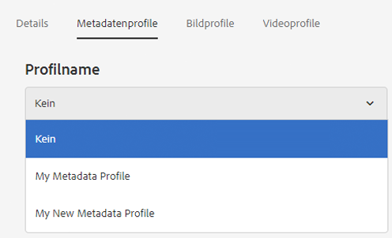

   Ordner, denen bereits ein Profil zugewiesen ist, werden durch die Anzeige des Profilnamens direkt unter dem Ordnernamen gekennzeichnet.

### Globales Anwenden eines Metadatenprofils {#applying-a-metadata-profile-globally}

Sie können ein Profil nicht nur auf einen Ordner anwenden, sondern auch global anwenden, sodass auf alle Inhalte, die in [!DNL Experience Manager]-Assets in einem beliebigen Ordner hochgeladen werden, das ausgewählte Profil angewendet wird. Gehen Sie wie folgt vor, um ein Metadatenprofil global anzuwenden:

1. Führen Sie einen der folgenden Schritte aus:

   * Navigieren Sie zu `https://[aem_server]:[port]/mnt/overlay/dam/gui/content/assets/foldersharewizard.html/content/dam`, wenden Sie das entsprechende Profil an und tippen oder klicken Sie auf **[!UICONTROL Speichern]**.

      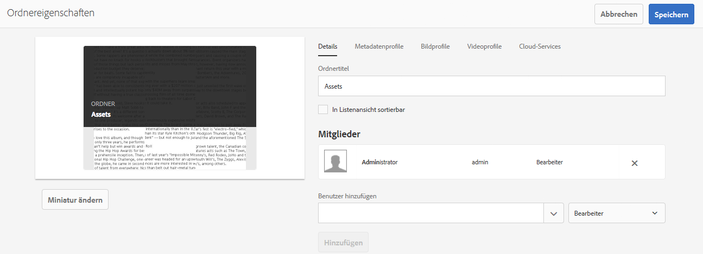

   * Navigieren Sie in CRXDE Lite zum folgenden Knoten: `/content/dam/jcr:content`. Fügen Sie die Eigenschaft `metadataProfile:/etc/dam/metadata/dynamicmedia/<name_of_metadata_profile>` hinzu und tippen Sie auf **[!UICONTROL Alle speichern]**.

      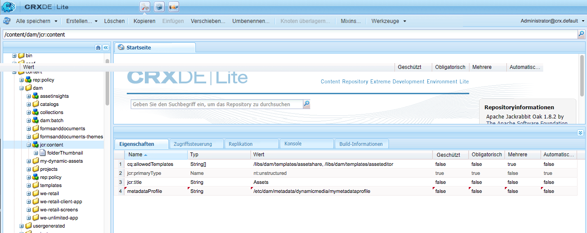

## Entfernen von Metadatenprofilen aus Ordnern {#removing-a-metadata-profile-from-folders}

Wenn Sie ein Metadatenprofil aus einem Ordner entfernen, erben automatisch alle Unterordner das Entfernen des Profils aus dem übergeordneten Ordner. Die Verarbeitung der Dateien, die in den Ordnern stattgefunden hat, verbleibt jedoch intakt.

Sie können ein Metadatenprofil aus einem Ordner im Menü **[!UICONTROL Tools]** entfernen. Wenn Sie sich im Ordner befinden, ist dies über die **[!UICONTROL Eigenschaften]** möglich. In diesem Abschnitt wird beschrieben, wie Sie Metadatenprofile auf beide Arten aus Ordnern entfernen.

### Entfernen von Metadatenprofilen aus Ordnern über die Benutzeroberfläche &quot;Profile&quot; {#removing-metadata-profiles-from-folders-via-profiles-user-interface}

Gehen Sie wie folgt vor, um über die Benutzeroberfläche &quot;Profile&quot;ein Metadatenprofil aus Ordnern zu entfernen:

1. Tippen Sie auf das [!DNL Experience Manager]-Logo und navigieren Sie zu **[!UICONTROL Tools > Assets > Metadatenprofile]**.
1. Wählen Sie ein Metadatenprofil aus, das Sie aus einem oder mehreren Ordnern entfernen möchten.
1. Tippen Sie auf **[!UICONTROL Metadatenprofil aus Ordner(n)]** entfernen und wählen Sie den Ordner oder mehrere Ordner aus, aus denen Sie ein Profil entfernen möchten. Tippen Sie dann auf **[!UICONTROL Fertig]**.

   Sie können bestätigen, dass das Metadatenprofil nicht länger auf einen Ordner angewendet wird, da der Name in diesem Fall nicht mehr unter dem Ordner angezeigt wird.

### Entfernen von Metadatenprofilen aus Ordnern über &quot;Eigenschaften&quot; {#removing-metadata-profiles-from-folders-via-properties}

1. Tippen Sie auf das [!DNL Experience Manager]-Logo und navigieren Sie zu **[!UICONTROL Assets]** und dann zu dem Ordner, aus dem Sie ein Metadatenprofil entfernen möchten.
1. Tippen Sie im Ordner auf das Kontrollkästchen, um es zu aktivieren, und tippen Sie anschließend auf **[!UICONTROL Eigenschaften]**.
1. Wählen Sie die Registerkarte **[!UICONTROL Metadatenprofile]** und dann **[!UICONTROL Keine]** aus dem Dropdown-Menü aus. Tippen Sie auf **[!UICONTROL Speichern]**.

Ordner, denen bereits ein Profil zugewiesen ist, werden durch die Anzeige des Profilnamens direkt unter dem Ordnernamen gekennzeichnet.
