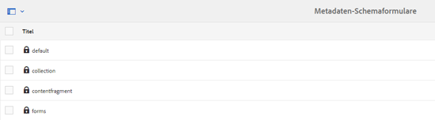

# Metadatenschemata {#metadata-schemas}

In Adobe Experience Manager (AEM) Assets definiert ein Metadaten-Schema das Layout der Eigenschaftsseite und die für Assets angezeigten Metadateneigenschaften, die das jeweilige Schema verwenden. Zu den Metadateneigenschaften zählen u. a. Titel, Beschreibung, MIME-Typen, Tags usw.

Sie können den Metadaten-Schema Forms-Editor verwenden, um vorhandene Schema zu ändern oder benutzerdefinierte Metadaten-Schema hinzuzufügen.

1. To view the properties page for an asset, click or tap the **[!UICONTROL View Properties]** from **[!UICONTROL Quick Actions]** on the asset tile in Card view.

   

   Alternatively, select an asset and then click or tap the **[!UICONTROL Properties]** icon from the toolbar.

   

1. Bearbeiten Sie die Eigenschaften der bearbeitbaren Metadaten unter den verschiedenen Registerkarten.

   

   Verwenden Sie zum Ändern des MIME-Typs für ein Asset ein benutzerdefiniertes Metadatenschema-Formular oder ändern Sie ein vorhandenes Formular. Weitere Informationen finden Sie unter [Bearbeiten von Metadatenschema-Formularen](metadata-schemas.md#editing-metadata-schema-forms). Wenn Sie das Metadatenschema für einen bestimmten MIME-Typ ändern, werden das Layout der Eigenschaftenseite für Assets mit dem aktuellen MIME-Typ und alle untergeordneten Asset-Typen geändert. For example, modifying a `jpeg` schema under `default/image` only modifies the metadata layout (asset properties) for assets with MIME type `IMAGE/JPEG`. Wenn Sie allerdings das Schema default ändern, wird dadurch das Metadatenlayout für alle Asset-Typen geändert.

1. Um eine Liste von Formularen/Vorlagen anzuzeigen, klicken Sie auf das AEM-Logo und navigieren Sie dann zu **[!UICONTROL Werkzeuge > Assets > Metadaten-Schemata]**.

   

   Die folgenden Vorlagen sind standardmäßig in AEM verfügbar:
   * **default**: Dies ist das Basisformular für Assets.

      Die folgenden untergeordneten Formulare übernehmen die Eigenschaften des Standardformulars:

      1. **image**: Schema-Formular für Assets mit dem MIME-Typ &quot;image&quot;, z. B. `image/jpeg`, `image/png`usw.

         Das Formular „image“ weist die folgenden untergeordneten Formularvorlagen auf:
         * **jpeg**: Schema-Formular für Assets mit Untertyp `jpeg`.
         * **tiff**: Schema-Formular für die Assets mit Untertyp `tiff`.
      1. **Anwendung**: Schema-Formular für Assets mit MIME-Typ `application`, z. B. `application/pdf`, `application/zip`usw.
         * **pdf**: Schema-Formular für Assets mit Untertyp `pdf`.
      1. **video**: Schema-Formular für Assets mit MIME-Typ `video`, z. B. `video/avi`, `video/mp4`usw.
   * **Sammlung**: Schema-Formular für Sammlungen.
   * **contentfragment:** Schema-Formular für Inhaltsfragmente.
   * **Formulare**: Dieses Schema-Formular bezieht sich auf [Adobe Experience Manager Forms](/help/forms/home.md).

>[!NOTE]
>
>Um die untergeordneten Formulare eines Schemaformulars anzuzeigen, klicken/tippen Sie auf den Namen des Schemaformulars.

## Hinzufügen von Metadatenschema-Formularen {#adding-a-metadata-schema-form}

1. To add a custom template to the list, click **[!UICONTROL Create]** from the toolbar.

   >[!NOTE]
   >
   >Für nicht bearbeitete Vorlagen wird ein Schloss-Symbol angezeigt. Wenn Sie eine der Vorlagen anpassen, wird das Sperrsymbol angezeigt, bevor die Vorlage ausgeblendet wird.

1. In the dialog, enter the title of the schema form and click **[!UICONTROL Create]** to complete the form creation process.

   

## Bearbeiten von Metadatenschema-Formularen {#editing-metadata-schema-forms}

Sie können ein neu hinzugefügtes oder vorhandenes Metadatenschema-Formular bearbeiten. Das Metadatenschemaformular enthält die folgenden Elemente:

* Registerkarten
* Formularelemente innerhalb von Registerkarten

Sie können diese Formularelemente einem Feld innerhalb eines Metdatenknotens im CRX-Repository zuordnen bzw. dafür konfigurieren.

Sie können dem Metadatenschema-Formular neue Registerkarten oder Formularelemente hinzufügen. Die Registerkarten und Formularelemente, die von der übergeordneten Komponente abgeleitet wurden, befinden sich im gesperrten Status. Sie können auf untergeordneter Ebene nicht geändert werden.

1. In the **[!UICONTROL Schema Forms]** page, select the check box before a form and then click **[!UICONTROL Edit]** on the toolbar.

   

1. Passen Sie auf der Seite **[!UICONTROL Metadatenschema-Editor]** die Eigenschaftsseite des Assets an, indem Sie mindestens eine Komponente aus der Liste der Komponententypen auf der Registerkarte **[!UICONTROL Formular erstellen]** auf die Registerkarte **[!UICONTROL Einfach]** ziehen.

   

1. Um eine Komponente zu konfigurieren, wählen Sie diese aus und ändern Sie ihre Eigenschaften auf der Registerkarte **[!UICONTROL Einstellungen]**.

### Komponenten auf der Registerkarte „Formular erstellen“{#components-within-the-build-form-tab}

The **[!UICONTROL Build Form]** tab lists form items that you use in your schema form. Die Registerkarte **[!UICONTROL Einstellungen]** enthält die Attribute für jedes Element, das Sie auf der Registerkarte **[!UICONTROL Formular erstellen]** auswählen. Die folgende Tabelle enthält die auf der Registerkarte **[!UICONTROL Formular erstellen]** verfügbaren Formularelemente:

| Komponentenname | Beschreibung |
|---|---|
| [!UICONTROL Bereichs-Kopfzeile] | Fügen Sie eine Abschnittsüberschrift für eine Liste allgemeiner Komponenten hinzu. |
| [!UICONTROL Einzelzeilentext] | Fügen Sie eine einzeilige Texteigenschaft hinzu. Diese wird als Zeichenfolge gespeichert. |
| [!UICONTROL Mehrwerttext] | Fügen Sie eine Texteigenschaft mit mehreren Werten hinzu. Diese wird als Zeichenfolgen-Array gespeichert. |
| [!UICONTROL Zahl] | Fügen Sie eine Zahlenkomponente hinzu. |
| [!UICONTROL Datum] | Fügen Sie eine Datumskomponente hinzu. |
| [!UICONTROL Dropdown] | Fügen Sie eine Dropdown-Liste hinzu. |
| [!UICONTROL Standard-Tags] | Fügen Sie ein Tag hinzu. |
| [!UICONTROL Smart-Tags] | Fügen Sie automatisch Metadaten-Tags hinzu, um Suchfunktionen zu ergänzen. |
| [!UICONTROL Ausgeblendetes Feld] | Fügen Sie ein ausgeblendetes Feld hinzu. Dieses wird beim Speichern des Assets als POST-Parameter gesendet. |
| [!UICONTROL Asset referenziert von] | Fügen Sie diese Komponente hinzu, um eine Liste der vom Asset referenzierten Assets anzuzeigen. |
| [!UICONTROL Asset-Verweise] | Fügen Sie dies hinzu, um eine Liste der Assets anzuzeigen, die das Asset referenzieren. |
| [!UICONTROL Produktverweise] | Fügen Sie dies hinzu, um die Liste der mit dem Asset verknüpften Produkte anzuzeigen. |
| [!UICONTROL Asset-Bewertung] | Fügen Sie dies hinzu, um Optionen zur Bewertung des Assets anzuzeigen. |
| [!UICONTROL Kontextuelle Metadaten] | Fügen Sie diese Komponente hinzu, um weitere Metadaten auf der Seite „Eigenschaften“ von Assets anzuzeigen. |

### Bearbeiten von Metadatenkomponenten {#editing-the-metadata-component}

Um die Eigenschaften einer Metadatenkomponente im Formular zu bearbeiten, klicken Sie auf die Komponente und bearbeiten Sie alle Eigenschaften oder einen Teil der folgenden Eigenschaften auf der Registerkarte **[!UICONTROL Einstellungen]**.

**Feldbeschriftung**: Der Name der Metadateneigenschaft, die auf der Eigenschaftenseite für das Asset angezeigt wird.

**Zu Eigenschaft zuordnen**: Diese Eigenschaft gibt den relativen Pfad/Namen zum Asset-Knoten an, unter dem die Eigenschaft im CRX-Repository gespeichert ist. It starts with `./` because indicating that the path is under the asset&#39;s node.

Im Folgenden finden Sie die gültigen Werte für diese Eigenschaft:

* `./jcr:content/metadata/dc:title`: Speichert den Wert im Metadatenknoten des Assets als die Eigenschaft `dc:title`.

* `./jcr:created`: Zeigt die JCR-Eigenschaft am Asset-Knoten an. Wenn Sie diese Eigenschaften für Ansichtseigenschaften konfigurieren, wird empfohlen, dass Sie sie mit „Bearbeitung deaktivieren“ markieren, da sie geschützt sind. Otherwise, the error [!UICONTROL Asset(s) failed to modify] results when you save the asset&#39;s properties.

Um sicherzustellen, dass die Komponente im Metadaten-Schemaformular korrekt angezeigt wird, sollte der Eigenschaftenpfad keine Leerzeichen enthalten.

**Platzhalter**: Geben Sie mit dieser Eigenschaft relevanten Platzhaltertext zur Metadateneigenschaft an.

**Erforderlich**: Mit dieser Eigenschaft können Sie eine Metadateneigenschaft auf der Eigenschaftenseite als obligatorisch markieren.

**Bearbeitung deaktivieren**: Mit dieser Eigenschaft können Sie verhindern, dass eine Metadateneigenschaft auf der Eigenschaftenseite bearbeitet werden kann.

**Leeres Feld schreibgeschützt anzeigen**: Markieren Sie diese Eigenschaft, um eine Metadateneigenschaft auch dann auf der Eigenschaftenseite anzuzeigen, wenn sie keinen Wert aufweist. Standardmäßig werden Metadateneigenschaften ohne Werte nicht auf der Eigenschaftenseite aufgeführt.

**Reihenfolge** der Liste anzeigen: Verwenden Sie diese Eigenschaft, um eine geordnete Liste von Auswahlmöglichkeiten anzuzeigen

**Wahlen**: Mit dieser Eigenschaft legen Sie Optionen in einer Liste fest.

**Beschreibung**: Mit dieser Eigenschaft können Sie eine kurze Beschreibung für die Metadatenkomponente hinzufügen.

**Klasse**: Objektklasse, der die Eigenschaft zugeordnet ist.

**Löschen-Symbol** Klicken Sie auf dieses Symbol, um eine Komponente aus dem Schema-Formular zu löschen.

>[!NOTE]
>
>Die Komponente „Verborgenes Feld“ enthält diese Attribute nicht. Sie enthält stattdessen Eigenschaften wie die Attribute „Name“, „Wert“, „Feldbezeichnung“ und „Beschreibung“. Die Werte für die Komponente „Ausgeblendetes Feld“ werden beim Speichern des Assets als POST-Parameter gesendet. Sie werden nicht als Metadaten für das Asset gespeichert.

Wenn Sie die Option **[!UICONTROL Erforderlich]** auswählen, können Sie nach Assets suchen, denen obligatorische Metadaten fehlen. Erweitern Sie im Bedienfeld **[!UICONTROL Filter]** die Eigenschaft **[!UICONTROL Metadatenvalidierung]** und wählen Sie die Option **[!UICONTROL Ungültig]**. Die Suchergebnisse zeigen Assets an, denen erforderliche Metadaten fehlen, die Sie über das Schemaformular konfiguriert haben.

Wenn Sie die Komponente &quot;Kontextuelle Metadaten&quot;zu einer Registerkarte eines beliebigen Schema-Formulars hinzufügen, wird die Komponente als Liste auf der Seite &quot;Eigenschaften&quot;von Assets angezeigt, auf die das jeweilige Schema angewendet wird. Die Liste enthält alle anderen Registerkarten mit Ausnahme der Registerkarte, auf die Sie die Komponente &quot;Kontextuelle Metadaten&quot;angewendet haben. Derzeit bietet diese Funktion grundlegende Funktionalität zur Steuerung der Anzeige von Metadaten, die auf dem Kontext basieren.

Wenn Sie auf der Eigenschaftenseite zusätzlich zur Registerkarte, auf die die Komponente „Kontextuelle Metadaten“ angewendet wird, eine weitere Registerkarte aufnehmen möchten, wählen Sie die Registerkarte aus der Liste aus. Die Registerkarte wird der Eigenschaftenseite hinzugefügt.

### Specify properties in JSON file {#specifying-properties-in-json-file}

Statt Eigenschaften für die Optionen auf der Registerkarte **[!UICONTROL Einstellungen]** anzugeben, können Sie die Optionen in einer JSON-Datei definieren, indem Sie entsprechende Schlüssel-Wert-Paare angeben. Geben Sie den Pfad der JSON-Datei im Feld **[!UICONTROL JSON-Pfad]** an.

### Hinzufügen oder Löschen von Registerkarten im Schemaformular {#adding-deleting-a-tab-in-the-schema-form}

Mit dem Schema-Editor können Sie Registerkarten hinzufügen oder löschen. Das Standardschemaformular enthält standardmäßig die Registerkarten **[!UICONTROL Einfach]**, **[!UICONTROL Erweitert]**, **[!UICONTROL IPTC]** und **[!UICONTROL IPTC-Erweiterung]**.

Click `+` to add a new tab on a schema form. By default, the new tab has the name `Unnamed-1`. You can modify the name from the **[!UICONTROL Settings]** tab. Click `X` to delete a tab.

## Löschen von Metadatenschema-Formularen {#deleting-metadata-schema-forms}

In AEM können Sie nur benutzerdefinierte Schemaformulare löschen. Die Standardschemaformulare/-vorlagen können nicht gelöscht werden. Sie können aber alle benutzerdefinierten Änderungen in diesen Formularen löschen.

Um ein Formular zu löschen, wählen Sie das Formular aus und klicken Sie auf das Symbol **[!UICONTROL Löschen]**.

>[!NOTE]
>
>Nachdem Sie benutzerdefinierte Änderungen an einem Standardformular gelöscht haben, wird das Sperrsymbol auf der Benutzeroberfläche des Metadaten-Schemas erneut angezeigt, um anzuzeigen, dass das Formular wieder den Standardstatus erreicht hat.

>[!NOTE]
>
>Die Standard-Metadatenschemaformulare in AEM Assets können nicht gelöscht werden.

## Schemaformulare für MIME-Typen {#schema-forms-for-mime-types}

AEM Assets stellt voreingestellte Standardformulare für verschiedene MIME-Typen bereit. Sie können jedoch benutzerdefinierte Formulare für verschiedene MIME-Typen hinzufügen.

### Add new forms for MIME types {#adding-new-forms-for-mime-types}

Erstellen Sie ein neues Formular unter dem entsprechenden Formulartypen. For example, to add a new template for the `image/png` subtype, create the form under the `image` forms. Der Titel für das Schemaformular ist der Name des Untertyps. In this case, the title is `png`.

### Use an existing schema template for various MIME types {#using-an-existing-schema-template-for-various-mime-types}

Sie können eine vorhandene Vorlage für einen anderen MIME-Typ verwenden. For example, use the `image/jpeg` form for assets of MIME type `image/png`.

Erstellen Sie in diesem Fall einen neuen Knoten unter `/etc/dam/metadataeditor/mimetypemappings` im CRX-Repository. Geben Sie einen Namen für den Knoten an und definieren Sie die folgenden Eigenschaften:

| Name | Beschreibung | Typ | Wert |
|---|---|---|---|
| `exposedmimetype` | Name des vorhandenen Formulars, das zugeordnet werden soll | `String` | `image/jpeg` |
| `mimetypes` | Liste der MIME-Typen, die das im Attribut `exposedmimetype` definierte Formular verwenden | `String` | `image/png` |

AEM Assets ordnet die folgenden MIME-Typen und Schemaformulare zu:

| Schemaformular | MIME-Typen |
|---|---|
| image/jpeg | image/pjpeg |
| image/tiff | image/x-tiff |
| application/pdf | application/postscript |
| application/x-ImageSet | Multipart/Related; type=application/x-ImageSet |
| application/x-SpinSet | Multipart/Related; type=application/x-SpinSet |
| application/x-MixedMediaSet | Multipart/Related; type=application/x-MixedMediaSet |
| video/quicktime | video/x-quicktime |
| video/mpeg4 | video/mp4 |
| video/avi | video/avi, video/msvideo, video/x-msvideo |
| video/wmv | video/x-ms-wmv |
| video/flv | video/x-flv |

## Zugriff auf Metadatenschemata gewähren {#granting-access-to-metadata-schemas}

Die Metadaten-Schema-Funktion steht nur Administratoren zur Verfügung. Administratoren können jedoch Benutzern ohne Administratorrechte Zugriff gewähren, indem sie **[!UICONTROL Berechtigungen zum Erstellen]**, **[!UICONTROL Ändern]** und **[!UICONTROL Löschen]** für den `/conf` Ordner bereitstellen.

## Anwenden von ordnerspezifischen Metadaten {#applying-folder-specific-metadata}

Mit AEM Assets können Sie Varianten eines Metadatenschemas definieren und auf einen bestimmten Ordner anwenden.

Zum Beispiel können Sie eine Variante des Standard-Metadatenschemas definieren und diese auf einen Ordner anwenden. Das ursprüngliche Standard-Metadatenschema wird dabei überschrieben.

Die Änderungen aus der Variante betreffen nur die Assets in dem Ordner, auf den das Schema angewendet wird.

Assets in anderen Ordnern, für die das ursprüngliche Schema gilt, entsprechen weiterhin den im ursprünglichen Schema definierten Metadaten.

Die Metadatenübernahme durch Assets richtet sich nach dem Schema, das auf den Ordner der ersten Ebene in der Hierarchie angewendet wird. Assets in Ordnern, die keine Unterordner enthalten, übernehmen die Metadaten aus dem Schema, das auf ihren Ordner angewendet wird.

Assets in Unterordnern übernehmen die Metadaten aus dem Schema, das auf den Unterordner angewendet wurde, wenn es sich um ein anderes Schema handelt als das des übergeordneten Ordners. Assets in Unterordnern, auf die kein Schema oder dasselbe Schema wie auf den übergeordneten Ordner angewendet wurde, übernehmen die Metadaten des Schemas für den übergeordneten Ordner.

1. Klicken Sie auf das AEM-Logo und navigieren Sie dann zu **[!UICONTROL Werkzeuge > Assets > Metadaten-Schemata]**. Die Seite **[!UICONTROL Metadaten-Schemaformulare]** wird angezeigt.
1. Aktivieren Sie das Kontrollkästchen vor einem Formular, z. B. dem Standard-Metadatenformular, klicken oder tippen Sie auf das Symbol **[!UICONTROL Kopieren]** und speichern Sie es als benutzerdefiniertes Formular. Specify a custom name for the form, for example `my_default`. Alternativ können Sie ein benutzerdefiniertes Formular erstellen.

   

1. In the **[!UICONTROL Metadata Schema Forms]** page, select the `my_default` form, and then click **[!UICONTROL Edit]**.

1. In the **[!UICONTROL Metadata Schema Editor]** page, add a text field to the schema form. For example add a field with the label **[!UICONTROL Category]**.

   

1. Klicken Sie auf **[!UICONTROL Speichern]**. Das geänderte Formular wird auf der Seite **[!UICONTROL Metadatenschema-Formulare]** aufgeführt.
1. Klicken/tippen Sie in der Symbolleiste auf **[!UICONTROL Auf Ordner anwenden]**, um die benutzerdefinierten Metadaten auf einen Ordner anzuwenden.

   

1. Select the folder on which to apply the modified schema and then click/tap **[!UICONTROL Apply]**.

   

1. Wurde das andere Metadatenschema auf den Ordner angewendet, erhalten Sie eine Meldung mit der Warnung, dass Sie im Begriff sind, das vorhandene Metadatenschema zu überschreiben. Click **[!UICONTROL Overwrite]**.
1. Click **[!UICONTROL OK]** to close the success message.
1. Navigieren Sie zu dem Ordner, auf den Sie das geänderte Metadatenschema angewendet haben.

## Definieren obligatorischer Metadaten {#defining-mandatory-metadata}

Sie können Pflichtfelder auf Ordnerebene definieren, die für in den Ordner hochgeladene Assets erzwungen werden. Wenn Sie Assets mit fehlenden Metadaten für die zuvor definierten Pflichtfelder hochladen, wird in der Kartenansicht ein entsprechender visueller Hinweis für die Assets angezeigt.

>[!NOTE]
>
>Ein Metadatenfeld kann je nach dem Wert eines weiteren Felds als Pflichtfeld definiert werden. In der Kartenansicht zeigt AEM keine Warnung zu fehlenden Metadaten für solche obligatorischen Metadatenfelder an.

1. Klicken Sie auf das AEM-Logo und navigieren Sie dann zu **[!UICONTROL Werkzeuge > Assets > Metadaten-Schemata]**. Die Seite **[!UICONTROL Metadaten-Schemaformulare]** wird angezeigt.
1. Speichern Sie die Standard-Metadatenformulare als benutzerdefiniertes Formular. Speichern Sie es beispielsweise unter `my_default`.

   

1. Bearbeiten Sie das benutzerdefinierte Formular. Fügen Sie ein erforderliches Feld hinzu. For example, add a **Category** field and make the field mandatory.

   

1. Klicken Sie auf **[!UICONTROL Speichern]**. Das geänderte Formular wird auf der Seite **[!UICONTROL Metadatenschema-Formulare]** aufgeführt. Um die benutzerspezifischen Metadaten auf einen Ordner anzuwenden, wählen Sie das Formular aus und klicken Sie in der Symbolleiste auf &quot;Auf Ordner **[!UICONTROL anwenden&quot;]** bzw. tippen Sie darauf.

1. Navigieren Sie zum Ordner und laden Sie einige Assets mit fehlenden Metadaten für das Pflichtfeld, das Sie dem benutzerdefinierten Formular hinzugefügt haben. Die Kartenansicht für die Assets zeigt eine Meldung zu den fehlenden Metadaten für das Pflichtfeld an.

   

1. (Optional) Zugriff `http://[server]:[port]/system/console/components/`. Configure and enable `com.day.cq.dam.core.impl.MissingMetadataNotificationJob` component that is disabled by default. Legen Sie fest, mit welcher Häufigkeit AEM die Gültigkeit der Metadaten in den Assets überprüft.
Diese Konfiguration fügt eine Eigenschaft `hasValidMetadata` zu jcr:content in Assets hinzu. Mit dieser Eigenschaft kann AEM die Ergebnisse in einer Suche filtern.

>[!NOTE]
>
>If an asset is added after the scheduled check, the asset is not flagged with `hasValidMetadata` until  the next scheduled check. Die Assets werden nicht in den Zwischensuchergebnissen angezeigt.

>[!CVorsicht]
>
>Die Metadaten-Überprüfungen sind ressourcenintensiv und können die Leistung Ihres Systems beeinträchtigen. Planen Sie die Überprüfungen entsprechend. Wenn bei der AEM-Bereitstellung Leistungsprobleme auftreten, deaktivieren Sie diesen Auftrag.
