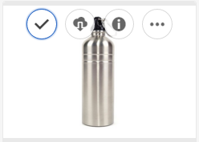
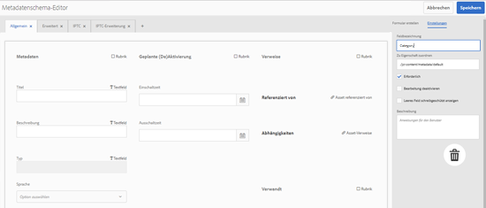

# Metadatenschemata    {#metadata-schemas}

In [!DNL Experience Manager Assets] definiert ein Metadatenschema das Layout der Eigenschaftenseite und die für Assets angezeigten Metadateneigenschaften, die das bestimmte Schema verwenden. Zu den Metadateneigenschaften zählen u. a. Titel, Beschreibung, MIME-Typen, Tags usw. Mit dem Editor für Metadaten-Schemaformulare können Sie vorhandene Schemata ändern oder benutzerdefinierte Metadatenschemata hinzufügen.

Gehen Sie wie folgt vor, um die Eigenschaftenseite für ein Asset anzuzeigen und zu bearbeiten:

1. Klicken oder tippen Sie in den Schnellaktionen auf der Asset-Kachel in der Kartenansicht auf **[!UICONTROL Eigenschaften anzeigen]** .

   

   Alternativ können Sie ein Asset auswählen und dann in der Symbolleiste auf das Symbol **[!UICONTROL Eigenschaften]** klicken oder tippen.

   

1. Sie können die verschiedenen Eigenschaften bearbeitbarer Metadaten auf den verfügbaren Registerkarten bearbeiten. Sie können das Asset jedoch nicht ändern [!UICONTROL Typ] auf der Registerkarte [!UICONTROL Einfach] der Eigenschaftenseite.

   

   Verwenden Sie zum Ändern des MIME-Typs für ein Asset ein benutzerdefiniertes Metadatenschema-Formular oder ändern Sie ein vorhandenes Formular. Weitere Informationen finden Sie unter [Bearbeiten von Metadatenschema-Formularen](metadata-schemas.md#editing-metadata-schema-forms). Wenn Sie das Metadatenschema für einen bestimmten MIME-Typ ändern, werden das Layout der Eigenschaftenseite für Assets mit dem aktuellen MIME-Typ und alle untergeordneten Asset-Typen geändert. Wenn beispielsweise ein `jpeg`-Schema unter `default/image` geändert wird, wird nur das Metadatenlayout (Asset-Eigenschaften) für Assets mit dem MIME-Typ `IMAGE/JPEG` geändert. Wenn Sie allerdings das „default“-Schema ändern, wird dadurch das Metadaten-Layout für alle Asset-Typen geändert.

## Metadaten-Schemaformulare {#default-metadata-schema-forms}

Um eine Liste von Formularen/Vorlagen anzuzeigen, navigieren Sie in der [!DNL Experience Manager]-Benutzeroberfläche zu **[!UICONTROL Tools]** > **[!UICONTROL Assets]** > **[!UICONTROL Metadatenschemata]**.

[!DNL Experience Manager] stellt die folgenden Metadatenschema-Formularvorlagen bereit:

| Vorlagen |  | Beschreibung |
|---|---|---|
| [!UICONTROL default] |  | Dies ist das Basisformular für Assets. |
|  | Die folgenden untergeordneten Formulare übernehmen die Eigenschaften des Formulars [!UICONTROL default]: |  |
|  | <ul><li> [!UICONTROL dm_video]</li></ul> | Schemaformular für Dynamic Media-Videos. |
|  | <ul><li> [!UICONTROL image]</li></ul> | Schemaformular für Assets mit dem MIME-Typ &quot;image&quot;, z. B. image/jpeg, image/png usw.   Das   Formular weist die folgenden untergeordneten Formularvorlagen auf: <ul><li> [!UICONTROL jpeg]: Schemaformular für Assets mit dem Untertyp  [!UICONTROL jpeg].</li> <li>[!UICONTROL tiff]: Schemaformular für die Assets mit dem Untertyp  [!UICONTROL tiff].</li></ul> |
|  | <ul><li> [!UICONTROL Anwendung]</li></ul> | Schemaformular für Assets mit dem MIME-Typ &quot;application&quot;, z. B. application/ pdf, application/ zip usw.  [!UICONTROL pdf]: Schemaformular für Assets mit dem Untertyp &quot;pdf&quot;. |
|  | <ul><li>[!UICONTROL Video]</li></ul> | Schemaformular für Assets mit dem MIME-Typ „video“, beispielsweise video/avi, video/mp4 usw. |
| [!UICONTROL collection] |  | Schemaformular für Sammlungen. |
| [!UICONTROL contentfragment] |  | Schemaformular für Inhaltsfragmente. |
| [!UICONTROL forms] |  | Dieses Schemaformular bezieht sich auf [Adobe Experience Manager Forms](/help/forms/home.md). |

>[!NOTE]
>
>Um die untergeordneten Formulare eines Schemaformulars anzuzeigen, klicken/tippen Sie auf den Namen des Schemaformulars.

## Hinzufügen von Metadatenschema-Formularen {#adding-a-metadata-schema-form}

1. Um eine benutzerdefinierte Vorlage zur Liste hinzuzufügen, klicken Sie in der Symbolleiste auf **[!UICONTROL Erstellen]**.

   >[!NOTE]
   >
   >Nicht bearbeitete Vorlagen weisen ihnen ein Sperrsymbol zu. Wenn Sie eine Vorlage anpassen, wird das Sperrsymbol vor der Vorlage ausgeblendet.

1. Geben Sie im Dialogfeld den Titel des Schemaformulars ein und klicken Sie auf **[!UICONTROL Erstellen]** , um den Formularerstellungsprozess abzuschließen.

   

## Bearbeiten von Metadatenschema-Formularen {#editing-metadata-schema-forms}

Sie können ein neu hinzugefügtes oder vorhandenes Metadatenschema-Formular bearbeiten. Das Metadatenschemaformular enthält die folgenden Elemente:

* Registerkarten
* Formularelemente innerhalb von Registerkarten

Sie können diese Formularelemente einem Feld innerhalb eines Metdatenknotens im CRX-Repository zuordnen bzw. dafür konfigurieren.

Sie können dem Metadatenschema-Formular neue Registerkarten oder Formularelemente hinzufügen. Die vom übergeordneten Objekt abgeleiteten Registerkarten und Formularelemente sind gesperrt. Sie können auf untergeordneter Ebene nicht geändert werden.

1. Aktivieren Sie auf der Seite **[!UICONTROL Schema Forms]** das Kontrollkästchen vor einem Formular und klicken Sie dann in der Symbolleiste auf **[!UICONTROL Bearbeiten]** .

   

1. Passen Sie auf der Seite **[!UICONTROL Metadatenschema-Formular]** die Eigenschaftenseite des Assets an, indem Sie Komponenten aus der Komponentenliste auf der Registerkarte **[!UICONTROL Formular erstellen]** in die Registerkarte **[!UICONTROL Basis]** ziehen.

   

1. Um eine Komponente zu konfigurieren, wählen Sie diese aus und ändern Sie ihre Eigenschaften auf der Registerkarte **[!UICONTROL Einstellungen]**.

### Komponenten auf der Registerkarte „Formular erstellen“{#components-within-the-build-form-tab}

Die Registerkarte **[!UICONTROL Formular erstellen]** enthält Formularelemente, die Sie im Schemaformular verwenden. Die Registerkarte **[!UICONTROL Einstellungen]** enthält die Attribute für jedes Element, das Sie auf der Registerkarte **[!UICONTROL Formular erstellen]** auswählen. Die folgende Tabelle enthält die auf der Registerkarte **[!UICONTROL Formular erstellen]** verfügbaren Formularelemente:

| Komponentenname | Beschreibung |
|---|---|
| [!UICONTROL Bereichs-Kopfzeile] | Fügen Sie eine Abschnittsüberschrift für eine Liste allgemeiner Komponenten hinzu. |
| [!UICONTROL Einzelzeilentext] | Fügen Sie eine einzeilige Texteigenschaft hinzu. Diese wird als Zeichenfolge gespeichert. |
| [!UICONTROL Mehrwerttext] | Fügen Sie eine Texteigenschaft mit mehreren Werten hinzu. Diese wird als Zeichenfolgen-Array gespeichert. |
| [!UICONTROL Zahl] | Fügen Sie eine Zahlenkomponente hinzu. |
| [!UICONTROL Datum] | Fügen Sie eine Datumskomponente hinzu. |
| [!UICONTROL Dropdown] | Fügen Sie eine Dropdown-Liste hinzu. |
| [!UICONTROL Standard-Tags] | Fügen Sie ein Tag hinzu. |
| [!UICONTROL Smart-Tags] | Fügen Sie automatisch Metadaten-Tags hinzu, um Suchfunktionen zu ergänzen. |
| [!UICONTROL Ausgeblendetes Feld] | Fügen Sie ein ausgeblendetes Feld hinzu. Dieses wird beim Speichern des Assets als POST-Parameter gesendet. |
| [!UICONTROL Asset referenziert von] | Fügen Sie diese Komponente hinzu, um eine Liste der vom Asset referenzierten Assets anzuzeigen. |
| [!UICONTROL Asset-Verweise] | Fügen Sie dies hinzu, um eine Liste der Assets anzuzeigen, die das Asset referenzieren. |
| [!UICONTROL Produktverweise] | Fügen Sie dies hinzu, um die Liste der mit dem Asset verknüpften Produkte anzuzeigen. |
| [!UICONTROL Asset-Bewertung] | Fügen Sie dies hinzu, um Optionen zur Bewertung des Assets anzuzeigen. |
| [!UICONTROL Kontextuelle Metadaten] | Fügen Sie diese Komponente hinzu, um weitere Metadaten auf der Seite „Eigenschaften“ von Assets anzuzeigen. |

### Bearbeiten von Metadatenkomponenten {#editing-the-metadata-component}

Um die Eigenschaften einer Metadatenkomponente im Formular zu bearbeiten, klicken Sie auf die Komponente und bearbeiten Sie alle Eigenschaften oder einen Teil der folgenden Eigenschaften auf der Registerkarte **[!UICONTROL Einstellungen]**.

**Feldbezeichnung**: Der Name der Metadateneigenschaft, der auf der Eigenschaftenseite des Assets angezeigt wird.

**Zu Eigenschaft zuordnen**: Diese Eigenschaft gibt den relativen Pfad/Namen zum Asset-Knoten an, unter dem die Eigenschaft im CRX-Repository gespeichert ist. Sie beginnt mit `./`, um anzugeben, dass der Pfad sich unter dem Knoten des Assets befindet.

Im Folgenden finden Sie die gültigen Werte für diese Eigenschaft:

* `./jcr:content/metadata/dc:title`: Speichert den Wert im Metadatenknoten des Assets als die Eigenschaft `dc:title`.

* `./jcr:created`: Zeigt die JCR-Eigenschaft im Knoten des Assets an. Wenn Sie diese Eigenschaften für Ansichtseigenschaften konfigurieren, wird empfohlen, dass Sie sie mit „Bearbeitung deaktivieren“ markieren, da sie geschützt sind. Andernfalls konnte der Fehler [!UICONTROL Asset(s) nicht geändert werden] Ergebnisse, wenn Sie die Eigenschaften des Assets speichern.

Um sicherzustellen, dass die Komponente im Metadaten-Schemaformular korrekt angezeigt wird, sollte der Eigenschaftenpfad keine Leerzeichen enthalten.

**Platzhalter**: Geben Sie mit dieser Eigenschaft relevanten Platzhaltertext zur Metadateneigenschaft an.

**Erforderlich**: Mit dieser Eigenschaft können Sie eine Metadateneigenschaft auf der Eigenschaftenseite als obligatorisch markieren.

**Bearbeitung deaktivieren**: Mit dieser Eigenschaft können Sie verhindern, dass eine Metadateneigenschaft auf der Eigenschaftenseite bearbeitet werden kann.

**Leeres Feld schreibgeschützt anzeigen**: Markieren Sie diese Eigenschaft, um eine Metadateneigenschaft auch dann auf der Eigenschaftenseite anzuzeigen, wenn sie keinen Wert aufweist. Standardmäßig werden Metadateneigenschaften ohne Werte nicht auf der Eigenschaftenseite aufgeführt.

**Liste geordnet anzeigen**: Mit dieser Eigenschaft zeigen Sie eine geordnete Liste von Optionen an.

**Wahlen**: Mit dieser Eigenschaft legen Sie Optionen in einer Liste fest.

**Beschreibung**: Mit dieser Eigenschaft können Sie eine kurze Beschreibung für die Metadatenkomponente hinzufügen.

**Klasse**: Objektklasse, der die Eigenschaft zugeordnet ist.

**Symbol** löschen Klicken Sie auf dieses Symbol, um eine Komponente aus dem Schemaformular zu löschen.

>[!NOTE]
>
>Die Komponente „Verborgenes Feld“ enthält diese Attribute nicht. Sie enthält stattdessen Eigenschaften wie die Attribute „Name“, „Wert“, „Feldbezeichnung“ und „Beschreibung“. Die Werte für die Komponente „Ausgeblendetes Feld“ werden beim Speichern des Assets als POST-Parameter gesendet. Sie werden nicht als Metadaten für das Asset gespeichert.

Wenn Sie die Option **[!UICONTROL Erforderlich]** auswählen, können Sie nach Assets suchen, denen obligatorische Metadaten fehlen. Erweitern Sie im Bedienfeld **[!UICONTROL Filter]** die Eigenschaft **[!UICONTROL Metadatenvalidierung]** und wählen Sie die Option **[!UICONTROL Ungültig]**. Die Suchergebnisse zeigen Assets an, denen erforderliche Metadaten fehlen, die Sie über das Schemaformular konfiguriert haben.

Wenn Sie die Komponente &quot;Kontextuelle Metadaten&quot;zu einer Registerkarte eines Schemaformulars hinzufügen, wird die Komponente auf der Eigenschaftenseite von Assets, auf die das bestimmte Schema angewendet wird, als Liste angezeigt. Die Liste enthält alle anderen Registerkarten außer der Registerkarte, auf die Sie die Komponente „Kontextuelle Metadaten“ angewendet haben. Derzeit bietet diese Funktion grundlegende Funktionalität zur Steuerung der Anzeige von Metadaten, die auf dem Kontext basieren.

Wenn Sie auf der Eigenschaftenseite zusätzlich zur Registerkarte, auf die die Komponente „Kontextuelle Metadaten“ angewendet wird, eine weitere Registerkarte aufnehmen möchten, wählen Sie die Registerkarte aus der Liste aus. Die Registerkarte wird der Eigenschaftenseite hinzugefügt.

### Festlegen von Eigenschaften in einer JSON-Datei {#specifying-properties-in-json-file}

Anstatt die Eigenschaften für die Optionen auf der Registerkarte **[!UICONTROL Einstellungen]** anzugeben, können Sie die Optionen in einer JSON-Datei definieren, indem Sie die entsprechenden Schlüssel/Wert-Paare angeben. Geben Sie den Pfad der JSON-Datei im Feld **[!UICONTROL JSON-Pfad]** an.

### Hinzufügen oder Löschen von Registerkarten im Schemaformular {#adding-deleting-a-tab-in-the-schema-form}

Mit dem Schema-Editor können Sie Registerkarten hinzufügen oder löschen. Das Standard-Schemaformular umfasst standardmäßig die Registerkarten **[!UICONTROL Standard]**, **[!UICONTROL Erweitert]**, **[!UICONTROL IPTC]** und **[!UICONTROL IPTC-Erweiterung]**.

Klicken Sie auf `+`, um einem Schemaformular eine neue Registerkarte hinzuzufügen. Standardmäßig hat die neue Registerkarte den Namen `Unnamed-1`. Sie können den Namen auf der Registerkarte **[!UICONTROL Einstellungen]** ändern. Klicken Sie auf `X`, um eine Registerkarte zu löschen.

## Löschen von Metadatenschema-Formularen {#deleting-metadata-schema-forms}

In AEM können Sie nur benutzerdefinierte Schemaformulare löschen. Die Standardschemaformulare/-vorlagen können nicht gelöscht werden. Sie können aber alle benutzerdefinierten Änderungen in diesen Formularen löschen.

Um ein Formular zu löschen, wählen Sie das Formular aus und klicken Sie auf das Symbol **[!UICONTROL Löschen]**.

>[!NOTE]
>
>Nachdem Sie benutzerdefinierte Änderungen an einem Standardformular gelöscht haben, wird das Sperrsymbol erneut auf der Benutzeroberfläche des Metadatenschemas angezeigt, um anzugeben, dass das Formular wieder in den Standardzustand versetzt wurde.

>[!NOTE]
>
>Die Standard-Metadatenschemaformulare in AEM Assets können nicht gelöscht werden.

## Schemaformulare für MIME-Typen    {#schema-forms-for-mime-types}

AEM Assets stellt voreingestellte Standardformulare für verschiedene MIME-Typen bereit. Sie können jedoch benutzerdefinierte Formulare für verschiedene MIME-Typen hinzufügen.

### Hinzufügen neuer Formulare für MIME-Typen {#adding-new-forms-for-mime-types}

Erstellen Sie ein neues Formular unter dem entsprechenden Formulartyp. Um beispielsweise eine neue Vorlage für den Untertyp `image/png` hinzuzufügen, erstellen Sie das Formular unter den Formularen `image`. Der Titel für das Schemaformular ist der Name des Untertyps. In diesem Fall ist der Titel `png`.

### Verwenden Sie eine vorhandene Schemavorlage für verschiedene MIME-Typen {#using-an-existing-schema-template-for-various-mime-types}

Sie können eine vorhandene Vorlage für einen anderen MIME-Typ verwenden. Nutzen Sie beispielsweise das Formular `image/jpeg` für Assets mit dem MIME-Typ `image/png`.

Erstellen Sie in diesem Fall einen neuen Knoten unter `/etc/dam/metadataeditor/mimetypemappings` im CRX-Repository. Geben Sie einen Namen für den Knoten an und definieren Sie die folgenden Eigenschaften:

| Name | Beschreibung | Typ | Wert |
|---|---|---|---|
| `exposedmimetype` | Name des vorhandenen Formulars, das zugeordnet werden soll | `String` | `image/jpeg` |
| `mimetypes` | Liste der MIME-Typen, die das im Attribut `exposedmimetype` definierte Formular verwenden | `String` | `image/png` |

AEM Assets ordnet die folgenden MIME-Typen und Schemaformulare zu:

| Schemaformular | MIME-Typen |
|---|---|
| image/jpeg | image/pjpeg |
| image/tiff | image/x-tiff |
| application/pdf | application/postscript |
| application/x-ImageSet | Multipart/Related; type=application/x-ImageSet |
| application/x-SpinSet | Multipart/Related; type=application/x-SpinSet |
| application/x-MixedMediaSet | Multipart/Related; type=application/x-MixedMediaSet |
| video/quicktime | video/x-quicktime |
| video/mpeg4 | video/mp4 |
| video/avi | video/avi, video/msvideo, video/x-msvideo |
| video/wmv | video/x-ms-wmv |
| video/flv | video/x-flv |

## Zugriff auf Metadatenschemata gewähren {#granting-access-to-metadata-schemas}

Die Metadatenschema-Funktion steht nur Administratoren zur Verfügung. Administratoren können Benutzern ohne Administratorrechte jedoch Zugriff gewähren, indem sie **[!UICONTROL Erstellen]**, **[!UICONTROL Ändern]** und **[!UICONTROL Löschen]** Berechtigungen für den Ordner `/conf` bereitstellen.

## Anwenden von ordnerspezifischen Metadaten {#applying-folder-specific-metadata}

Mit AEM Assets können Sie Varianten eines Metadatenschemas definieren und auf einen bestimmten Ordner anwenden.

Zum Beispiel können Sie eine Variante des Standard-Metadatenschemas definieren und diese auf einen Ordner anwenden. Das ursprüngliche Standard-Metadatenschema wird dabei überschrieben.

Die Änderungen aus der Variante betreffen nur die Assets in dem Ordner, auf den das Schema angewendet wird.

Assets in anderen Ordnern, für die das ursprüngliche Schema gilt, entsprechen weiterhin den im ursprünglichen Schema definierten Metadaten.

Die Metadatenübernahme durch Assets richtet sich nach dem Schema, das auf den Ordner der ersten Ebene in der Hierarchie angewendet wird. Assets in Ordnern, die keine Unterordner enthalten, übernehmen die Metadaten aus dem Schema, das auf ihren Ordner angewendet wird.

Assets in Unterordnern übernehmen die Metadaten aus dem Schema, das auf den Unterordner angewendet wurde, wenn es sich um ein anderes Schema handelt als das des übergeordneten Ordners. Assets in Unterordnern, auf die kein Schema oder dasselbe Schema wie auf den übergeordneten Ordner angewendet wurde, übernehmen die Metadaten des Schemas für den übergeordneten Ordner.

1. Klicken Sie auf das AEM-Logo und navigieren Sie zu **[!UICONTROL Tools > Assets > Metadatenschemata]**. Die Seite **[!UICONTROL Metadatenschema-Formulare]** wird angezeigt.
1. Aktivieren Sie das Kontrollkästchen vor einem Formular, z. B. dem Standard-Metadatenformular, klicken oder tippen Sie auf das Symbol **[!UICONTROL Kopieren]** und speichern Sie es als benutzerdefiniertes Formular. Geben Sie einen benutzerdefinierten Namen für das Formular an, beispielsweise `my_default`. Alternativ können Sie ein benutzerdefiniertes Formular erstellen.

   

1. Wählen Sie auf der Seite **[!UICONTROL Metadatenschema Forms]** das Formular `my_default` aus und klicken Sie dann auf **[!UICONTROL Bearbeiten]**.

1. Fügen Sie auf der Seite **[!UICONTROL Metadatenschema-Editor]** ein Textfeld in das Schemaformular ein. Fügen Sie beispielsweise ein Feld mit der Bezeichnung **[!UICONTROL Kategorie]** hinzu.

   

1. Klicken Sie auf **[!UICONTROL Speichern]**. Das geänderte Formular wird auf der Seite **[!UICONTROL Metadatenschema-Formulare]** aufgeführt.
1. Klicken/tippen Sie in der Symbolleiste auf **[!UICONTROL Auf Ordner anwenden]**, um die benutzerdefinierten Metadaten auf einen Ordner anzuwenden.

   

1. Wählen Sie den Ordner aus, auf den Sie das bearbeitete Schema anwenden möchten, und klicken/tippen Sie auf **[!UICONTROL Anwenden]**.

   

1. Wurde das andere Metadatenschema auf den Ordner angewendet, erhalten Sie eine Meldung mit der Warnung, dass Sie im Begriff sind, das vorhandene Metadatenschema zu überschreiben. Klicken Sie auf **[!UICONTROL Überschreiben]**.
1. Klicken Sie auf **[!UICONTROL OK]**, um die Erfolgsmeldung zu schließen.
1. Navigieren Sie zu dem Ordner, auf den Sie das geänderte Metadatenschema angewendet haben.

## Definieren obligatorischer Metadaten  {#defining-mandatory-metadata}

Sie können Pflichtfelder auf Ordnerebene definieren, die für in den Ordner hochgeladene Assets erzwungen werden. Wenn Sie Assets mit fehlenden Metadaten für die zuvor definierten Pflichtfelder hochladen, wird in der Kartenansicht ein entsprechender visueller Hinweis für die Assets angezeigt.

>[!NOTE]
>
>Ein Metadatenfeld kann je nach dem Wert eines weiteren Felds als Pflichtfeld definiert werden. In der Kartenansicht zeigt AEM keine Warnung zu fehlenden Metadaten für solche obligatorischen Metadatenfelder an.

1. Klicken Sie auf das AEM-Logo und navigieren Sie zu **[!UICONTROL Tools > Assets > Metadatenschemata]**. Die Seite **[!UICONTROL Metadatenschema-Formulare]** wird angezeigt.
1. Speichern Sie die Standard-Metadatenformulare als benutzerdefiniertes Formular. Speichern Sie sie beispielsweise unter dem Namen `my_default`.

   

1. Bearbeiten Sie das benutzerdefinierte Formular. Fügen Sie ein erforderliches Feld hinzu. Fügen Sie beispielsweise ein Feld mit der Bezeichnung **Kategorie** hinzu und definieren Sie es als Pflichtfeld.

   

1. Klicken Sie auf **[!UICONTROL Speichern]**. Das geänderte Formular wird auf der Seite **[!UICONTROL Metadatenschema-Formulare]** aufgeführt. Um die benutzerdefinierten Metadaten auf einen Ordner anzuwenden, wählen Sie das Formular aus und klicken/tippen Sie in der Symbolleiste auf **[!UICONTROL Auf Ordner anwenden]** .

1. Navigieren Sie zum Ordner und laden Sie einige Assets mit fehlenden Metadaten für das Pflichtfeld, das Sie dem benutzerdefinierten Formular hinzugefügt haben. Die Kartenansicht für die Assets zeigt eine Meldung zu den fehlenden Metadaten für das Pflichtfeld an.

   

1. (Optional) Rufen Sie `http://[server]:[port]/system/console/components/` auf. Konfigurieren und aktivieren Sie die Komponente `com.day.cq.dam.core.impl.MissingMetadataNotificationJob`, die standardmäßig deaktiviert ist. Legen Sie fest, mit welcher Häufigkeit AEM die Gültigkeit der Metadaten in den Assets überprüfen soll.
Diese Konfiguration fügt eine Eigenschaft `hasValidMetadata` zu jcr:content in Assets hinzu. Mit dieser Eigenschaft kann AEM die Ergebnisse in einer Suche filtern.

>[!NOTE]
>
>Wenn ein Asset nach der geplanten Prüfung hinzugefügt wird, wird das Asset erst bei der nächsten geplanten Prüfung mit `hasValidMetadata` gekennzeichnet. Die Assets werden nicht in den Zwischenergebnissen der Suche angezeigt.

>[!CAUTION]
>
>Die Metadaten-Überprüfungen sind ressourcenintensiv und können die Leistung Ihres Systems beeinträchtigen. Planen Sie die Überprüfungen entsprechend. Wenn bei der AEM-Implementierung Leistungsprobleme auftreten, versuchen Sie, diesen Auftrag zu deaktivieren.
