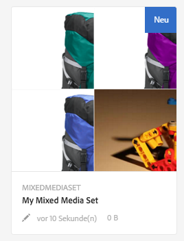
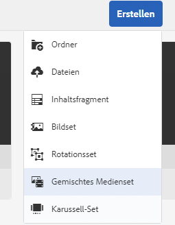
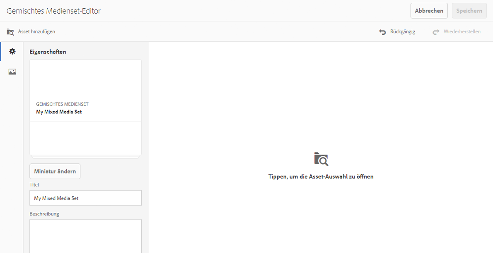
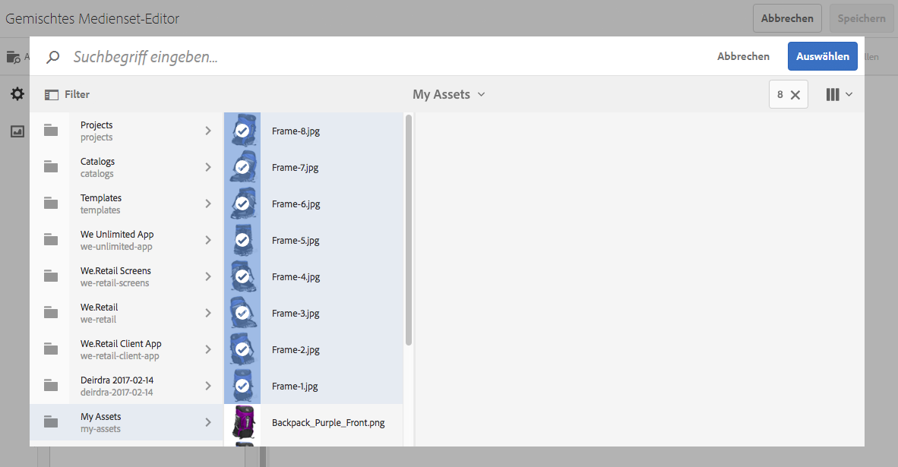

# Gemischte Mediensets {#mixed-media-sets}

>[!CAUTION]
>
>AEM 6.4 hat das Ende der erweiterten Unterstützung erreicht und diese Dokumentation wird nicht mehr aktualisiert. Weitere Informationen finden Sie in unserer [technische Unterstützung](https://helpx.adobe.com/de/support/programs/eol-matrix.html). Unterstützte Versionen suchen [here](https://experienceleague.adobe.com/docs/?lang=de).

Mit gemischten Mediensets können Sie eine Mischung aus Bildern, Bildsets, Rotationssets und Videos in einer Präsentation bereitstellen.

Gemischte Mediensets werden durch ein Banner mit dem Wort **[!UICONTROL MixedMediaSet]** gekennzeichnet. Darüber hinaus wird bei veröffentlichten Sets für gemischte Medien das Veröffentlichungsdatum (durch das **[!UICONTROL Welt]**-Symbol gekennzeichnet) zusammen mit dem Datum der letzten Änderung (durch das **[!UICONTROL Bleistift]**-Symbol gekennzeichnet) im Banner angezeigt.

>[!NOTE]
>
>Weitere Informationen zur Assets-Benutzeroberfläche finden Sie unter [Verwalten von Assets mit der Touch-Benutzeroberfläche](managing-assets-touch-ui.md).

## Schnellstartanleitungen: Gemischte Mediensets {#quick-start-mixed-media-sets}

Gehen Sie wie folgt vor, um Sie schnell mit gemischten Mediensets vertraut zu machen:

1. [Hochladen der Assets](#uploading-assets).

   Laden Sie zunächst die Bilder und Videos für Ihre gemischten Mediensets hoch. Erstellen Sie bei Bedarf [Bildsets](image-sets.md) und [Rotationssets](spin-sets.md). Da Benutzer Bilder im Viewer für gemischte Mediensets zoomen können, sollten Sie beim Auswählen von Bildern auch das Zoomen berücksichtigen. Achten Sie darauf, dass die längste Seite der Bilder mindestens 2.000 Pixel hat.

1. [Erstellen Sie gemischte Mediensets.](#creating-mixed-media-sets)

   Um ein gemischtes Medienset zu erstellen, verwenden Sie **[!UICONTROL Assets]** Seite, tippen Sie auf **[!UICONTROL Erstellen > Gemischtes Medienset]**, und benennen Sie dann den Satz. Wählen Sie die Assets aus und wählen Sie dann die Reihenfolge aus, in der die Bilder angezeigt werden.

   Siehe [Arbeiten mit Selektoren](working-with-selectors.md).

1. Richten Sie bei Bedarf [Viewer-Vorgaben für das gemischte Medienset](managing-viewer-presets.md) ein.

   Administratoren können Viewer-Vorgaben für gemischte Mediensets erstellen oder ändern. Um die gemischten Medien mit einer Viewer-Vorgabe anzuzeigen, wählen Sie das gemischte Medienset aus und wählen Sie im Dropdown-Menü in der linken Seitenleiste die Option **[!UICONTROL Viewer]** aus.

   Um Viewer-Vorgaben zu erstellen oder zu bearbeiten, wählen Sie **[!UICONTROL Tools > Assets > Viewer-Vorgaben]**.

   Siehe [Hinzufügen und Bearbeiten von Viewer-Vorgaben.](managing-viewer-presets.md)

1. [Zeigen Sie eine Vorschau der gemischten Mediensets an.](#previewing-mixed-media-sets)

   Wenn Sie das gemischte Medienset auswählen, können Sie eine Vorschau davon anzeigen. Klicken Sie auf die Miniaturansichtssymbole, um das gemischte Medienset im ausgewählten Viewer zu untersuchen. Sie können verschiedene Viewer aus dem Menü **[!UICONTROL Viewer]** wählen, das Sie links in der Leiste über die Dropdown-Liste aufrufen können.

1. [Veröffentlichen von gemischten Mediensets.](#publishing-mixed-media-sets)

   Beim Veröffentlichen eines gemischten Mediensets wird die URL- und Integrationszeichenfolge aktiviert. Außerdem müssen Sie [die Viewer-Vorgabe veröffentlichen](managing-viewer-presets.md#publishing-viewer-presets).

1. [Verknüpfen Sie URLs mit einer Web-Anwendung](linking-urls-to-yourwebapplication.md) oder [betten Sie den Video- oder Bild-Viewer ein](embed-code.md).

   AEM Assets erstellt URL-Aufrufe für gemischte Mediensets und aktiviert diese nach deren Veröffentlichung. Sie können diese URLs während der Asset-Vorschau kopieren. Alternativ können Sie sie auf Ihrer Website einbetten.

   Markieren Sie dazu das gemischte Medienset und klicken Sie dann im Dropdown-Menü in der linken Seitenleiste auf **[!UICONTROL Viewer]**.

   Siehe [Verknüpfen von gemischten Mediensets mit Web-Seiten](linking-urls-to-yourwebapplication.md) und [Einbetten des Video- oder Bild-Viewers](embed-code.md).

Bei Bedarf können Sie die [gemischten Mediensets](#editing-mixed-media-sets) bearbeiten. Darüber hinaus können Sie [Eigenschaften von gemischten Mediensets](managing-assets-touch-ui.md#editing-properties) anzeigen und ändern.

>[!NOTE]
>
>Wenn Sie beim Erstellen von Sets Probleme haben, lesen Sie [Fehlerbehebung in Dynamic Media - Scene7-Modus](troubleshoot-dms7.md).

## Hochladen von Assets {#uploading-assets}

Laden Sie zunächst die Bilder und Videos für Ihre gemischten Mediensets hoch. Da Benutzer Bilder im Viewer für gemischte Mediensets einzoomen können, sollten Sie beim Auswählen von Bildern unbedingt den Zoom berücksichtigen. Achten Sie darauf, dass die längste Seite der Bilder mindestens 2.000 Pixel hat.

Wenn Sie außerdem Rotationssets oder Bildsets zum gemischten Medienset hinzufügen möchten, erstellen Sie diese ebenfalls.

## Erstellen von gemischten Mediensets  {#creating-mixed-media-sets}

Sie können Ihrem gemischten Medienset Bilder, Bildsets, Rotationssets und Videos hinzufügen. Stellen Sie sicher, dass Ihre Dateien, Bildsets und Rotationssets zur Veröffentlichung bereit sind, bevor Sie sie zum gemischten Medienset hinzufügen.

Assets, die Sie Ihrem Set hinzufügen, werden automatisch in alphanumerischer Reihenfolge hinzugefügt. Sie können die Assets manuell neu anordnen oder sortieren, nachdem sie hinzugefügt wurden.

**So erstellen Sie ein gemischtes Medienset**:

1. Navigieren Sie in Assets an die Stelle, an der Sie ein gemischtes Medienset erstellen möchten, und klicken Sie auf **Erstellen**. Wählen Sie dann **[!UICONTROL Gemischtes Medienset]** aus. Sie können das Set auch in einem Ordner erstellen, der die gewünschten Assets enthält.

   

1. Im **[!UICONTROL Editor für gemischte Mediensets]** Seite, in **[!UICONTROL Titel]** Geben Sie einen Namen für das gemischte Medienset ein. Der Name wird im Banner über dem gemischten Medienset angezeigt. Geben Sie optional eine Beschreibung ein.

   

   >[!NOTE]
   >
   >Beim Erstellen des gemischten Mediensets können Sie die entsprechende Miniaturansicht ändern oder zulassen, dass AEM Assets die Miniaturansicht automatisch basierend auf den Assets im gemischten Medienset auswählt. Um eine Miniaturansicht auszuwählen, klicken Sie auf **[!UICONTROL Miniatur ändern]** und wählen Sie ein beliebiges Bild aus. (Sie können auch in anderen Ordnern nach Bildern suchen.) Wenn Sie eine Miniaturansicht ausgewählt haben und möchten, dass AEM eine Miniaturansicht aus dem gemischten Medienset generiert, wählen Sie **[!UICONTROL Zu automatischer Miniatur wechseln]** aus.

1. Tippen Sie auf **[!UICONTROL Asset-Auswahl]** , um Assets auszuwählen, die Sie in das gemischte Medienset aufnehmen möchten. Wählen Sie sie aus und tippen Sie auf **[!UICONTROL Auswählen]**.

   Mit dem **[!UICONTROL Asset-Auswahl]** können Sie nach Assets suchen, indem Sie einen Suchbegriff eingeben und auf **[!UICONTROL Rückgabe]**. Sie können auch Filter anwenden, um Ihre Suchergebnisse genauer abzustimmen. Sie können nach Pfad, Sammlung, Dateityp und Tag filtern. Wählen Sie den Filter aus und tippen Sie in der Symbolleiste auf das Symbol **[!UICONTROL Filter]**. Ändern Sie die Ansicht, indem Sie das Symbol Ansicht auswählen und **[!UICONTROL Liste]**, **[!UICONTROL Spalte]** oder **[!UICONTROL Karte]** anzeigen.

   Siehe [Arbeiten mit Selektoren](working-with-selectors.md).

   

1. Ordnen Sie die Assets neu an, indem Sie sie nach Bedarf in der Liste nach oben oder unten ziehen (Sie müssen das Symbol für die Neuanordnung auswählen).

   

   Wenn Sie Miniaturansichten hinzufügen möchten, klicken Sie auf die **[!UICONTROL +]** neben dem Bild und navigieren Sie zur gewünschten Miniaturansicht. Wenn Sie alle Miniaturansichten ausgewählt haben, tippen Sie auf . **[!UICONTROL Speichern]**.

   >[!NOTE]
   >
   >Wenn Sie Assets hinzufügen möchten, tippen Sie auf **[!UICONTROL Asset hinzufügen]**.

1. Um ein Asset zu löschen, aktivieren Sie das entsprechende Kontrollkästchen und tippen Sie auf **[!UICONTROL Asset löschen]**.
1. Um eine Vorgabe anzuwenden, tippen Sie in der rechten oberen Ecke auf **[!UICONTROL Vorgabe]** und wählen Sie eine Vorgabe aus, die auf die Assets angewendet werden soll.
1. Klicken Sie auf **[!UICONTROL Speichern]**. Das neu erstellte Set für gemischte Medien wird in dem Ordner angezeigt, in dem es erstellt wurde.

## Bearbeiten von gemischten Mediensets {#editing-mixed-media-sets}

Sie können direkt in der Benutzeroberfläche verschiedene Bearbeitungsaufgaben für Assets in gemischten Mediensets ausführen [wie bei allen Assets in Assets](managing-assets-touch-ui.md). Sie können auch die folgenden Aktionen in gemischten Mediensets durchführen:

* Fügen Sie dem gemischten Medienset Assets hinzu.
* Ordnen Sie Assets im gemischten Medienset neu an.
* Löschen Sie Assets im gemischten Medienset.
* Wenden Sie Viewer-Vorgaben an.
* Ändern Sie die Standardminiatur.

**So bearbeiten Sie gemischte Mediensets**:

1. Führen Sie einen der folgenden Schritte aus:

   * Bewegen Sie den Mauszeiger über ein Asset in einem gemischten Medienset und tippen Sie auf **[!UICONTROL Bearbeiten]** (Bleistiftsymbol).
   * Bewegen Sie den Mauszeiger über ein Asset in einem gemischten Medienset, tippen Sie auf **[!UICONTROL Auswählen]** (Häkchensymbol) und tippen Sie dann auf **[!UICONTROL Bearbeiten]** in der Symbolleiste.
   * Tippen Sie auf ein Asset in einem gemischten Medienset und dann auf **[!UICONTROL Bearbeiten]** (Bleistiftsymbol) in der Symbolleiste.

1. Führen Sie im Editor für gemischte Mediensets einen der folgenden Schritte aus:

   * Um Assets neu anzuordnen, tippen Sie im linken Bereich auf **[!UICONTROL Assets]** (Bildsymbol) ein Asset an eine neue Position ziehen.
   * Um Assets hinzuzufügen, tippen Sie in der Symbolleiste auf **[!UICONTROL Asset hinzufügen]**. Navigieren Sie zu den Assets. Bewegen Sie für jedes Asset, das Sie hinzufügen möchten, den Mauszeiger über das Bild des Assets (nicht den Namen des Assets) und tippen Sie dann auf das Häkchen-Symbol. Tippen Sie oben rechts auf **[!UICONTROL Auswählen]**.
   * Um ein Asset zu löschen, tippen Sie im linken Bereich auf **[!UICONTROL Assets]** (Bildsymbol) und wählen Sie das Asset aus. Tippen Sie in der Symbolleiste auf **[!UICONTROL Asset löschen]**.
   * Um Assets nach ihrem Namen in auf- oder absteigender Reihenfolge zu sortieren, tippen Sie im linken Bereich auf **[!UICONTROL Assets]** (Bildsymbol). Rechts neben dem **[!UICONTROL Assets]** -Überschrift, tippen Sie auf die Caret-Symbole nach oben oder unten.

   >[!NOTE]
   >
   >* So löschen Sie ein ganzes gemischtes Medienset aus einem beliebigen Anzeigemodus (z. B. **[!UICONTROL Karte]** Ansicht oder **[!UICONTROL Spalte]** Ansicht) zum gemischten Medienset navigieren. Bewegen Sie den Mauszeiger über das Asset und tippen Sie auf das Häkchen, um es auszuwählen. Presse **[!UICONTROL Rücktaste]** auf der Tastatur oder tippen Sie auf **[!UICONTROL Mehr]** (drei Punkte) in der Symbolleiste und tippen Sie dann auf **[!UICONTROL Löschen]**.
   >* Sie können die Bilder in einem gemischten Medienset bearbeiten, indem Sie zu ihm navigieren, in der linken Seitenleiste auf **[!UICONTROL Mitglieder des Sets]** tippen und dann auf das **[!UICONTROL Stiftsymbol]** eines einzelnen Assets tippen, um das Bearbeitungsfenster zu öffnen.

1. Tippen Sie auf **[!UICONTROL Speichern]**, wenn Sie die Bearbeitung abgeschlossen haben.

   >[!NOTE]
   >
   >* Um die Assets in einem gemischten Medienset zu bearbeiten, navigieren Sie zum gemischten Medienset. Tippen Sie auf das Set (nicht auswählen), um es im AEM zu öffnen. **[!UICONTROL Vorschau festlegen]** Seite. Tippen Sie in der linken Leiste auf das Dropdownmenü, um die Dropdownliste zu öffnen, und tippen Sie dann auf **[!UICONTROL Festlegen von Mitgliedern]**. Im **[!UICONTROL Festlegen von Mitgliedern]** Seite, bewegen Sie den Mauszeiger über ein Asset und tippen Sie dann auf **[!UICONTROL Bearbeiten]** (Bleistiftsymbol), um die Bearbeitungsseite zu öffnen.
   >* So löschen Sie ein ganzes gemischtes Medienset aus einem beliebigen Anzeigemodus (z. B. **[!UICONTROL Karte]** Ansicht oder **[!UICONTROL Spalte]** Ansicht), navigieren Sie zum gemischten Medienset. Bewegen Sie den Mauszeiger über das Set und tippen Sie auf **[!UICONTROL Auswählen]** (Häkchensymbol). Presse **[!UICONTROL Rücktaste]** auf der Tastatur oder tippen Sie auf **[!UICONTROL Mehr]** (Zeile mit drei Punkten), tippen Sie dann auf **[!UICONTROL Löschen]**.

## Vorschau von gemischten Mediensets {#previewing-mixed-media-sets}

Weitere Informationen zum Aufrufen einer Vorschau von Sets für gemischte Medien finden Sie in [Asset-Vorschau](previewing-assets.md).

## Veröffentlichen von gemischten Mediensets {#publishing-mixed-media-sets}

Weitere Informationen zum Veröffentlichen von Sets für gemischte Medien finden Sie in [Veröffentlichen von Assets](publishing-dynamicmedia-assets.md).

>[!NOTE]
>
>Wenn das gemischte Medienset beim ersten Veröffentlichen nicht vollständig im Bereitstellungsdienst landet, müssen Sie den gemischten Mediensatz möglicherweise ein zweites Mal veröffentlichen.
