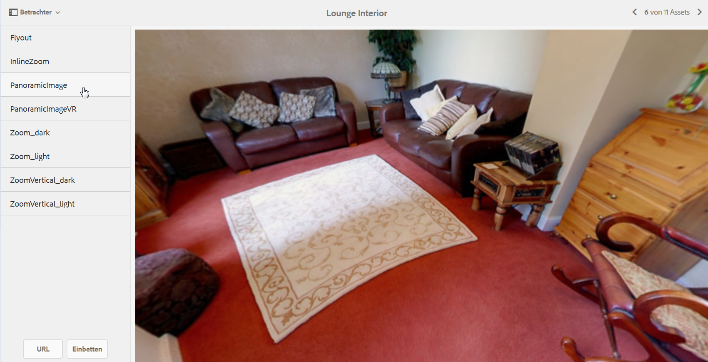

# Panoramabilder {#panoramic-images}

In diesem Abschnitt wird beschrieben, wie Sie mit dem Viewer für Panoramabilder Kugelpanoramen für ein immersives 360°-Betrachtungserlebnis eines Zimmers, einer Immobilie, eines Ortes oder einer Landschaft ausgeben können.

Informationen hierzu finden Sie unter [Verwalten von Viewer-Vorgaben](managing-viewer-presets.md).

## Hochladen von Assets für die Verwendung mit dem Viewer für Panoramabilder {#uploading-assets-for-use-with-the-panoramic-image-viewer}

Damit hochgeladene Assets als Kreispanoramen gelten und mit dem Viewer für Panoramabilder verwendet werden können, muss mindestens eine der beiden folgenden Eigenschaften zutreffen:

* Ein Seitenverhältnis von 2.

   Sie können die Standardeinstellung für das Seitenverhältnis von 2 in **[!UICONTROL CRXDE Lite]** wie folgt überschreiben:

   `/conf/global/settings/cloudconfigs/dmscene7/jcr:content`

* Mit den Keywords `equirectangular` oder `spherical` und `panorama` oder `spherical` und `panoramic` als Tags versehen. Weitere Informationen finden Sie unter [Verwenden von Tags](/help/sites-authoring/tags.md).

Sowohl das Seitenverhältnis als auch die Suchbegriffkriterien gelten für panoramische Assets für die Seite mit den Asset-Details und die Komponente **[!UICONTROL Panoramische Medien]**.

Weitere Informationen über den Upload von Assets für die Verwendung mit dem Viewer für Panoramabilder finden Sie unter [Hochladen von Assets](managing-assets-touch-ui.md#uploading-assets).

## Konfigurieren von Dynamic Media Classic {#configuring-dynamic-media-classic-scene}

Damit der Panorama-Bild-Viewer in AEM ordnungsgemäß funktioniert, müssen Sie die Panorama-Bild-Viewer-Vorgaben mit Dynamic Media Classic- und Dynamic Media Classic-spezifischen Metadaten synchronisieren, damit die Viewer-Vorgaben in der JCR-Datei aktualisiert werden. Konfigurieren Sie dazu Dynamic Media Classic wie folgt:

1. [Melden Sie sich bei Ihrer Dynamic Media Classic Desktop-](https://experienceleague.adobe.com/docs/dynamic-media-classic/using/intro/dynamic-media-classic-desktop-app.html?lang=en#system-requirements-dmc-app) Anwendung für jedes Firmen-Konto an.

1. Klicken Sie oben rechts auf der Seite auf **[!UICONTROL Einstellungen > Anwendungseinstellungen > Veröffentlichungseinrichtung > Image-Server]**.
1. Wählen Sie auf der Seite **[!UICONTROL Image-Server-Veröffentlichung]** aus dem Dropdownmenü **[!UICONTROL Veröffentlichungskontext]** oben **[!UICONTROL Image-Server]**.

1. Suchen Sie auf derselben Seite **[!UICONTROL Image-Server-Veröffentlichung]** die Überschrift **[!UICONTROL Anforderungsattribute]**.
1. Suchen Sie unter der Überschrift **[!UICONTROL Anforderungsattribute]** nach **[!UICONTROL Maximale Antwortbildgröße]**. Erhöhen Sie dann in den zugehörigen Feldern **[!UICONTROL Breite]** und **[!UICONTROL Höhe]** die maximal zulässige Bildgröße für Panoramabilder.

   Dynamic Media Classic ist auf 25.000.000 Pixel begrenzt. Die maximal zulässige Größe für Bilder mit einem Seitenverhältnis von 2:1 beträgt 7000 x 3500. In der Regel ist für Desktopbildschirme jedoch eine Größe von 4096 x 2048 Pixel ausreichend.

   >[!NOTE]
   >
   >Es werden nur Bilder innerhalb der zulässigen Maximalgröße unterstützt. Anfragen zu Bildern oberhalb der Obergrenze geben einen „403“-Fehler zurück.

1. Gehen Sie unter der Überschrift **[Anforderungsattribute]** wie folgt vor:

   * Stellen Sie **[!UICONTROL Abfrageverdeckungsmodus]** auf **[!UICONTROL Deaktiviert]** ein.
   * Setzen Sie **[!UICONTROL Anforderungssperrmodus]** auf **[!UICONTROL Deaktiviert]**.

   Diese Einstellungen sind für die Verwendung der Komponente **[!UICONTROL Panoramamedien]** in AEM erforderlich.

1. Tippen Sie unten auf der Seite **[!UICONTROL Image-Server-Veröffentlichung]** auf der linken Seite auf **[!UICONTROL Speichern]**.

1. Tippen Sie in der rechten unteren Ecke auf **[!UICONTROL Schließen]**.

### Fehlerbehebung bei der Komponente Panoramamedien {#troubleshooting-the-panoramic-media-wcm-component}

Wenn Sie ein Bild in der Komponente **[!UICONTROL Panoramaische Medien]** in Ihrem WCM abgelegt haben und der Komponentenplatzhalter ausgeblendet ist, können Sie die folgenden Fehler beheben:

* Wenn Ihnen ein 403-Fehler (Forbidden) angezeigt wird, liegt es möglicherweise daran, dass die angefragte Bildgröße den Grenzwert überschreitet. Überprüfen Sie die Einstellungen für *Maximale Antwortbildgröße* in [Konfigurieren von Dynamic Media Classic](#configuring-dynamic-media-classic-scene).

* Aktivieren Sie für ein *Ungültiges Sperren* für das Asset oder *Analysefehler*, der auf der Seite angezeigt wird, **[!UICONTROL Abfrageverdeckungsmodus]** und **[!UICONTROL Anforderungssperrmodus]**, um sicherzustellen, dass sie deaktiviert sind.
* Bei einem Fehler mit beschädigter Arbeitsfläche richten Sie für die vorherigen Anforderungen für das Bild-Asset einen **[!UICONTROL Pfad der Regeldefinitionsdatei und Ungültiges CTN]** ein.
* Wenn die Bildqualität infolge einer Bildanforderung mit einer Größe, die den unterstützten Bereich überschreitet, sehr gering wird, stellen Sie sicher, dass die Einstellung **[!UICONTROL JPEG-Codierungsattribute > Qualität]** nicht leer ist. Eine typische Einstellung für das Feld **[!UICONTROL Qualität]** ist `95`. Die Einstellung finden Sie auf der Seite **[!UICONTROL Image Server Publish]**. Informationen zum Zugriff auf die Seite finden Sie unter [Konfigurieren von Dynamic Media Classic](#configuring-dynamic-media-classic-scene).

## Anzeigen einer Vorschau für Panoramabilder {#previewing-panoramic-images}

Weitere Informationen finden Sie im Abschnitt [Asset-Vorschau](previewing-assets.md).

## Veröffentlichen von Panoramabildern  {#publishing-panoramic-images}

Siehe [Veröffentlichen von Assets](publishing-dynamicmedia-assets.md).
