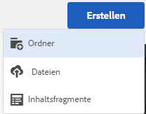
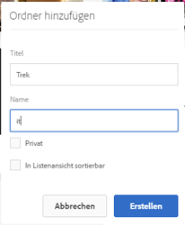
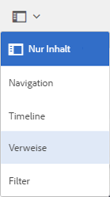
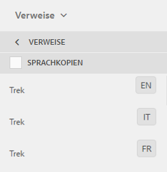

# Vorbereiten von Assets für die Übersetzung {#preparing-assets-for-translation}

Bei mehrsprachigen Assets handelt es sich um Assets mit Binärdateien, Metadaten und Tags in verschiedenen Sprachen. Im Allgemeinen liegen Binärdateien, Metadaten und Tags für Assets in einer Sprache vor, die dann für die Verwendung in mehrsprachigen Projekten in andere Sprachen übersetzt wird.

In Adobe Experience Manager Assets sind mehrsprachige Assets in Ordnern enthalten, wobei jeder Ordner die Assets in einer anderen Sprache enthält.

Jeder Sprachordner wird als eine Sprachkopie bezeichnet. Der Stammordner einer Sprachkopie, auch als Sprachstamm bezeichnet, identifiziert die Sprache des Inhalts in der Sprachkopie. Zum Beispiel ist */content/dam/it* der Stamm der italienischen Sprache für die italienische Sprachkopie. Sprachkopien müssen einen [korrekt konfigurierten Sprachstamm](preparing-assets-for-translation.md#creating-a-language-root) verwenden, damit die korrekte Sprache angesprochen wird, wenn Übersetzungen von Quell-Assets durchgeführt werden.

Die Sprachkopie, für die Sie ursprünglich Assets hinzufügen, ist die primäre Sprachinstanz. Die primäre Sprachinstanz ist die Quelle, die in andere Sprachen übersetzt wird.

Die Beispielordnerhierarchie enthält mehrere Sprachstämme:

```java
/content
    /- dam
             |- en
             |- fr
             |- de
             |- es
             |- it
             |- ja
             |- zh
```

Führen Sie die folgenden Schritte aus, um Ihre Assets für die Übersetzung vorzubereiten:

1. Erstellen Sie den Sprachstamm für Ihre primäre Sprachinstanz. Beispielsweise lautet der Sprachstamm der englischen Sprachkopie in der Beispielordnerhierarchie `/content/dam/en`. Stellen Sie sicher, dass der Sprachstamm entsprechend den Informationen unter [Erstellen eines Sprachstamms](preparing-assets-for-translation.md#creating-a-language-root) konfiguriert ist.

1. Fügen Sie Ihrer primären Sprachinstanz Assets hinzu.
1. Erstellen Sie den Sprachstamm der jeweiligen Zielsprache, für die Sie eine Sprachkopie benötigen.

## Erstellen eines Sprachstamms {#creating-a-language-root}

Um den Sprachstamm zu erstellen, erstellen Sie einen Ordner und verwenden Sie einen ISO-Sprach-Code als Wert für die Name-Eigenschaft. Nachdem Sie den Sprachstamm erstellt haben, können Sie eine Sprachkopie auf jeder beliebigen Ebene im Sprachstamm erstellen.

Beispielsweise verfügt die Stammseite der italienischsprachigen Kopie der Beispielhierarchie über `it` als Eigenschaft „Name“. Die Name-Eigenschaft wird als Name des Asset-Knotens im Repository verwendet und bestimmt daher den Pfad des Assets. (`https://[AEM_server]:[port]/assets.html/content/dam/it/*`)

1. Tippen/klicken Sie in der Assets-Konsole auf **[!UICONTROL Erstellen]** und wählen Sie im Menü die Option **[!UICONTROL Ordner]** aus.

   

1. Geben Sie in den Namensfeldtyp den Länder-Code im Format `<language-code>` ein.

   

1. Klicken oder tippen Sie auf **[!UICONTROL Erstellen]**. Der Sprachstamm wird in der Konsole „Assets“ erstellt.

## Anzeigen von Sprachstämmen {#viewing-language-roots}

Die Touch-optimierte Benutzeroberfläche bietet einen Bereich &quot;Verweise&quot;, der eine Liste der Sprachstämme anzeigt, die in [!DNL Experience Manager] Assets.

1. In der Konsole „Assets“ wählen Sie die primäre Sprachinstanz aus, für die Sie Sprachkopien erstellen möchten.
1. Klicken oder tippen Sie auf das GlobalNav-Symbol und wählen Sie **[!UICONTROL Verweise]** aus, um den Bereich „Verweise“ zu öffnen.

   

1. Im Bereich „Verweise“ klicken oder tippen Sie auf **[!UICONTROL Sprachkopien]**. Der Bereich Sprachkopien zeigt die Sprachkopien der Assets an.

   
