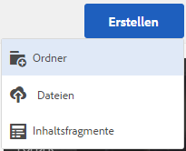
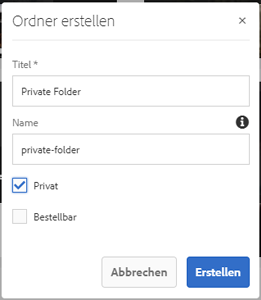
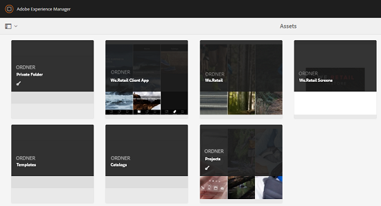
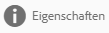
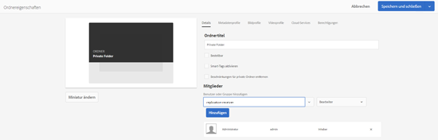
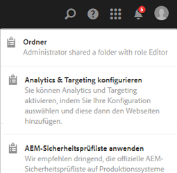

# Freigeben privater Ordner {#private-folder-sharing}

>[!CAUTION]
>
>AEM 6.4 hat das Ende der erweiterten Unterstützung erreicht und diese Dokumentation wird nicht mehr aktualisiert. Weitere Informationen finden Sie in unserer [technische Unterstützung](https://helpx.adobe.com/de/support/programs/eol-matrix.html). Unterstützte Versionen suchen [here](https://experienceleague.adobe.com/docs/?lang=de).

Sie können einen privaten Ordner in der Benutzeroberfläche von Adobe Experience Manager Assets erstellen, der ausschließlich für Sie verfügbar ist. Sie können diesen privaten Ordner für andere Benutzer freigeben und ihnen verschiedene Berechtigungen zuweisen. Je nach zugewiesenenr Berechtigungsstufe können Benutzer verschiedene Aufgaben mit dem Ordner durchführen, wie z.B. Assets innerhalb des Ordners anzeigen oder Assets bearbeiten.

1. Klicken oder tippen Sie in der Konsole „Assets“ von der Symbolleiste aus auf **[!UICONTROL Erstellen]** und wählen Sie dann **[!UICONTROL Ordner]** aus dem Menü aus.

   

1. Im **[!UICONTROL Ordner hinzufügen]** ein, geben Sie einen Titel und einen Namen (optional) für den Ordner ein und wählen Sie **[!UICONTROL Privat]**.

   

1. Tippen oder klicken Sie auf **[!UICONTROL Erstellen]**. In der Benutzeroberfläche wird ein privater Ordner erstellt.

   

1. Um den Ordner für andere Benutzer freizugeben und ihnen Berechtigungen zuzuweisen, wählen Sie den Ordner aus und tippen/klicken Sie auf das Symbol **[!UICONTROL Eigenschaften]** in der Symbolleiste.

   

   >[!NOTE]
   >
   >Der Ordner wird erst dann für andere Benutzer sichtbar, wenn Sie ihn freigeben.

1. Wählen Sie auf der Seite &quot;Ordnereigenschaften&quot;einen Benutzer aus dem **[!UICONTROL Benutzer hinzufügen]** auflisten, dem Benutzer in Ihrem privaten Ordner eine Rolle zuweisen und auf **[!UICONTROL Hinzufügen]**.

   

   >[!NOTE]
   >
   >Sie können dem Benutzer, für den Sie den Ordner freigeben, verschiedene Rollen zuweisen, z. B. Bearbeiter, Eigentümer oder Betrachter. Wenn Sie dem Benutzer eine Eigentümerrolle zuweisen, hat der Benutzer Bearbeiterrechte für den Ordner. Darüber hinaus kann der Benutzer den Ordner für andere freigeben. Wenn Sie die Rolle &quot;Bearbeiter&quot;zuweisen, kann der Benutzer die Assets in Ihrem privaten Ordner bearbeiten. Wenn Sie eine Viewer-Rolle zuweisen, kann der Benutzer die Assets nur in Ihrem privaten Ordner anzeigen.

1. Klicken Sie auf **[!UICONTROL Speichern]**. Je nach der zugewiesenen Rolle erhält der Benutzer eine Reihe von Berechtigungen für Ihren privaten Ordner, wenn sich der Benutzer bei anmeldet. [!DNL Experience Manager] Assets.
1. Klicken Sie auf **[!UICONTROL OK]**, um die Bestätigungsmeldung zu schließen.
1. Der Benutzer, für den Sie den Ordner freigeben, erhält eine Freigabebenachrichtigung. Anmelden bei [!DNL Experience Manager] Assets mit den Anmeldeinformationen des Benutzers zum Anzeigen der Benachrichtigung.

   

1. Tippen/klicken Sie auf das Symbol Benachrichtigung , um die Liste der Benachrichtigungen zu öffnen.

   

1. Klicken oder tippen Sie auf den Eintrag für den privaten Ordner, der vom Administrator freigegeben wurde, um den Ordner zu öffnen.

>[!NOTE]
>
>Um einen privaten Ordner erstellen zu können, benötigen Sie Lese- und Bearbeitungsberechtigungen für ACL für den übergeordneten Ordner, unter dem Sie einen privaten Ordner erstellen möchten. Wenn Sie kein Administrator sind, sind diese Berechtigungen standardmäßig für Sie nicht aktiviert. */content/dam*. Rufen Sie in diesem Fall zunächst diese Berechtigungen für Ihre Benutzer-ID/Gruppe ab, bevor Sie versuchen, private Ordner zu erstellen oder Ordnereinstellungen anzuzeigen.
