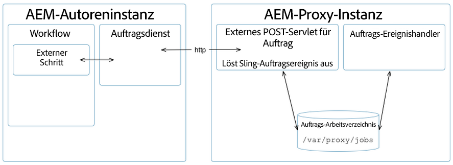

# Entwicklung von Asset-Proxys {#assets-proxy-development}

Adobe Experience Manager Assets verwendet einen Proxy, um die Verarbeitung für bestimmte Aufgaben zu verteilen.

Ein Proxy ist eine bestimmte (und manchmal separate) [!DNL Experience Manager]-Instanz, die Proxy Worker als Prozessoren verwendet, die für die Verarbeitung eines Auftrags und die Erstellung eines Ergebnisses verantwortlich sind. Ein Proxy Worker kann für eine Vielzahl von Aufgaben verwendet werden. Bei einem [!DNL Experience Manager] Assets-Proxy kann dies zum Laden von Assets für die Wiedergabe in [!DNL Experience Manager] Assets verwendet werden. Beispielsweise verarbeitet der [IDS-Proxy-Worker](indesign.md) Dateien, die in  Assets verwendet werden sollen, mit einem InDesign-Server.[!DNL Experience Manager]

Wenn der Proxy eine separate [!DNL Experience Manager]-Instanz ist, hilft dies, die Belastung der [!DNL Experience Manager]-Autoreninstanz(en) zu reduzieren. Standardmäßig führt [!DNL Experience Manager] Assets die Asset-Verarbeitungsaufgaben in derselben JVM aus (über Proxy externalisiert), um die Belastung der [!DNL Experience Manager]-Autoreninstanz zu reduzieren.

## Proxy (HTTP-Zugriff) {#proxy-http-access}

Proxys, deren Konfiguration Verarbeitungsaufträge zulässt, sind über das HTTP-Servlet verfügbar: `/libs/dam/cloud/proxy`. Dieses Servlet erstellt einen Sling-Auftrag aus den geposteten Parametern. Der Auftrag wird dann der Proxy-Auftragswarteschlange hinzugefügt und mit dem entsprechenden Proxy Worker verbunden.

### Unterstützte Vorgänge {#supported-operations}

* `job`

   **Anforderungen**: Der Parameter `jobevent` muss als serialisierte Wertezuordnung festgelegt werden. Damit wird ein `Event` für einen Auftragsprozessor erstellt.

   **Ergebnis**: Fügt einen neuen Auftrag hinzu. Wenn der Vorgang erfolgreich ist, wird eine eindeutige Auftrags-ID zurückgegeben.

```shell
curl -u admin:admin -F":operation=job" -F"someproperty=xxxxxxxxxxxx"
    -F"jobevent=serialized value map" http://localhost:4502/libs/dam/cloud/proxy
```

* `result`

   **Voraussetzungen**: der Parameter  `jobid` muss festgelegt sein.

   **Ergebnis:** Gibt die JSON-Darstellung des Ergebnisknotens zurück, wie er durch den Auftragsprozessor erstellt wurde.

```shell
curl -u admin:admin -F":operation=result" -F"jobid=xxxxxxxxxxxx"
    http://localhost:4502   /libs/dam/cloud/proxy
```

* `resource`

   **Anforderungen**: Der Parameter „jobid“ must festgelegt sein.

   **Ergebnis**: Gibt eine Ressource zurück, die dem jeweiligen Auftrag zugeordnet ist.

```shell
curl -u admin:admin -F":operation=resource" -F"jobid=xxxxxxxxxxxx"
    -F"resourcePath=something.pdf" http://localhost:4502/libs/dam/cloud/proxy
```

* `remove`

   **Anforderungen**: Der Parameter „jobid“ must festgelegt sein.

   **Ergebnisse:**: Entfernt einen gefundenen Auftrag.

```shell
curl -u admin:admin -F":operation=remove" -F"jobid=xxxxxxxxxxxx"
    http://localhost:4502/libs/dam/cloud/proxy
```

### Proxy Worker {#proxy-worker}

Ein Proxy Worker ist ein Prozessor, der für die Verarbeitung von Aufträgen und die Generierung von Ergebnissen zuständig ist. Worker befinden sich auf der Proxy-Instanz und müssen [sling JobProcessor](https://sling.apache.org/site/eventing-and-jobs.html) implementieren, damit sie als Proxy Worker erkannt werden.

>[!NOTE]
>
>Worker müssen [sling JobProcessor](https://sling.apache.org/site/eventing-and-jobs.html) implementieren, damit sie als Proxy Worker erkannt werden.

### Client-API {#client-api}

[`JobService`](https://helpx.adobe.com/experience-manager/6-4/sites/developing/using/reference-materials/javadoc/index.html) ist als OSGi-Dienst verfügbar, der Methoden zur Erstellung und Entfernung von Aufträgen und dem Abruf von Ergebnissen aus den Aufträgen bereitstellt. Die Standardimplementierung des Dienstes (`JobServiceImpl`) verwendet den HTTP-Client für die Kommunikation mit dem Remote-Proxy-Servlet.

Nachstehend finden Sie ein Beispiel für die API-Verwendung:

```java
@Reference
 JobService proxyJobService;

 // to create a new job
 final Hashtable props = new Hashtable();
 props.put("someproperty", "some value");
 props.put(JobUtil.PROPERTY_JOB_TOPIC, "myworker/job"); // this is an identifier of the worker
 final String jobId = proxyJobService.addJob(props, new Asset[]{asset});

 // to check status (returns JobService.STATUS_FINISHED or JobService.STATUS_INPROGRESS)
 int status = proxyJobService.getStatus(jobId)

 // to get the result
 final String jsonString = proxyJobService.getResult(jobId);

 // to remove job and cleanup
 proxyJobService.removeJob(jobId);
```

### Cloud Service-Konfigurationen {#cloud-service-configurations}

>[!NOTE]
>
>Die Referenzdokumentation für die Proxy-API ist unter [`com.day.cq.dam.api.proxy`](https://helpx.adobe.com/experience-manager/6-4/sites/developing/using/reference-materials/javadoc/com/day/cq/dam/commons/proxy/package-summary.html) verfügbar.

Sowohl Proxy- als auch Proxy Worker-Konfigurationen sind über Cloud Services-Konfigurationen verfügbar, auf die über die Konsole [!DNL Experience Manager] Assets **Tools** oder `/etc/cloudservices/proxy` zugegriffen werden kann. Von jedem Proxy Worker wird erwartet, dass er einen Knoten unter `/etc/cloudservices/proxy` für Worker-spezifische Konfigurationsdetails (z. B. `/etc/cloudservices/proxy/workername`) hinzufügt.

>[!NOTE]
>
>Weitere Informationen finden Sie unter [Konfiguration von InDesign Server Proxy Worker](indesign.md#configuring-the-proxy-worker-for-indesign-server) und [Cloud Service-Konfiguration](../sites-developing/extending-cloud-config.md).

Nachstehend finden Sie ein Beispiel für die API-Verwendung:

```java
@Reference(policy = ReferencePolicy.STATIC)
 ProxyConfig proxyConfig;
 
 // to get proxy config
 Configuration cloudConfig = proxyConfig.getConfiguration();
 final String value = cloudConfig.get("someProperty", "defaultValue");

 // to get worker config
 Configuration cloudConfig = proxyConfig.getConfiguration("workername");
 final String value = cloudConfig.get("someProperty", "defaultValue");
```

### Entwickeln eines benutzerdefinierten Proxy Workers {#developing-a-customized-proxy-worker}

Der [IDS-Proxy Worker](indesign.md) ist ein Beispiel für einen [!DNL Experience Manager] Assets-Proxy Worker, der bereits standardmäßig bereitgestellt wird, um die Verarbeitung von InDesign-Assets auszulagern.

Sie können auch Ihren eigenen [!DNL Experience Manager] Assets-Proxy Worker entwickeln und konfigurieren, um einen spezialisierten Worker zum Versenden und Outsourcing Ihrer [!DNL Experience Manager]-Asset-Verarbeitungsaufgaben zu erstellen.

Für die Einrichtung eines eigenen benutzerdefinierten Proxy Workers müssen Sie die folgenden Aufgaben ausführen:

* Einrichten und Implementieren (mit Sling Eventing): 

   * benutzerdefiniertes Auftragsthema
   * benutzerdefinierter Auftrags-Ereignishandler

* Führen Sie mit der JobService-API die folgenden Aufgaben aus:

   * benutzerdefinierten Auftrag an Proxy senden
   * Auftrag verwalten

* Wenn Sie den Proxy aus einem Workflow verwenden möchten, müssen Sie einen externen benutzerdefinierten Schritt implementieren. Verwenden Sie dafür die WorkflowExternalProcess-API und die JobService-API.

Die Vorgehensweise wird im folgenden Diagramm erläutert:



>[!NOTE]
>
>In den folgenden Schritten werden InDesign-Äquivalente als Referenzbeispiele angegeben.

1. Da ein [Sling-Auftrag](https://sling.apache.org/site/eventing-and-jobs.html) verwendet wird, müssen Sie ein Auftragsthema für Ihren Anwendungsfall definieren.

   Als Beispiel dient `IDSJob.IDS_EXTENDSCRIPT_JOB` für den IDS Proxy Worker.

1. Mit dem externen Schritt wird das Ereignis ausgelöst, anschließend wird auf den Abschluss gewartet. Hierfür wird die ID abgerufen. Sie müssen einen eigenen Schritt entwickeln, um eine neue Funktionalität zu implementieren. 

   Implementieren Sie einen `WorkflowExternalProcess`. Bereiten Sie dann mit der JobService-API und Ihrem Auftragsthema ein Auftragsereignis vor und senden Sie es an den JobService (einen OSGi-Dienst). 

   Als Beispiel dient `INDDMediaExtractProcess` für den IDS Proxy Worker.

1. Implementieren Sie einen Auftrags-Handler für Ihr Thema. Der Handler muss entwickelt werden, damit er die von Ihnen gewünschte spezifische Aktion ausführt und als Worker-Implementierung betrachtet wird. 

   Als Beispiel dient `IDSJobProcessor.java` für den IDS Proxy Worker.

1. Verwenden Sie `ProxyUtil.java` in dam-commons. Damit können Sie Aufträge mit dem dam-Proxy an Worker senden.

>[!NOTE]
>
>Was das Proxy-Framework [!DNL Experience Manager] Assets nicht standardmäßig bereitstellt, ist der Pool-Mechanismus.
>
>Die Integration mit InDesign ermöglicht jedoch den Zugriff auf einen Pool von InDesign-Servern (IDSPool). Dieses Pooling ist spezifisch für die InDesign-Integration und nicht Teil des [!DNL Experience Manager] Assets-Proxy-Frameworks.

>[!NOTE]
>
>Synchronisierung der Ergebnisse:
>
>Bei n Instanzen, die denselben Proxy verwenden, bleibt das Verarbeitungsergebnis beim Proxy. Es ist der Auftrag des Clients ([!DNL Experience Manager] Autor), das Ergebnis mit derselben eindeutigen Auftrags-ID anzufordern, die dem Client bei der Auftragserstellung gegeben wird. Der Proxy erledigt einfach den Auftrag und hält das Ergebnis abrufbereit.
