# Zugehörige Assets {#related-assets}

>[!CAUTION]
>
>AEM 6.4 hat das Ende der erweiterten Unterstützung erreicht und diese Dokumentation wird nicht mehr aktualisiert. Weitere Informationen finden Sie in unserer [technische Unterstützung](https://helpx.adobe.com/de/support/programs/eol-matrix.html). Unterstützte Versionen suchen [here](https://experienceleague.adobe.com/docs/?lang=de).

Mit Adobe Experience Manager Assets können Sie Assets mithilfe der Funktion &quot;Zugehörige Assets&quot;manuell basierend auf den Anforderungen Ihres Unternehmens zuordnen. Beispielsweise können Sie einem Asset oder einem Bild/Video mit einer Lizenzdatei zu einem ähnlichen Thema verknüpfen. Sie können Assets verknüpfen, die bestimmte Attribute gemeinsam haben. Sie können die Funktion auch verwenden, um Quell-/abgeleitete Beziehungen zwischen Assets zu erstellen. Beispielsweise können Sie PDF-Dateien, die aus einer INDD-Datei generiert wurden, mit der INDD-Quelldatei verknüpfen.

Auf diese Weise können Sie eine Datei mit niedriger Auflösung (z. B. PDF/JPG) für Anbieter/Agenturen freigeben und die hochauflösende Datei (z. B. INDD) nur auf Anfrage zur Verfügung stellen.

## Zuordnen von Assets {#relating-assets}

1. Öffnen Sie in der Benutzeroberfläche von Assets die Eigenschaftenseite für ein Asset, das Sie zuordnen möchten.

   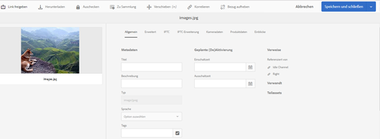

   Wählen Sie alternativ das gewünschte Asset in der Listenansicht aus.

   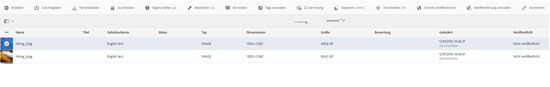

   Sie können das Asset auch aus einer Sammlung auswählen.

   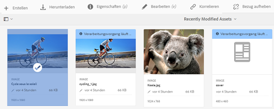

1. Um ein anderes Asset mit dem ausgewählten Asset zu verknüpfen, klicken/tippen Sie auf das **[!UICONTROL Relation]** in der Symbolleiste.

   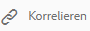

1. Führen Sie einen der folgenden Schritte aus:

   * Um die Quelldatei für das Asset zuzuordnen, wählen Sie **[!UICONTROL Quelle]** aus der Liste.
   * Um eine abgeleitete Datei zuzuordnen, wählen Sie **[!UICONTROL Abgeleitet]** aus der Liste aus.
   * Um eine bidirektionale Beziehung zwischen den Assets zu erstellen, wählen Sie **[!UICONTROL sonstige]** aus der Liste.

   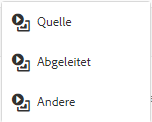

1. Aus dem **[!UICONTROL Asset auswählen]** navigieren Sie zum Speicherort des Assets, das Sie zuordnen möchten, und wählen Sie es aus.

   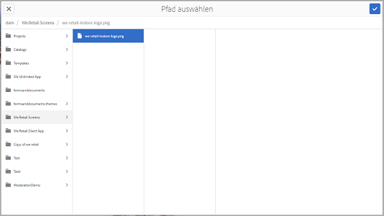

1. Klicken/tippen Sie auf **[!UICONTROL Bestätigen]** Symbol.
1. Klicken/tippen Sie auf **[!UICONTROL OK]**, um das Dialogfeld zu schließen. Je nach Auswahl der Beziehung in Schritt 3 wird das verknüpfte Asset unter einer entsprechenden Kategorie im Abschnitt **[!UICONTROL Verknüpft]** aufgeführt. Beispiel: Wenn das verknüpfte Asset die Quelldatei des aktuellen Elements ist, wird es unter **[!UICONTROL Quelle]** aufgeführt.

   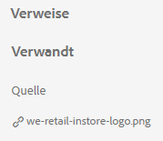

1. Um die Zuordnung eines Assets aufzuheben, klicken/tippen Sie auf die **[!UICONTROL Nicht zuordnen]** in der Symbolleiste.

   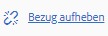

1. Wählen Sie die Assets aus, deren Bezug zum Dialogfeld **[!UICONTROL Beziehungen entfernen]** Sie aufheben möchten, und klicken/tippen Sie auf **[!UICONTROL Bezug aufheben]**.

   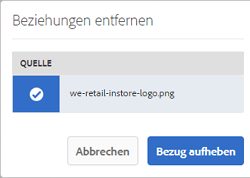

1. Klicken/Tippen **[!UICONTROL OK]** , um das Dialogfeld zu schließen. Die Assets, für die Sie Verknüpfungen entfernt haben, werden aus der Liste der verknüpften Assets im Abschnitt **[!UICONTROL Verknüpft]** gelöscht.

## Übersetzen verwandter Assets {#translating-related-assets}

Das Erstellen von Quell-/abgeleiteten Beziehungen zwischen Assets mithilfe der Funktion &quot;Zugehörige Assets&quot;ist auch in Übersetzungs-Workflows hilfreich. Wenn Sie einen Übersetzungs-Workflow für ein abgeleitetes Asset ausführen, [!DNL Experience Manager] Assets ruft automatisch alle Assets ab, auf die die Quelldatei verweist, und schließt sie zur Übersetzung ein. Auf diese Weise wird das vom Quell-Asset referenzierte Asset zusammen mit der Quelle und den abgeleiteten Assets übersetzt. Angenommen, Ihre englischsprachige Kopie enthält ein abgeleitetes Asset und dessen Quelldatei wie gezeigt.

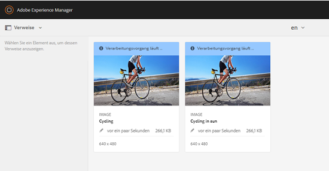

Wenn die Quelldatei mit einem anderen Asset verknüpft ist, [!DNL Experience Manager] Assets ruft das referenzierte Asset ab und fügt es zur Übersetzung hinzu.

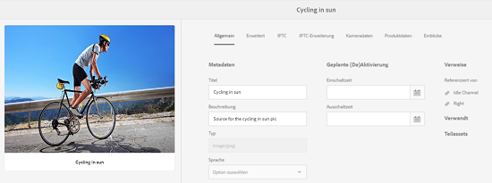

1. Übersetzen Sie die Assets im Quellordner in eine Zielsprache, indem Sie die Schritte unter [Neues Übersetzungsprojekt erstellen](translation-projects.md#create-a-new-translation-project). Übersetzen Sie in diesem Fall beispielsweise Ihre Assets auf Französisch.
1. Öffnen Sie auf der Seite Projekte den Übersetzungsordner.

   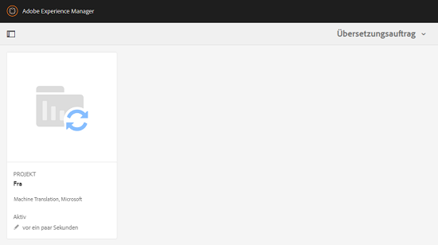

1. Klicken/tippen Sie auf die Projektkachel, um die Detailseite zu öffnen.

   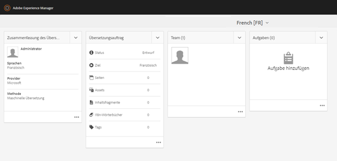

1. Klicken/tippen Sie auf die Auslassungszeichen unter der Karte Übersetzungsauftrag , um den Übersetzungsstatus anzuzeigen.

   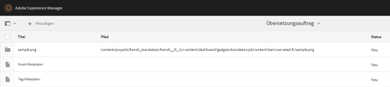

1. Wählen Sie das Asset aus und klicken/tippen Sie dann auf **[!UICONTROL In Assets einblenden]** in der Symbolleiste, um den Übersetzungsstatus für das Asset anzuzeigen.

   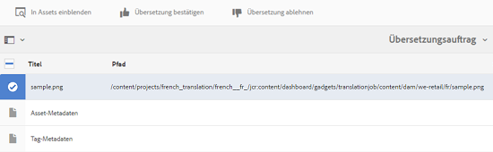

1. Um zu überprüfen, ob die mit der Quelle verknüpften Assets übersetzt wurden, klicken/tippen Sie auf das Quell-Asset.

   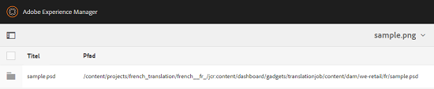

1. Wählen Sie das mit der Quelle verknüpfte Element aus und klicken/tippen Sie auf **[!UICONTROL In Assets einblenden]**. Das übersetzte zugehörige Asset wird angezeigt.

   
