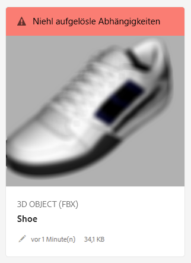

# Auflösen von Dateiabhängigkeiten {#resolving-file-dependencies}

Abhängigkeiten von primären 3D-Modelldateien wie Texturmap-Dateien werden bei Möglichkeit automatisch aufgelöst. Dies ist möglich, weil AEM nahe gelegene Asset-Ordner nach Dateien mit den Namen durchsucht, die auch in den 3D-Dateien vorkommen. If one or more dependencies are unresolvable during the Creating preview processing stage, the asset&#39;s card displays the following red banner message in the **[!UICONTROL Card View]**:

**So lösen Sie Dateiabhängigkeiten auf**:

1. In the **[!UICONTROL Card View]**, hover the pointer over the **[!UICONTROL Unresolved Dependencies]** banner message on the card, then tap the **[!UICONTROL Exclamation Point]** icon.

   

1. On the **[!UICONTROL Metadata Properties]** page, tap the **[!UICONTROL Dependencies]** tab.

   The files that AEM could not auto-resolve are listed under the **[!UICONTROL Original Paths]** column, in red.

1. Führen Sie einen oder mehrere der folgenden Schritte aus:

   * **Abhängigkeiten suchen und auswählen**. (Bei dieser Option wird davon ausgegangen, dass Sie die Abhängigkeitsdateien bereits hochgeladen haben.)

      1. Tap the **[!UICONTROL File Browse]** icon to the left of the red path.
      1. On the **[!UICONTROL Select Content]** page, navigate to the missing file, then tap on the file&#39;s card to select it.
      1. In the upper-left corner of the **[!UICONTROL Select Content]** page, tap **[!UICONTROL Close]** (X icon) to return to the **[!UICONTROL View Properties]** page.
   * **Abhängigkeiten hochladen**. (Bei dieser Option wird davon ausgegangen, dass Sie die fehlenden Dateien noch nicht hochgeladen haben.)

      1. Beachten Sie die fehlenden Pfade und Dateinamen.
      1. Tippen Sie in der rechten oberen Ecke auf **[!UICONTROL Schließen]**.

   After the files are uploaded return to **[!UICONTROL View Properties > Dependencies]** page. Das neu hochgeladene Asset wird nun korrekt als referenziertes Asset aufgeführt.

   * **Abhängigkeiten ignorieren**.

      If a missing dependency is no longer needed, under the **[!UICONTROL Referenced Asset]** column, in the text field to the left of the missing file, type `n/a` so that AEM 3D ignores the file.

1. Near the upper-right corner of the **[!UICONTROL View Properties]** page, tap **[!UICONTROL Save]**.
1. Tippen Sie auf **[!UICONTROL Schließen]****[!UICONTROL , um zur Kartenansicht zurückzukehren]**.

   Das Asset wird mit den neu aufgelösten Abhängigkeiten automatisch neu verarbeitet.

