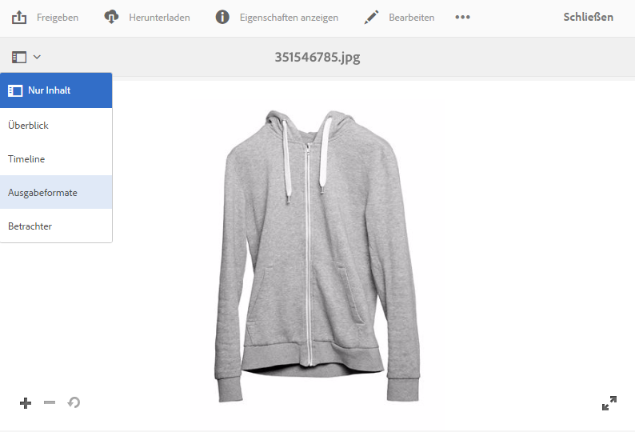
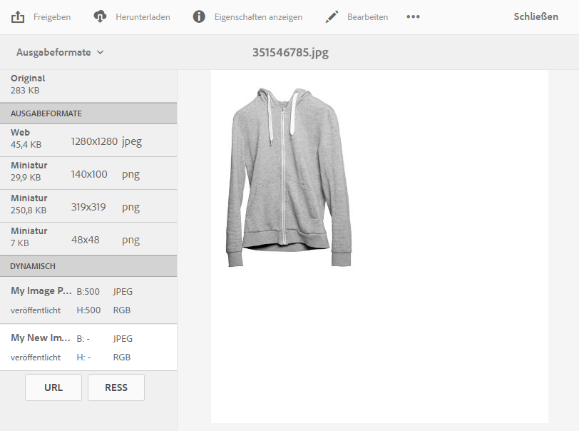
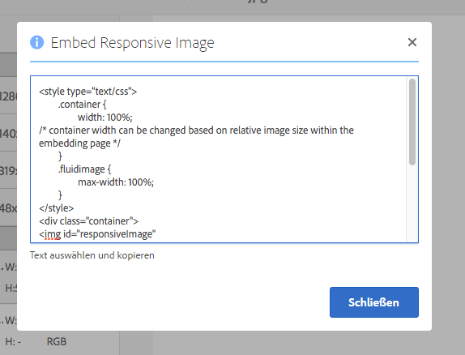

# Bereitstellen von optimierten Bildern für eine responsive Site {#delivering-optimized-images-for-a-responsive-site}

Verwenden Sie die Funktion für responsiven Code, wenn Sie den Code für responsive Verarbeitung für Ihren Web-Entwickler freigeben möchten. Kopieren Sie den responsiven Code (**[!UICONTROL RESS]**) in die Zwischenablage, damit Sie ihn für Ihren Web-Entwickler freigeben können.

Verwenden Sie diese Funktion, wenn sich Ihre Website auf einem Drittanbieter-WCM befindet. Wenn sich Ihre Website jedoch auf AEM befindet, rendert ein Offsite-Image-Server das Bild und stellt es der Webseite bereit.

Informationen hierzu finden Sie unter [Einbetten des Video-Viewers auf einer Web-Seite.](embed-code.md)

Siehe auch [Verknüpfen von URLs mit einer Web-Anwendung](linking-urls-to-yourwebapplication.md).

**So stellen Sie optimierte Bilder für eine responsive Site bereit**:

1. Wechseln Sie zu dem Bild, für das Sie responsiven Code bereitstellen möchten, und tippen Sie im Dropdown-Menü auf **[!UICONTROL Ausgabeformate]**.

   

1. Wählen Sie eine responsive Bildvorgabe aus. Die Schaltflächen **[!UICONTROL URL]** und **[!UICONTROL RESS]** werden angezeigt.

   

   >[!NOTE]
   >
   >Das ausgewählte Asset *und* die ausgewählte Bildvorgabe oder Viewer-Vorgabe müssen veröffentlicht werden, um die Schaltfläche **[!UICONTROL URL]** oder **[!UICONTROL RESS]** verfügbar zu machen.
   >
   >Für den Hybridmodus von Dynamic Media müssen Sie Bildvorgaben veröffentlichen. Im Modus Dynamic Media - Scene7 werden Bildvorgaben automatisch veröffentlicht.

1. Tippen Sie auf **[!UICONTROL RESS]**.

   

1. Wählen Sie im Dialogfeld **[!UICONTROL Responsive Bilder einbetten]** den responsiven Code-Text aus und fügen Sie ihn in Ihre Website ein, um auf das responsive Asset zuzugreifen.
1. Bearbeiten Sie die Standard-Breakpoints im Integrationscode, damit sie denen der responsiven Website direkt im Code entsprechen. Testen Sie außerdem die verschiedenen Bildauflösungen bei verschiedenen Seiten-Breakpoints.

## Bereitstellen von Dynamic Media-Assets mit HTTP/2 {#using-http-to-delivery-your-dynamic-media-assets}

HTTP/2 ist das neue, aktualisierte Web-Protokoll, das die Kommunikation zwischen Browser und Servern verbessert. Es beschleunigt die Übertragung von Informationen und reduziert die erforderliche Prozessorleistung. Die Bereitstellung von Dynamic Media-Assets kann über HTTP/2 erfolgen, das schnellere Antwort- und Ladezeiten bietet.

Vollständige Informationen zu den ersten Schritten mit HTTP/2 und Ihrem Dynamic Media-Konto finden Sie unter [Bereitstellung von Inhalt über HTTP/2](http2.md).
