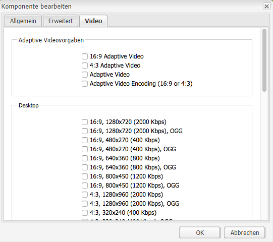

# Video {#video}

Assets bieten eine zentralisierte Verwaltung von Video-Assets, bei der Sie Videos direkt in Assets hochladen können, um sie automatisch in Dynamic Media Classic zu kodieren. Sie können auch direkt von Assets aus auf Dynamic Media Classic-Videos zugreifen, um Seiten zu erstellen.

Die Dynamic Media Classic-Videointegration erweitert die Reichweite optimierter Videos auf alle Bildschirme (automatische Geräte- und Bandbreitenerkennung).

Die Komponente **[!UICONTROL Scene7 Video]** führt automatisch eine Geräte- und Bandbreitenerkennung durch, um das richtige Format und die richtige Videoqualität auf Desktop-, Tablet- und Mobilgeräten wiederzugeben.

Sie können adaptive Videosets statt nur einzelne Video-Assets einschließen. Ein adaptives Videoset ist ein Container für alle Videowiedergaben, die für die nahtlose Wiedergabe von Videos auf mehreren Bildschirmen erforderlich sind. Ein adaptives Video-Set fasst Versionen desselben Videos zusammen, die mit unterschiedlichen Bitraten und Formaten kodiert wurden. Beispiel: 400 Kbit/s, 800 Kbit/s und 1000 Kbit/s. Sie verwenden ein adaptives Video-Set zusammen mit der S7-Videokomponente für das adaptive Video-Streaming über mehrere Bildschirmtypen hinweg. Beispielsweise Desktop-, iOS-, Android-, BlackBerry- und Windows-Mobilgeräte.

Weitere Informationen zu adaptiven Videosets finden Sie unter [Dynamic Media Classic-Dokumentation.](https://experienceleague.adobe.com/docs/experience-manager-cloud-service/assets/dynamicmedia/video-profiles.html#dynamicmedia)

## Über FFMPEG und Dynamic Media Classic {#about-ffmpeg-and-scene}

Die Grundlage des standardmäßigen Videokodierungsprozesses ist die Verwendung der FFMPEG-basierten Integration mit Videoprofilen. Aus diesem Grund enthält der Standard-Aufnahme-Workflow von DAM die folgenden ffmpeg-basierten Workflow-Schritte:

* FFMPEG-Miniaturen
* FFMPEG-Kodierung

Durch Aktivieren und Konfigurieren der Dynamic Media Classic-Integration werden diese beiden Workflow-Schritte nicht automatisch aus dem vordefinierten DAM-Erfassungsarbeitsablauf entfernt oder deaktiviert. Wenn Sie in Experience Manager bereits eine FFMPEG-basierte Videokodierung verwenden, ist es wahrscheinlich, dass FFMPEG auf Ihren Authoring-Umgebung installiert ist. In diesem Fall würde ein neues Video, das mit DAM erfasst wird, zweimal kodiert werden: Einmal vom FFMPEG-Encoder und einmal von der Dynamic Media Classic-Integration.

Wenn Sie die FFMPEG-basierte Videokodierung in AEM und FFMPEG konfiguriert haben, können Sie die beiden FFMPEG-Workflows aus Ihrer DAM-ErfassungsWorkflows entfernen.

## Unterstützte Formate {#supported-formats}

Die folgenden Formate werden für die Scene7-Videokomponente unterstützt:

* F4V H.264
* H.264 (.mp4)

## Festlegen eines Speicherorts für hochgeladene Videos {#deciding-where-to-upload-your-video}

Der Speicherort für hochgeladene Videos hängt von folgenden Faktoren ab:

* Benötigen Sie für das Video-Asset einen Workflow?
* Benötigen Sie für das Video-Asset eine Versionskontrolle?

Falls Sie eine der Fragen mit „ja“ beantworten können, laden Sie Ihr Video direkt in Adobe DAM hoch. Wenn beide Fragen mit &quot;Nein&quot;beantwortet werden, laden Sie Ihr Video direkt in Dynamic Media Classic hoch. Der Arbeitsablauf für jedes Szenario wird in den nächsten Abschnitten beschrieben.

### Wenn Sie Ihr Video direkt in Adobe DAM hochladen {#if-you-are-uploading-your-video-directly-to-adobe-dam}

Wenn Sie einen Workflow oder eine Versionierung für Ihre Assets benötigen, laden Sie zuerst in die DAM-Adobe hoch. Der folgende Workflow wird empfohlen:

1. Laden Sie das Video-Asset in Adobe DAM hoch und kodieren und veröffentlichen Sie es automatisch in Dynamic Media Classic.
1. Greifen Sie in Experience Manager auf die Video-Assets in WCM auf der Registerkarte **[!UICONTROL Filme]** der Inhaltssuche zu.
1. Autor mit der Komponente **[!UICONTROL Scene7 Video]** oder **[!UICONTROL Foundation Video]**.

### Wenn Sie Ihr Video in Scene7 hochladen {#if-you-are-uploading-your-video-to-scene}

Wenn Sie keinen Workflow oder keine Versionierung für Ihre Assets benötigen, laden Sie Ihre Assets nach Scene7 hoch. Der folgende Workflow wird empfohlen:

1. Richten Sie in Dynamic Media Classic [ein geplantes FTP-Hochladen und -Kodieren auf Scene7 (systemautomatisiert)](https://experienceleague.adobe.com/docs/dynamic-media-classic/using/upload-publish/uploading-files.html#preparing-your-assets-and-folders-for-uploading) ein.
1. Greifen Sie in Experience Manager auf die Video-Assets in WCM auf der Registerkarte **[!UICONTROL Scene7]** der Inhaltssuche zu.
1. Autor mit der Komponente **[!UICONTROL Scene7 Video]**.

## Konfigurieren der Integration mit Scene7-Videos {#configuring-integration-with-scene-video}

So konfigurieren Sie universelle Vorlagen:

1. Navigieren Sie in **[!UICONTROL Cloud-Services]** zu Ihrer **[!UICONTROL Scene7]**-Konfiguration und klicken Sie auf **[!UICONTROL Bearbeiten]**.
1. Wählen Sie die Registerkarte **[!UICONTROL Video]** aus.

   

   >[!NOTE]
   >
   >Die Registerkarte **[!UICONTROL Video]** wird nicht angezeigt, wenn die Seite keine Cloud-Konfiguration hat.

1. Wählen Sie das Profil für adaptive Videokodierung, ein Standardprofil für die Kodierung einzelner Videos, oder ein benutzerdefiniertes Videokodierungsprofil aus.

   >[!NOTE]
   >
   >Weitere Informationen über die Bedeutung der Video-Vorgaben finden Sie in der [Dynamic Media Classic-Dokumentation](https://experienceleague.adobe.com/docs/dynamic-media-classic/using/setup/application-setup.html#video-presets-for-encoding-video-files).
   >
   >Adobe empfiehlt, entweder beide adaptive Videosets bei der Konfiguration der universellen Vorlagen oder die Option **[!UICONTROL Adaptive Videokodierung]** auszuwählen.

1. Die ausgewählten Kodierungsprofile werden automatisch auf alle Videos angewendet, die in den CQ DAM-Zielordner, den Sie für diese Scene7-Cloud-Konfiguration einrichten, hochgeladen werden. Sie können mehrere Scene7-Cloud-Konfigurationen mit verschiedenen Zielordnern einrichten, um nach Bedarf verschiedene Kodierungsprofile anzuwenden.

## Aktualisieren von Viewer- und Kodierungsvorlagen  {#updating-viewer-and-encoding-presets}

Die Viewer- und Kodierungsvorgaben für Videos müssen in Experience Manager aktualisiert werden, wenn die Vorgaben in Scene7 aktualisiert wurden. Navigieren Sie in diesen Fällen zur Scene7-Konfiguration in der Cloud-Konfiguration und klicken Sie auf **[!UICONTROL Aktualisieren Sie den Viewer und die Kodierungsvorgaben]**.

## Hochladen Ihres Übergeordnet Videos von Adobe DAM nach Scene7{#uploading-your-master-video}

1. Navigieren Sie zum CQ DAM-Zielordner, in dem Sie Ihre Cloud-Konfiguration mit Scene7-Kodierungsprofilen eingerichtet haben.
1. Klicken Sie auf **[!UICONTROL Hochladen]**, um das Mastervideo hochzuladen. Das Hochladen und Kodieren von Videos ist nach Abschluss des Arbeitsablaufs für DAM-Aktualisierung des Assets abgeschlossen und **[!UICONTROL Auf Scene7 veröffentlichen]** hat ein Häkchen.

   >[!NOTE]
   >
   >Die Erstellung der Videominiaturen dauert einige Zeit.

   Wenn Sie das DAM-Übergeordnet-Video auf die Videokomponente ziehen, werden alle *alle*-Scene7-kodierten Proxydarstellungen für den Versand aufgerufen.

## Foundation-Videokomponente im Vergleich zur Scene7-Videokomponente {#foundation-video-component-versus-scene-video-component}

Bei Verwendung von Experience Manager haben Sie Zugriff auf die Videokomponente, die in Sites und der Scene7-Videokomponente verfügbar ist. Diese Komponenten sind nicht austauschbar.

Die Scene7-Videokomponente funktioniert nur für Scene7-Videos. Die Stiftungskomponente funktioniert mit Videos, die in Experience Manager (mithilfe von ffmpeg) und Scene7-Videos gespeichert wurden.

In der folgenden Tabelle wird erläutert, wann welche Komponente verwendet wird:

>[!NOTE]
>
>Standardmäßig verwendet die S7-Videokomponente das universelle Video-Profil. Sie können jedoch den HTML5-basierten Videoplayer in Experience Manager abrufen. Kopieren Sie einfach den Einbettungscode des vordefinierten HTML5-Videoplayers und fügen Sie ihn auf Ihre Experience Manager-Seite ein.

## Experience Manager-Videokomponente {#aem-video-component}

Auch wenn die Verwendung der Scene7-Videokomponente für die Anzeige von Scene7-Videos empfohlen wird, verwenden Sie aus Gründen der Vollständigkeit Scene7-Videos mit der Foundation-Videokomponente.

### Experience Manager Video- und Scene7-Videovergleich {#aem-video-and-scene-video-comparison}

Die folgende Tabelle bietet einen umfassenden Vergleich der unterstützten Funktionen zwischen der Videokomponente von Experience Manager Foundation und der Scene7-Videokomponente:

|  | Experience Manager Foundation-Video | Scene7 Video |
|---|---|---|
| Ansatz | HTML5 hat Priorität. Flash dient nur zum Ausweichen bei Nicht-HTML5-Inhalten. | Flash auf den meisten Desktopgeräten HTML5 kommt auf Mobilgeräten und Tablets zum Einsatz. |
| Bereitstellung | Progressiv | Adaptives Streaming |
| Nachverfolgung | Ja | Ja |
| Erweiterbarkeit | Ja | Ja (mit [HTML5 Viewer SDK API-Dokumentation](https://s7d1.scene7.com/s7sdk/3.10/docs/jsdoc/index.html)) |
| Mobile Videos | Ja | Ja |

### Einrichtung  {#setting-up}

#### Erstellen von Videoprofilen {#creating-video-profiles}

Die verschiedenen Videokodierungen werden entsprechend den in Ihrer Scene7 Cloud-Konfiguration ausgewählten Scene7-Kodierungsvorgaben erstellt. Damit die Foundation-Videokomponente diese verwenden kann, muss für jede ausgewählte Scene7-Kodierungsvorgabe ein Profil erstellt werden. Mit dieser Methode kann die Videokomponente die DAM-Darstellungen entsprechend auswählen.

>[!NOTE]
>
>Neue Videoprofile und Änderungen daran müssen für eine Veröffentlichung aktiviert werden.

1. Tippen Sie in Experience Manager auf **[!UICONTROL Tools] > [!UICONTROL Konfigurationskonsole]**.
1. Navigieren Sie in der Navigationsstruktur von **[!UICONTROL Konfigurationskonsole]** zu **[!UICONTROL Tools > DAM > Video-Profil]**.
1. Erstellen Sie ein Scene7 Video-Profil. Im Ordner **[!UICONTROL Neu...]** Dropdown-Liste, wählen Sie **[!UICONTROL Seite erstellen]** und wählen Sie dann die Scene7 Video-Profil-Vorlage aus. Geben Sie der neuen Videoprofilseite einen Namen und klicken Sie auf **[!UICONTROL Erstellen]**.

   

1. Bearbeiten Sie das neue Videoprofil. Wählen Sie zuerst die Cloud-Konfiguration aus. Wählen Sie anschließend dieselbe Kodierungsvorlage aus, die Sie bereits in der Cloud-Konfiguration ausgewählt haben.

   

   | Eigenschaft | Beschreibung |
   |---|---|
   | Scene7-Cloud-Konfiguration | Die Cloud-Konfiguration, die für die Kodierungsvorlagen verwendet werden soll |
   | Scene7-Kodierungsvorlage | Die Kodierungsvorlage, die diesem Videoprofil zugeordnet werden soll |
   | HTML5-Videotyp | Mit dieser Eigenschaft können Sie den Wert der type-Eigenschaft des HTML5-Videoquellelements festlegen. Diese Information wird nicht von den S7-Kodierungsvorlagen bereitgestellt, sie ist jedoch erforderlich, um die Videos anhand des HTML5-Videoelements richtig zu rendern. Eine Liste für gängige Formate wird bereitgestellt, kann jedoch für andere Formate überschrieben werden. |

   Wiederholen Sie diesen Schritt für alle in der Cloud-Konfiguration ausgewählten Kodierungsvorlagen, die Sie in der Videokomponente verwenden möchten.

#### Konfigurieren von Design {#configuring-design}

Die Komponente **[!UICONTROL Foundation Video]** muss wissen, welche Video-Profil zum Erstellen der Liste der Videoquellen verwendet werden sollen. Öffnen Sie das Dialogfeld für den Entwurf von Videokomponenten und konfigurieren Sie den Komponentenentwurf für die Verwendung der neuen Video-Profil.

>[!NOTE]
>
>Wenn Sie die Komponente **[!UICONTROL Foundation Video]** auf einer mobilen Seite verwenden, wiederholen Sie diese Schritte im Design der mobilen Seite.

>[!NOTE]
>
>Änderungen am Entwurf erfordern eine Aktivierung des Entwurfs, damit sie bei der Veröffentlichung wirksam werden können.

1. Öffnen Sie das Designdialogfeld der Komponente **[!UICONTROL Foundation Video]** und wechseln Sie zur Registerkarte **[!UICONTROL Profile]**. Löschen Sie dann die vordefinierten Profil und fügen Sie die neuen S7-Profil hinzu. Die Reihenfolge der Profil-Liste im Dialogfeld &quot;Entwurf&quot;definiert die Reihenfolge des Videoquellen-Elements beim Rendern.
1. Bei Browsern, die HTML5 nicht unterstützen, können Sie mit der Videokomponente einen Flash-Fallback konfigurieren. Öffnen Sie das Dialogfeld für den Entwurf von Videokomponenten und wechseln Sie zur Registerkarte **[!UICONTROL Flash]**. Konfigurieren Sie die Einstellungen des Flash Players und weisen Sie dem Flash Player ein Fallback-Profil zu.

#### Checkliste {#checklist}

1. Erstellen Sie eine S7 Cloud-Konfiguration. Vergewissern Sie sich, dass die Videokodierungsvorgaben festgelegt sind und der Importeur ausgeführt wird.
1. Erstellen Sie ein S7-Videoprofil für jede in der Cloud-Konfiguration ausgewählte Videokodierungsvorlage.
1. Die Videoprofile müssen aktiviert sein.
1. Konfigurieren Sie das Design der Komponente **[!UICONTROL Foundation Video]** auf Ihrer Seite.
1. Aktivieren Sie das Design, nachdem Sie mit Ihren Designänderungen fertig sind.
