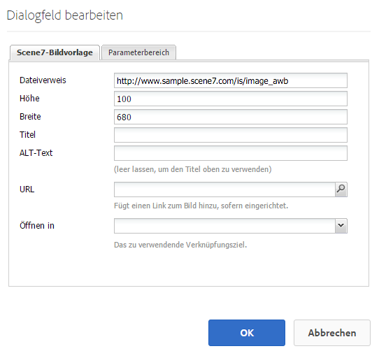
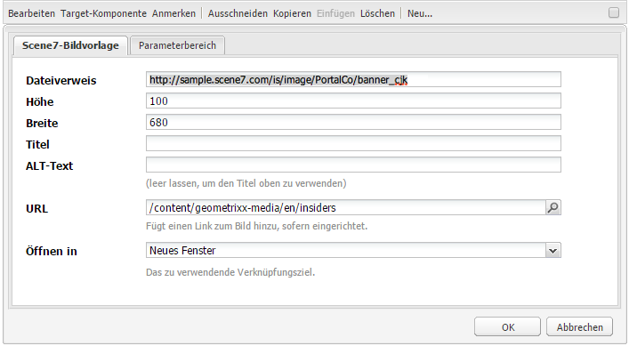

# Hinzufügen von Dynamic Media Classic-Komponenten zu Seiten {#adding-scene-features-to-your-page}

>[!CAUTION]
>
>AEM 6.4 hat das Ende der erweiterten Unterstützung erreicht und diese Dokumentation wird nicht mehr aktualisiert. Weitere Informationen finden Sie in unserer [technische Unterstützung](https://helpx.adobe.com/de/support/programs/eol-matrix.html). Unterstützte Versionen suchen [here](https://experienceleague.adobe.com/docs/?lang=de).

Adobe Dynamic Media Classic ist eine gehostete Lösung für die Verwaltung, Optimierung, Veröffentlichung und Bereitstellung von Rich-Media-Assets für Web-, Mobil-, E-Mail- und Internet-verbundene Anzeigen und Ausdrucke.

Sie können AEM Assets anzeigen, die in Dynamic Media Classic in verschiedenen Viewern veröffentlicht wurden:

* Zoom
* Flyout
* Video
* Bildvorlage
* Bild

Sie können digitale Assets direkt aus AEM in Dynamic Media Classic veröffentlichen und digitale Assets aus Dynamic Media Classic in AEM veröffentlichen.

In diesem Dokument wird beschrieben, wie Sie digitale Assets von AEM in Dynamic Media Classic veröffentlichen und umgekehrt. Die Viewer werden auch detailliert beschrieben. Informationen zum Konfigurieren von AEM für Dynamic Media Classic finden Sie unter [Integrieren von Dynamic Media Classic mit AEM](/help/sites-administering/scene7.md).

Siehe auch [Hinzufügen von Imagemaps](image-maps.md).

Weitere Informationen zur Verwendung von Videokomponenten mit AEM finden Sie unter [Video](video.md).

>[!NOTE]
>
>Wenn Dynamic Media Classic-Assets nicht ordnungsgemäß angezeigt werden, stellen Sie sicher, dass Dynamic Media [disabled](config-dynamic.md#disabling-dynamic-media) und aktualisieren Sie dann die Seite.

## Manuelles Veröffentlichen von Assets in Dynamic Media Classic {#manually-publishing-to-scene-from-assets}

Sie können digitale Assets wie folgt in Dynamic Media Classic veröffentlichen:

* [In der Assets-Konsole, klassische Benutzeroberfläche](/help/sites-classic-ui-authoring/manage-assets-classic-s7.md#publishing-from-the-assets-console)
* [Von einem Asset, klassische Benutzeroberfläche](/help/sites-classic-ui-authoring/manage-assets-classic-s7.md#publishing-from-an-asset)
* [In der klassischen Benutzeroberfläche von außerhalb des Ordners &quot;CQ Target&quot;](/help/sites-classic-ui-authoring/manage-assets-classic-s7.md#publishing-assets-from-outside-the-cq-target-folder)

>[!NOTE]
>
>AEM veröffentlicht asynchron in Dynamic Media Classic. Nachdem Sie auf **[!UICONTROL Veröffentlichen]** kann es mehrere Sekunden dauern, bis Ihr Asset in Dynamic Media Classic veröffentlicht wird.

## Dynamic Media Classic-Komponenten {#scene-components}

Die folgenden Dynamic Media Classic-Komponenten sind in AEM verfügbar:

* Zoom
* Flyout (Zoom)
* Bildvorlage
* Bild
* Video

>[!NOTE]
>
>Diese Komponenten sind standardmäßig nicht verfügbar und müssen in **[!UICONTROL Design]** -Modus vor der Verwendung.

Nachdem sie verfügbar gemacht wurden in **[!UICONTROL Design]** -Modus können Sie die Komponenten wie jede andere AEM Ihrer Seite hinzufügen. Assets, die noch nicht in Dynamic Media Classic veröffentlicht wurden, werden in Dynamic Media Classic veröffentlicht, wenn sie sich in einem synchronisierten Ordner oder auf einer Seite befinden oder eine Dynamic Media Classic-Cloud-Konfiguration aufweisen.

>[!NOTE]
>
>Wenn Sie benutzerdefinierte Viewer erstellen und entwickeln und den Content Finder verwenden, müssen Sie explizit die **[!UICONTROL allowfullscreen]** Parameter.

### Hinweis zur Einstellung von Flash-Viewern {#flash-viewers-end-of-life-notice}

Am 31. Januar 2017 hat Adobe Dynamic Media Classic die Unterstützung für die Flash-Viewer-Plattform beendet.

### Hinzufügen einer Dynamic Media Classic-Komponente (Scene7) zu einer Seite {#adding-a-scene-component-to-a-page}

Das Hinzufügen einer Dynamic Media Classic-Komponente (Scene7) entspricht dem Hinzufügen einer Komponente zu einer Seite. Dynamic Media Classic-Komponenten werden in den folgenden Abschnitten ausführlich beschrieben.

**So fügen Sie eine Dynamic Media Classic-Komponente (Scene7) zu einer Seite hinzu**:

1. Öffnen Sie in AEM die Seite, auf der Sie die Dynamic Media Classic (Scene7)-Komponente hinzufügen möchten.

1. Wenn keine Dynamic Media Classic-Komponenten verfügbar sind, klicken Sie auf **[!UICONTROL Design]** -Modus tippen Sie auf eine beliebige Komponente mit einem blauen Rahmen und tippen Sie auf die **[!UICONTROL Übergeordnet]** und dann die **[!UICONTROL Konfiguration]** Symbol. In **[!UICONTROL Parsys (Design)]**, wählen Sie alle Dynamic Media Classic-Komponenten aus, um sie verfügbar zu machen, und klicken Sie auf **[!UICONTROL OK]**.

   

1. Klicken **[!UICONTROL Bearbeiten]** zurück zu **[!UICONTROL Bearbeiten]** -Modus.

1. Ziehen Sie eine Komponente aus der Dynamic Media Classic-Gruppe im Sidekick an die gewünschte Position auf die Seite.

1. Klicken Sie auf **[!UICONTROL Konfiguration]** -Symbol, um die Komponente zu öffnen.

1. Bearbeiten Sie die Komponente nach Bedarf und klicken Sie auf **[!UICONTROL OK]** , um Änderungen zu speichern.
1. Ziehen Sie Ihr Bild oder Video aus dem Inhaltsbrowser auf die Dynamic Media Classic-Komponente, die Sie zur Seite hinzugefügt haben.

   >[!NOTE]
   >
   >Nur in der Touch-optimierten Benutzeroberfläche müssen Sie das Bild oder Video auf die Dynamic Media Classic-Komponente ziehen, die Sie zur Seite hinzugefügt haben. Es ist nicht möglich, zunächst die Dynamic Media Classic-Komponente auszuwählen und zu bearbeiten und anschließend das Asset zu auszuwählen.

### Hinzufügen interaktiver Anzeigeerlebnisse zu einer responsiven Site {#adding-interactive-viewing-experiences-to-a-responsive-website}

Responsives Design für Ihre Assets bedeutet, dass sich Ihre Assets an den Ort anpassen, an dem sie angezeigt werden. Mithilfe des dynamischen Designs können dieselben Assets auf mehreren Geräten effektiv dargestellt werden.

Siehe auch [Responsives Design für Webseiten](/help/sites-developing/responsive.md).

**So fügen Sie einer responsiven Site ein interaktives Anwendererlebnis hinzu**:

1. Melden Sie sich bei AEM an und stellen Sie sicher, dass Sie [konfigurierte Adobe Dynamic Media Classic Cloud Services](/help/sites-administering/scene7.md#configuring-scene-integration) und dass Dynamic Media Classic-Komponenten verfügbar sind.

   >[!NOTE]
   >
   >Wenn keine Dynamic Media Classic-Komponenten verfügbar sind, müssen Sie sie [mit dem Designmodus aktivieren](/help/sites-authoring/default-components-designmode.md).

1. Ziehen Sie auf einer Website mit aktivierten **[!UICONTROL Dynamic Media Classic]**-Komponenten eine **[!UICONTROL Bild]**-Komponente auf die Seite.
1. Wählen Sie die Komponente aus und tippen Sie auf das Konfigurationssymbol.
1. Passen Sie auf der Registerkarte **[!UICONTROL Dynamic Media Classic-Einstellungen]** die Breakpoints an.

   

1. Bestätigen Sie, dass die Größe der Viewer dynamisch geändert wird und dass alle Interaktionen für Desktop-Computer, Tablets und Mobilgeräte optimiert sind.

### Gemeinsame Einstellungen für alle Dynamic Media Classic-Komponenten {#settings-common-to-all-scene-components}

Auch wenn sich die Konfigurationsoptionen unterscheiden, sind folgende Einstellungen für alle [!UICONTROL Dynamic Media Classic]-Komponenten gleich:

* **[!UICONTROL Dateiverweis]**
Navigieren Sie zu einer Datei, auf die Sie verweisen möchten. Der Dateiverweis zeigt die Asset-URL und nicht zwangsläufig die vollständige Dynamic Media Classic-URL, einschließlich der URL-Befehle und -Parameter. Das Hinzufügen von Dynamic Media Classic-URL-Befehlen und -Parametern ist in diesem Feld nicht möglich. Sie müssen über die entsprechende Funktionalität in der Komponente hinzugefügt werden.
* **[!UICONTROL Breite]**
Hier können Sie die Breite festlegen.
* **[!UICONTROL Höhe]**
Hier können Sie die Höhe festlegen.

Sie können diese Konfigurationsoptionen festlegen, indem Sie eine Dynamic Media Classic-Komponente (per Doppelklick) öffnen. Zum Beispiel beim Öffnen einer **[!UICONTROL Zoom]**-Komponente:

### Zoom {#zoom}

Die HTML5-Zoom-Komponente zeigt ein größeres Bild an, wenn Sie die Taste **[!UICONTROL +]** drücken.

Das Asset verfügt unten über Zoomwerkzeuge. Tippen **[!UICONTROL +]** vergrößern. Tippen **[!UICONTROL -]** reduzieren. Durch Tippen auf **[!UICONTROL x]** oder den Pfeil zum Zurücksetzen des Zooms wird das Bild auf die ursprüngliche Größe zurückgesetzt, in der es importiert wurde. Tippen Sie auf die diagonalen Pfeile, um den Vollbildmodus zu aktivieren. Tippen **[!UICONTROL Bearbeiten]** , um die Komponente zu konfigurieren. Mit dieser Komponente können Sie die [gemeinsamen Einstellungen für alle [!UICONTROL Dynamic Media Classic]-Komponenten](#settings-common-to-all-scene-components) konfigurieren.

### Flyout {#flyout}

In der HTML5-**[!UICONTROL Flyout]**-Komponente wird das Asset als geteilter Bildschirm angezeigt. Links wird das Asset in der angegebenen Größe angezeigt, rechts wird der Zoom-Teil dargestellt. Tippen **[!UICONTROL Bearbeiten]** , um die Komponente zu konfigurieren. Mit dieser Komponente können Sie die [gemeinsamen Einstellungen für alle Dynamic Media Classic-Komponenten](#settings-common-to-all-scene-components) konfigurieren.

>[!NOTE]
>
>Wenn die **[!UICONTROL Flyout]**-Komponente eine benutzerdefinierte Größe aufweist, wird diese benutzerdefinierte Größe verwendet und das responsive Setup der Komponente wird deaktiviert.
>
>Wenn **[!UICONTROL Flyout]** -Komponente verwendet die Standardgröße, wie im Abschnitt **[!UICONTROL Designansicht]** festgelegt ist, wird die Standardgröße verwendet und die Komponente erstreckt sich, um die Seitenlayoutgröße mit der responsiven Einrichtung der Komponente anzupassen. Beachten Sie jedoch, dass es eine Einschränkung hinsichtlich der responsiven Einrichtung der Komponente gibt. Wenn Sie die **[!UICONTROL Flyout]** -Komponente mit responsiven Einstellungen verwenden, sollten Sie sie nicht mit vollständiger Seitendehnung verwenden. Andernfalls wird die **[!UICONTROL Flyout]** kann sich über den rechten Rand der Seite hinaus erstrecken.

### Bild {#image}

Mit der Dynamic Media Classic-Komponente **[!UICONTROL Bild]** können Sie Bildern Dynamic Media Classic-Funktionen hinzufügen, z. B. Dynamic Media Classic-Modifikatoren, Bild- oder Viewer-Vorgaben und Scharfzeichnen. Die Dynamic Media Classic **[!UICONTROL Bild]** -Komponente ähnelt anderen Bildkomponenten in AEM mit speziellen Dynamic Media Classic-Funktionen. In diesem Beispiel enthält das Bild den Dynamic Media Classic URL-Modifikator, **&amp;op_invert=1** angewendet.

* **[!UICONTROL Titel, Alternativtext]**
Im **[!UICONTROL Erweitert]** hinzufügen, fügen Sie einen Titel zum Bild und alternativen Text für die Benutzer hinzu, deren Grafiken deaktiviert sind.

* **[!UICONTROL URL, Öffnen in]**
Sie können ein Asset in festlegen, um einen Link zu öffnen. Legen Sie die **[!UICONTROL URL]** fest. Geben Sie in **[!UICONTROL Öffnen in]** an, ob der Link im selben oder einem neuen Fenster geöffnet werden soll.

* **[!UICONTROL Viewer-Vorgabe]**
Wählen Sie eine vorhandene Viewer-Vorgabe aus dem Dropdown-Menü aus. Wenn die gewünschte Viewer-Vorgabe nicht sichtbar ist, müssen Sie sie möglicherweise sichtbar machen. Siehe [Verwalten von Viewer-Vorgaben](/help/assets/managing-viewer-presets.md). Sie können keine Viewer-Vorgabe auswählen, wenn Sie eine Bildvorgabe verwenden und umgekehrt.

* **[!UICONTROL Dynamic Media Classic-Konfiguration]**
Wählen Sie die Dynamic Media Classic-Konfiguration aus, die Sie verwenden möchten, um aktive Bildvorgaben aus SPS abzurufen.

* **[!UICONTROL Bildvorgabe]**
Wählen Sie eine vorhandene Bildvorgabe aus dem Dropdown-Menü aus. Wenn die gewünschte Bildvorgabe nicht sichtbar ist, müssen Sie sie möglicherweise sichtbar machen. Siehe [Verwalten von Bildvorgaben](/help/assets/managing-image-presets.md). Sie können keine Viewer-Vorgabe auswählen, wenn Sie eine Bildvorgabe verwenden und umgekehrt.

* **[!UICONTROL Ausgabeformat]**
Wählen Sie das Ausgabeformat des Bildes aus, z. B. jpeg. In Abhängigkeit des von Ihnen ausgewählten Ausgabeformats stehen Ihnen möglicherweise zusätzliche Konfigurationsoptionen zur Verfügung. Siehe [Best Practices für Bildvorgaben](/help/assets/managing-image-presets.md#image-preset-options).

* **[!UICONTROL Scharfzeichnen]**
Wählen Sie aus, wie das Bild scharfgezeichnet werden soll. Das Scharfzeichnen wird unter [Best Practices für Bildvorgaben](/help/assets/managing-image-presets.md#image-preset-options) und [Best Practices für das Scharfzeichnen](/help/assets/assets/sharpening_images.pdf) detailliert beschrieben.

* **[!UICONTROL URL-Modifikatoren]**
Sie können Bildeffekte ändern, indem Sie zusätzliche Dynamic Media Classic-Bildbefehle bereitstellen. Diese werden unter [Bildvorgaben](/help/assets/managing-image-presets.md) und [Befehlsreferenz](https://experienceleague.adobe.com/docs/dynamic-media-developer-resources/image-serving-api/image-serving-api/http-protocol-reference/command-reference/c-command-reference.html?lang=de).

* **[!UICONTROL Haltepunkte]**
Wenn Ihre Website dynamisch ist, möchten Sie die Haltepunkte anpassen. Breakpoints müssen durch Kommas (,) voneinander getrennt werden.

### Bildvorlage {#image-template}

[Dynamic Media Classic-Bildvorlagen](https://experienceleague.adobe.com/docs/dynamic-media-classic/using/template-basics/creating-template.html#creating-the-initial-template) sind mehrschichtige Photoshop-Inhalte, die in Dynamic Media Classic importiert wurden, wo Inhalte und Eigenschaften für Variabilität parametrisiert wurden. Die **[!UICONTROL Bildvorlage]** -Komponente können Sie Bilder importieren und den Text in AEM dynamisch ändern. Zusätzlich können Sie die Komponente **[!UICONTROL Bildvorlage]** dahingehend konfigurieren, dass sie Werte aus dem Client-Kontext übernimmt, damit das Bild jedem Benutzer personalisiert angezeigt wird.

Tippen **[!UICONTROL Bearbeiten]** , um die Komponente zu konfigurieren. Sie können [Einstellungen, die für alle Dynamic Media Classic-Komponenten gelten](#settings-common-to-all-scene-components) sowie anderen in diesem Abschnitt beschriebenen Einstellungen.

* **[!UICONTROL Dateiverweis, Breite, Höhe]**
Siehe für alle Dynamic Media Classic-Komponenten gemeinsame Einstellungen .

   >[!NOTE]
   >
   >Dynamic Media Classic-URL-Befehle und -Parameter können nicht direkt zur Dateiverweis-URL hinzugefügt werden. Sie können nur auf der Komponenten-Benutzeroberfläche im Bedienfeld **[!UICONTROL Parameter]** definiert werden.

* **[!UICONTROL Titel, Alternativtext]**
Fügen Sie auf der Registerkarte Dynamic Media Classic-Bildvorlage einen Titel zum Bild und Alternativtext für die Benutzer hinzu, deren Grafiken deaktiviert sind.

* **[!UICONTROL URL, Öffnen in]**
Sie können ein Asset in festlegen, um einen Link zu öffnen. Legen Sie die URL fest. Geben Sie in „Öffnen in“ an, ob der Link im selben oder einem neuen Fenster geöffnet werden soll.

* **[!UICONTROL Parameterbereich]**
Beim Importieren eines Bildes werden die Parameter vorab mit Informationen aus dem Bild gefüllt. Wenn kein Inhalt vorhanden ist, der dynamisch geändert werden kann, ist dieses Fenster leer.

#### Dynamisches Ändern von Text {#changing-text-dynamically}

Um den Text dynamisch zu ändern, geben Sie neuen Text in die Felder ein und klicken Sie auf **[!UICONTROL OK]**. In diesem Beispiel lautet der **[!UICONTROL Preis]** 50 $ und der Versand kostet 0,99 $.

Der Text im Bild ändert sich. Sie können den Text auf den ursprünglichen Wert zurücksetzen, indem Sie neben dem Feld auf **[!UICONTROL Zurücksetzen]** tippen.

#### Ändern von Text, um den Wert eines Client-Kontextwerts widerzuspiegeln {#changing-text-to-reflect-the-value-of-a-client-context-value}

Um ein Feld mit einem Client-Kontextwert zu verknüpfen, tippen Sie auf **[!UICONTROL Auswählen]** zum Öffnen des Kontextmenüs des Clients wählen Sie den Client-Kontext aus und tippen Sie auf **[!UICONTROL OK]**. In diesem Beispiel ändert sich der Name auf Grundlage der Verknüpfung des Namens mit dem formatierten Namen im Profil.

Der Text berücksichtigt den Namen des aktuell angemeldeten Benutzers. Sie können den Text auf den ursprünglichen Wert zurücksetzen, indem Sie neben dem Feld auf **[!UICONTROL Zurücksetzen]** klicken.

#### Verknüpfen der Dynamic Media Classic-Bildvorlage {#making-the-scene-image-template-a-link}

1. Auf der Seite mit der Dynamic Media Classic **[!UICONTROL Bildvorlage]** Komponente, tippen **[!UICONTROL Bearbeiten]**.
1. Geben Sie im Feld **[!UICONTROL URL]** die URL ein, zu der Benutzer wechseln, wenn sie auf das Bild tippen. Wählen Sie im Feld **[!UICONTROL Öffnen in]** aus, ob das Ziel (in einem neuen oder im selben Fenster) geöffnet werden soll.

   

1. Tippen Sie auf **[!UICONTROL OK]**.

### Komponente „Video“ {#video-component}

Die Dynamic Media Classic-Komponente **[!UICONTROL Video]** (verfügbar über den Dynamic Media Classic-Abschnitt im Sidekick) verwendet die Geräte- und Bandbreitenerkennung, damit auf jedem Bildschirm das richtige Video bereitgestellt wird. Bei dieser Komponente handelt es sich um einen HTML5-Video-Player. Es ist ein einzelner Viewer, der kanalübergreifend verwendet werden kann.

Er kann für adaptive Videosets, ein einzelnes MP4-Video oder ein einzelnes F4V-Video verwendet werden.

Weitere Informationen darüber, wie Videos mit Dynamic Media Classic-Integration funktionieren, finden Sie unter [Video](s7-video.md). Vergleichen Sie zudem [die Dynamic Media Classic-Videokomponente mit der Foundation-Videokomponente](s7-video.md).

### Bekannte Einschränkungen für die Videokomponente {#known-limitations-for-the-video-component}

Adobe DAM und WCM zeigen an, ob ein Übergeordnetes Video hochgeladen wurde. Sie zeigen diese Proxy-Assets nicht an:

* Dynamic Media Classic-kodierte Ausgabedarstellungen
* Adaptive Dynamic Media Classic-Videosets

Wenn Sie ein adaptives Videoset mit der Dynamic Media Classic-Videokomponente verwenden, müssen Sie die Größe der Komponente ändern, um die Abmessungen des Videos anzupassen.

## Dynamic Media Classic-Inhaltsbrowser {#scene-content-browser}

Mit dem Dynamic Media Classic-Inhaltsbrowser können Sie Inhalte aus Dynamic Media Classic direkt in AEM anzeigen. Wählen Sie für den Zugriff auf den Inhaltsbrowser in der **[!UICONTROL Inhaltssuche]** die Option **[!UICONTROL Dynamic Media Classic]** auf der Touch-optimierten Benutzeroberfläche oder das Symbol **[!UICONTROL S7]** auf der klassischen Benutzeroberfläche aus. Die Funktionalität ist auf den beiden Benutzeroberflächen identisch.

Wenn Sie mehrere Konfigurationen haben, zeigt AEM standardmäßig die [Standardkonfiguration](/help/sites-administering/scene7.md#configuring-a-default-configuration). Sie können unterschiedliche Kategorien direkt im Dynamic Media Classic-Inhaltsbrowser im Dropdown-Menü auswählen.

>[!NOTE]
>
>* Im Ad-hoc-Ordner befindliche Assets werden nicht im Dynamic Media Classic-Inhaltsbrowser angezeigt.
>* Wenn [Sichere Vorschau](/help/sites-administering/scene7.md#configuring-the-state-published-unpublished-of-assets-pushed-to-scene) aktiviert ist, werden in Dynamic Media Classic veröffentlichte und nicht veröffentlichte Assets im Dynamic Media Classic-Inhaltsbrowser angezeigt.
>* Wenn Sie **[!UICONTROL Dynamic Media Classic]** oder **[!UICONTROL S7]** -Symbol als Option im Inhaltsbrowser verwenden, müssen Sie [Dynamic Media Classic für die Verwendung mit AEM konfigurieren](/help/sites-administering/scene7.md).
>* Für Videos unterstützt der Dynamic Media Classic-Inhaltsbrowser Folgendes:
   >   * Adaptive Videosets: Container von allen für die bildschirmübergreifende optimierte Wiedergabe erforderlichen Videoausgabedarstellungen
   >   * Einzelnes MP4-Video
   >   * Einzelnes F4V-Video

### Durchsuchen von Inhalten in der Touch-optimierten Benutzeroberfläche {#browsing-content-in-the-touch-optimized-ui}

Sie können entweder über die Touch-optimierte oder die klassische Benutzeroberfläche auf den Inhaltsbrowser zugreifen. Derzeit gilt für die Touch-optimierte Funktion die folgende Einschränkung:

* FXG- und Flash-Assets aus Dynamic Media Classic werden nicht unterstützt.

Durchsuchen Sie Dynamic Media Classic-Assets, indem Sie **[!UICONTROL Dynamic Media Classic]** aus dem dritten Dropdown-Menü auswählen. Dynamic Media Classic wird nicht in der Liste angezeigt, wenn Sie die Dynamic Media Classic/AEM-Integration nicht konfiguriert haben.

>[!NOTE]
>
>* Der Dynamic Media Classic-Inhaltsbrowser lädt etwa 100 Assets und sortiert sie nach Namen.
>* Wenn Sie einen sicheren Vorschauserver eingerichtet haben, verwendet der Browser diesen Vorschauserver zum Rendern von Miniaturansichten und Assets.
>

Zusätzlich können Sie Informationen über Auflösung, Größe, Tage seit der Änderung und Dateiname erhalten, indem Sie den Mauszeiger über das Asset im Browser halten.

* Für adaptive Videosets und Vorlagen werden keine Größeninformationen für Miniaturansichten generiert.
* Für adaptive Videosets wird keine Auflösung für Miniaturansichten generiert.

### Suchen nach Dynamic Media Classic-Assets mit dem Inhaltsbrowser {#searching-for-scene-assets-with-the-content-browser}

Die Suche nach Dynamic Media Classic-Assets verläuft ähnlich wie die Suche nach AEM Assets. Bei der Suche wird Ihnen jedoch im Dynamic Media Classic-System eine Remote-Ansicht der Assets angezeigt, anstatt sie direkt in AEM zu importieren.

Sie können entweder die klassische oder die Touch-optimierte Benutzeroberfläche verwenden, um Assets anzuzeigen und nach ihnen zu suchen. Je nach Benutzeroberfläche unterscheidet sich die Suchweise geringfügig.

Wenn Sie auf einer der Benutzeroberflächen suchen, können Sie nach den folgenden Kriterien filtern (wird hier in der Touch-optimierten Benutzeroberfläche gezeigt):

* **[!UICONTROL Suchbegriffe eingeben]**
Sie können Assets nach Namen suchen. Bei der Suche nach den eingegebenen Keywords beginnt der Dateiname mit . Zum Beispiel führt die Eingabe des Worts „schwimmen“ dazu, dass nach Asset-Dateinamen gesucht wird, die mit diesen Buchstaben in dieser Reihenfolge beginnen. Tippen Sie unbedingt auf Eingabe , nachdem Sie den Begriff eingegeben haben, um das Asset zu finden.

* **[!UICONTROL Ordner/Pfad]**
Der Name des angezeigten Ordners hängt von der ausgewählten Konfiguration ab. Sie können einen Drilldown zu niedrigeren Ebenen durchführen, indem Sie auf das Ordnersymbol tippen, einen Unterordner auswählen und dann auf das Häkchen tippen, um ihn auszuwählen.

Wenn Sie einen Suchbegriff eingeben und einen Ordner auswählen, durchsucht AEM diesen Ordner und alle Unterordner. Wenn Sie bei der Suche jedoch keine Keywords eingeben, werden bei der Auswahl des Ordners nur die Assets in diesem Ordner angezeigt, keine Unterordner.

Standardmäßig durchsucht AEM den ausgewählten Ordner und alle Unterordner.

* **[!UICONTROL Asset-Typ]**
Auswählen **[!UICONTROL Dynamic Media Classic]** , um Dynamic Media Classic-Inhalte zu durchsuchen. Diese Option ist nur verfügbar, wenn Dynamic Media Classic konfiguriert wurde.

* **[!UICONTROL Konfiguration]**
Wenn mehrere Dynamic Media Classic-Konfigurationen in definiert sind: [!UICONTROL Cloud Services]können Sie sie hier auswählen. Dadurch ändert sich der Ordner entsprechend der ausgewählten Konfiguration.

* **[!UICONTROL Asset-Typ]**
Im Dynamic Media Classic-Browser können Sie Ergebnisse filtern, um Folgendes einzuschließen: Bilder, Vorlagen, Videos und adaptive Videosets. Wenn Sie keinen Asset-Typ auswählen, durchsucht AEM standardmäßig alle Asset-Typen.

>[!NOTE]
>
>* Auf der klassischen Benutzeroberfläche können Sie auch nach **Flash** und **FXG** suchen. Die Filterung dieser Elemente in der Touch-optimierten Benutzeroberfläche wird derzeit nicht unterstützt.
>
>* Beim Durchsuchen eines Videos suchen Sie nach einer einzelnen Ausgabedarstellung. Die Ergebnisse geben die ursprüngliche (nur &amp;ast;.mp4) und die kodierte Ausgabedarstellung zurück.
>* Bei der Suche nach einem adaptiven Videoset durchsuchen Sie den Ordner und alle Unterordner, jedoch nur, wenn Sie der Suche ein Keyword hinzugefügt haben. Wenn Sie keinen Suchbegriff hinzugefügt haben, durchsucht AEM die Unterordner nicht.
>

* **[!UICONTROL Veröffentlichungsstatus]**
Sie können nach Assets basierend auf dem Veröffentlichungsstatus filtern: **[!UICONTROL Veröffentlichung rückgängig gemacht]** oder **[!UICONTROL Veröffentlicht]**. Wenn Sie keine **[!UICONTROL Veröffentlichungsstatus]** AEM durchsucht standardmäßig alle Veröffentlichungsstatus.

