# Suchen nach Assets in [!DNL Experience Manager] {#search-assets-in-aem}

>[!CAUTION]
>
>AEM 6.4 hat das Ende der erweiterten Unterstützung erreicht und diese Dokumentation wird nicht mehr aktualisiert. Weitere Informationen finden Sie in unserer [technische Unterstützung](https://helpx.adobe.com/de/support/programs/eol-matrix.html). Unterstützte Versionen suchen [here](https://experienceleague.adobe.com/docs/?lang=de).

Erfahren Sie, wie Sie die erforderlichen Assets in[!DNL Experience Manager]mithilfe des Bedienfelds „Filter“ finden und wie Sie die Assets verwenden, die bei der Suche zurückgegeben werden.

Verwenden Sie das Bedienfeld Filter, um nach Assets, Ordnern, Tags und Metadaten zu suchen. Sie können Teile einer Zeichenfolge mit dem Platzhalterzeichen durchsuchen.

Das Bedienfeld &quot;Filter&quot;bietet verschiedene Optionen, um auf mehrere Arten nach Assets und Ordnern zu suchen, anstatt in einer allgemeinen taxonomischen Reihenfolge.

Sie können anhand der folgenden Optionen (Prädikate) suchen:

* Dateityp
* Dateigröße
* Feldname
* Zuletzt geändert
* Status
* Ausrichtung
* Stil
* Insights

<!-- TBD keystroke 65 article and port applicable changes here. This content goes. -->

Sie können das Bedienfeld „Filter“ anpassen und Suchprädikate über [Suchfacetten](search-facets.md) hinzufügen/entfernen. So zeigen Sie den Bereich Filter an:

1. Tippen/klicken Sie in der Assets-Benutzeroberfläche auf  aus der Symbolleiste, um das OmniSearch-Feld anzuzeigen.
1. Geben Sie Ihren Suchbegriff ein und drücken Sie die Eingabetaste. Alternativ können Sie einfach die Eingabetaste drücken, ohne einen Suchbegriff einzugeben. Geben Sie keine führenden Leerzeichen ein, da die Suche sonst nicht funktioniert.

1. Tippen/klicken Sie auf das GlobalNav-Symbol. Der Bereich Filter wird angezeigt.

   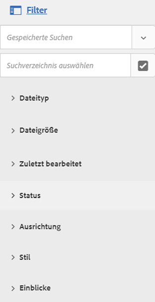

   Je nach Art der Elemente, die Sie suchen, wird die Anzahl der Übereinstimmungen oben in den Suchergebnissen angezeigt.

   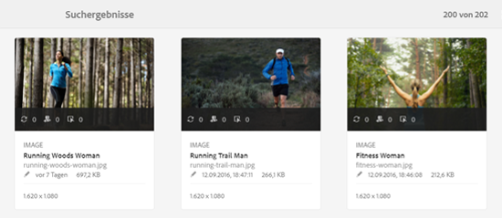

## Suchen nach Dateitypen {#search-for-file-types}

Das Bedienfeld &quot;Filter&quot;hilft Ihnen, Ihrer Suche mehr Granularität hinzuzufügen und die Suchfunktion vielseitiger zu gestalten. Sie können einfach einen Drilldown zur gewünschten Detailtiefe durchführen.

Wenn Sie beispielsweise nach einem Bild suchen, verwenden Sie die **[!UICONTROL Dateityp]** -Prädikat zur Auswahl, ob Sie ein Bitmap- oder ein Vektorbild verwenden möchten.

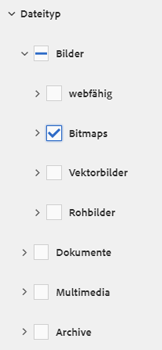

Sie können den Suchbereich weiter eingrenzen, indem Sie den MIME-Typ für das Bild angeben.

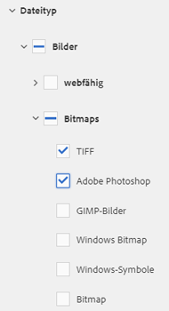

Ebenso können Sie bei der Suche nach Dokumenten das Format angeben, z. B. PDF oder MS Word.

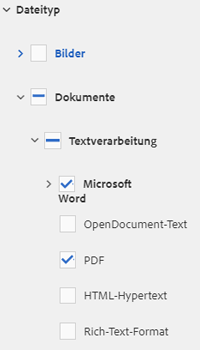

## Suche basierend auf Dateigröße {#search-based-on-file-size}

Verwenden Sie die **Dateigröße** -Eigenschaft, um basierend auf ihrer Größe nach Assets zu suchen. Sie können die unteren und oberen Grenzwerte für den Größenbereich festlegen, um Ihre Suche einzugrenzen. Sie können auch die Maßeinheit angeben, z. B. Kilobyte, Megabyte usw.

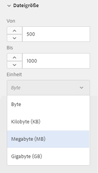

## Suche basierend darauf, wann Assets zuletzt geändert wurden {#search-based-on-when-assets-are-last-modified}

Wenn Sie laufende Assets verwalten oder einen Prüfungs-Workflow überwachen, können Sie anhand genauer Zeitstempel suchen, wann ein Asset zuletzt geändert wurde. Geben Sie beispielsweise Datumswerte vor oder nach denen Assets geändert wurden.

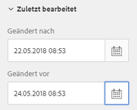

Sie können auch die folgenden Optionen verwenden, um eine höhere Granularität bei Ihrer Suche zu erreichen:

## Suche nach Status {#search-based-on-status}

Verwenden Sie die **Status** -Prädikat verwenden, um basierend auf verschiedenen Statustypen wie Veröffentlichung, Genehmigung, Checkout und Ablauf nach Assets zu suchen.

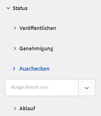

Wenn Sie beispielsweise die Asset-Veröffentlichung überwachen, können Sie die entsprechende Option verwenden, um nach den veröffentlichten Assets zu suchen.

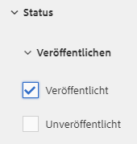

Wenn Sie den Prüfungsstatus von Assets überwachen, verwenden Sie die entsprechende Option, um herauszufinden, welche Assets genehmigt wurden und für welche Assets die Genehmigung aussteht.

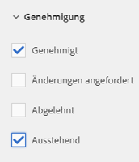

## Suche basierend auf Insights-Daten {#search-based-on-insights-data}

Verwenden Sie die **Insights** Prädikat verwenden, um basierend auf ihren Nutzungsstatistiken aus verschiedenen Creative-Apps nach Assets zu suchen. Nutzungsdaten werden unter den folgenden Kategorien gruppiert:

* Nutzungsbewertung
* Impressionen
* Klicks
* Medienkanäle, in denen die Assets angezeigt werden

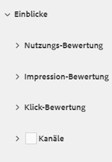
