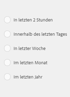

# Suche nach Assets in AEM {#search-assets-in-aem}

Erfahren Sie, wie Sie die erforderlichen Assets in AEM mithilfe des Bedienfelds „Filter“ finden und wie Sie die Assets verwenden, die bei der Suche zurückgegeben werden.

Verwenden Sie das Bedienfeld „Filter“, um nach Assets, Ordnern, Tags und Metadaten zu suchen. Mithilfe des Platzhaltersternchens können Sie nach Teilen einer Zeichenfolge suchen.

Das Bedienfeld „Filter“ bietet mehrere Optionen, um Assets und Ordnern auf verschiedene Arten zu suchen, statt in generischer taxonomischer Reihenfolge.

Sie können eine Suche basierend auf folgenden Optionen (Prädikaten) durchführen:

* Dateityp
* Dateigröße
* Feldname
* Zuletzt geändert
* Status
* Ausrichtung
* Stil
* Einblicke

<!-- TBD keystroke 65 article and port applicable changes here. This content goes. -->

You can customize the Filters panel and add/remove search predicates using [search facets](search-facets.md). Führen Sie folgende Schritte aus, um das Bedienfeld „Filter“ anzuzeigen:

1. In the Assets user interface, tap/click  from the toolbar to display the Omnisearch box.
1. Geben Sie Ihren Suchbegriff ein und drücken Sie die Eingabetaste. Alternativ können Sie einfach die Eingabetaste drücken, ohne einen Suchbegriff einzugeben. Geben Sie keine vorangestellten Leerzeichen ein, da die Suche sonst nicht funktioniert.

1. Tippen/klicken Sie auf das GlobalNav-Symbol. Das Bedienfeld „Filter“ wird angezeigt.

   

   Abhängig von der Art der Elemente, nach denen Sie suchen, wird die Anzahl der Übereinstimmungen oben in den Suchergebnissen angezeigt.

   

## Suchen nach Dateitypen {#search-for-file-types}

Das Bedienfeld „Filter“ ermöglicht eine gesteigerte Granularität bei Ihren Suchen und gestaltet die Suchfunktion vielseitiger. Sie können ganz einfach einen Drilldown auf die gewünschte Detailebene durchführen.

Wenn Sie beispielsweise nach einem Bild suchen, verwenden Sie das Prädikat **[!UICONTROL Dateityp]**, um auszuwählen, ob Sie ein Bitmap- oder ein Vektorbild möchten.

Sie können die Suche weiter eingrenzen, indem Sie den MIME-Typ für das Bild festlegen.

Wenn Sie nach Dokumenten suchen, können Sie auf ähnliche Weise das gewünschte Format festlegen, z. B. PDF oder MS Word.

## Suche basierend auf der Dateigröße {#search-based-on-file-size}

Verwenden Sie das Prädikat **Dateigröße**, um basierend auf der Größe nach Assets zu suchen. Sie können die Unter- und Obergrenze für den Dateigrößenbereich festlegen, um Ihre Suche einzugrenzen. Außerdem können Sie die Maßeinheit festlegen, z. B. Kilobyte, Megabyte etc.

## Suche basierend auf dem letzten Änderungsdatum von Assets {#search-based-on-when-assets-are-last-modified}

Wenn Sie unfertige Assets verwalten oder einen Prüfungs-Workflow überwachen, können Sie die Suche danach ausrichten, wann ein Asset zuletzt bearbeitet wurde. Die Suche basiert dabei auf akkuraten Zeitstempeln. Geben Sie beispielsweise Daten ein, vor oder nach denen Assets bearbeitet wurden.

Sie können auch die folgenden Optionen nutzen, um eine höhere Granularität bei Ihrer Suche zu erreichen:

## Suche basierend auf dem Status {#search-based-on-status}

Verwenden Sie die **Statuseigenschaft**, um nach Assets zu suchen, die auf verschiedenen Statusarten basieren, beispielsweise „Veröffentlichen“, „Genehmigung“, „Auschecken“ und „Ablauf“.

Wenn Sie z. B. die Asset-Veröffentlichung überwachen, können Sie die entsprechende Option verwenden, um nach den zu veröffentlichen Assets zu suchen.

Wenn Sie den Prüfungsstatus von Assets überwachen, verwenden Sie die entsprechende Option, um herauszufinden, welche Assets genehmigt wurden und für welche Assets die Genehmigung aussteht.

## Suche basierend auf Daten von Insights {#search-based-on-insights-data}

Verwenden Sie das Prädikat **Einblicke**, um basierend auf den Nutzungsstatistiken diverser kreativer Anwendungen nach Assets zu suchen. Die Nutzungsdaten werden derzeit unter den folgenden Kategorien gruppiert:

* Nutzungs-Bewertung
* Impressionen
* Klicks
* Medienkanäle, in denen die Elemente angezeigt werden

