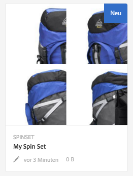
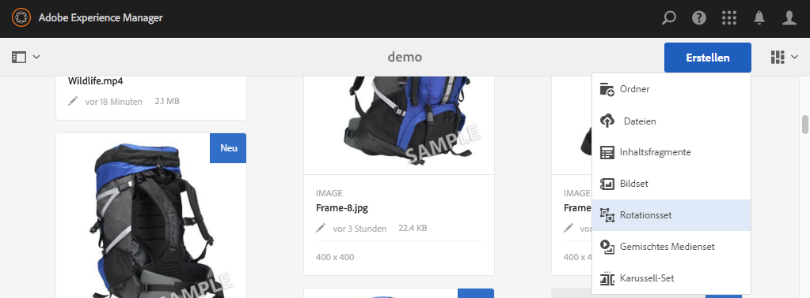
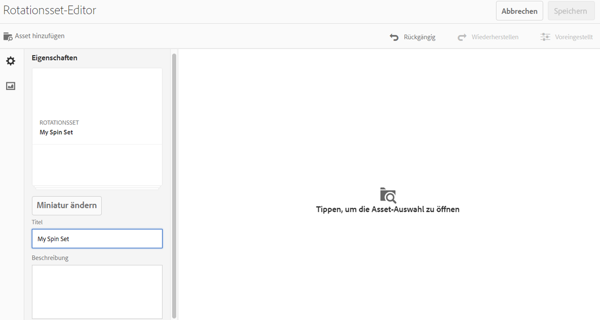
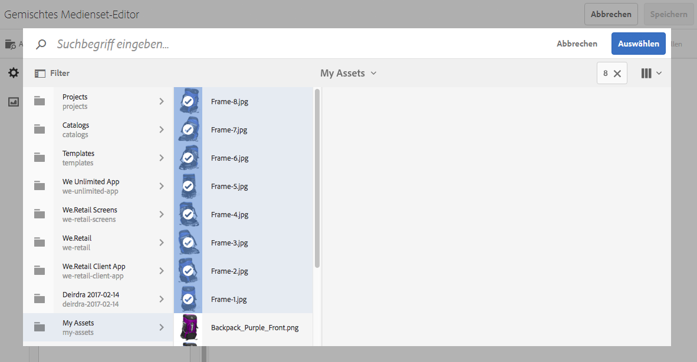
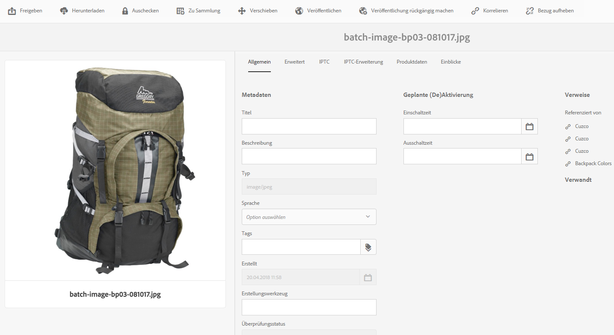

# Rotationssets {#spin-sets}

>[!CAUTION]
>
>AEM 6.4 hat das Ende der erweiterten Unterstützung erreicht und diese Dokumentation wird nicht mehr aktualisiert. Weitere Informationen finden Sie in unserer [technische Unterstützung](https://helpx.adobe.com/de/support/programs/eol-matrix.html). Unterstützte Versionen suchen [here](https://experienceleague.adobe.com/docs/?lang=de).

Ein Rotationsset simuliert den realen Vorgang, ein Objekt umzudrehen, um es zu untersuchen. Rotationssets ermöglichen es, Elemente aus jedem Winkel anzuzeigen und die wichtigsten visuellen Details aus jedem Winkel zu erhalten.

Ein Rotationsset simuliert eine 360-Grad-Anzeige. Dynamic Media bietet Rotationssets mit einer Achse, in denen ein Artikel gedreht werden kann. Darüber hinaus können Benutzer mit wenigen einfachen Mausklicks beliebige Ansichten &quot;frei&quot;zoomen und schwenken. Auf diese Weise können Benutzer ein Element aus einem bestimmten Blickwinkel genauer untersuchen.

Rotationssets werden durch ein Banner mit dem Wort **[!UICONTROL SPINSET]** gekennzeichnet. Darüber hinaus wird bei veröffentlichten Rotationssets das Veröffentlichungsdatum (durch das **[!UICONTROL Welt]**-Symbol gekennzeichnet) zusammen mit dem Datum der letzten Änderung (durch das **[!UICONTROL Bleistift]**-Symbol gekennzeichnet) im Banner angezeigt.

>[!NOTE]
>
>Weitere Informationen zur Assets-Benutzeroberfläche finden Sie unter [Verwalten von Assets mit der Touch-Benutzeroberfläche](managing-assets-touch-ui.md).

Beim Erstellen eines Rotationssets empfiehlt Adobe die folgenden Best Practices und erzwingt die folgende Begrenzung:

| Begrenzungstyp | Best Practice | Erzwungene Begrenzung |
| --- | --- | --- |
| Maximale Anzahl von Zeilen/Spalten pro 2D-Set | 12–18 Bilder pro Set | 1.000 |

Siehe auch [Dynamic Media-Beschränkungen](/help/assets/limitations.md).

## Schnellstart: Rotationssets {#quick-start-spin-sets}

Gehen Sie wie folgt vor, um die Arbeit mit Rotationssets zu beschleunigen:

1. [Laden Sie die Bilder für mehrere Ansichten hoch.](#uploading-assets-for-spin-sets)

   Sie benötigen mindestens 8 bis 12 Aufnahmen eines Artikels für ein eindimensionales Rotationsset und 16 bis 24 Aufnahmen für ein zweidimensionales Rotationsset. Die Aufnahmen müssen in regelmäßigen Abständen gemacht werden, um den Eindruck zu erwecken, dass der Artikel gedreht wird. Beispiel: Wenn ein eindimensionales Rotationsset 12 Aufnahmen umfasst, drehen Sie den Artikel für jede Aufnahme um 30 Grad (360/12).

1. [Erstellen von Rotationssets.](#creating-spin-sets)

   Um ein Rotationsset zu erstellen, wählen Sie **[!UICONTROL Erstellen > Rotationsset]** Benennen Sie das Set, wählen Sie die Assets aus und sortieren Sie dann die Bilder in der Reihenfolge, in der sie angezeigt werden.

   Siehe [Arbeiten mit Selektoren](working-with-selectors.md).

   >[!NOTE]
   >
   >Sie können Rotationssets auch automatisch erstellen über [Stapelsatzvorgaben](/help/assets/config-dms7.md#creating-batch-set-presets-to-auto-generate-image-sets-and-spin-sets).
   >
   >*Stapelsätze werden vom IPS (Image Production System) im Rahmen der Asset-Aufnahme erstellt und sind nur im Scene7-Modus von Dynamic Media verfügbar*.

1. Einrichten [Rotationsset-Viewer-Vorgaben](managing-viewer-presets.md)nach Bedarf.

   Administratoren können Rotationsset-Viewer-Vorgaben erstellen oder ändern. Um das Rotationsset mit einer Viewer-Vorgabe anzuzeigen, wählen Sie das Rotationsset aus und wählen Sie im Dropdown-Menü in der linken Seitenleiste die Option **[!UICONTROL Viewer]**.

   Um Viewer-Vorgaben zu erstellen oder zu bearbeiten, wählen Sie **[!UICONTROL Tools > Assets > Viewer-Vorgaben]**.

   Siehe [Hinzufügen und Bearbeiten von Viewer-Vorgaben.](managing-viewer-presets.md)

1. [Anzeigen von Rotationssets](#viewing-spin-sets).

   Es gibt drei verschiedene Arten, über Stapelsatzvorgaben erstellte Sätze anzuzeigen und darauf zuzugreifen. (In der Benutzeroberfläche werden *keine* mit Stapelsatzvorgaben erstellten Sets angezeigt.)

1. [Anzeigen von Rotationssets in der Vorschau.](previewing-assets.md)

   Wählen Sie das Rotationsset aus, um dessen Vorschau anzuzeigen. Drehen Sie das Rotationsset. Sie können verschiedene Viewer aus dem Menü **[!UICONTROL Viewer]** wählen, das Sie links in der Leiste über die Dropdown-Liste aufrufen können.

1. [Veröffentlichen von Rotationssets.](publishing-dynamicmedia-assets.md)

   Beim Veröffentlichen eines Rotationssets wird die Reihenfolge aktiviert, in der Bilder in einem Rotationsset angezeigt werden. Sortieren Sie sie so, dass die Rotation eine glatte 360-Grad-Ansicht ist.**[!UICONTROL URL]** und **[!UICONTROL Einbetten]** Zeichenfolge. Außerdem müssen Sie [die Viewer-Vorgabe veröffentlichen](managing-viewer-presets.md).

1. [Verknüpfen Sie URLs mit einer Web-Anwendung](linking-urls-to-yourwebapplication.md) oder [betten Sie den Video- oder Bild-Viewer ein](embed-code.md).

   AEM Assets erstellt URL-Aufrufe für Rotationssets und aktiviert diese, nachdem Sie die Rotationssets veröffentlicht haben. Sie können diese URLs während der Asset-Vorschau kopieren. Alternativ können Sie sie auf Ihrer Website einbetten.

   Wählen Sie dazu das Rotationsset aus und klicken Sie dann im Dropdown-Menü in der linken Seitenleiste auf **[!UICONTROL Viewer]**.

   Siehe [Verknüpfen von Rotationssets mit Web-Seiten](linking-urls-to-yourwebapplication.md) und [Einbetten des Video- oder Bild-Viewers](embed-code.md).

Bei Bedarf können Sie [Rotationssets bearbeiten](#editing-spin-sets). Darüber hinaus können Sie [Eigenschaften von Rotationssets](managing-assets-touch-ui.md#editing-properties).

## Hochladen von Assets für Rotationssets {#uploading-assets-for-spin-sets}

Sie benötigen mindestens 8 bis 12 Aufnahmen eines Artikels für ein eindimensionales Rotationsset und 16 bis 24 Aufnahmen für ein zweidimensionales Rotationsset. Die Aufnahmen müssen in regelmäßigen Abständen gemacht werden, um den Eindruck zu erwecken, dass der Artikel gedreht wird. Beispiel: Wenn ein eindimensionales Rotationsset 12 Aufnahmen umfasst, drehen Sie den Artikel für jede Aufnahme um 30 Grad (360/12).

Bilder für Rotationssets können Sie [genauso wie alle anderen Assets in AEM Assets hochladen](managing-assets-touch-ui.md).

### Richtlinien für die Aufnahme von Rotationsset-Bildern {#guidelines-for-shooting-spin-set-images}

Im Folgenden finden Sie einige Best Practices für Rotationsset-Bilder. Im Allgemeinen gilt: Je mehr Bilder Sie in einem Rotationsset haben, desto besser ist der Bildspinnereffekt. Das Einschließen vieler Bilder in das Set erhöht jedoch auch die Zeit, die zum Laden der Bilder benötigt wird. AEM empfiehlt die folgenden Richtlinien für die Aufnahme von Bildern zur Verwendung in Rotationssets:

* Verwenden Sie mindestens 8 bis 12 Bilder für ein eindimensionales Rotationsset und 16 bis 24 Bilder für ein zweidimensionales Rotationsset. Mindestens 8 Bilder sind erforderlich, um die Drehung um 360 Grad zu ermöglichen. Eindimensionale Rotationssets werden häufiger verwendet, da zweidimensionale Rotationssets sehr aufwendig zu erstellen sind.
* Verwenden Sie ein verlustfreies Format; TIFF und PNG werden empfohlen.
* Maskieren Sie alle Bilder so, dass das Element auf einem rein weißen oder anderen kontrastreichen Hintergrund angezeigt wird. Fügen Sie optional Schatten hinzu.
* Stellen Sie sicher, dass die Produktdetails gut beleuchtet und fokussiert sind.
* Nehmen Sie Drehbilder für Modekleidung mit einer Schaufensterpuppe oder einem Modell. Häufig ist das Mannequin entweder vollständig maskiert (mit einem Glasmannequin) oder eine stilisierte Mannequin/Dressform wird im Bild gezeigt. Sie können ein modellbezogenes Rotationsset erstellen, indem Sie die Anzahl der Winkel definieren. Markieren Sie jeden Winkel mit Klebeband auf dem Boden, um das Modell zu bewegen und in die Richtung jedes Schusses zu sehen.

## Erstellen von Rotationssets  {#creating-spin-sets}

Die Reihenfolge der Bilder in einem Rotationsset ist wichtig. Sortieren Sie sie so, dass die Rotation eine glatte 360-Grad-Ansicht ist.

>[!NOTE]
>
>Sie können Rotationssets auch automatisch über [Stapelsatzvorgaben](/help/assets/config-dms7.md#creating-batch-set-presets-to-auto-generate-image-sets-and-spin-sets) erstellen.
>
>Stapelsätze werden vom IPS (Image Production System) im Rahmen der Asset-Aufnahme erstellt und sind nur im Scene7-Modus von Dynamic Media verfügbar.
>
>Siehe &quot;Erstellen von Stapelsatzvorgaben zum automatischen Erzeugen von Bild- und Rotationssets&quot;in [Konfigurieren von Dynamic Media - Scene7-Modus](/help/assets/config-dms7.md#creating-batch-set-presets-to-auto-generate-image-sets-and-spin-sets).

Beim Erstellen eines Rotationssets empfiehlt Adobe die folgenden Best Practices und erzwingt die folgende Begrenzung:

| Begrenzungstyp | Best Practice | Erzwungene Begrenzung |
| --- | --- | --- |
| Maximale Anzahl von Zeilen/Spalten pro 2D-Set | 12–18 Bilder pro Set | 1.000 |

Siehe auch [Einschränkungen bei Dynamic Media](/help/assets/limitations.md).

**So erstellen Sie Rotationssets:**

1. Navigieren Sie in Assets an die Stelle, an der Sie ein Rotationsset erstellen möchten, und tippen Sie auf **[!UICONTROL Erstellen]** und wählen Sie **[!UICONTROL Rotationsset]**. Sie können das Set auch in einem Ordner erstellen, der die gewünschten Assets enthält.

   

1. Im **[!UICONTROL Rotationsset-Editor]** in der **[!UICONTROL Titel]** Geben Sie einen Namen für das Rotationsset ein. Der Name wird im Banner über dem Rotationsset angezeigt. Geben Sie optional eine Beschreibung ein.

   

   Wenn Sie das Rotationsset erstellen, können Sie die Miniaturansicht des Rotationssets ändern oder zulassen, dass AEM die Miniaturansicht automatisch basierend auf den Assets im Rotationsset auswählt. Um eine Miniaturansicht auszuwählen, tippen Sie auf **[!UICONTROL Miniaturansicht ändern]**. Wählen Sie ein beliebiges Bild aus (Sie können auch zu anderen Ordnern navigieren, um nach Bildern zu suchen). Wenn Sie eine Miniaturansicht ausgewählt haben und möchten, dass AEM eine Miniaturansicht aus dem Rotationsset generiert, wählen Sie **[!UICONTROL Zu automatischer Miniatur wechseln]** aus.

1. Nehmen Sie eine der folgenden Aktionen vor:

   * In der linken oberen Ecke des **[!UICONTROL Rotationsset-Editor]** Seite, tippen Sie auf **[!UICONTROL Asset hinzufügen]**.
   * In der Mitte des **[!UICONTROL Rotationsset-Editor]** Seite, tippen Sie auf **[!UICONTROL Tippen, um den Asset-Selektor zu öffnen]**.

   Tippen Sie, um die gewünschten Assets für das Rotationsset auszuwählen. Die ausgewählten Assets sind mit einem Häkchen versehen. Wenn Sie fertig sind, tippen Sie oben rechts auf der Seite auf **[!UICONTROL Auswählen]**.

   Mit dem Asset-Selektor können Sie nach Assets suchen, indem Sie ein Keyword eingeben und auf **[!UICONTROL Eingabe]** tippen. Sie können auch Filter anwenden, um Ihre Suchergebnisse genauer abzustimmen. Sie können nach Pfad, Sammlung, Dateityp und Tag filtern. Wählen Sie den Filter und tippen Sie in der Symbolleiste auf das Symbol **[!UICONTROL Filter]**. Um die Ansicht zu ändern, tippen Sie oben rechts auf der Seite auf die **[!UICONTROL Ansicht]** Symbol und tippen Sie dann auf **[!UICONTROL Spaltenansicht]**, **[!UICONTROL Kartenansicht]** oder **[!UICONTROL Listenansicht]**.

   Siehe [Arbeiten mit Selektoren](working-with-selectors.md).

   

1. Assets, die Sie Ihrem Set hinzufügen, werden automatisch in alphanumerischer Reihenfolge hinzugefügt. Sie können Assets nach dem Hinzufügen manuell neu anordnen oder sortieren. Ziehen Sie bei Bedarf die **[!UICONTROL Neu anordnen]** rechts neben dem Dateinamen des Assets, um Bilder in der Setliste nach oben oder unten anzuordnen.

   

1. (Optional) Führen Sie einen der folgenden Schritte aus:

   * Um ein Bild zu löschen, wählen Sie das Bild aus und tippen Sie auf **[!UICONTROL Asset löschen]**.
   * Wenn Sie eine Vorgabe anwenden möchten, tippen Sie oben rechts auf **[!UICONTROL Voreingestellt]**. Wählen Sie anschließend eine Vorgabe aus, um sie auf alle Elemente gleichzeitig anzuwenden.

1. Tippen Sie auf **[!UICONTROL Speichern]**. Das neu erstellte Rotationsset wird in dem Ordner angezeigt, in dem es erstellt wurde.

## Anzeigen von Rotationssets {#viewing-spin-sets}

Sie können Rotationssets in der Benutzeroberfläche oder automatisch über [Stapelsatzvorgaben](/help/assets/config-dms7.md#creating-batch-set-presets-to-auto-generate-image-sets-and-spin-sets) erstellen. Mit Stapelsatzvorgaben erstellte Sets werden jedoch *nicht* in der Benutzeroberfläche angezeigt. Sie können auf Sets zugreifen, die über Stapelsatzvorgaben erstellt wurden, und zwar auf drei verschiedene Arten. (Diese Methoden sind auch dann verfügbar, wenn Sie die Rotationssets in der Benutzeroberfläche erstellt haben.)

Sets können auch über die Benutzeroberfläche angezeigt werden, wie unter [Bearbeiten von Rotationssets](#editing-spin-sets) beschrieben.

**So zeigen Sie Rotationssets an:**

1. Beim Öffnen der Eigenschaften eines einzelnen Assets. Die Eigenschaften zeigen an, zu welchen Sets das ausgewählte Asset gehört (unter **[!UICONTROL Mitglied von Sets]**). Tippen Sie auf den Namen des Sets, um den gesamten Satz anzuzeigen.

   

1. Von einem zugehörigen Bild eines beliebigen Sets. Wählen Sie das Menü **[!UICONTROL Sets]** aus, um die Sets anzuzeigen, denen das Asset angehört.

   

1. Über die Suche können Sie **[!UICONTROL Filter]**, dann erweitern **[!UICONTROL Dynamic Media]** und wählen Sie **[!UICONTROL Sets]**.

   Die Suche gibt übereinstimmende Sets zurück, die manuell in der Benutzeroberfläche erstellt oder automatisch über Stapelsatzvorgaben erstellt wurden. Bei automatisierten Sets wird die Suchabfrage mithilfe von **[!UICONTROL Beginnt mit]** Suchkriterien, die sich von AEM Suche unterscheiden, die auf der Verwendung von **[!UICONTROL Enthält]** Suchkriterien. Automatisierte Sets können nur durchsucht werden, wenn der Filter auf **[!UICONTROL Sets]** eingestellt ist.

   

## Bearbeiten von Rotationssets {#editing-spin-sets}

Sie können verschiedene Bearbeitungsaufgaben für Rotationssets ausführen, z. B.:

* Fügen Sie dem Rotationsset Bilder hinzu.
* Ordnen Sie Bilder im Rotationsset neu an.
* Löschen Sie Assets im Rotationsset.
* Wenden Sie Viewer-Vorgaben an.
* Löschen Sie das Rotationsset.

**So bearbeiten Sie ein Rotationsset:**

1. Führen Sie einen der folgenden Schritte aus:

   * Bewegen Sie den Mauszeiger über ein Rotationsset-Asset und tippen Sie auf **[!UICONTROL Bearbeiten]** (Bleistiftsymbol).
   * Bewegen Sie den Mauszeiger über ein Rotationsset-Asset und tippen Sie auf **[!UICONTROL Auswählen]** (Häkchensymbol) und tippen Sie dann auf **[!UICONTROL Bearbeiten]** in der Symbolleiste.
   * Tippen Sie auf ein Rotationsset-Asset und dann auf **[!UICONTROL Bearbeiten]** (Bleistiftsymbol) in der Symbolleiste.

1. Führen Sie einen der folgenden Schritte aus, um das Rotationsset zu bearbeiten:

   * Um Bilder neu anzuordnen, ziehen Sie ein Bild an eine neue Position (wählen Sie das Symbol für die Neuanordnung aus, um Elemente zu verschieben).
   * Um Elemente in auf- oder absteigender Reihenfolge zu sortieren, tippen Sie auf die Spaltenüberschrift.
   * Um ein Asset hinzuzufügen oder ein vorhandenes Asset zu aktualisieren, tippen Sie auf **[!UICONTROL Asset hinzufügen]**. Navigieren Sie zu einem Element, wählen Sie es aus und tippen Sie oben rechts auf **[!UICONTROL Auswählen]**.
Wenn Sie das in AEM als Miniaturansicht verwendete Bild löschen und durch ein anderes ersetzen, wird das Original-Asset weiterhin angezeigt.
   * Um ein Asset zu löschen, wählen Sie es aus und tippen Sie auf **[!UICONTROL Asset löschen]**.
   * Um eine Vorgabe anzuwenden, tippen Sie auf **[!UICONTROL Vorgabe]** und wählen Sie eine Vorgabe aus.
   * Navigieren Sie zum Löschen eines ganzen Rotationssets zu diesem Rotationsset, wählen Sie es aus und wählen Sie **[!UICONTROL Löschen]**.

      >[!NOTE]
      >* Sie können die Bilder in einem Rotationsset bearbeiten, indem Sie zu dem Set navigieren und auf **[!UICONTROL Festlegen von Mitgliedern]** in der linken Leiste und tippen Sie dann auf **[!UICONTROL Bearbeiten]** (Bleistiftsymbol) auf ein einzelnes Asset klicken, um das Bearbeitungsfenster zu öffnen.

1. Klicken Sie auf **[!UICONTROL Speichern]**, wenn Sie fertig mit der Bearbeitung sind.

## Anzeigen der Vorschau von Rotationssets {#previewing-spin-sets}

Weitere Informationen finden Sie im Abschnitt [Asset-Vorschau](previewing-assets.md).

## Veröffentlichen von Rotationssets {#publishing-spin-sets}

Siehe [Veröffentlichen von Assets](publishing-dynamicmedia-assets.md).
