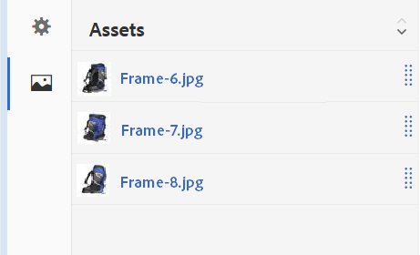

# Rotationssets {#spin-sets}

Ein Rotationsset simuliert das Drehen eines Gegenstands zur genaueren Untersuchung. Mit Rotationssets können Artikel aus jedem Winkel betrachtet werden, um die wesentlichen visuellen Details von allen Seiten sehen zu können.

Ein Rotationsset simuliert die 360-Grad-Anzeige. Dynamic Media bietet Rotationssets mit einer Achse, in denen ein Artikel gedreht werden kann. Darüber hinaus können Benutzer alle Ansichten mit nur wenigen Mausklicks frei zoomen und schwenken. So können Benutzer einen Artikel aus einem bestimmten Blickwinkel genauer untersuchen.

Spin Sets are designated by a banner with the word **[!UICONTROL SPINSET]**. In addition, if the Spin Set is published, then the publish date, indicated by the **[!UICONTROL World]** icon is on the banner along with the last modification date, indicated by the **[!UICONTROL Pencil]** icon displays.

>[!NOTE]
>
>Weitere Informationen zur Assets-Benutzeroberfläche finden Sie unter [Verwalten von Assets mit der Touch-Benutzeroberfläche](managing-assets-touch-ui.md).

## Schnellstart: Rotationssets {#quick-start-spin-sets}

Gehen Sie wie folgt vor, um sich schnell mit Rotationssets vertraut zu machen:

1. [Laden Sie die Bilder für mehrere Ansichten hoch.](#uploading-assets-for-spin-sets)

   Sie benötigen mindestens 8 bis 12 Aufnahmen eines Objekts für ein eindimensionales Rotationsset und 16 bis 24 Aufnahmen für ein zweidimensionales Rotationsset. Die Aufnahmen müssen in regelmäßigen Abständen gemacht werden, um den Eindruck zu erwecken, dass der Gegenstand gedreht und umgedreht wird. Wenn ein eindimensionales Rotationsset beispielsweise 12 Aufnahmen enthält, drehen Sie das Objekt für jede Aufnahme um 30 Grad (360/12).

1. [Erstellen Sie Rotationssets.](#creating-spin-sets)

   Um ein Rotationsset zu erstellen, wählen Sie &quot; **[!UICONTROL Erstellen&quot;> &quot;Rotationsset]** &quot;und geben Sie dem Set einen Namen, wählen Sie die Assets aus und sortieren Sie dann die Bilder in der Reihenfolge, in der sie angezeigt werden.

   Siehe [Arbeiten mit Selektoren](working-with-selectors.md).

   >[!NOTE]
   >
   >You can also create Spin Sets automatically through [batch set presets](/help/assets/config-dms7.md#creating-batch-set-presets-to-auto-generate-image-sets-and-spin-sets).
   *Stapelsätze werden im Rahmen der Asset-Erfassung vom IPS (Image Production System) erstellt und sind nur im Modus*&quot;Dynamische Medien - Scene7&quot;verfügbar.

1. Richten Sie [Rotationsset-Viewer-Vorgaben](managing-viewer-presets.md) nach Bedarf ein.

   Administratoren können Rotationsset-Viewer-Vorgaben erstellen oder ändern. To see your Spin Set with a Viewer preset, select the Spin Set, and in the left-rail drop-down menu, select **[!UICONTROL Viewers]**.

   See **[!UICONTROL Tools > Assets > Viewer Presets]** to create or edit viewer presets.

   See [Adding and editing viewer presets.](managing-viewer-presets.md)

1. [Zeigen Sie Rotationssets an](#viewing-spin-sets).

   Es gibt drei verschiedene Arten, über Stapelsatzvorgaben erstellte Sätze anzuzeigen und darauf zuzugreifen. (Sets created using batch set presets, do *not* appear in the user interface.)

1. [Zeigen Sie eine Vorschau der Rotationssets an.](previewing-assets.md)

   Wählen Sie das Rotationsset aus, um dessen Vorschau anzuzeigen. Drehen Sie das Rotationsset. You can choose different viewers from the **[!UICONTROL Viewers]** menu, available from the left rail drop-down menu.

1. [Veröffentlichen Sie Rotationssets.](publishing-dynamicmedia-assets.md)

   Beim Veröffentlichen eines Rotationssets wird die Reihenfolge aktiviert, in der Bilder in einem Rotationsset angezeigt werden. Achten Sie darauf, sie so anzuordnen, dass die Rotation eine gleichmäßige 360-Grad-Ansicht ergibt.**[!UICONTROL URL]** und **[!UICONTROL Einbettungszeichenfolge]** . In addition, you must [publish the viewer preset](managing-viewer-presets.md).

1. [Verknüpfen Sie URLs mit einer Webanwendung](linking-urls-to-yourwebapplication.md) oder [betten Sie den Video- oder Bild-Viewer ein](embed-code.md).

   AEM Assets erstellt URL-Aufrufe für Rotationssets und aktiviert sie, nachdem Sie die Rotationssets veröffentlicht haben.Sie können diese URLs kopieren, wenn Sie eine Vorschau der Assets anzeigen.Alternativ können Sie sie auch in Ihre Website einbetten.

   Wählen Sie das Rotationsset und dann im Dropdownmenü links die Option **[!UICONTROL Viewer]**.

   Siehe [Verknüpfen eines Rotationssets mit einer Webseite](linking-urls-to-yourwebapplication.md) und [Einbetten des Video- oder Bild-Viewers](embed-code.md).

If you need to, you can [edit Spin Sets](#editing-spin-sets). In addition, you can view and edit [Spin Set properties](managing-assets-touch-ui.md#editing-properties).

## Uploading Assets for Spin Sets {#uploading-assets-for-spin-sets}

Sie benötigen mindestens 8 bis 12 Aufnahmen eines Objekts für ein eindimensionales Rotationsset und 16 bis 24 Aufnahmen für ein zweidimensionales Rotationsset. Die Aufnahmen müssen in regelmäßigen Abständen gemacht werden, um den Eindruck zu erwecken, dass der Gegenstand gedreht und umgedreht wird. Wenn ein eindimensionales Rotationsset beispielsweise 12 Aufnahmen enthält, drehen Sie das Objekt für jede Aufnahme um 30 Grad (360/12).

Bilder für Rotationssets können Sie genauso wie [alle anderen Assets in AEM-Assets](managing-assets-touch-ui.md) hochladen.

### Richtlinien für die Aufnahme von Rotationsset-Bildern {#guidelines-for-shooting-spin-set-images}

Im Folgenden finden Sie einige Best Practices für Rotationsset-Bilder. Im Allgemeinen gilt: Je mehr Bilder ein Rotationsset enthält, desto besser gelingt der Bildrotationseffekt. Wenn Sie aber zahlreiche Bilder in das Set aufnehmen, dauert es auch länger, bis die Bilder geladen werden. AEM empfiehlt die folgenden Richtlinien für die Aufnahme von Bildern für Rotationssets.

* Verwenden Sie mindestens 8 bis 12 Bilder in einem eindimensionalen Rotationsset und 16 bis 24 Bilder in einem zweidimensionalen Rotationsset. Um 360 Grad drehen zu können, sind mindestens 8 Bilder erforderlich. Eindimensionale Rotationssets werden häufiger verwendet, da die Erstellung zweidimensionaler Rotationssets sehr aufwändig ist.
* Verwenden Sie ein verlustfreies Format: TIFF und PNG werden empfohlen.
* Maskieren Sie alle Bilder so, dass der Artikel vor einem rein weißen oder kontrastreichen Hintergrund erscheint. Fügen Sie optional Schatten hinzu.
* Stellen Sie sicher, dass die Produktdetails gut beleuchtet und fokussiert sind.
* Denken Sie z. B. an Rotationsbilder für Bekleidung an einer Schaufensterpuppe oder einem Modell. Die Schaufensterpuppe ist häufig entweder komplett maskiert (eine Schaufensterpuppe aus Glas) oder es wird eine stilisierte Schaufensterpuppe im Bild gezeigt. Sie können ein modellbezogenes Rotationsset erstellen, indem Sie die Anzahl der Winkel definieren. Markieren Sie jeden Winkel mit Klebeband auf dem Boden, um dem Modell anzugeben, einen Schritt zu machen und in die Richtung der jeweiligen Aufnahme zu schauen.

## Erstellen von Rotationssets {#creating-spin-sets}

Die Reihenfolge der Bilder in einem Rotationsset ist wichtig. Achten Sie darauf, sie so anzuordnen, dass die Rotation eine gleichmäßige 360-Grad-Ansicht ergibt.

>[!NOTE]
>
>Sie können Rotationssets auch automatisch über [Batchset-Voreinstellungen](/help/assets/config-dms7.md#creating-batch-set-presets-to-auto-generate-image-sets-and-spin-sets) erstellen.
Stapelsätze werden im Rahmen der Asset-Erfassung vom IPS (Image Production System) erstellt und sind nur im Modus &quot;Dynamische Medien - Scene7&quot;verfügbar.
>
>Siehe „Erstellen von Stapelsatzvorgaben zum automatischen Erzeugen von Bild- und Rotationssets“ in [Konfigurieren von Dynamic Media – Scene7-Modus](/help/assets/config-dms7.md#creating-batch-set-presets-to-auto-generate-image-sets-and-spin-sets).

**So erstellen Sie Rotationssets:**

1. In Assets, navigate to where you want to create a spin set, tap **[!UICONTROL Create]**, and select **[!UICONTROL Spin Set**. Sie können das Set auch aus einem Ordner erstellen, der Ihre Assets enthält.

   

1. On the **[!UICONTROL Spin Set Editor]** page, in the **[!UICONTROL Title]** field, enter a name for the Spin Set. Der Name wird im Banner über dem Rotationsset angezeigt. Geben Sie optional eine Beschreibung ein.

   

   Beim Erstellen des Rotationssets können Sie die Miniaturansicht des Rotationssets ändern oder zulassen, dass AEM die Miniaturansicht basierend auf den Assets im Rotationsset automatisch auswählt. To select a thumbnail, tap **[!UICONTROL Change thumbnail]**. Select any image (you can navigate to other folders to find images as well). If you have selected a thumbnail and then decide that you want AEM to generate one from the spin set, select **[!UICONTROL Switch to Automatic thumbnail]**.

1. Nehmen Sie eine der folgenden Aktionen vor:

   * Near the upper-left corner of the **[!UICONTROL Spin Set Editor]** page, tap **[!UICONTROL Add Asset]**.
   * Near the middle of the **[!UICONTROL Spin Set Editor]** page, tap **[!UICONTROL Tap to open Asset Selector]**.
   Tippen Sie, um die gewünschten Assets für das Rotationsset auszuwählen. Die ausgewählten Assets sind mit einem Häkchen versehen. Wenn Sie die Assets ausgewählt haben, tippen Sie auf **[!UICONTROL Auswählen]**.

   Mit der Asset-Auswahl können Sie nach Assets suchen, indem Sie einen Suchbegriff eingeben und auf **[!UICONTROL Zurück]** tippen. Sie können auch Filter anwenden, um Ihre Suchergebnisse genauer abzustimmen. Sie können nach Pfad, Sammlung, Dateityp und Tag filtern. Wählen Sie den Filter aus und tippen Sie dann in der Symbolleiste auf das Symbol **[!UICONTROL Filter]**. Um die Ansicht zu ändern, tippen Sie rechts oben auf der Seite auf das Symbol **[!UICONTROL Ansicht]** und dann auf **[!UICONTROL Spaltenansicht]**, **[!UICONTROL Kartenansicht]** oder **[!UICONTROL Listenansicht]**.

   Siehe [Arbeiten mit Selektoren](working-with-selectors.md).

   

1. Assets, die Sie Ihrem Set hinzufügen, werden automatisch in alphanumerischer Reihenfolge hinzugefügt.  Sie können die Assets nach dem Hinzufügen manuell neu anordnen oder sortieren. If necessary, drag an asset&#39;s **[!UICONTROL Reorder]** icon to the right of the asset&#39;s file name to re-order images up or down the set list.

   

1. (Optional) Führen Sie einen der folgenden Schritte aus:

   * To delete an image, select the image, then tap **[!UICONTROL Delete Asset]**.
   * Wenn Sie eine Vorgabe anwenden möchten, tippen Sie oben rechts auf **[!UICONTROL Vorgabe]**. Wählen Sie anschließend eine Vorgabe aus, um sie auf alle Elemente gleichzeitig anzuwenden.

1. Tippen Sie auf **[!UICONTROL Speichern]**. Das neu erstellte Rotationsset wird in dem Ordner angezeigt, in dem Sie es erstellt haben.

## Anzeigen von Rotationssets {#viewing-spin-sets}

Sie können Rotationssets in der Benutzeroberfläche oder automatisch über [Stapelsatzvorgaben](/help/assets/config-dms7.md#creating-batch-set-presets-to-auto-generate-image-sets-and-spin-sets) erstellen. However, sets created using batch set presets, do *not* appear in the user interface. Es gibt drei verschiedene Arten, auf über Stapelsatzvorgaben erstellte Sätze zuzugreifen. (Diese Methoden sind auch dann verfügbar, wenn Sie die Rotationssets in der Benutzeroberfläche erstellt haben).

You can also view sets by way of the user interface as described in [Editing Spin Sets](#editing-spin-sets).

**So zeigen Sie Rotationssets an:**

1. Beim Öffnen der Eigenschaften eines einzelnen Assets. Die Eigenschaften zeigen an, zu welchen Sets das ausgewählte Asset gehört (unter **[!UICONTROL Mitglied von Sets]**).  Tippen Sie auf den Namen des Sets, um den gesamten Satz anzuzeigen.

   

1. Aus einem Mitgliederbild eines Sets. Select the **[!UICONTROL Sets]** menu to display the sets that the asset is a member of.

   

1. From search, you can select **[!UICONTROL Filters]**, then expand **[!UICONTROL Dynamic Media]** and select **[!UICONTROL Sets]**.

   Die Suche gibt Übereinstimmungssätze zurück, die manuell in der Benutzeroberfläche erstellt oder automatisch mithilfe von Stapelsatzvorgaben erstellt wurden. For automated sets, the search query is conducted using **[!UICONTROL Starts with]** search criteria which is different from AEM search which is based on using **[!UICONTROL Contains]** search criteria. Setting the filter to **[!UICONTROL Sets]** is the only way to search automated sets.

   

## Bearbeiten von Rotationssets {#editing-spin-sets}

Sie können mehrere Bearbeitungsaufgaben für Rotationssets ausführen, z. B. die folgenden:

* Fügen Sie dem Rotationsset Bilder hinzu.
* Ordnen Sie Bilder im Rotationsset neu an.
* Löschen Sie Assets im Rotationsset.
* Wenden Sie Viewer-Vorgaben an.
* Löschen Sie das Rotationsset.

**So bearbeiten Sie ein Rotationsset:**

1. Führen Sie einen der folgenden Schritte aus:

   * Zeigen Sie mit der Maus auf ein Rotationsset-Asset und tippen Sie auf **[!UICONTROL Bearbeiten]** (Bleistiftsymbol).
   * Zeigen Sie mit der Maus auf ein Rotationsset-Asset und tippen Sie auf **[!UICONTROL Auswählen]** (Häkchensymbol) und dann auf **[!UICONTROL Bearbeiten]** in der Symbolleiste.
   * Tippen Sie auf ein Rotationsset-Asset und dann auf **[!UICONTROL Bearbeiten]** (Bleistiftsymbol) in der Symbolleiste.

1. Führen Sie zum Bearbeiten des Rotationssets einen der folgenden Schritte aus:

   * Ziehen Sie ein Bild, wenn Sie es an einer neuen Position anordnen möchten (zum Verschieben von Elementen wählen Sie das Symbol zum Neuanordnen).
   * Um Elemente in auf- oder absteigender Reihenfolge zu sortieren, tippen Sie auf die Spaltenüberschrift.
   * To add an asset or update an existing asset, tap **[!UICONTROL Add Asset]**. Navigieren Sie zu einem Element, wählen Sie es aus und tippen Sie oben rechts auf **[!UICONTROL Auswählen.]**
Wenn Sie das in AEM als Miniaturansicht verwendete Bild löschen und durch ein anderes ersetzen, wird das Original-Asset weiterhin angezeigt.
   * To delete an asset, select it and tap **[!UICONTROL Delete Asset]**.
   * To apply a preset, tap the **[!UICONTROL Preset]** icon and select a preset.
   * Navigieren Sie zum Löschen eines ganzen Rotationssets zu diesem Rotationsset, wählen Sie es aus und wählen Sie **[!UICONTROL Löschen]**.

      >[!NOTE]
      >* You can edit the images in a Spin Set by navigating to the set, tap **[!UICONTROL Set Members]** in the left rail, and then tap the **[!UICONTROL Edit]** (pencil icon) on an individual asset to open the editing window.

1. Klicken Sie auf **[!UICONTROL Speichern]**, wenn Sie fertig mit der Bearbeitung sind.

## Anzeigen der Vorschau von Rotationssets {#previewing-spin-sets}

Weitere Informationen finden Sie im Abschnitt [Asset-Vorschau](previewing-assets.md).

## Veröffentlichen von Rotationssets {#publishing-spin-sets}

Siehe [Veröffentlichen von Assets](publishing-dynamicmedia-assets.md).
