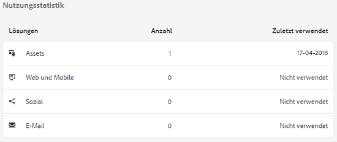
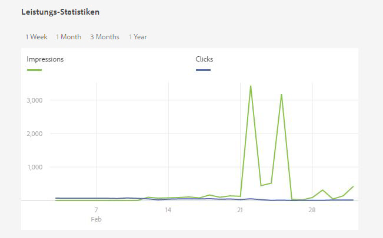
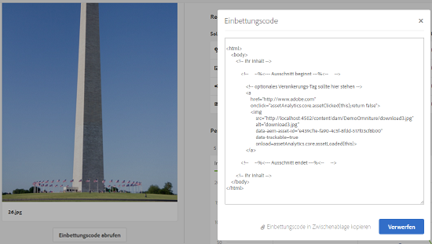

# Assets Insights {#asset-insights}

>[!CAUTION]
>
>AEM 6.4 hat das Ende der erweiterten Unterstützung erreicht und diese Dokumentation wird nicht mehr aktualisiert. Weitere Informationen finden Sie in unserer [technische Unterstützung](https://helpx.adobe.com/de/support/programs/eol-matrix.html). Unterstützte Versionen suchen [here](https://experienceleague.adobe.com/docs/?lang=de).

Erfahren Sie, wie Sie mit der Funktion &quot;Asset Insights&quot;Benutzerbewertungen und Nutzungsstatistiken von Assets verfolgen können, die auf Drittanbieter-Websites, in Marketingkampagnen und den Kreativlösungen der Adobe verwendet werden.

Mit der Funktion &quot;Asset Insights&quot;können Sie Benutzerbewertungen und Nutzungsstatistiken von Assets verfolgen, die auf Drittanbieter-Websites, in Marketingkampagnen und den Kreativlösungen der Adobe verwendet werden, um Einblicke in ihre Leistung und Beliebtheit zu erhalten.

Assets Insights erfasst Details zur Benutzeraktivität, z. B. wie oft ein Asset bewertet, angeklickt und Impressionen (wie oft das Asset auf der Website geladen wird). Basierend auf diesen Statistiken werden Assets Bewertungen zugewiesen. Sie können die Bewertungen und Leistungsstatistiken verwenden, um beliebte Assets für die Aufnahme in Kataloge, Marketing-Kampagnen usw. auszuwählen. Sie können sogar Archivierungs- und Lizenzerneuerungsrichtlinien für Assets auf der Grundlage dieser Statistiken formulieren.

Damit Assets Insights Nutzungsstatistiken für Assets von einer Website erfassen kann, müssen Sie den Einbettungscode für das Asset in den Website-Code aufnehmen.

Damit Asset Insights Nutzungsstatistiken für Assets anzeigen kann, konfigurieren Sie zunächst die Funktion für den Abruf von Berichtsdaten aus [!DNL Adobe Analytics]. Weitere Details finden Sie unter [Asset Insights konfigurieren](touch-ui-configuring-asset-insights.md). Um diese Funktion in einer On-Premise-Installation zu verwenden, ist der separate Kauf einer [!DNL Adobe Analytics] -Lizenz erforderlich. Kundinnen und Kunden mit [!DNL Managed Services] erhalten die [!DNL Analytics]-Lizenz im Paket mit [!DNL Experience Manager]. Siehe [Managed Services-Produktbeschreibung](https://helpx.adobe.com/de/legal/product-descriptions/adobe-experience-manager-managed-services.html).

>[!NOTE]
>
>Insights wird nur für Bilder unterstützt und bereitgestellt.

## Anzeigen von Statistiken für ein Asset {#viewing-statistics-for-an-asset}

Sie können die Asset Insights-Bewertungen über die Metadatenseite anzeigen.

1. Wählen Sie in der Assets-Benutzeroberfläche das Asset aus und tippen/klicken Sie dann auf das **[!UICONTROL Eigenschaften]** in der Symbolleiste.
1. Tippen/klicken Sie auf der Seite Eigenschaften auf die **[!UICONTROL Insights]** Registerkarte.
1. Überprüfen Sie die Nutzungsdetails für das Asset auf der Registerkarte **[!UICONTROL Insights]**. Die **[!UICONTROL Ergebnis]** -Abschnitt beschreibt die gesamte Asset-Nutzung und die Leistungsbewertungen eines Assets .

   Die Nutzungsbewertung beschreibt, wie oft ein Asset in verschiedenen Lösungen verwendet wird.

   Die **[!UICONTROL Impressionen]** score ist die Anzahl der Ladevorgänge des Assets auf der Website. Die unter **[!UICONTROL Klicks]** ist die Anzahl der Klicks auf das Asset.

1. Im Abschnitt **[!UICONTROL Nutzungsstatistiken]** können Sie ermitteln, in welchen Elementen das Asset enthalten war und in welchen Kreativlösungen es vor Kurzem verwendet wurde. Je höher die Nutzung ist, desto größer ist die Wahrscheinlichkeit, dass das Asset bei Benutzern beliebt ist. Nutzungsdaten werden unter den folgenden Überschriften angezeigt:

   * **[!UICONTROL Asset]**: Wie oft war das Asset Teil einer Sammlung oder eines zusammengesetzten Assets
   * **[!UICONTROL Web und Mobile]**: Wie oft wurde das Asset in Websites und Apps verwendet
   * **[!UICONTROL Social]**: Wie oft wurde das Asset in Lösungen wie Adobe Social und Adobe Campaign verwendet
   * **[!UICONTROL E-Mail]**: Wie oft wurde das Asset in E-Mail-Kampagnen verwendet

   

   >[!NOTE]
   >
   >Die Funktion &quot;Assets Insights&quot;ruft die Lösungsdaten aus [!DNL Adobe Analytics] in regelmäßigen Abständen werden im Abschnitt Lösungen möglicherweise nicht die neuesten Daten angezeigt. Der Zeitraum, für den die Daten angezeigt werden, hängt vom Zeitplan des Abrufvorgangs ab, den Assets Insights zum Abrufen von Assets durchführt [!DNL Analytics] Daten.

1. Um Leistungsstatistiken für das Asset für einen bestimmten Zeitraum grafisch anzuzeigen, wählen Sie den gewünschten Zeitraum im Abschnitt **[!UICONTROL Leistungsstatistiken]** aus. Details wie Klicks und Impressions werden als Trend-Linien eines Diagramms angezeigt.

   

   >[!NOTE]
   >
   >Im Gegensatz zu den Daten im Abschnitt &quot;Lösungen&quot;werden im Abschnitt &quot;Leistungsstatistiken&quot;die neuesten Daten angezeigt.

1. Um den Einbettungs-Code für das Asset zu erhalten, das Sie in die Websites einbeziehen, um Leistungsdaten zu erhalten, klicken Sie unter dem Asset-Miniaturbild auf **[!UICONTROL Einbettungs-Code abrufen]**. Weitere Informationen zum Einbettungscode in Webseiten von Drittanbietern finden Sie unter [Verwenden von Seitenverfolgung und Einbettungscode in Webseiten](touch-ui-using-page-tracker.md).

   

## Anzeigen von Aggregat-Statistiken für Assets {#viewing-aggregate-statistics-for-assets}

Mit der **[!UICONTROL Insights-Ansicht]** können Sie Bewertungen aller Assets in einem Ordner gleichzeitig anzeigen.

1. Navigieren Sie in der Assets-Benutzeroberfläche zu dem Ordner mit den Assets, für die Sie Einblicke anzeigen möchten.
1. Tippen/klicken Sie in der Symbolleiste auf das Symbol Layout und wählen Sie **[!UICONTROL Insights-Ansicht]**.
1. Auf der Seite werden Nutzungsbewertungen für die Assets angezeigt. Vergleichen Sie die Bewertungen der verschiedenen Assets und ziehen Sie Ihre Erkenntnisse daraus.

## Planen von Hintergrundaufträgen {#scheduling-background-job}

Assets Insights ruft Nutzungsdaten für Assets regelmäßig aus den Adobe Analytics-Report Suites ab. Standardmäßig führt Assets Insights alle 24 Stunden um 2 Uhr einen Hintergrundauftrag aus, um Daten abzurufen. Sie können jedoch die Häufigkeit und die Zeit ändern, indem Sie den Dienst **[!UICONTROL Adobe CQ DAM Asset Performance Report Sync Job]** von der Web-Konsole aus konfigurieren.

1. Tippen Sie auf [!DNL Experience Manager] -Logo und navigieren Sie zu **[!UICONTROL Tools > Vorgänge > Web-Konsole]**.
1. Öffnen Sie die Service-Konfiguration **[!UICONTROL Adobe CQ DAM Asset Performance Report Sync Job]**.

   

1. Geben Sie die gewünschte Planungsfrequenz und die Startzeit für den Auftrag im Ausdruck für die Eigenschaftsplanung an. Speichern Sie die Änderungen.
