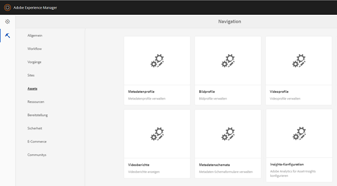
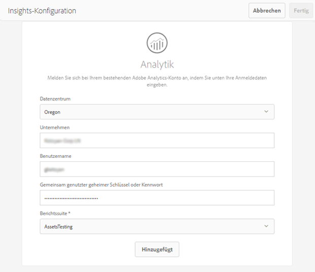

# Konfigurieren von Asset Insights {#configuring-asset-insights}

Adobe Experience Manager (AEM) Assets ruft Nutzungsdaten rund um AEM-Assets von Websites von Drittanbietern aus Adobe Analytics ab. Um Asset Insights zu aktivieren und diese Daten abzurufen und Statistiken zu erzeugen, konfigurieren Sie zuerst die Funktion zur Integration mit Adobe Analytics.

>[!NOTE]
>
>Insights werden nur für Bilder unterstützt und bereitgestellt.

1. Klicken Sie in AEM auf **[!UICONTROL Tools > Assets]**.

   

1. Klicken Sie auf die Karte **[!UICONTROL Insights-Konfiguration]**.
1. Wählen Sie im Assistenten ein Datencenter aus und geben Sie Ihre Anmeldeinformationen an, z. B. den Namen Ihres Unternehmens, Benutzernamen und Kennwort.

   

1. Klicken/tippen Sie auf **[!UICONTROL Authentifizieren]**.
1. Nachdem AEM Ihre Anmeldedaten authentifiziert hat, wählen Sie aus der Liste **[!UICONTROL Report Suite]** eine Adobe Analytics Report Suite aus, aus der Asset Insights Daten abrufen soll. Klicken Sie auf **[!UICONTROL Hinzufügen]**.
1. Nach der Report Suite-Einrichtung durch AEM klicken/tippen Sie auf **[!UICONTROL Fertig]**.

## Seitenverfolgung {#page-tracker}

Nachdem Sie Ihr Analytics-Konto konfiguriert haben, wird der Seitenverfolgungs-Code für Sie erzeugt. Um Asset Insights zur Verfolgung von AEM-Assets in Websites von Drittanbietern zu aktivieren, beziehen Sie den Seitenverfolgungscode in den Website-Code ein. Verwenden Sie das Seitenverfolgungs-Dienstprogramm in AEM Assets, um den Seitenverfolgungscode zu erzeugen. Weitere Informationen dazu, wie Sie Ihren Seitenverfolgungscode in Webseiten von Drittanbietern einbeziehen, finden Sie unter [Verwenden von Seitenverfolgung und Einbettungscode in Webseiten](touch-ui-using-page-tracker.md).

1. Klicken Sie in AEM auf **[!UICONTROL Tools > Assets]**.

   

1. Klicken Sie in der **[!UICONTROL Navigationsseite]** auf die Karte **[!UICONTROL Insights-Seitenverfolgung]**.
1. Klicken Sie auf das Symbol **[!UICONTROL Herunterladen]**, um den Seitenverfolgungscode herunterzuladen.