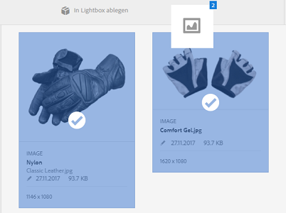

# Lightbox {#lightbox}

>[!CAUTION]
>
>AEM 6.4 hat das Ende der erweiterten Unterstützung erreicht und diese Dokumentation wird nicht mehr aktualisiert. Weitere Informationen finden Sie in unserer [technische Unterstützung](https://helpx.adobe.com/de/support/programs/eol-matrix.html). Unterstützte Versionen suchen [here](https://experienceleague.adobe.com/docs/?lang=de).

Erfahren Sie mehr über Lightbox in [!DNL Experience Manager] Assets.

Lightbox ist ein spezieller Sammlungstyp, der den einfachen Zugriff auf Assets ermöglicht. Sie können schnell auf Lightbox zugreifen, um Assets hinzuzufügen oder zu löschen. Es dient als Ihre persönliche Bildergalerie.

Wenn Sie Adobe Experience Manager Assets verwenden, wird Lightbox bei Ihrer ersten Anmeldung bei der Anwendung automatisch erstellt. Es gilt ausschließlich für Ihre Anmeldung. Andere Benutzer können nicht auf Ihre Lightbox zugreifen.

## Hinzufügen von Assets zu Lightbox {#adding-assets-to-lightbox}

1. Wählen Sie in der Assets-Benutzeroberfläche die Assets aus, die zu Lightbox hinzugefügt werden sollen.
1. Ziehen Sie die Assets in den Bereich **[!UICONTROL In Lightbox ablegen]**. Lassen Sie die Maustaste los, wenn die Dropzone aktiv wird und sich die Bezeichnung in **[!UICONTROL Zum Hinzufügen ablegen]** ändert.

   

1. Tippen oder klicken Sie im Dialogfeld auf **[!UICONTROL Hinzufügen]** und schließen Sie es anschließend, um den Vorgang abzuschließen. Die ausgewählten Assets werden zu Lightbox hinzugefügt.
1. Um Lightbox anzuzeigen, wechseln Sie zur Konsole „Sammlungen“.
1. Tippen oder klicken Sie auf **[!UICONTROL Lightbox]**, um die darin enthaltenen Assets anzuzeigen.

   >[!NOTE]
   >
   >Obwohl Lightbox einer Sammlung ähnelt, können Sie nicht alle Aktionen ausführen, die Sie normalerweise mit Sammlungen ausführen. Sie können beispielsweise keine Einstellungen für eine Lightbox löschen, freigeben oder anzeigen. Darüber hinaus können Sie sie nicht zu anderen Sammlungen hinzufügen. Sie können die Assets jedoch in einer Lightbox bearbeiten.

## Entfernen von Assets aus Lightbox {#removing-assets-from-lightbox}

1. Navigieren Sie zur Konsole &quot;Sammlungen&quot;und tippen/klicken Sie auf Lightbox , um die zugehörigen Assets anzuzeigen.
1. Wählen Sie die Assets aus, die Sie entfernen möchten.
1. Tippen oder klicken Sie in der Symbolleiste auf **[!UICONTROL Entfernen]**.
1. Tippen oder klicken Sie im Dialogfeld auf **[!UICONTROL Entfernen]**, um den Löschvorgang zu bestätigen. Die Assets werden aus Lightbox gelöscht.
