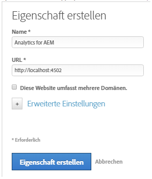
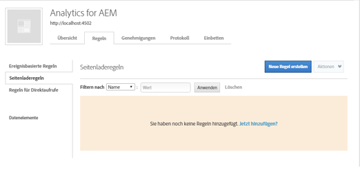
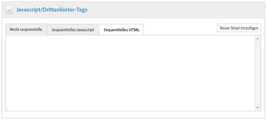
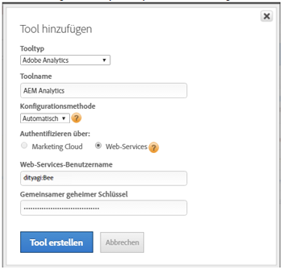
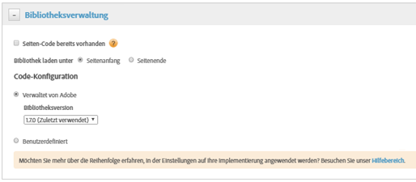
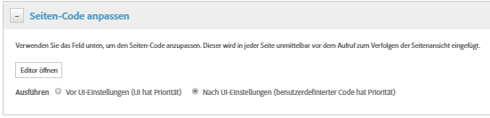

# Aktivieren von Assets Insights über DTM {#enabling-asset-insights-through-dtm}

Adobe Dynamic Tag Management ist ein Tool, mit dem Sie Ihre digitalen Marketingtools aktivieren können. Es wird Adobe Analytics-Kunden kostenlos bereitgestellt. Sie können entweder Ihren Trackingcode anpassen, um CMS-Lösungen von Drittanbietern die Verwendung von Assets Insights zu ermöglichen, oder Sie können DTM zum Einfügen von Assets Insights-Tags verwenden. Insights werden nur für Bilder unterstützt und bereitgestellt.

>[!CAUTION]
>
>Adobe DTM wird nicht mehr zugunsten von Adobe Experience Platform Launch unterstützt und bald [Ende des Lebenszyklus](https://medium.com/launch-by-adobe/dtm-plans-for-a-sunset-3c6aab003a6f) erreichen. Adobe empfiehlt, [Launch für Asset-Einblicke zu verwenden](https://experienceleague.adobe.com/docs/experience-manager-learn/assets/advanced/asset-insights-launch-tutorial.html).

Führen Sie die folgenden Schritte aus, um Assets Insights über DTM zu aktivieren:

1. Tippen/klicken Sie auf das AEM-Logo und navigieren Sie zu **[!UICONTROL Tools > Assets > Insights-Konfiguration]**.
1. [Konfigurieren Sie die AEM-Instanz mit dem DTM Cloud-Dienst.](../sites-administering/dtm.md)

   Das API-Token sollte verfügbar sein, sobald Sie sich bei [https://dtm.adobe.com](https://dtm.adobe.com/) anmelden und **[!UICONTROL Kontoeinstellungen]** über das Profilsymbol aufrufen. Dieser Schritt ist aus Sicht von Assets Insights nicht erforderlich, da die Integration von AEM Sites mit Assets Insights noch in Arbeit ist.

1. Melden Sie sich bei [https://dtm.adobe.com](https://dtm.adobe.com/) an und wählen Sie ggf. ein Unternehmen aus.
1. Erstellen/Öffnen einer vorhandenen Webeigenschaft

   * Wählen Sie die Registerkarte **[!UICONTROL Webeigenschaften]** und tippen/klicken Sie dann auf **[!UICONTROL Eigenschaft hinzufügen]**.
   * Aktualisieren Sie die Felder entsprechend und tippen/klicken Sie auf **[!UICONTROL Eigenschaft erstellen]** (siehe [Dokumentation](https://helpx.adobe.com/de/experience-manager/using/dtm.html)).

   

1. Wählen Sie auf der Registerkarte **[!UICONTROL Regeln]** die Option **[!UICONTROL Seitenladeregeln]** aus dem Navigationsbereich und tippen/klicken Sie auf **[!UICONTROL Neue Regel erstellen]**.

   

1. Erweitern Sie **[!UICONTROL Javascript/Drittanbieter-Tags]**. Tippen/klicken Sie dann auf **[!UICONTROL Neues Skript hinzufügen]** auf der Registerkarte **[!UICONTROL Sequenzielles HTML]** , um das Dialogfeld &quot;Skript&quot;zu öffnen.

   

1. Tippen/klicken Sie auf das AEM-Logo und navigieren Sie zu **[!UICONTROL Tools > Assets]**.
1. Tippen/klicken Sie auf **[!UICONTROL Insights Page Tracker]**, kopieren Sie den Tracker-Code und fügen Sie ihn dann in das Skript-Dialogfeld ein, das Sie in Schritt 6 geöffnet haben. Speichern Sie die Änderungen.

   >[!NOTE]
   >
   >* `AppMeasurement.js` wurde entfernt. Es wird erwartet, dass es über das Adobe Analytics-Tool von DTM verfügbar ist.
   >* Der Aufruf von `assetAnalytics.dispatcher.init()` wird entfernt. Es wird erwartet, dass die Funktion erneut aufgerufen wird, sobald das Adobe Analytics-Tool von DTM vollständig geladen ist.
   >* Je nachdem, wo der Asset Insights-Seitenverfolgung gehostet wird (z. B. AEM, CDN usw.), muss der Ursprung der Skriptquelle möglicherweise geändert werden.
   >* Bei AEM gehosteten Seitenverfolgung sollte die Quelle mit dem Hostnamen der Dispatcher-Instanz auf eine Veröffentlichungsinstanz verweisen.


1. Öffnen Sie [https://dtm.adobe.com](https://dtm.adobe.com). Klicken Sie in der Web-Eigenschaft auf Übersicht und dann auf Tool hinzufügen oder öffnen Sie ein vorhandenes Adobe Analytics-Tool. Beim Erstellen des Tools können Sie die Konfigurationsmethode auf Automatisch einstellen.

   

   Wählen Sie die Report Suites „Bereitstellung/Produktion“ nach Bedarf.

1. Erweitern Sie **[!UICONTROL Bibliotheksverwaltung]** und stellen Sie sicher, dass **[!UICONTROL Bibliothek laden unter]** auf **[!UICONTROL Seitenanfang]** eingestellt ist.

   

1. Erweitern Sie **[!UICONTROL Seiten-Code anpassen]** und klicken oder tippen Sie auf **[!UICONTROL Editor]** öffnen.

   

1. Fügen Sie den folgenden Code in das Fenster ein:

   ```java
   var sObj;
   
   if (arguments.length > 0) {
     sObj = arguments[0];
   } else {
     sObj = _satellite.getToolsByType('sc')[0].getS();
   }
   _satellite.notify('in assetAnalytics customInit');
   (function initializeAssetAnalytics() {
     if ((!!window.assetAnalytics) && (!!assetAnalytics.dispatcher)) {
       _satellite.notify('assetAnalytics ready');
       /** NOTE:
           Copy over the call to 'assetAnalytics.dispatcher.init()' from Assets Pagetracker
           Be mindful about changing the AppMeasurement object as retrieved above.
       */
       assetAnalytics.dispatcher.init(
             "",  /** RSID to send tracking-call to */
             "",  /** Tracking Server to send tracking-call to */
             "",  /** Visitor Namespace to send tracking-call to */
             "",  /** listVar to put comma-separated-list of Asset IDs for Asset Impression Events in tracking-call, e.g. 'listVar1' */
             "",  /** eVar to put Asset ID for Asset Click Events in, e.g. 'eVar3' */
             "",  /** event to include in tracking-calls for Asset Impression Events, e.g. 'event8' */
             "",  /** event to include in tracking-calls for Asset Click Events, e.g. 'event7' */
             sObj  /** [OPTIONAL] if the webpage already has an AppMeasurement object, please include the object here. If unspecified, Pagetracker Core shall create its own AppMeasurement object */
             );
       sObj.usePlugins = true;
       sObj.doPlugins = assetAnalytics.core.updateContextData;
       assetAnalytics.core.optimizedAssetInsights();
     }
     else {
       _satellite.notify('assetAnalytics not available. Consider updating the Custom Page Code', 4);
     }
   })();
   ```

   * Die Seitenladeregel in DTM enthält nur den Code &quot;pagetracker.js&quot;. Alle `assetAnalytics`-Felder überschreiben die Standardwerte. Sie sind nicht standardmäßig erforderlich.
   * Der Code ruft `assetAnalytics.dispatcher.init()` auf, nachdem sichergestellt wurde, dass `_satellite.getToolsByType('sc')[0].getS()` initialisiert und `assetAnalytics,dispatcher.init` verfügbar ist. Daher müssen Sie sie in Schritt 11 nicht notwendigerweise hinzufügen.
   * Wie in Kommentaren im Insights-Seitenverfolgungs-Code (**[!UICONTROL Tools > Assets > Insights-Seitenverfolgung]**) angegeben, sind die ersten drei Argumente (RSID, Tracking Server und Besucher-Namespace) irrelevant, wenn der Seitenverfolgung kein `AppMeasurement`-Objekt erstellt. Leere Zeichenfolgen werden stattdessen übergeben, um dies hervorzuheben.

      Die restlichen Argumente entsprechen dem, was in der Statistiken-Konfigurationsseite konfiguriert ist (**[!UICONTROL Tools > Assets > Statistiken-Konfiguration]**).

   * Das AppMeasurement-Objekt wird abgerufen, indem `satelliteLib` für alle verfügbaren SiteCatalyst-Engines abgefragt wird. Wenn mehrere Tags konfiguriert sind, ändern Sie den Index des Array-Selektors entsprechend. Einträge im Array werden gemäß der SiteCatalyst-Tools geordnet, die in der DTM-Benutzeroberfläche verfügbar sind.

1. Speichern und schließen Sie das Fenster des Code-Editors und speichern Sie dann die Änderungen in der Tool-Konfiguration.
1. Genehmigen Sie auf der Registerkarte **[!UICONTROL Validierungen]** die beiden ausstehenden Genehmigungen. Das DTM-Tag ist für das Einfügen auf Ihrer Webseite bereit. Weitere Informationen zum Einfügen von DTM-Tags in Webseiten finden Sie unter [Integrieren von DTM in benutzerdefinierten Seitenvorlagen](https://blogs.adobe.com/experiencedelivers/experience-management/integrating-dtm-custom-aem6-page-template/).
