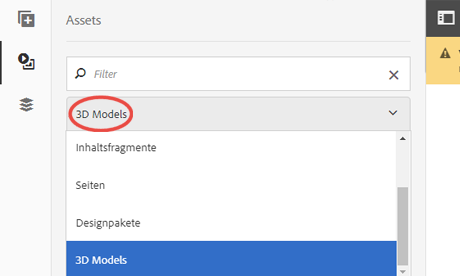

# Working with the 3D Sites component {#working-with-the-d-sites-component}

AEM 3D enthält eine AEM Sites-Komponente, mit der Sie interaktive 3D-Modelle auf Webseiten implementieren können.

After you have added your 3D component, you can [view the 3D asset in that component.](viewing-3d-assets.md)

## Hinzufügen der 3D-Komponente zur Seitenvorlage {#adding-the-d-component-to-the-page-template}

Sie müssen die 3D-Komponente auf der Seite aktivieren, bevor Sie sie auf einer Seite platzieren können. See [Editing templates](/help/sites-authoring/templates.md#editing-a-template-layout-template-author) for detailed information on enabling components in templates.

**Hinzufügen der 3D-Komponente zur Seitenvorlage**:

1. Öffnen Sie **[!UICONTROL Tools > Allgemein > Vorlagen]**.

1. Navigieren Sie zu der Seitenvorlage, in der Sie die 3D-Komponente aktivieren möchten, und wählen Sie sie aus.

1. Tippen Sie auf **[!UICONTROL Bearbeiten]**, um die Vorlage zu öffnen.
1. Wählen Sie oben rechts auf der Seite im Dropdown-Menü dem Modus **[!UICONTROL Struktur]**, falls dieser noch nicht aktiv ist.

   

1. Tap in the **[!UICONTROL Layout Container]** region to select it.

1. Tap the **[!UICONTROL Policy]** button to open the **[!UICONTROL Policy Editor]**.
1. In the **[!UICONTROL Properties]** section, select the **[!UICONTROL 3D]** checkmark, and then tap **[!UICONTROL Done]** to save the changes and close the **[!UICONTROL Policy Editor]**.

   Sie können jetzt die Komponente &quot;3D-Sites&quot;auf allen Seiten platzieren, die diese Vorlage verwenden.

## Hinzufügen der 3D-Viewer-Komponente zu einer Webseite {#adding-the-d-viewer-component-to-a-web-page}

>[!CAUTION]
>
>Diese Version von AEM 3D unterstützt nur eine Instanz der 3D-Komponente pro Webseite. Mehrere 3D-Komponenten auf derselben Seite funktionieren nicht ordnungsgemäß.

**Hinzufügen der 3D-Viewer-Komponente zu einer Webseite**:

1. Öffnen Sie AEM Sites und wählen Sie die Webseite aus, der Sie die 3D-Komponente hinzufügen möchten.

1. Tippen Sie auf **[!UICONTROL Bearbeiten]** (Stift), um die Seite im Seiten-Editor zu öffnen. Make sure **[!UICONTROL Edit]** mode near the top right of page is selected.

   

1. Tippen Sie auf die Leiste, um das Seitenbedienfeld zu öffnen.

1. Tap the plus sign icon to open the **[!UICONTROL Components]** list.

1. Drag the **[!UICONTROL 3D Viewer]** component from the **[!UICONTROL Components]** list to the location on the page where you want the 3D viewer to appear.

## Konfigurieren der 3D-Komponente {#configuring-the-d-component}

1. Wählen Sie im Seiten-Editor in AEM Sites die Komponente **[!UICONTROL 3D Viewer]** aus, die Sie zuvor zur Seite hinzugefügt haben.

1. Tippen Sie auf das Symbol **[!UICONTROL Konfiguration]** (Schraubenschlüssel), um das Dialogfeld mit der Komponentenkonfiguration zu öffnen.

   Sie können die folgenden Komponenteneigenschaften festlegen:

   <table> 
    <tbody> 
    <tr> 
    <td>Eigenschaft</td> 
    <td>Beschreibung</td> 
    <td>Anwendbarkeit</td> 
    </tr> 
    <tr> 
    <td>Höhe (px)</td> 
    <td>Geben Sie die gewünschte Höhe der 3D-Komponente in Pixeln an. Wenn das Feld frei gelassen wird, beträgt die Höhe standardmäßig 600 Pixel.</td> 
    <td> </td> 
    </tr> 
    <tr> 
    <td>Bühne Name</td> 
    <td>
Wählen Sie eine 3D-Bühne aus der Liste verfügbarer Bühnen aus. Die Bühne bietet Hintergrund und Beleuchtung.
 
See <a href="/help/assets/about-the-use-of-stages-in-aem-3d.md" target="_blank">About the use of stages in AEM 3D Sites</a>.
 </td> 
    <td>Wird für Adobe Dimension-Assets ignoriert.</td> 
    </tr> 
    <tr> 
    <td>Auto-Rotationsgeschwindigkeit (RPM)</td> 
    <td>
Der 3D-Viewer dreht die Ansicht nach dem Laden und Zurücksetzen unaufhörlich. Die automatische Drehung endet, wenn der Benutzer eine manuelle Drehaktion durchführt.
 
Sie können die Rotationsgeschwindigkeit in RPM mithilfe der folgenden Werte angeben:
 
        <ul> 
        <li>Positiven Wert auf rechts drehen</li> 
        <li>Negativen Wert für die Drehung links festlegen</li> 
        <li>Legen Sie einen Wert von 0 fest, um die automatische Rotation zu deaktivieren.</li> 
        </ul> 
Der Standardwert ist 3 U/min, was 20 Sekunden pro voller Revolution entspricht.    <strong>Hinweis:</strong> Die Rotationsgeschwindigkeit setzt eine Bildrate von 60/s voraus. Diese Rate wird normalerweise bei kleinen bis mittelgroßen Modellen auf leistungsfähigeren Grafikhardware erreicht. Größere Modelle oder langsamere Geräte drehen sich bei niedrigeren Raten automatisch.
 </td> 
    <td>Wird für Adobe Dimension-Assets ignoriert.</td> 
    </tr> 
    <tr> 
    <td>Farbe der Navigationsschaltfläche</td> 
    <td>Verwenden Sie die Farbauswahl, um die primäre Farbe für die Viewer-Steuerelemente auszuwählen.</td> 
    <td>Ignored for Adobe Dimension asses.</td> 
    </tr> 
    <tr> 
    <td>Navigation mit Mauszeigerfarbe</td> 
    <td>Verwenden Sie die Farbauswahl, um die Hover-/Auswahlfarbe für die Viewer-Steuerelemente auszuwählen.</td> 
    <td>Wird für Adobe Dimension-Assets ignoriert.</td> 
    </tr> 
    <tr> 
    <td>Muster anzeigen</td> 
    <td>Für die zukünftige Verwendung.</td> 
    <td>Wird für Adobe Dimension-Assets ignoriert.</td> 
    </tr> 
    <tr> 
    <td>GLTF-Kameravorgaben anzeigen</td> 
    <td>Zeigen Sie die Kameravorgaben an oder blenden Sie sie aus, die möglicherweise in Adobe Dimension-Assets vorhanden sind.</td> 
    <td>Nur für Adobe Dimension-Assets.</td> 
    </tr> 
    <tr> 
    <td>GLTF-Hintergrundfarbe</td> 
    <td>Standardmäßige Hintergrundfarbe, wenn das 3D-Modell keinen Hintergrund enthält.</td> 
    <td>Nur für Adobe Dimension-Assets.</td> 
    </tr> 
    </tbody> 
   </table>

1. Tippen Sie auf das Häkchen, um Ihre Änderungen zu speichern.

   Zusätzlich zu den im Komponentenkonfigurationsdialogfeld verfügbaren Einstellungen stehen eine Reihe globaler Konfigurationseinstellungen zur Verfügung, die über die CRXDE Lite geändert werden können.
Weitere Informationen zu diesen globalen Einstellungen finden Sie unter [Erweiterte Konfigurationseinstellungen](advanced-config-3d.md).

## Zuweisen eines 3D-Modells zu einer Komponente {#assigning-a-d-model-to-the-component}

1. In the AEM Sites page editor, click the **[!UICONTROL Assets]** icon to open the Assets list in the side panel.

1. Select the **[!UICONTROL 3D Models]** filter to hide unwanted asset types.

   

1. Suchen Sie nach dem 3D-Asset, das Sie auf der entsprechenden Seite anzeigen möchten.

1. Drag the 3D asset from the **[!UICONTROL Assets]** list to the **[!UICONTROL 3D Viewer]** component previously placed on the page.

   Adobe Dimension-Assets werden mit neuer Viewer-Technologie auf der Grundlage des offenen Standards glTF gerendert, während alle anderen 3D-Asset-Typen auf dem klassischen AEM 3D WebGL-Viewer basieren. Die Komponente wählt automatisch den entsprechenden Viewer basierend auf dem Typ des 3D-Modells aus.

## Vorschau einer Webseite mit einer 3D-Komponente {#previewing-a-web-page-that-has-a-d-component}

While the web page is in **[!UICONTROL Edit]** mode, the 3D component displays the 3D model but no interaction with the model is possible.

Sie können die Webseite im Seiteneditor mit vollem Zugriff auf die Funktionen der 3D-Komponente Vorschau haben.

See also [Viewing 3D assets in the Sites 3D component](viewing-3d-assets.md#viewing-d-assets-in-the-sites-d-component).

**So Vorschau einer Webseite mit einer 3D-Komponente**:

1. Nehmen Sie eine der folgenden Aktionen vor:

   * Near the upper-right of the page, click **[!UICONTROL Preview]** to enter preview mode.
   * Löschen Sie `/edit.html` aus der Seiten-URL im Browser.

## Veröffentlichen von Seite und Assets {#publishing-the-page-and-assets}

Weitere Informationen zum Veröffentlichen von Assets finden Sie unter [Veröffentlichen von Assets](managing-assets-touch-ui.md). Weitere Informationen zum Veröffentlichen von Seiten finden Sie unter [Veröffentlichen von Seiten](/help/sites-authoring/publishing-pages.md).

>[!NOTE]
>
>Using the **[!UICONTROL Publish Page]** menu item on the **[!UICONTROL Page Information]** menu will publish the page and all primary page dependencies. Sekundäre Abhängigkeiten, die möglicherweise vom 3D-Modell und/oder der 3D-Bühne verwendet werden, wie z. B. Texturmaps oder IBL-Bilder, werden auf diese Weise nicht veröffentlicht.
>
>Adobe empfiehlt, dass Sie alle 3D-Assets und ihre Abhängigkeiten direkt von AEM Assets veröffentlichen, bevor Sie die Webseite veröffentlichen, die auf diese Assets verweist.

