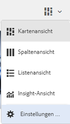
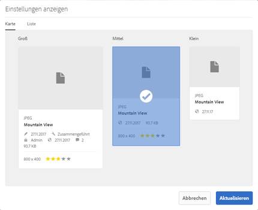
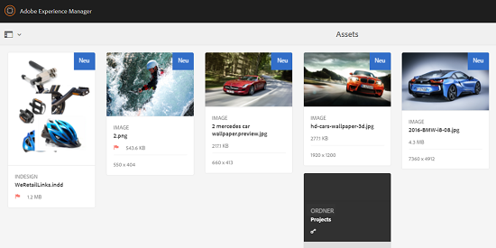
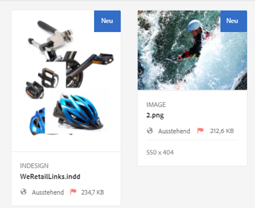
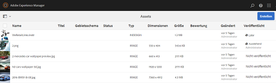
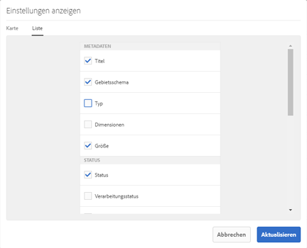
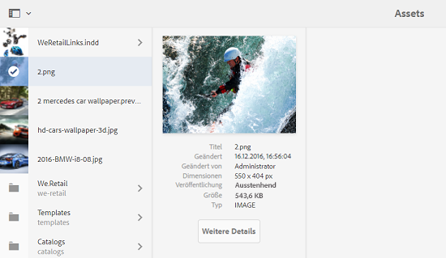
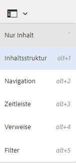
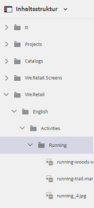

# Verbesserungen beim Benutzererlebnis von Assets {#user-experience-enhancements-in-assets}

AEM 6.4 Assets umfasst verschiedene Verbesserungen der Benutzerfreundlichkeit, die ein nahtloses Benutzererlebnis bieten und die Produktivität steigern. Das beschleunigte Erstellen und Verwalten Ihres Go-to-Market-Inhalts verbessert die Content Velocity in Ihrem Unternehmen.

Die Benutzeroberfläche ist responsiver und hilft Ihnen, ein großes Asset-Portfolio effizient zu verwalten. Sie können schnell eine lange Liste von Elementen durchsuchen, anzeigen, sortieren und reibungslos darin scrollen.

Sie können die verschiedenen Ansichten personalisieren – Karten-, Listen- und Spaltenansicht. Beispielsweise können Sie die Größe der Miniaturen konfigurieren, die in der Kartenansicht angezeigt werden sollen. In der Listenansicht können Sie konfigurieren, wie detailgenau die Assets in der Liste angezeigt werden sollen. AEM 6.4 Assets enthält eine neue Baumansicht, mit der Sie einfach durch das Asset-Repository navigieren und Ihre Assets finden können.

## Lazy Loading (langsames Laden) {#lazy-loading}

Wenn Sie in AEM 6.4 Assets nach Assets suchen bzw. die Assets durchsuchen, werden gleichzeitig bis zu 200 Assets angezeigt. Sie können schneller durch die Ergebnisse scrollen. Das ist besonders hilfreich, wenn Sie eine lange Liste von Ergebnissen durchsuchen. Da eine bedeutende Menge von Assets gleichzeitig geladen wird, verläuft das Durchsuchen reibungsloser.

Wenn Sie auf ein Asset tippen/klicken, um die Detailseite dafür anzuzeigen, können Sie zur Ergebnisseite zurückkehren, indem Sie in der Symbolleiste einfach auf die Schaltfläche „Zurück“ tippen/klicken.

## Verbesserungen an der Kartenansicht {#card-view-improvements}

Je nach dem verwendeten Gerät und der erforderlichen Dateitiefe können Sie die Größe der Asset-Miniaturansichten in der Kartenansicht ändern. Auf diese Weise können Sie Ihre Ansicht personalisieren und Einfluss auf die Anzahl der angezeigten Miniaturansichten nehmen.

Gehen Sie wie folgt vor, um die Größe von Miniaturen in der Kartenansicht anzupassen:

1. Tippen/klicken Sie in der Symbolleiste auf das Symbol Layout und wählen Sie dann die Option **[!UICONTROL Anzeigeeinstellungen]** aus.

   

1. Wählen Sie im Dialogfeld **[!UICONTROL Anzeigeeinstellungen]** die gewünschte Größe der Miniaturansicht aus und tippen/klicken Sie dann auf **[!UICONTROL Aktualisieren]**.

   

1. Überprüfen Sie die Miniaturen, die in der gewählten Größe angezeigt werden.

   

In der Kachel in der Kartenansicht werden jetzt zusätzliche Informationen wie der Veröffentlichungsstatus angezeigt.

## Verbesserungen an der Listenansicht {#list-view-improvements}

In der Listenansicht werden in der ersten Spalte jetzt standardmäßig die Asset-Namen angezeigt. Außerdem werden zusätzliche Informationen wie der Veröffentlichungs- und Verarbeitungsstatus, die Sprachvariante usw. angezeigt.

Sie können die anzuzeigende Detailtiefe konfigurieren. Tippen/klicken Sie auf das Layout-Symbol, wählen Sie die Option **[!UICONTROL Anzeigeeinstellungen]** aus und geben Sie die Spalten an, die im Dialogfeld **[!UICONTROL Anzeigeeinstellungen]** angezeigt werden sollen.

## Verbesserungen an der Spaltenansicht {#column-view-improvements}

Zusätzlich zur Karten- und Listenansicht können Sie jetzt über die Spaltenansicht zur Detailseite navigieren. Wählen Sie ein Asset aus der Spaltenansicht aus und tippen/klicken Sie unterhalb der Asset-Momentaufnahme auf **[!UICONTROL Weitere Details]**.

## Baumansicht {#tree-view}

AEM 6.4 Assets enthält eine Baumansicht, mit der Sie schnell und einfach Ihre Asset-Hierarchie durchsuchen und zum gewünschten Asset oder Ordner navigieren können.

Um die Baumansicht zu öffnen, tippen/klicken Sie auf das GlobalNav-Symbol in `Assets UI` und wählen Sie **[!UICONTROL Inhaltsstruktur]** aus dem Menü aus.

Navigieren Sie in der Inhaltshierarchie zum gewünschten Asset.

## Navigation durch Asset-Details. {#navigating-asset-details}

Die Asset-Detailseite enthält jetzt die Schaltflächen Zurück und Weiter in der Symbolleiste, damit Sie alle Bilder in einem Ordner nacheinander anzeigen können.

Abhängig vom verwendeten Gerät können Sie auch wischen oder die Pfeiltasten auf der Tastatur verwenden, um zwischen den Bildern hin- und herzuwechseln.

Abhängig vom ausgewählten Layout gibt es folgende Möglichkeiten, die Detailseite für ein Asset zu öffnen:

| **Anzeigen** | **So öffnen Sie die Asset-Detailseite** |
|---|---|
| [!UICONTROL Kartenansicht] | Tippen/klicken Sie auf die Asset-Kachel. |
| [!UICONTROL Listenansicht] | Tippen/klicken Sie auf den Zeileneintrag für das Asset in Liste. |
| [!UICONTROL Spaltenansicht] | Tippen/klicken Sie über die Asset-Momentaufnahme auf **[!UICONTROL Weitere Details.]** |

Verwenden Sie die Schaltflächen „Zurück“ bzw. „Weiter“, um zwischen den Assets hin- und herzuwechseln.

