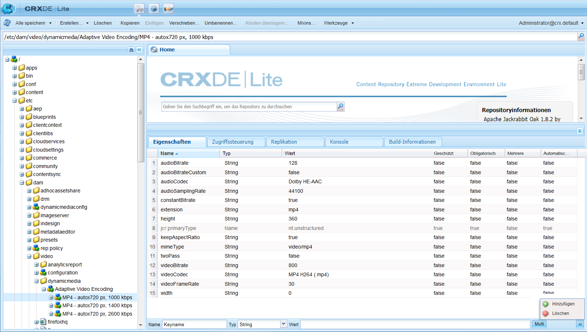
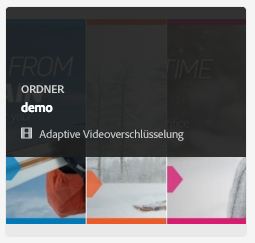
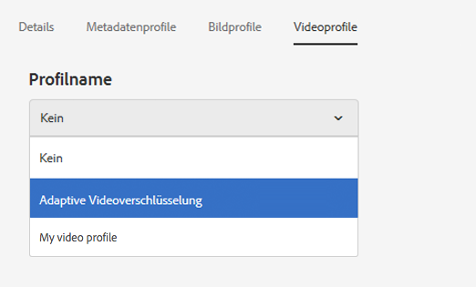
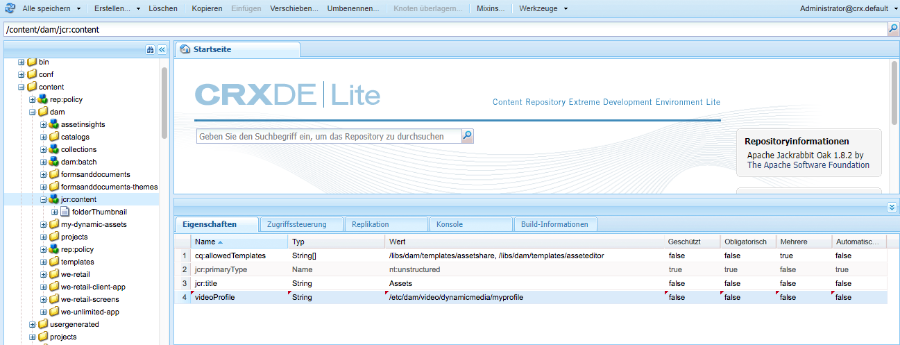

# Dynamic Media-Videoprofile {#video-profiles}

>[!CAUTION]
>
>AEM 6.4 hat das Ende der erweiterten Unterstützung erreicht und diese Dokumentation wird nicht mehr aktualisiert. Weitere Informationen finden Sie in unserer [technische Unterstützung](https://helpx.adobe.com/de/support/programs/eol-matrix.html). Unterstützte Versionen suchen [here](https://experienceleague.adobe.com/docs/?lang=de).

Dynamic Media enthält bereits das vordefinierte Profil „Adaptive Videoverschlüsselung“. Die Einstellungen in diesem vordefinierten Profil sind so optimiert, dass sie Ihren Kunden Ansichten in bestmöglicher Qualität bieten. Wenn Sie Ihre Übergeordneten Videos mithilfe des Profils &quot;Adaptive Videoverschlüsselung&quot;kodieren, passt der Videoplayer während der Wiedergabe automatisch die Qualität des Videostreams basierend auf der Internetverbindungsgeschwindigkeit Ihrer Kunden an. Dies wird als adaptives Streaming bezeichnet.

Die folgenden weiteren Faktoren wirken sich auf die Qualität Ihrer Videos aus:

* **Auflösung des hochgeladenen Master-Videos**

   Wenn das MP4-Video mit einer geringeren Auflösung (wie 240 p oder 360 p) aufgenommen wurde, kann es nicht in High Definition gestreamt werden.

* **Größe des Video-Players**

   Standardmäßig wird die **[!UICONTROL Breite]** im Profil &quot;Adaptive Videokodierung&quot;auf **[!UICONTROL Auto]**. Wie erwähnt, wird je nach Größe des Players bei der Wiedergabe die bestmögliche Qualität verwendet.

Siehe auch [Best Practices zur Videokodierung](video.md#best-practices-for-encoding-videos).

>[!NOTE]
>
>Um die Metadaten eines Videos und die zugehörigen Videobild-Miniaturansichten zu generieren, muss das Video selbst den Kodierungsprozess in Dynamic Media durchlaufen. In AEM kodiert der Workflow für **[!UICONTROL Dynamic Media-Videokodierung]** Videos, wenn Dynamic Media aktiviert und Video-Cloud-Services eingerichtet sind. Dieser Workflow erfasst den Verlauf der Workflow-Prozesse und Informationen zu Fehlern.
>
>Siehe [Überwachen der Videokodierung und des YouTube Publishing-Fortschritts](video.md#monitoring-video-encoding-and-youtube-publishing-progress). Wenn Sie Dynamic Media aktiviert und Video-Cloud Services eingerichtet haben, wird der Workflow für die **[!UICONTROL Videokodierung mit Dynamic Media]** automatisch beim Hochladen eines Videos wirksam. (Wenn Sie keine Dynamic Media verwenden, wird der Workflow **[!UICONTROL DAM Update Asset]** wirksam.)
>
>Metadaten sind nützlich, wenn Sie nach Assets suchen. Die Miniaturen sind statische Videobilder, die bei der Kodierung generiert werden. Sie werden vom AEM benötigt und in der Benutzeroberfläche verwendet, damit Sie Videos in der **[!UICONTROL Kartenansicht]**, **[!UICONTROL Suchergebnisse]** und die **[!UICONTROL Asset-Liste]** anzeigen. Sie können die generierten Miniaturansichten anzeigen, wenn Sie auf die **[!UICONTROL Ausgabeformate]** Symbol (Malerpalette) eines kodierten Videos.

Wenn Sie das Erstellen des Videoprofils abgeschlossen haben, wenden Sie es auf einen oder mehrere Ordner an. Siehe [Anwenden eines Videoprofils auf Ordner](#applying-a-video-profile-to-folders).

Informationen zur Definition von erweiterten Verarbeitungsparametern für andere Asset-Typen finden Sie unter [Konfigurieren der Asset-Verarbeitung](config-dms7.md#configuring-asset-processing).

## Vorgaben für die adaptive Videokodierung {#adaptive-video-encoding-presets}

In der folgenden Tabelle werden die Best Practice Codierungsprofile für das adaptive Video-Streaming auf Smartphones und Tablets sowie Desktop-Computern angegeben. Sie können diese Vorgaben für Videos mit jedem Seitenverhältnis verwenden.

<table> 
 <tbody> 
  <tr> 
   <td><strong>Videoformat-Codec</strong></td> 
   <td><strong>Videogröße – Breite (px)</strong></td> 
   <td><strong>Videogröße – Höhe (px)</strong></td> 
   <td><strong>Seitenverhältnis beibehalten?</strong></td> 
   <td><strong>Video-Bitrate (kBit/s)</strong></td> 
   <td><strong>Video-Framerate (FPS)</strong></td> 
   <td><strong>Audio-Codec</strong></td> 
   <td><strong>Audiobitrate   (Kbit/s)</strong></td> 
  </tr> 
  <tr> 
   <td>
MP4 H.264 (mp4)
 </td> 
   <td>auto</td> 
   <td>360</td> 
   <td>Ja</td> 
   <td>730</td> 
   <td>30</td> 
   <td>Dolby HE-AAC</td> 
   <td>128</td> 
  </tr> 
  <tr> 
   <td>
MP4 H.264 (mp4)
 </td> 
   <td>auto</td> 
   <td>540</td> 
   <td>Ja</td> 
   <td>2.000  </td> 
   <td>30</td> 
   <td>Dolby HE-AAC</td> 
   <td>128</td> 
  </tr> 
  <tr> 
   <td>
MP4 H.264 (mp4)
 </td> 
   <td>auto</td> 
   <td>720  </td> 
   <td>Ja</td> 
   <td>3.000  </td> 
   <td>30</td> 
   <td>Dolby HE-AAC</td> 
   <td>128</td> 
  </tr> 
 </tbody> 
</table>

## Erstellen eines Dynamic Media-Videokodierungsprofils für adaptives Streaming {#creating-a-video-encoding-profile-for-adaptive-streaming}

Dynamic Media verfügt bereits über ein vordefiniertes Profil für die adaptive Videoverschlüsselung - eine Gruppe von Video-Upload-Einstellungen für MP4 H.264 -, das für das beste Anzeigeerlebnis optimiert ist. Sie können dieses Profil beim Hochladen Ihrer Videos verwenden.

Wenn dieses vordefinierte Profil Ihre Anforderungen jedoch nicht erfüllt, können Sie ein eigenes Profil für die adaptive Videoverschlüsselung erstellen. Wenn Sie die Einstellung **[!UICONTROL Kodieren für adaptives Streaming]**-*Best Practice*- Alle Kodierungsvorgaben, die Sie zum Profil hinzufügen, werden validiert, um sicherzustellen, dass alle Videos dasselbe Seitenverhältnis aufweisen. Darüber hinaus werden die kodierten Videos als Multi-Bitrate-Set für das Streaming behandelt.

Wenn Sie das Videokodierungsprofil erstellen, werden Sie feststellen, dass die meisten Kodierungsoptionen vorab mit den empfohlenen Standardeinstellungen ausgefüllt sind, um Ihnen zu helfen. Wenn Sie jedoch einen anderen Wert als den empfohlenen Standardwert auswählen, sollten Sie beachten, dass dies zu einer schlechten Videoqualität während der Wiedergabe und anderen Leistungsproblemen führen kann.

Daher werden für alle MP4 H.264-Videokodierungsvorgaben im Profil die folgenden Werte validiert, um sicherzustellen, dass sie für alle individuellen Kodierungsvorgaben im Profil gleich sind, sodass adaptives Streaming möglich ist:

* Videoformat-Codec – MP4 H.264 (.mp4)
* Audio-Codec
* Audiobitrate
* Seitenverhältnis beibehalten
* Codierung mit zwei Durchgängen
* Konstante Bit-Rate
* H264-Profil
* Audio-Sampling-Rate

Wenn die Werte nicht identisch sind, können Sie das Profil durchaus im Istzustand erstellen. Beachten Sie jedoch, dass adaptives Streaming nicht möglich ist. Stattdessen wird für Benutzer Single-Bitrate-Streaming durchgeführt. Es wird empfohlen, dass Sie die Kodierungseinstellungen so bearbeiten, dass dieselben Werte über individuelle Kodierungsvorgaben hinweg im Profil verwendet werden. (Beachten Sie, dass der Videoprofil-/Vorgabeneditor die Parität der adaptiven Videokodierungseinstellungen erzwingen sollte, wenn **[!UICONTROL Kodieren für adaptives Streaming]** aktiviert ist.)

Siehe auch [Erstellen eines Videokodierungsprofils für progressives Streaming](#creating-a-video-encoding-profile-for-progressive-streaming).

Siehe auch [Best Practices zur Videokodierung](video.md#best-practices-for-encoding-videos).

Informationen zur Definition von erweiterten Verarbeitungsparametern für andere Asset-Typen finden Sie unter [Konfigurieren der Asset-Verarbeitung](config-dms7.md#configuring-asset-processing).

Wenn Sie das Erstellen des Videoprofils abgeschlossen haben, wenden Sie es auf einen oder mehrere Ordner an.

**So erstellen Sie ein Dynamic Media-Videokodierungsprofil für adaptives Streaming**:

1. Tippen oder klicken Sie auf das AEM und navigieren Sie zu **[!UICONTROL Tools > Assets > Videoprofile]**.
1. Tippen Sie auf **[!UICONTROL Erstellen]**, um ein neues Videoprofil hinzuzufügen.

1. Geben Sie einen Namen und eine Beschreibung für das Profil ein.
1. Stellen Sie sicher, dass **[!UICONTROL Kodieren für adaptives Streaming]** aktiviert ist (Standard).
1. Tippen **[!UICONTROL Videokodierungsvorgabe hinzufügen]**.
1. Legen Sie auf der Registerkarte **[!UICONTROL Allgemein]** die Video- und Audiooptionen fest.

   Tippen Sie auf das Informationssymbol neben den einzelnen Optionen, um zusätzliche Beschreibungen oder empfohlene Einstellungen auf Grundlage des ausgewählten Videoformat-Codecs anzuzeigen.

1. Stellen Sie unter der Überschrift „Videogröße“ sicher, dass **[!UICONTROL Seitenverhältnis beibehalten]** aktiviert ist.
1. Legen Sie die Video-Frame-Auflösung in Pixeln fest. Verwenden Sie den Wert **[!UICONTROL Auto]**, um das Seitenverhältnis der Quelle anzupassen (Verhältnis von Breite zu Höhe). Beispiel: Auto x 480 oder 640 x Auto.

   Führen Sie einen der folgenden Schritte aus:

   * Geben Sie im Feld **[!UICONTROL Breite]** die Option **[!UICONTROL auto]** ein. Geben Sie im Feld **[!UICONTROL Höhe]** einen Wert in Pixel ein.
   * Tippen Sie zur Visualisierung der Größe des Videos auf das **[!UICONTROL Informationen]** Symbol (i) rechts von **[!UICONTROL Höhe]** , um **[!UICONTROL Größenberechnung]** Seite. Legen Sie mit der **[!UICONTROL Größenberechnung]** die gewünschten Abmessungen des Videos fest (durch das blaue Feld dargestellt). Tippen **[!UICONTROL X]** in der oberen rechten Ecke, wenn Sie fertig sind.

1. (Optional) Tippen Sie auf die Registerkarte **[!UICONTROL Erweitert]** und stellen Sie sicher, dass das Kontrollkästchen **[!UICONTROL Standardwerte verwenden]** ausgewählt ist (empfohlen). Alternativ können Sie erweiterte Video- und Audioeinstellungen anpassen.
1. Tippen Sie oben rechts auf der Seite auf **[!UICONTROL Speichern]** , um die Vorgabe zu speichern.
1. Führen Sie einen der folgenden Schritte aus:

   * Wiederholen Sie Schritt 5 bis 10, um weitere Kodierungsvorgaben zu erstellen. (Das adaptive Video-Streaming erfordert mehrere Videovorgaben.)
   * Tippen Sie oben rechts auf der Seite erneut auf **[!UICONTROL Speichern]**, um das Profil zu speichern.

## Überwachen des Fortschritts eines Kodierungsauftrags {#monitoring-the-progress-of-an-encoding-job}

Eine Verarbeitungsanzeige (oder Statusleiste) wird angezeigt, damit Sie den Fortschritt eines Videokodierungsvorgangs visuell überwachen können.

In der Datei `error.log` können Sie den Fortschritt des Kodierungsauftrags ebenfalls anzeigen. Sie können prüfen, ob die Kodierung abgeschlossen ist oder ob Auftragsfehler angezeigt werden. Die Datei `error.log` befindet sich im `logs`-Protokollordner, in dem Ihre Instanz von AEM installiert ist.

## Erstellen eines Dynamic Media-Videokodierungsprofils für progressives Streaming {#creating-a-video-encoding-profile-for-progressive-streaming}

Wenn Sie die Option **[!UICONTROL Kodieren für adaptives Streaming]** nicht verwenden möchten, beachten Sie, dass alle Kodierungsvoreinstellungen, die Sie dem Profil hinzufügen, als einzelne Videoausgabedarstellungen für Single-Bitrate-Streaming oder progressive Videoausgabesarstellung behandelt werden. Außerdem gibt es keine Validierung, um sicherzustellen, dass alle Videoausgabedarstellungen dasselbe Seitenverhältnis aufweisen.

Je nachdem, welchen Modus Sie ausführen, werden die folgenden Videoformat-Codecs unterstützt:

* Dynamic Media-Scene7-Modus: H.264 (.mp4)
* Dynamic Media-Hybridmodus: H.264 (.mp4), WebM

Siehe auch [Erstellen eines Videokodierungsprofils für adaptives Streaming](#creating-a-video-encoding-profile-for-adaptive-streaming).

Siehe auch [Best Practices zur Videokodierung](video.md#best-practices-for-encoding-videos).

Informationen zur Definition von erweiterten Verarbeitungsparametern für andere Asset-Typen finden Sie unter [Konfigurieren der Asset-Verarbeitung](config-dms7.md#configuring-asset-processing).

Wenn Sie das Erstellen des Videoprofils abgeschlossen haben, wenden Sie es auf einen oder mehrere Ordner an.

**So erstellen Sie ein Dynamic Media-Videokodierungsprofil für progressives Streaming:**

1. Tippen Sie auf das AEM-Logo und navigieren Sie zu **[!UICONTROL Tools > Assets > Videoprofile]**.
1. Tippen Sie auf **[!UICONTROL Erstellen]**, um ein neues Videoprofil hinzuzufügen.
1. Geben Sie einen Namen und eine Beschreibung für das Profil ein.
1. Löschen Sie die **[!UICONTROL Kodieren für adaptives Streaming]** aktivieren.
1. Tippen **[!UICONTROL Videokodierungsvorgabe hinzufügen]**.
1. Legen Sie auf der Registerkarte **[!UICONTROL Allgemein]** die Video- und Audiooptionen fest.

   Tippen Sie auf **[!UICONTROL Informationen]** neben jeder Option für zusätzliche Beschreibungen oder empfohlene Einstellungen basierend auf dem ausgewählten Videoformat-Codec.

1. (Optional) Unter dem **Videogröße** Überschrift, abwählen **[!UICONTROL Seitenverhältnis beibehalten]**.
1. Im **[!UICONTROL Breite]** Feld, eingeben **[!UICONTROL auto]**; rechts von der **[!UICONTROL Höhe]** -Feld tippen Sie auf **[!UICONTROL Informationen]** Symbol. Passen Sie die Größe des Videos auf der Seite **[!UICONTROL Größenberechnung]** wunschgemäß weiter an. Tippen **[!UICONTROL X]** wenn Sie fertig sind.
1. (Optional) Führen Sie einen der folgenden Schritte aus:

   * Tippen Sie auf die Registerkarte **[!UICONTROL Erweitert]** und stellen Sie sicher, dass das Kontrollkästchen **[!UICONTROL Standardwerte verwenden]** ausgewählt ist (empfohlen).
   * Deaktivieren Sie das Kontrollkästchen **[!UICONTROL Standardwerte verwenden]** und geben Sie die gewünschten Video- und Audioeinstellungen an.

      Tippen Sie auf **[!UICONTROL Informationen]** neben jeder Option für zusätzliche Beschreibungen oder empfohlene Einstellungen basierend auf dem ausgewählten Videoformat-Codec.

1. Tippen Sie oben rechts auf der Seite auf **[!UICONTROL Speichern]** , um die Vorgabe zu speichern.
1. Führen Sie einen der folgenden Schritte aus:

   * Wiederholen Sie Schritt 5 bis 10, um weitere Kodierungsvorgaben zu erstellen.
   * Tippen Sie oben rechts auf der Seite auf **[!UICONTROL Speichern]**, um das Profil zu speichern.

## Verwenden von benutzerdefinierten Videokodierungsparametern {#using-custom-added-video-encoding-parameters}

Sie können ein vorhandenes Videokodierungsprofil bearbeiten, um erweiterte Videokodierungsparameter zu nutzen, die beim Erstellen oder Bearbeiten eines Videoprofils in AEM nicht in der Benutzeroberfläche vorhanden sind. Fügen Sie benutzerdefiniert einen oder mehrere erweiterte Parameter hinzu, z. B. **[!UICONTROL minBitrate]** und **[!UICONTROL maxBitrate]**- Ihrem bestehenden Profil.

**So verwenden Sie vom Benutzer hinzugefügte Videokodierungsparameter**:

1. Tippen Sie auf das AEM-Logo und navigieren Sie zu **[!UICONTROL Tools > Allgemein > CRXDE Lite]**.
1. Aus dem **[!UICONTROL CRXDE Lite]** in der **[!UICONTROL Explorer]** -Bedienfeld auf der linken Seite navigieren Sie zu folgendem Pfad:

   `/conf/global/settings/dam/dm/presets/video/*name_of_video_encoding_profile_to_edit*`

1. Im Bedienfeld unten rechts auf der Seite über die **[!UICONTROL Eigenschaften]** Registerkarte, geben Sie die **[!UICONTROL Name]**, **[!UICONTROL Typ]** und **[!UICONTROL Wert]** des zu verwendenden Parameters.

   Die folgenden erweiterten Parameter sind verfügbar:

   <table> 
    <tbody> 
    <tr> 
    <td><strong>Name</strong></td> 
    <td><strong>Beschreibung</strong>  </td> 
    <td><strong>Typ</strong>  </td> 
    <td><strong>Wert</strong></td> 
    </tr> 
    <tr> 
    <td><code>h264Level</code></td> 
    <td>Zu verwendende H.264-Stufe für die Kodierung. Normalerweise wird dieser Parameter basierend auf den Kodierungseinstellungen automatisch bestimmt.</td> 
    <td><code>String</code></td> 
    <td>
10 * H.264-Stufe
 
Zum Beispiel: 3,0 = 30, 1,3 = 13
 
Kein Standardwert.
 </td> 
    </tr> 
    <tr> 
    <td><code>keyframe</code></td> 
    <td>Die Zielzahl der Frames zwischen Keyframes. Berechnen Sie diesen Wert, um alle 2–10 Sekunden einen Keyframe zu generieren. Bei 30 Frames pro Sekunde sollte das Keyframe-Intervall zwischen 60 und 300 liegen.    Niedrigere Keyframe-Intervalle verbessern das Verhalten bei Stream-Suche und Stream-Wechsel für adaptive Videoverschlüsselung und können auch die Qualität bei Videos mit viel Bewegung verbessern. Da Keyframes die Größe einer Datei erhöhen, bewirkt ein niedrigeres Keyframe-Intervall in der Regel eine niedrigere Videogesamtqualität bei einer bestimmten Bit-Rate.</td> 
    <td><code>String</code></td> 
    <td>
Positive Zahl.
 
Der Standardwert ist 300.
 
Der empfohlene Wert für HLS (HTTP Live Streaming) ist 60–90.
 </td> 
    </tr> 
    <tr> 
    <td><code>minBitrate</code></td> 
    <td>
Minimale Bit-Rate, um Kodierungen mit variabler Bit-Rate zu ermöglichen (Kbit/s).
 
Dieser Parameter ist nur gültig, wenn bei der Erstellung oder Bearbeitung eines Videokodierungsprofils auf der Registerkarte „Erweitert“ die Option <strong>Konstante Bit-Rate verwenden</strong> deaktiviert ist.
 
Siehe auch <a href="/help/assets/video.md#bitrate">Bit-Rate</a>.
 </td> 
    <td><code>String</code></td> 
    <td>
Positive Zahl in Kbit/s.
 
Kein Standardwert.
 </td> 
    </tr> 
    <tr> 
    <td><code>maxBitrate</code></td> 
    <td>
Maximale Bit-Rate, um Kodierungen mit variabler Bit-Rate zu ermöglichen (Kbit/s).
 
Dieser Parameter ist nur gültig, wenn bei der Erstellung oder Bearbeitung eines Videokodierungsprofils auf der Registerkarte „Erweitert“ die Option <strong>Konstante Bit-Rate verwenden</strong> deaktiviert ist.
 
Siehe auch <a href="/help/assets/video.md#bitrate">Bit-Rate</a>.
 </td> 
    <td><code>String</code></td> 
    <td>
Positive Zahl in Kbit/s.
 
Kein Standardwert. Der empfohlene Wert entspricht jedoch bis zum Zweifachen der Kodierungs-Bit-Rate.
 </td> 
    </tr> 
    <tr> 
    <td><code>audioBitrateCustom</code></td> 
    <td>Setzen Sie den Wert auf <code>true</code>, um eine konstante Bit-Rate für den Audio-Stream zu erzwingen, sofern dies vom Audio-Codec unterstützt wird.</td> 
    <td><code>String</code></td> 
    <td>
<code>true</code>/<code>false</code>
 
Der Standardwert ist <code>false</code>.
 
Der empfohlene Wert für HLS (HTTP Live Streaming) ist <code>false</code>.
 
 
 </td> 
    </tr> 
    </tbody> 
   </table>

   

1. Tippen Sie unten rechts auf der Seite auf **[!UICONTROL Hinzufügen]**.
1. Führen Sie einen der folgenden Schritte aus:

   * Wiederholen Sie die Schritte 3 und 4, um Ihrem Videocodierungsprofil einen weiteren Parameter hinzuzufügen.
   * Tippen Sie in der oberen linken Ecke der Seite auf **[!UICONTROL Alle speichern]**.

1. In der linken oberen Ecke der **[!UICONTROL CRXDE Lite]** Seite, tippen Sie auf **[!UICONTROL Zurück zur Startseite]** -Symbol, um zu AEM zurückzukehren.

### Bearbeiten eines Dynamic Media-Videokodierungsprofils {#editing-a-video-encoding-profile}

Sie können jedes Videokodierungsprofil bearbeiten, das Sie zum Hinzufügen, Bearbeiten oder Löschen von Videovorgaben in diesem Profil erstellt haben.

Die Bearbeitung des bereits in Dynamic Media integrierten Profils **[!UICONTROL Adaptive Videokodierung]** ist standardmäßig deaktiviert. Sie können das Profil einfach kopieren und dann unter einem neuen Namen speichern. Sie können dann die gewünschten Vorgaben im kopierten Profil bearbeiten.

Siehe auch [Best Practices zur Videokodierung](video.md#best-practices-for-encoding-videos).

Informationen zur Definition von erweiterten Verarbeitungsparametern für andere Asset-Typen finden Sie unter [Konfigurieren der Asset-Verarbeitung](config-dms7.md#configuring-asset-processing).

**So bearbeiten Sie ein Dynamic Media-Videokodierungsprofil**:

1. Tippen Sie auf das AEM-Logo und navigieren Sie zu **[!UICONTROL Tools > Assets > Videoprofile]**.
1. Im **[!UICONTROL Videoprofile]** Seite, prüfen Sie einen Videoprofilnamen.
1. Tippen Sie in der Symbolleiste auf **[!UICONTROL Bearbeiten]**.
1. Im **[!UICONTROL Videokodierungsprofil]** Seite, bearbeiten Sie den Namen und die Beschreibung nach Bedarf.
1. Als Best Practice hat es sich bewährt, das Kontrollkästchen **[!UICONTROL Für adaptives Streaming kodieren]** zu aktivieren.

   Tippen Sie auf das Informationssymbol, um eine Beschreibung von adaptivem Streaming anzuzeigen. (Wenn Sie ein progressives Videoprofil bearbeiten, aktivieren Sie dieses Kontrollkästchen nicht.)

1. Unter dem **[!UICONTROL Videokodierungsvorgaben]** Überschriften, Hinzufügen, Bearbeiten oder Löschen von Videokodierungsvorgaben, aus denen das Profil besteht.

   Tippen Sie auf **[!UICONTROL Informationen]** Symbol neben jeder Option auf **[!UICONTROL Allgemein]** und **[!UICONTROL Erweitert]** Registerkarten für zusätzliche Beschreibungen oder empfohlene Einstellungen basierend auf dem ausgewählten Videoformat-Codec.

1. Tippen Sie oben rechts auf der Seite auf **[!UICONTROL Speichern]**.

### Kopieren eines Dynamic Media-Videokodierungsprofils {#copying-a-video-encoding-profile}

1. Tippen Sie auf das AEM-Logo und navigieren Sie zu **[!UICONTROL Tools > Assets > Videoprofile]**.
1. Im **[!UICONTROL Videoprofile]** Seite, prüfen Sie einen Videoprofilnamen.
1. Tippen Sie in der Symbolleiste auf **[!UICONTROL Kopieren]**.
1. Im **[!UICONTROL Videokodierungsprofil]** Seite, geben Sie einen neuen Namen für das Profil ein.
1. Als Best Practice hat es sich bewährt, das Kontrollkästchen **[!UICONTROL Für adaptives Streaming kodieren]** zu aktivieren. Tippen Sie auf das Informationssymbol, um eine Beschreibung von adaptivem Streaming anzuzeigen. (Wenn Sie ein progressives Videoprofil kopieren, aktivieren Sie dieses Kontrollkästchen nicht.)

   Wenn im Hybridmodus von Dynamic Media eine WebM-Videovoreinstellung Teil des Videoprofils ist, ist die Option **[!UICONTROL Für adaptives Streaming kodieren]** nicht möglich, da alle Vorgaben das MP4-Format aufweisen müssen.
1. Unter dem **[!UICONTROL Videokodierungsvorgaben]** Überschriften, Hinzufügen, Bearbeiten oder Löschen von Videokodierungsvorgaben, aus denen das Profil besteht.

   Tippen Sie auf **[!UICONTROL Informationen]** Symbol neben jeder Option auf **[!UICONTROL Allgemein]** und **[!UICONTROL Erweitert]** Registerkarten für empfohlene Einstellungen und Beschreibungen.

1. Tippen Sie oben rechts auf der Seite auf **[!UICONTROL Speichern]**.

### Löschen eines Dynamic Media-Videokodierungsprofils {#deleting-a-video-encoding-profile}

1. Tippen Sie auf das AEM-Logo und navigieren Sie zu **[!UICONTROL Tools > Assets > Videoprofile]**.
1. Im **[!UICONTROL Videoprofile]** -Seite einen oder mehrere Videoprofilnamen.
1. Tippen Sie in der Symbolleiste auf **[!UICONTROL Löschen]**.
1. Tippen Sie auf **[!UICONTROL OK]**.

## Anwenden eines Dynamic Media-Videoprofils auf Ordner {#applying-a-video-profile-to-folders}

Wenn Sie einem Ordner ein Videoprofil zuweisen, erben automatisch alle Unterordner das Profil vom übergeordneten Ordner. Das bedeutet, dass Sie einem Ordner nur ein Videoprofil zuweisen können. Daher sollten Sie die Ordnerstruktur sorgfältig überdenken, in der Sie Assets hochladen, speichern, verwenden und archivieren.

Wenn Sie einem Ordner ein anderes Videoprofil zugewiesen haben, überschreibt das neue das vorherige Profil. Die zuvor vorhandenen Ordner-Assets verbleiben unverändert. Das neue Profil wird auf die Assets angewendet, die dem Ordner später hinzugefügt werden.

Ordner, denen ein Profil zugewiesen wurde, werden in der Benutzeroberfläche durch den Namen des Profils angegeben, der im Kartennamen angezeigt wird.

Sie können Videoprofile auf bestimmte Ordner oder global auf alle Assets anwenden.

### Anwenden von Videoprofilen auf bestimmte Ordner {#applying-video-profiles-to-specific-folders}

Sie können ein Videoprofil über das Menü **[!UICONTROL Werkzeuge]** oder, falls Sie sich im Ordner befinden, über **[!UICONTROL Eigenschaften]** auf einen Ordner anwenden. In diesem Abschnitt wird beschrieben, wie Sie Videoprofile auf beide Arten auf Ordner anwenden.

Ordner, denen bereits ein Profil zugewiesen ist, werden durch die Anzeige des Profilnamens direkt unter dem Ordnernamen gekennzeichnet.

#### Anwenden von Dynamic Media-Videoprofilen auf Ordner über die Benutzeroberfläche &quot;Profile&quot; {#applying-video-profiles-to-folders-from-profiles-user-interface}

1. Tippen Sie auf das AEM-Logo und navigieren Sie zu **[!UICONTROL Tools > Assets > Videoprofile]**.
1. Wählen Sie ein Videoprofil aus, das Sie auf einen oder mehrere Ordner anwenden möchten.
1. Tippen Sie auf **[!UICONTROL Profil auf Ordner anwenden]** und wählen Sie mindestens einen Ordner aus, den Sie verwenden möchten, um neu hochgeladene Assets zu empfangen. Tippen Sie dann auf **[!UICONTROL Anwenden]**. Ordner, denen bereits ein Profil zugewiesen ist, werden durch die Anzeige des Profilnamens direkt unter dem Ordnernamen gekennzeichnet.

#### Anwenden von Dynamic Media-Videoprofilen auf Ordner über &quot;Eigenschaften&quot; {#applying-video-profiles-to-folders-from-properties}

1. Tippen Sie auf das AEM und navigieren Sie zu **[!UICONTROL Assets]** und dann in den Ordner, auf den Sie ein Videoprofil anwenden möchten.
1. Tippen Sie im Ordner auf das Kontrollkästchen, um es zu aktivieren, und tippen Sie anschließend auf **[!UICONTROL Eigenschaften]**.
1. Wählen Sie die **[!UICONTROL Videoprofile]** und wählen Sie das Profil aus dem Dropdown-Menü aus und tippen Sie auf **[!UICONTROL Speichern und schließen]**. Ordner, denen bereits ein Profil zugewiesen ist, werden durch die Anzeige des Profilnamens direkt unter dem Ordnernamen gekennzeichnet.

   

### Globales Anwenden eines Dynamic Media-Videoprofils {#applying-a-video-profile-globally}

Profile können nicht nur auf einzelne Ordner, sondern auch global angewendet werden. Dann wird allen Inhalten, die Sie in AEM Assets in beliebigen Ordnern hochladen, das ausgewählte Profil zugeordnet.

**So wenden Sie ein Dynamic Media-Videoprofil global an**:

1. Navigieren Sie in CRXDE Lite zum folgenden Knoten: `/content/dam/jcr:content`.
1. Eigenschaft hinzufügen **[!UICONTROL videoProfile]**: `/etc/dam/video/dynamicmedia/<name_of_video_encoding_profile>`
1. Tippen Sie auf **[!UICONTROL Alle speichern]**.

## Entfernen eines Dynamic Media-Videoprofils aus Ordnern {#removing-a-video-profile-from-folders}

Wenn Sie ein Videoprofil aus einem Ordner entfernen, erben automatisch alle Unterordner das Entfernen des Profils aus dem übergeordneten Ordner. Die Verarbeitung der Dateien, die in den Ordnern stattgefunden hat, verbleibt jedoch intakt.

Sie können ein Videoprofil aus einem Ordner im Menü **[!UICONTROL Tools]** entfernen. Wenn Sie sich im Ordner befinden, ist dies über die **[!UICONTROL Ordnereinstellungen]** möglich. In diesem Abschnitt werden die beiden Möglichkeiten beschrieben, wie Sie Videoprofile aus Ordnern entfernen können.

### Entfernen von Dynamic Media-Videoprofilen aus Ordnern über die Benutzeroberfläche &quot;Profile&quot; {#removing-video-profiles-from-folders-via-profiles-user-interface}

1. Tippen Sie auf das AEM-Logo und navigieren Sie zu **[!UICONTROL Tools > Assets > Videoprofile]**.
1. Wählen Sie das Videoprofil, das Sie aus einem oder mehreren Ordnern entfernen möchten.
1. Tippen **[!UICONTROL Profil aus Ordner entfernen]** und wählen Sie den Ordner oder mehrere Ordner aus, aus denen Sie das Profil entfernen möchten, und tippen Sie auf **[!UICONTROL Entfernen]**.

   Sie können sich vergewissern, dass das Videoprofil nicht länger auf einen Ordner angewendet wird, da der Name in diesem Fall nicht mehr unter dem Ordner angezeigt wird.

### Entfernen von Dynamic Media-Videoprofilen aus Ordnern über &quot;Eigenschaften&quot; {#removing-video-profiles-from-folders-via-properties}

1. Tippen Sie auf das AEM und navigieren Sie zu **[!UICONTROL Assets]** und dann in den Ordner, aus dem Sie ein Videoprofil entfernen möchten.
1. Tippen Sie im Ordner auf das Kontrollkästchen, um es zu aktivieren, und tippen Sie anschließend auf **[!UICONTROL Eigenschaften]**.
1. Wählen Sie die **[!UICONTROL Videoprofile]** Registerkarte und wählen Sie **[!UICONTROL Keines]** Tippen Sie im Dropdown-Menü auf **[!UICONTROL Speichern und schließen]**. Ordner, denen bereits ein Profil zugewiesen ist, werden durch die Anzeige des Profilnamens direkt unter dem Ordnernamen gekennzeichnet.
