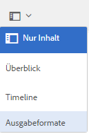
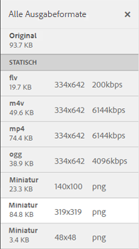

# Videoausgabeformate {#video-renditions}

>[!CAUTION]
>
>AEM 6.4 hat das Ende der erweiterten Unterstützung erreicht und diese Dokumentation wird nicht mehr aktualisiert. Weitere Informationen finden Sie in unserer [technische Unterstützung](https://helpx.adobe.com/de/support/programs/eol-matrix.html). Unterstützte Versionen suchen [here](https://experienceleague.adobe.com/docs/?lang=de).

Adobe Experience Manager Assets erstellt Videoausgabeformate für Video-Assets verschiedener Formate, einschließlich OGG, FLV usw.

AEM Assets unterstützt statische und dynamische Ausgabeformate (DM-kodierte Ausgabeformate) für Medien-Assets.

Statische Ausgabeformate werden nativ mit FFMPEG (im Systempfad installiert und verfügbar) generiert und im Inhalts-Repository gespeichert.

Die DM-kodierten Ausgabeformate werden im Proxyserver gespeichert und zur Laufzeit bereitgestellt.

AEM Assets bietet Wiedergabeunterstützung für diese Ausgabeformate auf Client-Seite.

Um die Ausgabeformate eines bestimmten Video-Assets anzuzeigen, öffnen Sie die entsprechende Asset-Seite und klicken oder tippen Sie auf das GlobalNav-Symbol. Wählen Sie dann **[!UICONTROL Ausgabeformate]** aus der Liste aus.

Die Liste mit Videoausgabeformate wird im Bereich **[!UICONTROL Wiedergaben]** angezeigt.

Konfigurieren Sie den Proxyserver für DM-kodierte Ausgabeformate, indem Sie [Cloud-Dienste für Dynamic Media konfigurieren.](config-dynamic.md)

So generieren Sie Videoausgabeformate mit gewünschten Parametern: [Erstellen eines entsprechenden Videoprofils](video-profiles.md).

Nachdem Sie den Proxyserver konfiguriert und Videoprofile erstellt haben, können Sie diese Videovorlage in ein Verarbeitungsprofil aufnehmen und dieses Verarbeitungsprofil auf einen Ordner anwenden.

>[!NOTE]
>
>Die Audiowiedergabe funktioniert nicht für OGG- und WAV-Dateien in Internet Explorer 11. Auf der Seite mit den Asset-Details wird für Assets mit der Erweiterung OGG oder WAV der Fehler „Ungültige Quelle“ angezeigt.
>
>Auf MS Edge und iPad werden die OGG-Dateien nicht abgespielt und lösen den Fehler „Format nicht unterstützt“ aus.
