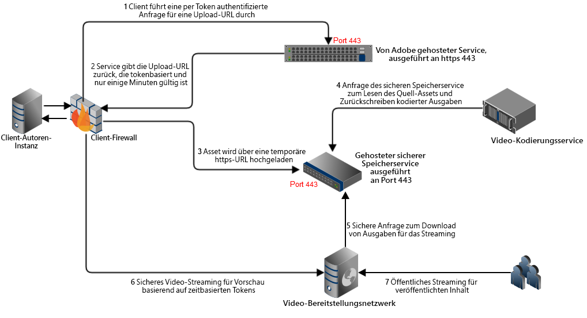
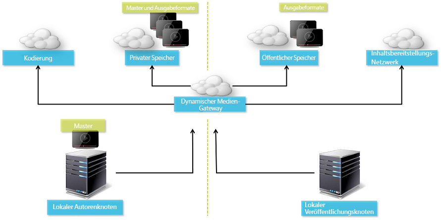
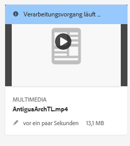
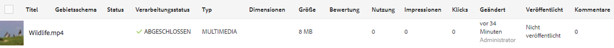
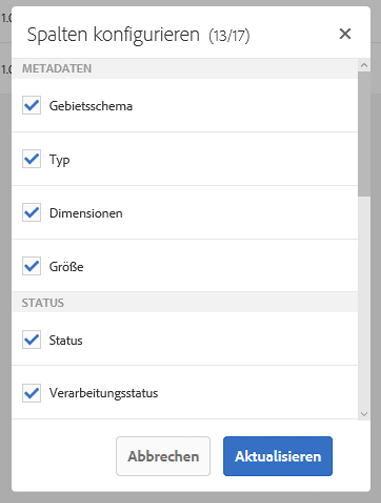
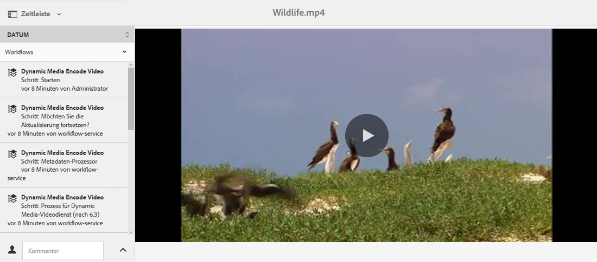
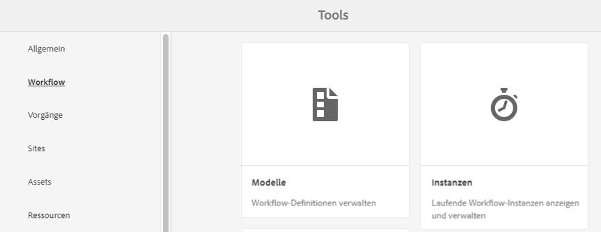
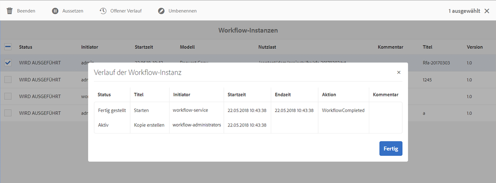
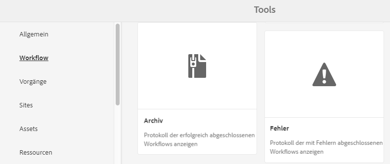
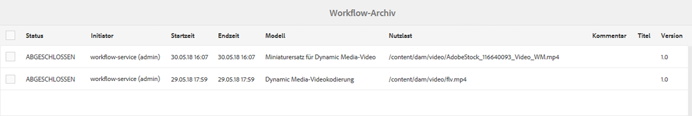

# Video {#video}

In diesem Abschnitt wird die Arbeit mit Videos in Dynamic Media beschrieben.

## Schnellstartanleitungen: Videos  {#quick-start-videos}

Die folgende schrittweise Workflow-Beschreibung soll Ihnen dabei helfen, in Dynamic Media den schnellen Einstieg in adaptive Videosets zu schaffen. Nach jedem Schritt finden Sie Querverweise auf Themenüberschriften, unter denen Sie weitere Informationen erhalten.

>[!NOTE]
>
>Stellen Sie vor der Arbeit mit Videos in Dynamic Media sicher, dass der AEM-Administrator Dynamic Media Cloud Services bereits aktiviert und konfiguriert hat.
>
>* Siehe [Konfigurieren von Dynamic Media-Cloud-Services unter Konfigurieren von Dynamic Media – Hybridmodus.](/help/assets/config-dynamic.md)
>* Siehe [Konfigurieren von Dynamic Media – Scene7-Modus](config-dms7.md) und [Fehlerbehebung für Dynamic Media – Scene7-Modus](troubleshoot-dms7.md)
>


1. **Konfigurieren Sie Videos in Dynamic Media** anhand der folgenden Schritte:

   * Erstellen Sie Ihr eigenes Videokodierungsprofil. Sie können auch einfach das vordefinierte Profil &quot;Adaptive Videoverschlüsselung&quot;verwenden, das im Lieferumfang von Dynamic Media enthalten ist.

      * [Erstellen eines Videokodierungsprofils](video-profiles.md)
      * Erfahren Sie mehr über die [Best Practices für Videokodierung](#best-practices-for-encoding-videos).
   * Verknüpfen Sie das Videoverarbeitungsprofil mit den Ordnern, in die Sie die Master-Videos hochladen.

      * [Anwenden eines Videoprofils auf Ordner](video-profiles.md#applying-a-video-profile-to-folders)
      * Erfahren Sie mehr über die [Best Practices für die Organisation Ihrer digitalen Assets zur Verwendung von Verarbeitungsprofilen](organize-assets.md#organize-using-folders).
      * Weitere Informationen zum [Organisieren digitaler Assets](organize-assets.md)
   * Laden Sie die Mastervideos in die Ordner hoch. Sie können Videodateien mit bis zu 15 GB pro Datei hochladen. Wenn Sie dem Ordner Videos hinzufügen, werden diese gemäß dem diesem Ordner zugewiesenen Videoverarbeitungsprofil kodiert.

      * [Videos hochladen](managing-video-assets.md#uploading-and-previewing-video-assets)
      * Weitere Informationen zu [Unterstützten Eingabedateiformaten](assets-formats.md#supported-multimedia-formats)
   * [Fortschritt der Videokodierung](#monitoring-video-encoding-and-youtube-publishing-progress) in der Asset- oder Workflow-Ansicht überwachen


1. **Verwalten Sie die Videos in Dynamic Media** anhand der folgenden Schritte:

   * Video-Assets organisieren und durchsuchen

      * [Organisieren digitaler Assets](organize-assets.md)

         Erfahren Sie mehr über die [Best Practices für die Organisation Ihrer digitalen Assets zur Verwendung von Verarbeitungsprofilen](organize-assets.md#organize-using-folders)

      * [Nach Video-Assets suchen](search-video-assets.md) oder [Assets suchen](managing-assets-touch-ui.md#searching-assets)
      
   * Video-Assets vorab anzeigen und veröffentlichen

      * Zeigen Sie das Quellvideo und die kodierten Ausgabedarstellungen des Videos zusammen mit den zugehörigen Miniaturansichten an:

         [Videos vorab anzeigen](managing-video-assets.md#uploading-and-previewing-video-assets) oder [Assets vorab anzeigen](previewing-assets.md)

         [Anzeigen von Videoausgabeformaten](video-renditions.md)

         [Videoausgabedarstellungen verwalten](managing-assets-touch-ui.md#managing-renditions)

      * [Verwalten von Viewer-Vorgaben](managing-viewer-presets.md)
      * [Veröffentlichen von Assets](publishing-dynamicmedia-assets.md)
      
   * Mit Videometadaten arbeiten

      * Zeigen Sie die Eigenschaften einer kodierten Videoausgabedarstellung wie Framerate, Audio- und Video-Bitrate und Codec an:

        [Anzeigen der Eigenschaften von Videoausgabeformaten](video-renditions.md)

      * Bearbeiten Sie die Eigenschaften des Videos, wie den Titel, die Beschreibung, die Tags und die benutzerdefinierten Metadatenfelder:

        [Bearbeiten von Videoeigenschaften](managing-assets-touch-ui.md#editing-properties)

      * [Verwalten von Metadaten für digitale Assets](metadata.md)
      * [Metadatenschemata](metadata-schemas.md)
      
   * Videos überprüfen, genehmigen und kommentieren

      * [Anmerkungen zu ](managing-video-assets.md#annotating-video-assets) Videos  [Anmerkungen zu Assets](managing-assets-touch-ui.md#annotating)
      * [Anwenden von Workflows auf ](assets-workflow.md) Assets oder  [Starten eines Workflows für ein Asset](managing-assets-touch-ui.md#starting-a-workflow-on-an-asset)
      * [Ordner-Assets prüfen](bulk-approval.md)
      * [Projekte](/help/sites-authoring/projects.md)


1. **Veröffentlichen Sie die Videos in Dynamic Media** anhand der folgenden Schritte:

   * Wenn Sie Adobe Experience Manager als Web Content Management System verwenden, können Sie Ihren Webseiten direkt Videos hinzufügen.

      * [Fügen Sie Ihren Web-Seiten Videos hinzu](adding-dynamic-media-assets-to-pages.md).
      
   * Wenn Sie das Web-Content-Management-System eines Drittanbieters verwenden, können Sie Videos mit Web-Seiten verknüpfen oder darin einbetten.

      * Integrieren von Videos mithilfe der URL:

         [Verknüpfen Sie URLs mit einer Web-Anwendung](linking-urls-to-yourwebapplication.md).
      * Integrieren von Videos mithilfe von Einbettungs-Code auf der Web-Seite:

         [Betten Sie den Video-Viewer auf einer Web-Seite ein](embed-code.md).
         
   * [Veröffentlichen Sie Videos auf YouTube](#publishing-videos-to-youtube).
   * [Generieren Sie Videoberichte](#viewing-video-reports).
   * [Hinzufügen von Untertiteln zu Videos](#adding-captions-to-video).


## Arbeiten mit Video in Dynamic Media  {#working-with-video-in-dynamic-media}

„Video in Dynamic Media“ ist eine Komplettlösung, die das Veröffentlichen von qualitativ hochwertigen adaptiven Videos für das Streaming auf mehreren Bildschirmen vereinfacht, einschließlich Desktop und iOS-, Android-, Blackberry- und Windows-Mobilgeräten. Ein adaptives Videoset umfasst Versionen desselben Videos, die mit unterschiedlichen Bit-Raten und Formaten kodiert wurden, wie 400 kBit/s, 800 kBit/s und 1.000 kBit/s. Der Desktop-Computer oder das Mobilgerät erkennt die verfügbare Bandbreite.

Auf einem iOS-Mobilgerät wird beispielsweise die Bandbreite 3G, 4G oder WLAN erkannt. Dann wird automatisch das richtig kodierte Video aus den verschiedenen Video-Bitraten im adaptiven Videoset ausgewählt. Das Video wird auf Desktops, Mobilgeräten oder Tablets gestreamt.

Außerdem wird die Videoqualität automatisch geändert, wenn sich die Netzwerkbedingungen am Desktop oder Mobilgerät ändern. Wenn darüber hinaus ein Kunde den Vollbildmodus an einem Desktop aktiviert, reagiert das adaptive Videoset, indem eine bessere Auflösung verwendet wird, um das Anzeigeerlebis des Kunden zu verbessern. Adaptive Videosets bieten Ihnen bestmögliche Wiedergabe für Kunden, die das Dynamic Media-Video auf unterschiedlichen Bildschirmen und Geräten wiedergeben.

Die Logik, mit der Video-Player bestimmen, welches kodierte Video wiedergegeben oder während der Wiedergabe ausgewählt werden soll, basiert auf dem folgenden Algorithmus:

1. Video-Player lädt das erste Videofragment auf Basis der Bitrate, die am nächsten an dem Wert liegt, der im Player selbst als „erste Bitrate“ festgelegt wurde.
1. Video-Player wechselt auf Basis von Änderungen an der Bandbreitengeschwindigkeit anhand der folgenden Kriterien:

   1. Player wählt den höchsten Bandbreitenstrom aus, der kleiner als die geschätzte Bandbreite oder gleich dieser ist.
   1. Player berücksichtigt nur 80 % der verfügbaren Bandbreite. Beim Wechseln nach oben ist der Player mit nur 70 % konservativer, um Überschätzungen zu vermeiden und sofort zurückzuwechseln.

Detaillierte technische Informationen zum Algorithmus finden Sie unter [https://android.googlesource.com/platform/frameworks/av/+/master/media/libstagefright/httplive/LiveSession.cpp](https://android.googlesource.com/platform/frameworks/av/+/master/media/libstagefright/httplive/LiveSession.cpp)

Für das Verwalten von einzelnen Videos und adaptiven Videosets wird Folgendes unterstützt:

* Hochladen von Videos mit zahlreichen unterstützten Video- und Audioformaten und Kodieren von Videos in das MP4 H.264-Format für die Wiedergabe auf mehreren Bildschirmen Sie können vordefinierte adaptive Videovorgaben oder einzelne Videokodierungsvorgaben verwenden bzw. Ihre eigene Kodierung anpassen, um die Qualität und Größe der Videos zu steuern.

   * Wenn ein adaptives Videoset generiert wird, umfasst es MP4-Videos.
   * **Hinweis**: Master-/Quellvideos werden einem adaptiven Videoset nicht hinzugefügt.

* Videountertitelung in allen HTML5-Video-Viewern
* Organisieren und Durchsuchen von Videos mit kompletter Metadatenunterstützung für die effiziente Verwaltung von Video-Assets
* Bereitstellen von adaptiven Videosets im Internet sowie auf Desktops und Mobilgeräten, einschließlich iPhone, iPad, Android™, Blackberry und Windows Phone.

Das adaptive Video-Streaming wird auf einer Vielzahl von iOS-Plattformen unterstützt. Siehe [Adobe Viewer-Referenzhandbuch](https://experienceleague.adobe.com/docs/dynamic-media-developer-resources/library/home.html?lang=de).

Dynamic Media unterstützt die mobile Videowiedergabe für MP4 H.264-Videos. Welche BlackBerry-Geräte dieses Videoformat unterstützen, können Sie hier einsehen: [Unterstützte Videoformate für BlackBerry](https://support.blackberry.com/kb/articleDetail?ArticleNumber=000005482).

Welche Windows-Geräte dieses Videoformat unterstützen, können Sie hier einsehen: [Unterstützte Videoformate für Windows Phone](https://msdn.microsoft.com/library/windows/apps/ff462087%28v=vs.105%29.aspx)

* Wiedergabe von Videos mit Video-Viewer-Vorgaben aus Dynamic Media, einschließlich der folgenden:

   * Einzelvideo-Viewer
   * Viewer für gemischte Medien, die sowohl Video- als auch Bildinhalte kombinieren

* Konfigurieren von Video-Playern entsprechend Ihren Branding-Anforderungen
* Integrieren von Videos in Websites, mobile Sites oder Mobile Apps mit einer einfachen URL oder mit Integrations-Code

<!-- See [Dynamic video playback](https://s7d9.scene7.com/s7/uvideo.jsp?asset=GeoRetail/Mop_AVS&config=GeoRetail/Universal_Video1&stageSize=640,480). -->

Siehe auch [Über HTML5-Viewer](https://experienceleague.adobe.com/docs/dynamic-media-developer-resources/library/viewers-for-aem-assets-only/c-html5-aem-asset-viewers.html?lang=en#viewers-for-aem-assets-only) im Adobe Dynamic Media Viewer-Referenzhandbuch.

## Best Practice: Verwenden des HTML5-Video-Viewers {#best-practice-using-the-html-video-viewer}

Die HTML5-Video-Viewer-Vorgaben aus „Dynamic Media“ stellen robuste Video-Player dar. Damit können Sie viele gängige Probleme im Zusammenhang mit der HTML5-Videowiedergabe sowie Probleme mit Mobilgeräten vermeiden, wie fehlende Bereitstellung von adaptivem Streaming und eingeschränkte Reichweite in Bezug auf Desktop-Browser.

In Bezug auf die Entwicklung des Players können Sie alle Funktionen des Video-Players mit standardmäßigen Web-Entwicklungs-Tools entwerfen. Sie können beispielsweise die Schaltflächen, die Steuerelemente und den benutzerdefinierten Posterhintergrund mit HTML5 und CSS entwerfen, um Ihre Kunden mit einem angepassten Erscheinungsbild anzusprechen.

Auf der Wiedergabeseite des Viewers wird die Videofähigkeit des Browsers automatisch erkannt. Das Video wird dann per HLS-Streaming (adaptives Video-Streaming) bereitgestellt. Wenn diese Bereitstellungsmethoden nicht verfügbar sind, wird stattdessen der progressive HTML5-Download verwendet.

Indem Sie die Fähigkeiten, die Wiedergabekomponenten anhand von HTML5 und CSS zu entwerfen, eingebettete Wiedergabe zu ermöglichen und adaptives und progressives Streaming zu verwenden (je nach Browser-Funktionen), in einem einzelnen Player kombinieren, erreichen Sie mit Ihren Rich-Media-Inhalten mehr Desktop- und Mobilbenutzer und können für ein optimiertes Videoerlebnis sorgen.

Weitere Informationen finden Sie auch im Abschnitt zu [HTML5-Viewern](https://experienceleague.adobe.com/docs/dynamic-media-developer-resources/library/viewers-for-aem-assets-only/c-html5-aem-asset-viewers.html) in der Referenzanleitung für Adobe Viewer.

### Wiedergabe von Videos auf Desktops und mobilen Geräten mit dem HTML5-Video-Viewer  {#playback-of-video-on-desktop-computers-and-mobile-devices-using-the-html-video-viewer}

Beim adaptiven Video-Streaming auf Desktop und Mobilgeräten basieren die für den Bit-Ratenwechsel verwendeten Videos auf allen MP4-Videos im adaptiven Videoset.

Die Videowiedergabe erfolgt entweder mithilfe von HLS-Videostreams (HTTP-Live-Streaming) oder progressivem Video-Download. In früheren Versionen von AEM, z. B. 6.0, 6.1 und 6.2, wurden Videos über HTTP gestreamt.

In AEM 6.3 und höheren Versionen werden die Videos nun über HTTPS gestreamt (d. h. HLS-Videostreaming), da die DM-Gatewayservice-URL ebenfalls immer HTTPS verwendet. Beachten Sie, dass es bei diesem Standardverhalten keine Auswirkung auf den Kunden gibt. Video-Streaming wird immer über HTTPS ausgeführt, wenn es nicht durch den Browser unterstützt wird. (siehe folgende Tabelle). Daher:

* Wenn Sie eine HTTPS-Website mit HTTPS-Video-Streaming haben, ist das Streaming gut.
* Wenn Sie eine HTTP-Website mit HTTPS-Video-Streaming haben, ist das Streaming gut und es gibt keine Probleme mit gemischten Inhalten im Webbrowser.

HLS (HTTP Live Streaming) ist ein Apple-Standard für adaptives Videostreaming, der die Wiedergabe automatisch an die Netzwerkbandbreitenkapazität anpasst. Darüber hinaus können Kunden einen beliebigen Punkt im Video „suchen“, ohne auf den Download des restlichen Videos zu warten (siehe auch „HTTP-Live-Streaming“). 

Progressives Video wird übermittelt, indem das Video lokal auf den Desktop-Bildschirm oder das Mobilgerät hochgeladen und gespeichert wird.

Die folgende Tabelle beschreibt das Gerät, den Browser und die Wiedergabemethode für Videos auf Desktop-Computern und Mobilgeräten mit Dynamic Media Video Viewer.

<table> 
 <tbody> 
  <tr> 
   <td><strong>Gerät</strong></td>
   <td><strong>Browser</strong></td>
   <td><strong>Videowiedergabemodus</strong></td>
  </tr>
  <tr> 
   <td>Desktop</td>
   <td>Internet Explorer 9 und 10</td>
   <td>Progressiver Download.</td>
  </tr>
  <tr> 
   <td>Desktop</td>
   <td>Internet Explorer 11+</td>
   <td>Unter Windows 8 und Windows 10 – HTTPS bei Anfragen von HLS erzwingen. Bekannte Einschränkung: HTTP kann in dieser Kombination von Browser/Betriebssystem nicht mit HLS verwendet werden<br /> <br /> Unter Windows 7 – Progressiver Download. Verwendet Standardlogik zur Auswahl von HTTP vs. HTTPS.</td>
  </tr>
  <tr> 
   <td>Desktop</td>
   <td>Firefox 23-44</td>
   <td>Progressiver Download.</td>
  </tr>
  <tr> 
   <td>Desktop</td>
   <td>Firefox 45 oder höher</td>
   <td>HLS Video-Streaming.</td>
  </tr>
  <tr> 
   <td>Desktop</td>
   <td>Chrome</td>
   <td>HLS-Video-Streaming.</td>
  </tr>
  <tr> 
   <td>Desktop</td>
   <td>Safari (Mac)</td>
   <td>HLS Video-Streaming.</td>
  </tr>
  <tr> 
   <td>Mobilgerät</td>
   <td>Chrome (Android 6 oder früher)</td>
   <td>Progressiver Download.</td>
  </tr>
  <tr> 
   <td>Mobilgerät</td>
   <td>Chrome (Android 7 oder neuer)</td>
   <td>HLS Video-Streaming.</td>
  </tr>
  <tr> 
   <td>Mobilgerät</td>
   <td>Android (Standard-Browser)</td>
   <td>Progressiver Download.</td>
  </tr>
  <tr> 
   <td>Mobilgerät</td>
   <td>Safari (iOS)</td>
   <td>HLS Video-Streaming.</td>
  </tr>
  <tr> 
   <td>Mobilgerät</td>
   <td>Chrome (iOS)</td>
   <td>HLS Video-Streaming.</td>
  </tr>
  <tr> 
   <td>Mobilgerät</td>
   <td>Blackberry</td>
   <td>HLS Video-Streaming.</td>
  </tr>
 </tbody>
</table>

## Architektur der Dynamic Media-Videolösung  {#architecture-of-dynamic-media-video-solution}

Die folgende Grafik zeigt den allgemeinen Bearbeitungs-Workflow für Videos, die über DMGateway hochgeladen und kodiert und für die öffentliche Anzeige verfügbar gemacht werden.



## Hybride Veröffentlichungsarchitektur für Videos {#hybrid-publishing-architecture-for-videos}



## Best Practices für die Kodierung von Videos {#best-practices-for-encoding-videos}

Der Workflow für die **[!UICONTROL Videokodierung mit Dynamic Media]** kodiert Videos, wenn Sie Dynamic Media aktiviert und Video-Cloud Services eingerichtet haben. Dieser Workflow erfasst den Workflow-Prozess und Informationen zu Fehlern. Siehe [Überwachen der Videokodierung und des YouTube Publishing-Fortschritts](#monitoring-video-encoding-and-youtube-publishing-progress). Wenn Sie Dynamic Media aktiviert und Video Cloud-Dienste eingerichtet haben, wird der Workflow **[!UICONTROL Dynamic Media-Videokodierung]** automatisch beim Hochladen eines Videos wirksam. (Wenn Sie keine Dynamic Media verwenden, wird der Workflow **[!UICONTROL DAM Update Asset]** wirksam.)

Beachten Sie die folgenden Best Practice-Tipps für die Kodierung von Quellvideodateien.

Hinweise zur Videokodierung finden Sie in folgenden Ressourcen:

* Artikel: *Streaming 101: The Basics — Codecs, Bandwidth, Data Rate, and Resolution:*[www.adobe.com/go/learn_s7_streaming101_de](https://www.adobe.com/go/learn_s7_streaming101_de).
* Video: *Grundlagen der Videokodierung:*[www.adobe.com/go/learn_s7_encoding_de](https://www.adobe.com/go/learn_s7_encoding_en).

### Quellvideodateien {#source-video-files}

Verwenden Sie zum Kodieren einer Videodatei eine Quellvideodatei mit der höchstmöglichen Qualität. Verwenden Sie keine zuvor kodierten Videodateien, da diese Dateien bereits komprimiert wurden und die weitere Kodierung zu mangelhafter Videoqualität führen würde.

Die folgende Tabelle beschreibt die empfohlenen Werte für Größe, Seitenverhältnis und Mindest-Bitrate, die Quellvideos vor der Kodierung aufweisen sollten:

| Größe | Seitenverhältnis | Mindest-Bitrate |
|--- |--- |--- |
| 1.024 X 768 | 4:3 | 4500 kBit/s für die meisten Videos |
| 1.280 X 720 | 16:9 | 3000–6000 kBit/s, je nachdem, wie viel Bewegung im Video vorkommt |
| 1920 X 1080 | 16:9 | 6000–8000 kBit/s, je nachdem, wie viel Bewegung im Video vorkommt |

### Abrufen der Metadaten von Dateien {#obtaining-a-file-s-metadata}

Sie können die Metadaten einer Datei abrufen, indem Sie diese mit einem Videobearbeitungs-Tool anzeigen oder ein Programm verwenden, das zum Abrufen von Metadaten entwickelt wurde. Im Folgenden wird die Nutzung von MediaInfo, einer Drittanbieteranwendung, zum Abrufen der Metadaten einer Videodatei beschrieben:

1. Gehen Sie auf diese Webseite: [https://mediaarea.net/en/MediaInfo](https://mediaarea.net/en/MediaInfo).
1. Wählen Sie das Installationsprogramm für die verwendete GUI-Version aus, laden Sie es herunter und befolgen Sie die Installationsanweisungen.
1. Klicken Sie nach der Installation mit der rechten Maustaste auf die Videodatei (nur Windows) und wählen Sie **[!UICONTROL MediaInfo]** oder öffnen Sie **[!UICONTROL MediaInfo]** und ziehen Sie Ihre Videodatei in die Anwendung. Sie sehen alle mit Ihrer Videodatei verknüpften Metadaten, einschließlich Breite, Höhe und fps.

### Seitenverhältnis {#aspect-ratio}

Wenn Sie eine Videokodierungsvorgabe für die Mastervideodatei auswählen oder erstellen, achten Sie darauf, dass die Vorgabe dasselbe Seitenverhältnis wie die Mastervideodatei aufweist. Das Seitenverhältnis ist das Verhältnis zwischen Breite und Höhe des Videos.

Um das Seitenverhältnis einer Videodatei zu ermitteln, rufen Sie die Metadaten der Datei ab und notieren Sie die Breite und Höhe der Datei (siehe „Abrufen der Metadaten von Dateien“ oben). Ermitteln Sie das Seitenverhältnis dann anhand der folgenden Formel:

*Breite/Höhe = Seitenverhältnis*

Anhand der folgenden Tabelle können Sie die Formelergebnisse in gängige Seitenverhältnisoptionen umwandeln:

| Formelergebnis | Seitenverhältnis |
|--- |--- |
| 1,33 | 4:3 |
| 0,75 | 3:4 |
| 1,78 | 16:9 |
| 0,56 | 9:16 |

Beispiel: Ein Video mit einer Breite von 1440 x einer Höhe von 1080 hat ein Seitenverhältnis von 1440/1080 bzw. 1,33. In diesem Fall wählen Sie eine Videokodierungsvorgabe mit einem Seitenverhältnis von 4:3 aus, um die Videodatei zu kodieren.

### Bitrate {#bitrate}

Die Bitrate ist die kodierte Menge an Daten für eine Videowiedergabe von einer einzigen Sekunde Dauer. Die Bitrate wird in Kilobit pro Sekunde (kBit/s) gemessen.

Da alle Codecs verlustreiche Komprimierung verwenden, ist die Bitrate der wichtigste Faktor für die Videoqualität. Bei verlustreicher Komprimierung wird die Datenqualität schlechter, je mehr Sie eine Videodatei komprimieren. Wenn alle anderen Merkmale wie Auflösung, Framerate und Codec gleich sind, gilt daher, dass eine niedrigere Bitrate zu einer niedrigeren Qualität der komprimierten Datei führt.

Sie können zwischen zwei Arten der Bitraten-Kodierung wählen:

* **Konstante Bitratenkodierung**  (CBR): Während der CBR-Kodierung wird die Bitrate oder die Anzahl der Bits pro Sekunde während des Kodierungsprozesses beibehalten. Die CBR-Kodierung speichert die festgelegte Datenrate für das gesamte Video in Ihrer Einstellung. Die CBR-Kodierung optimiert nicht die Qualität von Mediendateien, spart jedoch Speicherplatz.

   Verwenden Sie CBR, wenn Ihr Video im gesamten Video ein ähnliches Bewegungsniveau enthält. CBR wird hauptsächlich zum Streaming von Videoinhalten verwendet. Siehe auch [Verwenden von benutzerdefinierten Videokodierungsparametern](video-profiles.md#using-custom-added-video-encoding-parameters).

* **Variable Bitratenkodierung**  (VBR) - VBR-Kodierung passt die Datenrate nach unten und nach oben an die von Ihnen festgelegte Obergrenze an, basierend auf den vom Kompressor benötigten Daten. Dies bedeutet, dass die Bit-Rate der Mediendatei während eines VBR-Kodierungsprozesses je nach der benötigten Bit-Rate der Mediendateien dynamisch erhöht oder reduziert wird.

   VBR benötigt mehr Zeit für die Kodierung, liefert jedoch die besten Ergebnisse. Die Qualität der Mediendatei ist besonders gut. VBR wird meist für die progressive HTTP-Übermittlung von Videoinhalten verwendet.

**Verwendung von VBR vs. CRB**
Wenn es um die Auswahl von VBR oder CBR geht, wird für Ihre Mediendateien meist VBR empfohlen. VBR bietet Dateien mit besserer Qualität zu kompetitiven Bitraten. Verwenden Sie bei VBR auf jeden Fall eine Kodierung mit zwei Durchgängen und stellen Sie die maximale Bitrate so ein, dass sie 1,5-mal größer ist als die Ziel-Video-Bitrate.

Berücksichtigen Sie bei Auswahl einer Videokodierungsvorgabe die Verbindungsgeschwindigkeit des Zielendbenutzers. Wählen Sie eine Vorgabe mit einer Datenrate, die 80 % dieser Geschwindigkeit beträgt. Beispiel: Wenn die Verbindungsgeschwindigkeit des Zielendbenutzers 1000 kBit/s beträgt, hat die optimale Vorgabe eine Videodatenrate von 800 kBit/s.

Diese Tabelle enthält die Datenraten von typischen Verbindungsgeschwindigkeiten.

| Geschwindigkeit (kBit/s) | Verbindungstyp |
|--- |--- |
| 256 | Einwahlverbindung |
| 800 | Typische Mobilverbindung Für diese Verbindung eignet sich eine Datenrate von 400 bis maximal 800 für 3G-Verbindungen. |
| 2.000 | Typische Breitband-Desktop-Verbindung. Für diese Verbindung eignet sich eine Datenrate zwischen 800 und 2.000 kBit/s, wobei die meisten Ziele im Durchschnitt zwischen 1.200 und 1.500 kBit/s aufweisen. |
| 5.000 | Typische Hochbreitband-Desktopverbindung Die Kodierung in diesem oberen Bereich wird nicht empfohlen, da die Videobereitstellung in dieser Geschwindigkeit für die meisten Benutzer nicht verfügbar ist. |

### Auflösung {#resolution}

Die **Auflösung** bezeichnet die Höhe und Breite einer Videodatei in Pixel. Die meisten Quellvideos werden mit hoher Auflösung gespeichert (z. B. 1920 x 1080). Zu Streaming-Zwecken werden Quellvideos in eine niedrigere Auflösung komprimiert (640 x 480 oder weniger).

Auflösung und Datenrate stellen zwei eng miteinander verknüpfte Faktoren der Videoqualität dar. Um dieselbe Videoqualität beizubehalten gilt: Je höher die Anzahl Pixel in einer Videodatei (also je höher die Auflösung), desto höher muss auch die Datenrate sein. Betrachten Sie z. B. die Anzahl Pixel pro Frame in einer Videodatei mit der Auflösung 320 x 240 und einer Datei mit der Auflösung 640 x 480:

| Auflösung | Pixel pro Frame |
|--- |--- |
| 320 x 240 | 76.800 |
| 640 x 480 | 307.200 |

Die Datei mit 640 x 480 enthält viermal so viele Pixel pro Frame. Um dieselbe Datenrate für diese beiden Auflösungen zu erreichen, wenden Sie eine vierfache Komprimierung auf die Datei mit 640 x 480 an, was zu einer schlechteren Videoqualität führen kann. Daher führt eine Videodatenrate von 250 kBit/s zu einer hohen Anzeigequalität bei einer Auflösung von 320 x 240, aber nicht bei einer Auflösung von 640 x 480.

Im Allgemeinen gilt: Je höher die verwendete Datenrate, desto besser sieht das Video aus, und je höher die verwendete Auflösung, desto höher ist die benötigte Datenrate, um die Anzeigequalität aufrechtzuerhalten (im Vergleich zu niedrigeren Auflösungen).

Da Auflösung und Datenrate miteinander verknüpft sind, haben Sie beim Kodieren von Videos zwei Optionen:

* Wählen Sie eine Datenrate und kodieren Sie dann mit der höchsten Auflösung, die mit der gewählten Datenrate eine gute Qualität erzeugt.
* Wählen Sie eine Auflösung und kodieren Sie dann mit der erforderlichen Datenrate, um hohe Videoqualität mit der gewählten Auflösung zu erreichen.

Orientieren Sie sich beim Auswählen (oder Erstellen) einer Videokodierungsvorgabe für die Mastervideodatei an der folgenden Tabelle, um die richtige Auflösung auszuwählen.

| Auflösung | Höhe (Pixel) | Bildschirmgröße |
|--- |--- |--- |
| 240p | 240 | Winziger Bildschirm |
| 300p | 300 | Kleiner Bildschirm, wie er bei Mobilgeräten typisch ist |
| 360p | 360 | Kleiner Bildschirm |
| 480p | 480 | Mittlerer Bildschirm |
| 720p | 720 | Großer Bildschirm |
| 1.080p | 1.080 | Großer Bildschirm mit High-Definition |

### Fps (Frames pro Sekunde) {#fps-frames-per-second}

In den USA und Japan werden die meisten Videos mit 29,97 Frames pro Sekunde (fps) aufgenommen, in Europa mit 25 fps. Filme werden mit 24 fps aufgenommen.

Wählen Sie eine Videokodierungsvorgabe aus, die der fps-Rate der jeweiligen Mastervideodatei entspricht. Wenn das Mastervideo beispielsweise 25 fps aufweist, wählen Sie eine Kodierungsvorgabe mit 25 fps. Standardmäßig wird bei jeder benutzerdefinierten Kodierung der fps-Wert der Mastervideodatei verwendet. Daher müssen Sie die fps-Einstellung nicht explizit angeben, wenn Sie eine Videokodierungsvorgabe erstellen.

### Abmessungen bei der Videokodierung {#video-encoding-dimensions}

Wählen Sie für optimale Ergebnisse Kodierungsabmessungen so aus, dass das Quellvideo ein ganzes Mehrfaches aller kodierten Videos ist.

Um dieses Verhältnis zu berechnen, teilen Sie die Quellbreite durch die kodierte Breite, um das Breitenverhältnis zu ermitteln. Dann teilen Sie die Quellhöhe durch die kodierte Höhe, um das Höhenverhältnis zu ermitteln.

Wenn das resultierende Verhältnis eine Ganzzahl ist, hat das Video die optimale Skalierung. Wenn das errechnete Verhältnis keine Ganzzahl ist, wird die Videoqualität beeinträchtigt, da übrig gebliebene Pixelartefakte auf der Anzeige verbleiben. Dieser Effekt ist am auffälligsten, wenn das Video Text enthält.

Im folgenden Beispiel hat das Quellvideo Abmessungen von 1920 x 1080. Die drei kodierten Videos in der folgenden Tabelle geben die optimalen Kodierungseinstellungen an.

<table> 
 <tbody> 
  <tr> 
   <th><p>Videotyp</p> </th> 
   <th><p>Breite x Höhe</p> </th> 
   <th><p>Breitenverhältnis</p> </th> 
   <th><p>Höhenverhältnis</p> </th> 
  </tr>
  <tr> 
   <td><p>Quelle</p> </td> 
   <td><p>1920 x 1080</p> </td> 
   <td><p>1</p> </td> 
   <td><p>1</p> </td> 
  </tr> 
  <tr> 
   <td><p>Kodiert</p> </td> 
   <td><p>960 x 540</p> </td> 
   <td><p>2</p> </td> 
   <td><p>2</p> </td> 
  </tr> 
  <tr> 
   <td><p>Kodiert</p> </td> 
   <td><p>640 x 360</p> </td> 
   <td><p>3</p> </td> 
   <td><p>1</p> </td> 
  </tr> 
  <tr> 
   <td><p>Kodiert</p> </td> 
   <td><p>480 x 270</p> </td> 
   <td><p>4</p> </td> 
   <td><p>4</p> </td> 
  </tr> 
 </tbody> 
</table>

### Kodiertes Videodateiformat {#encoded-video-file-format}

In Dynamic Media wird empfohlen, MP4 H.264-Videokodierungsvorgaben zu verwenden. Da MP4-Dateien den H.264-Video-Codec nutzen, erhalten Sie damit hohe Videoqualität, aber auch eine komprimierte Dateigröße.

## Veröffentlichen von Videos auf YouTube  {#publishing-videos-to-youtube}

Sie können AEM-Video-Assets direkt in einem YouTube-Kanal veröffentlichen, den Sie zuvor erstellt haben.

Um Video-Assets auf YouTube zu veröffentlichen, richten Sie AEM Assets mit Tags ein. Diese Tags verknüpfen Sie mit einem YouTube-Kanal. Wenn das Tag eines Video-Assets mit dem Tag eines YouTube-Kanals übereinstimmt, wird das Video auf YouTube veröffentlicht. Wenn das Video-Asset kein Tag enthält, wird es nicht in YouTube veröffentlicht.

Beim Veröffentlichen in YouTube wird das Verarbeitungsprofilsystem in AEM umgangen, also auch das Videokodierungsprofil. Diese Umgehung erfolgt, weil YouTube über eine eigene Kodierung verfügt, sodass kein Videoverarbeitungsprofil erforderlich ist. In den meisten Fällen wird aber davon ausgegangen, dass Ihre Video-Assets bereits ein Videoverarbeitungsprofil durchlaufen haben. Wenn Sie das Videoverarbeitungsprofil umgehen und es direkt in YouTube veröffentlichen, bedeutet dies einfach, dass Ihr Video-Asset in AEM Asset keine anzeigbare Miniaturansicht erhält. Außerdem funktionieren nicht kodierte Videos bei Ausführung im Dynamic Media-Ausführungsmodus nicht mit einem der Dynamic Media-Asset-Typen.

Für das Veröffentlichen von Video-Assets auf YouTube-Video-Servern müssen folgende Aufgaben abgeschlossen werden, um eine sichere Server-zu-Server-Authentifizierung mit YouTube zu erlauben.

1. [Configuring Google Cloud Settings](#configuring-google-cloud-settings)
1. [Erstellen eines YouTube-Kanals](#creating-a-youtube-channel)
1. [Hinzufügen von Tags zur Veröffentlichung](#adding-tags-for-publishing)
1. [Aktivieren des Agenten für die YouTube-Veröffentlichungsreplikation](#enabling-the-youtube-publish-replication-agent)
1. [Einrichten von YouTube in AEM](#setting-up-youtube-in-aem)
1. [(Optional) Automatisieren der Einstellung von YouTube-Standardeigenschaften für hochgeladene Videos](#optional-automating-the-setting-of-default-youtube-properties-for-your-uploaded-videos)
1. [Veröffentlichen von Videos in Ihrem YouTube-Kanal](#publishing-videos-to-your-youtube-channel)
1. [(Optional) Überprüfen des auf YouTube veröffentlichten Videos](video.md#optional-verifying-the-published-video-on-youtube)
1. [Verknüpfen von YouTube-URLs mit Ihrer Web-Anwendung](#linking-youtube-urls-to-your-web-application)

Sie können auch [die Veröffentlichung von Videos rückgängig machen, um diese von YouTube zu entfernen](#unpublishing-videos-to-remove-them-from-youtube).

### Konfigurieren von Google Cloud-Einstellungen {#configuring-google-cloud-settings}

Um Inhalte auf YouTube zu veröffentlichen, benötigen Sie ein Google-Konto. Wenn Sie über ein Gmail-Konto verfügen, besitzen Sie bereits ein Google-Konto. Wenn Sie noch nicht über ein Google-Konto verfügen, können Sie einfach eines erstellen. Sie benötigen das Konto, um Anmeldeinformationen für die Veröffentlichung von Video-Assets auf YouTube zu erhalten. Wenn Sie bereits ein Konto erstellt haben, überspringen Sie diese Aufgabe und fahren Sie mit [Erstellen eines YouTube-Kanals](#creating-a-youtube-channel) fort.

>[!NOTE]
>
>Zum Zeitpunkt der Veröffentlichung dieses Artikels waren die folgenden Schritte korrekt. Google aktualisiert jedoch regelmäßig ohne vorherige Ankündigung seine Websites. Daher können die Schritte geringfügig abweichen.

**So konfigurieren Sie Google Cloud-Einstellungen**:

1. Erstellen Sie ein neues Google-Konto.

   [https://accounts.google.com/SignUp?service=mail](https://accounts.google.com/SignUp?service=mail)

   Wenn Sie bereits über ein Google-Konto verfügen, können Sie zum nächsten Schritt wechseln.

1. Rufen Sie [https://cloud.google.com/](https://cloud.google.com/) auf.
1. Tippen Sie auf der Google Cloud Platform-Seite oben auf **[!UICONTROL Konsole]**. Möglicherweise müssen Sie sich mit Ihren Google-Konto-Anmeldeinformationen **anmelden**.
1. Tippen Sie auf der Seite **[!UICONTROL Dashboard]** auf **[!UICONTROL Projekt erstellen]**.
1. Geben Sie im Dialogfeld **[!UICONTROL Neues Projekt]** einen Projektnamen ein.

    Beachten Sie, dass Ihre Projekt-ID auf dem Projektnamen basiert. Wählen Sie daher den Projektnamen sorgfältig. Er kann nach seiner Erstellung nicht geändert werden. Außerdem müssen Sie dieselbe Projekt-ID erneut eingeben, wenn Sie YouTube später in Adobe Experience Manager einrichten. Notieren Sie sich die ID des Projekts.
1. Tippen Sie auf **[!UICONTROL Erstellen]**.

1. Tippen Sie im **[!UICONTROL Dashboard]** Ihres Projekts auf der Karte **[!UICONTROL Erste Schritte]** auf **[!UICONTROL APIs aktivieren und Anmeldeinformationen wie Schlüssel abrufen]**.
1. Tippen Sie oben auf der Seite **[!UICONTROL Dashboard]** auf **[!UICONTROL API aktivieren]**.
1. Tippen Sie auf der Seite **[!UICONTROL Bibliothek]** unter YouTube-APIs auf **[!UICONTROL YouTube Data API]**.
1. Tippen Sie oben auf der Seite **[!UICONTROL YouTube Data API v3]** auf **[!UICONTROL Aktivieren]** , um sie zu aktivieren.
1. Um die API zu verwenden, benötigen Sie Berechtigungen. Tippen Sie ggf. auf **[!UICONTROL Anmeldeinformationen erstellen]**.
1. Wählen Sie aus der Dropdown-Liste **[!UICONTROL Über welche Plattform wir die API abgerufen?]** die Option **[!UICONTROL Webserver (z. B. Node.js, Tomcat)]**.
1. Wählen Sie unter **[!UICONTROL Auf welche Daten greifen Sie zu?]** die Option **[!UICONTROL Benutzerdaten]**.
1. Tippen Sie auf **[!UICONTROL Welche Anmeldedaten brauche ich?]**.
1. Geben Sie unter der Überschrift **[!UICONTROL OAuth 2.0-Client-ID erstellen]** einen eindeutigen Namen ein.
1. Geben Sie im Textfeld unter der Überschrift **[!UICONTROL Autorisierte Javascript-Ursprünge]** den folgenden Pfad ein, ersetzen Sie Ihre eigene Domäne und Port-Nummer im Pfad und drücken Sie dann **[!UICONTROL Enter]** , um den Pfad zur Liste hinzuzufügen:

   `https://<servername.domain>:<port_number>`

   Beispiel: `https://1a2b3c.mycompany.com:4321`

   **Hinweis**: Dieses Pfadbeispiel dient nur zu Veranschaulichungszwecken.

1. Geben Sie im Textfeld unter der Überschrift **[!UICONTROL Autorisierte Umleitungs-URIs]** Folgendes ein, ersetzen Sie Ihre eigene Domäne und Anschlussnummer im Pfad und drücken Sie dann die Eingabetaste , um den Pfad zur Liste hinzuzufügen:

   `https://<servername.domain>:<port#>/etc/cloudservices/youtube.youtubecredentialcallback.json`

   Beispiel: `https://1a2b3c.mycompany.com:4321/etc/cloudservices/youtube.youtubecredentialcallback.json`

   **Hinweis**: Dieses Pfadbeispiel dient nur zu Veranschaulichungszwecken.

1. Tippen Sie auf **[!UICONTROL Client-ID]** erstellen.
1. Wählen Sie auf der Seite &quot;Anmeldeinformationen&quot;unter der Überschrift **[!UICONTROL OAuth 2.0-Einverständnisbildschirm]** die derzeit verwendete Gmail-Adresse aus.
1. Geben Sie im Textfeld unter der Überschrift **[!UICONTROL Benutzern angezeigter Produktname]** die Daten ein, die auf dem Genehmigungsbildschirm angezeigt werden sollen.

   Der Genehmigungsbildschirm wird AEM-Administratoren angezeigt, wenn sie sich auf YouTube authentifizieren. AEM kontaktiert YouTube, um die Berechtigung zu erhalten.

1. Tippen Sie auf **[!UICONTROL Weiter]**.
1. Tippen Sie unter der Überschrift **[!UICONTROL Download-Anmeldeinformationen]** auf **[!UICONTROL Download]**.
1. Speichern Sie die Datei `client_id.json`.

   Sie benötigen die heruntergeladene JSON-Datei beim späteren Einrichten von YouTube in Adobe Experience Manager.

1. Tippen Sie auf **[!UICONTROL Fertig]**.

   Erstellen Sie nun einen YouTube-Kanal.

### Erstellen eines YouTube-Kanals {#creating-a-youtube-channel}

Für das Veröffentlichen von Videos auf YouTube benötigen Sie mindestens einen Kanal. Wenn Sie bereits einen YouTube-Kanal erstellt haben, können Sie diese Aufgabe überspringen und zur Aufgabe **Hinzufügen von Tags für die Veröffentlichung** wechseln.

>[!CAUTION]
>
>Stellen Sie sicher, dass Sie bereits einen oder mehrere Kanäle in YouTube &amp;ast;before&amp;ast eingerichtet haben. Sie fügen Kanäle unter YouTube-Einstellungen in AEM hinzu (siehe [Einrichten von YouTube in AEM](#setting-up-youtube-in-aem) unten). Wenn Sie das nicht tun, wird keine Warnung zu nicht vorhandenen Kanälen angezeigt. Beim Hinzufügen eines Kanals wird allerdings weiterhin eine Google-Authentifizierung vorgenommen. Es kann jedoch nicht ausgewählt werden, an welchen Kanal das Video gesendet wird.

**So erstellen Sie einen YouTube-Kanal**:

1. Rufen Sie [https://www.youtube.com](https://www.youtube.com/) auf und melden Sie sich mithilfe Ihrer Google-Kontoanmeldeinformationen an.
1. Tippen Sie oben rechts auf der YouTube-Seite auf Ihr Profilbild (kann auch als Buchstabe in einem farbigen Kreis angezeigt werden) und dann auf **[!UICONTROL YouTube settings]** (Zahnradsymbol).
1. Tippen Sie auf der Seite **[!UICONTROL Übersicht]** unter der Überschrift **[!UICONTROL Zusätzliche Funktionen]** auf **[!UICONTROL Alle meine Kanäle anzeigen oder einen neuen Kanal erstellen]**.
1. Tippen Sie auf der Seite **[!UICONTROL Kanäle]** auf **[!UICONTROL Neuen Kanal erstellen]**.
1. Geben Sie auf der Seite **[!UICONTROL Brand Account]** im Feld **[!UICONTROL Brand Account Name]** einen Geschäftsnamen oder einen anderen Kanalnamen ein, den Sie für die Veröffentlichung Ihrer Video-Assets auswählen, und tippen Sie dann auf **[!UICONTROL Erstellen]**.

   Merken Sie sich den von Ihnen hier eingegebenen Namen, da Sie ihn beim Einrichten von YouTube in AEM erneut eingeben müssen.

1. (Optional) Fügen Sie gegebenenfalls weitere Kanäle hinzu.

   Fügen Sie nun die Tags für die Veröffentlichung hinzu.

### Hinzufügen von Tags zur Veröffentlichung {#adding-tags-for-publishing}

Um Ihre Videos auf YouTube zu veröffentlichen, ordnet AEM Tags einem oder mehreren YouTube-Kanälen hinzu. Informationen zum Hinzufügen von Tags für die Veröffentlichung finden Sie unter [Verwalten von Tags](/help/sites-administering/tags.md).

Falls Sie die Standard-Tags in AEM verwenden möchten, können Sie diese Aufgabe überspringen und zu [Aktivieren des Agenten für die YouTube-Veröffentlichungsreplikation](#enabling-the-youtube-publish-replication-agent) navigieren.

### Aktivieren des Agenten für die YouTube-Veröffentlichungsreplikation {#enabling-the-youtube-publish-replication-agent}

1. Tippen Sie in der linken oberen Ecke von AEM auf das AEM-Logo und tippen Sie dann in der linken Leiste auf **[!UICONTROL Tools > Bereitstellung > Replikation > Agenten für Autor]**.
1. Tippen Sie auf der Seite **[!UICONTROL Agenten des Autors]** auf **[!UICONTROL YouTube Publish (youtube)]**.
1. Tippen Sie in der Symbolleiste rechts neben Einstellungen auf **[!UICONTROL Bearbeiten]**.
1. Aktivieren Sie das Kontrollkästchen **[!UICONTROL Aktiviert]**, um den Replikationsagenten zu aktivieren.
1. Tippen Sie auf **[!UICONTROL OK]**.

   Nun richten Sie YouTube in AEM ein.

### Einrichten von YouTube in AEM        {#setting-up-youtube-in-aem}

1. Tippen Sie links oben in AEM auf das AEM-Logo und tippen Sie dann in der linken Leiste auf **[!UICONTROL Tools > Bereitstellung > Cloud Services]**.
1. Tippen Sie unter der Überschrift **[!UICONTROL Services von Drittanbietern]** unter YouTube auf **[!UICONTROL Jetzt konfigurieren]**.
1. Geben Sie im Dialogfeld **[!UICONTROL Konfiguration erstellen]** einen Titel (erforderlich) und einen Namen (optional) in die entsprechenden Felder ein.
1. Tippen Sie auf **[!UICONTROL Erstellen]**.
1. Geben Sie im Dialogfeld **[!UICONTROL YouTube-Kontoeinstellungen]** im Feld **[!UICONTROL Anwendungsname]** die Google-Projekt-ID ein.

   Sie haben die Projekt-ID bereits während der Konfiguration der Google Cloud-Einstellungen angegeben.

   Lassen Sie das Dialogfeld **[!UICONTROL YouTube-Kontoeinstellungen]** geöffnet. Sie werden gleich darauf zurückkommen.

1. Öffnen Sie die in der vorherigen Aufgabe zum Konfigurieren von Google Cloud-Einstellungen heruntergeladene und gespeicherte JSON-Datei in einem Nur-Text-Editor.
1. Markieren und kopieren Sie den gesamten JSON-Text.
1. Kehren Sie zum Dialogfeld **[!UICONTROL YouTube-Kontoeinstellungen]** zurück. Fügen Sie im Feld **[!UICONTROL JSON-Konfiguration]** den JSON-Text ein.
1. Tippen Sie auf **[!UICONTROL OK]**.

   Richten Sie nun YouTube-Kanäle in AEM ein.

1. Tippen Sie rechts neben **[!UICONTROL Verfügbare Kanäle]** auf **[!UICONTROL +]** (Pluszeichen).
1. Geben Sie im Dialogfeld **[!UICONTROL YouTube Channel Settings]** im Feld **[!UICONTROL Title]** den Namen des Kanals ein, den Sie zuvor in der Aufgabe **C[!UICONTROL Erstellen eines YouTube-Kanals]** erstellt haben.

   Sie können optional eine Beschreibung hinzufügen.

1. Tippen Sie auf **[!UICONTROL OK]**.
1. Die YouTube-/Google-Authentifizierung wird angezeigt. Wenn Sie nicht bereits beim Google Cloud-Konto angemeldet sind, überspringen Sie diesen Schritt.

   * Geben Sie den Google-Benutzernamen und das -Kennwort ein, der bzw. das mit der Google-Projekt-ID und dem obigen JSON-Text verknüpft ist.
   * In Abhängigkeit davon, über wie viele Kanäle Ihr Konto verfügt, werden mindestens zwei Elemente angezeigt. Wählen Sie einen Kanal aus. Wählen Sie nicht die E-Mail-Adresse aus.
   * Tippen Sie auf der nächsten Seite auf **[!UICONTROL Akzeptieren]**, um Zugriff auf diesen Kanal zu gewähren.

1. Tippen Sie auf **[!UICONTROL Zulassen]**.

   Richten Sie nun Tags für die Veröffentlichung ein.

1. **Festlegen von Tags für die Veröffentlichung**  - Tippen Sie auf der Seite  **[!UICONTROL Cloud Services >]** YouTube auf das Symbol  **** Pencilicon , um die Liste der Tags zu bearbeiten, die Sie verwenden möchten.
1. Tippen Sie auf das Dropdown-Listen-Symbol (umgekehrtes Caret-Zeichen), um die Liste der verfügbaren Tags in AEM anzuzeigen.
1. Tippen Sie auf mindestens ein Tag, um es hinzuzufügen.

   Wählen Sie zum Löschen eines von Ihnen hinzugefügten Tags das Tag aus und tippen Sie auf **[!UICONTROL X]**.

1. Wenn Sie alle gewünschten Tags hinzugefügt haben, tippen Sie auf **[!UICONTROL OK]**.

   Nun können Sie Videos in Ihrem YouTube-Kanal veröffentlichen.

### (Optional) Automatisieren der Einstellung von YouTube-Standardeigenschaften für hochgeladene Videos {#optional-automating-the-setting-of-default-youtube-properties-for-your-uploaded-videos}

Sie können die Einstellung von YouTube-Eigenschaften beim Hochladen Ihrer Videos automatisieren. Dazu erstellen Sie in AEM ein Metadaten-Verarbeitungsprofil.

Um das Metadaten-Verarbeitungsprofil zu erstellen, kopieren Sie zunächst die Werte aus den Feldern **[!UICONTROL Feldbezeichnung]**, **[!UICONTROL Zuordnung zu Eigenschaft]** und **[!UICONTROL Auswahl]**, die alle in den Metadatenschemata für Videos enthalten sind. Anschließend erstellen Sie Ihr YouTube-Metadaten-Verarbeitungsprofil, indem Sie ihm diese Werte hinzufügen.

**So automatisieren Sie optional die Einstellung von YouTube-Standardeigenschaften für hochgeladene Videos**:

1. Tippen Sie in der linken oberen Ecke von AEM auf das AEM-Logo und tippen Sie dann in der linken Leiste auf **[!UICONTROL Tools > Assets > Metadatenschemata]**.
1. Tippen Sie auf **[!UICONTROL Standardwert]**. (Aktiveren Sie nicht das Auswahlfeld links neben „Standard“.)
1. Aktivieren Sie auf der Seite **[!UICONTROL default]** das Kontrollkästchen links von **[!UICONTROL video]** und tippen Sie dann auf **[!UICONTROL Bearbeiten]**.
1. Tippen Sie auf der Seite **[!UICONTROL Metadatenschema-Editor]** auf die Registerkarte **[!UICONTROL Erweitert]** .
1. Tippen Sie unter der Überschrift YouTube Publishing auf **[!UICONTROL YouTube Category]**. (Tippen Sie nicht auf die Dropdown-Liste „YouTube-Kategorie“.)
1. Führen Sie auf der Registerkarte **[!UICONTROL Einstellungen]** rechts auf der Seite folgende Schritte aus:

   * Wählen Sie den Wert im Textfeld **[!UICONTROL Feldbezeichnung]** aus und kopieren Sie ihn.

      Fügen Sie den kopierten Wert in einen geöffneten Texteditor ein. Sie benötigen diesen Wert später, wenn Sie das Metadaten-Verarbeitungsprofil erstellen. Lassen Sie den Texteditor geöffnet.

   * Wählen Sie den Wert im Textfeld **[!UICONTROL Zu Eigenschaft zuordnen]** aus und kopieren Sie ihn.

      Fügen Sie den kopierten Wert in den geöffneten Texteditor ein. Sie benötigen diesen Wert später, wenn Sie das Metadaten-Verarbeitungsprofil erstellen. Lassen Sie den Texteditor geöffnet.

   * Wählen Sie unter **[!UICONTROL Wahlen]** den Standardwert aus, den Sie verwenden möchten (beispielsweise „Personen und Blogs“ oder „Wissenschaft und Technik“).


      Fügen Sie den kopierten Wert in den geöffneten Texteditor ein. Sie benötigen diesen Wert später, wenn Sie das Metadaten-Verarbeitungsprofil erstellen. Lassen Sie den Texteditor geöffnet.

1. Tippen Sie unter der Überschrift YouTube Publishing auf **[!UICONTROL YouTube Privacy]**. (Tippen Sie nicht auf die Dropdown-Liste „YouTube-Datenschutz“.)
1. Führen Sie auf der Registerkarte **[!UICONTROL Einstellungen]** rechts auf der Seite folgende Schritte aus:

   * Wählen Sie den Wert im Textfeld **[!UICONTROL Feldbezeichnung]** aus und kopieren Sie ihn.

      Fügen Sie den kopierten Wert in einen geöffneten Texteditor ein. Sie benötigen diesen Wert später, wenn Sie das Metadaten-Verarbeitungsprofil erstellen. Lassen Sie den Texteditor geöffnet.

   * Wählen Sie den Wert im Textfeld **[!UICONTROL Zu Eigenschaft zuordnen]** aus und kopieren Sie ihn.

      Fügen Sie den kopierten Wert in den geöffneten Texteditor ein. Sie benötigen diesen Wert später, wenn Sie das Metadaten-Verarbeitungsprofil erstellen. Lassen Sie den Texteditor geöffnet.

   * Wählen Sie unter **[!UICONTROL Wahlen]** den Standardwert aus, den Sie verwenden möchten, und kopieren Sie ihn. Beachten Sie, dass unter „Wahlen“ Paare von jeweils zwei Werten vorliegen. Das untere Feld des Wertepaars ist der Standardwert, den Sie kopieren müssen, beispielsweise „Öffentlich“, „Nicht aufgeführt“ oder „Privat“.


      Fügen Sie den kopierten Wert in den geöffneten Texteditor ein. Sie benötigen diesen Wert später, wenn Sie das Metadaten-Verarbeitungsprofil erstellen. Lassen Sie den Texteditor geöffnet.

1. Tippen Sie in der rechten oberen Ecke der Seite **[!UICONTROL Metadatenschema-Editor]** auf **[!UICONTROL Abbrechen]**.
1. Tippen Sie in der linken oberen Ecke von AEM auf das AEM-Logo und tippen Sie dann in der linken Leiste auf **[!UICONTROL Tools > Assets > Metadatenprofile]**.

1. Tippen Sie auf der Seite **[!UICONTROL Metadatenprofile]** oben rechts auf der Seite auf **[!UICONTROL Erstellen]**. Geben Sie im Dialogfeld **[!UICONTROL Metadatenprofil hinzufügen]** im Textfeld **[!UICONTROL Profiltitel]** den Namen `YouTube Video` ein.
1. Tippen Sie auf der Seite **[!UICONTROL Metadatenprofil-Editor]** auf die Registerkarte **[!UICONTROL Erweitert]** .
1. Fügen Sie die kopierten YouTube-Publishing-Werte dem Profil hinzu, indem Sie folgende Schritte ausführen:

   * Tippen Sie rechts auf der Seite auf die Registerkarte **[!UICONTROL Formular erstellen]**.
   * Ziehen Sie die Komponente mit der Beschriftung **[!UICONTROL Bereichs-Kopfzeile]** nach links und legen Sie sie im Formularbereich ab.
   * Tippen Sie auf **[!UICONTROL Feldbezeichnung]**, um die Komponente auszuwählen.
   * Geben Sie rechts auf der Seite auf der Registerkarte **[!UICONTROL Einstellungen]** im Textfeld **[!UICONTROL Feldbezeichnung]** `YouTube Publishing`  ein.
   * Tippen Sie auf die Registerkarte **[!UICONTROL Formular erstellen]**, ziehen Sie die Komponente mit der Bezeichnung **[!UICONTROL Einzelzeilentext]** und legen Sie sie unter der Überschrift **[!UICONTROL YouTube Publishing]** ab, die Sie gerade erstellt haben.
   * Tippen Sie auf **[!UICONTROL Feldbezeichnung]**, um die Komponente auszuwählen.
   * Fügen Sie rechts auf der Seite auf der Registerkarte **[!UICONTROL Einstellungen]** die zuvor kopierten Werte **[!UICONTROL YouTube Publishing]** (**[!UICONTROL Feldbezeichnung]** und **[!UICONTROL Zu Eigenschaft]** zuordnen) in die entsprechenden Felder des Formulars ein. Fügen Sie den Wert **[!UICONTROL Choices]** in das Feld **[!UICONTROL Standardwert]** ein.

1. Fügen Sie die kopierten YouTube-Datenschutzwerte dem Profil hinzu, indem Sie folgende Schritte ausführen:

   * Tippen Sie rechts auf der Seite auf die Registerkarte **[!UICONTROL Formular erstellen]**.
   * Ziehen Sie die Komponente mit der Beschriftung **[!UICONTROL Bereichs-Kopfzeile]** nach links und legen Sie sie im Formularbereich ab.
   * Tippen Sie auf **[!UICONTROL Feldbezeichnung]**, um die Komponente auszuwählen.
   * Geben Sie rechts auf der Seite auf der Registerkarte Einstellungen im Textfeld Feldbezeichnung `YouTube Privacy` ein.
   * Tippen Sie auf die Registerkarte **[!UICONTROL Formular erstellen]**, ziehen Sie die Komponente mit der Bezeichnung **[!UICONTROL Einzelzeilentext]** und legen Sie sie unter der Überschrift **[!UICONTROL YouTube-Datenschutz]** ab, die Sie gerade erstellt haben.
   * Tippen Sie auf **[!UICONTROL Feldbezeichnung]**, um die Komponente auszuwählen.
   * Fügen Sie rechts auf der Seite auf der Registerkarte **[!UICONTROL Einstellungen]** die zuvor kopierten Werte **[!UICONTROL YouTube Publishing]** (**[!UICONTROL Feldbezeichnung]** und **[!UICONTROL Zu Eigenschaft]** zuordnen) in die entsprechenden Felder des Formulars ein. Fügen Sie den Wert **[!UICONTROL Choices]** in das Feld **[!UICONTROL Standardwert]** ein.

1. Tippen Sie oben rechts auf **[!UICONTROL Speichern]**.
1. Wenden Sie das Metadatenprofil für YouTube Publishing auf die Ordner an, in die Sie Videos hochladen möchten. Sie müssen sowohl das Metadatenprofil als auch das Video-Profil festlegen.

   Siehe [Metadatenprofile](metadata-profiles.md) und [Videoprofile](video-profiles.md).

### Veröffentlichen von Videos in Ihrem YouTube-Kanal  {#publishing-videos-to-your-youtube-channel}

Nun verknüpfen Sie die Tags, die Sie den Video-Assets zuvor hinzugefügt haben. So geben Sie AEM an, welche Assets in Ihrem YouTube-Kanal veröffentlicht werden sollen.

Um Inhalte über YouTube zu veröffentlichen, verwendet AEM den Workflow **[!UICONTROL In YouTube veröffentlichen]**, mit dem Sie den Fortschritt überwachen und Fehlerinformationen anzeigen können.
Siehe [Überwachen der Videokodierung und des YouTube Publishing-Fortschritts](#monitoring-video-encoding-and-youtube-publishing-progress).

**So veröffentlichen Sie Videos in Ihrem YouTube-Kanal**:

1. Navigieren Sie in AEM zu einem Video-Asset, das Sie in Ihrem YouTube-Kanal veröffentlichen möchten.
1. Wählen Sie das Video-Asset aus.

   Unabhängig von ausgewähltem Video-Asset, ursprünglichem Quellvideo oder kodierter Darstellung des Videos wird immer das ursprüngliche Quellvideo hochgeladen.

1. Tippen Sie in der Symbolleiste auf **[!UICONTROL Eigenschaften]**.
1. Tippen Sie auf der Registerkarte **[!UICONTROL Basic]** unter der Überschrift Metadaten auf **[!UICONTROL Browse]** rechts neben dem Feld **[!UICONTROL Tags]** .
1. Navigieren Sie auf der Seite **[!UICONTROL Wählen Sie Tags]** zu den Tags, die Sie verwenden möchten, und wählen Sie dann eines oder mehrere Tags aus.
1. Tippen Sie oben rechts auf der Seite auf das Symbol **[!UICONTROL Bestätigen]**.
1. Tippen Sie oben rechts auf der Eigenschaftenseite des Videos auf **[!UICONTROL Speichern]**.
1. Tippen Sie in der Symbolleiste auf **[!UICONTROL Veröffentlichen > Veröffentlichen]**.

   Optional können Sie das veröffentlichte Video in Ihrem YouTube-Kanal überprüfen.

### (Optional) Überprüfen des auf YouTube veröffentlichten Videos {#optional-verifying-the-published-video-on-youtube}

Sie können den Fortschritt der YouTube-Veröffentlichung (oder des Rückgängigmachens der Veröffentlichung) überwachen.

Siehe [Überwachen der Videokodierung und des YouTube Publishing-Fortschritts](#monitoring-video-encoding-and-youtube-publishing-progress).

Publishing-Zeiten können abhängig von zahlreichen Faktoren erheblich variieren, einschließlich Format des Mastervideos, Dateigröße und Upload-Datenverkehr. Der Publishing-Prozess kann einige Minuten bis zu mehrere Stunden dauern. Denken Sie außerdem daran, dass Formate mit höheren Auflösungen sehr viel langsamer angezeigt werden. Die Anzeige von 720p und 1080p beispielsweise dauert sehr viel länger als die Anzeige von 480p.

Wenn nach acht Stunden noch immer die Statusmeldung **[!UICONTROL Hochgeladen (Verarbeitung läuft, bitte warten)]** angezeigt wird, entfernen Sie das Video von der Site und laden Sie es erneut hoch.

### Verknüpfen von YouTube-URLs mit Ihrer Web-Anwendung {#linking-youtube-urls-to-your-web-application}

Sie können nach dem Veröffentlichen des Videos eine YouTube-URL-Zeichenfolge abrufen, die durch Dynamic Media generiert wird. Wenn Sie die YouTube-URL kopieren, wird sie in der Zwischenablage abgelegt, sodass Sie sie nach Bedarf in Seiten einer Website oder einem Programm einfügen können.

Die YouTube-URL kann erst kopiert werden, wenn Sie das Video-Asset in YouTube veröffentlicht haben.

**So verknüpfen Sie YouTube-URLs mit einer Web-Anwendung**:

1. Navigieren Sie zum YouTube *Veröffentlichten*-Video-Asset, dessen URL Sie kopieren möchten, und wählen Sie es aus.

   Denken Sie daran, dass YouTube-URLs erst kopiert werden können, *nachdem* Sie die Video-Assets in YouTube *veröffentlicht* haben.

1. Tippen Sie in der Symbolleiste auf **[!UICONTROL Eigenschaften]**.
1. Tippen Sie auf die Registerkarte **[!UICONTROL Erweitert]**.
1. Wählen Sie unter der Überschrift **[!UICONTROL YouTube Publishing]** in der Liste **[!UICONTROL YouTube URL]** den URL-Text aus und kopieren Sie ihn in Ihren Webbrowser, um eine Vorschau des Assets anzuzeigen oder es Ihrer Web-Inhaltsseite hinzuzufügen.

### Rückgängigmachen der Veröffentlichung von Videos und Entfernen aus YouTube  {#unpublishing-videos-to-remove-them-from-youtube}

Wenn Sie die Veröffentlichung eines Video-Assets in AEM rückgängig machen, wird das Video aus YouTube entfernt.

>[!CAUTION]
>
>Videos, die Sie direkt in YouTube entfernen, erkennt AEM nicht als gelöscht und verhält sich so, als wären sie auf YouTube weiterhin veröffentlicht. Machen Sie die Veröffentlichung von Video-Assets in YouTube immer über AEM rückgängig.

Um Inhalte aus YouTube zu entfernen, verwendet AEM den Workflow **[!UICONTROL Veröffentlichung auf YouTube rückgängig machen]**, mit dem Sie den Fortschritt überwachen und Fehlerinformationen anzeigen können.
Siehe [Überwachen der Videokodierung und des YouTube Publishing-Fortschritts](#monitoring-video-encoding-and-youtube-publishing-progress).

**So machen Sie die Veröffentlichung von Videos rückgängig, um sie aus YouTube zu entfernen**:

1. Tippen Sie in der linken oberen Ecke von AEM auf das AEM-Logo und tippen Sie dann in der linken Leiste auf **[!UICONTROL Tools > Assets]**.
1. Navigieren Sie zu den Video-Assets, deren Veröffentlichung in Ihrem YouTube-Kanal Sie rückgängig machen möchten.
1. Wählen Sie in einem Asset-Auswahlmodus eines oder mehrere der veröffentlichten Video-Assets aus.
1. Tippen Sie in der Symbolleiste auf **[!UICONTROL Veröffentlichung rückgängig machen > Veröffentlichung rückgängig machen]**.

## Fortschritt von Videokodierung und YouTube-Veröffentlichung überwachen  {#monitoring-video-encoding-and-youtube-publishing-progress}

Wenn Sie ein neues Video in einen Ordner hochladen, auf den Videokodierung angewendet wurde, oder Ihr Video auf YouTube veröffentlichen, haben Sie vielfältige Möglichkeiten, den Fortschritt (oder die aufgetretenen Fehler) der Videokodierung/Youtube-Veröffentlichung zu überwachen. Der tatsächliche Fortschritt der YouTube-Veröffentlichung ist nur über die Protokolle einsehbar. Ob die Veröffentlichung erfolgreich war oder nicht, kann jedoch auch auf andere Weise geprüft werden, wie im folgenden Verfahren beschrieben. Darüber hinaus können Sie in einer E-Mail-Benachrichtigung darüber informiert werden, ob ein Workflow zur YouTube-Veröffentlichung oder Videokodierung abgeschlossen oder abgebrochen wurde.

### Fortschritt überwachen {#monitoring-progress}

So überwachen Sie den Fortschritt (auch die fehlgeschlagene Kodierung/YouTube-Veröffentlichung):

1. Fortschritt der Videokodierung in Ihrem Asset-Ordner anzeigen:

   * In **[!UICONTROL Kartenansicht]** wird der Fortschritt der Videokodierung für das Asset in Prozent angezeigt. Falls ein Fehler auftritt, werden diese Informationen ebenfalls für das Asset angezeigt.

      

   * In **[!UICONTROL Listenansicht]** wird der Fortschritt der Videokodierung in der Spalte **[!UICONTROL Verarbeitungsstatus]** angezeigt. Bei einem Fehler wird die Nachricht in derselben Spalte angezeigt.

      

      Diese Spalte wird standardmäßig nicht angezeigt. Um die Spalte zu aktivieren, wählen Sie **[!UICONTROL Anzeigeeinstellungen]** aus dem Dropdownmenü **[!UICONTROL Ansichten]** aus, fügen Sie die Spalte **[!UICONTROL Verarbeitungsstatus]** hinzu und tippen Sie auf **[!UICONTROL Aktualisieren]**.

      

1. Fortschritt in den Asset-Details anzeigen. Wenn Sie auf ein Asset tippen, öffnen Sie das Dropdown-Menü und wählen Sie **[!UICONTROL Timeline]** aus. Um die Ergebnisse auf Workflow-Aktivitäten wie Kodierung oder YouTube-Veröffentlichung zu begrenzen, wählen Sie **[!UICONTROL Workflows]**.

   

   Workflow-Informationen wie Kodierung werden in der Zeitleiste angezeigt. Bei YouTube-Veröffentlichungen enthält die Timeline **[!UICONTROL Workflow]** auch den Namen des YouTube-Kanals und die YouTube-Video-URL. Darüber hinaus werden in der Timeline **[!UICONTROL Workflow]** Fehlerbenachrichtigungen angezeigt.

   >[!NOTE]
   >
   >Die endgültige Aufzeichnung von Fehler-/Fehlermeldungen kann länger dauern, da für **[!UICONTROL Wiederholungen]**, **[!UICONTROL Wiederholungsverzögerung]** und **[!UICONTROL Zeitüberschreitung]** von [http://localhost:4502/system/console/configMgr](http://localhost:4502/system/console/configMgr) mehrere Workflow-Konfigurationen vorliegen, z. B.:
   >
   >* Konfiguration der Warteschlange für Apache Sling-Aufträge
   >* Handler für externe Prozessaufträge im Adobe Granite-Workflow
   >* Granite-Workflow – Zeitlimit-Warteschlange
   > 
   >In diesen Konfigurationen können Sie die Eigenschaften für **[!UICONTROL Wiederholungen]**, **[!UICONTROL Wiederholungsverzögerungen]** und **[!UICONTROL Timeout]** anpassen.

1. Informationen zu gestarteten Workflows finden Sie unter **Workflow-Instanzen** verfügbar unter **[!UICONTROL Tools > Workflow > Instanzen]**.

   >[!NOTE]
   >
   >Möglicherweise benötigen Sie Administratorrechte, um auf das Menü **[!UICONTROL Tools]** zugreifen zu können.

   

   Wählen Sie die Instanz aus und tippen Sie auf **[!UICONTROL Offener Verlauf]**.

   

   Im Bereich **[!UICONTROL Workflow-Instanzen]** können Sie Workflows auch aussetzen, beenden oder umbenennen. Weitere Informationen finden Sie unter [Workflows verwalten](/help/sites-administering/workflows-administering.md).

1. Fehlgeschlagene Aufträge finden Sie unter **Workflow-Fehler** verfügbar unter **[!UICONTROL Tools > Workflow > Fehler]**. Unter **[!UICONTROL Workflowfehler]** werden alle fehlgeschlagenen Workflowaktivitäten aufgelistet.

   >[!NOTE]
   >
   >Möglicherweise benötigen Sie Administratorrechte, um auf das Menü **[!UICONTROL Tools]** zugreifen zu können.

   

   >[!NOTE]
   >
   >Es kann lange dauern, bis die Fehlermeldung endlich aufgezeichnet wird. Dies liegt an mehreren Workflow-Konfigurationen für **[!UICONTROL Wiederholungen]**, **[!UICONTROL Wiederholungsverzögerung]** und **[!UICONTROL Zeitüberschreitung]** von [http://localhost:4502/system/console/configMgr](http://localhost:4502/system/console/configMgr), z. B.:
   >
   >* Konfiguration der Warteschlange für Apache Sling-Aufträge
   >* Handler für externe Prozessaufträge im Adobe Granite-Workflow
   >* Granite-Workflow – Zeitlimit-Warteschlange
   >
   >In diesen Konfigurationen können Sie die Eigenschaften für **[!UICONTROL Wiederholungen]**, **[!UICONTROL Wiederholungsverzögerungen]** und **[!UICONTROL Timeout]** anpassen.

1. Abgeschlossene Workflows finden Sie unter **[!UICONTROL Workflow-Archiv]** verfügbar unter **[!UICONTROL Tools > Workflow > Archiv]**. Im **[!UICONTROL Workflow-Archiv]** sind alle abgeschlossenen Workflow-Aktivitäten aufgeführt.

   Möglicherweise benötigen Sie Administratorrechte, um auf das Menü **[!UICONTROL Tools]** zugreifen zu können.

   

1. Möglicherweise erhalten Sie E-Mail-Benachrichtigungen über abgebrochene oder fehlgeschlagene Workflow-Aufträge. Diese E-Mail-Benachrichtigungen können von einem Administrator konfiguriert werden.
Weitere Informationen finden Sie unter [Konfigurieren von E-Mail-Benachrichtigungen](#configuring-e-mail-notifications).

#### Konfigurieren von E-Mail-Benachrichtigungen  {#configuring-e-mail-notifications}

Möglicherweise benötigen Sie Administratorrechte, um auf das Menü **[!UICONTROL Tools]** zugreifen zu können.

Wie Sie Benachrichtigungen konfigurieren, hängt davon ab, ob Sie Benachrichtigungen für Kodierungs- oder YouTube-Veröffentlichungsaufträge benötigen:

* Für Kodierungsaufträge können Sie die Konfigurationsseite für alle AEM Workflow-E-Mail-Benachrichtigungen unter **[!UICONTROL Tools > Vorgänge > Web Console]** aufrufen und nach **[!UICONTROL Day CQ Workflow Email Notification Service]** suchen. Siehe [Konfigurieren der E-Mail-Benachrichtigung in AEM](/help/sites-administering/notification.md). Sie können die Kontrollkästchen für **[!UICONTROL Bei Abbruch benachrichtigen]** oder **[!UICONTROL Bei Abbruch benachrichtigen]** entsprechend aktivieren oder deaktivieren.

* Gehen Sie bei YouTube-Veröffentlichungsaufträgen wie folgt vor:

1. Wählen Sie in AEM **[!UICONTROL Tools > Workflow > Modelle]** aus.
1. Wählen Sie den Workflow **[!UICONTROL In YouTube veröffentlichen]** und tippen Sie dann auf **[!UICONTROL Bearbeiten]**.
1. Klicken Sie mit der rechten Maustaste auf den Workflow-Schritt **[!UICONTROL YouTube Upload]** und tippen Sie dann auf **[!UICONTROL Bearbeiten]**.
1. Tippen Sie auf die Registerkarte **[!UICONTROL Argument]s**.
1. Sie können die folgenden Kontrollkästchen aktivieren bzw. deaktivieren:

   * **[!UICONTROL Start der Veröffentlichung]**
   * **[!UICONTROL Fehler beim Veröffentlichen]**
   * **[!UICONTROL Abschluss der Veröffentlichung]**, einschließlich Informationen zu Kanälen und URLs

   Wenn Sie ein Kontrollkästchen deaktivieren, erhalten Sie die angegebene E-Mail-Benachrichtigung vom Workflow „YouTube-Publishing“ nicht.

   >[!NOTE]
   >
   >Diese E-Mails sind für YouTube spezifisch und eine Ergänzung der generischen Workflow-E-Mail-Benachrichtigungen. Sie können daher je nach den Konfigurationseinstellungen zwei E-Mail-Benachrichtigungen erhalten – die im **E-Mail-Benachrichtigungsservice Day CQ-Workflow** verfügbare generische Benachrichtigung und eine für YouTube spezifische Benachrichtigung.

## Anzeigen von Videoberichten {#viewing-video-reports}

Videoberichte sind verfügbar, wenn Sie Dynamic Media - Hybridmodus ausführen. -Berichte sind nicht verfügbar, wenn Sie den Dynamic Media - Scene7 -Modus ausführen.

Videoberichte enthalten mehrere aggregierte Metriken für einen angegebenen Zeitraum, anhand derer Sie überwachen können, dass veröffentlichte individuelle und aggregierte Videos die erwartete Leistung zeigen. Die folgenden wichtigsten Metrikdaten werden für alle veröffentlichten Videos auf der gesamten Website aggregiert:

* Videostarts
* Abschlussrate
* Durchschnittliche Zeit im Video
* Gesamtzeit im Video
* Videos pro Besuch

Eine Tabelle mit allen *veröffentlichten* Videos wird ebenfalls angezeigt, damit Sie die am häufigsten angezeigten Videos auf der Website basierend auf insgesamt gestarteten Videos verfolgen können.

Wenn Sie in der Liste auf einen Videonamen tippen, wird der Bericht zur Zielgruppentreue (Abbruch) in Form eines Liniendiagramms angezeigt. Das Diagramm enthält die Anzahl der Ansichten für jeden einzelnen Moment während der Videowiedergabe. Wenn Sie das Video wiedergeben, bewegt sich die vertikale Leiste synchron mit der Zeitanzeige im Player. Abfälle in den Liniendiagrammdaten geben an, wo die Zielgruppe das Video aus Desinteresse abbricht.

Wenn das Video außerhalb von Adobe Experience Manager für Dynamic Media kodiert wurde, sind das Diagramm zur Zielgruppentreue (Abbruch) und die Daten zur Wiedergabe in Prozent in der Tabelle nicht verfügbar.

Informationen hierzu finden Sie im Abschnitt zum [Konfigurieren der Dynamic Media Cloud Services](/help/assets/config-dynamic.md).

>[!NOTE]
>
>Nachverfolgungs- und Berichtsdaten basierend ausschließlich auf der Nutzung des eigenen Video-Players und der zugehörigen Video-Player-Vorgabe von Dynamic Media. Daher können Sie keine Videos nachverfolgen und in Berichte aufnehmen, die mit anderen Video-Playern wiedergegeben werden.

Wenn Sie die Funktion „Videoberichte“ zum ersten Mal aufrufen, enthält der Bericht standardmäßig Videodaten für den Zeitraum vom ersten Tag des aktuellen Monats bis zum aktuellen Datum. Sie können den standardmäßigen Datumsbereich aber außer Kraft setzen, indem Sie Ihren eigenen Datumsbereich angeben. Wenn Sie „Videoberichte“ das nächste Mal aufrufen, wird der angegebene Datumsbereich verwendet.

Damit Videoberichte ordnungsgemäß funktionieren, wird automatisch eine Report Suite-ID erstellt, wenn Dynamic Media Cloud Services konfiguriert wurde. Gleichzeitig wird die Report Suite-ID an den Veröffentlichungs-Server übergeben, damit sie für die Funktion „URL kopieren“ bei der Asset-Vorschau verfügbar ist. Dafür muss der Veröffentlichungs-Server aber bereits eingerichtet sein. Wenn der Veröffentlichungs-Server nicht eingerichtet ist, können Sie zwar die Veröffentlichung vornehmen, um den Videobericht anzuzeigen, müssen aber zur Cloud-Konfiguration für Dynamic Media zurückkehren und auf **OK** tippen.

**So zeigen Sie Videoberichte an**:

1. Tippen Sie in der linken oberen Ecke von AEM auf das AEM-Logo und tippen Sie dann in der linken Leiste auf **[!UICONTROL Tools > Assets > Videoberichte]**.
1. Führen Sie auf der Seite „Videoberichte“ eine der folgenden Aktionen aus:

   * Tippen Sie in der Nähe der oberen rechten Ecke auf das Symbol **[!UICONTROL Videobericht aktualisieren]**.

      Sie müssen den Bericht nur dann aktualisieren, wenn das Enddatum des Berichts der aktuelle Tag ist. Dadurch wird sichergestellt, dass Sie die Videoverfolgung sehen, die seit der letzten Ausführung des Berichts vorgenommen wurde.

   * Tippen Sie oben rechts auf das Symbol **[!UICONTROL Datumsauswahl]** .

      Geben Sie den Anfang und das Ende des Datumsbereichs an, für den Sie Videodaten anzeigen möchten, und tippen Sie dann auf **[!UICONTROL Bericht ausführen]**.
   Das Gruppenfeld **[!UICONTROL Top-Metriken]** identifiziert verschiedene aggregierte Messungen für alle *veröffentlichten*-Videos auf Ihrer Site.

1. Tippen Sie in der Tabelle mit den am häufigsten veröffentlichten Videos auf einen Videonamen, um das Video abzuspielen und den Bericht zur Zielgruppentreue (Abbruch) des Videos anzuzeigen.

### Anzeigen von Videoberichten basierend auf einem Video-Viewer, den Sie mit dem Dynamic Media HTML5 Viewer-SDK erstellt haben {#viewing-video-reports-based-on-a-video-viewer-that-you-created-using-the-scene-hmtl-viewer-sdk}

Wenn Sie einen von Dynamic Media standardmäßig bereitgestellten Video-Viewer verwenden oder eine benutzerdefinierte Viewer-Vorgabe anhand eines Standardvideo-Viewers erstellt haben, müssen Sie keine zusätzlichen Schritte ausführen, um Videoberichte anzuzeigen. Wenn Sie jedoch Ihren eigenen Video-Viewer basierend auf der HTML5 Viewer SDK-API erstellt haben, führen Sie die folgenden Schritte aus, um sicherzustellen, dass der Video-Viewer Tracking-Ereignisse an Dynamic Media-Videoberichte sendet.

Verwenden Sie das [Adobe Dynamic Media Viewer Reference Guide](https://experienceleague.adobe.com/docs/dynamic-media-developer-resources/library/home.html) und die [HTML5 Viewer SDK API](https://s7d1.scene7.com/s7sdk/3.10/docs/jsdoc/index.html) , um eigene Video-Viewer zu erstellen.

So zeigen Sie Videoberichte basierend auf einem Video-Viewer an, den Sie mit der HTML5 Viewer SDK-API erstellt haben:

1. Navigieren Sie zu einem veröffentlichten Video-Asset.
1. Wählen Sie links oben auf der Seite des Assets aus der Dropdown-Liste die Option **[!UICONTROL Viewer]** aus.
1. Wählen Sie eine Video-Viewer-Vorgabe aus und kopieren Sie den Integrations-Code.
1. Suchen Sie im Integrations-Code die folgende Zeile:

   `videoViewer.setParam("config2", "<value>");`

   Der Parameter `config2` aktiviert die Verfolgung in HTML5-Viewern. Er ist außerdem eine firmenspezifische Vorgabe, die die Konfigurationsinformationen für Videoberichte und kundenspezifische Adobe Analytics-Konfigurationen enthält.

   Den richtigen Wert für den Parameter „config2“ finden Sie sowohl im **[!UICONTROL Integrations-Code]** als auch in der Funktion **[!UICONTROL URL kopieren]**. Der in der URL des Befehls **[!UICONTROL URL kopieren]** zu suchende Parameter ist `&config2=<value>`. Der Wert lautet fast immer `companypreset`, kann aber in einigen Fällen auch `companypreset-1`, `companypreset-2` usw. lauten.

1. Fügen Sie im benutzerspezifischen Video-Viewer-Code „AppMeasurementBridge.jsp“ wie folgt zur Viewer-Seite hinzu:

   * Bestimmen Sie zunächst, ob Sie den Parameter `&preset` benötigen.

      Wenn der Parameter `config2` `companypreset` lautet, benötigen Sie *nicht* `&preset=parameter`.

      Wenn `config2` irgendeinen anderen Wert aufweist, setzen Sie den preset-Parameter auf denselben Wert wie den Parameter `config2`. Beispiel: Wenn `config2=companypreset-2` lautet, fügen Sie `&param2=companypreset-2` zur AppMeasurmentBridge.jsp-URL hinzu.

   * Fügen Sie dann das Skript „AppMeasurementBridge.jsp“ hinzu:

      `<script language="javascript" type="text/javascript" src="https://s7d1.scene7.com/s7viewers/AppMeasurementBridge.jsp?company=robindallas&preset=companypreset-2"></script>`

1. Erstellen Sie die TrackingManager-Komponente wie folgt:

   * Erstellen Sie nach dem Aufruf von `s7sdk.Util.init();` eine TrackingManager-Instanz, um Ereignisse zu verfolgen. Fügen Sie dazu Folgendes hinzu:

      `var trackingManager = new s7sdk.TrackingManager();`

   * Verbinden Sie Komponenten mit TrackingManager, indem Sie Folgendes vornehmen:

      Fügen Sie in der Ereignisprozedur `s7sdk.Event.SDK_READY` TrackingManager die nachzuverfolgende Komponente an.

      Wenn die Komponente beispielsweise `videoPlayer` lautet, fügen Sie

      `trackingManager.attach(videoPlayer);`

      hinzu, um die Komponente an den TrackingManager anzuhängen. Um mehrere Viewer auf einer Seite zu verfolgen, verwenden Sie mehrere TrackingManager-Komponenten.

   * Erstellen Sie das Objekt „AppMeasurementBridge“, indem Sie Folgendes hinzufügen:

      ```
      var appMeasurementBridge = new AppMeasurementBridge(); appMeasurementBridge.setVideoPlayer(videoPlayer);
      ```

   * Fügen Sie die Nachverfolgungsfunktion hinzu, indem Sie Folgendes hinzufügen:

      ```
      trackingManager.setCallback(appMeasurementBridge.track, 
       appMeasurementBridge);
      ```

   Das appMeasurementBridge-Objekt verfügt über eine integrierte Verfolgungsfunktion. Sie können aber auch Ihre eigene Funktion bereitstellen, um mehrere Tracking-Systeme oder anderen Funktionen zu unterstützen.

<!--    For more information, see *Using the TrackingManager Component* in the *Scene7 HTML5 Viewer SDK User Guide* available for download from [Adobe Developer Connection](https://help.adobe.com/en_US/scene7/using/WSef8d5860223939e2-43dedf7012b792fc1d5-8000.html). -->

## Hinzufügen von Untertiteln zu Videos {#adding-captions-to-video}

Sorgen Sie dafür, dass Ihre Videos Märkte auf der ganzen Welt erreichen, indem Sie Untertitel zu einzelnen Videos oder adaptiven Videosets hinzufügen. Wenn Sie Untertitel hinzufügen, müssen Sie die Audiodaten nicht synchronisieren oder Muttersprachler damit beauftragen, Audio in einer anderen Sprache neu aufzuzeichnen. Das Video wird in der Sprache, in der es aufgenommen wurde, wiedergegeben. Fremdsprachliche Untertitel werden angezeigt, sodass auch Nutzer anderer Sprachen den Audioteil verstehen können.

Untertitel bieten zudem eine größere Barrierefreiheit, indem optional zuschaltbare Untertitel für Personen mit Hörbehinderung verwendet werden.

>[!NOTE]
>
>Der verwendete Video-Player muss die Anzeige von Untertiteln unterstützen.

Mit Dynamic Media können Untertiteldateien in das JSON-Format (JavaScript Object Notation) konvertiert werden. Diese Konvertierung bedeutet, dass Sie den JSON-Text als verborgenes, aber vollständiges Transkript des Videos einfügen können. Suchmaschinen können dann den Inhalt durchsuchen und indizieren, damit Kunden die Videos leichter finden können und zusätzliche Details zum Videoinhalt erhalten.

Weitere Informationen zur Verwendung der JSON-Funktion in einer URL finden Sie unter [Serving static (non-image) contents](https://experienceleague.adobe.com/docs/dynamic-media-developer-resources/image-serving-api/image-serving-api/c-serving-static-nonimage-contents.html?lang=de#image-serving-api) in der *Dynamic Media Image Serving and Rendering API Help* .

**So fügen Sie einem Video Untertitel hinzu**:

1. Verwenden Sie ein Drittanbieterprogramm bzw. einen Service, um Ihre Untertiteldatei für ein Video zu erstellen.

   Stellen Sie sicher, dass die erstellte Datei dem WebVTT-Standard (Web Video Text Tracks) entspricht. Die Erweiterung der Untertiteldatei lautet .vtt. Weitere Informationen zum WebVTT-Untertitelstandard erhalten Sie auf der folgenden Seite.

   Siehe [WebVTT: The Web Video Text Tracks format](https://dev.w3.org/html5/webvtt/).

   Es gibt sowohl kostenlose als auch Premium-Tools und -Services, die Sie verwenden können, um Untertiteldateien außerhalb von Dynamic Media zu erstellen. Um beispielsweise eine Videountertiteldatei ohne Stile zu erstellen, können Sie das folgende kostenlose Online-Tool für die Erstellung und Bearbeitung von Untertiteln verwenden:

   [WebVTT Caption Maker](https://testdrive-archive.azurewebsites.net/Graphics/CaptionMaker/Default.html)

   Für optimale Ergebnisse verwenden Sie das Tool in Internet Explorer 9 oder höher, Google Chrome oder Safari.

   Fügen Sie im Tool im Feld **[!UICONTROL URL der Videodatei eingeben]** die kopierte URL Ihrer Videodatei ein und tippen Sie dann auf **[!UICONTROL Laden]**. Lesen Sie [Erhalten einer URL für ein Asset](linking-urls-to-yourwebapplication.md#obtaining-a-url-for-an-asset), um die URL für die Videodatei zu erhalten, die Sie dann in das Feld **[!UICONTROL URL der Videodatei eingeben]** einfügen können. Internet Explorer, Chrome oder Safari können das Video dann nativ wiedergeben.

   Folgen Sie jetzt auf der Website den Anweisungen auf dem Bildschirm, um Ihre WebVTT-Datei zu erstellen und zu speichern. Wenn Sie fertig sind, kopieren Sie den Inhalt der Untertiteldatei und fügen Sie ihn in einen Texteditor ein. Speichern Sie ihn dann mit der Dateierweiterung .vtt.

   >[!NOTE]
   >
   >Für globale Unterstützung von Videountertiteln in verschiedenen Sprachen ist zu beachten, dass der WebVTT-Standard separate .vtt-Dateien und Abrufe für jede Sprache benötigt, die Sie unterstützen möchten.

   Im Allgemeinen sollte die VTT-Untertiteldatei denselben Namen haben wie die Videodatei, an den jedoch ein Kürzel für die Sprache wie -EN, -FR oder -DE angehängt ist. Dies kann Ihnen helfen, die Generierung von Video-URLs mit Ihrem vorhandenen Web-Content-Management-System zu automatisieren.

1. Laden Sie in AEM Ihre WebVTT-Untertiteldatei in DAM hoch.
1. Navigieren Sie zum *veröffentlichten* Video-Asset, das Sie mit der hochgeladenen Untertiteldatei verbinden möchten.

   Denken Sie daran, dass URLs erst kopiert werden können, *nachdem* Sie die Assets *veröffentlicht* haben.

   Siehe [Veröffentlichen von Assets](publishing-dynamicmedia-assets.md).

1. Führen Sie einen der folgenden Schritte aus:

   * Zur Wiedergabe des Videos in einem Popup-Fenstertippen Sie auf **[!UICONTROL URL]**. Wählen Sie im Dialogfeld „URL“ die URL aus, kopieren Sie sie in die Zwischenablage und fügen Sie sie dann in einen einfachen Texteditor ein. Hängen Sie die kopierte URL des Videos mit der folgenden Syntax an:

      `&caption=<server_path>/is/content/<path_to_caption.vtt_file,1>`

      Notieren Sie den Wert `,1` am Ende des Untertitelpfads. Unmittelbar im Anschluss an die Dateierweiterung .vtt haben Sie bei der Angabe des Pfads die Möglichkeit, die Untertitelschaltfläche durch Festlegen von `,1` bzw. `,0` im Video-Player zu aktivieren oder zu deaktivieren.

   * Um das Video in einem eingebetteten Viewer anzuzeigen, tippen Sie auf **[!UICONTROL Einbettungs-Code]**. Wählen Sie im Dialogfeld „Einbettungs-Code“ den Einbettungs-Code aus, kopieren Sie den Code in die Zwischenablage und fügen Sie ihn dann in einen einfachen Texteditor ein. Hängen Sie den kopierten Einbettungs-Code mit der folgenden Syntax an:

      `videoViewer.setParam("caption","<path_to_caption.vtt_file,1>");`

      Notieren Sie den Wert `,1` am Ende des Untertitelpfads. Unmittelbar im Anschluss an die Dateierweiterung .vtt haben Sie bei der Angabe des Pfads die Möglichkeit, die Untertitelschaltfläche durch Festlegen von `,1` bzw. `,0` im Video-Player zu aktivieren oder zu deaktivieren.

## Hinzufügen von Kapitelmarken zu Videos {#adding-chapter-markers-to-video}

Um das Ansehen von und Navigieren in langformatigen Videos zu vereinfachen, können Sie einzelnen Videos oder adaptiven Videosets Kapitelmarken hinzufügen. Wenn ein Benutzer das Video abspielt, kann er auf die Kapitelmarken in der Video-Timeline (auch als Video-Scrubber bezeichnet) tippen, um einfach zu seinem Zielpunkt zu navigieren oder sofort zu neuen Inhalten, Demonstrationen, Tutorials usw. zu springen.

>[!NOTE]
>
>Der verwendete Video-Player muss die Verwendung von Kapitelmarken unterstützen. Video-Player von Dynamic Media unterstützten Kapitelmarken, die Video-Player von Drittanbietern jedoch möglicherweise nicht.

Anstelle der Video-Viewer-Vorgabe können Sie gegebenenfalls einen eigenen benutzerdefinierten Video-Viewer mit Kapiteln erstellen und mit Ihrer Marke versehen. Anweisungen zum Erstellen eines eigenen HTML5-Viewers mit Kapitelnavigation finden Sie in der Adobe HTML5 Viewer SDK API unter der Überschrift &quot;Anpassen von Verhaltensweisen mit Modifikatoren&quot;unter den Klassen `s7sdk.video.VideoPlayer` und `s7sdk.video.VideoScrubber`. Weitere Informationen finden Sie in der Dokumentation [HTML5 Viewer SDK API]((https://s7d1.scene7.com/s7sdk/3.10/docs/jsdoc/index.html)) .

Die Kapitelliste für Videos wird auf die gleiche Weise erstellt wie Untertitel. Das heißt, Sie erstellen eine WebVTT-Datei. Diese Datei muss jedoch getrennt von der WebVTT-Untertiteldatei erstellt werden. Untertitel und Kapitel dürfen nicht in derselben WebVTT-Datei enthalten sein.

Orientieren Sie sich bei der Erstellung einer WebVTT-Datei mit Kapitelnavigation am Format des folgenden Beispiels:

### WebVTT-Datei mit Videokapitelnavigation {#webvtt-file-with-video-chapter-navigation}

```xml
WEBVTT 
Chapter 1 
00:00.000 --> 01:04.364 
The bicycle store behind it all. 
Chapter 2 
01:04.364 --> 02:00.944 
Creative Cloud. 
Chapter 3 
02:00.944 --> 03:02.937 
Ease of management for a working solution. 
Chapter 4 
03:02.937 --> 03:35.000 
Cost-efficient access to rapidly evolving technology.
```

Im obigen Beispiel ist `Chapter 1` der Cue-Point-Bezeichner. Diese Angabe ist optional. Die Cue-Point-Zeit `00:00:000 --> 01:04:364` gibt die Start- und Endzeit des Kapitels im Format `00:00:000` an. Die letzten drei Ziffern geben die Millisekunden an und können bei `000` belassen werden. Der Kapiteltitel `The bicycle store behind it all` ist die tatsächliche Beschreibung des Kapitelinhalts. Der Cue-Point-Bezeichner, die Cue-Point-Zeit und der Kapiteltitel werden im Video-Player in einem Popup-Fenster angezeigt, wenn Benutzer mit dem Mauszeiger auf einen visuellen Cue-Point in der Video-Zeitleistensegment zeigen.

Da Sie einen HTML5-Video-Viewer verwenden, stellen Sie sicher, dass die erstellte Kapiteldatei dem WebVTT (Web Video Text Tracks)-Standard entspricht. Die Erweiterung des Kapiteldateinamens lautet „.vtt“. Weitere Informationen zum WebVTT-Untertitelstandard erhalten Sie auf der folgenden Seite.

Siehe [WebVTT: The Web Video Text Tracks format](https://dev.w3.org/html5/webvtt/)

**So fügen Sie Kapitelmarken zu Videos hinzu:**

1. Erstellen Sie die Videokapiteldatei in einem einfachen Texteditor außerhalb von AEM.

   Für globale Unterstützung von Videokapiteln in anderen Sprachen als Englisch benötigt der WebVTT-Standard separate VTT-Dateien und Aufrufe für jede Sprache, die unterstützt werden soll.

1. Speichern Sie die Datei `.vtt` in UTF8-Kodierung, um Probleme mit der Zeichenwiedergabe im Text des Kapiteltitels zu vermeiden.

   Grundsätzlich sollte die Kapitel-VTT-Datei denselben Namen haben wie die Videodatei und über den Dateinamenanhang „chapters“ verfügen. Dies kann Ihnen helfen, die Generierung von Video-URLs mit Ihrem vorhandenen Web-Content-Management-System zu automatisieren.
1. Laden Sie die WebVTT-Kapiteldatei in AEM hoch.

   Siehe [Hochladen von Assets](managing-assets-touch-ui.md#uploading-assets).

1. Führen Sie einen der folgenden Schritte aus:

   <table> 
     <tbody> 
      <tr> 
       <td>Zur Wiedergabe des Videos in einem Popup-Fenster</td> 
       <td> 
       <ol> 
       <li>Navigieren Sie zum <i>veröffentlichten</i> Video-Asset, das Sie mit der hochgeladenen Kapiteldatei verbinden möchten. Denken Sie daran, dass URLs erst kopiert werden können, <i>nachdem</i> Sie die Assets <i>veröffentlicht</i> haben. Siehe <a href="/help/assets/publishing-dynamicmedia-assets.md">Veröffentlichen von Assets</a>.</li> 
       <li>Tippen Sie im Dropdown-Menü auf <strong>Viewer</strong>.</li> 
       <li>Tippen Sie in der linken Leiste auf den Namen der Video-Viewer-Vorgabe. Auf einer separaten Seite wird eine Vorschau des Videos geöffnet.</li> 
       <li>Tippen Sie auf der linken Leiste unten auf <strong>URL</strong>.</li> 
       <li>Wählen Sie im Dialogfeld „URL“ die URL aus, kopieren Sie sie in die Zwischenablage und fügen Sie sie dann in einen einfachen Texteditor ein.</li> 
       <li>Hängen Sie die kopierte URL des Videos mit der folgenden Syntax an, um sie mit der kopierten URL Ihrer Kapiteldatei zu verknüpfen:<br /> <br /> <code>&amp;navigation=&lt;<i>full_copied_URL_path_to_chapter_file</i>.vtt&gt;</code><br /> </li> 
      </ol> </td> 
      </tr> 
      <tr> 
       <td>Für ein Erlebnis mit eingebettetem Video-Viewer<br /> </td> 
       <td> 
       <ol> 
       <li>Navigieren Sie zum <i>veröffentlichten</i> Video-Asset, das Sie mit der hochgeladenen Kapiteldatei verbinden möchten. Denken Sie daran, dass URLs erst kopiert werden können, <i>nachdem</i> Sie die Assets <i>veröffentlicht</i> haben. Siehe <a href="/help/assets/publishing-dynamicmedia-assets.md">Veröffentlichen von Assets</a>.</li> 
       <li>Tippen Sie im Dropdown-Menü auf <strong>Viewer</strong>.</li> 
       <li>Tippen Sie in der linken Leiste auf den Namen der Video-Viewer-Vorgabe. Auf einer separaten Seite wird eine Vorschau des Videos geöffnet.</li> 
       <li>Tippen Sie in der linken Leiste unten auf <strong>Einbetten</strong>.</li> 
       <li>Wählen Sie im Dialogfeld „Einbettungs-Code“ den Einbettungs-Code aus, kopieren Sie den gesamten Code in die Zwischenablage und fügen Sie ihn dann in einen einfachen Texteditor ein.</li> 
       <li>Hängen Sie den Einbettungs-Code des Videos mit der folgenden Syntax an, um ihn mittels der kopierten URL mit Ihrer Kapiteldatei zu verknüpfen:<br /> <br /> <code>videoViewer.setParam("navigation","&lt;<i>full_copied_URL_path_to_chapter_file</i>.vtt&gt;"</code></li> 
      </ol> </td> 
      </tr> 
     </tbody> 
    </table>

## Informationen zu Videominiaturen {#about-video-thumbnails}

Wählen Sie eine von zehn automatisch von Dynamic Media erstellten Miniaturansichten, die Ihrem Video hinzugefügt werden sollen. Der Video-Player zeigt die ausgewählte Miniatur, wenn ein Video-Asset mit der Dynamic Media-Komponente in der Authoring-Umgebung von AEM Sites, AEM Mobile oder AEM Screens verwendet wird. Die Miniaturansicht dient als statisches Bild, das den Inhalt des gesamten Videos am besten darstellt und die Benutzer dazu ermutigt, auf die Schaltfläche Abspielen zu tippen.

Basierend auf der Gesamtdauer des Videos erfasst Dynamic Media zehn (Standardwert) Miniaturansichten bei 1 %, 11 %, 21 %, 31 %, 41 %, 51 %, 61 %, 71 %, 81 % und 91 % im Video. Die zehn Miniaturansichten bleiben erhalten, sodass Sie die Serie nicht neu generieren müssen, falls Sie zu einem späteren Zeitpunkt eine andere Miniaturansicht auswählen. Sie sehen die zehn Miniaturen in der Vorschau an und wählen jene aus, die Sie mit Ihrem Video verwenden möchten. Wenn Sie die Standardeinstellung ändern möchten, können Sie mit CRXDE Lite das Zeitintervall konfigurieren, in dem Miniaturansichten generiert werden. Beispiel: Sie möchten eine Serie aus nur vier Miniaturansichten mit gleichem Abstand aus Ihrem Video generieren. Dafür konfigurieren Sie das Zeitintervall bei 24 %, 49 %, 74 % und 99 %.

Im Idealfall können Sie Video-Miniaturansichten jederzeit zwischen dem Hochladen und dem Veröffentlichen des Videos auf Ihrer Website hinzufügen.

Sie haben auch die Möglichkeit, statt einer von Dynamic Media generierten Miniaturansicht eine benutzerdefinierte Miniaturansicht hochzuladen, die Ihr Video repräsentiert. Erstellen Sie beispielsweise eine benutzerdefinierte Miniaturansicht mit dem Titel Ihres Videos, einem ansprechenden Eröffnungsbild oder einem spezifischen Bild, das Sie aus Ihrem Video erfasst haben. Die benutzerdefinierte Videominiaturansicht, die Sie hochladen, sollte eine maximale Auflösung von 1280 x 720 Pixeln (Mindestbreite von 640 Pixeln) haben und nicht größer sein als 2 MB.

>[!NOTE]
>
>Benutzerdefinierte Videominiaturen sind nur verfügbar, wenn Sie Dynamic Media im Hybridmodus ausführen.

### Hinzufügen einer Videominiatur {#adding-a-video-thumbnail}

1. Navigieren Sie zu einem hochgeladenen Video-Asset, dem Sie eine Videominiatur hinzufügen möchten.
1. Tippen Sie im Asset-Auswahlmodus entweder in der **[!UICONTROL Listenansicht]** oder in der **[!UICONTROL Kartenansicht]** auf das Video-Asset.
1. Tippen Sie in der Symbolleiste auf das Symbol **[!UICONTROL Eigenschaften anzeigen]** (ein Kreis mit einem darin enthaltenen „i“).
1. Tippen Sie auf der Seite **[!UICONTROL Eigenschaften]** des Videos auf **[!UICONTROL Miniatur ändern]**.
1. Tippen Sie auf der Seite **[!UICONTROL Miniatur ändern]** in der Symbolleiste auf **[!UICONTROL Frame]** auswählen.

   Dynamic Media generiert eine Serie von Miniaturansichten aus Ihrem Video, die auf dem Standardzeitintervall oder dem angepassten Zeitintervall basiert.

1. Zeigen Sie die generierten Miniaturansichten in einer Vorschau an und wählen Sie jene aus, die Sie Ihrem Video hinzufügen möchten.
1. Tippen Sie auf **[!UICONTROL Änderungen speichern]**.

   Die Miniaturansicht des Videos wird aktualisiert. Die ausgewählte Miniaturansicht wird verwendet. Wenn Sie die Miniaturansicht zu einem späteren Zeitpunkt wieder ändern möchten, kehren Sie zur Seite **[!UICONTROL Miniatur ändern]** zurück und wählen Sie eine neue Miniaturansicht aus.

   Wenn Sie neue Standardzeitintervalle konfiguriert oder ein neues Video hochgeladen haben, das das vorhandene Video ersetzt, muss Dynamic Media die Miniaturen neu generieren.

   Siehe [Konfigurieren des Standardzeitintervalls für die Generierung von Videominiaturansichten](#configuring-the-default-time-interval-that-video-thumbnails-are-generated).

#### Konfigurieren des Standardzeitintervalls für die Generierung von Videominiaturansichten   {#configuring-the-default-time-interval-that-video-thumbnails-are-generated}

Wenn Sie das neue Standardzeitintervall konfigurieren und speichern, wird Ihre Änderung automatisch nur auf Videos angewendet, die Sie in Zukunft hochladen. Sie wird nicht automatisch auf die Videos angewendet, die Sie zuvor hochgeladen haben. Für die vorhandenen Videos müssen Sie die Miniaturansichten neu generieren.

Siehe [Hinzufügen von Videominiaturen](#adding-a-video-thumbnail).

So konfigurieren Sie das Standardzeitintervall so, dass Videominiaturen generiert werden:

1. Tippen Sie in AEM auf **[!UICONTROL Tools > Allgemein > CRXDE Lite]**.

1. Navigieren Sie auf der Seite &quot;CRXDE Lite&quot;im Verzeichnisbereich auf der linken Seite zu `o etc/dam/imageserver/configuration/jcr:content/settings.`

   Wenn die Verzeichnisleiste nicht angezeigt wird, tippen Sie links neben der Registerkarte „Startseite“ auf das Symbol >>.

1. Doppeltippen Sie im rechten unteren Bereich auf der Registerkarte **[!UICONTROL Eigenschaften]** auf `thumbnailtime`.
1. Geben Sie im Dialogfeld „thumbnailtime bearbeiten“ in den Textfeldern Intervalle als Prozentwerte ein.

   * Tippen Sie auf das Pluszeichen (+), um ein oder mehrere Intervallwertfelder hinzuzufügen. Möglicherweise müssen Sie am unteren Rand des Dialogfelds einen Bildlauf durchführen, um das Symbol zu sehen.
   * Tippen Sie rechts neben dem Intervallwertfeld auf das Minuszeichen (-), um es aus der Liste zu löschen.
   * Tippen Sie auf die Pfeile nach oben und unten, um die Intervallwerte neu anzuordnen.

1. Tippen Sie auf **[!UICONTROL OK]**, um zur Registerkarte „Eigenschaften“ zurückzukehren.****
1. Tippen Sie in der linken oberen Ecke der Seite „CRXDE Lite“ auf **[!UICONTROL Alle speichern]** und tippen Sie dann auf das Symbol „Zurück zur Startseite“, um zu AEM zurückzukehren.****

   Siehe [Hinzufügen von Videominiaturen.](#adding-a-video-thumbnail)

### Hinzufügen benutzerdefinierter Videominiaturen {#adding-a-custom-video-thumbnail}

>[!NOTE]
>
>Diese Funktion ist nur verfügbar, wenn Sie Dynamic Media im Hybridmodus ausführen.

1. Navigieren Sie zu einem hochgeladenen Video-Asset, dem Sie eine Videominiatur hinzufügen möchten.
1. Tippen Sie im Asset-Auswahlmodus entweder in der **[!UICONTROL Listenansicht]** oder in der **[!UICONTROL Kartenansicht]** auf das Video-Asset.
1. Tippen Sie in der Symbolleiste auf das Symbol **[!UICONTROL Eigenschaften anzeigen]** (ein Kreis mit einem darin enthaltenen „i“).
1. Tippen Sie auf der Seite **[!UICONTROL Eigenschaften]** des Videos auf **[!UICONTROL Miniatur ändern]**.
1. Tippen Sie auf der Seite **[!UICONTROL Miniatur ändern]** in der Symbolleiste auf **[!UICONTROL Neue Miniatur hochladen]**.
1. Navigieren Sie zu einer Miniaturansicht, die Sie verwenden möchten, wählen Sie sie aus und tippen Sie auf **[!UICONTROL Öffnen]**, um die Ansicht in AEM hochzuladen.
1. Nachdem das Bild erfolgreich hochgeladen wurde, tippen Sie auf der Seite **[!UICONTROL Miniatur ändern]** auf **[!UICONTROL Änderungen speichern]**.

   Die benutzerdefinierte Miniaturansicht wird Ihrem Video hinzugefügt. 
