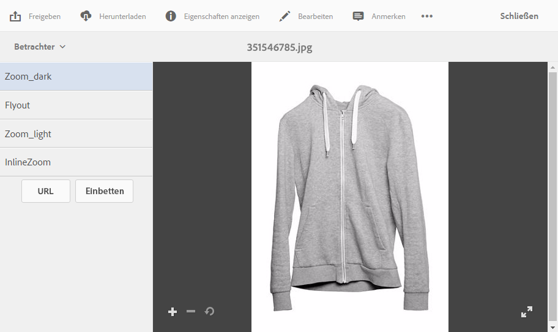

# Anwenden von Dynamic Media-Viewer-Vorgaben {#applying-viewer-presets}

Eine Viewer-Vorgabe ist eine Sammlung aus Einstellungen, die bestimmen, wie Benutzer Rich-Media-Assets auf ihren Computer-Bildschirmen und Mobilgeräten anzeigen. Sie können alle vom Administrator erstellten Viewer-Vorgaben auf ein Asset anwenden.

Wenn Sie Administrator sind und Viewer-Vorgaben verwalten, erstellen, sortieren und löschen müssen, finden Sie die entsprechenden Informationen unter [Verwalten von Viewer-Vorgaben](managing-viewer-presets.md).

Siehe auch [Veröffentlichen von Viewer-Vorgaben](managing-viewer-presets.md#publishing-viewer-presets).

Je nach Veröffentlichungsmodus müssen Sie möglicherweise keine Viewer-Vorgaben veröffentlichen.
Informationen zu Problemen mit Viewer-Vorgaben finden Sie unter [Dynamic Media – Scene7](troubleshoot-dms7.md#viewers).

## Anwenden von Dynamic Media-Viewer-Vorgaben auf ein Asset {#applying-a-viewer-preset-to-an-asset}

1. Öffnen Sie das Asset und tippen Sie in der linken Leiste auf **[!UICONTROL Viewer]**.

   

   * Die Schaltflächen **[!UICONTROL URL]** und **[!UICONTROL Einbetten]** werden angezeigt, nachdem Sie eine Viewer-Vorgabe ausgewählt haben.
   * Das System zeigt mehrere Viewer-Vorgaben an, wenn Sie in der **[!UICONTROL Detailansicht]** eines Assets „Viewer“ auswählen. Sie können die Anzahl der angezeigten Vorgaben erhöhen. Siehe [Erhöhen der Anzahl angezeigter Viewer-Vorgaben](managing-viewer-presets.md).

1. Wählen Sie einen Viewer aus dem linken Bereich aus, um ihn wie im rechten Bereich gezeigt auf das Asset anzuwenden. Sie können auch die [URL kopieren, um sie für andere Benutzer freizugeben](linking-urls-to-yourwebapplication.md).

## Abrufen von Viewer-Vorgaben-URLs {#obtaining-viewer-preset-urls}

Informationen zum Abrufen der URLs für Viewer-Vorgaben finden Sie unter [Verknüpfen von URLs mit Ihrer Web-Anwendung](linking-urls-to-yourwebapplication.md).
