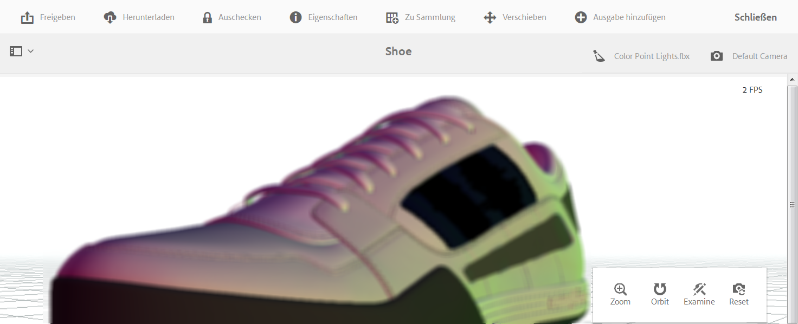
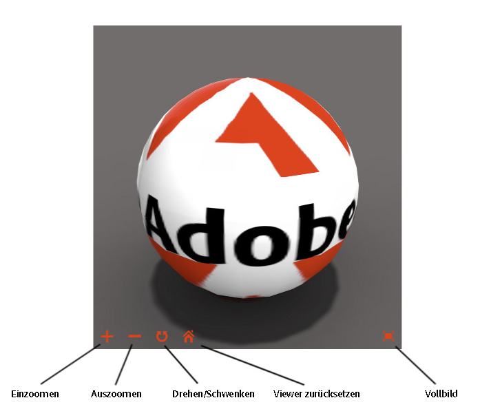

# Anzeigen von 3D-Assets {#viewing-d-assets}

>[!IMPORTANT]
>
>AEM 3D in AEM 6.4 wird nicht mehr unterstützt. Adobe empfiehlt, die Funktion für 3D-Elemente in [AEM als Cloud Service](https://experienceleague.adobe.com/docs/experience-manager-cloud-service/assets/dynamicmedia/assets-3d.html#dynamicmedia) oder [AEM 6.5.3 oder höher zu verwenden.](https://experienceleague.adobe.com/docs/experience-manager-65/assets/dynamic/assets-3d.html#dynamic) zur Ansicht von 3D-Assets.

In diesem Dokument wird beschrieben, wie Sie 3D-Assets in den Asset-Details anzeigen können. Außerdem wird beschrieben, wie Sie Assets anzeigen können, die sich in der 3D-Komponente in Sites befinden.

## Anzeigen von 3D-Assets in der Asset-Detailseite {#viewing-d-assets-in-the-asset-details-page}

Der interaktive 3D-Viewer ist auf der Seite „Asset-Details“ in AEM verfügbar. Der Viewer bietet unter anderem eine Reihe interaktiver Kamera-Steuerelemente, mit denen Sie die Kamera um das 3D-Asset drehen sowie Zoom- und Schwenkvorgänge durchführen können.

Neben den Standardbühnen können Sie in AEM 3D auch Bühnen verwenden, die in einer Drittanbieteranwendung erstellt und in AEM hochgeladen wurden.

Siehe [Informationen zu Bühnen in AEM 3D](about-the-use-of-stages-in-aem-3d.md).

>[!NOTE]
>
>Um ein 3D-Asset anzuzeigen, muss der Browser Ihres Geräts oder Desktops WebGL-fähig sein. Außerdem muss die zugrunde liegende Grafikhardware über ausreichend Kapazität und Speicherplatz verfügen, um Modelle der gewünschten Größe und Komplexität rendern zu können. Bestimmte Vorschaufunktionen, etwa Schlagschatten, sind nicht in allen Browsern umsetzbar.

### Leistungsaspekte bei der Anzeige von 3D-Assets  {#performance-considerations-when-you-view-d-assets}

Wie schnell ein 3D-Asset auf der Seite „Asset-Details“ geöffnet wird, hängt u. a. von den folgenden Faktoren abhängt:

* Bandbreite und Latenz zum Server.
* Modellgröße (Anzahl der Flächen).
* Anzahl und Größe der Maps.
* Komplexität der Bühnendatei. Beispielsweise die Größe des IBL-Bildes.

Wenn Sie die Kamera interaktiv bearbeiten, muss darüber hinaus die Kapazität des Client-Computers – etwa Workstation, Notebook oder Mobilgerät mit Touch-Funktion – berücksichtigt werden. Ein relativ leistungsfähiges System mit guten Grafikfähigkeiten unterstützt eine weichere, angenehmere interaktive 3D-Anzeige.

**So zeigen Sie 3D-Assets an**:

1. Laden Sie 3D-Assets in AEM hoch.

   Siehe [Informationen zum Hochladen und Verarbeiten von 3D-Assets in AEM](upload-processing-3d-assets.md).

1. Tippen Sie von AEM auf der Seite **[!UICONTROL Navigation]** auf **[!UICONTROL Assets]**.
1. Tippen Sie oben rechts auf der Seite in der Dropdown-Liste **[!UICONTROL Ansicht]** auf **[!UICONTROL Kartenansicht]**.
1. Navigieren Sie zu einem 3D-Asset, das Sie anzeigen möchten.
1. Tippen Sie auf die Karte des 3D-Assets, um das Asset auf der Seite „Asset-Details“ zu öffnen.
1. Führen Sie einen der folgenden Schritte aus:

   * Testen Sie mit der Palette der Kamerasteuerung in der rechten unteren Ecke der Seite „Asset-Details“ verschiedene Ansichten des Assets.

      Der Zoomfaktor und die Perspektive eines 3D-Assets lassen sich auch auf Eingabegeräten ohne Touchfunktion oder Mausrad ändern, beispielsweise mit der klassischen Apple-Maustaste. Sie können die Aktion ausführen, indem Sie die `SHIFT`Taste drücken und gedrückt halten, während Sie die Maustaste drücken und nach oben oder unten ziehen.

      Wenn Sie ein Touchpad auf einem typischen Notebook verwenden, lässt sich das Zoom- oder Perspektiveverhalten mit zwei Fingern häufig schwer steuern. In solchen Fällen können Sie die Taste `SHIFT`während der Aktion gedrückt halten. Dadurch wird die Geschwindigkeit der Pinch-Geste reduziert und es ist einfacher, den exakten Zoomfaktor oder die exakte Perspektive einzustellen. Alternativ können Sie einen Finger nach oben oder unten ziehen, während die `SHIFT`Taste gedrückt wird, um das Zoom- oder Perspektivverhalten zu beeinflussen.
   <table> 
    <tbody> 
      <tr> 
      <td><strong>Name der Camera Control</strong>  </td> 
      <td><strong>Beschreibung</strong></td> 
      </tr> 
      <tr> 
      <td>
Zoom
 
oder
 
Persp
 </td> 
      <td>
Tippen oder klicken Sie auf , um zwischen den Modi "Zoom"und "Perspektive"zu wechseln.
 
Oder drücken Sie während der Aktion die <code>ALT/OPTION</code>-Taste und halten Sie sie gedrückt, um vorübergehend in den perspektivischen Modus zu wechseln.   Lassen Sie die Taste los, um in den Zoom-Modus zurückzukehren.
 
      <ul> 
      <li><strong>Zoom</strong>-Dolly-Ein- und Auszoomen-Verhalten, das die Kamera näher oder weiter weg von dem   angesehenen Asset bewegt. Zoom ist das Standardverhalten für das Mausrad (falls verfügbar), für Pinch-Gesten mit zwei Fingern auf Mobilgeräten oder dann, wenn Sie bei gedrückter Umschalttaste mit der linken Maustaste nach oben oder unten ziehen.</li> 
      <li><strong>Perspektive</strong>-Ändert die Brennweite (auch als "Ansicht-Feld"bezeichnet) der Kamera, wobei die relative Größe des Assets in der Ansicht beibehalten wird. Perspektive ist ein alternatives Verhalten für das Mausrad (falls verfügbar), für Pinch-Gesten mit zwei Fingern auf Mobilgeräten oder dann, wenn Sie bei gedrückter Umschalttaste mit der linken Maustaste nach oben oder unten ziehen.</li> 
      </ul> </td> 
      </tr> 
      <tr> 
      <td>
Orbit
 
oder
 
Schwenken
 </td> 
      <td>
Tippen oder klicken Sie auf , um zwischen dem Umlaufmodus und dem Schwenken zu wechseln.
 
Oder halten Sie die <code>ALT/OPTION</code>-Taste während der Aktion gedrückt, um vorübergehend zum Schwenken-Modus zu wechseln. Lassen Sie die Taste los, um in den Orbit-Modus zurückzukehren.
 
      <ul> 
      <li><strong>Orbit</strong>: Verschiebt die Betrachtungskamera auf eine Kugel, die auf einem Punkt der Zielgruppe zentriert ist, der sich in der Mitte des 3D-Assets befindet, ist standardmäßig eingestellt. Orbit ist das Standardverhalten beim Ziehen mit der linken Maustaste oder dem Ziehen mit Touch auf Mobilgeräten.</li> 
      <li><strong>Schwenken</strong>-Verschiebt die Kamera in der Betrachtungsebene. Der Zielpunkt wird entsprechend verschoben, sodass die Kamera in nachfolgenden Orbit-Vorgängen um einen neuen Zielpunkt bewegt wird. Schwenken ist ein alternatives Verhalten für das Ziehen mit der linken Maustaste und das Ziehen mit einem Touch.</li> 
      </ul> </td> 
      </tr> 
      <tr> 
      <td>
Untersuchen
 
oder
 
Target
 </td> 
      <td>
Tippen oder klicken Sie auf , um zwischen dem Prüfungs- und dem Zielgruppe-Modus zu wechseln.
 
      <ul> 
      <li><strong>Überprüfen Sie</strong>, ob Sie auf tippen oder klicken, um in den Zielgruppe-Modus zu wechseln.</li> 
      <li><strong>Zielgruppe</strong>-Tippen oder klicken Sie auf einen Punkt an einer beliebigen Stelle des 3D-Assets, um die Ansicht auf diesem Teil des Assets zu zentrieren.  Der neue Zielpunkt wird für Drehungsaktionen verwendet.</li> 
      </ul> </td> 
      </tr> 
      <tr> 
      <td>Zurücksetzen</td> 
      <td>Tippen oder klicken Sie auf , um die Zielgruppe der Ansicht in der Mitte des Modells wiederherzustellen. Mit Zurücksetzen wird die Kamera auch näher oder weiter weg verschoben, um das Asset in seiner Gesamtheit und in einer angemessenen Anzeigegröße anzuzeigen. </td> 
      </tr> 
    </tbody> 
    </table>

   * Tippen Sie in der rechten oberen Ecke der Seite mit den Asset-Details auf das Symbol **[!UICONTROL Stage Selector]**. Wählen Sie eine Bühne mit dem Hintergrund und der Beleuchtung, die Sie auf das 3D-Asset anwenden möchten.

   

   Die Stufen liefern den Hintergrund, die Grundebene und die Beleuchtung, in der das 3D-Umgebung angezeigt wird.

   Siehe [Informationen zu Bühnen in AEM 3D](about-the-use-of-stages-in-aem-3d.md).

   * Tippen Sie rechts oben auf der Seite mit den Asset-Details auf das Symbol **[!UICONTROL Kameraselektor]** und wählen Sie dann eine Ansicht aus, die Sie auf das 3D-Asset anwenden möchten.

   

   In Bühnen werden häufig vordefinierte Kameras bereitgestellt. Sie können die aktuelle Kamera erneut auswählen, um die vordefinierten Einstellungen wiederherzustellen.

   Siehe [Informationen zu Bühnen in AEM 3D](about-the-use-of-stages-in-aem-3d.md).

1. Tippen Sie oben rechts auf der Seite auf **[!UICONTROL Speichern]**.
1. Führen Sie einen der folgenden Schritte aus:

   * Rendern Sie das 3D-Asset.

      Weitere Informationen finden Sie unter [Rendern von 3D-Assets](rendering-3d-assets.md).

   * Tippen Sie in der linken oberen Ecke der Seite auf **[!UICONTROL Schließen]**, um zur Seite „Assets“ zurückzukehren.

## Anzeigen von 3D-Assets in der Sites-3D-Komponente {#viewing-d-assets-in-the-sites-d-component}

>[!NOTE]
>
>Dieser Abschnitt gilt nur für den klassischen WebGL-Viewer, der für andere 3D-Asset-Typen als Adobe Dimension verwendet wird.

Abhängig vom Gerätetyp gibt es verschiedene Möglichkeiten, auf die 3D-Komponentenfunktionen zuzugreifen.

Weitere Informationen finden Sie in den folgenden Themen:

* [Touchscreen-Geräte](#touchscreen-devices)
* [Touchpad-Geräte](#touchpad-devices)
* [Maus- und Trackball-Geräte](#mouse-and-trackball-devices)

Siehe auch [Anzeigen einer Vorschau einer Webseite mit einer 3D-Komponente](using-the-3d-sites-component.md#previewing-a-web-page-that-has-a-d-component).

### Touchscreen-Geräte {#touchscreen-devices}

So arbeiten Sie auf Touchscreen-Geräten mit 3D-Komponenten:

1. Ziehen Sie mit einem Finger oder wischen Sie, um den Blickwinkel („Kamera“) um das Objekt herumzuschwenken („drehen“). Sie können das Objekt aus einer beliebigen Richtung anzeigen.

1. Führen Sie mit zwei Fingern eine Pinch-Geste aus, um die Kamera näher an das Objekt oder weiter weg zu bewegen. Diese Aktion ähnelt dem Zoom und bietet Ihnen die Möglichkeit, Details des Objekts zu betrachten. Alternativ können Sie die Symbole „+“ bzw. „-“ drücken und halten, um die Kamera auf das Objekt zu- oder davon wegzubewegen.

1. Ziehen Sie mit zwei Fingern, um einen Bildschwenk mit der Kamera auszuführen. Mit dieser Aktion wird die Kamera seitlich versetzt, sodass Sie sich im eingezoomten Modus verschiedene Teile des Objekts ansehen können. Alternativ können Sie auch auf die Schaltfläche **[!UICONTROL Umschalten/Schwenken]** tippen, um in den Schwenk-Modus zu wechseln, und dann mit einem Finger ziehen, um die Kamera zu schwenken. Tippen Sie auf die Schaltfläche **[!UICONTROL Umschalten/Schwenken]**, um zum Modus **[!UICONTROL Umlaufbahn]** zurückzukehren.

1. Tippen Sie auf **[!UICONTROL Viewer zurücksetzen]**, um die Kamera zurückzusetzen. Mit dieser Aktion wird das Objekt erneut in der Vollansicht angezeigt und die automatische Drehung fortgesetzt, sofern sie aktiviert ist.

1. Tippen Sie auf **[!UICONTROL Vollbild]**, um in den Vollbildmodus zu wechseln (sofern vom Gerät unterstützt). Tippen Sie erneut auf **[!UICONTROL Vollbild]**, um mit dem 3D-Viewer in den Seiteneinbettungsmodus zurückzukehren.

### Touchpad-Geräte {#touchpad-devices}

So arbeiten Sie auf Touchpad-Geräten mit 3D-Komponenten:

1. Ziehen Sie mit einem Finger, während Sie die Touchpad-Taste (links) gedrückt halten, um den Blickwinkel („Kamera“) um das Objekt zu schwenken („drehen“) Sie können das Objekt aus einer beliebigen Richtung anzeigen.

1. Ziehen Sie mit zwei Fingern nach unten bzw. nach oben (Touchpad-Tasten oben), um die Kamera auf das Objekt zu- bzw. davon wegzubewegen. Diese Aktion ähnelt dem Zoom und ermöglicht es Ihnen, Details des Objekts zu betrachten. Alternativ können Sie auch auf die Schaltflächen **[!UICONTROL Vergrößern]** oder **[!UICONTROL Auszoomen]** klicken und die Kamera weiter weg vom Objekt verschieben.

1. Verwenden Sie einen Zeiger, während Sie die Taste **ALT/option** und die Taste (links) für das Touchpad gedrückt halten, um die Kamera zu schwenken. Mit dieser Aktion wird die Kamera seitlich versetzt, sodass Sie sich im eingezoomten Modus verschiedene Teile des Objekts ansehen können. Alternativ können Sie auch auf die Schaltfläche **[!UICONTROL Umschalten/Schwenken]** klicken, um in den Modus **[!UICONTROL Schwenken]** umzuschalten, und dann mit einem Finger ziehen, während Sie die (linke) Taste gedrückt halten, um die Kamera zu schwenken. Klicken Sie erneut auf die Schaltfläche **[!UICONTROL Umschalten/Schwenken]**, um zum Modus **[!UICONTROL Umlaufbahn]** zurückzukehren.

1. Klicken Sie auf **[!UICONTROL Viewer zurücksetzen]**, um die Kamera zurückzusetzen. Mit dieser Aktion wird das Objekt erneut in der Vollansicht angezeigt und die automatische Drehung fortgesetzt, sofern sie aktiviert ist.

1. Klicken Sie auf **[!UICONTROL Vollbild]**, um in den Vollbildmodus zu wechseln. Verwenden Sie die Taste **Escape** auf Ihrer Tastatur oder klicken Sie erneut auf **[!UICONTROL Vollbild]**, um den 3D-Viewer im seiteneingebetteten Modus wiederherzustellen.

### Maus- und Trackball-Geräte {#mouse-and-trackball-devices}

So arbeiten Sie auf Maus- und Trackball-Geräten mit 3D-Komponenten:

1. Ziehen Sie mit einem Finger, während Sie die linke Maustaste gedrückt halten, um den Blickwinkel („Kamera“) um das Objekt zu schwenken („drehen“). Sie können das Objekt aus einer beliebigen Richtung anzeigen.

1. Nutzen Sie das Mausrad, um die Kamera näher an das Objekt oder weiter weg zu bewegen. Dies ähnelt dem Zoom und bietet Ihnen die Möglichkeit, Details des Objekts zu betrachten. Alternativ können Sie auch auf die Schaltflächen **[!UICONTROL Vergrößern]** oder **[!UICONTROL Auszoomen]** klicken und die Kamera weiter weg vom Objekt verschieben.

1. Ziehen Sie, während Sie die **ALT/option**-Taste und die linke Maustaste gedrückt halten, um die Kamera zu schwenken. Dadurch wird die Kamera seitlich versetzt und ermöglicht es Ihnen, sich im eingezoomten Modus verschiedene Teile des Objekts anzusehen. Alternativ können Sie auch auf die Schaltfläche **[!UICONTROL Umschalten/Schwenken]** klicken, um in den Modus **[!UICONTROL Schwenken]** umzuschalten, und dann mit der linken Maustaste ziehen, um die Kamera zu schwenken. Klicken Sie erneut auf **[!UICONTROL Umschalten/Schwenken]**, um zum Modus **[!UICONTROL Umlaufbahn]** zurückzukehren.
1. Klicken Sie auf **[!UICONTROL Viewer zurücksetzen]**, um die Kamera zurückzusetzen. Mit dieser Aktion wird das Objekt erneut in der Vollansicht angezeigt und die automatische Drehung fortgesetzt, sofern sie aktiviert ist.
1. Klicken Sie auf **[!UICONTROL Vollbild]**, um in den Vollbildmodus zu wechseln. Verwenden Sie die Taste **[!UICONTROL Escape]** auf Ihrer Tastatur oder klicken Sie erneut auf **[!UICONTROL Vollbild]**, um den 3D-Viewer im seiteneingebetteten Modus wiederherzustellen.
