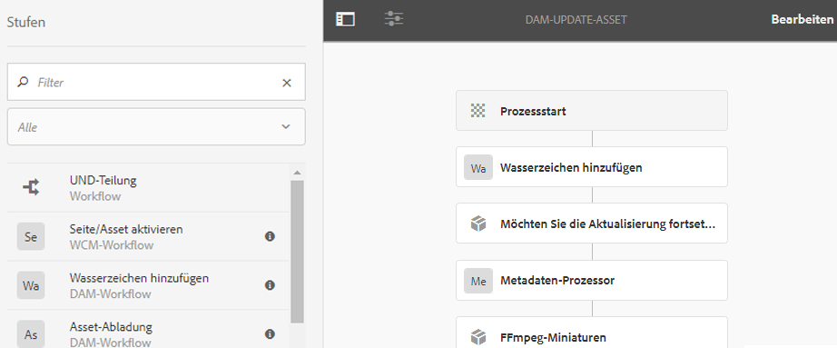

# Digitale Assets mit Wasserzeichen versehen {#watermarking}

[!DNL Adobe Experience Manager Assets] ermöglicht das Hinzufügen eines digitalen Wasserzeichens zu Assets, mit dem Benutzer die Authentizität und das Urheberrecht der Assets überprüfen können. [!DNL Experience Manager Assets] unterstützt die Verwendung von Text als Wasserzeichen auf PNG- und JPEG-Dateien.

Mit Adobe Experience Manager (AEM) Assets können Sie Bildern ein digitales Wasserzeichen hinzufügen, mit dem Benutzer die Authentizität und das Urheberrecht der Assets überprüfen können. AEM Assets unterstützt die Verwendung von Text als Wasserzeichen auf PNG- und JPEG-Dateien.

Um Wasserzeichen auf Assets anwenden zu können, fügen Sie den Schritt &quot;Wasserzeichen&quot;im Workflow [!UICONTROL DAM-Update-Asset] hinzu.

1. Rufen Sie die [!DNL Experience Manager]-Benutzeroberfläche auf und navigieren Sie zu **[!UICONTROL Tools]** > **[!UICONTROL Workflow]** > **[!UICONTROL Modelle]**.
1. Wählen Sie auf der Seite der Workflow-Modelle den Workflow **[!UICONTROL DAM-Update-Asset]** aus und klicken Sie auf **[!UICONTROL Bearbeiten]**.

1. Ziehen Sie aus dem Seitenbedienfeld den Schritt **[!UICONTROL Wasserzeichen]** hinzufügen und fügen Sie ihn zum Workflow [!UICONTROL DAM-Update-Asset] hinzu.

   

   >[!NOTE]
   >
   >Platzieren Sie den Schritt [!UICONTROL Wasserzeichen] an einer beliebigen Stelle vor dem Schritt [!UICONTROL Prozessminiatur] .

1. Öffnen Sie den Schritt **[!UICONTROL Wasserzeichen hinzufügen]**, um seine Eigenschaften anzuzeigen.
1. Geben Sie auf die Registerkarte **[!UICONTROL Argumente]** gültige Werte in den verschiedenen Feldern an: „Text“, „Schriftart“, „Farbe“, „Position“, „Ausrichtung“ usw. Um die Änderungen zu bestätigen, klicken Sie auf **[!UICONTROL Fertig]**.

   

1. Speichern Sie den Workflow **[!UICONTROL DAM-Update-Asset]** mit dem Schritt „Wasserzeichen“.
1. Laden Sie in der AEM-Benutzeroberfläche ein Beispiel-Asset hoch. Das Wasserzeichen wird mit der Schriftgröße, Farbe usw. an der Position angezeigt, die Sie in den oben genannten Schritten konfiguriert haben.

Wenn Sie PDF-Dokumente programmatisch oder mit dynamischen Informationen mit Wasserzeichen versehen möchten, sollten Sie das Angebot [AEM Document Services](/help/forms/using/overview-aem-document-services.md) in Erwägung ziehen.

## Tipps und Einschränkungen {#tips-limitations}

* Es werden nur textbasierte Wasserzeichen unterstützt. Bilder werden nicht als Wasserzeichen verwendet, auch wenn Sie Bilder beim Erstellen des [!UICONTROL Wasserzeichenprozesses hinzufügen] hochladen können.
* Nur PNG- und JPEG-Dateien werden als Wasserzeichen unterstützt. Andere Asset-Formate sind nicht mit Wasserzeichen versehen.
