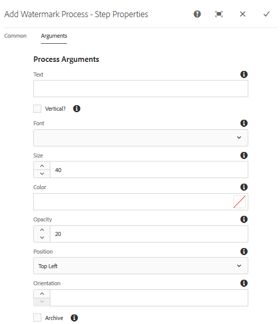

# Versehen von digitalen Assets mit Wasserzeichen {#watermarking}

>[!CAUTION]
>
>AEM 6.4 hat das Ende der erweiterten Unterstützung erreicht und diese Dokumentation wird nicht mehr aktualisiert. Weitere Informationen finden Sie in unserer [technische Unterstützung](https://helpx.adobe.com/de/support/programs/eol-matrix.html). Unterstützte Versionen suchen [here](https://experienceleague.adobe.com/docs/?lang=de).

[!DNL Adobe Experience Manager Assets] ermöglicht das Hinzufügen eines digitalen Wasserzeichens zu Assets, mit dem Benutzer die Authentizität und das Urheberrecht der Assets überprüfen können. [!DNL Experience Manager Assets] unterstützt die Verwendung von Text als Wasserzeichen auf PNG- und JPEG-Dateien.

Mit Adobe Experience Manager Assets können Sie Bildern ein digitales Wasserzeichen hinzufügen, mit dem Benutzer die Authentizität und das Urheberrecht der Assets überprüfen können. [!DNL Experience Manager] Assets unterstützt die Verwendung von Text als Wasserzeichen auf PNG- und JPEG-Dateien.

Um Wasserzeichen auf Assets anwenden zu können, fügen Sie den Schritt „Wasserzeichen“ im Workflow [!UICONTROL DAM-Update-Asset] hinzu.

1. Öffnen Sie die [!DNL Experience Manager]-Benutzeroberfläche und navigieren Sie zu **[!UICONTROL Tools]** > **[!UICONTROL Workflow]** > **[!UICONTROL Modelle]**.
1. Wählen Sie auf der Seite der Workflow-Modelle den Workflow **[!UICONTROL DAM-Update-Asset]** aus und klicken Sie auf **[!UICONTROL Bearbeiten]**.

1. Ziehen Sie aus dem seitlichen Bedienfeld die **[!UICONTROL Wasserzeichen hinzufügen]** und fügen Sie ihn dem [!UICONTROL DAM-Update-Asset] Arbeitsablauf.

   

   >[!NOTE]
   >
   >Ordnen Sie den Schritt [!UICONTROL Wasserzeichen hinzufügen] an beliebiger Stelle vor dem Schritt [!UICONTROL Miniaturansichten verarbeiten] ein.

1. Öffnen Sie die **[!UICONTROL Wasserzeichen hinzufügen]** Schritt zum Anzeigen der Eigenschaften.
1. Im **[!UICONTROL Argumente]** -Registerkarte gültige Werte in den verschiedenen Feldern angeben, einschließlich Text, Schriftart, Größe, Farbe, Position, Ausrichtung usw. Um die Änderungen zu bestätigen, klicken Sie auf **[!UICONTROL Fertig]**.

   

1. Speichern Sie den Workflow **[!UICONTROL DAM-Update-Asset]** mit dem Schritt „Wasserzeichen“.
1. Laden Sie über die [!DNL Experience Manager]-Benutzeroberfläche ein Beispiel-Asset hoch. Das Wasserzeichen wird mit der Schriftgröße, Farbe usw. an der Position angezeigt, die Sie in den oben genannten Schritten konfiguriert haben.

Wenn Sie PDF-Dokumente programmgesteuert oder mit dynamischen Informationen mit Wasserzeichen versehen möchten, sollten Sie [[!DNL Experience Manager]  Document Services](/help/forms/using/overview-aem-document-services.md) nutzen.

## Tipps und Einschränkungen {#tips-limitations}

* Es werden nur textbasierte Wasserzeichen unterstützt. Bilder werden nicht als Wasserzeichen verwendet, auch wenn Sie beim Erstellen des Prozesses [!UICONTROL Wasserzeichen hinzufügen] Bilder hochladen können.
* Nur PNG- und JPEG-Dateien können mit Wasserzeichen versehen werden. Andere Asset-Formate werden nicht mit Wasserzeichen versehen.
