# Arbeiten mit Selektoren {#working-with-selectors}

Wenn Sie mit einem interaktiven Bild, einem interaktiven Video oder einem Karussell-Banner arbeiten, wählen Sie Elemente aus und wählen Sie Websites und Produkte für Hotspots und Imagemaps aus, mit denen Sie eine Verknüpfung erstellen möchten. Beim Arbeiten mit Bildsätzen, Rotationssets und Multimedia-Sets wählen Sie auch Assets mit der Asset-Auswahl aus.

Dieses Thema befasst sich damit, wie die Produkt-, Site- und Asset-Selektoren verwendet werden, einschließlich der Möglichkeit, in den Selektoren zu suchen, zu filtern und zu sortieren.

Sie greifen auf die Selektoren beim Erstellen von Karussell-Sets, beim Hinzufügen von Hotspots und Imagemaps und beim Erstellen interaktiver Videos und Bilder zu.

In diesem Karussell-Banner verwenden Sie beispielsweise die Produktauswahl, wenn Sie einen Hotspot oder eine Imagemap mit einer Quickview-Seite verknüpfen. Verwenden Sie die Site-Auswahl, wenn Sie einen Hotspot oder eine Imagemap mit einem Hyperlink verknüpfen. Verwenden Sie beim Erstellen einer neuen Folie die Asset-Auswahl.

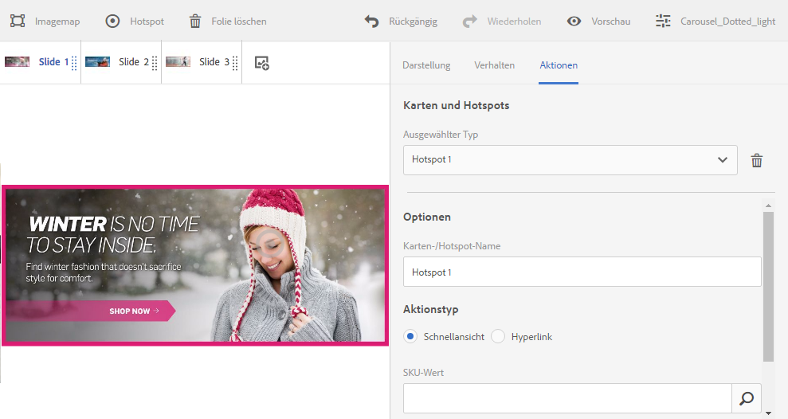

Wenn Sie auswählen (statt dies manuell einzugeben), wo sich Hotspots oder Imagemaps befinden sollen, verwenden Sie den Selektor. Die Site-Auswahl funktioniert nur, wenn Sie AEM Sites-Kunde sind. Der Produktselektor erfordert außerdem AEM Commerce.

## Selecting products {#selecting-products}

Verwenden Sie die Produktauswahl, um ein Produkt auszuwählen, wenn Sie einen Hotspot oder eine Imagemap erstellen möchten, um einem bestimmten Produkt in Ihrem Produktkatalog eine QuickView-Funktion bereitzustellen.

1. Navigieren Sie zum Karussellset, zum interaktiven Bild oder zum interaktiven Video und tippen Sie auf die Registerkarte **[!UICONTROL Aktionen]** (nur verfügbar, wenn Sie einen Hotspot oder eine Image Map definiert haben).

   The Product selector is in the **[!UICONTROL Action Type** area.

   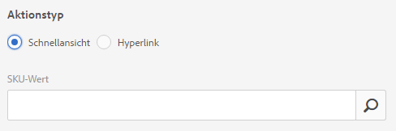

1. Tap the **[!UICONTROL Product Selector]** icon (magnifying glass) and navigate to a product in the catalog.

   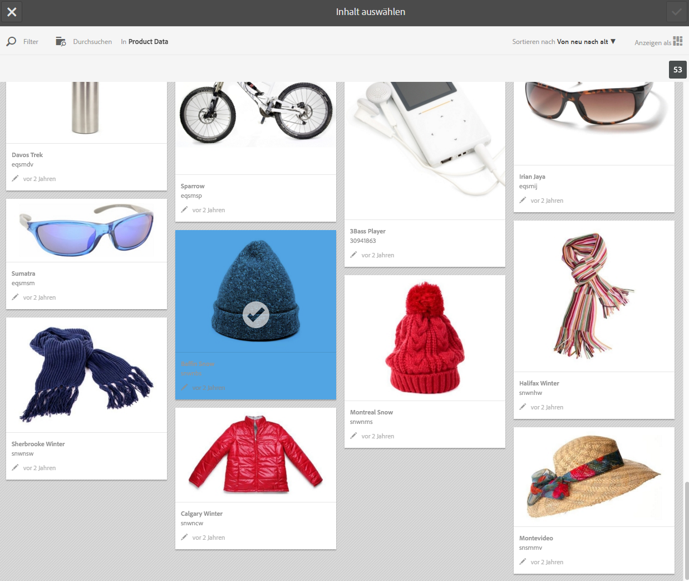

   You can also filter by keyword or tag by tapping **[!UICONTROL Filter]** and entering keywords, or selecting tags, or both.

   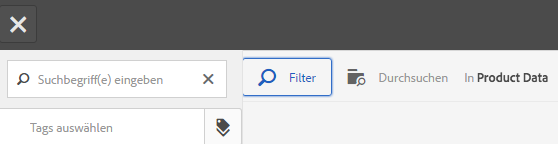

   You can change where AEM browses for product data by tapping **[!UICONTROL Browse]** and navigating to another folder.

   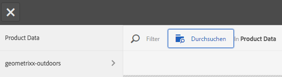

   Tap **[!UICONTROL Sort]** by to change whether AEM sorts by newest to oldest or oldest to newest.

   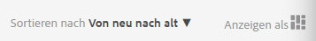

   Tippen Sie auf **[!UICONTROL Ansicht als]**, um die Ansicht der Produkte zu ändern – entweder **[!UICONTROL Listenansicht]** oder **[!UICONTROL Kartenansicht]**.

   

1. Nachdem das Produkt ausgewählt ist, wird das Feld mit dem Produktminiaturbild und dem Namen ausgefüllt.

   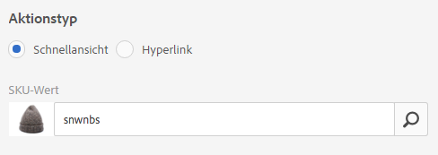

1. When in **[!UICONTROL Preview]** mode, you can tap the hotspot or image map, and see what the Quickview looks like.

   

## Auswählen von Sites {#selecting-sites}

Verwenden Sie den Site-Selektor, um eine Webseite auszuwählen, wenn Sie einen Hotspot oder eine Imagemap mit einer Website verknüpfen möchten, die in AEM Sites verwaltet wird.

1. Navigieren Sie zum Karussellset, zum interaktiven Bild oder zum interaktiven Video und tippen Sie auf die Registerkarte **[!UICONTROL Aktionen]** (nur verfügbar, wenn Sie einen Hotspot oder eine Image Map definiert haben).

   Die Site-Auswahl befindet sich im Bereich **[!UICONTROL Aktionstyp]**.

   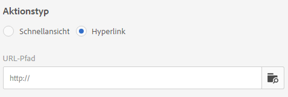

1. Tippen Sie auf das Symbol **[!UICONTROL Site-Auswahl]** (Ordner mit Lupe) und navigieren Sie zu einer Seite in Ihren AEM Sites, mit der Sie den Hotspot oder die Image Map verknüpfen möchten.

   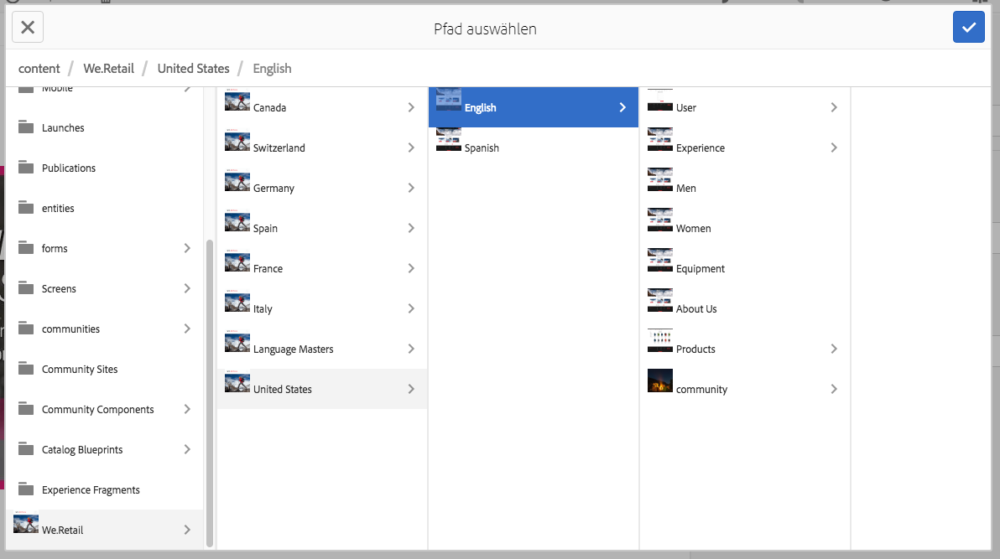

1. Nachdem die Site ausgewählt ist, wird das Feld mit dem Pfad ausgefüllt.

   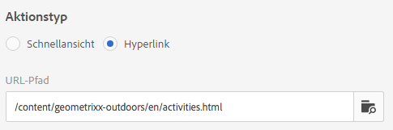

1. When in **[!UICONTROL Preview]** mode if you tap the hotspot or image map, you navigate to the AEM site page you specified.

## Wählen von Assets {#selecting-assets}

Verwenden Sie diese Auswahl, um Bilder für ein Karussell-Banner, ein interaktives Video, Bildsätze, gemischte Mediensets und Rotationssets auszuwählen. In interactive Video, the asset selector is available when you tap **[!UICONTROL Select Assets]** in the **[!UICONTROL Content]** tab. In Karussellsätzen ist die Asset-Auswahl verfügbar, wenn Sie eine neue Folie erstellen. In Bildsätzen, gemischten Mediensets und Rotationssets ist die Asset-Auswahl verfügbar, wenn Sie einen neuen Bildsatz, ein gemischtes Medienset oder ein neues Rotationsset erstellen.

See also [Asset Picker](asset-selector.md) for more information.

1. Navigieren Sie zum Karussellsatz und erstellen Sie eine neue Folie. Or, navigate to the Interactive Video, go the **[!UICONTROL Content]** tab and select assets. Sie können auch ein gemischtes Medienset, einen Bildsatz oder ein Rotationsset erstellen.
1. Tippen Sie auf das Symbol **[!UICONTROL Asset-Auswahl]** (Ordner mit Lupe) und navigieren Sie zu einem Asset.

   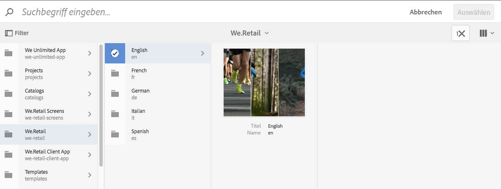

   You can also filter by keyword or tag by tapping **[!UICONTROL Filter]** and entering keywords, or adding criteria, or both.

   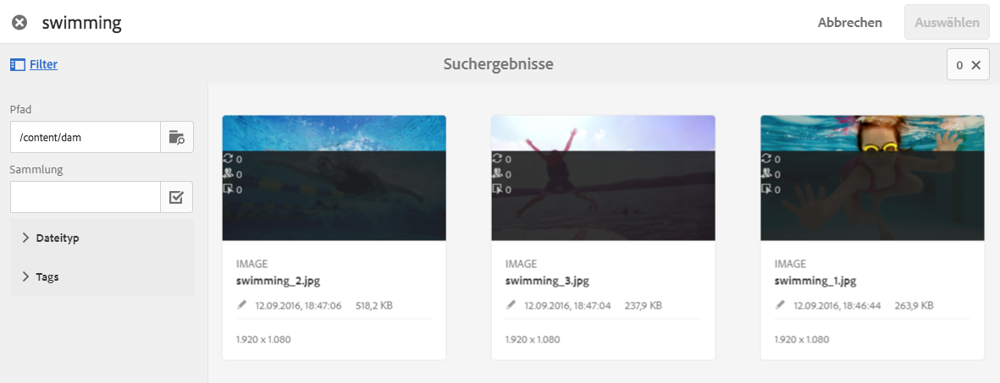

   Sie können den Ordner, in dem AEM nach Assets suchen soll, angeben, indem Sie im Feld **[!UICONTROL Pfad]** zu einem anderen Ordner navigieren.

   Tap **[!UICONTROL Collection]** to only search for assets within collections.

   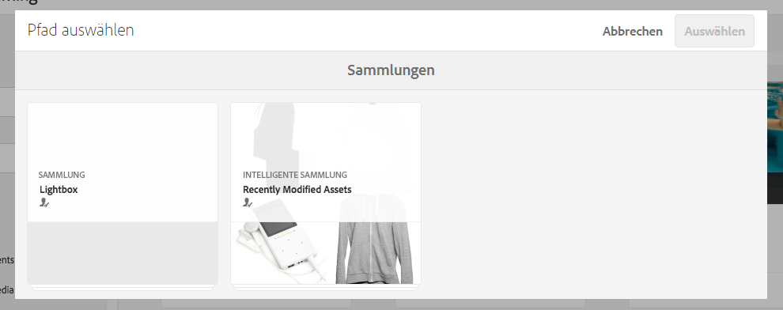

   Tippen Sie auf **[!UICONTROL Anzeigen als]**, um die Ansicht für Ihre Produkte zu ändern. Wählen Sie zwischen **[!UICONTROL Listenansicht]**, **[!UICONTROL Spaltenansicht]**, oder **[!UICONTROL Kartenansicht]**.

   

1. Tippen Sie auf das Häkchen, um das Asset auszuwählen. Das Asset wird angezeigt.

   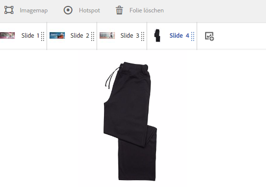

