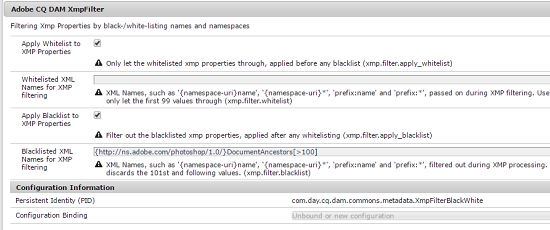

# XMP-Writeback in Ausgabedarstellungen {#xmp-writeback-to-renditions}

Diese XMP Funktion für die Rückgabe von Metadaten in [!DNL Adobe Experience Manager Assets] repliziert die Änderungen an den Darstellungen des ursprünglichen Assets. Wenn Sie die Metadaten für ein Asset aus Assets ändern oder das Asset hochladen, werden die Änderungen zunächst im Metadaten-Knoten in der Asset-Hierarchie gespeichert.

Mit der XMP-Writeback-Funktion können Sie die Metadatenänderungen in alle oder nur in bestimmte Ausgabedarstellungen des Assets kopieren. Die Funktion schreibt nur die Metadateneigenschaften zurück, die den Namensraum `jcr` verwenden, d. h., eine Eigenschaft mit dem Namen `dc:title` wird zurückgeschrieben, eine Eigenschaft mit dem Namen `mytitle` jedoch nicht.

Stellen Sie sich vor, Sie ändern die Eigenschaft [!UICONTROL Titel] des Assets `Classic Leather` in `Nylon`.

In diesem Fall speichert AEM Assets die Änderungen an der Eigenschaft **[!UICONTROL Titel]** im Parameter `dc:title` der in der Elementhierarchie gespeicherten Asset-Metadaten.

[!DNL Experience Manager Assets] propagiert jedoch nicht automatisch Änderungen der Metadaten an den Darstellungen eines Assets. Siehe [Aktivieren XMP Schreibens](#enabling-xmp-writeback).

## Aktivieren XMP Schreibback {#enabling-xmp-writeback}

Um Metadatenänderungen beim Hochladen des Assets in die Ausgabeformate zu propagieren, bearbeiten Sie die Konfiguration **Adobe CQ DAM Rendition Maker** in Configuration Manager.

1. Öffnen Sie Configuration Manager von `https://[aem_server]:[port]/system/console/configMgr`.
1. Öffnen Sie die Konfiguration **[!UICONTROL Adobe CQ DAM Rendition Maker]**.
1. Wählen Sie die Option **[!UICONTROL XMP propagieren]** aus und speichern Sie die Änderungen.

   

## Aktivieren XMP Schreibback für bestimmte Darstellungen {#enabling-xmp-writeback-for-specific-renditions}

Damit die XMP-Writeback-Funktion die Metadatenänderungen in die Ausgabeformate kopieren kann, müssen Sie diese Ausgabeformate im Workflow-Schritt „XMP-Writeback-Vorgang“ des Workflows „DAM-Metadaten-Writeback“ angeben. Standardmäßig ist dieser Schritt mit dem ursprünglichen Format konfiguriert.

Führen Sie folgende Schritte durch, damit die XMP-Writeback-Funktion Metadaten in die Ausgabeformat-Miniaturansichten „140.100.png“ und „319.319.png“ übertragen.

1. Navigieren Sie in Experience Manager zu **[!UICONTROL Tools > Workflow > Modelle]**.
1. Öffnen Sie auf der Seite [!UICONTROL Modelle] das Workflow-Modell **[!UICONTROL DAM Metadata Writeback]**.
1. Öffnen Sie auf der Eigenschaftsseite **[!UICONTROL DAM-Metadaten-Writeback]** den Schritt **[!UICONTROL XMP-Writeback-Vorgang]**.
1.  Tippen/Klicken Sie im Dialogfeld **[!UICONTROL Schritt-Eigenschaften]** auf die Registerkarte **[!UICONTROL Prozess]**.
1. Fügen Sie im Feld **[!UICONTROL Argumente]** `rendition:cq5dam.thumbnail.140.100.png,rendition:cq5dam.thumbnail.319.319.png` hinzu. Tippen/klicken Sie auf **[!UICONTROL OK]**.

   

1. Um die Pyramiden-TIFF-Darstellungen für Dynamic Media-Bilder mit den neuen Attributen zu regenerieren, fügen Sie den Schritt **[!UICONTROL Dynamic Media Process Image Assets]** zum DAM-Metadaten-Schreibvorgang hinzu.
PTIFF-Darstellungen werden nur lokal im Dynamic Media Hybrid-Modus erstellt und gespeichert. Speichern Sie den Workflow.

Die Änderungen an den Metadaten werden an die Darstellungen `thumbnail.140.100.png` und `thumbnail.319.319.png` des Assets weitergegeben, nicht an die anderen.

>[!NOTE]
>
>XMP Probleme mit der Schreibmaschine in 64-Bit Linux finden Sie unter [Aktivieren XMP Schreibback auf 64-Bit RedHat Linux](https://helpx.adobe.com/experience-manager/kb/enable-xmp-write-back-64-bit-redhat.html).
>
>Weitere Informationen zu unterstützten Plattformen finden Sie unter [XMP Voraussetzungen zum Zurückschreiben von Metadaten](/help/sites-deploying/technical-requirements.md#requirements-for-aem-assets-xmp-metadata-write-back).

## Filtern von XMP-Metadaten {#filtering-xmp-metadata}

[!DNL Experience Manager Assets] unterstützt das Filtern von Eigenschaften/Knoten in Blockierungsliste und Zulassungsliste für XMP Metadaten, die aus Asset-Binärdateien gelesen und bei der Erfassung von Assets in JCR gespeichert werden.

Bei der Filterung über eine Blockierungsliste können Sie alle XMP-Metadateneigenschaften importieren – mit Ausnahme der Eigenschaften, für die ein Ausschluss angegeben ist. Jedoch ist der Name der zu filternden Knoten für Elementtypen wie INDD-Dateien mit enormen Mengen an XMP-Metadaten (z. B. 1.000 Knoten mit 10.000 Eigenschaften) nicht immer bereits im Voraus bekannt. Wenn durch das Filtern mit einer Blockierungsliste eine große Anzahl von Assets mit vielen XMP-Metadaten importiert werden kann, kann es zu Stabilitätsproblemen bei AEM-Instanz oder -Cluster kommen, zum Beispiel zu blockierten Beobachtungswarteschlangen.

Durch Filtern von XMP-Metadaten über die Zulassungsliste wird dieses Problem behoben, indem Sie die zu importierenden XMP-Eigenschaften definieren können. Auf diese Weise werden andere/unbekannte XMP-Eigenschaften ignoriert. Aus Gründen der Abwärtskompatibilität können Sie einige dieser Eigenschaften dem Filter hinzufügen, der eine Blockierungsliste verwendet.

>[!NOTE]
>
>Die Filterung funktioniert nur für aus XMP-Quellen in Asset-Binärdateien abgeleitete Eigenschaften. Bei Eigenschaften, die aus XMP-fremden Quellen wie EXIF- und IPTC-Formaten abgeleitet wurden, funktioniert die Filterung nicht. Beispielsweise wird das Datum der Asset-Erstellung in der Eigenschaft `CreateDate` in EXIF TIFF gespeichert. AEM speichert diesen Wert im Metadatenfeld `exif:DateTimeOriginal`. Da es sich um eine andere Quelle als XMP handelt, funktioniert die Filterung nicht bei dieser Eigenschaft.

1. Öffnen Sie Configuration Manager von `https://[aem_server]:[port]/system/console/configMgr`.
1. Öffnen Sie die Konfiguration **[!UICONTROL Adobe CQ DAM XmpFilter]**.
1. Um die Filterfunktion mit einer Zulassungsliste anzuwenden, klicken Sie auf **[!UICONTROL Zulassungsliste auf XMP-Eigenschaften anwenden]** und geben Sie die Eigenschaften an, die in das Feld **[!UICONTROL Zulässige XML-Namen für XMP-Filterfunktion]** importiert werden sollen.

   

1. Um blockierte XMP nach dem Anwenden der Filterung über die Zulassungsliste zu filtern, geben Sie diese im Feld **[!UICONTROL Blockierte XML-Namen für die XMP Filterung]** an. Speichern Sie die Änderungen.

   >[!NOTE]
   >
   >Die Option **[!UICONTROL Blockierungsliste auf XMP-Eigenschaften anwenden]** ist standardmäßig ausgewählt. Mit anderen Worten, das Filtern über eine Blockierungsliste ist standardmäßig aktiviert. Um diese Filterung zu deaktivieren, deaktivieren Sie die Option **[!UICONTROL Blockierungsliste auf XMP Eigenschaften anwenden]**.
