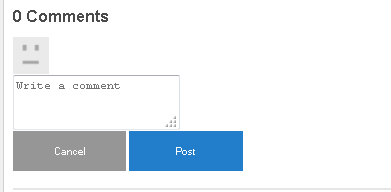

# Clientlibs hinzufügen {#add-clientlibs}

## Hinzufügen eines ClientLibraryFolder (clientlibs) {#add-a-clientlibraryfolder-clientlibs}

Erstellen Sie einen ClientLibraryFolder mit dem Namen `clientlibs`enthält das JS und CSS, die zum Rendern der Seiten Ihrer Site verwendet werden.

Die `categories`Der Eigenschaftswert, der dieser Client-Bibliothek zugewiesen wird, ist die Kennung, die verwendet wird, um diese Client-Bibliothek direkt von einer Inhaltsseite aus oder um sie in andere Client-Bibliotheken einzubetten.

1. Verwenden **[!UICONTROL CRXDE Lite]**, erweitern `/etc/designs`

1. Rechtsklick `an-scf-sandbox` und wählen Sie `Create Node`

   * Name: `clientlibs`
   * Typ: `cq:ClientLibraryFolder`

1. Klicken Sie auf **[!UICONTROL OK]**


Im **[!UICONTROL Eigenschaften]** Registerkarte für die neue `clientlibs` Knoten, geben Sie die **`categories`** Eigenschaft:

* Name:**[!UICONTROL Kategorien]**
* Typ:**[!UICONTROL String]**
* Wert: **[!UICONTROL apps.an-scf-sandbox]**
* Klicken Sie auf **[!UICONTROL Hinzufügen]**
* Klicken Sie auf **[!UICONTROL Alle speichern]**

Hinweis: dem Kategoriewert &quot;apps&quot;voranstellen. ist eine Konvention, die die &#39;owning application&#39; als im Ordner /apps, nicht /libs identifiziert.  WICHTIG: Platzhalter hinzufügen `js.txt` und `css.txt` Dateien. (Es handelt sich nicht offiziell um einen cq:ClientLibraryFolder ohne diese Ordner.)


1. Klicken Sie mit der rechten Maustaste auf **`/etc/designs/an-scf-sandbox/clientlibs`**
1. Auswählen **[!UICONTROL Datei erstellen...]**
1. Eingabe **[!UICONTROL Name]**: `css.txt`

1. Auswählen **[!UICONTROL Datei erstellen...]**
1. Eingabe **[!UICONTROL Name]**: `js.txt`

1. Klicken Sie auf **[!UICONTROL Alle speichern]**


Die erste Zeile von css.txt und js.txt identifiziert den Basisspeicherort, von dem aus die folgenden Dateilisten zu finden sind.

Versuchen Sie, den Inhalt von css.txt auf Folgendes festzulegen:

```
#base=.
 style.css
```

Erstellen Sie dann eine Datei unter clientlibs namens style.css und setzen Sie den Inhalt auf:

`body {`

`background-color: #b0c4de;`

`}`

## Einbetten von SCF Clientlibs {#embed-scf-clientlibs}

Im **[!UICONTROL Eigenschaften]** Registerkarte für die `clientlibs` Knoten, geben Sie die String-Eigenschaft mit mehreren Werten ein. **[!UICONTROL embed]**. Dadurch werden die erforderlichen [Client-seitige Bibliotheken (clientlibs) für SCF-Komponenten](client-customize.md#clientlibs-for-scf). Für dieses Tutorial fügen wir viele der clientlibs hinzu, die für die Communities-Komponenten erforderlich sind.

**Hinweis** dass dies der gewünschte Ansatz für eine Produktions-Site sein kann oder auch nicht, da Überlegungen zur Benutzerfreundlichkeit im Vergleich zur Größe/Geschwindigkeit der für jede Seite heruntergeladenen Clientlibs vorliegen.

Wenn Sie nur eine Funktion auf einer Seite verwenden, können Sie die vollständige clientlib dieser Funktion direkt auf der Seite einbeziehen, z. B. &lt;% ui:includeClientLib categories=cq.social.hbs.forum&quot; %>

In diesem Fall schließen wir alle ein und bevorzugen daher die grundlegenderen SCF-Clientlibs, die die Autoren-Clientlibs sind:

* Name: **`embed`**
* Typ: **`String`**

* Klicken Sie auf **`Multi`**
* Wert: **`cq.social.scf`**

   *&lt;enter> öffnet ein Dialogfeld*

   *Klicken **[+]**nach jedem Eintrag, um die folgenden clientlib-Kategorien hinzuzufügen:*

   * **`cq.ckeditor`**
   * **`cq.social.author.hbs.comments`**
   * **`cq.social.author.hbs.forum`**
   * **`cq.social.author.hbs.rating`**
   * **`cq.social.author.hbs.reviews`**
   * **`cq.social.author.hbs.voting`**
   * Klicken Sie auf **[!UICONTROL OK]**

* Klicken Sie auf **[!UICONTROL Alle speichern]**


So `/etc/designs/an-scf-sandbox/clientlibs` sollte nun im Repository angezeigt werden:


## Einschließen von Clientlibs in die PlayPage-Vorlage {#include-clientlibs-in-playpage-template}

Ohne Einbeziehung der `apps.an-scf-sandbox` ClientLibraryFolder auf der Seite verwenden, sind die SCF-Komponenten weder funktionsfähig noch gestylt, da die erforderlichen JavaScript(s) und Stile(s) nicht verfügbar sind.

Ohne die clientlibs einschließen zu müssen, wird die SCF-Kommentar-Komponente beispielsweise nicht formatiert angezeigt:


Sobald apps.an-scf-sandbox clientlibs enthalten ist, wird die SCF-Kommentar-Komponente formatiert angezeigt:



Die Include-Anweisung gehört in die `<head>` Abschnitt `<html>` Skript. Die Standardeinstellung **`foundation head.jsp`** enthält ein Skript, das überlagert werden kann: **`headlibs.jsp`**.

**Kopieren Sie headlibs.jsp und fügen Sie clientlibs ein:**

1. Verwenden **[!UICONTROL CRXDE Lite]** auswählen **`/libs/foundation/components/page/headlibs.jsp`**
1. Klicken Sie mit der rechten Maustaste und wählen Sie **[!UICONTROL Kopieren]** (oder wählen Sie in der Symbolleiste Kopieren aus)
1. Auswählen **`/apps/an-scf-sandbox/components/playpage`**
1. Klicken Sie mit der rechten Maustaste und wählen Sie **[!UICONTROL Einfügen]** (oder wählen Sie in der Symbolleiste Einfügen aus)
1. Doppelklicken Sie auf **`headlibs.jsp`** öffnen
1. Hängen Sie die folgende Zeile an das Ende der Datei an

   **`<ui:includeClientLib categories="apps.an-scf-sandbox"/>`**

1. Klicken Sie auf **[!UICONTROL Alle speichern]**


```xml
<%@ page session="false" %><%
%><%@include file="/libs/foundation/global.jsp" %><%
%><ui:includeClientLib categories="cq.foundation-main"/><%
%>
<cq:include script="/libs/cq/cloudserviceconfigs/components/servicelibs/servicelibs.jsp"/>
<% currentDesign.writeCssIncludes(pageContext); %>
<ui:includeClientLib categories="apps.an-scf-sandbox"/>
```

Laden Sie Ihre Website in den Browser und überprüfen Sie, ob der Hintergrund kein Blau ist.

[http://localhost:4502/content/an-scf-sandbox/en/play.html](http://localhost:4502/content/an-scf-sandbox/en/play.html)


## Ihre Arbeit bisher retten {#saving-your-work-so-far}

An dieser Stelle gibt es eine minimalistische Sandbox, und es kann sich lohnen, als Paket zu speichern, damit Sie während der Wiedergabe den Server deaktivieren, umbenennen oder löschen können, wenn Ihr Repository beschädigt wird und Sie ihn neu starten möchten, den Server einschalten, hochladen und installieren können, ohne diese grundlegenden Schritte wiederholen zu müssen.

Dieses Paket befindet sich auf der [Erstellen einer Beispielseite](create-sample-page.md) Tutorial für diejenigen, die nicht warten können, einfach zu springen und zu spielen!...

So erstellen Sie ein Paket:


* Von **[!UICONTROL CRXDE Lite]**, klicken Sie auf die [Paketsymbol](http://localhost:4502/crx/packmgr/)
* Klicken Sie auf **[!UICONTROL Paket erstellen]**

   * Paket-Name: `an-scf-sandbox-minimal-pkg`
   * Version: `0.1`
   * Gruppe: &lt;leave as=&quot;&quot; default=&quot;&quot;>
   * Klicken Sie auf **[!UICONTROL OK]**

* Klicken Sie auf **[!UICONTROL Bearbeiten]**

   * Auswählen **[!UICONTROL Filter]** tab

      * Klicken **[!UICONTROL Filter hinzufügen]**
      * Stammpfad: &lt;browse to=&quot;&quot; span=&quot;&quot; id=&quot;0&quot; translate=&quot;no&quot; />>`/apps/an-scf-sandbox`
      * Klicken Sie auf **[!UICONTROL Fertig]**
      * Klicken **[!UICONTROL Filter hinzufügen]**
      * Stammpfad: &lt;browse to=&quot;&quot; span=&quot;&quot; id=&quot;0&quot; translate=&quot;no&quot; />>`/etc/designs/an-scf-sandbox`
      * Klicken Sie auf **[!UICONTROL Fertig]**
      * Klicken **[!UICONTROL Filter hinzufügen]**
      * Stammpfad: &lt;browse to=&quot;&quot; span=&quot;&quot; id=&quot;0&quot; translate=&quot;no&quot; />>`/content/an-scf-sandbox`
      * Klicken Sie auf **[!UICONTROL Fertig]**
   * Klicken Sie auf **[!UICONTROL Speichern]**.


* Klicken Sie auf **[!UICONTROL Aufbauen]**

Jetzt können Sie **[!UICONTROL Download]** , um es auf der Festplatte zu speichern und **[!UICONTROL Paket hochladen]** und wählen Sie **[!UICONTROL Mehr > Replizieren]** , um die Sandbox an eine localhost-Veröffentlichungsinstanz zu pushen, um den Bereich Ihrer Sandbox zu erweitern.
