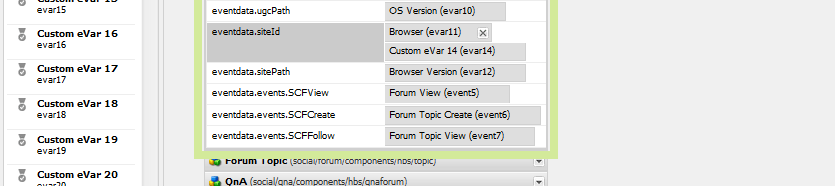

# Analytics-Konfiguration für Communities-Funktionen {#analytics-configuration-for-communities-features}

>[!CAUTION]
>
>AEM 6.4 hat das Ende der erweiterten Unterstützung erreicht und diese Dokumentation wird nicht mehr aktualisiert. Weitere Informationen finden Sie in unserer [technische Unterstützung](https://helpx.adobe.com/de/support/programs/eol-matrix.html). Unterstützte Versionen suchen [here](https://experienceleague.adobe.com/docs/?lang=de).

## Übersicht {#overview}

Adobe Analytics und Adobe Experience Manager (AEM) sind beide Lösungen von Adobe Marketing Cloud.

Adobe Analytics kann für AEM Communities so konfiguriert werden, dass bei der Interaktion eines Mitglieds mit unterstützten Communities-Funktionen Ereignisse an Adobe Analytics gesendet werden, aus denen Berichte generiert werden.

Wenn beispielsweise ein Mitglied einer Community-Aktivierungswebsite eine ihm zugewiesene Videoressource anzeigt, sendet der Ressourcen-Player Ereignisse an Analytics, einschließlich Video Heartbeat-Daten. Auf der Community-Site können Administratoren verschiedene Berichte zur Videowiedergabe sehen.

Außerdem ist die Analyse erforderlich für:

* In der Veröffentlichungsumgebung:

   * Community-Berichterstattung [Trends](trends.md)
   * Site-Besuchern die Sortierung nach &quot;am häufigsten angezeigt&quot;, &quot;am aktivsten&quot;, &quot;am beliebtesten&quot;
   * Anzeigen von Zählungen in benutzergenerierten Listen

* In der Autorenumgebung:

   * Anzeigen von Beitragsdaten in der [Mitgliederverwaltungskonsole](members.md) (Ansichten, Beiträge, folgt, Gefällt mir)
   * Trendzusammenfassung, Video Heartbeat und Video-Gerät für Aktivierungsressource [Berichte](reports.md)

Zu den unterstützten Communities-Funktionen gehören:

* [Aktivierungsressourcen](resources.md)
* [Forum](forum.md)
* [Fragen und Antworten](working-with-qna.md)
* [Blog](blog-feature.md)
* [Dateibibliothek](file-library.md)
* [Kalender](calendar.md)

In diesem Abschnitt der Dokumentation wird beschrieben, wie Sie eine Analytics Report Suite mit Communities-Funktionen verbinden. Die grundlegenden Schritte sind:

1. [Replizieren des Kryptoschlüssels](#replicate-the-crypto-key) um sicherzustellen, dass Verschlüsselung/Entschlüsselung in allen AEM korrekt ausgeführt wird
1. Adobe Analytics vorbereiten [Report Suite](#adobe-analytics-report-suite-for-video-reporting)
1. Erstellen von AEM Analytics [Cloud Service](#aem-analytics-cloud-service-configuration) und [Framework](#aem-analytics-framework-configuration)
1. [Analytics aktivieren](#enable-analytics-for-a-community-site) für eine Community-Site
1. [Überprüfen](#verify-analytics-to-aem-variable-mapping) Zuordnung von Analytics zu AEM Variablen
1. Identifizieren [primärer Herausgeber](#primary-publisher)
1. [Veröffentlichen](#publish-community-site-and-analytics-cloud-service) die Community-Site
1. Konfigurieren [Import von Berichtsdaten](#obtaining-reports-from-analytics) von Adobe Analytics zur Community-Site

## Voraussetzungen {#prerequisites}

Um die Funktionen von Analytics for Communities zu konfigurieren, müssen Sie sich an Ihren Kundenbetreuer wenden, um ein Adobe Analytics-Konto einzurichten. [Report Suite](#adobe-analytics-report-suite-for-video-reporting). Nach der Feststellung sollten folgende Informationen verfügbar sein:

* Unternehmensname

   Das mit dem Adobe Analytics-Konto verknüpfte Unternehmen
* Benutzername

   Der Anmeldename des Benutzers, der zur Verwaltung des Analytics-Kontos berechtigt ist

   (Sollte Zugriffsberechtigungen für Webdienste enthalten)

* Passwort

   Das Anmeldekennwort für den autorisierten Benutzer

* Analytics Data Center

   Die URL des Analytics-Rechenzentrums für das Konto

* Berichtssuite

   Der Name der zu verwendenden Analytics Report Suite

## Adobe Analytics Report Suite für Videoberichte {#adobe-analytics-report-suite-for-video-reporting}

Verwenden der [Report Suite Manager](https://experienceleague.adobe.com/docs/analytics/admin/manage-report-suites/new-report-suite/new-report-suite.html), können Analytics-Report Suites so konfiguriert werden, dass eine Community-Site Berichte für Communities-Funktionen bereitstellen kann.

Durch Anmeldung bei [Adobe Marketing Cloud](https://experienceleague.adobe.com/docs/analytics/analyze/analysis-workspace/home.html) mit [Firmenname und Benutzername](analytics.md#prerequisites)kann eine neue oder vorhandene Report Suite wie folgt konfiguriert werden:

* [11 Konversionsvariablen](https://experienceleague.adobe.com/docs/analytics/admin/admin-tools/conversion-variables/conversion-var-admin.html) (eVars)

   * **`evar1`** bis **`evar11`** enabled
   * Kann vorhandene eVars wiederverwenden (umbenennen) oder neue erstellen, die für Communities-Funktionen verwendet werden können

* [7 Erfolgsereignisse](https://experienceleague.adobe.com/docs/analytics/admin/admin-tools/success-events/success-event.html) (Ereignisse)

   * **`event1`** bis **`event7`** enabled
   * Typ **`Counter`**

      * nicht **`Counter (no subrelations)`**
   * Kann vorhandene Ereignisse wiederverwenden (umbenennen) oder neue erstellen, die für Communities-Funktionen verwendet werden können


* [Videomanagement](https://experienceleague.adobe.com/docs/media-analytics/using/media-overview.html?lang=de)

   * Videoberichterkonsole

      * Aktivieren `Video Core`
      * Wählen Sie Speichern aus
   * Video Core Measurement Console

      * Klicken Sie auf `Use Solution Variables`
      * Wählen Sie Speichern aus


Wenn Sie eine **neue Report Suite** Beachten Sie, dass eine neue Report Suite möglicherweise nur 4 eVars und 6 Ereignisvariablen hat, während für Communities 11 eVars und 7 Ereignisvariablen erforderlich sind.

Bei Verwendung von **vorhandene Report Suite**, kann es erforderlich sein, [Ändern der Variablenzuordnung](#modifying-analytics-variable-mapping) vor der Aktivierung des Analytics-Frameworks für eine Community-Site. Wenden Sie sich an Ihren Kundenbetreuer, wenn Sie Fragen zu den Communities-Variablen haben.

>[!CAUTION]
>
>**Bei Verwendung einer vorhandenen Report Suite, die bereits Variablen in**
>
>* **`evar1`** bis **`evar11`**
>* **`event1`** bis **`event7`**
>
>**Bevor die Community-Site veröffentlicht wird,** Es ist wichtig, die bereits vorhandene Zuordnung wiederherzustellen, indem die AEM Variablen verschoben werden, die automatisch Analytics-Variablen zugeordnet waren, als Analytics für eine Community-Site aktiviert wurde.
>
>Informationen zum Wiederherstellen der bereits vorhandenen Zuordnung und Verschieben AEM Variablen in andere Analytics-Variablen finden Sie im Abschnitt unter [Ändern der Analytics-Variablenzuordnung](#modifying-analytics-variable-mapping).
>
>Andernfalls kann es zu nicht wiederherstellbaren Datenverlusten kommen.

### Video Heartbeat Analytics {#video-heartbeat-analytics}

Wenn Video Heartbeat Analytics lizenziert ist, wird ein `Marketing Cloud Org Id` zugewiesen wurde.

So aktivieren Sie die Video Heartbeat-Berichterstellung nach [Konfigurieren der Analytics Report Suite für Videoberichte](#adobe-analytics-report-suite-for-video-reporting):

* Erstellen Sie eine [Analytics Cloud Service](#aem-analytics-cloud-service-configuration)
* Aktivieren [Analytics für eine Community-Site](#enable-analytics-for-a-community-site)
* Verknüpfen Sie die `Marketing Cloud Org Id` mit der Community-Site

Die `Marketing Cloud Org Id` kann zum Zeitpunkt der [Community-Site-Erstellung](sites-console.md#enablement) oder später von [Ändern](sites-console.md#modifying-site-properties) die Eigenschaften der Community-Site. [](#aem-analytics-cloud-service-configuration)


Wenn Video Heartbeat Analytics aktiviert ist, instanziiert der JavaScript-Code (JS) für den Videoplayer den Video Heartbeat Library-Code (auch in JS), der alle Logiken zum Senden von Videostatusaktualisierungen an die Analytics-Video-Tracking-Server alle 10 Sekunden (nicht konfigurierbar) verarbeitet und schließlich einen kumulativen Bericht der Videositzung an die Analytics-Hauptserver sendet.

Wenn dies nicht aktiviert ist, wird der Video Heartbeat-Code nie instanziiert und nur das Video-Fortschritts- und das Tracking der Wiederaufnahmeposition wird zur Berichterstellung in SRP persistiert.

## Analytics Cloud-Dienstkonfiguration AEM {#aem-analytics-cloud-service-configuration}

So erstellen Sie eine neue Analytics-Integration, die Adobe Analytics mit der AEM Community-Site integriert, mithilfe der standardmäßigen Benutzeroberfläche in der Autoreninstanz:

* Über die globale Navigation: **[!UICONTROL Tools > Bereitstellung > Cloud Services]**
* Scrollen Sie nach unten zu **[!UICONTROL Adobe Analytics]**
* Wählen Sie entweder **[!UICONTROL Jetzt konfigurieren]** oder **[!UICONTROL Konfigurationen anzeigen]**


### Dialogfeld &quot;Konfiguration erstellen&quot; {#create-configuration-dialog}

* Auswählen `[+]` Symbol neben **[!UICONTROL Verfügbare Konfigurationen]** , um eine neue Konfiguration zu erstellen

Im Dialogfeld &quot;Konfiguration erstellen&quot;geben die eingegebenen Werte die Konfiguration an.


* **[!UICONTROL Titel]**

   (Erforderlich) Ein Anzeigetitel für die Konfiguration.

   Geben Sie beispielsweise *Community-Analyse aktivieren*

* **[!UICONTROL Name]**

   (Optional) Wenn kein Name angegeben wird, wird standardmäßig ein gültiger Knotenname verwendet, der aus dem Titel abgeleitet wurde.

   Geben Sie beispielsweise *communities*


* **[!UICONTROL Vorlage]**

   Klicken Sie auf `Adobe Analytics Configuration`

* Wählen Sie **[!UICONTROL Erstellen]** aus
   * Startet die Konfigurationsseite und öffnet `Analytics Settings` dialog

### Dialogfeld &quot;Analytics-Einstellungen&quot; {#analytics-settings-dialog}

Die erste Erstellung einer neuen Analytics-Konfiguration führt zur Anzeige der Konfiguration und eines neuen Dialogfelds für die Eingabe der Analytics-Einstellungen. Dieses Dialogfeld erfordert die [Voraussetzungen für Kontoinformationen](#prerequisites) vom Kundenbetreuer erhalten.


* **[!UICONTROL Unternehmen]**

   Das mit dem Adobe Analytics-Konto verknüpfte Unternehmen

* **[!UICONTROL Benutzername]**

   Der Anmeldename des Benutzers, der zur Verwaltung des Analytics-Kontos berechtigt ist

* **[!UICONTROL Kennwort]**

   Das Anmeldekennwort für den autorisierten Benutzer

* **[!UICONTROL Rechenzentrum]**

   Wählen Sie das Analytics-Rechenzentrum aus, in dem die Report Suite gehostet wird

* **[!UICONTROL Kein Verfolgungs-Tag zur Seite hinzufügen]**

   Als Standard festlegen (deaktiviert)

* **[!UICONTROL AppMeasurement verwenden]**

   Als Standard festlegen (deaktiviert)

* **[!UICONTROL Nachts keine Seitenimpressionen importieren (verfassen)]**

   Als Standard festlegen (deaktiviert)

* **[!UICONTROL Nachts keine Seitenimpressionen importieren (veröffentlichen)]**

   Als Standard belassen (aktiviert)

So speichern Sie die Einstellungen:


* Auswählen **[!UICONTROL Verbindung zu Analytics herstellen]**

   * Wenn dies nicht erfolgreich war,

      * Sicherstellen, dass Einträge keine vorangestellten Leerzeichen enthalten
      * Testen Sie ein anderes Rechenzentrum.
      * Kundenbetreuer kontaktieren

* Wählen Sie **[!UICONTROL OK]** aus


### Framework erstellen {#create-framework}

Nach erfolgreicher Konfiguration der Basisverbindung mit Adobe Analytics muss ein Framework für die Community-Site erstellt oder bearbeitet werden. Der Zweck des Frameworks besteht darin, Communities-Funktionsvariablen (AEM) Analytics-Variablen (Report Suite) zuzuordnen.

* Auswählen `[+]` Symbol neben **[!UICONTROL Verfügbare Frameworks]** , um ein neues Framework zu erstellen


* **[!UICONTROL Titel]**

   (Erforderlich) Ein Anzeigetitel für das Framework

   Geben Sie beispielsweise *Community-Rahmen für die Aktivierung*

* **[!UICONTROL Name]**

   (Optional) Wenn kein Name angegeben wird, wird standardmäßig ein gültiger Knotenname verwendet, der aus dem Titel abgeleitet wurde.

   Geben Sie beispielsweise *communities*

* **[!UICONTROL Vorlage]**

   Klicken Sie auf `Adobe Analytics Framework`

* Wählen Sie **[!UICONTROL Erstellen]** aus

Durch Erstellen des Analytics-Frameworks wird das Framework zur Konfiguration geöffnet.

## AEM Analytics-Framework-Konfiguration {#aem-analytics-framework-configuration}

Das Framework dient der Zuordnung AEM Variablen zu Analytics-Variablen (eVars und Ereignisse). Die für die Zuordnung verfügbaren Analytics-Variablen sind [definiert in der Report Suite](#adobe-analytics-report-suite-for-video-reporting).


### Report Suite auswählen {#select-report-suite}

Wählen Sie die Report Suite aus, die für Videoberichte eingerichtet wurde.

Wenn eine Report Suite noch nicht erstellt oder nicht ordnungsgemäß eingerichtet wurde, lesen Sie den vorherigen Abschnitt:\
[Adobe Analytics Report Suite für Videoberichte](#adobe-analytics-report-suite-for-video-reporting)

Der Sidekick ist nicht erforderlich und kann minimiert werden, damit der Zugriff auf die Report Suites-Einstellungen nicht behindert wird.

#### Dialogfeld &quot;Report Suites&quot;vor und nach der Auswahl von &quot;Element hinzufügen&quot; {#report-suites-dialog-before-and-after-selecting-add-item}


1. Auswählen **[!UICONTROL Element hinzufügen +]** Zwei Dropdown-Felder werden angezeigt
1. Wählen Sie eine `Report suite` die mit dem Unternehmenskonto verknüpften Report Suites zur Auswahl verfügbar sein sollten
1. Auswählen **[!UICONTROL Ja]** im sich öffnenden Dialogfeld: ```Load default server settings? Do you want to load the default server settings and overwrite current values in the Server section?```
1. Wählen Sie eine `Run Mode`\
   Auswählen **[!UICONTROL publish]**


Der Analytics-Cloud-Service und das -Framework sind jetzt abgeschlossen. Die Zuordnungen werden definiert, sobald eine Community-Site mit diesem Analytics-Dienst erstellt wurde.

## Aktivieren von Analytics für eine Community-Site {#enable-analytics-for-a-community-site}

### Aktivieren für neue Community-Site {#enable-for-new-community-site}

So fügen Sie den Analytics-Cloud-Service hinzu: [Erstellen einer neuen Community-Site](sites-console.md):


* In Schritt 3
* Unter dem [Registerkarte &quot;ANALYTICS&quot;](sites-console.md#analytics):

   * Überprüfen Sie die **[!UICONTROL Analytics aktivieren]** Kontrollkästchen
   * Wählen Sie das Framework aus der Dropdown-Liste aus

* Kehren Sie optional zur Analytics-Framework-Konfiguration zurück, um die Variablenzuordnungen anzupassen.

### Aktivieren für bestehende Community-Site {#enable-for-existing-community-site}

Hinzufügen des Analytics-Cloud-Service zu einem [bestehende Community-Site](sites-console.md#modifying-site-properties):


* Navigieren Sie zum **[!UICONTROL Communities > Sites]** console
* Wählen Sie das Symbol &quot;Site bearbeiten&quot;der Community-Site aus
* EINSTELLUNGEN auswählen
* Im Abschnitt Analytics :

   * Überprüfen Sie die **[!UICONTROL Analytics aktivieren]** Kontrollkästchen
   * Wählen Sie das Framework aus der Dropdown-Liste aus


* Kehren Sie optional zur Analytics-Framework-Konfiguration zurück, um die Variablenzuordnungen anzupassen.

### Aktivieren für benutzerdefinierte Sites {#enable-for-customized-sites}

Damit Analytics-Tracking und -Import für eine Community-Site ordnungsgemäß funktionieren, sollte ein Seitenelement mit der `scf-js-site-title` -Klasse und href-Attribute müssen vorhanden sein. Auf der Seite sollte nur ein solches Element vorhanden sein, wie es beispielsweise in einem nicht geänderten `sitepage.hbs` Skript für eine Community-Site. Der Wert von `siteUrl` wird extrahiert und an Adobe Analytics gesendet, da *Sitepfad*.

```xml
# present in default sitepage.hbs

>[!CAUTION]
>
>AEM 6.4 has reached the end of extended support and this documentation is no longer updated. For further details, see our [technical support periods](https://helpx.adobe.com/support/programs/eol-matrix.html). Find the supported versions [here](https://experienceleague.adobe.com/docs/).
# only one scf-js-site-title class should be included

>[!CAUTION]
>
>AEM 6.4 has reached the end of extended support and this documentation is no longer updated. For further details, see our [technical support periods](https://helpx.adobe.com/support/programs/eol-matrix.html). Find the supported versions [here](https://experienceleague.adobe.com/docs/).
# this example sets it to be hidden as it serves no visual purpose

>[!CAUTION]
>
>AEM 6.4 has reached the end of extended support and this documentation is no longer updated. For further details, see our [technical support periods](https://helpx.adobe.com/support/programs/eol-matrix.html). Find the supported versions [here](https://experienceleague.adobe.com/docs/).
<div
    class="navbar-brand scf-js-site-title"
    href="{{siteUrl}}.html"
    style="visibility: hidden;"
>
</div>
```

Für **angepasste Community-Site** überlagert `sitepage.hbs` -Skript, stellen Sie sicher, dass das -Element vorhanden ist. Die `siteUrl`wird festgelegt, wenn sie auf dem Server gerendert wird, bevor sie an den Client gesendet werden.

Für **generische AEM** , die Communities-Komponenten enthält, aber nicht mit der [Assistent zur Site-Erstellung](sites-console.md), muss das Element hinzugefügt werden. Der Wert von href sollte der Pfad zur Site sein. Wenn der Sitepfad beispielsweise `/content/my/company/en`, und verwenden Sie dann:

```xml
<div
    class="navbar-brand scf-js-site-title"
    href="/content/my/company/en.html"
    style="visibility: hidden;"
>
</div>
```

## Funktionen von Analytics for Communities {#analytics-for-communities-features}

Analytics wird automatisch für verschiedene Communities-Funktionen verwendet.

Die Autorenumgebung [OSGi-Konfiguration](../../help/sites-deploying/configuring-osgi.md), `AEM Communities Analytics Component Configuration`bietet eine Liste der Komponenten, die für Analytics instrumentiert wurden. Die automatische Zuordnung von Variablen wird durch die aufgeführten Komponenten bestimmt.

Wenn neue benutzerdefinierte Komponenten erstellt werden, die für Analytics instrumentiert werden, sollten sie dieser Liste der konfigurierten Komponenten hinzugefügt werden.

### Komponentenkonfiguration {#component-configuration}


Hinweis: die `journal` -Komponenten werden verwendet, um die Blog-Funktion zu implementieren.

### Analytics AEM Variablen zugeordnet {#mapped-analytics-to-aem-variables}

Sobald die Community-Site mit aktiviertem Analytics und dem ausgewählten Cloud-Konfigurations-Framework gespeichert wurde, werden die AEM Variablen automatisch den Analytics-eVars und -Ereignissen zugeordnet, die mit evar1 bzw. event1 beginnen, und sie werden um 1 inkrementiert.

Wenn Sie eine vorhandene Report Suite verwenden, die eine der Variablen in evar1 bis evar11 und event1 bis event7 zugeordnet hat, müssen Sie [AEM](#modifying-analytics-variable-mapping) und stellen Sie die ursprüngliche Zuordnung wieder her.

Im Folgenden finden Sie ein Beispiel für standardmäßige Zuordnungen nach dem [Tutorial zu den ersten Schritten](getting-started-enablement.md):


#### Zuordnung der mit jedem Ereignis gesendeten eVars {#map-of-evars-sent-with-each-event}

|  | Aktivierungsressourcentyp | Site-Titel | Funktionstyp | Gruppentitel | Gruppenpfad | UGC-Typ | UGC-Titel | Benutzer (Mitglied) | UGC-Pfad | Site-Pfad |
|------------------------|------------------------|-----------|--------------|------------|-----------|---------|----------|--------------|---------|----------|
|  | **eVar1** | **eVar2** | **eVar3** | **eVar4** | **eVar5** | **eVar6** | **eVar7** | **eVar8** | **eVar9** | **eVar10** |
| event1Resource Play | (eine) | - | - | - | - | - | - | - | i) | - |
| event2SCFView | (eine) | (b) | (c) | (d) | e) | f) | g) | (h) | i) | j) |
| event3SCFCreate (Post) | - | (b) | (c) | (d) | e) | f) | g) | (h) | i) | j) |
| event4SCFFollow | - | (b) | (c) | (d) | e) | f) | g) | (h) | i) | j) |
| event5SCFVoteUp | - | (b) | (c) | (d) | e) | f) | g) | (h) | i) | j) |
| event6SCFVoteDown | - | (b) | (c) | (d) | e) | f) | g) | (h) | i) | j) |
| event7SCFRate | - | (b) | (c) | (d) | e) | f) | g) | (h) | i) | j) |

**Beispiele für eVar:**

* [MIME-Typ](https://www.iana.org/assignments/media-types): video/mp4
* [Community-Site-Titel](sites-console.md#step13asitetemplate): Geometrixx
* [Community-Funktionsname](functions.md): Forum
* [Community-Gruppenname](creating-groups.md#creating-a-new-group): Wandern
* Pfad zum Community-Gruppeninhalt: /content/sites/communities/en/groups/wandern
* [UGC component resourceType](essentials.md): social/forum/components/hbs/topic
* UGC-Komponententitel: Wanderthemen
* Anmeldung (authorizable Id): aaron.mcdonald@mailinator.com
* SRP-Pfad zu UGC: /content/usergenerated/asi/../forum/jmtz-topic3 oder *Pfad der zu befolgenden Komponente*: /content/sites/communities/en/jcr:content/content/primary/forum
* Pfad zum Inhalt der Community-Site: /content/sites/community/en

### Ändern der Analytics-Variablenzuordnung {#modifying-analytics-variable-mapping}

Die Zuordnung von Analytics-eVars und -Ereignissen zu AEM Variablen ist in der Framework-Konfiguration sichtbar, nachdem Analytics für eine Community-Site aktiviert wurde.

Nachdem Analytics aktiviert wurde und bevor die Community-Site veröffentlicht wird, kann die Zuordnung im Framework geändert werden, indem die gewünschte Analytics-eVar oder das gewünschte Ereignis aus der linken Leiste gezogen und in die entsprechende Zeile in der Zuordnungstabelle verschoben wird.

Um doppelte Zuordnungen zu vermeiden, müssen Sie die ersetzte Analytics-eVar oder das ersetzte Analytics-Ereignis aus der Zeile entfernen, indem Sie den Mauszeiger darüber bewegen und das &quot;X&quot;auswählen, das rechts neben dem Analytics-Variablenelement angezeigt wird.

Wenn Community-eVars und -Ereignisse Zuordnungen überschreiben, die bereits in der Report Suite vorhanden waren, weisen Sie zur Vermeidung von Datenverlust die AEM Variablen für Communities-Funktionen anderen Analytics-eVars und/oder -Ereignissen zu und stellen Sie die ursprünglichen Zuordnungen wieder her.

>[!CAUTION]
>
>Es ist wichtig, dass Sie eine Umbenennung vornehmen, bevor die Community-Site [veröffentlicht](#publishing-the-community-site) mit aktivierter Analytics-Funktion, andernfalls besteht das Risiko eines Datenverlusts.

#### Beispiel: Schritt 1: Ziehen von Analytics evar14 in die Zuordnungstabelle {#example-step-dragging-analytics-evar-into-mapping-table}


#### Beispiel: Schritt 2: Auswahl von &quot;x&quot;zum Entfernen der ersetzten evar11 {#example-step-selecting-x-to-remove-replaced-evar}



#### Beispiel: Schritt 3: AEM var eventdata.siteId wurde der Analytics-eVar14 zugeordnet {#example-step-aem-var-eventdata-siteid-remapped-to-analytics-evar}


## Veröffentlichen der Community-Site {#publishing-the-community-site}

### Überprüfen der Zuordnung von Analytics zu AEM Variablen {#verify-analytics-to-aem-variable-mapping}

Es ist ratsam, die Variablenzuordnung vor der Veröffentlichung der Community-Site zu überprüfen, auf der auch der Analytics-Cloud-Service und das -Framework veröffentlicht werden.

Siehe Abschnitte:

* [Analytics AEM Variablen zugeordnet](#mapped-analytics-to-aem-variables)
* [Ändern der Analytics-Variablenzuordnung](#modifying-analytics-variable-mapping)

>[!CAUTION]
>
>**Bei Verwendung einer vorhandenen Report Suite, die bereits Variablen in**
>
>* **`evar1`** bis **`evar11`**
>* **`event1`** bis **`event7`**
>
>**Bevor die Community-Site veröffentlicht wird,** Es ist wichtig, die bereits vorhandene Zuordnung wiederherzustellen und die Communities AEM Variablen, die automatisch zugeordnet wurden (als Analytics für die Community-Site aktiviert wurde), in andere Analytics-Variablen zu verschieben. Diese Neuzuordnung sollte für alle Communities-Komponenten einheitlich sein.
>
>Andernfalls kann es zu nicht wiederherstellbaren Datenverlusten kommen.

### Primärer Herausgeber {#primary-publisher}

Wenn es sich bei der ausgewählten Bereitstellung um eine [Veröffentlichungsfarm](topologies.md#tarmk-publish-farm)muss eine AEM Veröffentlichungsinstanz als primärer Herausgeber für die Abfrage von Adobe Analytics für Berichtsdaten identifiziert werden, an die geschrieben werden soll [SRP](working-with-srp.md).

Standardmäßig wird die `AEM Communities Publisher Configuration` Die OSGi-Konfiguration identifiziert die Veröffentlichungsinstanz als primären Herausgeber, sodass sich alle Veröffentlichungsinstanzen in einer Veröffentlichungsfarm selbst als primär identifizieren.

Daher ist es erforderlich, die Konfiguration auf allen sekundären Veröffentlichungsinstanzen zu bearbeiten, um die **Primärer Herausgeber** aktivieren.

Spezifische Anweisungen finden Sie im Abschnitt des primären Herausgebers unter [Bereitstellen von Communities](deploy-communities.md#primary-publisher).

>[!CAUTION]
>
>Es ist wichtig, dass der primäre Herausgeber so konfiguriert ist, dass die Abfrage von mehreren Veröffentlichungsinstanzen verhindert wird.

### Replizieren des Crypto-Schlüssels {#replicate-the-crypto-key}

Die Adobe Analytics-Anmeldeinformationen werden verschlüsselt. Um die Replikation oder Übertragung verschlüsselter Analytics-Anmeldeinformationen zwischen Autor und Herausgebern zu erleichtern, müssen alle AEM Instanzen denselben primären Verschlüsselungsschlüssel verwenden.

Befolgen Sie dazu die Anweisungen unter [Replizieren des Crypto-Schlüssels](deploy-communities.md#replicate-the-crypto-key).

### Community-Site und Analytics Cloud-Dienst veröffentlichen {#publish-community-site-and-analytics-cloud-service}

Sobald der Analytics-Cloud-Service für eine Community-Site und, falls erforderlich, für die [Die Zuordnung von Analytics zu AEM Variablen wurde angepasst](#mapped-analytics-to-aem-variables)muss die Konfiguration in der Veröffentlichungsumgebung repliziert werden durch [(erneut) Veröffentlichen der Community-Site](sites-console.md#publishing-the-site).

## Abrufen von Berichten aus Analytics {#obtaining-reports-from-analytics}

### Berichtverwaltung {#report-management}

Der Autor und der primäre Herausgeber [OSGi-Konfiguration](../../help/sites-deploying/configuring-osgi.md), `AEM Communities Analytics Report Management`, wird zur Abfrage von Analytics verwendet.

Beim Autor werden die Abfragen für Echtzeitberichte erstellt.

Beim primären Herausgeber werden die Abfragen verwendet, um Informationen bei der Vorbereitung des Analytics-Datenimports durch Report Importer bereitzustellen.

Das Abfrageintervall beträgt standardmäßig 10 Sekunden.

### Report Importer {#report-importer}

Sobald eine für Analytics aktivierte Community-Site veröffentlicht wurde, wird die [OSGi-Konfiguration](../../help/sites-deploying/configuring-osgi.md), `AEM Communities Analytics Report Importer`kann so konfiguriert werden, dass das standardmäßige Abrufintervall für die Konfigurationen festgelegt wird, die nicht einzeln in CRXDE konfiguriert sind.

Das Abrufintervall steuert die Häufigkeit von Anforderungen an Adobe Analytics, in denen Daten abgerufen und gespeichert werden sollen [SRP](working-with-srp.md).

Wenn die Daten als &quot;Big Data&quot;kategorisiert werden können, kann eine häufigere Abfrage eine große Belastung für die Community-Site verursachen.

Die Standardabfrage **Importintervall** auf 12 Stunden festgelegt ist.


### Anpassung von Komponentenberichten {#component-report-customization}

Derzeit werden zur Anpassung der zu verfolgenden Metriken Knoten im Repository erstellt, die Zeiträume definieren, für die ein Bericht zu dieser Metrik erstellt werden soll.

Das Forenthema ist derzeit das einzige Beispiel für diese Anpassung:

* Im primären Herausgeber
* Anmelden mit Administratorrechten
* Gehen Sie zu [CRXDE Lite](../../help/sites-developing/developing-with-crxde-lite.md)

   * Beispiel: [http://localhost:4503/crx/de](http://localhost:4503/crx/de)

* Unter dem `jcr:content` Knoten des Sprachstamms

   * Beispiel: `/content/sites/engage/en/jcr:content`

* Navigieren Sie zur für die Analytics-Berichterstellung konfigurierten Komponente

   * Beispiel: `analytics/reportConfigs/social_forum_components_hbs_topic`

* Beachten Sie die erstellten Zeiträume

   * `last30Days`
   * `last90Days`
   * `thisYear`

* Beachten Sie die `total`Knoten

   * Ändern der `interval` -Eigenschaft überschreibt das Report Importer-Intervall
   * Der Wert wird in Sekunden angegeben und auf 4 Stunden (14400 Sekunden) festgelegt.


## Benutzerdaten in Analytics verwalten {#manage-user-data-in-analytics}

Adobe Analytics bietet APIs, mit denen Sie auf Benutzerdaten zugreifen, diese exportieren und löschen können. Weitere Informationen finden Sie unter [Zugriffs- und Löschanfragen einreichen](https://experienceleague.adobe.com/docs/analytics/admin/data-governance/gdpr-submit-access-delete.html).

## Ressourcen {#resources}

* Adobe Marketing Cloud: [Hilfe und Referenz zu Analytics](https://experienceleague.adobe.com/docs/analytics/landing/home.html)
* AEM: [Integration mit Adobe Analytics](../../help/sites-administering/adobeanalytics.md)
* AEM: [Analytics mit externen Anbietern](../../help/sites-administering/external-providers.md)
