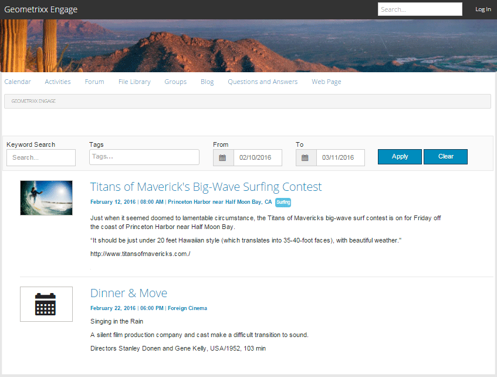

# Kalenderfunktion {#calendar-feature}

>[!CAUTION]
>
>AEM 6.4 hat das Ende der erweiterten Unterstützung erreicht und diese Dokumentation wird nicht mehr aktualisiert. Weitere Informationen finden Sie in unserer [technische Unterstützung](https://helpx.adobe.com/de/support/programs/eol-matrix.html). Unterstützte Versionen suchen [here](https://experienceleague.adobe.com/docs/?lang=de).

## Einführung {#introduction}

Die Kalenderfunktion unterstützt die Bereitstellung von Community-Ereignisinformationen im Kalenderformat entweder für alle Site-Besucher oder nur für angemeldete Site-Besucher (Community-Mitglieder), während nur autorisierte Mitglieder Ereignisse hinzufügen können.

In diesem Abschnitt der Dokumentation wird Folgendes beschrieben:

* Hinzufügen der Kalenderfunktion zu einer AEM Site
* Konfigurationseinstellungen für `Calendar`Komponenten

## Hinzufügen eines Kalenders zu einer Seite {#adding-a-calendar-to-a-page}

So fügen Sie eine `Calendar` -Komponente auf einer Seite im Autorenmodus verwenden Sie den Komponenten-Browser, um

* `Communities / Calendar`

und ziehen Sie sie an die gewünschte Stelle auf einer Seite, z. B. an die Position relativ zur Funktion, die Benutzer überprüfen können.

Die erforderlichen Informationen finden Sie unter [Grundlagen zu Communities-Komponenten](basics.md).

Wenn die [erforderliche clientseitige Bibliotheken](calendar-basics-for-developers.md#essentials-for-client-side) eingeschlossen sind, wird die `Calendar` wird angezeigt.

### Konfigurieren des Kalenders {#configuring-calendar}

Wählen Sie die platzierte `Calendar`-Komponente, die aufgerufen und ausgewählt werden soll `Configure` -Symbol, über das das Dialogfeld &quot;Bearbeiten&quot;geöffnet wird.

 

#### Registerkarte Einstellungen {#settings-tab}

Unter dem **[!UICONTROL Einstellungen]** -Registerkarte angeben, ob Tags auf Kalendereinträge angewendet werden dürfen.

* **[!UICONTROL Ereignisse pro Seite]**

   Definiert die Anzahl der pro Seite angezeigten Ereignisse. Der Standardwert ist 10.

* **[!UICONTROL Moderiert]**

   Wenn diese Option aktiviert ist, muss die Veröffentlichung von Kalenderereignissen und Kommentaren genehmigt werden, bevor sie auf einer Veröffentlichungs-Site erscheinen. Die Option Standard ist deaktiviert.

* **[!UICONTROL Geschlossen]**

   Wenn diese Option aktiviert ist, ist der Kalender für neue Ereigniseinträge und -kommentare gesperrt. Die Option Standard ist deaktiviert.

* **[!UICONTROL Rich-Text-Editor]**

   Wenn diese Option aktiviert ist, können Kalenderereignisse und Kommentare mit Markup eingegeben werden. Die Option Standard ist aktiviert.

* **[!UICONTROL Tagging zulassen]**

   Wenn diese Option aktiviert ist, können Mitglieder den von ihnen geposteten Ereignissen Tag-Beschriftungen hinzufügen (siehe **Tag-Feld** Registerkarte). Die Option Standard ist aktiviert.

* **[!UICONTROL Datei-Uploads zulassen]**

   Wenn diese Option aktiviert ist, können Sie zulassen, dass Dateianlagen zu einem Kalenderereignis oder Kommentar hinzugefügt werden. Die Option Standard ist aktiviert.

* **[!UICONTROL Folgende zulassen]**

   Wenn diese Option aktiviert ist, können Mitglieder Ereignisse verfolgen, die in den Kalender veröffentlicht wurden. Die Option Standard ist aktiviert.

* **[!UICONTROL Max. Dateigröße]**

   Nur relevant, wenn `Allow File Uploads` aktiviert ist. Dieses Feld begrenzt die Größe einer hochgeladenen Datei (in Byte). Der Standardwert ist 104857600 (10 MB).

* **[!UICONTROL Zulässige Dateitypen]**

   Nur relevant, wenn `Allow File Uploads` aktiviert ist. Eine kommagetrennte Liste von Dateierweiterungen mit dem Trennzeichen &quot;Punkt&quot;. Beispiel: .jpg, .jpeg, .png, .doc, .docx, .pdf. Wenn Dateitypen angegeben werden, dürfen nicht angegebene nicht hochgeladen werden. Die Standardeinstellung ist nicht so festgelegt, dass alle Dateitypen zulässig sind.

* **[!UICONTROL Maximale Dateigröße für Bildanhang]**

   Nur relevant, wenn die Option Datei-Uploads zulassen aktiviert ist. Maximale Anzahl der Bytes, die eine hochgeladene Bilddatei aufweisen kann. Der Standardwert ist 2097152 (2 MB).

* **[!UICONTROL Zugelassene Bildtypen für Deckblätter]**

   Eine kommagetrennte Liste von Bilddateierweiterungen mit dem Trennzeichen &quot;Punkt&quot;. Der Standardwert ist `.jpg,.jpeg,.png,.gif,.bmp`.

* **[!UICONTROL Antworten mit Diskussionsfaden zulassen]**

   Wenn diese Option aktiviert ist, erlauben Sie Antworten auf Kommentare, die zum Kalenderereignis veröffentlicht wurden. Die Option Standard ist aktiviert.

* **[!UICONTROL Benutzern das Löschen von Anmerkungen und Ereignissen ermöglichen]**

   Wenn diese Option aktiviert ist, können Mitglieder die von ihnen veröffentlichten Kommentare und Kalenderereignisse löschen. Die Option Standard ist aktiviert.

* **[!UICONTROL Abstimmung zulassen]**

   Wenn diese Option aktiviert ist, nehmen Sie die Abstimmungsfunktion in ein Kalenderereignis auf. Die Option Standard ist aktiviert.

* **[!UICONTROL Breadcrumbs anzeigen]**

   Breadcrumbs auf Ereignisseite anzeigen. Die Option Standard ist aktiviert.

* **[!UICONTROL Datumsbereich-Filter]**

   Definiert die Anzahl der Tage, die zum aktuellen Datum hinzugefügt werden, um den &quot;An&quot;-Wert des Seitenfilters für die Auflistung von Kalenderereignissen zu berechnen. Die Standardnummer ist 30.

* **[!UICONTROL Feature-Inhalt zulassen]**

   Wenn diese Option aktiviert ist, kann die Idee als [präsentierte Inhalte](featured.md). Die Option Standard ist deaktiviert.

Unter dem **[!UICONTROL Benutzermoderation]** -Registerkarte angeben, wie die veröffentlichten Themen und Antworten (benutzergenerierte Inhalte) verwaltet werden. Weitere Informationen finden Sie unter [Moderieren benutzergenerierter Inhalte](moderate-ugc.md).

#### Registerkarte &quot;Benutzermoderation&quot; {#user-moderation-tab}

* **[!UICONTROL Posts ablehnen]**

   Wenn diese Option aktiviert ist, können Moderatoren vertrauenswürdiger Mitglieder Beiträge ablehnen und verhindern, dass der Beitrag im öffentlichen Forum erscheint. Die Option Standard ist aktiviert.

* **[!UICONTROL Ereignisse schließen/erneut öffnen]**

   Wenn diese Option aktiviert ist, können Moderatoren vertrauenswürdiger Mitglieder ein Ereignis schließen, um weitere Bearbeitungen und Kommentare vorzunehmen, und ein Ereignis auch erneut öffnen. Die Option Standard ist aktiviert.

* **[!UICONTROL Posts kennzeichnen]**

   Ist diese Option aktiviert, können Mitglieder Ereignisse oder Kommentare anderer Mitglieder als unangemessen kennzeichnen. Die Option Standard ist aktiviert.

* **[!UICONTROL Liste mit Kenn-zeichnungsgründen]**

   Wenn diese Option aktiviert ist, können Mitglieder aus einer Dropdown-Liste den Grund auswählen, aus dem Ereignisse oder Kommentare als unangemessen gekennzeichnet werden. Die Option Standard ist deaktiviert.

* **[!UICONTROL Grund für benutzerdefinierte Kennzeichnung]**

   Wenn diese Option aktiviert ist, können Mitglieder einen eigenen Grund für die Kennzeichnung eines Ereignisses oder Kommentars als unangemessen eingeben. Die Option Standard ist deaktiviert.

* **[!UICONTROL Schwellenwert für Moderation]**

   Geben Sie an, wie oft ein Ereignis oder Kommentar von Mitgliedern als unangemessen gekennzeichnet werden muss, bevor Moderatoren benachrichtigt werden. Der Standardwert ist 1 ( einmal).

* **[!UICONTROL Kennzeichnungslimit]**

   Geben Sie an, wie oft ein Ereignis oder Kommentar gekennzeichnet werden muss, bevor er in der öffentlichen Ansicht ausgeblendet wird. Wenn der Wert auf -1 festgelegt ist, wird das gekennzeichnete Thema oder der Kommentar nie aus der öffentlichen Ansicht ausgeblendet. Andernfalls muss diese Zahl größer oder gleich dem Schwellenwert für Moderation sein. Der Standardwert ist 5.

#### Registerkarte &quot;Tag-Feld&quot; {#tag-field-tab}

Unter dem **[!UICONTROL Tag-Feld]** Registerkarte die Tags, die angewendet werden können, sofern dies unter der Variablen **[!UICONTROL Einstellungen]** Registerkarte, sind entsprechend den ausgewählten Namespaces begrenzt.

* **[!UICONTROL Zugelassene Namespaces]**

   Relevant, wenn `Allow Tagging` wird unter dem **[!UICONTROL Einstellungen]** Registerkarte. Die Tags, die angewendet werden können, beschränken sich auf die Tags innerhalb der aktivierten Namespace-Kategorien. Die Liste der Namespaces umfasst &quot;Standard-Tags&quot;(den Standard-Namespace) sowie &quot;Alle Tags einschließen&quot;. Der Standardwert ist &quot;none&quot;, was bedeutet, dass alle Namespaces zulässig sind.

* **[!UICONTROL Empfehlungsgrenze]**

   Geben Sie die Anzahl der Tags ein, die als Vorschlag für das Mitglied angezeigt werden sollen, das im Forum veröffentlicht wird. Der Standardwert ist `-1` (keine Beschränkungen).

>[!NOTE]
>
>Besuch [Verwalten von Tags](../../help/sites-administering/tags.md) , um zu erfahren, wie Sie einen neuen Tag-Namespace (Taxonomie) hinzufügen.

#### Tab &quot;Übersetzung&quot; {#translation-tab}

Unter dem **[!UICONTROL Übersetzung]** -Registerkarte, wenn die Übersetzung für die Community-Site aktiviert ist, kann die Übersetzung so eingestellt werden, dass anstelle bestimmter Beiträge der gesamte Thread (Ereignis und Kommentare) übersetzt wird.

* **[!UICONTROL Alles übersetzen]**

   Wenn diese Option aktiviert ist, werden Ereignis und Kommentare in die bevorzugte Sprache des Benutzers übersetzt. Die Option Standard ist aktiviert.

## Site-Besuchererlebnis {#site-visitor-experience}

In der Veröffentlichungsumgebung zeigt die Kalenderfunktion ein Suchfeld mit einem Standarddatumsbereich sowie alle Kalenderereignisse an, die in diesen Bereich fallen.

Wenn ein Kalenderereignis ausgewählt wird, werden Details, Beschreibung und Kommentare zum Kalenderereignis angezeigt.

Andere Möglichkeiten hängen davon ab, ob der Besucher der Site Moderator, Administrator, Community-Mitglied, privilegiertes Mitglied oder anonym ist.

### Moderatoren und Administratoren {#moderators-and-administrators}

Wenn der angemeldete Benutzer über Moderator- oder Administratorberechtigungen verfügt, kann er [Moderationsaufgaben](moderate-ugc.md) (wie durch die Konfiguration der Komponente erlaubt) bei allen Kalenderereignissen und Kommentaren, die für ein Ereignis veröffentlicht werden.

### Mitglieder {#members}

Wenn der angemeldete Benutzer Community-Mitglied ist oder [privilegiertes Mitglied](users.md#privileged-members-group) (je nach Konfiguration) können sie `New Event` , um ein neues Kalenderereignis zu erstellen und zu posten.

Insbesondere können sie

* Neues Kalenderereignis erstellen
* Posten eines Kommentars zu einem Kalenderereignis
* Bearbeiten von eigenen Kalenderereignissen oder Kommentaren
* Löschen eines eigenen Kalenderereignisses oder Kommentars
* Kennzeichnen von Kalenderereignissen oder Kommentaren anderer Benutzer

 

### Anonym {#anonymous}

Besucher der Website, die nicht angemeldet sind, dürfen veröffentlichte Kalenderereignisse nur lesen, übersetzen, sofern sie unterstützt werden. Sie dürfen jedoch keine Ereignisse oder Kommentare hinzufügen oder die Ereignisse oder Kommentare anderer Benutzer kennzeichnen.

## Zusätzliche Informationen {#additional-information}

Weitere Informationen finden Sie unter [Kalendergrundlagen](calendar-basics-for-developers.md) für Entwickler.

Informationen zur Moderation von Kalenderereignissen und Kommentaren finden Sie unter [Moderieren benutzergenerierter Inhalte](moderate-ugc.md).

Informationen zum Tagging von Kalenderereignissen und Kommentaren finden Sie unter [Tagging benutzergenerierter Inhalte](tag-ugc.md).

Informationen zur Übersetzung von Kalenderereignissen und Kommentaren finden Sie unter [Übersetzen benutzergenerierter Inhalte](translate-ugc.md).
