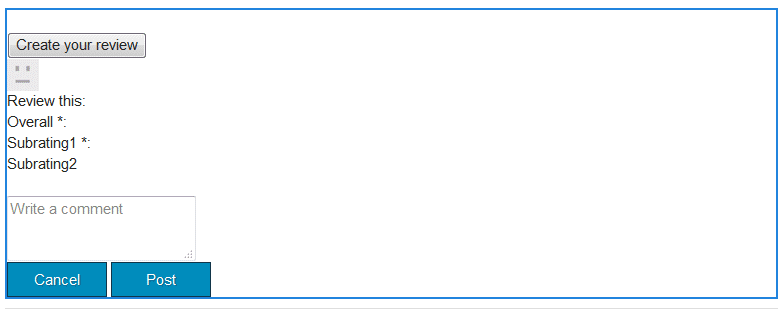

# Clientlibs für Communities-Komponenten {#clientlibs-for-communities-components}

## Einführung {#introduction}

In diesem Abschnitt der Dokumentation wird beschrieben, wie clientseitige Bibliotheken (clientlibs) zu einer Seite für Communities-Komponenten hinzugefügt werden.

Grundlegende Informationen finden Sie unter:

* [Verwenden clientseitiger Bibliotheken](../../help/sites-developing/clientlibs.md) , die Nutzungsdetails und Debugging-Tools bereitstellen
* [Clientlibs für SCF](client-customize.md#clientlibs) , die beim Anpassen von SCF-Komponenten nützliche Informationen bereitstellen
* [Blog: AEM Client-Bibliotheken, erklärt durch Beispiel](https://blogs.adobe.com/experiencedelivers/experience-management/clientlibs-explained-example/)

## Warum Clientlibs erforderlich sind {#why-clientlibs-are-required}

Clientlibs sind für das ordnungsgemäße Funktionieren (JavaScript) und die Formatierung (CSS) einer Komponente erforderlich.

Wenn für eine Funktion eine [Community-Funktion](functions.md) vorhanden ist, werden alle notwendigen Komponenten und Konfigurationen, einschließlich der erforderlichen clientlibs, auf der Community-Site vorhanden sein. Nur wenn Autoren zusätzliche Komponenten zur Verfügung stehen sollen, müssen zusätzliche clientlibs hinzugefügt werden.

Wenn die erforderlichen clientlibs fehlen, kann das [Hinzufügen einer Communities-Komponente zu einer Seite](author-communities.md) zu Javascript-Fehlern und unerwartetem Erscheinungsbild führen.

### Beispiel: Platzierte Reviews ohne Clientlibs {#example-placed-reviews-without-clientlibs}

### Beispiel: Platzierte Reviews mit Clientlibs {#example-placed-reviews-with-clientlibs}

## Identifizieren erforderlicher Clientlibs {#identifying-required-clientlibs}

Die wesentlichen Funktionsinformationen für Entwickler identifizieren die erforderlichen clientlibs.

Darüber hinaus bietet das Durchsuchen des [Community-Komponentenhandbuchs](components-guide.md) in einer AEM-Instanz Zugriff auf eine Auflistung der für eine Komponente erforderlichen clientlib-Kategorien.

Die erforderlichen clientlibs sind beispielsweise ganz oben auf der Seite [Reviews aufgeführt](http://localhost:4502/content/community-components/en/reviews.html) .

* cq.ckeditor
* cq.social.hbs.reviews

## Erforderliche Clientlibs hinzufügen {#adding-required-clientlibs}

Wenn Sie einer Seite eine Communities-Komponente hinzufügen möchten, müssen Sie die erforderlichen clientlibs für die Komponente hinzufügen, falls diese noch nicht vorhanden ist.

Verwenden Sie [CRXDE|Lite](#using-crxde-lite) , um eine vorhandene clientlibslist für eine Community-Site-Seite zu ändern.

So fügen Sie mithilfe der [CRXDE Lite](../../help/sites-developing/developing-with-crxde-lite.md)eine clientlib für eine Community-Site hinzu:

* Navigieren Sie zu [https://&lt;server>:&lt;port>/crx/de](http://localhost:4502/crx/de)
* Suchen Sie die `clientlibslist` Node der Seite, auf der Sie die Komponente hinzufügen möchten

   * `/content/sites/sample/en/page/jcr:content/clientlibslist`

* Mit `clientlibslist` ausgewählter Node

   * Suchen Sie die String[] -Eigenschaft `scg:requiredClientLibs`
   * Wählen Sie `Value` die Option zum Zugriff auf das Dialogfeld &quot;String-Array&quot;

      * Bei Bedarf scrollen
      * Auswählen `+` , um eine neue Client-Bibliothek einzugeben

         * Wiederholen, um weitere Client-Bibliotheken hinzuzufügen
      * Wählen Sie **[!UICONTROL OK]** aus
   * Select **[!UICONTROL Save All]**

>[!NOTE]
>
>Wenn die Site keine Community-Site ist, muss die Existenz oder der Speicherort der Client-Bibliotheken, die für die Site verwendet werden, ermittelt werden.

In dem Beispiel [Erste Schritte mit AEM Communities](getting-started.md) , in dem `site-name` Interaktion *stattfindet*, wird die clientliblist wie folgt angezeigt, wenn die Komponente Reviews hinzugefügt wird:

