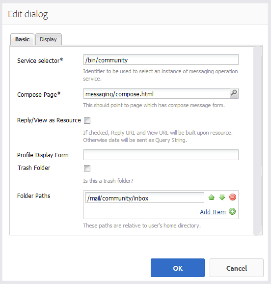

# Messaging-Funktion {#messaging-feature}

>[!CAUTION]
>
>AEM 6.4 hat das Ende der erweiterten Unterstützung erreicht und diese Dokumentation wird nicht mehr aktualisiert. Weitere Informationen finden Sie in unserer [technische Unterstützung](https://helpx.adobe.com/de/support/programs/eol-matrix.html). Unterstützte Versionen suchen [here](https://experienceleague.adobe.com/docs/?lang=de).

Zusätzlich zu den öffentlich sichtbaren Interaktionen in Foren und Kommentaren ermöglicht die Messaging-Funktion von AEM Communities es Community-Mitgliedern, privat miteinander zu interagieren.

Diese Funktion kann bei einer [Community-Site](overview.md#communitiessites) erstellt.

Die Messaging-Funktionen bieten folgende Möglichkeiten:

* Nachricht an ein oder mehrere Community-Mitglieder senden
* Nachricht an eine Community-Mitgliedergruppe senden
* Nachricht mit Anhängen senden
* Weiterleiten einer Nachricht
* Auf eine Nachricht antworten
* Nachricht löschen
* Gelöschte Nachricht wiederherstellen

Um die Messaging-Funktion zu aktivieren und zu ändern, besuchen Sie

* [Messaging konfigurieren](messaging.md) für Administratoren
* [Grundlagen zu Messaging](essentials-messaging.md) für Entwickler

>[!NOTE]
>
>Das Hinzufügen von `Compose Message, Message, or Message List` Komponenten (gefunden in `Communities`Komponentengruppe) auf eine Seite im Bearbeitungsmodus &quot;Autor&quot;klicken.

## Konfigurieren von Messaging-Komponenten {#configuring-messaging-components}

Wenn Messaging für eine Community-Site aktiviert ist, ist es vollständig eingerichtet, ohne dass eine weitere Konfiguration erforderlich ist. Diese Informationen werden bereitgestellt, wenn die Standardkonfiguration geändert werden muss.

### Nachrichtenliste konfigurieren (messageBox) {#configuring-message-list-messagebox}

Um die Konfiguration der Nachrichtenliste für **Posteingang**, **Gesendete Elemente** und **Papierkorb** Seiten der Messaging-Funktion öffnen Sie die Site in [Bearbeitungsmodus des Autors](sites-console.md#authoring-site-content).

In `Preview` -Modus, wählen Sie die **[!UICONTROL Nachrichten]** -Link, um die Hauptseite der Nachrichten zu öffnen. Wählen Sie anschließend **[!UICONTROL Posteingang, gesendete Elemente oder Papierkorb]** um die Komponente für diese Nachrichtenliste zu konfigurieren.

In `Edit` -Modus wählen Sie die Komponente auf der Seite aus.

Um auf das Konfigurationsdialogfeld zugreifen zu können, muss die Vererbung durch Auswahl der `link`Symbol.

Nach Abschluss der Konfiguration muss die Vererbung durch Auswahl der `broken link` Symbol.

Sobald die Vererbung abgebrochen wurde, kann die `configure` -Symbol, um das Konfigurationsdialogfeld zu öffnen.

#### Registerkarte „Allgemein“ {#basic-tab}

* **[!UICONTROL Dienstauswahl]**
(*Erforderlich*) Legen Sie dies auf den Wert der Eigenschaft fest. `serviceSelector.name` von [AEM Communities Messaging-Dienst](messaging.md#messaging-operations-service).

* **[!UICONTROL Seite erstellen]**
(*Erforderlich*) Die Seite, die geöffnet werden soll, wenn ein Mitglied auf die `Reply` Schaltfläche. Die Zielseite sollte die **[!UICONTROL Nachricht erstellen]** Formular.

* **[!UICONTROL Antwort/Ansicht als Ressource]**
Wenn diese Option aktiviert ist, verweisen die Antwort-URL und die Anzeigen-URL auf eine Ressource. Andernfalls werden Daten als Abfrageparameter in der URL übergeben.

* **[!UICONTROL Formular zur Profilanzeige]**
Das Profilformular, das zum Anzeigen des Senderprofils verwendet werden soll.

* **[!UICONTROL Ordner löschen]**
Wenn diese Option aktiviert ist, zeigt diese Komponente nur Nachrichten an, die als gelöscht (Papierkorb) gekennzeichnet sind.

* **[!UICONTROL Ordnerpfade]**
(*Erforderlich*) Referenzieren der für `inbox.path.name` und `sentitems.path.name` im [AEM Communities Messaging-Dienst](messaging.md#messaging-operations-service). Beim Konfigurieren von `Inbox`, fügen Sie einen Eintrag mit dem Wert von hinzu. `inbox.path.name`. Beim Konfigurieren von `Outbox`, fügen Sie einen Eintrag mit dem Wert von hinzu. `sentitems.path.name`. Wenn Sie `Trash`, fügen Sie zwei Einträge mit beiden Werten hinzu.

#### Registerkarte &quot;Anzeige&quot; {#display-tab}

* **[!UICONTROL Schaltfläche &quot;Lesen&quot;]**
Wenn diese Option aktiviert ist, zeigt eine 
`Read`-Schaltfläche, über die eine Nachricht als gelesen gekennzeichnet werden kann.

* **[!UICONTROL Schaltfläche &quot;Ungelesen markieren&quot;]**
Wenn diese Option aktiviert ist, zeigt eine 
`Mark Unread` -Schaltfläche, über die eine Nachricht als gelesen gekennzeichnet werden kann.

* **[!UICONTROL Schaltfläche &quot;Löschen&quot;]**
Wenn diese Option aktiviert ist, zeigt eine 
`Delete`-Schaltfläche, über die eine Nachricht als gelesen gekennzeichnet werden kann. Dupliziert die Löschfunktion, wenn **`Message Options`** ebenfalls aktiviert ist.

* **[!UICONTROL Nachrichtenoptionen]**
Wenn diese Option aktiviert ist, wird angezeigt. 
**`Reply`**, **`Reply All`**, **`Forward`** und **`Delete`** Schaltflächen zum erneuten Senden oder Löschen einer Nachricht. Dupliziert die Löschfunktion, wenn **`Delete Button`** ebenfalls aktiviert ist.

* **[!UICONTROL Nachrichten pro Seite]**
Die angegebene Anzahl entspricht der maximalen Anzahl an Nachrichten, die pro Seite in einem Paginierungsschema angezeigt werden. Wenn keine Zahl angegeben (leer gelassen) wird, werden alle Nachrichten angezeigt und es wird keine Paginierung durchgeführt.

* **[!UICONTROL Zeitstempelmuster]**
Stellen Sie Zeitstempelmuster für eine oder mehrere Sprachen bereit. Der Standardwert ist für en, de, fr, es, ja, zh_CN, ko_KR.

* **[!UICONTROL Benutzer anzeigen]**
Wählen Sie entweder 
**`Sender`** oder **`Recipients`** um zu bestimmen, ob der Absender oder die Empfänger angezeigt werden sollen.

### Konfigurieren der Nachricht erstellen {#configuring-compose-message}

Um die Konfiguration der Seite mit der Nachricht zum Erstellen zu ändern, öffnen Sie die Site in [Bearbeitungsmodus des Autors](sites-console.md#authoring-site-content).

In `Preview`-Modus, wählen Sie die **[!UICONTROL Nachrichten]** -Link, um die Hauptseite der Nachrichten zu öffnen. Wählen Sie dann die Schaltfläche Neue Nachricht aus, um die `Compose Message` Seite..

In `Edit` -Modus wählen Sie die Hauptkomponente auf der Seite aus, die den Nachrichtentext enthält.

Um auf das Konfigurationsdialogfeld zugreifen zu können, muss die Vererbung durch Auswahl der `link`Symbol.

Nach Abschluss der Konfiguration muss die Vererbung durch Auswahl der `broken link` Symbol.

Sobald die Vererbung abgebrochen wurde, kann die `configure` -Symbol, um das Konfigurationsdialogfeld zu öffnen.

#### Registerkarte „Allgemein“ {#basic-tab-1}

* **[!UICONTROL Umleitungs-URL]**
Geben Sie die URL der Seite ein, die nach dem Versand der Nachricht angezeigt wird. Beispiel: 
`../messaging.html`.

* **[!UICONTROL URL abbrechen]**
Geben Sie die URL der Seite ein, die angezeigt wird, wenn der Absender die Nachricht abbricht. Beispiel: 
`../messaging.html`.

* **[!UICONTROL Maximale Länge des Nachrichtenbetreibers]**
Die maximal zulässige Anzahl von Zeichen im Feld &quot;Betreff&quot;. Beispiel: 500. Der Standardwert ist keine Begrenzung.

* **[!UICONTROL Maximale Länge des Nachrichtentextes]**
Die maximal zulässige Anzahl von Zeichen im Feld Inhalt . Beispiel: 10000. Der Standardwert ist keine Begrenzung.

* **[!UICONTROL Dienstauswahl]**
(*Erforderlich*) Legen Sie dies auf den Wert der Eigenschaft fest. **`serviceSelector.name`** von [AEM Communities Messaging-Dienst](messaging.md#messaging-operations-service).

#### Registerkarte &quot;Anzeige&quot; {#display-tab-1}

* **[!UICONTROL Feld anzeigen]**
Wenn diese Option aktiviert ist, zeigen Sie die 
`Subject` und aktivieren Sie die Option Betreff zur Nachricht hinzufügen. Die Option Standard ist nicht aktiviert.

* **[!UICONTROL Betreffbezeichnung]**
Geben Sie den Text ein, der neben dem 
`Subject` field. Der Standardwert ist `Subject`.

* **[!UICONTROL Feld für Dateianhang anzeigen]**
Wenn diese Option aktiviert ist, zeigen Sie die 
`Attachment` und aktivieren Sie das Hinzufügen von Dateianlagen zur Nachricht. Die Option Standard ist nicht aktiviert.

* **[!UICONTROL Dateinamen anhängen]**
Geben Sie den Text ein, der neben dem 
`Attachment` field. Der Standardwert ist **`Attach File`**.

* **[!UICONTROL Inhaltsfeld anzeigen]**
Wenn diese Option aktiviert ist, zeigen Sie die 
`Content` und aktivieren Sie das Hinzufügen eines Nachrichtentextes. Die Option Standard ist nicht aktiviert.

* **[!UICONTROL Inhaltsbezeichnung]**
Geben Sie den Text ein, der neben dem 
`Content` field. Der Standardwert ist **`Body`**.

* **[!UICONTROL Mit Rich-Text-Editor]**
Ist diese Option aktiviert, wird die Verwendung eines benutzerdefinierten Textfelds &quot;Inhalt&quot;mit einem eigenen Rich-Text-Editor angezeigt. Die Option Standard ist nicht aktiviert.

* **[!UICONTROL Zeitstempelmuster]**
Stellen Sie Zeitstempelmuster für eine oder mehrere Sprachen bereit. Der Standardwert ist für en, de, fr, es, ja, zh_CN, ko_KR.
