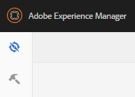

# Communities-Konsolen {#communities-consoles}

Die AEM Communities-Konsolen, die im globalen Navigationsbereich in der Autorenumgebung verfügbar sind, bieten Zugriff auf Verwaltungsaufgaben wie

* [Erstellen einer Community-Site](sites-console.md)
* Hinzufügen von [Gruppen](groups.md) innerhalb der Site verschachtelt
* Verwalten von [Community-Site-Vorlagen](sites.md)
* Verwalten von [Community-Mitgliedern](members.md)
*  Moderieren benutzergenerierter Inhalte
* Erstellen Sie [benutzerdefinierte Abzeichen](badges.md)
* Konfigurieren des [Standardspeichers für UGC](srp-config.md)

Wenn [UGC-Speicher](working-with-srp.md) als gemeinsamer Speicher für Autoren- und Veröffentlichungsumgebungen konfiguriert ist, wird die [Moderationskonsole](moderation.md), die sowohl in der Autoren- als auch in der Veröffentlichungsumgebung verfügbar ist, auf einer Einzelinstanz von UGC ausgeführt.

In der Autorenumgebung sind nach der Anmeldung mit Administratorrechten die `Communities` -Konsolen in den Navigations- und Tools-Konsolen verfügbar.

>[!NOTE]
>
>In der Veröffentlichungsumgebung zeigt eine [Community-Site](sites-console.md) ein `Administration`Menüelement an, wenn das angemeldete Mitglied über die entsprechenden Berechtigungen verfügt.

## Globales Navigationsfenster {#global-navigation-panel}

Wählen Sie das Symbol `Adobe Experience Manager` in der oberen linken Ecke aus, um das globale Navigationsfenster zu öffnen und auf zwei Symbole zuzugreifen:

* [Navigationskonsole](#navigation-console)
* [Tools-Konsole](tools.md)

## Navigationskonsole {#navigation-console}

Um auf die verschiedenen Communities-Konsolen zuzugreifen, wählen Sie in der globalen Navigation **Navigation, Communities** aus.

* [Sites](sites-console.md)

   Die Sites-Konsole ist in der Autorenumgebung verfügbar, um Community-Sites und deren [Gruppen](groups.md) zu erstellen und zu verwalten.

* [Moderation](moderation.md)

   Die Moderationskonsole ist für die Massenmoderation von UGC und in der Autorenumgebung vorgesehen. Eine ähnliche Massenmoderationskonsole ist in der Veröffentlichungsumgebung für Community-Mitglieder verfügbar, denen die Rolle [Community-Moderator](users.md#publishenvironmentusersandgroups) für eine oder mehrere Community-Sites zugewiesen wurde.

* [Mitglieder, Gruppen](members.md)

   Die Mitglieder- und Gruppenkonsolen dienen der Verwaltung von Community-Mitgliedern und Mitgliedergruppen, die in der Veröffentlichungsumgebung in der Autorenumgebung vorhanden sind.

* [Berichte](reports.md)

   In der Konsole &quot;Berichte&quot;können Berichte über Zuweisungen, Seitenansichten und veröffentlichte Inhalte (UGC) erstellt werden, wenn für eine Community-Site [Adobe Analytics](sites-console.md#analytics) aktiviert ist. Die Konsole ist nur in der Autorenumgebung verfügbar.

* [Ressourcen](resources.md)

   In der Ressourcenkonsole erstellen, verwalten und weisen [Aktivierungsmanager](enablement.md#communitymanagers) Ressourcen zu Mitgliedern einer [Aktivierungs-Community-Site](overview.md#enablement-community) zu. Die Konsole ist nur in der Autorenumgebung verfügbar.

## Tools-Konsole {#tools-console}

So greifen Sie über die globale Navigation auf [Communities-Tools](tools.md) (ehemals Administration Console) zu: **[!UICONTROL Tools > Communities]**
